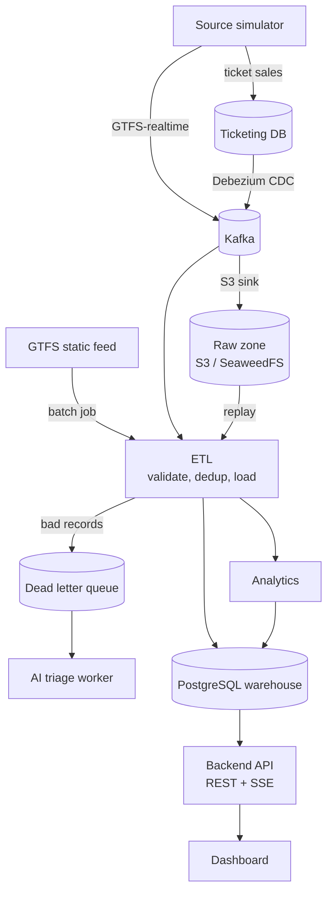

# Public Transport Intelligence

A data platform that turns fragmented public transport data (planned schedules, live vehicle positions and ticket sales) into clean, trustworthy data and actionable insight: bus bunching alerts, service disruption detection, arrival predictions and on-time performance.

The core of the project is the **ETL pipeline**. It answers one question:

> How do you design an ETL pipeline that handles heterogeneous data (batch and near real-time) and stays correct when things fail: no data loss, no duplicates, automatic recovery?

The answer is effectively-once delivery, fault isolation, a dead letter queue and replay across both streaming and batch processing, backed by a set of measurable experiments.

> **Status: design phase.** The design documents are written and under review. Implementation has not started yet, so the repository currently contains documentation and sample data only. See the [roadmap](#roadmap).

## What it does

| Area | Capability |
| --- | --- |
| Ingestion | GTFS static (batch), GTFS-realtime (Kafka) and ticketing (CDC with Debezium) |
| Data quality | Schema and business rule validation; bad records go to a dead letter queue without stopping the batch |
| Correctness | Deduplication by business key and upsert, with Kafka offsets committed only after the database transaction commits |
| Recovery | Checkpoint and restart, DLQ replay, and a full warehouse rebuild from the raw zone |
| Analytics | Bus bunching and service disruption (near real-time), ETA prediction and on-time performance (scheduled), ticketing anomalies |
| AI triage | Classifies DLQ records and anomalies, auto-resolves them within confidence thresholds, and suggests dispatch actions |
| Dashboard | Live vehicle map, alert feed, route scorecard, stop detail and an ops console for jobs, DLQ and replay |
| Observability | Metrics, traces and logs correlated by `batch_id`, with Grafana dashboards and alerting |

Real transit systems are not connected. A **source simulator** plays that role, replaying a real GTFS feed with controllable scenarios (bunching, disruption, malformed data, duplicates, ticketing anomalies). Everything from Kafka onward is real infrastructure.

## Architecture



All reliability mechanisms (idempotency, retry, DLQ, checkpoint) live in the ETL layer. Downstream layers only read data that has passed through it.

### Deployment units

| Unit | Role |
| --- | --- |
| `etl` (profile `stream`) | Spring Kafka batch listeners, near real-time analytics, UI event publishing |
| `etl` (profile `batch`) | Spring Batch jobs: GTFS static load, replay, scheduled analytics |
| `triage-worker` | Asynchronous AI triage of DLQ records and anomalies |
| `api` | REST and Server-Sent Events, the only entry point for the frontend |
| `source-simulator` | Generates GTFS-realtime events and ticketing transactions |
| `db` | Flyway migration runner |

## Tech stack

| Layer | Technology |
| --- | --- |
| Backend | Java 25, Spring Boot 4, Spring Batch, Spring Kafka, Spring Security, Flyway, Gradle |
| Streaming | Apache Kafka (KRaft), Kafka Connect, Debezium, S3 sink connector |
| Storage | PostgreSQL (star schema warehouse), SeaweedFS (S3-compatible raw zone) |
| Frontend | React 19, TypeScript, Vite, TanStack Router/Query, Tailwind CSS, shadcn/ui, MapLibre GL with offline PMTiles, ECharts |
| Auth | Keycloak (OAuth2 resource server) |
| Observability | Micrometer, OpenTelemetry, Prometheus, Grafana, Tempo, Loki, Alertmanager |
| Deployment | Docker Compose (dev and demo), Kubernetes on k3d with Helm, Strimzi, CloudNativePG, KEDA, Chaos Mesh |
| Experiments | Python, Toxiproxy |

Pinned versions and the versioning policy are in [docs/03-architecture/tech-stack-and-versions.md](docs/03-architecture/tech-stack-and-versions.md).

## Experiments

Pipeline correctness is verified by measurement, not by assertion alone.

| ID | Experiment | Target |
| --- | --- | --- |
| EXP-01 | Crash recovery (`kill -9` mid-chunk) | Zero loss, zero duplicates |
| EXP-02 | Message redelivery | Zero duplicates |
| EXP-03 | Fault isolation at 1/5/20% bad records | 100% of valid records loaded |
| EXP-04 | Warehouse rebuild from the raw zone | Checksums match for every table |
| EXP-05 | End-to-end latency under baseline load | p95 < 10 s |
| EXP-06 | AI triage versus a rule-based baseline | Automation rate at ≥ 95% precision |
| EXP-07 | Autoscaling at 10× load on k3d | p95 < 10 s |
| EXP-08 | Chaos: pod, broker, database primary and external service failures | Self-healing, zero loss, zero duplicates |

Protocols are in [docs/10-testing/experiments/](docs/10-testing/experiments/).

## Repository layout

```
.
├── public-transport-intelligence.md   # Original system design document
├── docs/                              # Detailed design documentation
│   ├── 00-master-plan.md              # Master plan, phases, traceability matrix
│   ├── 00-decision-register.md        # All decisions made so far
│   ├── 01-product/                    # Vision, personas, requirements, use cases
│   ├── 03-architecture/               # Containers, data flows, message contracts
│   ├── 04-adr/                        # Architecture decision records
│   ├── 05-data/ … 11-report/          # Data, design, API, UX, operations, testing
└── sample-data/gtfs/                  # Pinned GTFS static feed and profiling scripts
```

The documentation is written in Vietnamese. Everything else (code, UI, logs, API messages, commits) is in English. Start with [docs/README.md](docs/README.md).

## Getting started (planned)

The local environment is specified but not built yet. Once phase 1 lands, it will look like this:

```bash
mise install     # Java 25, Node 24, pnpm, Python, uv and Kubernetes tooling
make doctor      # check tools, Docker memory, free disk and ports
make secrets     # create .env with generated passwords
make up          # build images and start the core profile
```

Requirements: 16 GB RAM (12 GB allocated to the Docker VM with every profile enabled), 8 CPU cores and about 80 GB of free disk. See [docs/09-operations/local-dev.md](docs/09-operations/local-dev.md).

## Roadmap

| Phase | Scope | Milestone |
| --- | --- | --- |
| P0 | Specification, decisions, spikes | Decisions settled, core documents approved |
| P1 | Infrastructure and data sources | `make up` works; events reach Kafka; CDC and raw zone running |
| P2 | Core ETL (Spring Batch + Spring Kafka) | Data in the warehouse; `kill -9` causes no loss or duplicates |
| P3 | Reliability experiments and observability | EXP-01…05 results; Grafana; alerts |
| P4 | Analytics and API | Real insights over REST and SSE |
| P5 | Dashboard | Full real-time UI |
| P6 | AI triage | Triage, auto-replay, suggestions in the UI |
| P7 | Kubernetes and fault tolerance | Autoscaling and self-healing; EXP-07/08 results |
| P8 | Polish | Ready for the final defense |

## Data attribution

Schedule data: Metro Transit / Metropolitan Council (Minneapolis–St. Paul, MN, USA), published as public data under the Minnesota Government Data Practices Act. See [sample-data/gtfs/README.md](sample-data/gtfs/README.md).
