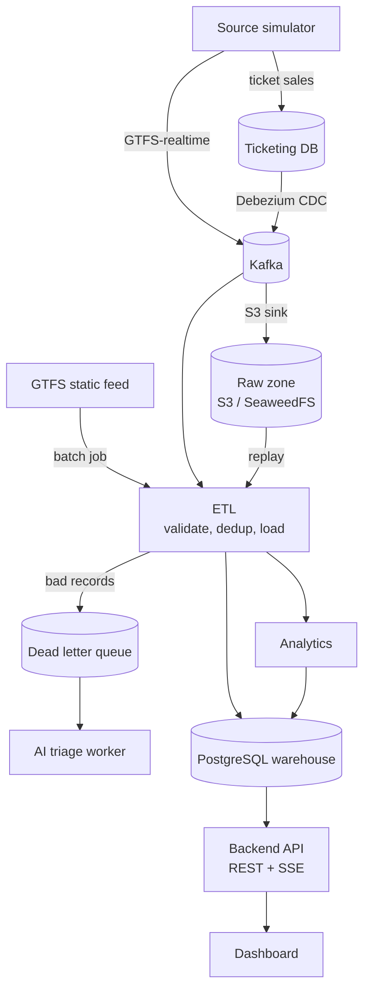

# Public Transport Intelligence

A data platform that turns fragmented public transport data (planned schedules, live vehicle positions and ticket sales) into clean, trustworthy data and actionable insight: bus bunching alerts, service disruption detection, arrival predictions and on-time performance.

The core of the project is the **ETL pipeline**. It answers one question:

> How do you design an ETL pipeline that handles heterogeneous data (batch and near real-time) and stays correct when things fail: no data loss, no duplicates, automatic recovery?

The answer is effectively-once delivery, fault isolation, a dead letter queue and replay across both streaming and batch processing, backed by a set of measurable experiments.

> **Status: phase 4 (analytics and API) complete; phase 5 (dashboard) is next.** One command starts the local stack: the simulator publishes GTFS-realtime and writes ticket sales that Debezium captures, `etl-batch` loads the GTFS feed, and `etl-stream` writes every source into the warehouse exactly once, with a dead-letter queue, replay from the raw zone and post-write data quality checks. On top of it, analytics detect bus bunching and service disruptions within seconds, aggregate historical ETAs and score on-time performance, and can be recomputed after a replay. The API serves routes, stops, live vehicles, arrivals, insights, alerts and the ETL operations over REST secured by Keycloak, and pushes vehicle positions and alerts to the browser over server-sent events. Grafana dashboards, traces, logs and alerts cover the pipeline, and the 30-minute smoke run of experiments EXP-01…05 still passes with analytics on: a killed consumer, redelivered messages, 5% bad records, a load ramp to 10× and a warehouse rebuild from the raw zone lose and duplicate nothing. The full experiment runs come after phase 6. Implementation follows the [roadmap](#roadmap).

## What it does

| Area | Capability |
| --- | --- |
| Ingestion | GTFS static (batch), GTFS-realtime (Kafka) and ticketing (CDC with Debezium) |
| Data quality | Schema and business rule validation; bad records go to a dead letter queue without stopping the batch |
| Correctness | Deduplication by business key and upsert, with Kafka offsets committed only after the database transaction commits |
| Recovery | Checkpoint and restart, DLQ replay, and a full warehouse rebuild from the raw zone |
| Analytics | Bus bunching and service disruption (near real-time), ETA prediction and on-time performance (scheduled), ticketing anomalies |
| AI triage | Classifies DLQ records and anomalies, auto-resolves them within confidence thresholds, and suggests dispatch actions |
| Dashboard | Live vehicle map, alert feed, route scorecard, stop detail and an ops console for jobs, DLQ and replay |
| Observability | Metrics, traces and logs correlated by `batch_id`, with Grafana dashboards and alerting |

Real transit systems are not connected. A **source simulator** plays that role, replaying a real GTFS feed with controllable scenarios (bunching, disruption, malformed data, duplicates, ticketing anomalies). Everything from Kafka onward is real infrastructure.

## Architecture



All reliability mechanisms (idempotency, retry, DLQ, checkpoint) live in the ETL layer. Downstream layers only read data that has passed through it.

### Deployment units

| Unit | Role |
| --- | --- |
| `etl` (profile `stream`) | Spring Kafka batch listeners, near real-time analytics, UI event publishing |
| `etl` (profile `batch`) | Spring Batch jobs: GTFS static load, replay, scheduled analytics |
| `triage-worker` | Asynchronous AI triage of DLQ records and anomalies |
| `api` | REST and Server-Sent Events, the only entry point for the frontend |
| `source-simulator` | Generates GTFS-realtime events and ticketing transactions |
| `db` | Flyway migration runner |

Inside each Java module, code follows Clean Architecture: feature packages, each split into `domain`, `application`, `adapter` and `config`, with the dependency rule enforced by ArchUnit. New modules follow it from the start; the P1–P3 modules are refactored in phase R. See [docs/03-architecture/clean-architecture.md](docs/03-architecture/clean-architecture.md).

## Tech stack

| Layer | Technology |
| --- | --- |
| Backend | Java 25, Spring Boot 4, Spring Batch, Spring Kafka, Spring Security, Flyway, Gradle |
| Streaming | Apache Kafka (KRaft), Kafka Connect, Debezium, S3 sink connector |
| Storage | PostgreSQL (star schema warehouse), SeaweedFS (S3-compatible raw zone) |
| Frontend | React 19, TypeScript, Vite, TanStack Router/Query, Tailwind CSS, shadcn/ui, MapLibre GL with offline PMTiles, ECharts |
| Auth | Keycloak (OAuth2 resource server) |
| Observability | Micrometer, OpenTelemetry, Prometheus, Grafana, Tempo, Loki, Alertmanager |
| Deployment | Docker Compose (dev and demo), Kubernetes on k3d with Helm, Strimzi, CloudNativePG, KEDA, Chaos Mesh |
| Experiments | Python, Toxiproxy |

Pinned versions and the versioning policy are in [docs/03-architecture/tech-stack-and-versions.md](docs/03-architecture/tech-stack-and-versions.md).

## Experiments

Pipeline correctness is verified by measurement, not by assertion alone.

| ID | Experiment | Target |
| --- | --- | --- |
| EXP-01 | Crash recovery (`kill -9` mid-chunk) | Zero loss, zero duplicates |
| EXP-02 | Message redelivery | Zero duplicates |
| EXP-03 | Fault isolation at 1/5/20% bad records | 100% of valid records loaded |
| EXP-04 | Warehouse rebuild from the raw zone | Checksums match for every table |
| EXP-05 | End-to-end latency under baseline load | p95 < 10 s |
| EXP-06 | AI triage versus a rule-based baseline | Automation rate at ≥ 95% precision |
| EXP-07 | Autoscaling at 10× load on k3d | p95 < 10 s |
| EXP-08 | Chaos: pod, broker, database primary and external service failures | Self-healing, zero loss, zero duplicates |

Protocols are in [docs/10-testing/experiments/](docs/10-testing/experiments/). The 30-minute smoke run of EXP-01…05 passed on 2026-09-30 ([results](docs/00-master-plan.md#phase-3-thực-nghiệm-độ-tin-cậy-và-observability)) and again with phase 4 on 2026-10-02 ([results](docs/00-master-plan.md#phase-4-analytics-và-api)); the full runs with 10–30 repetitions each follow after phase 6.

## Repository layout

```
.
├── backend/                           # Gradle multi-module build (Java 25, Spring Boot 4)
├── frontend/                          # React + Vite dashboard
├── deploy/                            # Compose, k3d, Helm, Kafka Connect, Chaos Mesh, base map tiles
├── experiments/                       # Python experiment runner
├── docs/                              # Detailed design documentation
│   ├── 00-master-plan.md              # Master plan, phases, traceability matrix
│   ├── 00-decision-register.md        # All decisions made so far
│   ├── 01-product/                    # Vision, personas, requirements, use cases
│   ├── 03-architecture/               # Containers, data flows, message contracts
│   ├── 04-adr/                        # Architecture decision records
│   └── 05-data/ … 11-report/          # Data, design, API, UX, operations, testing
├── sample-data/gtfs/                  # Pinned GTFS static feed and profiling scripts
├── spikes/                            # Phase 0 spikes, not part of the build
├── Makefile                           # Entry point for every stack (`make help`)
├── mise.toml                          # Pinned developer tools
└── public-transport-intelligence.md   # Original system design document
```

The documentation is written in Vietnamese. Everything else (code, UI, logs, API messages, commits) is in English. Start with [docs/README.md](docs/README.md). The layout is explained in [ADR-0030](docs/04-adr/0030-monorepo-layout.md), and the contribution rules in [CONTRIBUTING.md](CONTRIBUTING.md).

## Getting started

```bash
mise install     # Java 25, Node 24, pnpm, Python, uv and Kubernetes tooling
make doctor      # check tools, Docker memory, free disk and ports
make secrets     # create .env with generated passwords
make up          # build images, start the core profile and wait until it is healthy
make sim-start   # the simulator starts paused; this makes it publish
```

On the first start `etl-batch` loads the pinned GTFS feed (about a minute); `etl-stream` turns ready once that feed is active. Then `make sim-status`, `make tail-gtfs.vehicle_positions`, `make connectors` and `make s3-ls` show the data moving, and `make psql-wh Q='select count(*) from dw.fact_vehicle_position'` shows it arriving in the warehouse; `make sim-stop` pauses it again. The ETL health is on `localhost:9082/actuator/health/sources` (stream) and `localhost:9083/actuator/health` (batch). The feed runs on Chicago time, so between 02:00 and 04:30 there (afternoon in Vietnam) no vehicles are in service: run `make clock-offset AT=16:30 && make up` first. `make help` lists every target.

The API is on `localhost:8081` ([endpoints](docs/07-api/api-endpoints.md)). Public endpoints need no token, for example `curl localhost:8081/api/v1/vehicles/live`; `make token ROLE=viewer` (or `ROLE=operator`) prints a token of a demo user for the others: `curl -H "Authorization: Bearer $(make -s token ROLE=viewer)" localhost:8081/api/v1/etl/jobs`. `curl -N 'localhost:8081/api/v1/stream?channels=vehicles,alerts'` shows the real-time events ([SSE events](docs/07-api/sse-events.md)).

`make up-obs` adds Prometheus, Grafana (`localhost:3000`, user `admin`, password `GRAFANA_ADMIN_PASSWORD` in `.env`), Loki, Tempo and Mailpit (`localhost:8025`, where alerts arrive). `make backup` and `make backup-verify` dump and check the databases; `make restore-warehouse TS=<dir>` restores one.

To run the experiments (the stack with Toxiproxy and the baseline consumer, then the 30-minute smoke chain):

```bash
make up-exp
cd experiments && uv run pti-exp env check && uv run pti-exp smoke
```

Results land in `experiments/results/smoke/<series>/`. Protocols and the full runs are described in [docs/10-testing/experiments/](docs/10-testing/experiments/).

Requirements: 16 GB RAM (12 GB allocated to the Docker VM with every profile enabled), 8 CPU cores and about 80 GB of free disk. See [docs/09-operations/local-dev.md](docs/09-operations/local-dev.md).

## Roadmap

| Phase | Scope | Milestone | Status |
| --- | --- | --- | --- |
| P0 | Specification, decisions, spikes | Decisions settled, core documents approved | Done |
| P1 | Infrastructure and data sources | `make up` works; events reach Kafka; CDC and raw zone running | Done (2026-09-29) |
| P2 | Core ETL (Spring Batch + Spring Kafka) | Data in the warehouse; `kill -9` causes no loss or duplicates | Done (2026-09-29) |
| P3 | Reliability experiments and observability | Experiment runner and a 30-minute smoke run of EXP-01…05; Grafana; alerts | Done (2026-09-30) |
| P4 | Analytics and API | Real insights over REST and SSE | Done (2026-10-02) |
| P5 | Dashboard | Full real-time UI | Next |
| P6 | AI triage | Triage, auto-replay, suggestions in the UI | |
| R | Clean Architecture refactor of the P1–P3 code | Frozen ArchUnit violations reach zero; fault-injection tests and the smoke run still pass | |
| P7 | Kubernetes and fault tolerance | Full EXP-01…05 runs first (P3-10); autoscaling and self-healing; EXP-07/08 results | |
| P8 | Polish | Ready for the final defense | |

## Data attribution

Schedule data: Metro Transit / Metropolitan Council (Minneapolis–St. Paul, MN, USA), published as public data under the Minnesota Government Data Practices Act. See [sample-data/gtfs/README.md](sample-data/gtfs/README.md).

## License

[MIT](LICENSE). The GTFS feed under `sample-data/` keeps its own terms (see above).
