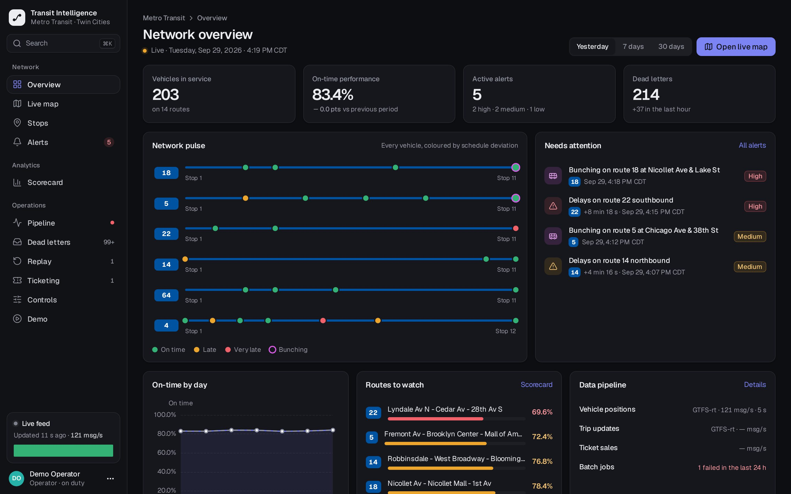
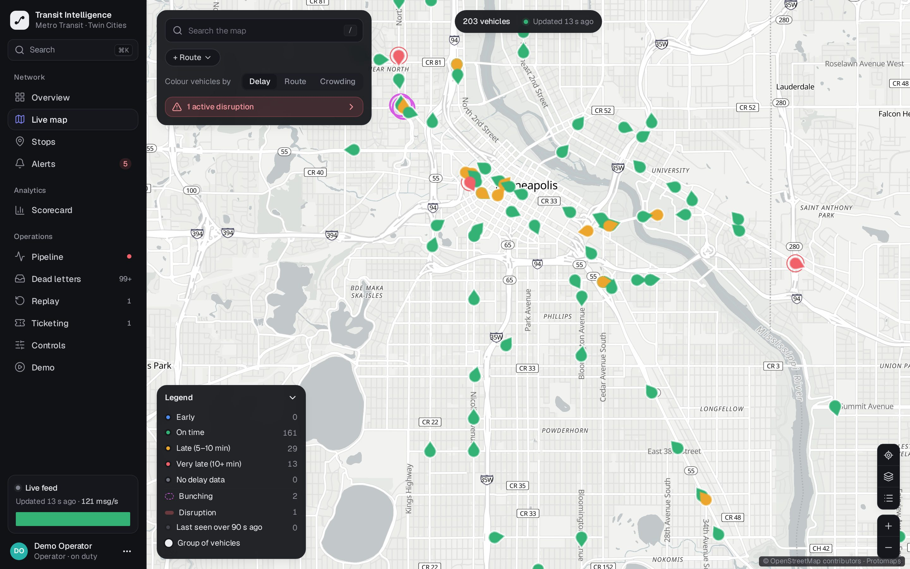
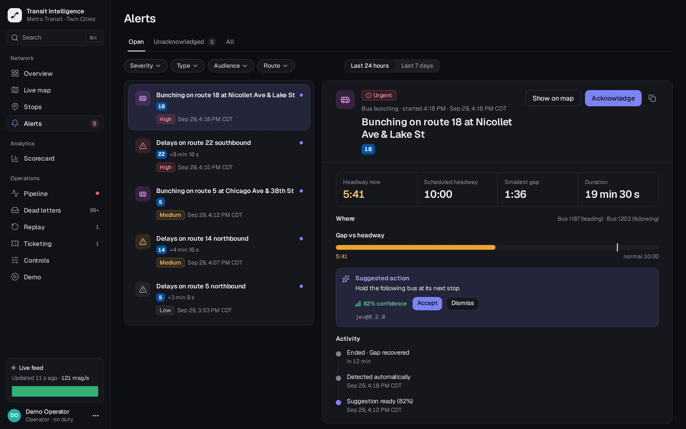
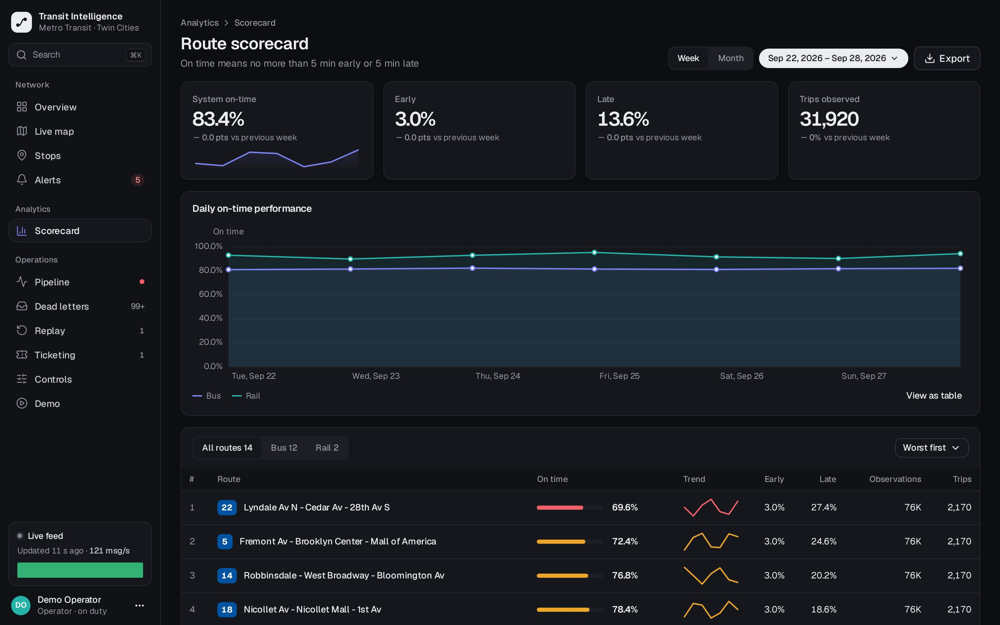
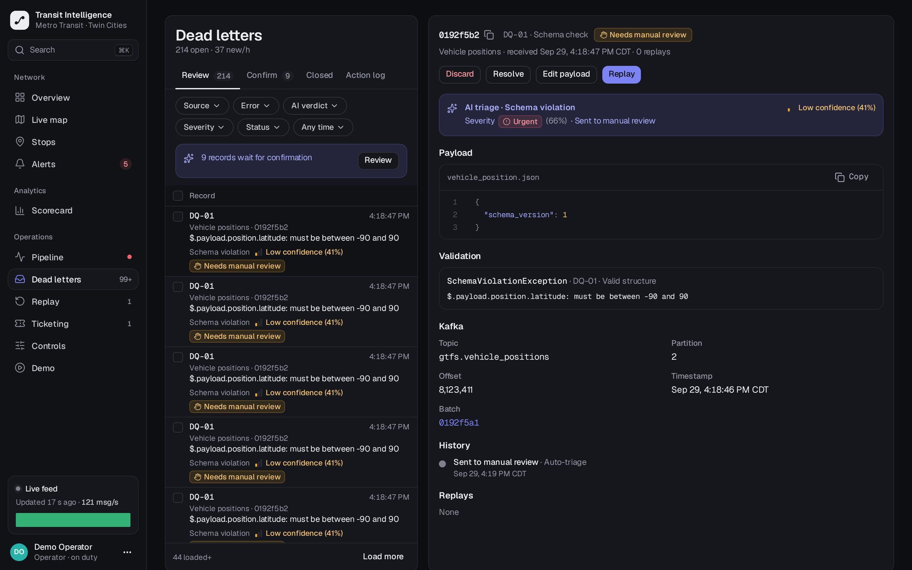
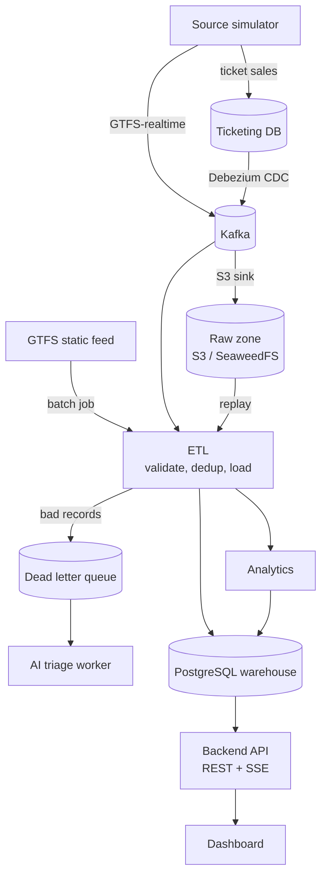

<div align="center">

# PTI · Public Transport Intelligence

**See your whole network live, on data you can actually trust.**

PTI unifies schedules, live vehicle positions and ticketing into one reliable data platform,
then turns it into real-time alerts and performance insight for your operations team.

**[🌐 pti.nigb.dev](https://pti.nigb.dev/)**

[Product tour](#product-tour) · [Why PTI](#why-pti) · [Architecture](#architecture) · [Experiments](#proven-by-breaking-it) · [Getting started](#getting-started) · [Roadmap](#roadmap)


<picture>
  <source media="(prefers-color-scheme: light)" srcset="landing/assets/overview-light.jpg">
  
</picture>

<sub>Real PTI screens running on the public Metro Transit (Minneapolis–St. Paul) GTFS feed. Works with GTFS, GTFS-realtime and your ticketing database. No changes to the systems you already run.</sub>

</div>

<br>

| **0** | **0** | **100%** | **Seconds** |
| :---: | :---: | :---: | :---: |
| records lost when a server is killed mid-load | duplicates when messages are delivered twice | of valid records kept with 20% bad input | from a vehicle's position to an alert on screen |

<sub>Measured by PTI's own fault-injection suite: crash recovery, message redelivery and corrupted-input runs. See [Proven by breaking it](#proven-by-breaking-it).</sub>

---

## The problem

Transit networks produce data every second. Most teams can't trust it. Schedules, vehicle trackers and ticketing systems were never built to work together, so the control room reacts late and reports disagree with each other.

| | Problem | What it costs |
| --- | --- | --- |
| **01** | **Problems are found after passengers feel them.** Bunched buses and service gaps surface through complaints or end-of-day reports, long after a dispatcher could have acted. | Longer waits, crowded vehicles, lost riders |
| **02** | **Bad data silently breaks good data.** One malformed feed stops a nightly job. Retries create duplicates. Outages leave gaps nobody notices until the numbers look wrong. | KPIs nobody believes, hours of manual cleanup |
| **03** | **Plan and reality live in different systems.** Comparing the timetable with what actually ran means stitching exports together by hand, so on-time performance is measured monthly, not daily. | Planning decisions made on stale evidence |

## Product tour

One platform from raw feed to the dispatcher's next move.

### Live map: every vehicle, colour-coded by how late it is

A live map of the whole network on offline vector tiles. Problems stand out at a glance instead of hiding in a table.

- Delay, route or crowding colouring with one click.
- Bunching and disruptions highlighted directly on the map.
- Pushed to the browser as positions arrive, no refresh.
- Search any route, stop or vehicle instantly.

<picture>
  <source media="(prefers-color-scheme: light)" srcset="landing/assets/map-light.jpg">
  
</picture>

### Alerts & actions: alerts that arrive with a suggested fix

PTI detects bus bunching and service disruptions automatically, explains what is happening and recommends what to do next.

- Bunching detection against each route's scheduled headway.
- Disruption detection when delays break from the normal pattern.
- Suggested actions such as holding the following bus, with a confidence score.
- Acknowledge and track every alert from detection to recovery.

<picture>
  <source media="(prefers-color-scheme: light)" srcset="landing/assets/alerts-light.jpg">
  
</picture>

### Performance: know which routes run on time, every day

Every trip is compared with the timetable automatically, so on-time performance is a daily number, not a monthly spreadsheet.

- Route scorecard ranking the network from worst to best.
- Daily trends by mode, route, stop and hour.
- Delay heatmaps and stop profiles that show where lateness builds up.
- Export for board reports and operator contracts.

<picture>
  <source media="(prefers-color-scheme: light)" srcset="landing/assets/scorecard-light.jpg">
  
</picture>

### Data quality: bad records are quarantined, never lost

Every record is validated on the way in. Invalid ones go to a review queue with the exact reason, while everything else keeps flowing.

- Clear validation errors down to the field that failed.
- Edit and replay a record in one action, without creating duplicates.
- AI triage classifies and prioritises records for review.
- Full lineage back to the source message and batch.

<picture>
  <source media="(prefers-color-scheme: light)" srcset="landing/assets/dead-letters-light.jpg">
  
</picture>

### And more

| Screen | What it gives you |
| --- | --- |
| **Network overview** | Vehicles, on-time rate, alerts and pipeline health on one screen |
| **Stop arrivals** | Predicted arrivals per stop, learned from your own running times |
| **Ticketing anomalies** | Unusual refunds and sales spikes flagged next to service data |
| **Pipeline console** | Throughput, stage health, job runs, restart, stop and replay |

## Why PTI

**Most dashboards assume the data is right. PTI proves it.** Reliability is engineered into the platform and verified by deliberately breaking it: killed processes, redelivered messages, corrupted input and full rebuilds.

| | |
| --- | --- |
| 🛡️ **No loss, no duplicates** | Every record is written exactly once, even when a server crashes mid-load or the network delivers a message twice. |
| ⚡ **Real-time and batch, one platform** | Live positions and nightly schedule loads share one validated pipeline, so live and historical numbers always agree. |
| 🔁 **Rebuild from history any time** | Every raw event is archived. Fix a rule, then recompute the whole warehouse from source with matching checksums. |
| 🔌 **Open standards, no lock-in** | GTFS, GTFS-realtime and change data capture. PTI plugs into your AVL and ticketing systems instead of replacing them. |
| 🔒 **Your data stays with you** | Self-hosted on-premise or in your private cloud, with single sign-on and role-based access. |
| 🤖 **AI-assisted operations** *(expanding)* | Triage of bad records, anomaly classification and dispatch suggestions, always with a confidence score and a human in the loop. |

| | Typical approach | With PTI |
| --- | --- | --- |
| Detecting bunching | Complaints and next-day reports | Automatic alert within seconds |
| A malformed record | Fails the whole job overnight | Quarantined; everything else loads |
| Retry after an outage | Duplicates or silent gaps | Exactly-once result, verified |
| Fixing a business rule | Old data stays wrong | Recompute from the raw archive |
| On-time performance | Spreadsheet, once a month | Every trip, every day |

## How it works

From your feeds to live insight in four steps.

| Step | | Built on |
| --- | --- | --- |
| **1. Connect your sources** | Point PTI at your timetable, vehicle feed and ticketing database. Nothing changes in those systems. | GTFS · GTFS-realtime · CDC |
| **2. Validate and load** | Every record is checked, deduplicated and written once. Anything invalid is quarantined with its reason. | Kafka · raw archive |
| **3. Analyse in real time** | Bunching, disruptions, arrival predictions and on-time performance are computed as data arrives. | PostgreSQL · analytics |
| **4. Act and recover** | Dispatchers work from the live map and alerts; data teams fix and replay from the ops console. | Dashboard · REST API · SSE |

The full data flow, the deployment units and the reliability design are under [Architecture](#architecture).

## Who it's for

Built for the people who keep a network moving.

| | You are… | You get |
| --- | --- | --- |
| 🚌 **Transit operators & agencies**<br><sub>Operations control, dispatch</sub> | Running buses, trams or metro and need to see problems while they are happening, not in tomorrow's report. | A live network view, automatic bunching and disruption alerts, and daily on-time performance. |
| 📊 **Planners & transport authorities**<br><sub>Planning, performance, operator contracts</sub> | Setting service levels, assessing operators or redesigning routes, and need evidence that holds up to scrutiny. | Route scorecards, delay heatmaps and ridership signals from one trusted dataset. |
| 🛠️ **Data & IT teams**<br><sub>Data engineering, platform</sub> | Maintaining the pipelines behind transit reporting and spending too much time on reruns, duplicates and silent gaps. | A fault-tolerant pipeline with quarantine, replay, lineage and full observability. |
| 🏙️ **Smart-city programmes & integrators**<br><sub>Solution partners</sub> | Delivering mobility platforms for cities and need a reliable transit data core that integrates through open standards. | A deployable platform with a documented REST API and a real-time event stream. |

## Architecture

At its core PTI is an **ETL pipeline** built to answer one question:

> How do you design an ETL pipeline that handles heterogeneous data (batch and near real-time) and stays correct when things fail: no data loss, no duplicates, automatic recovery?

The answer is effectively-once delivery, fault isolation, a dead letter queue and replay across both streaming and batch processing, backed by a set of measurable experiments.



All reliability mechanisms (idempotency, retry, DLQ, checkpoint) live in the ETL layer. Downstream layers only read data that has passed through it.

Real transit systems are not connected. A **source simulator** plays that role, replaying a real GTFS feed with controllable scenarios (bunching, disruption, malformed data, duplicates, ticketing anomalies). Everything from Kafka onward is real infrastructure.

### What it does

| Area | Capability |
| --- | --- |
| Ingestion | GTFS static (batch), GTFS-realtime (Kafka) and ticketing (CDC with Debezium) |
| Data quality | Schema and business rule validation; bad records go to a dead letter queue without stopping the batch |
| Correctness | Deduplication by business key and upsert, with Kafka offsets committed only after the database transaction commits |
| Recovery | Checkpoint and restart, DLQ replay, and a full warehouse rebuild from the raw zone |
| Analytics | Bus bunching and service disruption (near real-time), ETA prediction and on-time performance (scheduled), ticketing anomalies |
| AI triage | Classifies DLQ records and anomalies, auto-resolves them within confidence thresholds, and suggests dispatch actions |
| Dashboard | Live vehicle map, alert feed, route scorecard, stop detail and an ops console for jobs, DLQ and replay |
| Observability | Metrics, traces and logs correlated by `batch_id`, with Grafana dashboards and alerting |

### Deployment units

| Unit | Role |
| --- | --- |
| `etl` (profile `stream`) | Spring Kafka batch listeners, near real-time analytics, UI event publishing |
| `etl` (profile `batch`) | Spring Batch jobs: GTFS static load, replay, scheduled analytics |
| `triage-worker` | Asynchronous AI triage of DLQ records and anomalies |
| `api` | REST and Server-Sent Events, the only entry point for the frontend |
| `source-simulator` | Generates GTFS-realtime events and ticketing transactions |
| `db` | Flyway migration runner |

Inside each Java module, code follows Clean Architecture: feature packages, each split into `domain`, `application`, `adapter` and `config`, with the dependency rule enforced by ArchUnit. New modules follow it from the start; the P1–P3 modules are refactored in phase R. See [docs/03-architecture/clean-architecture.md](docs/03-architecture/clean-architecture.md).

### Tech stack

| Layer | Technology |
| --- | --- |
| Backend | Java 25, Spring Boot 4, Spring Batch, Spring Kafka, Spring Security, Flyway, Gradle |
| Streaming | Apache Kafka (KRaft), Kafka Connect, Debezium, S3 sink connector |
| Storage | PostgreSQL (star schema warehouse), SeaweedFS (S3-compatible raw zone) |
| Frontend | React 19, TypeScript, Vite, TanStack Router/Query, Tailwind CSS, shadcn/ui, MapLibre GL with offline PMTiles, ECharts |
| Auth | Keycloak (OAuth2 resource server) |
| Observability | Micrometer, OpenTelemetry, Prometheus, Grafana, Tempo, Loki, Alertmanager |
| Deployment | Docker Compose (dev and demo), Kubernetes on k3d with Helm, Strimzi, CloudNativePG, KEDA, Chaos Mesh |
| Experiments | Python, Toxiproxy |

Pinned versions and the versioning policy are in [docs/03-architecture/tech-stack-and-versions.md](docs/03-architecture/tech-stack-and-versions.md).

## Proven by breaking it

PTI's correctness is verified by measurement, not by assertion. A Python experiment runner with Toxiproxy injects failures into the running stack and checks that nothing was lost or duplicated.

| ID | Experiment | Target |
| --- | --- | --- |
| EXP-01 | Crash recovery (`kill -9` mid-chunk) | Zero loss, zero duplicates |
| EXP-02 | Message redelivery | Zero duplicates |
| EXP-03 | Fault isolation at 1/5/20% bad records | 100% of valid records loaded |
| EXP-04 | Warehouse rebuild from the raw zone | Checksums match for every table |
| EXP-05 | End-to-end latency under baseline load | p95 < 10 s |
| EXP-06 | AI triage versus a rule-based baseline | Automation rate at ≥ 95% precision |
| EXP-07 | Autoscaling at 10× load on k3d | p95 < 10 s |
| EXP-08 | Chaos: pod, broker, database primary and external service failures | Self-healing, zero loss, zero duplicates |

The 30-minute smoke run of EXP-01…05 passed on 2026-09-30 ([results](docs/00-master-plan.md#phase-3-thực-nghiệm-độ-tin-cậy-và-observability)) and again with analytics enabled on 2026-10-02 ([results](docs/00-master-plan.md#phase-4-analytics-và-api)): a killed consumer, redelivered messages, 5% bad records, a load ramp to 10× and a warehouse rebuild from the raw zone lose and duplicate nothing. The full runs, with 10–30 repetitions each, follow after phase 6. Protocols are in [docs/10-testing/experiments/](docs/10-testing/experiments/).

## Getting started

```bash
mise install     # Java 25, Node 24, pnpm, Python, uv and Kubernetes tooling
make doctor      # check tools, Docker memory, free disk and ports
make secrets     # create .env with generated passwords
make up          # build images, start the core profile and wait until it is healthy
make sim-start   # the simulator starts paused; this makes it publish
```

On the first start `etl-batch` loads the pinned GTFS feed (about a minute); `etl-stream` turns ready once that feed is active. Then `make sim-status`, `make tail-gtfs.vehicle_positions`, `make connectors` and `make s3-ls` show the data moving, and `make psql-wh Q='select count(*) from dw.fact_vehicle_position'` shows it arriving in the warehouse; `make sim-stop` pauses it again. The ETL health is on `localhost:9082/actuator/health/sources` (stream) and `localhost:9083/actuator/health` (batch). The feed runs on Chicago time, so between 02:00 and 04:30 there (afternoon in Vietnam) no vehicles are in service: run `make clock-offset AT=16:30 && make up` first. `make help` lists every target.

The API is on `localhost:8081` ([endpoints](docs/07-api/api-endpoints.md)). Public endpoints need no token, for example `curl localhost:8081/api/v1/vehicles/live`; `make token ROLE=viewer` (or `ROLE=operator`) prints a token of a demo user for the others: `curl -H "Authorization: Bearer $(make -s token ROLE=viewer)" localhost:8081/api/v1/etl/jobs`. `curl -N 'localhost:8081/api/v1/stream?channels=vehicles,alerts'` shows the real-time events ([SSE events](docs/07-api/sse-events.md)).

`make up-obs` adds Prometheus, Grafana (`localhost:3000`, user `admin`, password `GRAFANA_ADMIN_PASSWORD` in `.env`), Loki, Tempo and Mailpit (`localhost:8025`, where alerts arrive). `make backup` and `make backup-verify` dump and check the databases; `make restore-warehouse TS=<dir>` restores one.

To run the experiments (the stack with Toxiproxy and the baseline consumer, then the 30-minute smoke chain):

```bash
make up-exp
cd experiments && uv run pti-exp env check && uv run pti-exp smoke
```

Results land in `experiments/results/smoke/<series>/`. Protocols and the full runs are described in [docs/10-testing/experiments/](docs/10-testing/experiments/).

Requirements: 16 GB RAM (12 GB allocated to the Docker VM with every profile enabled), 8 CPU cores and about 80 GB of free disk. See [docs/09-operations/local-dev.md](docs/09-operations/local-dev.md).

## Repository layout

```
.
├── backend/                           # Gradle multi-module build (Java 25, Spring Boot 4)
├── frontend/                          # React + Vite dashboard
├── landing/                           # Product landing page and screenshots
├── deploy/                            # Compose, k3d, Helm, Kafka Connect, Chaos Mesh, base map tiles
├── experiments/                       # Python experiment runner
├── docs/                              # Detailed design documentation
│   ├── 00-master-plan.md              # Master plan, phases, traceability matrix
│   ├── 00-decision-register.md        # All decisions made so far
│   ├── 01-product/                    # Vision, personas, requirements, use cases
│   ├── 03-architecture/               # Containers, data flows, message contracts
│   ├── 04-adr/                        # Architecture decision records
│   └── 05-data/ … 11-report/          # Data, design, API, UX, operations, testing
├── sample-data/gtfs/                  # Pinned GTFS static feed and profiling scripts
├── spikes/                            # Phase 0 spikes, not part of the build
├── Makefile                           # Entry point for every stack (`make help`)
├── mise.toml                          # Pinned developer tools
└── public-transport-intelligence.md   # Original system design document
```

The documentation is written in Vietnamese. Everything else (code, UI, logs, API messages, commits) is in English. Start with [docs/README.md](docs/README.md). The layout is explained in [ADR-0030](docs/04-adr/0030-monorepo-layout.md), and the contribution rules in [CONTRIBUTING.md](CONTRIBUTING.md).

## Roadmap

**Status:** phases 0–4 are complete. One command starts the local stack: the simulator publishes GTFS-realtime and writes ticket sales that Debezium captures, `etl-batch` loads the GTFS feed, and `etl-stream` writes every source into the warehouse exactly once, with a dead letter queue, replay from the raw zone and post-write data quality checks. Analytics detect bunching and disruptions within seconds, and the API serves everything over REST secured by Keycloak plus server-sent events. Phase 5 (the dashboard) is in progress.

| Phase | Scope | Milestone | Status |
| --- | --- | --- | --- |
| P0 | Specification, decisions, spikes | Decisions settled, core documents approved | ✅ Done |
| P1 | Infrastructure and data sources | `make up` works; events reach Kafka; CDC and raw zone running | ✅ Done (2026-09-29) |
| P2 | Core ETL (Spring Batch + Spring Kafka) | Data in the warehouse; `kill -9` causes no loss or duplicates | ✅ Done (2026-09-29) |
| P3 | Reliability experiments and observability | Experiment runner and a 30-minute smoke run of EXP-01…05; Grafana; alerts | ✅ Done (2026-09-30) |
| P4 | Analytics and API | Real insights over REST and SSE | ✅ Done (2026-10-02) |
| P5 | Dashboard | Full real-time UI | 🚧 In progress |
| P6 | AI triage | Triage, auto-replay, suggestions in the UI | Planned |
| R | Clean Architecture refactor of the P1–P3 code | Frozen ArchUnit violations reach zero; fault-injection tests and the smoke run still pass | Planned |
| P7 | Kubernetes and fault tolerance | Full EXP-01…05 runs first (P3-10); autoscaling and self-healing; EXP-07/08 results | Planned |
| P8 | Polish | Ready for the final defense | Planned |

The full plan, with every task and its acceptance criteria, is in [docs/00-master-plan.md](docs/00-master-plan.md).

## FAQ

<details>
<summary><b>What data do we need to get started?</b></summary>

A GTFS timetable is enough to start. Add a GTFS-realtime vehicle position feed for the live map and alerts, and read access to your ticketing database for ridership insight.
</details>

<details>
<summary><b>Does PTI replace our AVL or ticketing systems?</b></summary>

No. PTI reads from the systems you already run through open standards and change data capture. Nothing in those systems has to change.
</details>

<details>
<summary><b>Where is PTI hosted, and who owns the data?</b></summary>

PTI is self-hosted: it runs on-premise or in your private cloud, so your data stays in your environment and remains yours.
</details>

<details>
<summary><b>How is "no data loss" actually verified?</b></summary>

PTI ships with a fault-injection test suite that kills processes mid-load, redelivers messages, injects corrupted records and rebuilds the warehouse from the raw archive, then checks that nothing was lost or duplicated. See [Proven by breaking it](#proven-by-breaking-it).
</details>

<details>
<summary><b>Can PTI connect to our existing BI tools?</b></summary>

Yes. The warehouse is standard PostgreSQL, and a documented [REST API](docs/07-api/api-endpoints.md) and [real-time event stream](docs/07-api/sse-events.md) are available for other systems.
</details>

## Data attribution

Screenshots and the demo environment use the Metro Transit / Metropolitan Council (Minneapolis–St. Paul, MN, USA) GTFS feed, published as public data under the Minnesota Government Data Practices Act. See [sample-data/gtfs/README.md](sample-data/gtfs/README.md). Map data © OpenStreetMap contributors.

## License

[MIT](LICENSE). The GTFS feed under `sample-data/` keeps its own terms (see above).

<div align="center">
<br>
<a href="https://pti.nigb.dev/"><b>pti.nigb.dev</b></a>
</div>
