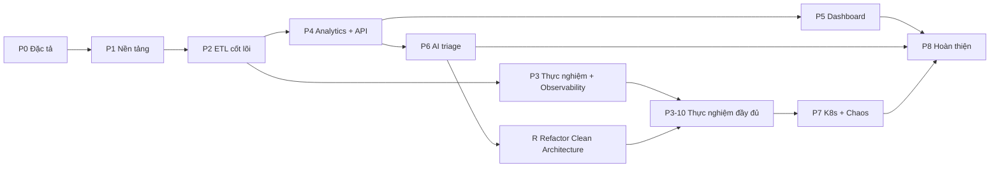

# Master Plan: xây dựng Public Transport Intelligence từ đầu đến cuối

> Trạng thái: **Approved v1.0** · Cập nhật: 2026-09-30 · Đi kèm: [00-decision-register.md](00-decision-register.md) · Nguồn: `public-transport-intelligence.md` (**SDD gốc**)

Tài liệu này là bản hướng dẫn tổng. Nó gồm:

1. các điểm cần bổ sung sau khi phân tích SDD gốc,
2. **toàn bộ tài liệu cần viết** trong `docs/` (mỗi tài liệu phải chứa gì và cần xong trước phase nào),
3. **toàn bộ công việc triển khai** chia theo phase, mỗi việc có đầu ra và tiêu chí nghiệm thu,
4. ma trận truy vết từ yêu cầu tới công việc và cách kiểm chứng.

Mục tiêu: khi một việc được bắt đầu, mọi thông tin cần để làm nó đã nằm trong docs. Không phải hỏi thêm.

---

## 0. Cách dùng tài liệu này

- **Thứ tự đọc cho người mới:** mục 1 → mục 4 (lộ trình) → phase đang làm ở mục 5 → các tài liệu được phase đó tham chiếu.
- **Quy tắc cổng tài liệu (doc gate):** mỗi phase có một việc `Pn-00` là rà soát tài liệu. Phase chỉ bắt đầu khi các tài liệu nó cần đã ở trạng thái `Approved` (mục 3.3).
- **Mã định danh dùng thống nhất trong mọi tài liệu:**

  | Tiền tố | Ý nghĩa | Ví dụ |
  | --- | --- | --- |
  | `FR-xx.y` / `NFR-xx` | Yêu cầu (FR có thể tách thành yêu cầu con) | FR-02.3 |
  | `UC-xx` | Use case | UC-08 |
  | `F-<NHÓM>-xx` | Tính năng | F-DLQ-03 |
  | `DOC-xx` | Tài liệu | DOC-19 |
  | `ADR-xxxx` | Quyết định kiến trúc | ADR-0005 |
  | `DR-xx` | Mục trong sổ quyết định mở | DR-21 |
  | `Pn-xx` | Công việc thuộc phase n | P2-07 |
  | `RF-xx` | Công việc thuộc Phase R (refactor Clean Architecture, DR-104). Không dùng `R-xx` vì mã đó đã dành cho test replay (DOC-22) | RF-03 |
  | `S-xx` | Spike (thử nghiệm ngắn) | S-01 |
  | `DQ-xx` | Rule chất lượng dữ liệu | DQ-04 |
  | `EXP-xx` | Thực nghiệm | EXP-01 |
  | `RB-xx` | Runbook | RB-03 |

- **Trạng thái tài liệu** (ghi ở dòng đầu mỗi file): `Draft` → `Review` → `Approved` → `Superseded`.

---

## 1. Phân tích SDD gốc

### 1.1 Những gì đã tốt, giữ nguyên

- Câu hỏi nghiên cứu rõ ràng. Mức đầu tư theo module hợp lý, tập trung vào ETL.
- Ngữ nghĩa độ tin cậy đúng hướng: at-least-once kết hợp upsert để đạt effectively-once, và chỉ commit offset sau khi transaction đã commit.
- Tách rõ lỗi dữ liệu (đưa vào DLQ, chạy tiếp) với lỗi hạ tầng (dừng tiến lên, tự tiếp tục khi hạ tầng hồi phục).
- AI chỉ phán đoán, còn quyết định nằm ở code. Các hành động tự động đều idempotent và có giới hạn.
- Có thực nghiệm đo được cho từng tuyên bố. Có thứ tự cắt giảm khi thiếu thời gian.

### 1.2 Khoảng trống chính

Chi tiết và phương án đề xuất cho từng mục nằm trong [00-decision-register.md](00-decision-register.md). Tóm tắt những điểm nặng nhất:

| # | Khoảng trống | Hệ quả nếu để nguyên | DR |
| --- | --- | --- | --- |
| 1 | Insight dùng `detected_at` theo giờ đồng hồ làm khóa UNIQUE | Replay sinh bản ghi mới, phá idempotency. Mỗi micro-batch sinh một dòng cho cùng một sự kiện | DR-29 |
| 2 | `dedup_registry` bỏ qua message đã thấy | Replay từ raw zone sau khi sửa bug sẽ không ghi lại được gì | DR-16 |
| 3 | Vừa batch upsert vừa savepoint từng record | Hai cách không dùng được đồng thời, cần thuật toán scan mode | DR-21 |
| 4 | TripUpdate lẫn giờ dự đoán với giờ thực tế | ETA và OTP tính sai | DR-13 |
| 5 | EWMA cập nhật "mỗi micro-batch" | Độ nhạy thay đổi theo tải, baseline "học" luôn sự cố | DR-31 |
| 6 | API chỉ có quyền SELECT nhưng có endpoint ghi | Không triển khai được feedback, confirm, ack | DR-20 |
| 7 | Chưa có IdP phát JWT, chưa có nơi lưu trace và log | Không chạy được auth và observability | DR-40, DR-50 |
| 8 | Chưa có ground truth và chưa định nghĩa baseline cho thực nghiệm | Không đo được "mất = 0, trùng = 0" một cách khách quan | DR-27, DR-28 |
| 9 | Jev chỉ mô tả ở mức khái niệm; SDD gốc nói phải tự viết client Java | Đã giải quyết: đã có `typesafe-java-sdk`; còn 3 điểm nhỏ cần spike | DR-36 (S-01) |
| 10 | Schema ticketing, envelope message, danh sách GTFS file, múi giờ chưa định nghĩa | Không viết được migration và contract | DR-02…09 |
| 11 | Advisory lock hỏng khi đi qua PgBouncer | Hai pod batch cùng chạy một job | DR-24 |
| 12 | Phase 1 "nạp GTFS static" trong khi hạ tầng job batch (Spring Batch) đến Phase 2 mới có | Phải viết loader tạm rồi bỏ | Mục 1.3 |

### 1.3 Điều chỉnh so với kế hoạch trong SDD gốc

| Điều chỉnh | Lý do |
| --- | --- |
| Thêm **Phase 0: Đặc tả và spike** | Chốt các DR và viết tài liệu nền trước khi code |
| Simulator đọc thẳng file GTFS zip, không phụ thuộc warehouse. Việc nạp GTFS static vào warehouse dời sang P2 (job Spring Batch) | Tránh viết loader tạm để rồi bỏ |
| CI tối thiểu (build, unit test, format) có từ P1, không đợi đến P8 | Chặn lỗi sớm; P8 chỉ bổ sung các bước nặng |
| Phần phát hiện thống kê của ticketing anomaly làm ở P6 cùng phân loại | Giữ đúng thứ tự cắt giảm của SDD gốc |
| Thêm các bảng `alert_event`, `replay_request`, `dlq_action_log`, `runtime_flag`, `vehicle_position_latest`, `route_headway`, `gtfs_feed_version`, `analytics_route_baseline`, `dq_check_result`, `etl_stream_batch`, `shedlock` | Các luồng mà SDD gốc mô tả cần những bảng này mới chạy được |
| Bỏ Spring Cloud Contract, thay bằng JSON Schema + OpenAPI diff | Nhẹ hơn và phù hợp khi frontend là TypeScript (DR-44) |
| **Dùng Spring Batch cho job batch và Spring Kafka cho streaming, bỏ engine chunk tự xây**; metadata job dùng bảng `BATCH_*` chuẩn, khóa giữa pod dùng ShedLock (ADR-0002, DR-21–24, DR-62) | Bớt khoảng 1–2 tuần ở P2 và bớt rủi ro sai ở ranh giới transaction; công sức dồn vào ngữ nghĩa đúng đắn và thực nghiệm |

---

## 2. Nguyên tắc thực hiện

1. **Đúng đắn trước, đầy đủ sau.** P1–P3 không được cắt, vì đó là phần trả lời câu hỏi nghiên cứu.
2. **Mỗi phase kết thúc bằng thứ chạy được và demo được** (milestone M0…M8 ở mục 4.2).
3. **Ranh giới transaction được chứng minh bằng test trước.** Cấu hình Spring Batch và `StreamChunkTemplate` phải có test tiêm lỗi (fault injection) cho từng ranh giới transaction trước khi viết job và consumer thật. Không tin hành vi mặc định của framework khi chưa có test.
4. **Tài liệu đi cùng code.** Đổi hành vi thì sửa doc trong cùng PR. Đổi quyết định thì viết ADR mới đánh dấu thay thế ADR cũ, không sửa lịch sử.
5. **Mọi ngưỡng nằm trong cấu hình.** Mọi cấu hình phải có mặt trong DOC-29.
6. **Mọi insight và mọi replay phải idempotent,** và có test "chạy hai lần ra cùng kết quả".
7. **Code Java mới theo Clean Architecture** (DOC-49, ADR-0032): `domain` và `application` là Java thuần, luật ArchUnit fail build. Code P1–P3 giữ nguyên kiến trúc tới Phase R, bị freeze để không thêm vi phạm.

---

## 3. Bộ tài liệu cần viết

### 3.1 Cây thư mục `docs/`

```
docs/
  README.md                         # mục lục, thứ tự đọc, quy ước
  00-master-plan.md                 # tài liệu này
  00-decision-register.md           # các quyết định mở
  01-product/
    vision-and-scope.md             # DOC-01
    personas-and-journeys.md        # DOC-02
    requirements.md                 # DOC-03
    use-cases.md                    # DOC-04
    feature-catalog.md              # DOC-05
  02-glossary.md                    # DOC-06
  03-architecture/
    system-context-and-containers.md  # DOC-07
    data-flows.md                   # DOC-08
    messaging-contracts.md          # DOC-09
    quality-attributes.md           # DOC-10
    tech-stack-and-versions.md      # DOC-11
    clean-architecture.md           # DOC-49
  04-adr/                           # DOC-12
    README.md                       # chỉ mục ADR
    0001-record-architecture-decisions.md
    …
  05-data/
    source-data.md                  # DOC-13
    warehouse-model.md              # DOC-14
    ops-and-insight-model.md        # DOC-15
    data-quality-rules.md           # DOC-16
    db-roles-and-grants.md          # DOC-17
    data-lifecycle.md               # DOC-18
  06-design/
    batch-and-chunk-processing.md   # DOC-19
    etl-streaming.md                # DOC-20
    etl-gtfs-static.md              # DOC-21
    dlq-and-replay.md               # DOC-22
    analytics.md                    # DOC-23
    ai-triage.md                    # DOC-24
    source-simulator.md             # DOC-25
    realtime-delivery.md            # DOC-26
    security.md                     # DOC-27
    observability.md                # DOC-28
    configuration-reference.md      # DOC-29
    error-handling.md               # DOC-30
    demo-console.md                 # DOC-48
  07-api/
    api-guidelines.md               # DOC-31
    api-endpoints.md                # DOC-32
    sse-events.md                   # DOC-33
  08-ux-ui/
    ux-principles-and-ia.md         # DOC-34
    design-system.md                # DOC-35
    screens/                        # DOC-36 (mỗi màn hình một file)
      shell-and-navigation.md
      overview.md
      live-map.md
      stop-detail.md
      route-scorecard.md
      ops-console-jobs.md
      ops-console-dlq.md
      ops-console-replay.md
      ops-console-controls.md
      ops-console-ticketing.md
      alert-feed.md
      demo-control.md
    ui-states-and-copy.md           # DOC-37
  09-operations/
    local-dev.md                    # DOC-38
    deploy-compose.md               # DOC-39
    deploy-k8s.md                   # DOC-40
    ci-cd.md                        # DOC-41
    runbooks/                       # DOC-42 (mỗi alert một runbook)
    backup-restore.md               # DOC-43
  10-testing/
    test-strategy.md                # DOC-44
    experiments/                    # DOC-45 (EXP-01 … EXP-08)
    demo-script.md                  # DOC-46
  11-report/
    thesis-mapping.md               # DOC-47 (tùy chọn: ánh xạ chương báo cáo ↔ docs/kết quả)
```

### 3.2 Nội dung bắt buộc của từng tài liệu

Cột "Gate" là phase cần tài liệu ở trạng thái Approved trước khi bắt đầu.

#### Nhóm Product

| DOC | Tài liệu | Nội dung bắt buộc | Gate |
| --- | --- | --- | --- |
| 01 | vision-and-scope | Bối cảnh, vấn đề, tầm nhìn 3 lớp giá trị. Câu hỏi nghiên cứu. Mục tiêu đo được (success metrics: gắn với NFR và EXP). Trong/ngoài phạm vi. Giả định, ràng buộc (máy chạy, thời gian). Thứ tự cắt giảm | P1 |
| 02 | personas-and-journeys | 5 persona: Hành khách, Điều phối viên, Quản lý tuyến, Kỹ sư dữ liệu, Người đánh giá (hội đồng/researcher). Với mỗi persona: mục tiêu, nỗi đau, tần suất dùng, thiết bị, mức kỹ thuật. Mỗi persona có một journey map (các bước, cảm xúc, điểm chạm màn hình) | P1 |
| 03 | requirements | FR-01…12 tách thành yêu cầu con có **acceptance criteria dạng Given/When/Then**. NFR-01…09 kèm *cách đo, công cụ, ngưỡng, EXP kiểm chứng*. Ưu tiên theo MoSCoW. Bảng truy vết FR → UC → F → DOC thiết kế. Có thể thêm NFR mới: NFR-10 khả dụng API, NFR-11 khả năng truy cập (WCAG AA cho màn hình hành khách) | P1 |
| 04 | use-cases | UC-01…UC-18 (danh sách ở mục 3.4). Mỗi UC có actor, trigger, tiền điều kiện, luồng chính đánh số, luồng thay thế, luồng lỗi, hậu điều kiện, quy tắc nghiệp vụ, màn hình và endpoint liên quan, FR liên quan. Có sơ đồ use case tổng (Mermaid) | P1 |
| 05 | feature-catalog | Danh sách F-xx theo nhóm (INGEST, ETL, DLQ, REPLAY, ANALYTICS, AI, API, UI, OPS, SIM). Mỗi tính năng có mô tả, UC và FR, phase, MoSCoW, feature flag (nếu có), phụ thuộc, bị cắt ở bước nào trong thứ tự cắt giảm | P1 |

#### Glossary

| DOC | Nội dung bắt buộc | Gate |
| --- | --- | --- |
| 06 | Mỗi thuật ngữ có: tên tiếng Việt / tên tiếng Anh, định nghĩa 1–3 câu, ví dụ, tài liệu liên quan. **Danh sách tối thiểu:** GTFS, GTFS static, GTFS-realtime, feed, feed version, agency, route, direction, trip, stop, stop_time, stop_sequence, shape, shape_dist_traveled, service_date, calendar/calendar_dates, headway, delay, scheduled/observed/predicted arrival, ETA, OTP, bunching, leader/follower, disruption, episode, baseline, EWMA, z-score, hysteresis, warm-up, sale point, refund, ticketing anomaly, CDC, Debezium, WAL, replication slot, LSN, publication, Kafka topic/partition/offset/consumer group/lag/rebalance, KRaft, idempotent producer, at-least-once, effectively-once, idempotency, business key, natural key, upsert, payload hash, dedup, DLQ, stage, triage, category, severity, confidence, confidence gate, auto-replay, confirm queue, chunk, micro-batch, batch_id, job/step, job instance, job parameters, job execution/step execution, execution context, JobRepository, JobOperator, fault-tolerant step, tasklet, ItemStream, skip listener, checkpoint, watermark, skip policy, skip limit, retry policy, savepoint, scan mode, stale execution, ShedLock, optimistic locking (`VERSION`) dùng làm fencing, stream chunk template, raw zone, replay (DLQ vs raw zone), star schema, dimension, fact, insight table, data quality rule, feed freshness/stale, backpressure, pause/resume, circuit breaker, bulkhead, rate limiter, graceful shutdown, SSE, Last-Event-ID, resync, trace_id, span, KEDA, HPA, PDB, operator (K8s), Strimzi, CloudNativePG, PgBouncer, Jev, Choice/Score/Noul, model_version, simulator, scenario, ledger, ground truth, baseline mode (naive), audience (PUBLIC/OPERATIONS/ENGINEERING) | P1 |

#### Nhóm Architecture

| DOC | Tài liệu | Nội dung bắt buộc | Gate |
| --- | --- | --- | --- |
| 07 | system-context-and-containers | C4 level 1 (hệ thống, người dùng, hệ thống ngoài: Jev, Keycloak, SMTP). C4 level 2 (mọi container và luồng giữa chúng). Bảng đơn vị triển khai (DR-26). **Bảng quyền sở hữu dữ liệu: bảng nào do service nào ghi, service nào đọc.** Ranh giới tin cậy (trust boundary) | P1 |
| 08 | data-flows | Sequence diagram (Mermaid) cho từng luồng: GTFS-rt ingest; CDC ingest; nạp GTFS static; analytics micro-batch; job theo lịch; DLQ triage và auto-replay; DLQ replay thủ công; replay từ raw zone; SSE tới client; và các luồng lỗi: DB chết giữa chunk, pod bị kill trước ack, Jev timeout, feed stale | P2 |
| 09 | messaging-contracts | Bảng topic (DR-05), envelope (DR-04), JSON Schema v1/v2 cho từng entity (tham chiếu tới file trong `backend/common/`), hợp đồng CDC (DR-07), sự kiện UI nội bộ, Kafka headers, quy tắc thay đổi tương thích ngược, quy tắc tính payload hash | P1 |
| 10 | quality-attributes | Với mỗi NFR: chiến thuật → cơ chế cụ thể → nơi hiện thực → cách kiểm chứng. **Ngân sách độ trễ NFR-03** chia theo chặng. **Ước lượng dung lượng:** event/s, dòng/ngày, GB/ngày cho mỗi bảng và raw zone, ở tải nền và gấp 10 lần. **Ngân sách tài nguyên compose** (RAM theo container) | P1 |
| 11 | tech-stack-and-versions | Bảng thư viện và công cụ kèm phiên bản cố định, lý do chọn, license (DR-53, DR-46). Công cụ dev (mise, pnpm, uv). Tuân theo version catalog | P1 |
| 49 | clean-architecture | Phạm vi áp dụng theo module và thời điểm (mới/cũ). Bốn tầng và quy tắc phụ thuộc. Bố cục package và quy ước tên. Phụ thuộc được phép từng tầng, shared kernel của `common`, `TransactionRunner`. Cơ chế Spring nằm ở tầng nào, transaction, sự kiện sau commit. DTO và mapping. Lỗi và test theo tầng. Luật ArchUnit A-11…A-18 và cách freeze module cũ. Danh sách ngoại lệ đóng. Ánh xạ thiết kế của `analytics`, `api`, `triage-worker` vào tầng. Nguyên tắc Phase R. Checklist review (DR-104) | P4 |

#### ADR (DOC-12)

Dùng định dạng MADR rút gọn: Bối cảnh / Các phương án / Quyết định / Hệ quả / Trạng thái. Danh sách ADR cần viết:

| ADR | Chủ đề | Nguồn | Gate |
| --- | --- | --- | --- |
| 0001 | Ghi quyết định kiến trúc bằng ADR | — | P1 |
| 0002 | Dùng Spring Batch (job batch) và Spring Kafka (streaming) thay cho engine chunk tự xây; phần dùng chung giữa hai chế độ | SDD 6.3, DR-62 | P1 |
| 0003 | Effectively-once = at-least-once + upsert theo business key; dedup registry chỉ là tối ưu | DR-16 | P1 |
| 0004 | Commit offset sau khi transaction của chunk commit (`AckMode.BATCH`, `DefaultErrorHandler`); ánh xạ poll → chunk | DR-22 | P2 |
| 0005 | Ghi chunk: batch upsert trước, fallback scan (scan của Spring Batch; savepoint ở streaming) | DR-21 | P2 |
| 0006 | Phân loại lỗi DATA / TRANSIENT_INFRA / FATAL | DR-23 | P2 |
| 0007 | JSON envelope có `schema_version` cho GTFS-rt (thay Protobuf) | DR-03 | P1 |
| 0008 | Partition key `route_id`, 12 partition | DR-05 | P1 |
| 0009 | Phiên bản hóa GTFS static: `feed_version` và staging swap | DR-10 | P1 |
| 0010 | Khóa insight theo event time, mô hình episode, UUIDv5 | DR-29 | P4 |
| 0011 | Partition bảng fact theo ngày và job bảo trì partition | DR-15 | P1 |
| 0012 | Raw zone: S3 sink JSON gzip, phân vùng theo giờ của record, giữ key/headers | SDD 4.1, S-04, DR-81 | P1 |
| 0013 | Replay: API ghi yêu cầu, ETL thực thi | DR-18 | P2 |
| 0014 | Đơn vị triển khai: một image ETL hai profile; analytics là thư viện | DR-26, 35 | P1 |
| 0015 | Chống chạy trùng job: ShedLock, JobInstance của Spring Batch, `VERSION` làm fencing; khôi phục execution kẹt | DR-24 | P2 |
| 0016 | SSE qua topic nội bộ, consumer group riêng cho mỗi pod, ring buffer | DR-41 | P4 |
| 0017 | Keycloak làm IdP, API là OAuth2 resource server | DR-40 | P4 |
| 0018 | Cổng `DecisionModel` với adapter Jev/Fake/Disabled | DR-36 | P6 |
| 0019 | Ngưỡng tự động hóa do code sở hữu, AI chỉ phán đoán | SDD 9.6 | P6 |
| 0020 | Stack frontend | DR-46 | P5 |
| 0021 | Bản đồ MapLibre và PMTiles offline | DR-47 | P5 |
| 0022 | Observability: Prometheus, Tempo, Loki, Alloy | DR-50 | P3 |
| 0023 | Bảng `alert_event` hợp nhất, định tuyến theo audience | DR-17 | P4 |
| 0024 | Flyway chạy như job riêng, schema thay đổi theo kiểu expand/contract | SDD 12.4 | P1 |
| 0025 | Experiment runner bằng Python | DR-52 | P3 |
| 0026 | Không dùng outbox cho sự kiện UI | DR-42 | P4 |
| 0027 | Contract testing bằng JSON Schema + OpenAPI diff | DR-44 | P2 |
| 0028 | K8s: k3d, helmfile, Strimzi, CNPG, KEDA, Chaos Mesh | DR-54 | P7 |
| 0029 | Nền tảng: Spring Boot 4.1 và Java 25 (bản mới nhất); ghi các thay đổi so với Boot 3 | DR-53 | P1 |

ADR-0012 đã chốt sau S-04 (2026-09-28): Aiven S3 sink 3.4.3, value base64, phân thư mục theo CreateTime (`file.name.timestamp.source=EVENT`), file đóng mỗi 5 phút hoặc 2.000 record (DR-81; **DR-89** sửa thành file mới mỗi 10 giây trên mỗi partition, commit 30 giây, part 1 MiB), đường dẫn `raw/{topic}/dt=YYYY-MM-DD/hh=HH/`. **File GTFS static zip cũng được lưu vào raw zone** để EXP-04 dựng lại được cả dimension.

#### Nhóm Data

| DOC | Tài liệu | Nội dung bắt buộc | Gate |
| --- | --- | --- | --- |
| 13 | source-data | Feed đã chọn (DR-01): nguồn, license, hash, thống kê (số tuyến, trạm, chuyến, số chuyến đồng thời cao nhất). Các file và trường GTFS được dùng, kèm ánh xạ sang bảng. Trường GTFS-rt trong envelope. Schema DB ticketing (DR-06) có DDL. Schema ledger của simulator. Quy tắc múi giờ và giờ vượt 24h (DR-09) | P1 |
| 14 | warehouse-model | ERD (Mermaid). **DDL đầy đủ** cho `gtfs_feed_version`, `dim_*`, `gtfs_trip`, `gtfs_stop_time`, `gtfs_shape`, `route_headway`, `dim_date`, `fact_*` (partitioned), `vehicle_position_latest`. Index của từng bảng và lý do. **Câu upsert mẫu cho từng fact**, có guard theo event_timestamp/LSN. Grain của mỗi fact. Business key. Cột audit | P1 |
| 15 | ops-and-insight-model | DDL cho bảng metadata Spring Batch (schema `batch`, lấy nguyên từ Spring Batch, DR-62), `etl_stream_batch`, view `ops_job_run_v`, `etl_checkpoint`, `shedlock`, `dead_letter`, `dlq_action_log`, `replay_request`, `dedup_registry`, `runtime_flag`, `dq_check_result`, `alert_event`, `analytics_route_baseline`, `analytics_baseline_snapshot`, và các bảng `insight_*` đã sửa theo DR-29. **Sơ đồ máy trạng thái** cho `BatchStatus` của Spring Batch (chỉ trích, không định nghĩa lại), `etl_stream_batch.status`, `dead_letter.status`, `replay_request.status`, `episode.status`. Enum dùng chung | P2 (phần ops), P4 (phần insight) |
| 16 | data-quality-rules | Danh mục DQ-xx. Mỗi rule có: id, bảng, lớp (pre-write/post-write), mô tả, biểu thức hoặc SQL, mức độ, hành động (DLQ / alert / chỉ ghi nhận), ngưỡng. Tối thiểu: not-null, trùng key trong chunk, FK route/stop/trip, lat/lon nằm trong bounding box của feed, `event_timestamp` không lệch quá ±1 giờ so với now, `amount ≥ 0`, refund phải tham chiếu tới giao dịch đã có, `delay` trong khoảng ±2 giờ | P2 |
| 17 | db-roles-and-grants | Ma trận role × bảng × quyền (tới mức cột nếu cần, DR-20). App nào dùng role nào. Cách cấp secret trên compose và trên k8s. Tách user migration (owner) khỏi user runtime | P1 |
| 18 | data-lifecycle | Retention từng bảng và raw zone. Job bảo trì partition. Dọn `dedup_registry`, `etl_stream_batch`, metadata `BATCH_*` (DR-62). Bố cục raw zone. Versioning và lifecycle của bucket `raw` (SeaweedFS, DR-66). Lịch backup. Chính sách PII (DR-60) | P2 |

#### Nhóm Design detail

Mỗi tài liệu trong nhóm này có khung chung: **Mục đích → Phạm vi → Thành phần và interface (chữ ký Java) → Thuật toán (pseudo-code) → Transaction và đồng thời → Cấu hình → Metrics và log → Lỗi và cách xử lý → Test case bắt buộc → Câu hỏi còn mở (phải rỗng khi Approved).**

| DOC | Tài liệu | Nội dung riêng bắt buộc | Gate |
| --- | --- | --- | --- |
| 19 | batch-and-chunk-processing | **Cách dự án dùng Spring Batch và Spring Kafka; không mô tả lại framework.** Danh mục job (tên, job parameters định danh, các step, reader/processor/writer, chunk size, restartable hay không, lịch chạy, `@SchedulerLock`). Cấu hình fault-tolerant step: `SkipPolicy`, retry, backoff, skip limit theo DR-23. `SkipListener` → DLQ. Cấu hình JobRepository và metadata (DR-62). **Sơ đồ transaction** cho một chunk ở cả hai chế độ (Spring Batch và `StreamChunkTemplate`), ghi rõ transaction bắt đầu và kết thúc ở đâu, DLQ và context được ghi ở đâu (DR-21). Các thành phần dùng chung giữa hai chế độ và chữ ký Java của `StreamChunkTemplate`. Restart, khôi phục execution kẹt, ShedLock, fencing bằng `VERSION` (DR-24). Điểm móc để tiêm lỗi cho test. Danh sách test: restart sau lỗi ở mọi điểm (trước read, giữa process, trước write, sau write trước commit, sau commit trước ack), ở cả hai chế độ | P2 |
| 20 | etl-streaming | Cấu hình consumer (các property Kafka cụ thể). Batch listener và ack (DR-22). Pause/resume khi circuit breaker mở. Graceful shutdown (thứ tự các bước). CooperativeStickyAssignor. Parser theo schema_version (DR-59). Validator. Mapping TripUpdate → nhiều dòng fact (DR-13). Consumer CDC (DR-07). Cập nhật `vehicle_position_latest`. Phát `MicroBatchCommitted` và sự kiện UI. Chế độ baseline (DR-27) | P2 |
| 21 | etl-gtfs-static | Luồng: lấy feed → lưu raw zone → staging (STAGED) → validate toàn feed (danh sách kiểm tra) → sinh `route_headway` → swap → retire. Tiêu chí từ chối feed. Watermark bằng hash. Làm mới cache dimension trong ETL stream khi đổi phiên bản | P2 |
| 22 | dlq-and-replay | Lưu vào DLQ những gì (payload gốc, đã loại PII). Máy trạng thái (DR-18). Sửa payload (validate trước khi lưu). Replay một record: API tạo request → `DlqReplayJob` xử lý qua cùng processor/writer. Replay khoảng thời gian từ raw zone: `RawZoneReplayJob` (Spring Batch, `MultiResourceItemReader` qua Spring Cloud AWS S3) đọc object trong raw zone theo khoảng giờ, restart được từ object và dòng đã commit, bỏ qua dedup registry, có tùy chọn tính lại analytics trong khoảng đó. Replay bằng cách reset offset (runbook). Giới hạn đồng thời (một replay cho mỗi nguồn) | P2 |
| 23 | analytics | Năm module: bunching (DR-30), disruption (DR-31), ETA (DR-32), OTP (DR-33), ticketing anomaly (DR-34). Mỗi module có: input (bảng và cột), pseudo-code, tham số và giá trị mặc định, edge case (thiếu dữ liệu, đầu bến, tuyến vòng, xe mất tín hiệu), idempotency, **bộ test có dữ liệu vào và kết quả kỳ vọng dạng bảng**. Cơ chế kích hoạt (DR-35). Replay analytics | P4 |
| 24 | ai-triage | Cổng `DecisionModel` và 3 adapter. Kết quả spike S-01. Với mỗi use case (DLQ, ticketing, disruption enrichment, dispatch): hàm dựng context (template văn bản cố định kèm ví dụ), các câu hỏi và giá trị lựa chọn, ngưỡng, hành động, cờ tắt. Bảng quyết định auto-replay (SDD 9.2). Luật chặn cuối. Resilience (timeout 2 s, circuit breaker, bulkhead, rate limiter khớp quota). Lấy việc bằng SKIP LOCKED (DR-37). Kiểm tra sức khỏe nguồn (DR-38). Danh sách chặn PII. Cách lưu `model_version` | P6 |
| 25 | source-simulator | Mô hình chuyển động (nội suy theo `stop_times` + `shape`). Mô hình trễ (phân phối, tương quan theo giờ cao điểm). Đồng hồ và ánh xạ ngày (DR-08). Cách sinh VehiclePosition và TripUpdate. TicketingSeeder (tốc độ theo giờ, tỷ lệ hoàn vé). **API điều khiển kịch bản** (endpoint, tham số, thời lượng, dừng). Ledger (DR-28). Chế độ tải (LoadRamp) | P1 (cơ bản), P3 (kịch bản) |
| 26 | realtime-delivery | Luồng từ publisher → `pti.events.ui` → consumer của từng pod API → ring buffer → SseEmitter. Heartbeat 15 s. Last-Event-ID và resync (DR-41). Throttle kênh vehicles. Giới hạn kết nối. Hành vi khi pod tắt. Hook `useRealtime` phía client (backoff, fallback polling, cập nhật cache của TanStack Query) | P4 |
| 27 | security | Authn/authz (DR-40). **Ma trận endpoint × role.** CORS. Rate limit. Secret trên compose và k8s. TLS (bật được). PII. STRIDE rút gọn cho từng trust boundary. Quét bảo mật trong CI | P4 |
| 28 | observability | **Danh mục metric** (tên, loại, label, service phát, ý nghĩa), gồm các metric trong SDD 12.1 và DR-57. Các trường log bắt buộc (`trace_id, span_id, batch_id, service, source`). Danh sách span. Lan truyền trace qua Kafka header. Grafana dashboard (danh sách panel). **Alert rule viết bằng PromQL** cho 9 cảnh báo trong SDD 12.2, kèm link runbook. Kênh gửi (DR-51) | P3 |
| 29 | configuration-reference | Với mỗi app: bảng key, kiểu, mặc định, biến môi trường tương ứng, profile, mô tả. Gom theo prefix `pti.*`. Bảng `runtime_flag` | Cập nhật liên tục; khung có ở P1 |
| 30 | error-handling | Phân loại lỗi (DR-23). Ánh xạ SQLState và exception → loại lỗi → hành động. Ánh xạ exception → HTTP status → Problem type URI. Quy ước log lỗi | P2 |
| 48 | demo-console | Công cụ trình diễn, không phải tính năng sản phẩm (DR-87). Ranh giới với Demo control. Bố cục màn hình, topology theo môi trường và bảng trạng thái → tông. Nguồn dữ liệu (docker events, `kubectl` watch, Prometheus, `/sim/*`) và query. API REST + SSE của console. **Danh mục hành động cố định**, mỗi hành động có lệnh `make` tương đương. Bảo vệ localhost (CSRF, DNS rebinding). Test DC-xx | P8 (P8-08) |

#### Nhóm API

| DOC | Tài liệu | Nội dung bắt buộc | Gate |
| --- | --- | --- | --- |
| 31 | api-guidelines | Quy ước ở DR-39 và DR-45. Đặt tên. Phân trang. Lọc. Định dạng thời gian. Cache (Caffeine TTL cho từng nhóm endpoint). Header. Versioning. Idempotency của POST (header `Idempotency-Key` cho replay và feedback) | P4 |
| 32 | api-endpoints | **Mỗi endpoint một mục** theo template ở phụ lục A.4: SDD 10.1 cộng các endpoint bổ sung ở DR-43. Mỗi mục ghi bảng và view nguồn, cùng mục tiêu hiệu năng | P4 |
| 33 | sse-events | Danh sách kiểu sự kiện (`vehicles.batch, alert.created, alert.updated, bunching.opened/closed, disruption.opened/closed, dispatch.suggested, job.run, dlq.changed, resync, heartbeat`). Payload JSON mẫu. Kênh. Quyền truy cập | P4 |

#### Nhóm UX/UI

| DOC | Tài liệu | Nội dung bắt buộc | Gate |
| --- | --- | --- | --- |
| 34 | ux-principles-and-ia | Nguyên tắc (dữ liệu luôn ghi rõ "tính đến lúc nào"; độ tin cậy luôn hiển thị; không trang trắng). Sitemap. Điều hướng theo role (anonymous / viewer / operator). Sơ đồ URL, gồm search params cho bộ lọc. Hành vi responsive (màn hành khách chạy tốt trên mobile, ops console cho desktop ≥ 1280px) | P5 |
| 35 | design-system | Token: màu (nền, chữ, **bảng màu severity 0/1/2**, trạng thái job, trạng thái DLQ, mức tin cậy), typography, spacing, radius, dark mode. Danh mục component (Badge severity, ConfidenceMeter, FreshnessIndicator, StatusPill, DataTable, TimeRangePicker, RouteSelect, EmptyState, ErrorState, StaleBanner). Style bản đồ (icon xe theo trạng thái, màu tuyến, hiển thị cặp bunching). Quy ước biểu đồ. Tiêu chí a11y (tương phản AA, điều khiển được bằng bàn phím, không dùng màu làm tín hiệu duy nhất) | P5 |
| 36 | screens/* | **Mỗi màn hình một file** theo template ở phụ lục A.5: mục đích, persona, UC, wireframe (ASCII hoặc ảnh), vùng và component, nguồn dữ liệu (endpoint + kênh SSE), tương tác, quyền, trạng thái (loading/empty/error/stale/không có quyền), microcopy, tiêu chí nghiệm thu, ca kiểm thử E2E | P5 |
| 37 | ui-states-and-copy | Mẫu cho các trạng thái. Toàn bộ microcopy **tiếng Anh** theo DR-61 (nhãn category/severity/status, thông báo lỗi, tooltip giải thích sample_count và confidence, "không đủ tin cậy"). Định dạng số, thời gian, khoảng thời gian | P5 |

#### Nhóm Operations

| DOC | Tài liệu | Nội dung bắt buộc | Gate |
| --- | --- | --- | --- |
| 38 | local-dev | Yêu cầu máy (RAM, CPU, disk). Cài công cụ (mise, Docker, pnpm, uv). `make` targets. Bảng port. Tài khoản demo. Seed và reset dữ liệu. Lỗi thường gặp | P1 |
| 39 | deploy-compose | Các profile (`core`, `observability`, `triage`, `demo`, `experiment`). Thứ tự khởi động và healthcheck. Giới hạn tài nguyên. Biến môi trường và secret. Nâng cấp và migration | P1 |
| 40 | deploy-k8s | Tạo cluster k3d. Cài operators (helmfile). Values dev/staging/lite. Probe. Tài nguyên. PDB. NetworkPolicy. Sealed Secrets. KEDA ScaledObject. HPA. Migration bằng hook. Rolling update. Gỡ bỏ | P7 |
| 41 | ci-cd | Các stage của pipeline (SDD 12.5 cộng DR-44). Điều kiện chặn merge. Cache. Đặt tag cho image. Deploy staging. Smoke test | P1 (khung), P8 (đầy đủ) |
| 42 | runbooks/RB-xx | Mỗi alert một runbook: triệu chứng, ảnh hưởng, kiểm tra (câu lệnh, query), xử lý, cách xác nhận đã xong, cách phòng ngừa. Thêm runbook cho: reset offset để replay, khôi phục warehouse từ raw zone, xoay vòng secret | P3 (alert), P8 (đầy đủ) |
| 43 | backup-restore | Lịch pg_dump. Versioning của bucket `raw`. Quy trình khôi phục từng bước (SDD 12.6). RPO và RTO mục tiêu. Liên kết với EXP-04 | P3 |

#### Nhóm Testing

| DOC | Tài liệu | Nội dung bắt buộc | Gate |
| --- | --- | --- | --- |
| 44 | test-strategy | Tháp kiểm thử. Mỗi module test gì ở tầng nào. Công cụ. Quy ước đặt tên. Dữ liệu test (fixture GTFS thu nhỏ, trong `backend/common/src/testFixtures`). Chỉ tiêu coverage (`StreamChunkTemplate`, `ErrorClassifier`, `SkipPolicy` và processor/writer dùng chung ≥ 90% line, core ETL ≥ 80%, analytics ≥ 85%). Test tiêm lỗi. Contract test (DR-44). Test hiệu năng. Test nào chạy trên CI ở stage nào | P2 |
| 45 | experiments/EXP-xx | Mỗi EXP theo template ở phụ lục A.6: giả thuyết, biến độc lập và biến phụ thuộc, baseline (DR-27), môi trường, **các bước tự động**, số lần lặp, chỉ số và công thức (DR-28, DR-57, DR-58), tiêu chí đạt, script phân tích, mẫu bảng kết quả, mối đe dọa tới tính hợp lệ | P3 (01–05), P6 (06), P7 (07–08) |
| 46 | demo-script | Kịch bản 7 bước (SDD 14.1) kèm lời thoại, thao tác, kết quả mong đợi, phương án dự phòng khi hỏng, checklist trước buổi demo, cách reset | P8 |

### 3.3 Định nghĩa "Approved" cho một tài liệu

- [ ] Có đủ các mục bắt buộc trong bảng ở mục 3.2.
- [ ] Mục "Câu hỏi còn mở" rỗng, hoặc mỗi câu đã có DR ở trạng thái Chốt.
- [ ] Mọi thuật ngữ đã có trong glossary. Mọi mã (FR, UC, DR…) đều trỏ tới mục có thật.
- [ ] Các tài liệu phụ thuộc được liệt kê ở đầu file.
- [ ] Có ví dụ cụ thể (payload, SQL, bảng test) ở mọi chỗ có thể hiểu theo hai cách.

### 3.4 Danh sách use case cần viết (DOC-04)

| UC | Tên | Actor chính | FR |
| --- | --- | --- | --- |
| UC-01 | Xem xe chạy trên bản đồ theo thời gian thực | Hành khách, Điều phối viên | FR-10, 11 |
| UC-02 | Xem giờ đến dự kiến tại một trạm | Hành khách | FR-06, 11 |
| UC-03 | Nhận cảnh báo gián đoạn trên tuyến quan tâm | Hành khách | FR-07, 11 |
| UC-04 | Theo dõi bunching và phản hồi gợi ý điều phối | Điều phối viên | FR-05, 09, 11 |
| UC-05 | Xem gián đoạn kèm nguyên nhân khả dĩ | Điều phối viên | FR-07, 09 |
| UC-06 | Xem scorecard OTP và xu hướng trễ | Quản lý tuyến | FR-08, 11 |
| UC-07 | Theo dõi lịch sử và trạng thái các batch ETL | Kỹ sư dữ liệu | FR-11 |
| UC-08 | Lọc, xem, sửa và replay record trong DLQ | Kỹ sư dữ liệu | FR-02, 09, 12 |
| UC-09 | Xác nhận đề xuất tự xử lý trong hàng chờ | Kỹ sư dữ liệu | FR-09, 12 |
| UC-10 | Replay một khoảng dữ liệu từ raw zone | Kỹ sư dữ liệu | FR-12 |
| UC-11 | Tạm dừng và tiếp tục một consumer | Kỹ sư dữ liệu | NFR-09 |
| UC-12 | Xem bất thường ticketing đã được phân loại | Kỹ sư dữ liệu, Quản lý | FR-09 |
| UC-13 | Tự động triage và auto-replay record DLQ | Hệ thống | FR-09, 12 |
| UC-14 | Nạp phiên bản GTFS static mới | Hệ thống (scheduler) | FR-01, 04 |
| UC-15 | Phát hiện feed stale và cảnh báo | Hệ thống | NFR-05 |
| UC-16 | Điều khiển kịch bản simulator | Researcher | — |
| UC-17 | Chạy một thực nghiệm và thu kết quả | Researcher | NFR-01, 02, 08, 09 |
| UC-18 | Khôi phục warehouse từ raw zone | Kỹ sư dữ liệu | FR-12, NFR-01 |

---

## 4. Lộ trình

### 4.1 Tổng quan các phase

| Phase | Tên | Ước lượng (1 người, toàn thời gian) | Milestone |
| --- | --- | --- | --- |
| P0 | Đặc tả, quyết định, spike | 2–3 tuần | M0: DR đã chốt, tài liệu nền Approved |
| P1 | Nền tảng hạ tầng và nguồn dữ liệu | 2 tuần | M1: `make up` chạy; `make sim-start` → event lên Kafka; CDC chạy; raw zone có file. **Đạt 2026-09-29** |
| P2 | ETL cốt lõi (Spring Batch + Spring Kafka) | 3–4 tuần | M2: dữ liệu vào warehouse; kill -9 không làm mất hay trùng dữ liệu |
| P3 | Thực nghiệm độ tin cậy và observability | 2–3 tuần | M3: runner EXP-01…05 và chuỗi smoke đạt; Grafana; alert. Đợt chạy đầy đủ (P3-10) làm sau MR, trước P7 (DR-95, DR-104) |
| P4 | Analytics và API | 3–4 tuần | M4: insight thật qua REST và SSE |
| P5 | Dashboard | 3–4 tuần | M5: UI đầy đủ, real-time |
| P6 | AI triage | 2–3 tuần | M6: triage, auto-replay, gợi ý trên UI |
| R | Refactor Clean Architecture cho code P1–P3 (DR-104) | 2–3 tuần | MR: store freeze ArchUnit rỗng; test fault-injection xanh; chuỗi smoke đạt như M3 |
| P3-10 | Đợt chạy đầy đủ EXP-01…05 (DR-95) | 3–4 ngày máy chạy, khoảng 3 ngày công | Số liệu EXP-01…05 trong DOC-45 |
| P7 | Kubernetes và chịu lỗi | 3 tuần | M7: tự scale, tự phục hồi; có số liệu EXP-07/08 |
| P8 | Hoàn thiện | 2 tuần, thêm 1,5–2 tuần nếu làm demo console (P8-08) | M8: sẵn sàng bảo vệ |
| | **Tổng** | **~24–33 tuần** | Làm bán thời gian thì nhân khoảng 1,8 |

Con số chỉ để lập kế hoạch. Cần hiệu chỉnh lại sau mỗi milestone dựa trên tốc độ thực tế.

### 4.2 Phụ thuộc giữa các phase



P3 và P4 có thể chạy song song nếu có hai người. Nếu chỉ một người thì làm theo thứ tự số. P3-10 là phần tách ra của P3 (DR-95): chạy trên máy thực nghiệm, sau MR và trước khi mở P7. Phase R (DR-104) refactor code P1–P3 theo Clean Architecture sau M6; nó đứng trước P3-10 để số liệu thực nghiệm đầy đủ đo trên code cuối cùng.

### 4.3 Thứ tự cắt giảm khi thiếu thời gian (giữ như SDD gốc)

> **Đã chốt: làm đầy đủ phạm vi.** Thứ tự dưới đây chỉ là phương án dự phòng, dùng khi một milestone trễ quá 50% so với ước lượng.

Demo console (P8-08; demo quay về terminal và Grafana theo DOC-46) → Phase R (code P1–P3 giữ kiến trúc cũ và store freeze; luật cho code mới vẫn giữ, DR-104) → gợi ý điều phối (P6-07) → EXP-06 (P6-11) → ticketing anomaly (P6-05) → OTP (P4-06) → Kubernetes (P7; khi đó EXP-08 chạy trên compose bằng `docker kill`/`docker pause` và Toxiproxy). **P1–P3 không được cắt**, kể cả đợt chạy đầy đủ P3-10. Luật Clean Architecture cho code mới (P4-18) cũng không được cắt.

---

## 5. Chi tiết công việc từng phase

Mỗi bảng có các cột: **ID · Việc · Đầu ra và tiêu chí nghiệm thu · Phụ thuộc · Tài liệu**.

### Phase 0: Đặc tả, quyết định, spike

Mục tiêu: không còn câu hỏi nào có thể chặn P1–P2.

| ID | Việc | Đầu ra và nghiệm thu | Phụ thuộc | Tài liệu |
| --- | --- | --- | --- | --- |
| P0-01 | Duyệt toàn bộ sổ quyết định | Mỗi DR ở trạng thái Chốt hoặc Đổi. Mục "Chặn P1/P2" phải xong 100% | — | DR |
| P0-02 | **S-01 Spike Jev** (phạm vi đã thu hẹp, xem DR-36) — **Hoãn 2026-09-28**: chưa làm được vì cần API key Jev; chuyển sang đầu P6 (điều kiện của P6-01), không chặn M0: gọi thử `TypeSafeClient.systemOne` với Choice, Score và Noul; xác minh `model_version`, API batch, mã lỗi khi bị giới hạn hoặc hết quota | Ghi chú spike cùng một lời gọi thật thành công, lưu làm fixture cho WireMock | — | DOC-24 |
| P0-03 | ~~S-02 Chọn feed GTFS~~ **Xong 2026-09-26**: Metro Transit, Minneapolis (DR-01) | `sample-data/gtfs/` gồm zip, SHA256SUMS, README thông số, `profile_feed.py` | — | DOC-13 |
| P0-04 | ~~S-03 Ngân sách tài nguyên~~ **Xong 2026-09-26**: đo RAM của Postgres ×2, Kafka, Connect, object storage, Keycloak và 3 JVM Spring Boot 4.1 dưới tải nền. MinIO không còn image → chọn SeaweedFS (DR-66) | Bảng RAM và kết luận ở DOC-10 §5 | — | DOC-10 |
| P0-05 | ~~S-04 Image Kafka Connect~~ **Xong 2026-09-28** (kết quả ở ADR-0012, quyết định mới DR-81; spike `spikes/s04-kafka-connect/`): Debezium 3.6.3 và Aiven S3 sink 3.4.3 chạy được với SeaweedFS (DR-66); value lưu base64, `file.max.records=2000`, Connect 1.280 MB | Dockerfile cùng một connector chạy thử | — | ADR-0012 |
| P0-06 | ~~S-05 PMTiles~~ **Xong 2026-09-28** (kết quả ở ADR-0021, quyết định mới DR-82; spike `spikes/s05-pmtiles/`): cắt vùng bản đồ theo bbox của feed (84 MB), hiển thị bằng MapLibre 6 hoàn toàn offline | File `.pmtiles` và trang HTML thử | P0-03 | ADR-0021 |
| P0-07 | ~~S-06 Tương thích Spring Boot 4.1 / Java 25~~ **Xong 2026-09-28** (kết quả ở DR-53, quyết định mới DR-80; app mẫu `spikes/s06-boot41-java25/`) (DR-53): một app mẫu chạy được với Spring Batch 6 (fault-tolerant step, JobRepository JDBC, restart), Spring Kafka, ShedLock, Spring Cloud AWS S3, Resilience4j, springdoc, Testcontainers, Micrometer Tracing, Jib; xác minh đủ các điểm về Spring Batch trong DR-53 | ADR-0029 cùng bảng tương thích trong DOC-11 | — | DOC-11 |
| P0-08 | Viết DOC-06 Glossary — **Approved 2026-09-28** | Approved | P0-01 | DOC-06 |
| P0-09 | Viết DOC-01, 02, 03, 04, 05 — **Approved 2026-09-28** | Approved; FR có acceptance criteria | P0-08 | DOC-01…05 |
| P0-10 | Viết DOC-07, 09, 10, 11 — **Approved 2026-09-28** | Approved | P0-01 | DOC-07…11 |
| P0-11 | Viết ADR gate P1 (0001, 0002, 0003, 0007, 0008, 0009, 0011, 0012, 0014, 0024) — **Approved 2026-09-28** | Approved | P0-01 | DOC-12 |
| P0-12 | Viết DOC-13, 14, 17 và khung DOC-29 — **Approved 2026-09-28** | DDL chạy được trên Postgres local (psql) | P0-10 | DOC-13, 14, 17, 29 |
| P0-13 | Viết DOC-38, 39 và khung DOC-41 — **Approved 2026-09-28** | Approved | P0-04 | DOC-38, 39, 41 |
| P0-14 | Viết khung DOC-25 (simulator cơ bản) — **Approved 2026-09-28** | Mô hình chuyển động và mô hình trễ đã chốt | P0-03 | DOC-25 |

**Tiêu chí thoát P0 (M0):** mọi tài liệu có Gate = P1 đều Approved; spike S-02…S-06 đều có kết luận. S-01 được hoãn tới đầu P6 (cần API key Jev) và không chặn M0.

---

### Phase 1: Nền tảng hạ tầng và nguồn dữ liệu

| ID | Việc | Đầu ra và nghiệm thu | Phụ thuộc | Tài liệu |
| --- | --- | --- | --- | --- |
| P1-00 | Doc gate — **Approved 2026-09-28** (M0) | Các tài liệu gate P1 đều Approved | M0 | — |
| P1-01 | Khởi tạo repo theo bố cục monorepo của ADR-0030 (`backend/`, `frontend/`, `deploy/`, `experiments/`): `git init`, `.gitignore`, `.editorconfig`, `mise.toml`, `Makefile` rỗng, README, LICENSE, quy ước commit (Conventional Commits), `CONTRIBUTING.md` — **Xong 2026-09-28** (`43e31d8`) | Repo có commit đầu tiên | — | DOC-38 |
| P1-02 | Gradle multi-module trong `backend/` với `build-logic` (convention plugin: Java 25 toolchain, Spotless, Checkstyle, SpotBugs, JaCoCo, Jib), `backend/gradle/libs.versions.toml`, các module rỗng theo DR-26 — **Xong 2026-09-28** (`0e7dad1`) | `./gradlew build` pass | P1-01 | DOC-11 |
| P1-03 | CI tối thiểu (GitHub Actions): spotlessCheck, build, unit test, cache Gradle — **Xong 2026-09-28** (`536389d`) | Workflow xanh trên PR | P1-02 | DOC-41 |
| P1-04 | Compose `core`: `pg-warehouse` (PG17), `pg-source` (`wal_level=logical`, chứa `ticketing_source` và `pti_sim`, DR-64), `kafka` (KRaft, 1 node), `kafka-connect` (image tự build từ S-04), `seaweedfs` (S3, credential riêng cho `connect` và `etl` trong `s3.json`) và job `s3-init` (tạo bucket `raw`, bật versioning, đặt lifecycle; DR-66), `kafka-init` (tạo topic theo DR-05), healthcheck, `mem_limit`, `.env.example` — **Xong 2026-09-29** (`15d8a21`) | `docker compose --profile core up -d` → mọi container healthy trong ≤ 3 phút | P0-05 | DOC-39 |
| P1-05 | Module `db`: Flyway warehouse (V1 schemas, V2 feed_version và dimension, V3 bảng lịch GTFS, V4 fact partitioned cùng partition ban đầu, V5_1 schema Spring Batch, V5_2 ops tables, V6 dim_date seed, `R__grants`). Bộ `ticketing` và `sim` cho `pg-source`. V7 insight để sang P4-01. Container `db-migrate` chạy xong rồi thoát — **Xong 2026-09-29** (`cfd99b6`) | Migration chạy sạch trên DB trống và chạy lại lần hai không lỗi. Có test Testcontainers | P1-04 | DOC-13, 14, 15, 17 |
| P1-06 | Script bootstrap role và database (`deploy/compose/postgres/*/10-bootstrap.sh`) cùng `R__grants.sql` theo DOC-17. Mật khẩu lấy từ env/secret — **Xong 2026-09-29** (`7895094`) | Toàn bộ ma trận test ở DOC-17 §7 pass (41 ca cho warehouse) | P1-04, P1-05 | DOC-17 |
| P1-07 | Module `common`: envelope, DTO VehiclePosition/TripUpdate v1 và v2 kèm Bean Validation, JSON Schema, lớp business key, canonical JSON và SHA-256, tiện ích thời gian GTFS (DR-09), Jackson config, test fixture GTFS thu nhỏ — **Xong 2026-09-29** (`9333f68`) | Unit test ≥ 90%. Test: DTO serialize ra JSON khớp JSON Schema | P1-02 | DOC-09, 13 |
| P1-08 | Simulator: đọc và parse GTFS zip (routes, trips, stop_times, shapes, calendar*), chọn chuyến đang chạy theo đồng hồ và ánh xạ ngày (DR-08) — **Xong 2026-09-29** (`3e388ff`) | Unit test: tại giờ X có N chuyến đang chạy (khớp tính tay trên fixture) | P1-07, P0-03 | DOC-25 |
| P1-09 | Simulator: mô hình chuyển động và mô hình trễ, publish VehiclePosition và TripUpdate (key `route_id`, `acks=all`, idempotent producer), tốc độ cấu hình được — **Xong 2026-09-29** (`350b3c7`) | Thấy message trên topic (kcat hoặc kafka-ui), message hợp lệ theo schema | P1-08 | DOC-25 |
| P1-10 | Simulator: TicketingSeeder ghi giao dịch và hoàn vé vào `ticketing_source` trên `pg-source` — **Xong 2026-09-29** (`7efe502`) | Số dòng tăng theo tốc độ đã cấu hình | P1-05 | DOC-25 |
| P1-11 | Simulator: ledger (DR-28) và REST `/sim/status`, `/sim/rate` — **Xong 2026-09-29** (`cea1e52`) | Ledger có số dòng bằng số message đã gửi | P1-09 | DOC-25 |
| P1-12 | Cấu hình Debezium (`deploy/connect/connectors/debezium-ticketing.json`) và script đăng ký idempotent (PUT config) — **Xong 2026-09-29** (`322384d`) | Event xuất hiện trên `ticketing.sales.cdc` đúng định dạng unwrap | P1-04, P1-10 | DOC-09 |
| P1-13 | Cấu hình S3 sink cho `gtfs.*` và `ticketing.sales.cdc` → `raw/…` (ADR-0012) — **Xong 2026-09-29** (`287a703`; giảm heap của sink ở `b858a0d`, DR-89) | File `.json.gz` trong bucket `raw` đúng bố cục đường dẫn, giữ key và headers | P1-04 | DOC-18 |
| P1-14 | Đóng gói simulator bằng Jib, đưa vào compose (mặc định không phát, DR-86) — **Xong 2026-09-29** (`de76d4d`) | `make up` có simulator healthy ở hệ số 0; `make sim-start` / `make sim-stop` bật và tắt phát | P1-09 | DOC-39 |
| P1-15 | `Makefile`: `up, down, reset, logs, ps, psql-wh, psql-src, topics, tail-<topic>` — **Xong 2026-09-29** (`de76d4d`; thêm `clock-offset` và `doctor` khi chốt M1) | Có trong DOC-38 | P1-04 | DOC-38 |

**Tiêu chí thoát (M1):** trên máy sạch, `make up && make sim-start` → trong ≤ 5 phút có event GTFS-rt trên Kafka, event CDC trên `ticketing.sales.cdc`, file trong raw zone, migration đã áp dụng, CI xanh. (Việc dimension có dữ liệu dời sang M2, xem mục 1.3.)

**M1 đạt ngày 2026-09-29.** Chạy trên một bản clone mới của `dev` (`de76d4d`), volume trống, profile `core`, MacBook Apple Silicon với OrbStack cấp 8 GB; image và cache Gradle đã có sẵn trên máy, nên số đo ứng với "từ lần thứ hai" của DOC-38 §3:

| Tiêu chí | Kết quả |
| --- | --- |
| `make up` (build image, mọi service healthy, mọi job một lần thoát 0) | 76 giây |
| Event GTFS-rt trên `gtfs.vehicle_positions` và `gtfs.trip_updates` | 6 giây sau `make sim-start` |
| Event CDC trên `ticketing.sales.cdc` | 6 giây sau `make sim-start` |
| File `.json.gz` của cả ba topic trong bucket `raw` | 65 giây sau `make sim-start` (có key, headers, offset, timestamp đúng DOC-09 §7) |
| Migration đã áp dụng | 8 migration warehouse thành công trong `flyway_schema_history` |
| Ledger khớp số message đã gửi (P1-11) | 5.326/5.326 VehiclePosition, 1.166/1.166 TripUpdate, không trùng `(partition, offset)` |
| CI xanh | `pr.yml` xanh trên mọi push của P1 |

Tổng thời gian từ `make secrets` tới lúc raw zone có file: khoảng 2,4 phút, dưới ngưỡng 5 phút. Lần kiểm chạy lúc 21:13 giờ Chicago. Khi giờ Chicago rơi vào 02:00–04:30 (14:00–16:30 giờ Việt Nam) thì không có xe nào chạy, nên phải `make clock-offset AT=16:30 && make up` trước `make sim-start` (DOC-38 §3.1). Target `clock-offset` được thêm vào lúc chốt M1 vì lý do này.

Những phần còn lệch với tài liệu khi hết P1 đã được ghi vào DOC-41 §1.1 (chưa có `main.yml`; repo private suốt P1, chuyển sang public ngày 2026-09-29 theo DR-56) và DOC-38 §4 (các target của phase sau chưa có). `make doctor` được thêm ngay sau khi chốt M1 (DOC-38 §2).

---

### Phase 2: ETL cốt lõi (Spring Batch + Spring Kafka)

| ID | Việc | Đầu ra và nghiệm thu | Phụ thuộc | Tài liệu |
| --- | --- | --- | --- | --- |
| P2-00 | Doc gate: DOC-08, 15 (phần ops), 16, 18, 19, 20, 21, 22, 30, 44; ADR 0004, 0005, 0006, 0013, 0015, 0027 — **Approved 2026-09-28** | Approved | M1 | — |
| P2-01 | Hạ tầng Spring Batch trong app `etl`: JobRepository JDBC trỏ schema `batch` (migration lấy từ script của Spring Batch, DR-62), serializer JSON cho `ExecutionContext`, `JobOperator`, `spring.batch.job.enabled=false`, ShedLock (bảng `shedlock`, `@EnableSchedulerLock`) — **Xong 2026-09-29** (`0793836`) | App khởi động ở profile `batch`, chạy được một job mẫu, metadata ghi vào `batch.BATCH_*` | P2-00 | DOC-19 |
| P2-02 | Thành phần dùng chung: `ErrorClassifier` (`Classifier<Throwable, ErrorKind>`), `SkipPolicy` (DATA + tỷ lệ skip), cấu hình retry và backoff cho TRANSIENT, `DeadLetterWriter`, `DeadLetterSkipListener` — **Xong 2026-09-29** (`eb83030`, `0793836`) | Test theo từng SQLState ở DOC-30 | P2-01 | DOC-19, 30 |
| P2-03 | Fault-tolerant step mẫu theo DR-21: `FactChunkWriter` upsert bằng `NamedParameterJdbcTemplate.batchUpdate` (cần số dòng trả về để đếm duplicate, DOC-19 §4.3), skip ở process và write, scan khi writer lỗi, DLQ ghi trong transaction của chunk — **Xong 2026-09-29** (`c3df64f`; bước batch ở `0793836`) | Test: 1 record lỗi trong chunk 500 → 499 dòng được ghi, 1 dòng DLQ; chunk bị rollback thì không để lại dòng DLQ nào | P2-02 | DOC-19 |
| P2-04 | `StreamChunkTemplate` cho streaming: dùng lại processor, writer, `ErrorClassifier`, `DeadLetterWriter`; `TransactionTemplate`, scan bằng savepoint; ghi `etl_stream_batch`; phát `MicroBatchCommitted` sau commit — **Xong 2026-09-29** (`c3df64f`) | Bộ test của P2-03 chạy trên chế độ streaming cho cùng kết quả | P2-02 | DOC-19, 20 |
| P2-05 | Chống chạy trùng và khôi phục (DR-24): `@SchedulerLock` cho mọi tác vụ lịch, `StaleExecutionRecoverer`, restart qua `JobOperator` — **Xong 2026-09-29** (`0793836`; claim và khôi phục lệch nhẹ tài liệu, DR-90) | Test đồng thời: 2 instance chỉ có 1 cái chạy; execution kẹt được đánh dấu FAILED rồi restart đọc tiếp đúng vị trí; pod "zombie" commit chunk thì gặp `OptimisticLockingFailureException` và rollback | P2-01 | DOC-19 |
| P2-06 | Metrics và trace: bật observation của Spring Batch và Spring Kafka, thêm metric nghiệp vụ (`records_duplicate_total`, `dlq_size`…), `batch_id` trong MDC — **Xong 2026-09-29** (`a15c21e`, `0793836`; span tracing của listener dời sang P3-03, DR-93) | Metric `spring.batch.*` và metric nghiệp vụ có trên `/actuator/prometheus` | P2-03, P2-04 | DOC-28 |
| P2-07 | **Bộ test tiêm lỗi**: ném lỗi ở mọi điểm (xem DOC-19) ở cả hai chế độ, restart, so sánh kết quả với lần chạy không lỗi — **Xong 2026-09-29** (`724287c`) | 100% kịch bản pass; chạy trong CI | P2-03…05 | DOC-19, 44 |
| P2-08 | App `etl`: Spring Boot, profile `stream` và `batch`, HikariCP (tương thích PgBouncer), Actuator, log JSON có cấu trúc, `batch_id` trong MDC — **Xong 2026-09-29** (`a0c87b9`) | App khởi động với từng profile | P2-00 | DOC-20, 29 |
| P2-09 | Core: `Validator` (Bean Validation cùng business rule), `ReferenceData` (làm mới khi đổi feed version, DOC-21 §6), `PiiScrubber` — **Xong 2026-09-29** (`eb83030`, `a0c87b9`) | Unit test cho từng rule DQ pre-write | P2-08 | DOC-16, 20 |
| P2-10 | Core: `DedupRegistry` (bỏ qua khi replay), `FactChunkWriter` với `UpsertStatement` cho từng bảng đích (guard event_timestamp/LSN, ghi thêm `vehicle_position_latest`, placeholder `dim_vehicle`/`dim_sale_point`; DOC-19 §4.3) — **Xong 2026-09-29** (`c3df64f`) | Integration test: upsert event cũ hơn không ghi đè; gửi lại cùng message → metric duplicate tăng, số dòng không đổi | P2-09 | DOC-14, 20 |
| P2-11 | `GtfsStaticLoadJob` (Spring Batch): tasklet lấy feed từ raw zone và giải nén → step `FlatFileItemReader` cho từng file GTFS vào staging → tasklet validate → `JobExecutionDecider` → tasklet `route_headway` → tasklet swap (hoặc REJECTED) — **Xong 2026-09-29** (`3a15ccd`) | Dimension có dữ liệu. Feed hỏng (test) → REJECTED, bản cũ vẫn ACTIVE | P2-05 | DOC-21 |
| P2-12 | `GtfsRealtimeListener` (batch listener gọi `StreamChunkTemplate`, offset commit sau transaction, parse v1/v2, TripUpdate ra nhiều dòng, cập nhật `vehicle_position_latest`) — **Xong 2026-09-29** (`a15c21e`) | Dữ liệu vào fact. Message v3 → DLQ với `stage=SCHEMA` | P2-10 | DOC-20 |
| P2-13 | `TicketingCdcListener` (op c/u/d/r, guard LSN, loại PII) — **Xong 2026-09-29** (`a15c21e`) | Số dòng `fact_ticket_sales` khớp với DB nguồn | P2-10 | DOC-20 |
| P2-14 | Resilience: `DefaultErrorHandler` + `ContainerPausingBackOffHandler` cho lỗi infra (seek về đầu batch, backoff, pause), circuit breaker tới DB, graceful shutdown, CooperativeSticky — **Xong 2026-09-29** (`a15c21e`; sửa phân loại lỗi rollback ở `f25585b`) | Integration test: dừng Postgres 30 giây → consumer pause, không ack, không có gì vào DLQ → Postgres chạy lại → dữ liệu đầy đủ | P2-12 | DOC-20 |
| P2-15 | Rule DQ post-write và `dq_check_result` — **Xong 2026-09-29** (`0ac291b`; DQ-20…26, DQ-27 dời sang P3, DR-92) | Có test cho từng rule | P2-10 | DOC-16 |
| P2-16 | `DlqReplayJob` (`JdbcPagingItemReader` trên `dead_letter`) và `RawZoneReplayJob` (`MultiResourceItemReader` đọc object JSON gzip qua Spring Cloud AWS S3), job parameters `replayRequestId` và `replay=true`; tác vụ `@Scheduled` + ShedLock nhận `replay_request` và khởi chạy job — **Xong 2026-09-29** (`246bc44`; danh sách object liệt kê lại theo giờ, DR-91) | Integration test: replay một khoảng thời gian → số dòng và checksum khớp | P2-02, P2-10 | DOC-22 |
| P2-17 | `PartitionMaintenanceJob`, job dọn `dedup_registry` và `etl_stream_batch`, `BatchMetadataCleanupJob` (DR-62); đều là tasklet job — **Xong 2026-09-29** (`0793836`) | Partition tương lai được tạo; partition quá hạn bị drop | P2-05 | DOC-18 |
| P2-18 | Chế độ baseline (profile `experiment`, DR-27), bảng bóng `exp_fact_*` — **Xong 2026-09-29** (`06e3902`) | Cờ không bật được ngoài profile `experiment` | P2-12 | DOC-45 |
| P2-19 | Contract test: JSON Schema ↔ producer và consumer; Debezium thật trong Testcontainers — **Xong 2026-09-29** (`f69f1da`) | Chạy trong CI | P2-12, P2-13 | DOC-44 |
| P2-20 | Đưa `etl-stream` và `etl-batch` vào compose — **Xong 2026-09-29** (`59d5e99`) | `make up && make sim-start` → dữ liệu chảy vào warehouse | P2-12 | DOC-39 |

**Tiêu chí thoát (M2):** dữ liệu vào warehouse liên tục. Kiểm tra tay: `docker kill` etl-stream giữa chừng rồi khởi động lại → so với ledger không mất và không trùng. Một feed GTFS hỏng bị từ chối an toàn. `docker kill` etl-batch giữa `RawZoneReplayJob` → job được khôi phục và restart, đọc tiếp đúng vị trí. Coverage phần dùng chung ≥ 90%.

**M2 đạt ngày 2026-09-29.** Chạy trên stack compose `core` của `dev` (image dựng từ `f25585b`), MacBook Apple Silicon với OrbStack cấp 8 GB, đồng hồ nghiệp vụ đặt `PTI_CLOCK_OFFSET=-672m` để giờ Chicago là 16:30 (giờ cao điểm, nhiều xe chạy):

| Tiêu chí | Kết quả |
| --- | --- |
| Dữ liệu vào warehouse liên tục | `etl-batch` nạp feed Minneapolis lúc khởi động (58 giây, `ACCEPTED`), `etl-stream` sẵn sàng ngay sau đó; lag của `pti-etl-gtfs-rt` và `pti-etl-ticketing` về 0 sau mỗi lần thử |
| `docker kill` etl-stream giữa chừng, so với ledger | 2,5 phút tải, etl-stream chết 30 giây: 17.826/17.826 key VehiclePosition và 5.865/5.865 key TripUpdate có mặt đúng một lần; 0 dead letter mới; 404 message giao lại được nhận ra là trùng. Ticketing: 525 giao dịch nguồn = 521 fact + 4 DLQ `DQ-12` (refund cũ của backlog P1 tới trước giao dịch gốc, đúng DOC-16 §2.3), không trùng |
| Dừng Postgres 30 giây (P2-14) | Circuit mở, cả bốn listener pause rồi resume; 12.504/12.504 và 5.566/5.566 key, 0 DLQ, 0 dòng log `ERROR`. Lần thử đầu làm lộ lỗi: rollback hỏng trên kết nối đã đóng bị xếp `FATAL` và dừng hai container; đã sửa ở `f25585b` |
| Feed GTFS hỏng bị từ chối an toàn | G-04 (10 biến thể hỏng) và G-05 (zip slip, zip bomb): `REJECTED` đúng mã GV, bản ACTIVE giữ nguyên |
| `docker kill` etl-batch giữa `RawZoneReplayJob` | Replay một giờ 27.301 dòng, kill sau 1.500 dòng; `StaleExecutionRecoverer` đánh dấu `FAILED`/`STALE` và `replay_request` `FAILED`; restart qua `job_request` đọc tiếp 25.801 dòng; 27.301 dòng fact, không trùng; 27.301 dead letter DQ-07 cũ chuyển `RESOLVED` |
| Coverage phần dùng chung ≥ 90% | `StreamChunkTemplate` 97%, `FactChunkWriter` 100%, `ErrorClassifier` 97%, `RatioSkipPolicy` 100%, processor 94–98%, `DeadLetterSkipListener` 100% (unit test, JaCoCo line) |

Bộ test của P2: 181 unit test trong `etl`, 115 integration test (Testcontainers) gồm B-01…B-18 ở cả hai chế độ, G-01…G-13, R-01…R-17, L-01…L-05, DQ-20…26; 23 contract test gồm K-01…K-08 với Debezium thật. G-03 (feed thật, 872.717 stop_time, dưới 3 phút) nằm ở `slowTest`.

Những chỗ lệch tài liệu khi hết P2 được ghi ở DR-90 (claim trước khi gọi `JobOperator`), DR-91 (replay liệt kê object theo giờ), DR-92 (hoãn DQ-27) và DR-93 (các chi tiết nhỏ, gồm sự kiện UI và tracing dời sang P3–P4).

---

### Phase 3: Thực nghiệm độ tin cậy và observability

| ID | Việc | Đầu ra và nghiệm thu | Phụ thuộc | Tài liệu |
| --- | --- | --- | --- | --- |
| P3-00 | Doc gate: DOC-25 (phần kịch bản), 28, 42 (phần P3), 43, 45 (EXP-01…05); ADR 0022, 0025 — **Approved 2026-09-28** | Approved | M2 | — |
| P3-01 | Kịch bản simulator: `Bunching`, `Disruption`, `BadData(pct, kinds)`, `Duplicates(pct)`, `TicketSpike`, `RefundBurst`, `LoadRamp`; API `POST /sim/scenarios/{name}` (tham số, thời lượng), `DELETE` để dừng; mọi message sinh ra đều ghi vào ledger — **Xong 2026-09-29** (chi tiết lệch tài liệu ở DR-96) | Mỗi kịch bản có integration test kiểm tra dữ liệu sinh ra | P2-20 | DOC-25 |
| P3-02 | Compose profile `observability`: Prometheus, Alertmanager, Grafana (provision datasource và dashboard), OTel Collector, Tempo, Loki, Alloy, Mailpit — **Xong 2026-09-29** (DR-97) | `make up-obs` chạy được; Grafana có datasource | P2-20 | DOC-28, 39 |
| P3-03 | Instrumentation: metrics theo DOC-28, consumer lag, gauge độ tươi feed, histogram theo chặng (DR-57), Micrometer Tracing xuất OTLP (DR-50), trace lan truyền qua Kafka header nhờ observation của Spring Kafka — **Xong 2026-09-29** (DR-98; gauge độ tươi `pti_source_last_event_age_seconds` thuộc `api`, làm ở P4) | Một trace nối được simulator → etl → DB; log có `trace_id` và `batch_id` | P3-02 | DOC-28 |
| P3-04 | Grafana dashboards: Pipeline overview, Kafka, Postgres, JVM, Experiments — **Xong 2026-09-29** (thêm Simulator, Batch và chất lượng dữ liệu theo DOC-28 §7) | Dashboard lưu dạng JSON trong `observability/` | P3-03 | DOC-28 |
| P3-05 | Alert rules (9 cảnh báo ở SDD 12.2) viết bằng PromQL, định tuyến tới Mailpit, runbook RB-01…09, RB-13, RB-14 (thủ tục RB-10…12) — **Xong 2026-09-30** (DR-99; kết quả thử ở DOC-42 §4) | Mỗi alert được kích hoạt thử bằng kịch bản và gửi tới đúng kênh | P3-04 | DOC-28, 42 |
| P3-06 | `experiments/`: dự án Python (uv), thư viện chung (điều khiển simulator, docker, truy vấn ledger và warehouse, checksum theo DR-58), CLI `pti-exp run EXP-01 --runs 30` có `--resume` và `--profile smoke\|full`; `archive` và `fetch` dời sang P3-10 (DR-95) — **Xong 2026-09-30** (DR-100; `pti-exp env check`, `run`, `smoke`, `analyze`) | Chạy thử được; `pytest` và `ruff` xanh trong CI | P3-01 | DOC-45 |
| P3-07 | Runner EXP-01 (kill ngẫu nhiên), EXP-02 (gửi lại), EXP-03 (1/5/20% lỗi), EXP-04 (xóa warehouse, replay), EXP-05 (tăng tải); EXP-01…03 chạy song song chế độ bình thường và baseline, EXP-04 và EXP-05 không có baseline (DOC-45 §5). Mỗi runner có tham số `full` và `smoke`; lệnh `pti-exp smoke` chạy cả chuỗi (DOC-45 §1.3) — **Xong 2026-09-30** (DR-100; profile `full` chạy lần đầu ở P3-10) | Mỗi runner in ra `summary.json` ở cả hai profile | P3-06, P2-18 | DOC-45 |
| P3-08 | Chạy chuỗi smoke (`pti-exp smoke`, DR-95) trên máy dev — **Xong 2026-09-30** (chuỗi `p3-08-d`, bảng dưới; ba chuỗi trước tìm ra lỗi DQ-07 khi replay và lỗi đo, DR-99, DR-100) | Chuỗi xong trong ≤ 30 phút; mọi tiêu chí đúng đắn của DOC-45 §1.3 đạt; kết quả ghi thành bảng ở mục M3 dưới đây | P3-07 | DOC-45 |
| P3-09 | Script backup và khôi phục (pg_dump, khôi phục từ raw zone) — **Xong 2026-09-30** (DR-101; BR-01…06 ở DOC-43 §7) | Chạy đúng theo DOC-43 | P3-07 | DOC-43 |
| P3-10 | **Làm sau MR (Phase R, DR-104), trước P7-00** (DR-95). Đợt chạy đầy đủ: đủ số lần lặp (EXP-01 ≥ 30 lần mỗi biến thể, các EXP khác ≥ 10 lần mỗi mức), cả hai loạt của EXP-05, trên máy thực nghiệm (DOC-45 §1.2, DR-94); lệnh `archive` và `fetch`; phân tích và vẽ biểu đồ | Bảng kết quả cùng biểu đồ trong `experiments/results/` và ghi vào DOC-45; file nặng của mọi chuỗi có trên release `exp-results` (DOC-45 §7.1); `archive` rồi `fetch` một chuỗi khớp SHA-256. EXP-01…04 đạt kỳ vọng; EXP-05 xác định được ngưỡng tải đáp ứng NFR-03 | P3-07, MR | DOC-45 |

**Tiêu chí thoát (M3):** chuỗi smoke (P3-08) đạt: EXP-01…04 không mất, không trùng, 100% record hợp lệ được nạp, replay khớp checksum; EXP-05 chạy hết các bậc và không mất dữ liệu. Dashboard và alert hoạt động. P3-10 không thuộc M3 (DR-95).

**M3 đạt 2026-09-30.** Chuỗi smoke `p3-08-d` trên máy dev (Apple Silicon, OrbStack cấp cho Docker 8 CPU và 7,8 GiB; profile `core` + `experiment` + `observability`), commit `8a87f24` (cây sạch), bắt đầu 2026-09-30 02:23 UTC, giờ nghiệp vụ thứ Tư 2026-09-30 15:42 CDT, **25,9 phút** cho cả chuỗi. Mỗi EXP một lần chạy, nên các số đo ngoài tiêu chí chỉ để tham khảo (DOC-45 §1.3). Cấu hình và kết quả gốc: `experiments/results/smoke/p3-08-d/` (DR-102).

| EXP | Tiêu chí (DOC-45 §1.3) | Kết quả | Số đo tham khảo |
| --- | --- | --- | --- |
| EXP-03 (`bad-data` 5%, 3 phút) | C1–C5 | Đạt. 19.463 key VP, 5.860 key TU, 243 giao dịch: `lost = 0`, `wrong_value = 0`, `valid_loaded_ratio = 1`. 1.313 message lỗi (8 loại): `dlq_recall = 1`, đúng stage và rule 100%, `false_dlq = 0`, không lọt, không dừng listener | `commit_p95` 1,0 s. Baseline (`fail-batch`): mất 16.476/19.463 key VP |
| EXP-02 (`short`, 10%, 3 phút) | C1, C2, C4, C5 | Đạt. 27.171 key VP, 6.277 key TU, 340 giao dịch không mất, không sai. 2.464 bản gửi lại: registry 2.443 + gộp trong chunk 44 (C4 ≥ 99%), guard 1; tổng `duplicate` 2.488 = 2.443 + 1 + 44 (C5) | Baseline (`insert`) thêm 2.030 dòng VP trùng |
| EXP-01 (`kill-external`, cửa sổ 240 s, kill ở giây 153) | C1, C2 | Đạt. 55.180 key VP, 6.215 key TU, 343 giao dịch: `lost = 0`, `wrong_value = 0`, `unexpected_dlq = 0`, `latest_regressions = 0` | `recovery_seconds` 42,9, `kill_to_caught_up` 48,2, `start_to_ready` 8,0; 1.086 message đọc lại được chặn là trùng. Baseline (`auto` commit) trùng 225 dòng VP, không mất |
| EXP-05 (`etl-only`, bậc 1/3/5/10, 90 s mỗi bậc) | C3 | Đạt. 196.970 key VP, 6.977 key TU, 652 giao dịch không mất, không sai. Cả 4 bậc đạt | Bậc ×10: 1.338 msg/s vào, p95 `kafka_to_commit` 1,57 s, lag cuối 1.097, dốc 5,3 msg/s (< 2% đầu vào). Ngưỡng ≥ ×10 (qua Toxiproxy, không dùng để kết luận) |
| EXP-04 (cửa sổ EXP-03 → EXP-02, 11 phút) | C1 (giới hạn như DOC-45 §1.3), C2, C4 | Đạt. 62.137 dòng VP, 1.888 dòng TU có đủ lịch sử trong cửa sổ, 340 giao dịch: khớp từng key trước và sau dựng lại. 1.313 dead letter: `dlq_symdiff = 0`. Số dòng 9 bảng GTFS khớp | `reset-warehouse` 7 s, nạp GTFS từ raw zone 87 s, dựng lại tổng cộng 150 s; replay VP ≈ 19.800 dòng raw/s |

Dashboard (P3-04, `make check-dashboards`) và alert (P3-05, DOC-42 §4) hoạt động. Backup và khôi phục: DOC-43 §6, §7.

---

### Phase 4: Analytics và API

| ID | Việc | Đầu ra và nghiệm thu | Phụ thuộc | Tài liệu |
| --- | --- | --- | --- | --- |
| P4-00 | Doc gate: DOC-15 (phần insight), 23, 26, 27, 31, 32, 33, 49; ADR 0010, 0016, 0017, 0023, 0026, 0031, 0032 — **Approved 2026-09-28**; DOC-49 và ADR-0032 thêm vào và **Approved 2026-09-30** (DR-104) | Approved | M2 | — |
| P4-01 | Migration `V7__insight.sql`: các bảng insight (theo DR-29) và `analytics_*`; bật khối `[P4]` trong `R__grants.sql` (`alert_event` đã có từ V5_2) | Chạy lại được; ma trận grant ở DOC-17 §7 vẫn pass | P4-00 | DOC-15, 17 |
| P4-18 | **Làm đầu tiên trong code P4.** Luật ArchUnit A-11…A-18 trong `PtiArchitectureRules`; bật đầy đủ cho `analytics`, `api`, `triage-worker`; `FreezingArchRule` cho `etl`, `source-simulator`, `common`, `db` với store commit vào repo (`allowStoreCreation=false`); port `TransactionRunner` (`common.tx`) và `SpringTransactionRunner` (`common.spring`) | Thêm một lớp vi phạm vào module mới hoặc thêm vi phạm mới vào module cũ → `./gradlew test` đỏ; sửa một vi phạm cũ → store tự giảm; số vi phạm lúc freeze ghi vào DOC-49 §12 | P4-00 | DOC-49, DOC-44 |
| P4-02 | Module `analytics`: `AnalyticsDispatcher` (DR-35), tiện ích event-time và UUIDv5 | Unit test | P4-01, P4-18 | DOC-23, 49 |
| P4-03 | `BunchingDetector` (DR-30) cùng episode | Chạy bảng test trong DOC-23; kịch bản Bunching → có episode; chạy lại → không sinh thêm dòng | P4-02, P3-01 | DOC-23 |
| P4-04 | `DisruptionDetector` (DR-31): baseline, hysteresis, snapshot | Kịch bản Disruption → mở và đóng đúng episode; không báo trong giai đoạn warm-up | P4-02 | DOC-23 |
| P4-05 | `EtaAggregationJob` (DR-32) | Tính tay trên fixture khớp với kết quả job; chạy lại cho kết quả giống hệt | P4-02 | DOC-23 |
| P4-06 | `OtpScorecardJob` (DR-33) | Như trên | P4-02 | DOC-23 |
| P4-07 | Sinh `alert_event` và publish `pti.events.ui` sau commit (ULID) | Sự kiện xuất hiện trên topic | P4-03, 04 | DOC-26, 33 |
| P4-08 | Keycloak trong compose: import realm `pti`, user demo | Lấy được token bằng password grant trong môi trường dev | P4-00 | DOC-27 |
| P4-09 | App `api`: resource server, ma trận quyền, CORS, Problem Details, keyset pagination, Bucket4j, springdoc, Caffeine, hai datasource (reader/operator), header `X-Data-As-Of` | Test security: anonymous, viewer, operator trên mọi endpoint | P4-08, P4-18 | DOC-27, 31, 49 |
| P4-10 | Endpoint nhóm vận tải (`/routes`, `/routes/{id}`, `/routes/{id}/delays`, `/vehicles/live`, `/stops`, `/stops/{id}`, `/stops/{id}/arrivals`) | Contract khớp DOC-32; p95 < 200 ms trên dữ liệu 7 ngày | P4-09 | DOC-32 |
| P4-11 | Endpoint nhóm insight (bunching, disruption, otp, dispatch-suggestions cùng feedback) | Như trên | P4-09 | DOC-32 |
| P4-12 | Endpoint vận hành ETL (jobs, jobs/summary, dlq CRUD, replay, confirm, discard, replays, flags, freshness), alerts và ack, webhook Alertmanager | Như trên; replay tạo `replay_request` và ETL xử lý nó | P4-09, P2-16 | DOC-32, 22 |
| P4-13 | SSE `/stream`: consumer riêng cho mỗi pod, ring buffer, Last-Event-ID, resync, heartbeat, throttle kênh vehicles | Test: ngắt kết nối 30 giây rồi nối lại → nhận bù đủ sự kiện; vượt buffer → nhận `resync` | P4-07, P4-09 | DOC-26, 33 |
| P4-14 | Metric `end_to_end_latency_seconds` tại điểm emit; `VehiclesBatchPublisher` của etl-stream (DOC-20 §8) phát `vehicles.batch` có `source_record_ts` để đo kênh `vehicles` | Có trên Grafana | P4-13 | DOC-28, DOC-20 |
| P4-15 | Xuất `openapi.json` khi build, check `openapi-diff` trong CI | CI chặn được breaking change | P4-10…12 | DOC-41 |
| P4-16 | Đưa `api` và `keycloak` vào compose | `make up` → curl được các endpoint | P4-09 | DOC-39 |
| P4-17 | Tính lại analytics: `AnalyticsRecomputeService` (`plan`/`execute`), step `recomputeAnalytics` của `RawZoneReplayJob`, `AnalyticsRecomputeJob` | Bảng test AN-R của DOC-23; EXP-04 C5 (hoặc `not_applicable` có lý do) kiểm ở P3-10, vì chuỗi smoke không so sánh bảng insight (DR-95) | P4-03, 04, P2-16 | DOC-23, 22 |

**Tiêu chí thoát (M4):** mọi endpoint trả dữ liệu thật từ simulator. Dùng `curl -N /stream` thấy sự kiện. Mọi analytics chạy lại đều ra cùng kết quả. Chuỗi smoke `pti-exp smoke` vẫn đạt (DR-95). Luật A-11…A-18 xanh cho `analytics`, `api` và package mới của `etl`; store freeze của module cũ không lớn hơn lúc tạo ở P4-18 (DR-104).

**M4 đạt 2026-10-02.** Kiểm trên stack compose thật với simulator chạy: endpoint của DOC-32 trả dữ liệu thật (120 xe, 127 tuyến, trạm, lượt đến, freshness); `curl -N /stream` nhận 448 khung `vehicles.batch` trong 25 giây, kênh `alerts` nhận `bunching.closed` và `alert.updated`; replay raw zone có `recompute_analytics` cho `analytics_recomputed = true` và `stats.analytics`, `AnalyticsRecomputeJob` chạy 65 item, khoảng > 7 ngày bị `REJECTED`; p95 `pti_end_to_end_latency_seconds{channel="vehicles"}` ≈ 2,4 s trên Grafana. A-11…A-18 xanh; store freeze không tăng.

Chuỗi smoke `p4-m4-b` trên máy dev (Linux x86_64, Docker rootless 29.8, 8 CPU, 15,5 GiB; profile `core` + `experiment` + `observability`), commit `0a52081` (cây sạch), bắt đầu 2026-10-02 06:50 UTC, giờ nghiệp vụ thứ Sáu 15:44 CDT, **32,1 phút** (hơi quá mục tiêu 30 phút, do EXP-04 dựng lại chậm hơn). Mọi tiêu chí DOC-45 §1.3 đạt. Chuỗi trước `p4-m4` dừng ở EXP-04 vì `/dev/shm` 64 MB của `pg-warehouse` không đủ cho truy vấn checksum song song; đã nâng `shm_size` lên 256 MB (`0a52081`). Kết quả gốc: `experiments/results/smoke/p4-m4-b/` (DR-102).

| EXP | Tiêu chí | Kết quả | Số đo tham khảo (so với `p3-08-d`) |
| --- | --- | --- | --- |
| EXP-03 (`bad-data` 5%, 3 phút) | C1–C5 | Đạt. 19.601 key VP, 5.903 key TU, 242 giao dịch: không mất, không sai, `valid_loaded_ratio = 1`; 1.244 message lỗi: `dlq_recall = 1`, đúng stage 100%, `false_dlq = 0`, không lọt, không dừng listener | `commit_p95` 1,8 s (1,0 s) |
| EXP-02 (`short`, 10%, 3 phút) | C1, C2, C4, C5 | Đạt. 27.326 key VP, 6.244 key TU, 345 giao dịch không mất, không sai; registry 2.413 + gộp trong chunk 49 + guard 3 = `duplicate` 2.465 | Baseline thêm 2.010 dòng VP trùng |
| EXP-01 (`kill-external`, kill ở giây 153) | C1, C2 | Đạt. 55.024 key VP, 6.202 key TU, 342 giao dịch: không mất, không sai | `recovery_seconds` 50,7 (42,9); 1.118 message đọc lại bị chặn là trùng. Alert ngoài dự kiến: `AnalyticsDispatchSlow`, `DlqBacklogHigh` |
| EXP-05 (`etl-only`, bậc 1/3/5/10, 90 s) | C3 | Đạt. 198.345 key VP, 7.132 key TU, 716 giao dịch không mất, không sai; cả 4 bậc đạt | Bậc ×10: 1.351 msg/s, p95 `kafka_to_commit` 2,51 s (1,57 s), lag cuối 1.488. `pg-warehouse` dùng 1,7–1,9 CPU ngay từ bậc ×1 (0,06–0,37) |
| EXP-04 (cửa sổ EXP-03 → EXP-02, 10,5 phút) | C1 (giới hạn), C2, C4 | Đạt. 59.101 dòng VP, 775 dòng TU đủ lịch sử, 320 giao dịch khớp từng key; 1.244 dead letter `dlq_symdiff = 0`; 9 bảng GTFS khớp | `reset-warehouse` 38 s (7 s), nạp GTFS 250 s (87 s), dựng lại 409 s (150 s) |

Số đo chậm hơn M3 chủ yếu vì analytics chạy trên `pg-warehouse` sau mỗi micro-batch: truy vấn `NEWEST` của `JdbcVehicleHistoryReader` (`max(event_timestamp)` với `service_date BETWEEN`) quét mọi dòng trong ngày của tuyến thay vì đọc một dòng của index. Không ảnh hưởng tiêu chí nào; cần xử lý trước P3-10.

---

### Phase 5: Dashboard

| ID | Việc | Đầu ra và nghiệm thu | Phụ thuộc | Tài liệu |
| --- | --- | --- | --- | --- |
| P5-00 | Doc gate: DOC-34, 35, 36 (mọi màn hình), 37; ADR 0020, 0021 — **Approved 2026-09-28** | Approved | M4 | — |
| P5-01 | Scaffold: Vite, React, TS strict, pnpm, ESLint, Prettier, Vitest, RTL, MSW, Playwright, TanStack Router và Query, Tailwind cùng shadcn/ui; CI frontend (lint, typecheck, test, build) | CI xanh | P5-00 | DOC-11 |
| P5-02 | Sinh client từ OpenAPI (`openapi-typescript` + `openapi-fetch`), MSW handler dựa trên ví dụ trong DOC-32 | `pnpm gen:api` chạy được; typecheck pass | P5-01, P4-15 | DOC-32 |
| P5-03 | Design tokens và component nền (DOC-35) | Có trang Storybook-lite hoặc route `/_ui` liệt kê component | P5-01 | DOC-35 |
| P5-04 | Shell: layout, điều hướng theo role, đăng nhập OIDC (PKCE), `StaleBanner` toàn cục dựa trên `/system/freshness` | Anonymous và operator thấy menu khác nhau | P5-03, P4-08 | screens/shell |
| P5-05 | Hook `useRealtime` (fetch-event-source, backoff, Last-Event-ID, fallback polling, cập nhật cache, xử lý `resync`) | Unit test với server SSE giả | P5-02 | DOC-26 |
| P5-06 | Live map: nền PMTiles, lớp tuyến và xe, clustering, tô nổi cặp bunching, popover gợi ý cùng nút feedback | Đạt tiêu chí nghiệm thu trong screens/live-map | P5-05 | screens/live-map |
| P5-07 | Chi tiết trạm: danh sách giờ đến, huy hiệu mức tin cậy, cảnh báo tuyến | Như trên | P5-05 | screens/stop-detail |
| P5-08 | Route scorecard: xếp hạng OTP, biểu đồ trễ theo giờ và ngày (ECharts), lịch sử gián đoạn | Như trên | P5-03 | screens/route-scorecard |
| P5-09 | Ops console: jobs (timeline gộp theo phút, chi tiết một lần chạy) | Như trên | P5-05 | screens/ops-console-jobs |
| P5-10 | Ops console: DLQ (bảng virtualized, bộ lọc đồng bộ URL, chi tiết, sửa payload bằng CodeMirror, replay với optimistic update, discard, hàng chờ xác nhận, nhật ký auto-replay) | Như trên; hiển thị mượt ≥ 10.000 dòng | P5-05 | screens/ops-console-dlq |
| P5-11 | Ops console: form replay raw zone và danh sách replay; bật/tắt cờ | Như trên | P5-05 | screens/ops-console-replay |
| P5-12 | Alert feed (theo audience, ack) | Như trên | P5-05 | screens/alert-feed |
| P5-13 | Demo control (profile demo) | Như trên | P5-04 | screens/demo-control |
| P5-14 | Trạng thái loading/empty/error/stale cho mọi màn hình; kiểm tra a11y (axe) | Không màn hình nào bị trắng khi API chết | P5-06…13, P5-16 | DOC-37 |
| P5-15 | Image Nginx (static, cấu hình runtime qua `env.js`, serve PMTiles), đưa vào compose | `make up` → mở `http://localhost:8080` | P5-01 | DOC-39 |
| P5-16 | Overview: KPI mạng lưới, network pulse, alert cần chú ý, OTP theo ngày, tuyến cần theo dõi, tình trạng pipeline | Như trên | P5-04, P5-05 | screens/overview |

**Tiêu chí thoát (M5):** chạy được bước 1–6 của kịch bản demo trên UI (bước 2 và 4 tạm chưa có phần AI).

---

### Phase 6: AI triage

| ID | Việc | Đầu ra và nghiệm thu | Phụ thuộc | Tài liệu |
| --- | --- | --- | --- | --- |
| P6-00 | Doc gate: DOC-24, 49, EXP-06; ADR 0018, 0019, 0032 — **Approved 2026-09-28**; DOC-49 và ADR-0032 thêm vào ngày 2026-09-30 (DR-104) | Approved | M4 | — |
| P6-01 | Cổng `DecisionModel`; `JevDecisionModel` bọc `TypeSafeClient` (`typesafe-java-sdk`, tắt retry của SDK; Resilience4j timeout 2 s, circuit breaker, bulkhead, rate limiter đặt bên ngoài); `FakeDecisionModel`; WireMock stub dựng từ fixture của S-01 | Unit test và contract test với stub | P6-00, P0-02 (S-01, chạy đầu P6) | DOC-24 |
| P6-02 | App `triage-worker`: lấy việc bằng SKIP LOCKED, lease, gom batch, ghi kết quả và `model_version`, gauge `pti_triage_backlog` (DR-74) | Integration test: 100 record → đều được triage; Jev chết → vẫn `category=null`, không làm hỏng ETL | P6-01 | DOC-24 |
| P6-03 | Bộ quyết định auto-replay (bảng ngưỡng, kiểm tra sức khỏe nguồn, tối đa 2 lần, `dlq_action_log`) | Test đủ các nhánh của bảng quyết định | P6-02, P2-16 | DOC-24 |
| P6-04 | Hàng chờ xác nhận (API confirm → replay) | E2E: xác nhận → record được replay | P6-03 | DOC-24 |
| P6-05 | Ticketing anomaly: job phát hiện thống kê (DR-34), phân loại, ghi `insight_ticketing_anomaly`, alert | Kịch bản TicketSpike và RefundBurst → có anomaly với category phù hợp (dùng Fake) | P6-01 | DOC-23, 24 |
| P6-06 | Làm giàu cảnh báo disruption (Noul + Choice) và định tuyến audience | `data_issue_probability > 0.7` → audience ENGINEERING, không hiện phía hành khách | P6-01, P4-04 | DOC-24 |
| P6-07 | Gợi ý điều phối cho bunching (ước lượng lượng khách từ dữ liệu vé) | Gợi ý hiện trên live map; confidence < 0,6 → nhãn "không đủ tin cậy" | P6-01, P4-03 | DOC-24 |
| P6-08 | Luật chặn cuối (Prometheus rule: `upstream_api_error` > N/giờ) | Alert khẩn phát ra bất kể Jev trả về gì | P6-02 | DOC-28 |
| P6-09 | Cờ tắt cho từng use case và compose profile `triage` | Tắt → hệ thống vẫn đầy đủ chức năng | P6-02 | DOC-29 |
| P6-10 | Test chặn PII cho prompt builder | Test pass | P6-01 | DOC-24 |
| P6-11 | (Tùy chọn) EXP-06: gán nhãn tay tập mẫu (CSV), script đánh giá (precision theo ngưỡng, calibration, độ trễ, chi phí), so sánh với bộ luật | Báo cáo trong DOC-45 | P6-02…07 | DOC-45 |

**Tiêu chí thoát (M6):** bước 2–4 của kịch bản demo có đủ phần AI; chạy được với cả `jev` và `fake`. Chuỗi smoke `pti-exp smoke` vẫn đạt khi bật triage và auto-replay (DR-95). Luật A-11…A-18 xanh cho `triage-worker` (DR-104).

---

### Phase R: Refactor Clean Architecture cho code P1–P3

Mục tiêu: đưa `common`, `source-simulator`, `etl`, `db` về bố cục của DOC-49 mà **không đổi hành vi bên ngoài** (API, topic, schema message, bảng, metric, log key, cấu hình DOC-29). Buộc phải đổi thì cần DR. Nguyên tắc làm ở DOC-49 §12: test trước, từng feature một, mỗi commit xanh CI, store freeze giảm dần (DR-104, ADR-0032).

| ID | Việc | Đầu ra và nghiệm thu | Phụ thuộc | Tài liệu |
| --- | --- | --- | --- | --- |
| RF-00 | Doc gate: DOC-49 (cập nhật §12 theo store thật); kế hoạch refactor theo module lập từ danh sách vi phạm trong store; rà test hồi quy của từng package sẽ đụng tới | Approved; mỗi package cũ có danh sách test phải xanh trước và sau khi chuyển | M6 | DOC-49, DOC-44 |
| RF-01 | `common`: tách shared kernel Java thuần khỏi phần gắn Spring/Jackson (`ErrorClassifier`, `json`, annotation Jackson của `message`, `pii`); mở rộng danh sách DOC-49 §4.2 | Store của `common` rỗng; mọi module vẫn build và test xanh | RF-00 | DOC-49, DOC-09, DOC-30 |
| RF-02 | `source-simulator`: làm trước ETL vì ít rủi ro, dùng để chốt cách làm (`scenario`, `motion`, `emit`, `feed`, `ticketing`, `ledger`, `control`) | Store rỗng; test kịch bản P3-01 xanh; ledger của một lần chạy cố định seed giống trước refactor | RF-01 | DOC-25 |
| RF-03 | `etl` luồng stream (`stream`, `core`, `write`, `rules`, `dq`, `fault`, `metrics`): mapper, luật DQ, dedup thành `domain`/`application`; listener thành `adapter.in.kafka`; upsert thành `adapter.out.jdbc`; quyết định vị trí của `StreamChunkTemplate` và ghi DR (DOC-49 §5.1) | Store các package này rỗng; S-xx, upsert 1–24, F-xx (cả hai chế độ) và contract test xanh | RF-01 | DOC-19, 20, 30 |
| RF-04 | `etl` luồng batch và GTFS (`batch`, `batch.maintenance`, `gtfs`, `replay`, `reference`, `raw`, `health`, `flags`, `config`) | Store của `etl` rỗng; B-xx, G-xx, R-xx và L-xx xanh | RF-03 | DOC-19, 21, 22 |
| RF-05 | `db` và phần nối còn lại (bean dùng chung, wiring analytics trong `etl`) | Store của `db` rỗng | RF-04 | DOC-49 |
| RF-06 | Cập nhật tài liệu thiết kế của code cũ theo package mới, làm cùng commit với RF-01…RF-05 | DOC-19, 20, 21, 22, 25, 30 không còn tên package cũ | RF-01…RF-05 | Các DOC trên |
| RF-07 | Xóa `FreezingArchRule` và store; mọi module chạy A-11…A-18 đầy đủ; bỏ cột "Cũ" và mục miễn trừ ở DOC-49 §1 | `./gradlew test` xanh không còn freeze | RF-05 | DOC-49, DOC-44 |
| RF-08 | Hồi quy: toàn bộ unit, integration, contract, fault-injection (DOC-44 §8); `pti-exp smoke` trên máy dev; so với chuỗi `p3-08-d` | Mọi test xanh; chuỗi smoke đạt mọi tiêu chí DOC-45 §1.3; số đo tham khảo (`commit_p95`, `recovery_seconds`, throughput bậc ×10) không kém `p3-08-d` quá 20%, nếu kém thì giải thích trong DR | RF-07 | DOC-45 |

**Tiêu chí thoát (MR):** store freeze rỗng và đã xóa; mọi test xanh; chuỗi smoke đạt như M3; không có thay đổi hành vi bên ngoài nào chưa có DR.

---

### Phase 7: Kubernetes và chịu lỗi

| ID | Việc | Đầu ra và nghiệm thu | Phụ thuộc | Tài liệu |
| --- | --- | --- | --- | --- |
| P7-00 | Doc gate: DOC-40, EXP-07, EXP-08; ADR 0028 — **Approved 2026-09-28** | Approved | M3, P3-10 | — |
| P7-01 | `deploy/k3d/cluster.yaml` (số node, registry cục bộ, port mapping) cùng script tạo và xóa cluster | `make k8s-up` | P7-00 | DOC-40 |
| P7-02 | `helmfile` cho operators: Strimzi, CNPG, KEDA, Chaos Mesh, Sealed Secrets, kube-prometheus-stack | Mọi operator ở trạng thái Ready | P7-01 | DOC-40 |
| P7-03 | CR hạ tầng: `Kafka` (KRaft node pools, 3 broker), `KafkaTopic`, `KafkaConnect` (build plugin), `KafkaConnector`; CNPG `Cluster` cho warehouse (1+1) cùng `Pooler` (PgBouncer) và managed roles; ticketing (1); SeaweedFS (StatefulSet một container như compose, ADR-0028) | Hạ tầng Ready; connector RUNNING | P7-02 | DOC-40 |
| P7-04 | Umbrella chart `pti`: template cho từng app, values dev/staging/lite, ConfigMap và SealedSecret, probe (actuator health groups), resources, `MaxRAMPercentage=75`, PDB, NetworkPolicy, ServiceMonitor | `helm install` → mọi pod Ready | P7-03 | DOC-40 |
| P7-05 | Flyway Job chạy ở hook pre-install/pre-upgrade | Upgrade không làm lỗi pod cũ (kiểm tra với một migration expand) | P7-04 | ADR-0024 |
| P7-06 | KEDA: `ScaledObject` cho etl-stream (lag, cùng trigger Prometheus theo độ trễ ghi DB), tối đa 4 pod; cho triage-worker (PostgreSQL scaler trên `ops.dead_letter`, 1→3, DR-74); HPA cho API; kiểm tra `maxReplica × pool ≤ giới hạn PgBouncer` (DOC-40 §9) | Tăng tải → pod tăng; DB chậm → không scale thêm và phát alert | P7-04 | DOC-40 |
| P7-07 | Kiểm tra graceful shutdown và rebalance (rolling update khi đang có tải) | Không mất và không trùng (so với ledger) | P7-04 | DOC-20 |
| P7-08 | Manifest Chaos Mesh trong `deploy/chaos/` (pod kill, broker kill, NetworkChaos tới Postgres), lệnh failover CNPG, Toxiproxy và `jev-stub` cho Jev (DOC-40 §13) | Từng kịch bản chạy được riêng lẻ | P7-04 | DOC-40, DOC-45 |
| P7-09 | Runner EXP-07 (LoadRamp 1→10×) và EXP-08 (tổ hợp sự cố), dùng `kubectl` | `summary.json` | P7-06, P7-08 | DOC-45 |
| P7-10 | Chạy thực nghiệm, phân tích, cập nhật DOC-45 | Có bảng và biểu đồ | P7-09 | DOC-45 |

**Tiêu chí thoát (M7):** bước 7 của kịch bản demo chạy được; EXP-07 và EXP-08 có số liệu.

---

### Phase 8: Hoàn thiện

| ID | Việc | Đầu ra và nghiệm thu | Phụ thuộc | Tài liệu |
| --- | --- | --- | --- | --- |
| P8-00 | Doc gate: DOC-41, 42, 46, 47 — **Approved 2026-09-28** | Approved | M5, M6, M7 | — |
| P8-01 | E2E Playwright trên compose: các luồng chính và kịch bản sự cố (kill consumer, bơm dữ liệu lỗi, replay); script E2E-DEMO-11…13 và `pti-exp check` | Chạy trong `full-stack.yml` | P8-00 | DOC-44, DOC-46 §9 |
| P8-02 | CI đầy đủ: SpotBugs, OWASP Dependency-Check, Trivy, integration test, contract test, E2E, publish lên GHCR, deploy k3d trong runner, smoke test | Pipeline xanh | P8-01 | DOC-41 |
| P8-03 | Thử alert trên k3d theo DOC-42 §3.1 và làm theo mục "Trên k3d" của runbook tới bước "Xác nhận"; hiện thực `PTI_ENV=k3d` cho lệnh `make` dùng chung (DOC-42 §2.1); rà DOC-29 không thiếu key cấu hình nào | Bảng DOC-42 §4 điền đủ | P7-08 | DOC-29, 42 |
| P8-04 | Chế độ demo offline (PMTiles, `provider=fake`, image đã pull sẵn, k3d dựng sẵn) và lệnh `make demo-*` (DOC-38 §4.6), `make k8s-stop`/`k8s-start` | Demo chạy được khi tắt Wi-Fi | P5-15, P6-09, P7-08 | DOC-46 |
| P8-05 | Diễn tập kịch bản demo ít nhất 3 lần; ghi lại lỗi và sửa | Checklist trong DOC-46 | P8-04 | DOC-46 |
| P8-06 | Chuẩn bị báo cáo theo DOC-47 §9; tùy chọn: `pti-exp sensitivity` và phân tích độ nhạy ngưỡng (DOC-47 §6) | Số liệu, hình trong báo cáo truy được về `experiments/results/` | P7-10 | DOC-47 |
| P8-07 | Tag `v1.0.0`, ghi changelog | Release | P8-02 | — |
| P8-08 | Demo console (DR-87): `pti-exp console` (FastAPI) dùng lại adapter của runner; entry Vite `frontend/console/` với topology, timeline, dải chỉ số, runbook; danh mục hành động DOC-48 §7; `make demo-console`. **Cắt được**: không có thì demo chạy bằng terminal như DOC-46 | DC-01…12 xanh trong `pr.yml`; DC-13, DC-14 đạt trong một lần diễn tập P8-05 | P8-04 | DOC-48, DOC-46 |

---

## 6. Ma trận truy vết

| Yêu cầu | Tài liệu thiết kế | Công việc | Kiểm chứng |
| --- | --- | --- | --- |
| FR-01 Thu thập 3 nguồn | DOC-09, 13, 20, 21 | P1-09…13, P2-11…13 | Integration test, M1/M2 |
| FR-02 Validate và DLQ | DOC-16, 19, 20, 22 | P2-03, 09, 10, 15 | EXP-03, unit test |
| FR-03 Dedup, chạy lại không trùng | DOC-19, ADR-0003 | P2-10, 16 | EXP-01, 02, 04 |
| FR-04 Star schema | DOC-14 | P1-05, P2-10, 11 | Test migration, DQ |
| FR-05 Bunching | DOC-23 | P4-03 | Bảng test, kịch bản Bunching |
| FR-06 ETA | DOC-23 | P4-05, P4-10 | Bảng test |
| FR-07 Disruption | DOC-23 | P4-04 | Bảng test, kịch bản Disruption |
| FR-08 OTP | DOC-23 | P4-06 | Bảng test |
| FR-09 Triage | DOC-24 | P6-02…07 | Integration test, EXP-06 |
| FR-10 REST và SSE | DOC-26, 31–33 | P4-09…13 | Contract test, test SSE |
| FR-11 Dashboard | DOC-34…37 | P5-* | Playwright E2E |
| FR-12 Replay | DOC-22 | P2-16, P4-12, P5-10/11 | EXP-04, E2E |
| NFR-01 Đúng đắn | DOC-19, 20 | P2-03…07, 14 | EXP-01, 02, 04, 08 |
| NFR-02 Cô lập lỗi | DOC-19 | P2-03 | EXP-03 |
| NFR-03 Độ trễ < 10 s | DOC-10, 26, 28 | P3-03, P4-13, 14 | EXP-05, 07 |
| NFR-04 Phục hồi từ offset | DOC-20 | P2-12, 14 | EXP-01 |
| NFR-05 Quan sát được | DOC-28 | P3-02…05 | Trace và log có `batch_id` |
| NFR-06 Bảo mật | DOC-17, 27 | P1-06, P4-09, P8-02 | Test security, quét bảo mật |
| NFR-07 Một lệnh khởi động | DOC-38, 39 | P1-04, 15 | Chạy trên máy sạch |
| NFR-08 Scale gấp 10 lần | DOC-40 | P7-06 | EXP-07 |
| NFR-09 Chịu lỗi | DOC-20, 40 | P2-14, P7-07, 08 | EXP-08 |
| Kiến trúc: Clean Architecture (ADR-0032, DR-104) | DOC-49, DOC-44 §3.3 | P4-18, RF-00…08 | ArchUnit A-11…A-18; store freeze rỗng ở MR; chuỗi smoke sau RF-08 |

---

## 7. Quy ước làm việc

### 7.1 Definition of Ready (trước khi bắt đầu một việc)

- Các tài liệu được tham chiếu đều Approved; không còn DR liên quan ở trạng thái Đề xuất.
- Đã có tiêu chí nghiệm thu đo được, và biết test ở tầng nào.
- Việc phụ thuộc đã Done.

### 7.2 Definition of Done (một việc)

- Code đã merge và CI xanh (format, build, unit test, integration test nếu có).
- Có test cho hành vi mới; bug fix có test tái hiện lỗi.
- Metric, log và cấu hình mới đã ghi vào DOC-28 và DOC-29.
- Tài liệu liên quan đã cập nhật trong cùng PR; nếu đổi quyết định thì có ADR mới.
- Code Java mới đạt luật ArchUnit A-11…A-18 (DOC-49); store freeze của module cũ không tăng.
- Chạy được bằng `make up` (nếu việc có thành phần runtime).

### 7.3 Git và code

- `dev` là nhánh tích hợp và luôn build được; CI (`pr.yml`) chạy trên mỗi lần push lên `dev` và mỗi PR vào `dev` hoặc `main`. Người duy trì commit thẳng lên `dev` từng thay đổi nhỏ, trọn vẹn; người khác làm trên nhánh `feat/…`, `fix/…`, `docs/…` rồi mở PR vào `dev`, squash merge (`CONTRIBUTING.md`). `main` chỉ nhận bản promote từ `dev` (điều chỉnh khi làm P1: ban đầu kế hoạch cho mọi nhánh mở PR thẳng vào `main`).
- Commit và tiêu đề PR theo Conventional Commits, viết tiếng Anh (`feat(etl): add scan-mode fallback`).
- **Ngôn ngữ (DR-61):** `docs/` viết tiếng Việt. Mọi thứ khác dùng tiếng Anh: UI, code, comment, log, thông báo lỗi API, metric, dashboard, alert, commit, PR, tên test.
- Có `.github/PULL_REQUEST_TEMPLATE.md` (tạo ở P1-01) gồm: mục tiêu, việc liên quan (Pn-xx), DOC đã sửa, cách test, checklist DoD.
- Java: format bằng Spotless với palantir-java-format (chốt ở P1-02, DOC-11). Package theo feature ở cấp một; trong mỗi feature chia tầng `domain`, `application`, `adapter`, `config` theo DOC-49 (Clean Architecture, ADR-0032). Code P1–P3 giữ kiến trúc cũ tới Phase R. Không dùng Lombok.
- SQL: file migration đặt tên `V<n>__<mô_tả>.sql`; không sửa migration đã merge.

---

## 8. Rủi ro bổ sung (ngoài SDD 15)

| Rủi ro | Dấu hiệu sớm | Xử lý |
| --- | --- | --- |
| Jev lỗi hoặc SDK cộng đồng (0.x) thay đổi API | S-01 hoặc khi nâng version SDK | Cổng `DecisionModel` cô lập SDK; ghim version; nếu cần thì dùng `FakeDecisionModel` và ghi rõ trong báo cáo |
| Hệ sinh thái chưa theo kịp Spring Boot 4.1 / Java 25 | S-06 | Hạ Java xuống 21 (Boot 4.1 vẫn hỗ trợ); với thư viện nào chưa tương thích thì cấu hình thủ công không qua starter |
| Runner GitHub không đủ RAM hoặc đĩa cho `full-stack.yml` (GitHub đổi thông số) | Bước 0 của job fail (DOC-41 §7) | Dọn thêm đĩa; nếu vẫn thiếu thì chạy tay trên máy dev và ghi kết quả vào release (DR-56, DR-76) |
| ~~MinIO community chỉ còn phân phối dạng mã nguồn, không có image mới~~ **Đã xảy ra, đã xử lý 2026-09-26** | S-03: repository `minio/minio` không còn trên Docker Hub | Đổi sang SeaweedFS 4.47 (DR-66); RustFS là phương án dự phòng. Code chỉ dùng API S3 chuẩn |
| Feed GTFS không đủ chuyến để mô phỏng 500 xe | Thống kê ở S-02 | Nhân bản chuyến có dịch pha (simulator), hoặc chọn feed khác |
| Hành vi Spring Batch 6 khác mong đợi (skip listener, scan, restart) hoặc thư viện đi kèm chưa hỗ trợ Boot 4.1 | S-06; test P2-03/P2-07 đỏ | Ghi hành vi thật vào DOC-19 và chỉnh cấu hình; nếu ShedLock hoặc Spring Cloud AWS chưa tương thích thì dùng `JdbcLockRegistry` của Spring Integration và `S3Client` bọc thành `Resource` |
| Hai chế độ (Spring Batch và `StreamChunkTemplate`) lệch hành vi | Test chung đỏ ở một chế độ | Một bộ test chạy trên cả hai chế độ (P2-04, P2-07); giữ `StreamChunkTemplate` tối thiểu |
| Bảng fact vehicle position quá lớn trên laptop | Disk > 70% | Giảm retention; giảm tần suất phát vị trí; chỉ lưu mẫu vị trí cho mỗi xe mỗi 15 giây |
| Keycloak cùng stack observability làm máy quá tải | S-03 | Profile tách riêng; values `lite`; tắt observability khi chạy demo UI |
| Kết quả thực nghiệm dao động lớn | Phương sai cao | Tăng số lần lặp, cố định seed, ghi cấu hình máy; báo cáo khoảng tin cậy |
| Refactor Phase R làm hỏng tính đúng đắn của ETL hoặc trễ lịch | Test fault-injection đỏ; chuỗi smoke sau RF-08 lệch `p3-08-d`; store freeze giảm chậm | Test trước, từng feature một, mỗi commit xanh CI (DOC-49 §12); nếu trễ quá 50% thì cắt Phase R theo §4.3: code cũ giữ freeze, luật cho code mới vẫn giữ |

---

## 9. Bắt đầu ngay: 10 việc đầu tiên

1. Đọc và chốt các DR thuộc nhóm "Chặn P1" và "Chặn P2" trong [00-decision-register.md](00-decision-register.md).
2. Chạy song song các spike S-03 (RAM), S-04 (image Connect), S-05 (PMTiles cho vùng Twin Cities), S-06 (Boot 4.1/Java 25). S-02 đã xong. S-01 (Jev) hoãn tới đầu P6 vì cần API key.
3. Viết DOC-06 Glossary. Mọi tài liệu khác dùng lại từ vựng này.
4. Viết DOC-03 Requirements có acceptance criteria, sau đó DOC-04 Use cases.
5. Viết DOC-07 và DOC-09, rồi các ADR thuộc gate P1.
6. Viết DOC-14 kèm DDL chạy thử được bằng psql.
7. Viết DOC-13, DOC-17, DOC-38, DOC-39.
8. Duyệt M0.
9. P1-01 `git init` và bắt đầu Phase 1.
10. Song song với P1: viết DOC-19 (Spring Batch và chunk processing), vì đây là đầu vào trực tiếp của P2 và phải khớp với kết quả S-06.

---

## Phụ lục A: Template dùng chung

### A.1 ADR (MADR rút gọn)

```markdown
# ADR-XXXX: <Tiêu đề ngắn>
- Trạng thái: Proposed | Accepted | Superseded by ADR-YYYY
- Ngày: YYYY-MM-DD · Liên quan: DR-xx, DOC-xx
## Bối cảnh
## Các phương án
1. … — ưu / nhược
2. …
## Quyết định
## Hệ quả (tích cực, tiêu cực, việc phát sinh)
```

### A.2 Use case

```markdown
## UC-XX: <Tên>
- Actor chính / phụ:
- Trigger:
- Tiền điều kiện:
- Luồng chính: 1. … 2. …
- Luồng thay thế: 2a. …
- Luồng lỗi: E1. …
- Hậu điều kiện:
- Quy tắc nghiệp vụ: BR-…
- Màn hình / Endpoint / Sự kiện SSE:
- Yêu cầu liên quan: FR-…
```

### A.3 Yêu cầu có tiêu chí nghiệm thu

```markdown
### FR-02.1 Record sai schema không làm dừng chunk
Ưu tiên: Must · Nguồn: SDD 3.2 · UC: UC-08
- Given chunk 500 record, trong đó record #37 thiếu `vehicle_id`
- When chunk được xử lý
- Then 499 record được ghi vào `fact_vehicle_position`
- And 1 dòng `dead_letter` có `stage=SCHEMA`, `error_class=ConstraintViolation`
- And offset được commit tới cuối chunk
Kiểm chứng: P2-03 unit test, EXP-03
```

### A.4 Endpoint API

```markdown
### GET /api/v1/stops/{stopId}/arrivals
- Mục đích / UC:
- Quyền: anonymous (rate limit 60/phút/IP)
- Path/Query params: tên · kiểu · bắt buộc · mặc định · ràng buộc
- Response 200 (schema cùng ví dụ JSON)
- Lỗi: 404 stop-not-found, 400 invalid-param (Problem Details)
- Nguồn dữ liệu: bảng/view, câu truy vấn chính, index dùng
- Cache: Caffeine TTL 5 s, key = stopId
- Hiệu năng: p95 < 150 ms
- Sự kiện SSE liên quan:
```

### A.5 Đặc tả màn hình

```markdown
# Màn hình: <Tên>
- Persona / UC / Quyền:
- URL và search params:
- Wireframe (ASCII hoặc ảnh):
- Vùng và component: (tham chiếu design-system)
- Dữ liệu: endpoint · kênh SSE · tần suất refetch
- Tương tác: hành động → kết quả → lỗi
- Trạng thái: loading · empty · error · stale · không có quyền
- Microcopy:
- Tiêu chí nghiệm thu (Given/When/Then):
- Ca kiểm thử E2E:
```

### A.6 Protocol thực nghiệm

```markdown
# EXP-XX: <Tên>
- Giả thuyết / câu hỏi:
- Biến độc lập · biến phụ thuộc · biến kiểm soát:
- Baseline (cấu hình DR-27):
- Môi trường (máy, compose/k3d, phiên bản git):
- Các bước (lệnh tự động): `pti-exp run EXP-XX --runs N --seed S`
- Chỉ số và công thức:
- Tiêu chí đạt:
- Phân tích (script, biểu đồ):
- Mẫu bảng kết quả:
- Mối đe dọa tới tính hợp lệ:
```

### A.7 Runbook

```markdown
# RB-XX: <Tên alert>
- Triệu chứng / Ảnh hưởng:
- Kiểm tra: (PromQL, SQL, kubectl/docker)
- Xử lý: bước 1, 2, 3
- Xác nhận đã xong:
- Phòng ngừa / việc sau sự cố:
```
