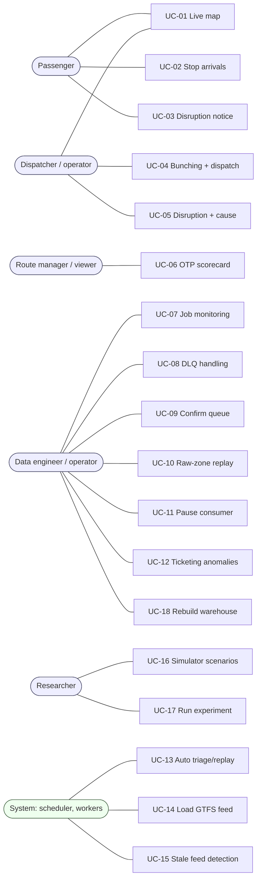

# Use case

> Trạng thái: **Approved** · Cập nhật: 2026-09-28 · DOC-04
> Phụ thuộc: [DOC-02](personas-and-journeys.md), [DOC-03](requirements.md), [Glossary](../02-glossary.md)

Endpoint trong tài liệu này đều có prefix `/api/v1` nhưng được viết tắt, không ghi prefix. Chuỗi trong ngoặc kép `"…"` là chuỗi thật trên UI.

## 0. Sơ đồ tổng

---

## UC-01 · Xem xe trên bản đồ theo thời gian thực

- **Actor:** Hành khách (anonymous), Điều phối viên (operator)
- **Trigger:** mở `/map`
- **Tiền điều kiện:** hệ thống đang nhận GTFS-rt
- **Luồng chính:**
  1. UI tải `GET /routes` (kèm màu tuyến) và `GET /vehicles/live`.
  2. UI mở SSE `GET /stream?channels=vehicles,alerts`.
  3. Bản đồ vẽ tuyến (shape) khi người dùng chọn tuyến, và vẽ icon xe theo hướng di chuyển; zoom xa thì gom cụm.
  4. Mỗi giây nhận `vehicles.batch` và cập nhật vị trí xe (nhảy tới vị trí mới, không nội suy chuyển động; DOC-35 §6.2).
  5. Người dùng bấm vào một xe → panel xe: tuyến, chiều, trạm kế tiếp, độ trễ, "Updated 3 s ago".
- **Luồng thay thế:**
  - 3a. Người dùng lọc theo tuyến → chỉ hiển thị xe của tuyến đó, URL có `?route=21`.
  - 4a. Viewer trở lên: xe đang trong một episode bunching có halo màu fuchsia và đường nối nét đứt giữa hai xe; bấm vào thì mở panel bunching (UC-04).
- **Luồng lỗi:**
  - E1. SSE mất kết nối → tự kết nối lại (backoff 1 s → 30 s) với `Last-Event-ID`; trong lúc đó chuyển sang polling `GET /vehicles/live` mỗi 5 giây.
  - E2. Feed stale → stale banner "Live data is delayed. Vehicle positions were last updated {age} ago." (DOC-37 §2.4).
- **Hậu điều kiện:** không có thay đổi dữ liệu.
- **Quy tắc:** anonymous không thấy overlay bunching và gợi ý điều phối.
- **Liên quan:** FR-05, FR-10.4, FR-11.1; màn hình `screens/live-map.md`.

## UC-02 · Xem giờ đến dự kiến tại trạm

- **Actor:** Hành khách
- **Trigger:** mở `/stops/{stopId}`, hoặc bấm vào một trạm trên bản đồ, hoặc tìm trạm
- **Luồng chính:**
  1. UI gọi `GET /stops/{id}` và `GET /stops/{id}/arrivals?limit=10`.
  2. Hiển thị danh sách: tuyến, headsign, "6 min", giờ dự đoán, giờ theo lịch, chip độ tin cậy ("High confidence · 42 trips").
  3. Nếu có disruption ảnh hưởng tuyến đi qua trạm (audience PUBLIC) → hiện banner.
  4. UI refetch mỗi 30 giây, và ngay khi nhận SSE `alert.*` liên quan.
- **Luồng thay thế:**
  - 1a. Tìm trạm: `GET /stops?q=nicollet` → chọn một kết quả.
  - 2a. Khung không có mẫu → giờ dự đoán bằng giờ theo lịch, ghi "Scheduled", chip "Schedule only".
- **Luồng lỗi:** E1. `404 not-found` → "Stop not found" kèm ô tìm kiếm.
- **Liên quan:** FR-06, FR-11.2.

## UC-03 · Nhận cảnh báo gián đoạn trên tuyến quan tâm

- **Actor:** Hành khách
- **Trigger:** có `alert_event` type DISRUPTION với audience PUBLIC
- **Luồng chính:**
  1. SSE `alert.created` tới client đang mở Live map hoặc Stop detail.
  2. Nếu alert liên quan tuyến đang xem → hiện banner (Stop detail) hoặc toast "Delays on Route 21 (avg ~9 min late)" (Live map).
  3. Khi episode đóng → `alert.updated` (có `resolvedAt`) → banner đổi thành "Service on Route 21 is back to normal", tự ẩn sau 2 phút.
- **Quy tắc:** alert đã được FR-09.5 chuyển sang ENGINEERING thì **không bao giờ** hiện phía hành khách.
- **Liên quan:** FR-07.3, FR-09.5.

## UC-04 · Theo dõi bunching và phản hồi gợi ý điều phối

- **Actor:** Điều phối viên (operator)
- **Tiền điều kiện:** đã đăng nhập với role operator
- **Luồng chính:**
  1. Nhận `bunching.opened` và `dispatch.suggested` qua SSE; Alert feed hiện "Bunching on Route 5 NB — vehicles 1123 & 1187, gap 2.1 min (headway 10 min)".
  2. Bấm vào alert → drawer bunching trong Alerts, hoặc "Show on map" → bản đồ zoom tới cặp xe với panel bunching; khối gợi ý: "Hold the following bus at its next stop" · "82% confidence".
  3. Bấm "Accept" → `POST /insights/dispatch-suggestions/{id}/feedback {"feedback":"accepted"}` (nút "Dismiss" gửi `ignored`) → toast "Feedback saved".
  4. Khi episode đóng → badge biến mất; alert chuyển trạng thái "Resolved".
- **Luồng thay thế:**
  - 2a. Confidence < 0,6 → chip "Low confidence" tông `warning` (DOC-35 §3); nút vẫn bấm được.
  - 2b. Chưa có gợi ý (Jev lỗi hoặc tắt) → "No suggestion available".
  - 3a. Bấm "Dismiss" → `ignored`.
  - 3b. Đổi ý: bấm nút còn lại → ghi đè phản hồi trước (người sau thắng, DOC-32 E-18).
- **Luồng lỗi:** E1. Lỗi mạng hoặc 5xx → nút trở về trạng thái cũ, toast "Couldn't save feedback".
- **Hậu điều kiện:** `insight_dispatch_suggestion.operator_feedback` và `feedback_by`, `feedback_at` được ghi.
- **Liên quan:** FR-05, FR-09.6.

## UC-05 · Xem gián đoạn kèm nguyên nhân khả dĩ

- **Actor:** Điều phối viên
- **Luồng chính:**
  1. Alert feed (OPERATIONS) nhận "Disruption on Route 21 SB — avg delay +9.4 min (z=3.1)".
  2. Drawer chi tiết trong Alerts (`/alerts?alert=<id>`): thẻ trễ trung bình, trễ đỉnh, z-score, "Normal for this time", danh sách trạm bị ảnh hưởng, "Likely cause: Traffic" + chip độ tin cậy, "Data issue probability: 8%".
  3. Bấm "Acknowledge" → `POST /alerts/{id}/ack`.
- **Luồng thay thế:** 2a. Chưa có kết quả làm giàu → "Cause: not yet classified".
- **Liên quan:** FR-07, FR-09.5, FR-14.

## UC-06 · Xem scorecard OTP và xu hướng trễ

- **Actor:** Quản lý tuyến (viewer)
- **Luồng chính:**
  1. Mở `/scorecard?from=…&to=…` (mặc định 7 ngày kết thúc hôm qua).
  2. `GET /insights/otp?from&to` → bảng xếp hạng tuyến theo OTP tăng dần (tệ nhất lên đầu), có sparkline.
  3. Chọn một tuyến → `GET /routes/{id}/delays?from&to&bucket=hour-of-week` → heatmap delay theo giờ × thứ trong tuần, biểu đồ OTP theo ngày; tab "Disruptions" liệt kê episode (`GET /insights/disruption?routeId`).
- **Luồng thay thế:** 2a. Khoảng thời gian quá 31 ngày → UI tự giới hạn và báo "Max range is 31 days".
- **Liên quan:** FR-08, FR-11.3.

## UC-07 · Theo dõi batch và job ETL

- **Actor:** Kỹ sư dữ liệu (viewer đọc, operator thao tác)
- **Luồng chính:**
  1. Mở `/ops/jobs`. `GET /etl/jobs/summary?bucket=1m&from=-60m` → timeline số record read, written, skipped theo phút, tách theo nguồn.
  2. Danh sách job batch (`GET /etl/jobs?kind=BATCH_JOB`) cùng trạng thái; SSE `job.run` cập nhật trực tiếp.
  3. Bấm một lần chạy → `GET /etl/jobs/{id}` (đọc `ops_job_run_v`): các step, bộ đếm read/write/skip/filter, thời lượng, execution context, exit message, link "Open trace" (Tempo) và "Open logs" (Loki) theo `batch_id`.
- **Luồng lỗi:** E1. Job FAILED → dòng tô đỏ; nút "Restart" (operator) → `POST /etl/jobs/{id}/restart` → API ghi yêu cầu, pod `etl-batch` gọi `JobOperator.restart` (ADR-0013, DR-62). Micro-batch streaming không có restart (offset chưa commit thì Kafka giao lại).
- **Liên quan:** FR-11.4, NFR-05.

## UC-08 · Xử lý record trong DLQ

- **Actor:** Kỹ sư dữ liệu (operator)
- **Luồng chính:**
  1. Mở `/ops/dlq?severity=2&status=MANUAL`. `GET /etl/dlq?…` (keyset) → bảng virtualized.
  2. Chọn một record → panel chi tiết: payload (JSON), stage, lỗi, triage (category, severity, confidence, model_version), lịch sử hành động.
  3. Bấm "Edit payload" → CodeMirror; bấm "Save" → `PUT /etl/dlq/{id}/payload` (server validate schema; lỗi thì trả 422 kèm danh sách vi phạm).
  4. Bấm "Replay" → `POST /etl/dlq/{id}/replay` (header `Idempotency-Key`) → UI đổi trạng thái sang "Replay requested" ngay (optimistic).
  5. ETL `DlqReplayJob` xử lý → SSE `dlq.changed` → trạng thái "Replayed" kèm `batch_id`.
- **Luồng thay thế:**
  - 4a. Bấm "Discard" (bắt buộc nhập lý do) → `DISCARDED`.
  - 5a. Replay lại lỗi → record quay về `NEW`, có một dòng mới trong `dlq_action_log`; UI hiện "Replay failed: …".
- **Luồng lỗi:** E1. API trả lỗi ở bước 4 → hoàn tác optimistic update, toast "Replay failed to start".
- **Hậu điều kiện:** mọi thao tác đều ghi `dlq_action_log` (actor = username).
- **Liên quan:** FR-02, FR-12.1.

## UC-09 · Xác nhận đề xuất tự xử lý

- **Actor:** Kỹ sư dữ liệu (operator)
- **Luồng chính:**
  1. Tab "Confirm queue": `GET /etl/dlq?status=PENDING_CONFIRM`.
  2. Mỗi dòng: category, confidence, lý do đề xuất ("transient_network · 0.74 · source healthy").
  3. Bấm "Confirm" (một hoặc nhiều dòng) → `POST /etl/dlq/{id}/confirm` → trở thành replay như UC-08 bước 4–5.
  4. Hoặc bấm "Discard" (bắt buộc nhập lý do) → `DISCARDED`. Muốn sửa trước khi replay thì mở chi tiết, sửa payload (được phép ở `PENDING_CONFIRM`) rồi bấm "Confirm". Không có thao tác trả về `MANUAL` (DOC-15 §4.3).
- **Liên quan:** FR-09.3.

## UC-10 · Replay một khoảng dữ liệu từ raw zone

- **Actor:** Kỹ sư dữ liệu (operator)
- **Luồng chính:**
  1. Mở `/ops/replay` → form: source (`GTFS_RT_VEHICLE_POSITION` | `GTFS_RT_TRIP_UPDATE` | `TICKETING_SALES`, UI hiện nhãn tiếng Anh), from, to, tùy chọn "Recompute analytics".
  2. UI hiện ước lượng (`GET /etl/replays/estimate?…` → số message và thời lượng ước tính, dựa trên nhật ký micro-batch; DOC-32 E-53).
  3. Bấm "Start replay" → xác nhận → `POST /etl/replays` → `replay_request` PENDING.
  4. `RawZoneReplayJob` nhận việc → RUNNING → SSE `job.run` cập nhật tiến độ.
  5. Xong → DONE kèm thống kê (read, written, skipped, thời lượng).
- **Luồng lỗi:**
  - E1. Nguồn đó đã có replay đang chạy → `409` "A replay for this source is already running".
  - E2. Khoảng thời gian không có dữ liệu → DONE với read = 0.
- **Liên quan:** FR-12.2, FR-12.3.

## UC-11 · Tạm dừng và tiếp tục consumer

- **Actor:** Kỹ sư dữ liệu (operator)
- **Luồng chính:** 1. `/ops/controls` → bật switch "Pause GTFS-realtime consumer" → xác nhận → `PUT /etl/flags/etl.consumer.gtfs-rt.paused {"value":true}` → trong ≤ 5 giây consumer pause; dòng "Last processed …" của listener ngừng cập nhật (lag xem ở Grafana). 2. Tắt switch → consumer resume.
- **Quy tắc:** mọi thay đổi cờ đều ghi `updated_by` và log `INFO` `runtime flag changed` (DOC-32 E-57). Tab Controls hiện "Paused by operator · 2 min ago" từ `updatedBy`/`updatedAt`. Không tạo `alert_event`: alert `ConsumerPaused` (DOC-28 §6.3) chỉ bắt `reason` `backoff`/`circuit`, bỏ qua pause có chủ ý bằng cờ. Ops console hiện chip "Paused" trên listener tương ứng ở mọi tab để kỹ sư khác biết.
- **Liên quan:** FR-15.1.

## UC-12 · Xem bất thường ticketing

- **Actor:** Kỹ sư dữ liệu, Quản lý (viewer)
- **Luồng chính:** `/ops/ticketing` → `GET /insights/ticketing-anomalies?from&to&category` → bảng gồm điểm bán, cửa sổ, các chỉ số, category, severity, confidence; bấm một dòng để xem chi tiết `summary`.
- **Liên quan:** FR-09.4.

## UC-13 · Tự động triage và auto-replay (hệ thống)

- **Actor:** triage-worker
- **Trigger:** có record DLQ `NEW`
- **Luồng chính:**
  1. Worker lấy lô bằng SKIP LOCKED → `TRIAGING`.
  2. Gọi `DecisionModel` (Jev) → ghi category, severity, confidence, model_version (`TRIAGED`, cùng transaction với bước 3).
  3. Áp bảng quyết định do code sở hữu (DOC-24 §6.3, ADR-0019):
     - `schema_violation`, `unknown`, hoặc confidence < 0,5 → `MANUAL`.
     - `transient_network`/`upstream_api_error`, confidence > 0,9, chưa auto đủ 2 lần, cờ bật và `AutoReplayGuard` cho phép → `AUTO_REPLAY_SCHEDULED` → chờ nguồn UP ≥ 60 giây → `REPLAY_REQUESTED` (`requested_by = auto`).
     - Còn lại (confidence 0,5–0,9, `referential_integrity`, guard từ chối, cờ tắt) → `PENDING_CONFIRM`.
  4. Phát metric `pti_triage_decisions_total{severity}`. Prometheus bắn `DlqSevereRecords` (severity 2, critical) hoặc `DlqNeedsAttention` (≥ 10 record severity 1 trong 30 phút); Alertmanager gửi email và webhook, API ghi `alert_event` `DLQ_SEVERE` / `INFRA` (ENGINEERING). Severity 0 → chỉ log. triage-worker không tự ghi `alert_event`.
- **Luồng lỗi:**
  - E1. Jev timeout, lỗi 5xx hoặc lỗi mạng → trả record về `NEW`, `triage_attempts += 1`, nhận lại sau backoff (30 s, 60 s, 120 s, 240 s); khi đạt 5 lần → `MANUAL` với category `null` ("Unclassified"). Circuit breaker mở → worker tạm dừng nhận việc, record trả về không bị tính lần thử (DOC-24 §5.4).
  - E3. Nguồn không UP đủ 60 giây trong 6 giờ, hoặc cờ auto-replay bị tắt → `AUTO_REPLAY_SCHEDULED` chuyển sang `PENDING_CONFIRM`.
  - E2. Auto-replay đã đủ 2 lần → `MANUAL`.
- **Liên quan:** FR-09.1–3.

## UC-14 · Nạp phiên bản GTFS static mới (hệ thống)

- **Actor:** etl-batch (scheduler)
- **Trigger:** 03:30 hằng ngày, hoặc `POST /etl/jobs` với `jobName = GtfsStaticLoadJob` (operator, DOC-32 E-33)
- **Luồng chính:**
  1. Lấy feed (từ nguồn cấu hình: đường dẫn trong `sample-data` hoặc URL) → tính SHA-256.
  2. Hash trùng với feed ACTIVE → kết thúc với NOOP.
  3. Lưu zip vào `raw/gtfs-static/…`.
  4. Tạo `feed_version` STAGED → nạp các bảng theo chunk.
  5. Validate toàn feed (DOC-21) → sinh `route_headway`.
  6. Trong 1 transaction: bản cũ → RETIRED, bản mới → ACTIVE.
  7. Phát `feed.activated` → ETL stream làm mới dimension cache.
- **Luồng lỗi:**
  - E1. Validate thất bại → REJECTED kèm report; alert ENGINEERING.
  - E2. Pod chết giữa chừng → execution kẹt ở STARTED → `StaleExecutionRecoverer` (pod khác, sau `pti.batch.stale-after` = 2 phút) đánh dấu FAILED rồi `JobOperator.restart` → chạy tiếp từ chunk cuối đã commit (DR-24).
- **Liên quan:** FR-01.1, FR-04.2.

## UC-15 · Phát hiện feed stale (hệ thống)

- **Trigger:** Prometheus rule `feed_freshness_seconds{source="gtfs-rt"} > 120` kéo dài 1 phút
- **Luồng chính:** Alertmanager → email và webhook → `alert_event` FEED_STALE (ENGINEERING, severity 2); `GET /system/freshness` trả `stale=true` → mọi client hiện stale banner. Khi feed có dữ liệu lại → alert resolved.
- **Liên quan:** FR-14, FR-15.2.

## UC-16 · Điều khiển kịch bản simulator

- **Actor:** Researcher (operator, profile `demo`)
- **Luồng chính:**
  1. `/ops/demo` → danh sách kịch bản cùng tham số từ `GET /sim/scenarios` (ví dụ `bad-data`: `ratio`, `kinds` [`malformed_json`, `schema_violation`, `unknown_route`…], `duration`).
  2. Bấm "Start" → API proxy `POST /sim/scenarios/bad-data` → simulator trả `runId`.
  3. UI hiện đếm ngược cùng số message đã sinh; bấm "Stop" → `DELETE /sim/scenario-runs/{runId}`.
- **Quy tắc:** chỉ bật được khi API chạy với profile `demo`; nếu không thì endpoint trả 404.
- **Liên quan:** FR-13.3, FR-11.7.

## UC-17 · Chạy thực nghiệm

- **Actor:** Researcher (CLI)
- **Luồng chính:** `pti-exp run EXP-01 --runs 30 --seed 42` → runner reset môi trường, chạy các bước (DOC-45), thu ledger và warehouse, tính chỉ số, ghi `experiments/results/EXP-01/<run_id>/`. `pti-exp report EXP-01` → bảng tổng hợp và biểu đồ.
- **Liên quan:** NFR-01, 02, 08, 09.

## UC-18 · Khôi phục warehouse từ raw zone

- **Actor:** Kỹ sư dữ liệu
- **Luồng chính (runbook RB-11):** dừng ETL → drop và tạo lại DB `pti_warehouse` → chạy `db-migrate` → nạp GTFS từ raw zone → `RawZoneReplayJob` toàn bộ khoảng thời gian cho từng nguồn → recompute analytics → đối chiếu checksum → bật lại ETL.
- **Liên quan:** FR-12.2, EXP-04, DOC-43.
