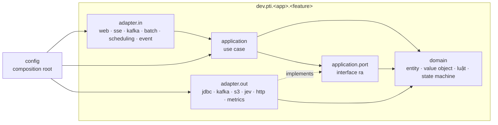

# Clean Architecture cho backend Java

> Trạng thái: **Approved** · Cập nhật: 2026-09-30 · DOC-49
> Phụ thuộc: [ADR-0032](../04-adr/0032-clean-architecture.md), [DR-104](../00-decision-register.md), [ADR-0014](../04-adr/0014-deployment-units.md) (module và ranh giới), [ADR-0018](../04-adr/0018-decision-model-port.md) (cổng `DecisionModel`), [ADR-0026](../04-adr/0026-no-outbox-for-ui-events.md), DOC-30 (lỗi), DOC-44 §3.3 (luật ArchUnit), DOC-44 §4 (test theo module)

Tài liệu này quy định **cách tổ chức code bên trong mỗi module Java**: chia tầng ra sao, tầng nào được phụ thuộc tầng nào, cơ chế Spring nằm ở đâu, và luật ArchUnit nào kiểm tra điều đó. Ranh giới **giữa** các module (module nào được dùng module nào) vẫn theo ADR-0014 và luật A-01…A-04; tài liệu này không đổi các ranh giới đó.

## 1. Phạm vi áp dụng

| Module | Trạng thái | Áp dụng từ | Kiểm tra |
| --- | --- | --- | --- |
| `analytics` | Mới (P4) | P4-00 | A-11…A-18 đầy đủ, fail build |
| `api` | Mới (P4) | P4-00 | A-11…A-18 đầy đủ, fail build |
| `triage-worker` | Mới (P6) | P6-00 | A-11…A-18 đầy đủ, fail build |
| `etl` | Cũ (P2) | Phase R (RF-03, RF-04) | Tới Phase R: `FreezingArchRule` (§9.2). **Package mới** thêm vào `etl` từ P4 (ví dụ `dev.pti.etl.analytics`) phải tuân thủ ngay |
| `source-simulator` | Cũ (P1, P3) | Phase R (RF-02) | Như `etl` |
| `common` | Cũ (P1) | Phase R (RF-01) | Như `etl`. Lớp mới thêm vào `common` phải Java thuần nếu nằm trong shared kernel (§4.2) |
| `db` | Cũ (P1) | Phase R (RF-05) | Như `etl` (chỉ là Flyway runner, gần như không có việc) |

**Không áp dụng:** frontend (cấu trúc theo DOC-34, DOC-35) và `experiments/` (Python, ADR-0025).

Quy tắc chuyển tiếp cho module cũ trước Phase R:

- Sửa lỗi hay thêm hành vi nhỏ vào package cũ: giữ kiểu code hiện có, không bắt buộc refactor, nhưng **không được làm tăng baseline freeze** (thêm vi phạm mới là CI đỏ).
- Thêm một feature mới vào module cũ: tạo package feature mới theo đúng bố cục §3.
- Không refactor lẻ tẻ code cũ ngoài Phase R, trừ khi việc đó là điều kiện của một task đang làm. Refactor gom lại ở Phase R để chạy hồi quy một lần (RF-08).

## 2. Bốn tầng và quy tắc phụ thuộc



**Quy tắc phụ thuộc:** mũi tên chỉ đi vào trong. `domain` không biết gì về tầng khác. `application` chỉ biết `domain` và các port của chính nó. Adapter biết `application` và `domain`, không biết adapter khác. `config` biết mọi thứ và là nơi duy nhất nối chúng lại.

| Tầng | Chứa | Không được chứa | Framework |
| --- | --- | --- | --- |
| `domain` | Record, enum, value object, luật nghiệp vụ thuần, máy trạng thái (ví dụ cặp bunching DOC-23 §5.5, bảng quyết định DLQ DOC-24), exception nghiệp vụ | I/O, thời gian thật, annotation framework, DTO | Không. Java thuần |
| `application` | Use case (điều phối một thao tác nghiệp vụ, ranh giới transaction, gọi port, trả kết quả) | SQL, Kafka, HTTP, JSON, Micrometer | Không. Java thuần |
| `application.port` | Interface ra mà use case cần: kho dữ liệu, publisher, client ngoài, metric; port dùng chung `TransactionRunner` nằm ở `common.tx` (§4.2) | Hiện thực | Không |
| `adapter.in.<kind>` | Điểm vào: `@RestController`, SSE, `@KafkaListener`, tasklet/reader/writer Spring Batch, `@Scheduled`, `@EventListener`. DTO vào/ra và mapper | Luật nghiệp vụ; gọi adapter ra | Được |
| `adapter.out.<kind>` | Hiện thực port: `JdbcClient`, `KafkaTemplate`, S3, `TypeSafeClient`, Micrometer, Caffeine | Luật nghiệp vụ; gọi use case | Được |
| `config` | `@Configuration`, `@Bean` cho use case, `@ConfigurationProperties`, bean hạ tầng (executor, Resilience4j) | Logic | Được |

## 3. Bố cục package

```
dev.pti.<app>
  <App>Application.java              # @SpringBootApplication, lớp duy nhất ở package gốc
  config/                            # composition root cấp app (properties, bean chung)
  <feature>/
    domain/
    application/
      port/
    adapter/
      in/<kind>/                     # web, sse, kafka, batch, scheduling, event
      out/<kind>/                    # jdbc, kafka, s3, jev, http, metrics, fake
    config/                          # tùy chọn: wiring riêng của feature
```

- **Feature ở cấp một, tầng ở cấp hai.** Luật A-05 (không có package `controller`, `service`, `repository`, `dto` ở cấp một) vẫn đúng.
- **`core`**: feature đặc biệt chứa domain và application dùng chung giữa các feature của cùng app (ví dụ `dev.pti.analytics.core.domain.RunResult`). Chia tầng như mọi feature.
- **`platform`**: feature đặc biệt chứa hạ tầng cắt ngang, chủ yếu là adapter và config: security, Problem Details, rate limit, datasource, cache, tracing. Không có use case nghiệp vụ.
- Thư viện (`analytics`) không có `adapter.in`: phần kích hoạt nằm ở app nhúng thư viện (`etl`, ADR-0014).

Ví dụ một feature của `api` (arrivals, DOC-32 E-06…E-08):

```
dev.pti.api.transit
  domain/          Arrival, ArrivalConfidence, StopId
  application/     GetStopArrivals                    # use case
  application/port/ArrivalReader, FeedVersionReader
  adapter/in/web/  StopArrivalsController, ArrivalResponse, ArrivalMapper
  adapter/out/jdbc/JdbcArrivalReader                   # datasource reader, SQL DOC-23 §7.4
```

Ví dụ một feature của `analytics` (bunching, DOC-23 §5):

```
dev.pti.analytics.bunching
  domain/           PairState, PairTransition, BunchingEvaluation, BunchingThresholds
  application/      BunchingDetector                   # implements core.application.RouteDetector
  application/port/ BunchingStateStore, VehicleHistoryReader, BunchingEpisodeWriter
  adapter/out/jdbc/ JdbcBunchingStateStore, JdbcVehicleHistoryReader, JdbcBunchingEpisodeWriter
```

Quy ước tên:

| Loại | Tên | Ví dụ |
| --- | --- | --- |
| Use case | Động từ + danh từ, một phương thức public | `GetStopArrivals.execute(...)`, `ReplayDeadLetter.execute(...)` |
| Port ra | Danh từ theo vai trò | `ArrivalReader`, `BunchingStateStore`, `UiEventPublisher` |
| Adapter ra | Công nghệ + tên port | `JdbcArrivalReader`, `KafkaUiEventPublisher`, `MicrometerBunchingMetrics` |
| Adapter vào | Theo cơ chế | `StopArrivalsController`, `UiEventConsumer`, `EtaAggregationTasklet` |
| DTO | Hậu tố `Request`/`Response`/`Message` | `ArrivalResponse` |

## 4. Phụ thuộc được phép

### 4.1 `domain` và `application`

Chỉ được dùng:

- JDK (`java.lang`, `java.util`, `java.time`, `java.util.concurrent`, `java.util.function`, `java.math`, `java.net.URI`). **Không** `java.sql`, `javax.sql`.
- `org.jspecify.annotations` (`@Nullable`).
- `org.slf4j` (log). Log ở `application`, hạn chế ở `domain`.
- Shared kernel của `common` (§4.2).
- `domain`/`application` của feature khác trong cùng app (§4.3).

Mọi thứ khác bị A-12 chặn, gồm: `org.springframework..`, `jakarta..`, `tools.jackson..`, `com.fasterxml.jackson..`, `io.micrometer..`, `io.opentelemetry..`, `org.apache.kafka..`, `software.amazon..`, `io.github.resilience4j..`, `com.github.benmanes.caffeine..`, `net.javacrumbs.shedlock..`, `org.springaicommunity..`, `com.bucket4j..`.

Hệ quả thực tế:

- **Thời gian:** nhận `BusinessClock` (hoặc `java.time.Clock`) qua constructor. Không gọi `Instant.now()` (A-07).
- **Metric:** port riêng của feature, ví dụ `BunchingMetrics.episodeOpened(routeId)`; `MicrometerBunchingMetrics` ở `adapter.out.metrics` hiện thực bằng Micrometer.
- **Cấu hình:** `@ConfigurationProperties` nằm ở `config`; `config` chuyển nó thành record thuần (ví dụ `BunchingThresholds`) rồi truyền vào constructor của use case.
- **Validation:** `jakarta.validation` chỉ dùng trên DTO ở `adapter.in.web`. Domain tự kiểm tra bất biến trong constructor.
- **Cache:** Caffeine là chi tiết của adapter ra (ví dụ `AnalyticsReferenceCache` là port, lớp nạp và cache là `adapter.out.jdbc`).

### 4.2 Shared kernel của `common`

`domain` và `application` chỉ được dùng các package Java thuần sau của `common` (A-13):

| Package | Được dùng | Ghi chú |
| --- | --- | --- |
| `dev.pti.common.time` | `BusinessClock`, `DayType`, `Timestamps` | |
| `dev.pti.common.error` | `PtiException` và các lớp con | **Trừ** `ErrorClassifier` (dùng Spring, chỉ adapter được gọi) |
| `dev.pti.common.dq` | `DlqStage` | |
| `dev.pti.common.gtfs` | `GtfsTime` | Đọc zip/CSV GTFS là việc của adapter |
| `dev.pti.common.tx` | `TransactionRunner` (mới ở P4-18) | Chỉ interface; hiện thực Spring ở `common.spring` là adapter |
| `dev.pti.common.id` | `InsightIds` (mới ở P4, DOC-23 §2.3) | Java thuần |
| `dev.pti.common.events` | `UiChannel`, `Audience`, `UiEvent` (mới ở P4, DOC-33 §2) | Phải giữ Java thuần: tên viết thường khi serialize do adapter Kafka lo. `UiEventPublisher` là port; hiện thực bằng `KafkaTemplate` là adapter ra |

Không nằm trong shared kernel (chỉ adapter được dùng): `common.message` (record mang annotation Jackson, schema), `common.json`, `common.pii` (thao tác trên cây Jackson), `common.error.ErrorClassifier`. Phase R (RF-01) tách phần thuần của các package này ra shared kernel.

Port dùng chung giữa các app đặt trong `common`, Java thuần:

```java
package dev.pti.common.tx;

/** Transaction boundary chosen by a use case. Implemented with Spring's TransactionTemplate. */
public interface TransactionRunner {
  /** Joins the current transaction or starts one (REQUIRED). */
  <T> T inTransaction(Supplier<T> work);
  /** Always starts a new transaction (REQUIRES_NEW), e.g. one route per transaction in DOC-23 §3. */
  <T> T inNewTransaction(Supplier<T> work);
}
```

Hiện thực `SpringTransactionRunner` nằm ở `dev.pti.common.spring` (adapter trong `common`, dùng `spring-tx`), được mỗi app khai báo bean trong `config`. Làm ở P4-18.

### 4.3 Giữa các feature trong cùng app

- Feature A được gọi use case của feature B (`B.application`) và dùng kiểu của `B.domain`.
- Feature A **không** được dùng `B.adapter..` hay `B.config..` (A-14).
- Không có vòng phụ thuộc giữa các feature (A-14, `slices().should().beFreeOfCycles()`).
- Kiểu dùng chung nhiều nơi thì chuyển vào `core`.

## 5. Cơ chế Spring nằm ở đâu

| Cơ chế | Tầng | Việc của adapter | Ví dụ |
| --- | --- | --- | --- |
| REST controller | `adapter.in.web` | Parse và validate DTO, lấy `Viewer` từ security context, gọi use case, map sang response, header `X-Data-As-Of` | `StopArrivalsController` |
| SSE | `adapter.in.sse` | `SseEmitter`, dựng khung SSE; hiện thực port gửi khung của `stream.application` | `StreamController`, `SseFrameWriter` |
| `@KafkaListener` | `adapter.in.kafka` | Deserialize, map message sang lệnh, gọi use case, ack theo ADR-0004 | `UiEventConsumer` |
| Spring Batch tasklet | `adapter.in.batch` | Đọc `JobParameters`/`ExecutionContext`, gọi use case, trả `RepeatStatus` | `EtaAggregationTasklet` |
| Spring Batch reader/processor/writer | `adapter.in.batch` | Writer gọi port ghi; transaction của chunk do framework giữ (§5.1) | (code cũ ở `etl`, Phase R) |
| `@Scheduled` + ShedLock | `adapter.in.scheduling` | Chỉ kích hoạt use case, không chứa logic | `AnalyticsTickScheduler`, `AutoReplayScheduler` |
| `@EventListener` / `@Async` | `adapter.in.event` | Nhận sự kiện Spring trong process, đẩy vào executor, gọi use case | `AnalyticsDispatcher` (nhận `MicroBatchCommitted`) |
| `JdbcClient`, SQL | `adapter.out.jdbc` | Hiện thực port; map `ResultSet` sang domain | `JdbcBunchingStateStore` |
| `KafkaTemplate` | `adapter.out.kafka` | Envelope DOC-09 §6, header, key | `KafkaAnalyticsEventSink` |
| Client ngoài (Jev, S3) | `adapter.out.jev`, `adapter.out.s3` | SDK, Resilience4j, ánh xạ lỗi | `JevDecisionModel` |
| Micrometer, tracing | `adapter.out.metrics`; observation trên adapter vào | Hiện thực port metric | `MicrometerBunchingMetrics` |
| Bean use case | `config` | `@Bean` gọi constructor của use case với port và cấu hình | `BunchingConfiguration` |

Use case không mang `@Service`/`@Component`. Chúng được tạo bằng `@Bean` trong `config`:

```java
package dev.pti.analytics.bunching.config;

@Configuration(proxyBeanMethods = false)
class BunchingConfiguration {

  @Bean
  BunchingDetector bunchingDetector(BunchingStateStore store, VehicleHistoryReader history,
                                    BunchingEpisodeWriter writer, AnalyticsReferenceCache reference,
                                    TransactionRunner tx, BusinessClock clock, AnalyticsProperties props) {
    return new BunchingDetector(store, history, writer, reference, tx, clock, props.bunching().toThresholds());
  }
}
```

### 5.1 Transaction

- **Ranh giới transaction là quyết định nghiệp vụ**, nên nằm ở use case, qua port `TransactionRunner` (§4.2). Không dùng `@Transactional` ở `application` (A-12 chặn).
- Adapter ra **không tự mở transaction**; chúng chạy trong transaction mà use case đã mở.
- Gọi từ tasklet Spring Batch: step đã có transaction, `inTransaction` nhập vào transaction đó; `inNewTransaction` tách riêng (ví dụ mỗi tuyến một transaction, DOC-23 §3).
- **Ngoại lệ Spring Batch chunk** (code cũ ở `etl`, xem xét lại ở Phase R): transaction của chunk do framework giữ và ranh giới đã được chứng minh bằng test B-xx (DOC-19, DR-80, B-19). Writer là adapter vào, gọi port ghi. Không bọc thêm `TransactionRunner` trong writer.
- `StreamChunkTemplate` (DOC-19 §6.2) giữ nguyên hành vi; ở Phase R nó trở thành application service của `etl` với port ghi, hoặc giữ ở adapter nếu tách ra làm hỏng test F-xx. Quyết định ghi vào DR khi làm RF-03.

### 5.2 Sự kiện sau commit

Theo ADR-0026, sự kiện UI được publish **sau** commit, không qua outbox. Use case làm việc này bằng cách gọi port publish **sau khi** `TransactionRunner` trả về:

```java
RunResult result = tx.inNewTransaction(() -> advanceInTransaction(routeId, trigger));
events.publish(result.events());   // AnalyticsEventSink: best-effort, never throws
```

Không dùng `TransactionSynchronization` hay `@TransactionalEventListener` trong `application`. Nếu use case chạy bên trong một transaction lớn hơn (ví dụ `inTransaction` nhập vào transaction của tasklet), nó không tự publish mà trả sự kiện về; adapter vào publish sau khi transaction ngoài commit (ví dụ trong `StepExecutionListener.afterStep`).

## 6. DTO và mapping

- Mọi DTO (REST, SSE, Kafka, JSON lưu DB) nằm ở adapter. Domain không mang annotation Jackson, JPA hay validation.
- Mapper nằm cạnh DTO, trong cùng package adapter. Viết tay, không dùng thư viện mapping.
- Use case nhận tham số là kiểu domain hoặc record lệnh (`command`) định nghĩa trong `application`, không nhận DTO.
- Kiểu message Kafka của `common.message` là DTO: chỉ adapter vào Kafka dùng, map sang kiểu domain rồi mới gọi use case.
- JSON tự do lưu trong DB (ví dụ `payload` của dead letter) được giữ dưới dạng `String` hoặc kiểu domain riêng; parse ở adapter.

## 7. Lỗi theo tầng

Khớp với DOC-30:

| Tầng | Ném | Bắt |
| --- | --- | --- |
| `domain` | Lớp con của `PtiException` cho lỗi nghiệp vụ; `IllegalArgumentException`/`IllegalStateException` cho guard trong constructor (A-08) | — |
| `application` | Như `domain`; thêm lỗi "không tìm thấy", "xung đột trạng thái" thành lớp con của `PtiException` | Không bắt exception hạ tầng (không biết chúng tồn tại) |
| `adapter.out` | Dịch exception hạ tầng (`DataAccessException`, `KafkaException`, lỗi SDK) sang phân loại DOC-30 (`TransientInfraException`, `FatalException`…) bằng `ErrorClassifier` | Exception của thư viện |
| `adapter.in.web` | — | `@RestControllerAdvice` ở `platform.adapter.in.web` map exception sang Problem Details (DOC-31 §9) |
| `adapter.in.kafka` / `batch` | — | Theo DOC-19, DOC-20 (retry, DLQ, skip) |

## 8. Test theo tầng

| Tầng | Loại test | Công cụ | Không dùng |
| --- | --- | --- | --- |
| `domain` | Unit, bảng test (ví dụ bảng bunching DOC-23) | JUnit, AssertJ | Mockito, Spring |
| `application` | Unit với port giả viết tay (in-memory) hoặc Mockito | JUnit, AssertJ, Mockito | Spring context |
| `adapter.out.jdbc` | Integration với Postgres thật | Testcontainers | H2 |
| `adapter.out.kafka` / `adapter.in.kafka` | Integration với Kafka thật; contract test schema | Testcontainers, DOC-44 §9 | `@EmbeddedKafka` |
| `adapter.in.web` | Slice `@WebMvcTest` + security test (DOC-27) | Spring test | — |
| `config` | Một test khởi động context mỗi app | `@SpringBootTest` | — |

Port giả dùng lại được đặt trong `src/testFixtures` của module (ví dụ `InMemoryBunchingStateStore`). Fake chạy ở runtime (ví dụ `FakeDecisionModel`, ADR-0018) là adapter thật, đặt ở `adapter.out.fake`.

## 9. Luật ArchUnit

Thêm vào `PtiArchitectureRules` (`backend/common/src/testFixtures`) ở P4-18. Chi tiết trong DOC-44 §3.3.

### 9.1 Luật

| # | Luật |
| --- | --- |
| A-11 | Phân tầng (`layeredArchitecture()`, theo từng feature): `domain` không phụ thuộc `application`, `adapter`, `config`; `application` không phụ thuộc `adapter`, `config`; `adapter` không phụ thuộc `config`, trừ lớp `@ConfigurationProperties` (adapter được đọc cấu hình của nó) |
| A-12 | Lớp trong `..domain..` và `..application..` không phụ thuộc framework và hạ tầng (danh sách ở §4.1), trừ ngoại lệ ở §10 |
| A-13 | Lớp trong `..domain..` và `..application..` chỉ phụ thuộc `dev.pti.common..` qua shared kernel (§4.2) |
| A-14 | Lớp của feature A không phụ thuộc `..adapter..` hay `..config..` của feature B; các feature không tạo vòng phụ thuộc |
| A-15 | Lớp trong `..adapter.in..` không phụ thuộc `..adapter.out..` (kể cả cùng feature) |
| A-16 | Lớp có `@Configuration`, `@Bean`, `@ConfigurationProperties` chỉ nằm trong `..config..` |
| A-17 | Lớp hiện thực interface thuộc `..application.port..` chỉ nằm trong `..adapter..` (production) hoặc test source |
| A-18 | Mọi lớp dưới `dev.pti.<app>.<feature>` thuộc một trong các tầng `domain`, `application`, `adapter`, `config`. Ở package gốc của app chỉ có lớp `*Application` |

### 9.2 Freeze cho module cũ

- Module mới (`analytics`, `api`, `triage-worker`) gọi các luật trực tiếp: vi phạm là test đỏ.
- Module cũ (`etl`, `source-simulator`, `common`, `db`) gọi `FreezingArchRule.freeze(rule)`. Vi phạm hiện có được ghi vào store `backend/<module>/src/test/resources/archunit_store/`, commit vào repo.
- `archunit.properties` của mỗi module cũ: `freeze.store.default.allowStoreCreation=false` (CI không tự tạo store), `freeze.store.default.allowStoreUpdate=true` (vi phạm đã sửa tự bị xóa khỏi store), và `freeze.store.default.path=src/test/resources/archunit_store` (Gradle chạy test với thư mục làm việc là thư mục module).
- Store chỉ được **giảm**. Diff làm store tăng là lý do từ chối commit. Store chỉ được tạo một lần, ở P4-18; số vi phạm theo module lúc tạo ghi vào bảng §12.
- Phase R đưa store về rỗng rồi xóa `FreezingArchRule` (RF-07).

## 10. Ngoại lệ đã biết

Danh sách đóng. Thêm ngoại lệ mới cần một DR.

| # | Ngoại lệ | Phạm vi | Lý do |
| --- | --- | --- | --- |
| X-01 | Cây JSON của Jackson (`tools.jackson.databind.JsonNode`, `tools.jackson.databind.node..`) và `dev.pti.common.pii` | `dev.pti.triage..application..` | Trạng thái gửi cho Jev là tài liệu JSON tự do theo từng use case (ADR-0018, DOC-24 §4.2); dựng một cây tương đương chỉ để né Jackson không thêm giá trị. Chỉ dùng mô hình cây, không dùng `ObjectMapper` (serialize nằm ở `adapter.out.jev`) |
| X-02 | Transaction của Spring Batch chunk | `adapter.in.batch` của `etl` | §5.1 |
| X-03 | `@Scheduled` và `@SchedulerLock` trên lớp adapter vào | `adapter.in.scheduling` | Đó chính là adapter vào; không phải ngoại lệ của A-12, ghi ra để tránh hiểu nhầm |

## 11. Ánh xạ thiết kế của module mới

Tài liệu thiết kế P4–P6 viết trước quyết định này. Bảng dưới là cách đặt các thành phần đã thiết kế vào tầng. Hành vi, tên lớp và hợp đồng không đổi.

### 11.1 `analytics` (DOC-23)

| Thành phần (DOC-23) | Feature | Tầng |
| --- | --- | --- |
| `Detector`, `Trigger`, `Outcome`, `RunResult` | `core` | `domain` |
| `RouteDetector` | `core` | `application` (interface chung của use case theo tuyến) |
| Tiện ích lưới event time (P4-02); UUIDv5 dùng `InsightIds` của `common.id` (§4.2) | `core` | `domain` |
| `AnalyticsReferenceCache` | `reference` | `application.port` |
| `RouteInfo`, `TripPattern`, `PatternStop` | `reference` | `domain` |
| Lớp nạp tham chiếu (Caffeine + SQL) | `reference` | `adapter.out.jdbc` |
| State machine cặp bunching (§5.5), đánh giá mốc (§5.4) | `bunching` | `domain` |
| `BunchingDetector` | `bunching` | `application` |
| Bảng `analytics_bunching_*`, `insight_bus_bunching` | `bunching` | port ở `application.port`, SQL ở `adapter.out.jdbc` |
| Baseline, hysteresis, `DisruptionDetector` | `disruption` | `domain` / `application`, tương tự bunching |
| `EtaAggregator`, `OtpScorecardCalculator` | `eta`, `otp` | `application`; phần tổng hợp bằng SQL nằm ở `adapter.out.jdbc` sau port (ví dụ `EtaAggregateStore.recompute(window)`); công thức, cửa sổ và tham số ở `application`/`domain` |
| `TicketingAnomalyDetector` (P6-05) | `ticketing` | như trên |
| `InsightEvent`, `AnalyticsEventSink` | `event` | `application.port` |
| Ghi `alert_event` | `alert` | port + `adapter.out.jdbc` |
| `AnalyticsRecomputeService` | `recompute` | `application` |
| Bean và `AnalyticsProperties` | từng feature / `dev.pti.analytics.config` | `config` |

Phần nối trong `etl` (code mới ở P4, nên phải tuân thủ): package `dev.pti.etl.analytics` (thay cho `dev.pti.etl.stream.analytics` ghi ở DOC-23 §4.1):

| Thành phần | Tầng |
| --- | --- |
| `AnalyticsDispatcher` (nhận `MicroBatchCommitted`, executor `analyticsExecutor`) | `adapter.in.event` |
| `tick()` | `adapter.in.scheduling` |
| Tasklet của `EtaAggregationJob`, `OtpScorecardJob`, `TicketingAnomalyJob`, `AnalyticsRecomputeJob`, step `recomputeAnalytics` | `adapter.in.batch` |
| `KafkaAnalyticsEventSink` | `adapter.out.kafka` |
| Bean executor, job definition | `config` |

### 11.2 `api` (DOC-26, DOC-31, DOC-32)

| Feature | Endpoint (DOC-32) | Ghi chú tầng |
| --- | --- | --- |
| `transit` | `/routes`, `/stops`, `/vehicles/live`, arrivals | Use case đọc; repository ở `adapter.out.jdbc` dùng datasource `reader` |
| `insight` | bunching, disruption, otp, dispatch-suggestions + feedback | Feedback là use case ghi qua `@OperatorRepository` |
| `etlops` | jobs, dlq, replay, confirm, discard, flags | Ghi `replay_request`/`job_request` (ADR-0013), idempotency (DOC-31 §8) ở `application` |
| `alert` | alerts, ack, webhook Alertmanager | Webhook là `adapter.in.web` |
| `system` | freshness | Gauge `pti_source_last_event_age_seconds` ở `adapter.out.metrics` |
| `stream` | `/stream` (SSE) | Xem bảng dưới |
| `platform` | — | Security (DOC-27), `@RestControllerAdvice`, Bucket4j, Caffeine, hai datasource, `X-Data-As-Of` |

`stream` (DOC-26 §3):

| Thành phần | Tầng |
| --- | --- |
| `HubEvent`, `Subscription`, `Viewer`, `CloseReason` (dùng `UiChannel`, `Audience` của `common.events`) | `domain` |
| `EventHub`, `EventRingBuffer`, `VehicleThrottle`, hàng đợi kết nối, lọc theo audience | `application` |
| Port gửi khung tới một kết nối | `application.port` |
| `UiEventConsumer` (Kafka, `ConsumerSeekAware`) | `adapter.in.kafka` |
| `StreamController`, `SseFrameWriter`, hiện thực port gửi khung bằng `SseEmitter` | `adapter.in.sse` |

Hai datasource (DOC-31 §10.1): repository là `adapter.out.jdbc`, gắn datasource qua `@Qualifier("reader")`/`@Qualifier("operator")` như cũ; luật A-03 (`@OperatorRepository`) và AG-15 giữ nguyên. Mỗi datasource có một bean `TransactionRunner` riêng: `readerTx` (`readOnly = true`) và `operatorTx` (`READ COMMITTED`); `config` truyền đúng bean vào use case, nên use case không biết tên datasource.

### 11.3 `triage-worker` (DOC-24 §4.1)

| Package (DOC-24) | Package mới | Tầng |
| --- | --- | --- |
| `model` (`DecisionModel`) | `model.application.port` | port (ADR-0018) |
| `model` (`Question`, `Answer`, `Decision`, `ModelVersion`, exception) | `model.domain` | `domain` |
| `model.jev`, `model.fake`, `model.disabled` | `model.adapter.out.jev`, `.fake`, `.disabled` | adapter ra |
| `loop` (`EnrichmentLoop`, `LeaseSweeper`, `LoopPauser`) | `loop.application` | `application`; `WorkQueue` ở `loop.application.port` |
| `dlq` (`DlqDecisionTable`, `AutoReplayGuard`) | `dlq.domain` | `domain` |
| `dlq` (`DlqStateBuilder`, `DlqQuestions`) | `dlq.application` | `application` (ngoại lệ X-01) |
| `dlq` (`DlqWorkQueue`) | `dlq.adapter.out.jdbc` | adapter ra |
| `dlq` (`AutoReplayScheduler`) | `dlq.adapter.in.scheduling` | adapter vào |
| `ticketing`, `disruption`, `dispatch` | như `dlq` | `*StateBuilder`, `*Questions` ở `application`; `*WorkQueue`, `*ResultWriter` ở `adapter.out.jdbc` |
| `health` (`SourceHealthClient`) | `health.application.port` + `health.adapter.out.jdbc` | port + adapter |
| `guard` (`PiiGuard`) | `guard.application` | `application` (ngoại lệ X-01) |
| `flags` (`RuntimeFlagRefresher`) | `flags.adapter.in.scheduling` + port | adapter vào |
| `events` (`UiEventPublisher`) | `events.application.port` + `events.adapter.out.kafka` | port + adapter |
| `config` | `dev.pti.triage.config` | `config` |

Luật riêng của DOC-24 §4.1 đổi tên package: chỉ `..model.adapter.out.jev..` được import `org.springaicommunity.typesafe..`.

## 12. Phase R: refactor code cũ

Làm theo thứ tự ở master plan §5 (Phase R). Nguyên tắc:

1. **Không đổi hành vi bên ngoài**: API, topic, schema message, bảng, metric, log key, cấu hình (DOC-29) giữ nguyên. Buộc phải đổi thì cần DR.
2. **Test trước**: trước khi chuyển một package, các test integration và fault-injection của nó (DOC-44 §8, B-xx, S-xx, F-xx) phải xanh và đủ bao phủ. Refactor xong chạy lại đúng các test đó.
3. **Từng feature một**, mỗi bước một commit xanh CI. Không có nhánh refactor sống lâu.
4. **Store freeze giảm dần**: mỗi commit refactor làm store nhỏ đi; số vi phạm còn lại theo module ghi ở bảng dưới khi đóng mỗi task RF.
5. Cập nhật tài liệu thiết kế của code cũ (DOC-19, 20, 21, 22, 25, 30) trong cùng commit với code (RF-06).
6. Hồi quy cuối (RF-08): toàn bộ test, `pti-exp smoke` đạt như M3, so số liệu với chuỗi `p3-08-d`.

| Module | Vi phạm lúc freeze (P4-18) | Còn lại | Task |
| --- | --- | --- | --- |
| `common` | 64 (A-08: 6, A-14: 16, A-18: 42) | 64 | RF-01 |
| `source-simulator` | 254 (A-08: 18, A-14: 28, A-16: 36, A-18: 172) | 254 | RF-02 |
| `etl` | 290 (A-07: 9, A-08: 41, A-14: 42, A-18: 198) | 290 | RF-03, RF-04 |
| `db` | 2 (A-18: 2) | 2 | RF-05 |

Ghi chú về số liệu lúc freeze (P4-18):

- Đơn vị là số dòng vi phạm trong store, tức số vi phạm ArchUnit báo. Các luật không liệt kê có 0 vi phạm: `A-11`, `A-12`, `A-13`, `A-15`, `A-17` đạt vì code cũ chưa có tầng `domain`/`application`/`adapter`, không phải vì đã được refactor.
- `A-07` (`etl`) và `A-08` (`etl`, `source-simulator`, `common`) cũng bị freeze vì code cũ vi phạm: `A-07` do `Clock.systemUTC()` trong các lớp `config` và `Instant.now()` trong `FeedWorkspace`; `A-08` do exception riêng không kế thừa `PtiException` (`JobRequestPoller.Rejected`, `FeedRejectedException`, `ScenarioException`, `InvalidParamException`…), `UncheckedIOException` và `UnsupportedOperationException` của `BusinessClock.withZone`. Luật `A-01`…`A-06`, `A-09`, `A-10` không có vi phạm nên chạy thẳng, không freeze.
- Store của `common` chỉ phủ các package cũ (`message`, `json`, `pii`, `gtfs`, `time`, `error`, `dq`). Các package thêm ở P4-18 (`tx`, `id`, `events`, `spring`) là shared kernel phẳng theo §4.2 nên không áp `A-11`…`A-18` và không nằm trong store; thay vào đó luật "shared kernel là Java thuần" chạy thẳng.
- Với `etl`, `source-simulator`, `db`: package nằm ngoài danh sách package cũ trong `ArchitectureTest` của module (ví dụ `dev.pti.etl.analytics`) bị kiểm `A-11`…`A-18` **không qua freeze**, ngoài việc mọi vi phạm không có trong store đều làm test đỏ.

## 13. Checklist review

Dùng khi review một thay đổi Java ở module đã áp dụng:

- [ ] Lớp mới nằm đúng feature và đúng tầng (§3); không thêm package ngoài bốn tầng.
- [ ] `domain` và `application` không import framework (§4.1); thời gian lấy từ `BusinessClock`.
- [ ] Use case có một phương thức public, nhận kiểu domain hoặc command, không nhận DTO.
- [ ] Ranh giới transaction nằm ở use case qua `TransactionRunner`; không có `@Transactional` ngoài adapter hoặc config.
- [ ] Sự kiện UI được publish sau khi transaction trả về (§5.2).
- [ ] Controller, listener, tasklet, scheduler chỉ map dữ liệu và gọi use case.
- [ ] Use case được tạo bằng `@Bean` trong `config`, không có `@Service`/`@Component`.
- [ ] Logic mới có unit test không cần Spring context; adapter mới có integration test với hạ tầng thật.
- [ ] `./gradlew test` xanh, gồm A-11…A-18; store freeze của module cũ không tăng.
