# Luồng dữ liệu

> Trạng thái: **Review** · Cập nhật: 2026-09-27 · DOC-08
> Phụ thuộc: [DOC-07](system-context-and-containers.md), [DOC-09](messaging-contracts.md), [DOC-19](../06-design/batch-and-chunk-processing.md), [DOC-20](../06-design/etl-streaming.md), [DOC-21](../06-design/etl-gtfs-static.md), [DOC-22](../06-design/dlq-and-replay.md), [ADR-0003](../04-adr/0003-effectively-once-upsert.md), [ADR-0004](../04-adr/0004-offset-commit-after-transaction.md), [ADR-0013](../04-adr/0013-replay-request-api-etl-executes.md), [DR](../00-decision-register.md) (DR-35, 37, 38, 41, 42, 57)
> Người dùng chính: mọi người đọc cần hình dung hệ thống chạy thế nào trước khi vào tài liệu thiết kế chi tiết

Mỗi mục là một sequence diagram cho một luồng, kèm vài ghi chú về điểm quan trọng và link tới tài liệu chi tiết. Tài liệu này **không** định nghĩa hành vi mới: khi có khác biệt, tài liệu thiết kế được dẫn là nguồn đúng.

Ký hiệu chung: `PG-W` = Postgres warehouse (`pti_warehouse`), `PG-S` = Postgres nguồn (`ticketing_source`, `pti_sim`), `S3` = SeaweedFS bucket `raw`.

## 1. Nạp GTFS-realtime

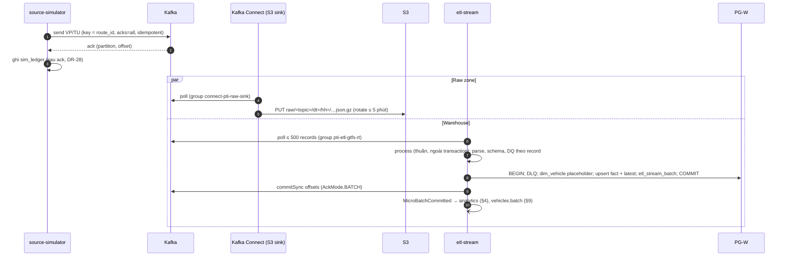

- Offset chỉ commit sau khi transaction commit (bước 7 → 8, ADR-0004). Lỗi dữ liệu vào DLQ trong cùng transaction; lỗi hạ tầng làm cả poll thử lại (§10).
- Raw zone và warehouse là hai consumer group độc lập: warehouse chết không ảnh hưởng raw zone, và ngược lại.
- Chi tiết: DOC-20 §3–4, DOC-19 §6.

## 2. Nạp CDC ticketing

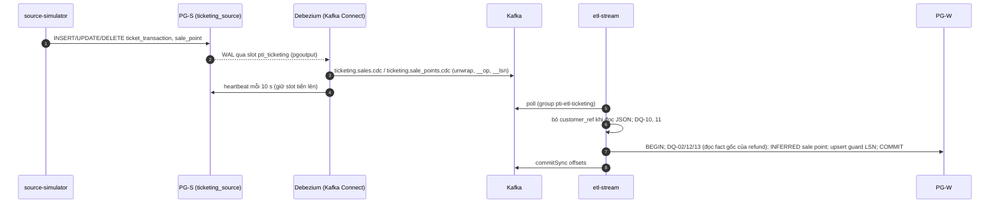

- Guard theo `__lsn`: event cũ không ghi đè event mới (FR-03.2). Delete thành `is_deleted = true`.
- Refund tới trước giao dịch gốc trong 5 phút vẫn được ghi; DQ-22 kiểm lại sau (DOC-16 §2.3).
- Chi tiết: DOC-09 §5, DOC-20 §4.4.

## 3. Nạp GTFS static

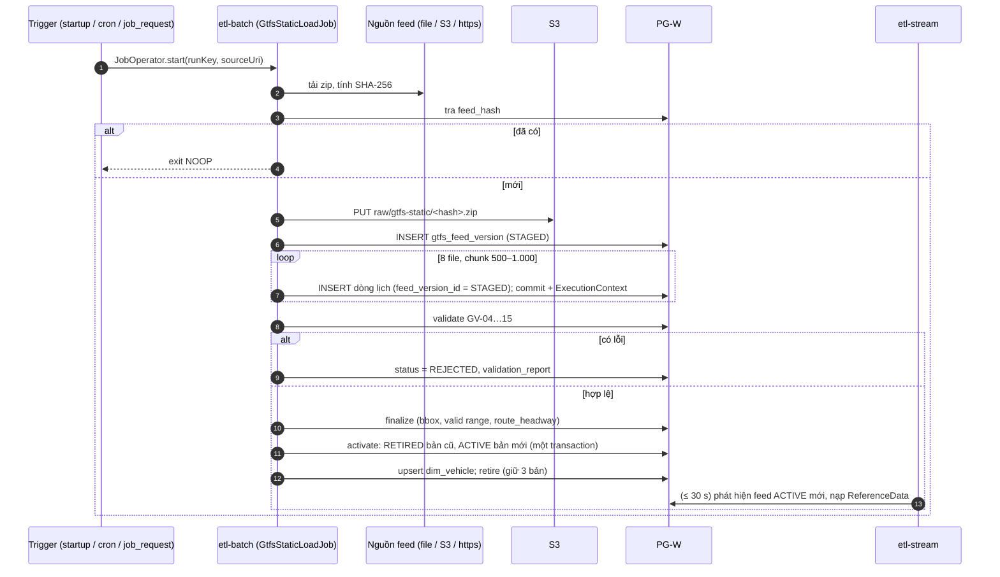

- Người đọc không bao giờ thấy trạng thái "không có feed ACTIVE" (DOC-14 §4).
- Pod chết giữa chừng: restart tiếp từ chunk đã commit (FR-03.6).
- Chi tiết: DOC-21.

## 4. Analytics micro-batch

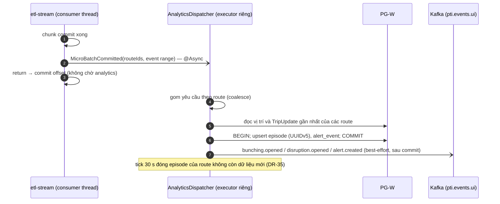

- Analytics lỗi không ảnh hưởng ETL: chỉ log và tăng metric. Insight idempotent nên chạy lại cho cùng dữ liệu không sinh bản ghi mới (ADR-0010).
- Chi tiết: DOC-23 (P4).

## 5. Job theo lịch và yêu cầu chạy tay

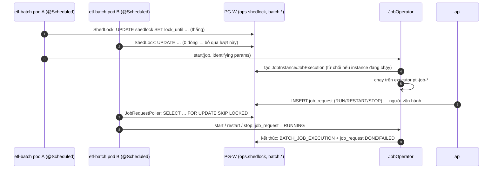

- Ba lớp chống chạy trùng: ShedLock, `JobInstance`, fencing `VERSION` (ADR-0015).
- Chi tiết: DOC-19 §2, §7.

## 6. DLQ: triage bằng AI và auto-replay

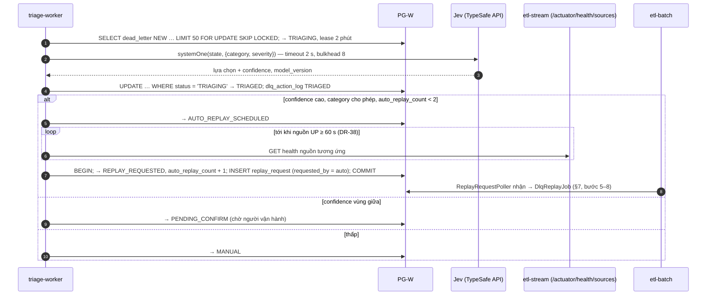

- Jev chỉ phán đoán; ngưỡng và quyết định hành động do code sở hữu (ADR-0019). `auto_replay_count` có CHECK `≤ 2` ở DB.
- Jev lỗi hoặc timeout: §12.
- Chi tiết: DOC-24 (P6), DOC-15 §4.3.

## 7. DLQ: sửa và replay thủ công

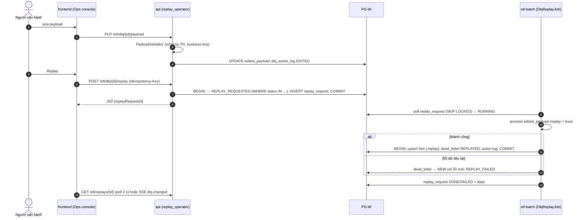

- Chi tiết: DOC-22 §2–3, DOC-32.

## 8. Replay khoảng thời gian từ raw zone

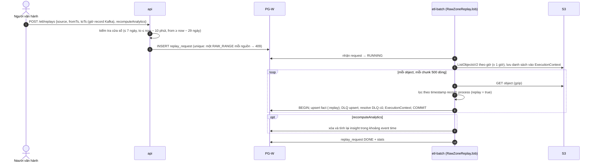

- Replay chạy song song với luồng trực tiếp được: guard của upsert không để dữ liệu cũ đè dữ liệu mới (DOC-22 §4.5).
- Chi tiết: DOC-22 §4.

## 9. Sự kiện real-time tới trình duyệt (SSE)

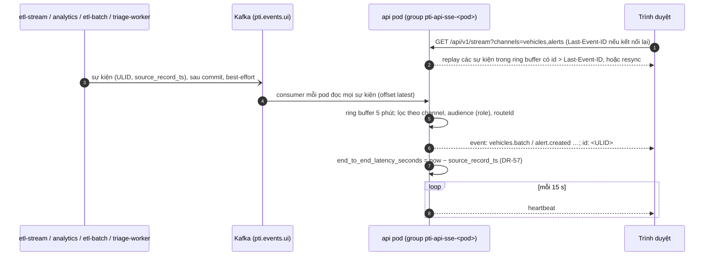

- Mỗi pod API là một consumer group riêng, nên mọi pod nhận mọi sự kiện và phục vụ được mọi client (ADR-0016).
- Mất sự kiện thì chấp nhận: nguồn sự thật ở DB, client refetch mỗi 60 giây hoặc khi nhận `resync` (DR-42).
- Chi tiết: DOC-26, DOC-33 (P4).

## 10. Lỗi: Postgres chết giữa chunk

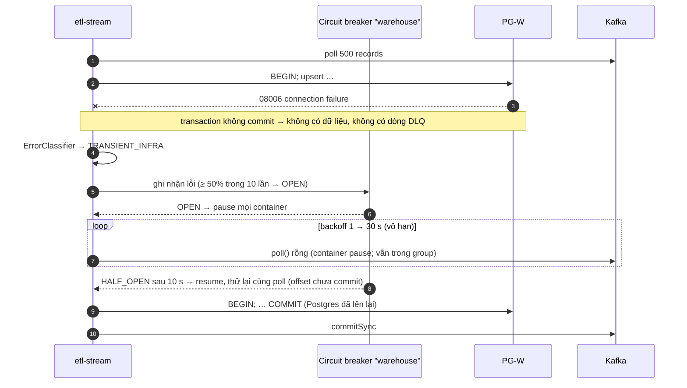

- Không record nào vào DLQ; không mất gì (FR-02.8). Alert `CircuitBreakerOpen` nếu mở quá 1 phút.
- Job batch: retry chunk tối đa 5 lần trong 60 giây, rồi step `FAILED` và restart sau (DOC-19 §4.4).
- Chi tiết: DOC-20 §5, EXP-08.

## 11. Lỗi: pod bị kill sau commit, trước khi commit offset

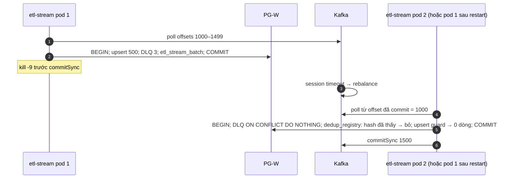

- Kết quả cuối giống như không có lỗi: mất 0, trùng 0 (FR-03.5). Phần giao lại được đếm vào `records_duplicate`.
- Nếu pod chết **trước** commit DB thì transaction rollback, và poll được xử lý lại bình thường.
- Chi tiết: ADR-0003, ADR-0004, DOC-22 §1.3, EXP-01.

## 12. Lỗi: Jev timeout hoặc không truy cập được

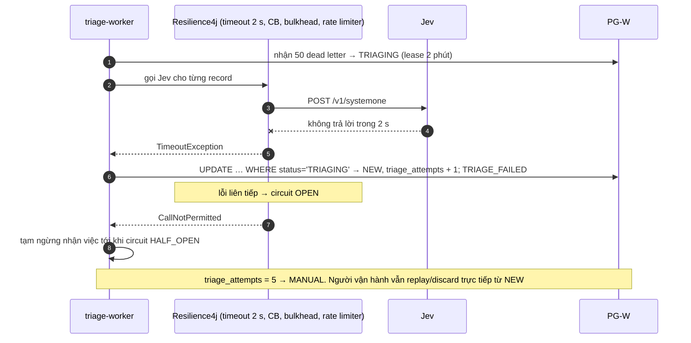

- AI lỗi không chặn pipeline: ETL không phụ thuộc Jev. Insight chờ làm giàu thì `enrichment_status` về `PENDING` rồi `FAILED` sau 5 lần; UI hiển thị episode không có "nguyên nhân khả dĩ".
- Adapter `Disabled` (cờ hoặc `pti.triage.provider=disabled`) bỏ qua gọi Jev hoàn toàn.
- Chi tiết: DOC-24 (P6).

## 13. Lỗi: feed GTFS-rt ngừng cập nhật (stale)

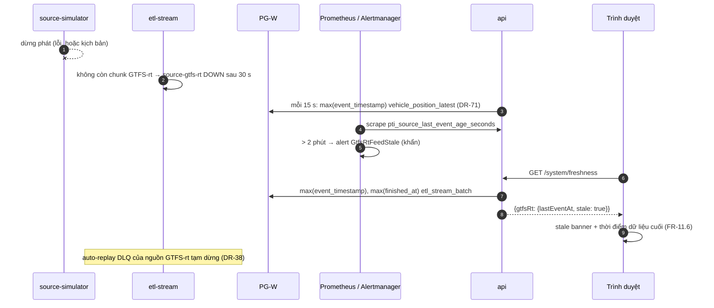

- Alert dựa trên dữ liệu trong DB, không dựa trên health của pod, để vẫn báo được khi mọi pod `etl-stream` đã chết.
- Chi tiết: DOC-28, RB-06.

## 14. Truy vết sang tài liệu khác

| Luồng | Thiết kế | Yêu cầu | Thực nghiệm |
| --- | --- | --- | --- |
| §1, §2 | DOC-20 | FR-01, FR-02, FR-03 | EXP-01, 02, 03, 05 |
| §3 | DOC-21 | FR-01.1, FR-03.6 | — |
| §4 | DOC-23 | FR-05…FR-08 | — |
| §5 | DOC-19 | FR-03.6, FR-15 | — |
| §6, §12 | DOC-24 | FR-09 | EXP-06 |
| §7, §8 | DOC-22 | FR-12 | EXP-04 |
| §9 | DOC-26, DOC-33 | FR-10, FR-11 | EXP-05 |
| §10, §11 | DOC-19, DOC-20 | FR-02.8, FR-03.5, NFR-01, NFR-04 | EXP-01, EXP-08 |
| §13 | DOC-28 | FR-11.6, FR-14 | — |
