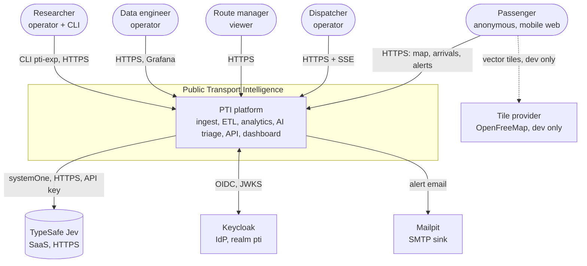
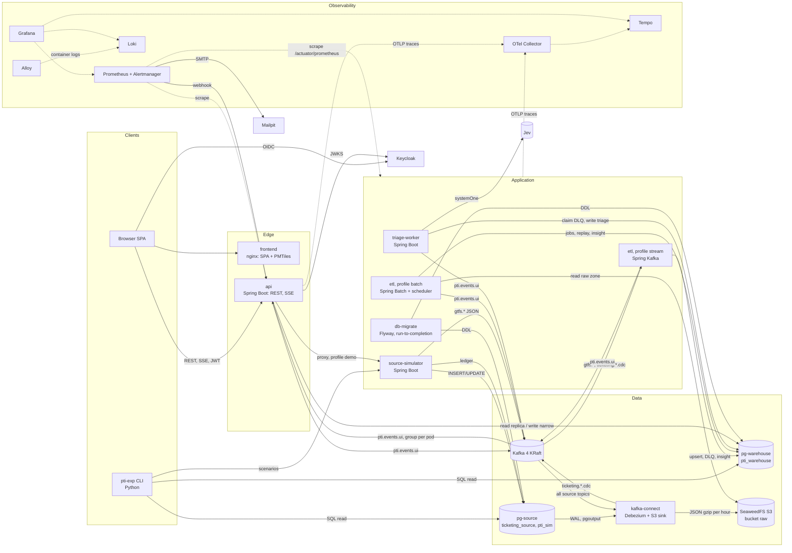
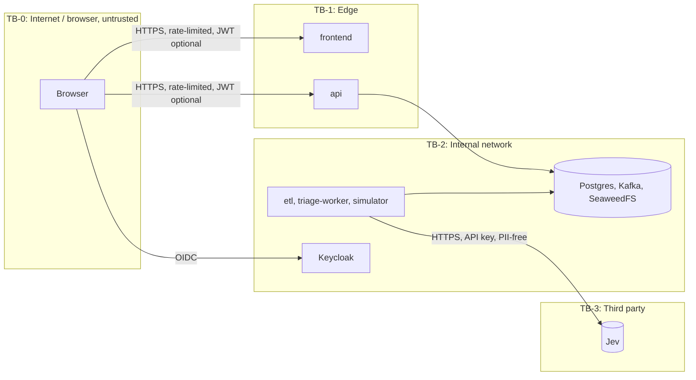

# Bối cảnh hệ thống và container

> Trạng thái: **Approved** · Cập nhật: 2026-09-28 · DOC-07
> Phụ thuộc: SDD gốc §4, §12.4, [DR](../00-decision-register.md) (DR-05, 20, 26, 40, 41, 50, 51, 62, 64), [ADR-0002](../04-adr/0002-spring-batch-and-spring-kafka.md), [ADR-0014](../04-adr/0014-deployment-units.md)

Tài liệu này mô tả **hệ thống gồm những khối nào, khối nào nói chuyện với khối nào, và dữ liệu nào thuộc về ai**. Luồng chi tiết theo thời gian nằm ở DOC-08; hợp đồng message nằm ở DOC-09.

## 1. C4 mức 1: bối cảnh hệ thống

| Hệ thống ngoài | Vai trò | Giao thức | Nếu không có thì |
| --- | --- | --- | --- |
| TypeSafe Jev | Phán đoán có cấu trúc cho triage, làm giàu disruption, gợi ý điều phối | HTTPS REST qua `typesafe-java-sdk`, key `TYPESAFE_API_KEY` | `pti.triage.provider=fake` hoặc `disabled`; mọi luồng khác chạy bình thường (FR-09.7) |
| Keycloak | Phát JWT cho viewer và operator; SPA dùng OIDC Authorization Code + PKCE | OIDC | API từ chối endpoint cần đăng nhập; endpoint public vẫn chạy |
| Mailpit | Nhận email từ Alertmanager (thay SMTP thật) | SMTP | Alert vẫn vào `alert_event` qua webhook (DR-51) |
| Tile provider | Nền bản đồ khi dev | HTTPS | Dùng PMTiles offline (DR-47); đây là cấu hình mặc định khi demo |

Keycloak và Mailpit chạy trong compose/k3d nhưng được coi là **hệ thống ngoài** về mặt kiến trúc: PTI chỉ dùng chúng qua giao thức chuẩn và không sở hữu dữ liệu của chúng.

## 2. C4 mức 2: container

Nguyên tắc xuyên suốt (SDD §4.2):

1. **Mọi cơ chế tin cậy nằm ở ETL** (idempotency, retry, DLQ, checkpoint). Các tầng phía sau chỉ đọc dữ liệu đã qua ETL.
2. **API là cửa duy nhất của frontend.** Frontend không đọc Kafka, DB hay object storage.
3. **API không chạy nghiệp vụ nặng và không gọi Spring Batch.** Thao tác nào cần ETL thực hiện (replay, restart job, chạy tay job) thì API ghi *yêu cầu* vào bảng (`replay_request`, `job_request`), còn pod `etl-batch` thực thi (ADR-0013).
4. **Không service nào tự migrate.** Chỉ `db-migrate` được chạy DDL (ADR-0024).

## 3. Đơn vị triển khai

Tất cả image Java build bằng Jib từ một Gradle multi-module nằm trong `backend/` của monorepo (DR-26, [ADR-0030](../04-adr/0030-monorepo-layout.md)); cột *Module* ghi tên module Gradle. `etl` là **một image, hai profile**.

| Container | Module / image | Công nghệ | Trách nhiệm | Profile compose | K8s (SDD §12.4) |
| --- | --- | --- | --- | --- | --- |
| `source-simulator` | `source-simulator` | Spring Boot, Spring Kafka producer, JDBC | Phát GTFS-rt, ghi giao dịch vé, ghi ledger, API kịch bản | core | Deployment × 1 |
| `etl-stream` | `etl` (profile `stream`) | Spring Kafka batch listener, `StreamChunkTemplate`, thư viện `analytics` | Consumer GTFS-rt và CDC; bunching và disruption sau mỗi micro-batch; phát sự kiện UI | core | Deployment 1→4, KEDA |
| `etl-batch` | `etl` (profile `batch`) | Spring Batch, `@Scheduled` + ShedLock | GTFS static, DLQ replay, raw zone replay, ETA, OTP, ticketing anomaly, bảo trì, xử lý `job_request` | core | Deployment × 2 |
| `triage-worker` | `triage-worker` | Spring Boot, `typesafe-java-sdk`, Resilience4j | Triage DLQ, auto-replay, phân loại ticketing, làm giàu disruption, gợi ý điều phối | triage | Deployment 1→3, KEDA (PostgreSQL scaler theo backlog, DOC-40) |
| `api` | `api` | Spring MVC, Spring Security (resource server), SSE, Caffeine, Bucket4j | REST `/api/v1`, SSE `/api/v1/stream`, webhook Alertmanager | core | Deployment 2→6, HPA |
| `frontend` | `frontend/` | nginx phục vụ build Vite và file PMTiles | SPA | core | Deployment × 2 |
| `db-migrate` | `db` | Flyway CLI (Java main) | Chạy migration cho `pti_warehouse`, `ticketing_source`, `pti_sim` rồi thoát | core (chạy một lần) | Job, Helm pre-upgrade hook |
| `kafka` | `apache/kafka` | Kafka 4 KRaft | Backbone | core | Strimzi, 3 broker |
| `kafka-init` | `apache/kafka` | Script `kafka-topics.sh` | Tạo topic theo DOC-09, idempotent | core (chạy một lần) | `KafkaTopic` CR |
| `kafka-connect` | image riêng (`deploy/connect/Dockerfile`) | Kafka Connect + Debezium PostgreSQL + S3 sink | CDC ticketing; ghi raw zone | core | Strimzi `KafkaConnect` × 2 |
| `kafka-connect-init` | `curlimages/curl` | Script PUT config | Đăng ký connector, idempotent | core (chạy một lần) | `KafkaConnector` CR |
| `pg-warehouse` | `postgres:17` | PostgreSQL | Warehouse, ops, insight, metadata batch | core | CNPG 1 primary + 1 replica, PgBouncer |
| `pg-source` | `postgres:17` | PostgreSQL, `wal_level=logical` | DB nguồn ticketing và ledger | core | StatefulSet đơn lẻ (DR-55) |
| `seaweedfs` / `s3-init` | `chrislusf/seaweedfs:4.47`, `amazon/aws-cli` (DR-66) | S3 | Raw zone (bucket `raw`, bật versioning) | core | StatefulSet |
| `keycloak` | `quay.io/keycloak/keycloak` | Keycloak `start-dev`, realm import | IdP | core | Deployment × 1 |
| `prometheus`, `alertmanager`, `grafana`, `otel-collector`, `tempo`, `loki`, `alloy` | image chính thức | — | Observability (DR-50) | observability | kube-prometheus-stack + chart Grafana |
| `mailpit` | `axllent/mailpit` | SMTP sink + web UI | Nhận alert email | observability | Deployment × 1 |
| `toxiproxy` | `ghcr.io/shopify/toxiproxy` | Proxy tiêm lỗi mạng | EXP-08, test Jev timeout | experiment | Chaos Mesh thay thế phần lớn |

Mọi app Spring Boot có hai cổng: cổng ứng dụng (`server.port`) và cổng quản trị Actuator (`management.server.port`), để `/actuator/**` không lộ ra cổng public. Số cổng cụ thể nằm ở DOC-38.

## 4. Quyền sở hữu dữ liệu

**Quy tắc:** mỗi bảng có **đúng một service ghi chính**. Service khác chỉ được ghi các cột được cấp riêng ở mức cột (DR-20), và phải ghi qua role DB tương ứng (DOC-17). Bố cục schema theo DR-64.

### 4.1 `pti_warehouse`

| Bảng / nhóm | Schema | Ghi chính | Ghi phụ (cột được phép) | Đọc |
| --- | --- | --- | --- | --- |
| `gtfs_feed_version`, `dim_*`, `gtfs_trip`, `gtfs_stop_time`, `gtfs_shape`, `route_headway`, `dim_date` | `dw` | etl-batch (`GtfsStaticLoadJob`); `dim_date` do migration seed | etl-stream: INSERT `dim_vehicle` với `source=REALTIME` (FR-01.6) | etl-stream (cache), api, analytics |
| `fact_vehicle_position`, `fact_trip_update`, `fact_ticket_sales` | `dw` | etl-stream; etl-batch khi replay | — | analytics, api, runner thực nghiệm |
| `vehicle_position_latest` | `dw` | etl-stream | etl-batch khi replay (có guard event time) | api, analytics (bunching) |
| `etl_stream_batch` | `ops` | etl-stream | — | api (qua `ops_job_run_v`), DQ post-write |
| `etl_batch_step`, `BATCH_*` | `ops`, `batch` | etl-batch (Spring Batch) | — | api (qua `ops_job_run_v`) |
| `etl_checkpoint`, `shedlock` | `ops` | etl-batch | triage-worker: `shedlock` (tác vụ định kỳ của worker) | — |
| `dead_letter` | `ops` | etl-stream, etl-batch (INSERT) | triage-worker: cột triage và `status`; api: `status`, `edited_payload`, `resolved_by`, `resolved_at`; etl-batch: `status`, `last_replay_at` khi replay | api, triage-worker |
| `dlq_action_log` | `ops` | triage-worker, api, etl-batch (INSERT, append-only) | — | api |
| `replay_request`, `job_request` | `ops` | api (INSERT); triage-worker (INSERT `replay_request` tự động) | etl-batch: `status`, `job_execution_id`, `stats`, `message` | api |
| `dedup_registry` | `ops` | etl-stream | etl-batch (dọn dẹp) | — |
| `runtime_flag` | `ops` | api | — | etl-stream, etl-batch, triage-worker (đọc mỗi 5 giây) |
| `dq_check_result` | `ops` | etl-stream, etl-batch | — | api |
| `alert_event` | `ops` | etl-stream (bunching, disruption), etl-batch (ticketing, job failed), api (webhook Alertmanager, gồm `DLQ_SEVERE`) | api: `acknowledged_by`, `acknowledged_at`; triage-worker: `audience`, `body` khi làm giàu disruption (FR-09.5), `body`, `severity` khi phân loại ticketing | api |
| `insight_bus_bunching`, `insight_service_disruption`, `analytics_route_baseline`, `analytics_baseline_snapshot` | `insight` | etl-stream | triage-worker: cột làm giàu (`data_issue_probability`, `likely_cause`, …) | api |
| `insight_eta_prediction`, `insight_otp_scorecard`, `insight_ticketing_anomaly` | `insight` | etl-batch | triage-worker: cột phân loại của `insight_ticketing_anomaly` | api |
| `insight_dispatch_suggestion` | `insight` | triage-worker | api: `operator_feedback`, `feedback_by`, `feedback_at` | api |
| `exp_fact_*` | `exp` | etl-stream (chỉ profile `experiment`) | — | runner thực nghiệm |

### 4.2 `pg-source`

| Bảng | Database.schema | Ghi | Đọc |
| --- | --- | --- | --- |
| `sale_point`, `ticket_transaction` | `ticketing_source.public` | source-simulator | Debezium (replication), runner thực nghiệm (ground truth ticketing) |
| `debezium_heartbeat` | `ticketing_source.public` | Debezium (`heartbeat.action.query`) | — |
| `sim_ledger`, `sim_scenario_run` | `pti_sim.sim` | source-simulator | runner thực nghiệm |

### 4.3 Kafka và object storage

| Tài nguyên | Producer | Consumer |
| --- | --- | --- |
| `gtfs.vehicle_positions`, `gtfs.trip_updates` | source-simulator | etl-stream, S3 sink |
| `ticketing.sales.cdc`, `ticketing.sale_points.cdc` | Debezium | etl-stream, S3 sink |
| `pti.events.ui` | etl-stream, etl-batch, triage-worker, api (ack, webhook, thao tác DLQ) | api (consumer group riêng cho mỗi pod) |
| bucket `raw` | S3 sink (`raw/<topic>/…`), etl-batch (`raw/gtfs-static/…`) | etl-batch (replay), runner thực nghiệm |

## 5. Ranh giới tin cậy

| Ranh giới | Đi qua | Kiểm soát | Chi tiết |
| --- | --- | --- | --- |
| TB-0 → TB-1 | Request của người dùng | JWT (Keycloak) cho endpoint nội bộ; rate limit theo IP cho endpoint public; CORS chỉ cho origin của frontend; Problem Details không lộ stack trace | DOC-27 |
| TB-0 → Keycloak | Đăng nhập | PKCE; redirect URI cố định | DOC-27 |
| TB-1 → TB-2 | API tới DB và Kafka | Hai datasource: `api_reader` (replica, chỉ SELECT) và `replay_operator` (primary, quyền mức cột) | DOC-17 |
| Trong TB-2 | Service tới DB, Kafka, object storage | Role DB tối thiểu cho từng app; NetworkPolicy trên k3d; credential S3 riêng cho connector và etl-batch (`s3.json` của SeaweedFS) | DOC-17, DOC-40 |
| TB-2 → TB-3 | State gửi sang Jev | Không có PII (blocklist có test); timeout, circuit breaker, rate limiter; key trong secret | DR-60, DOC-24 |

## 6. Truy vết tới tài liệu khác

- Luồng theo thời gian: DOC-08.
- Topic, envelope, CDC: DOC-09.
- Độ trễ, dung lượng, RAM: DOC-10.
- Phiên bản thư viện: DOC-11.
- DDL: DOC-13 (nguồn), DOC-14 (warehouse), DOC-15 (ops và insight); quyền: DOC-17.
- Compose và k3d: DOC-39, DOC-40.
