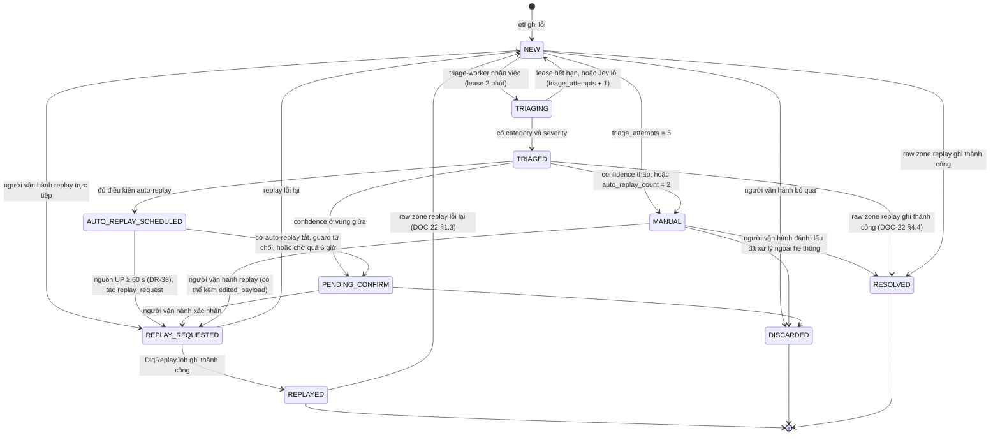
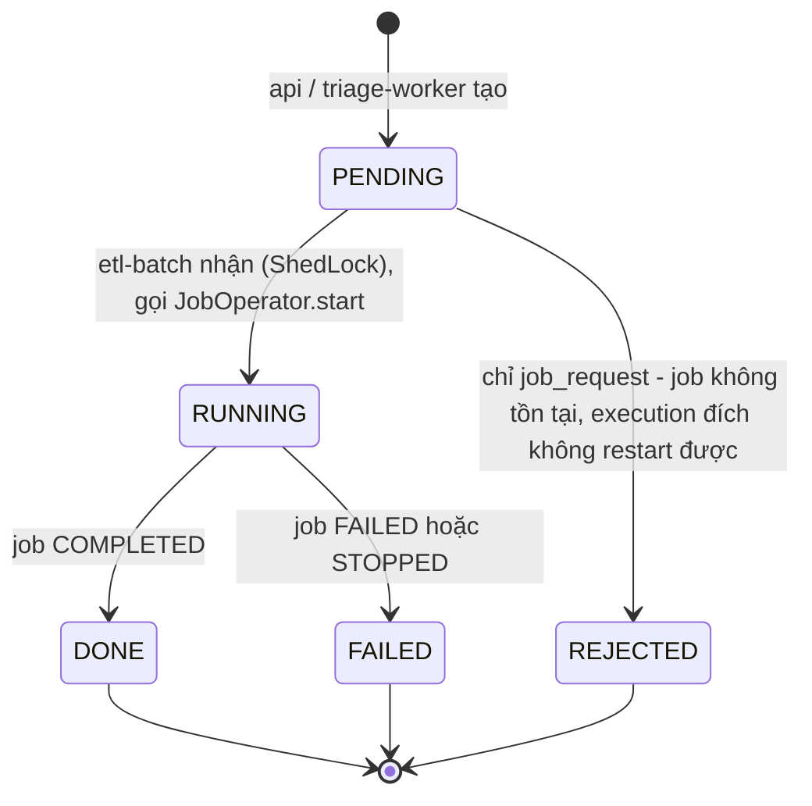
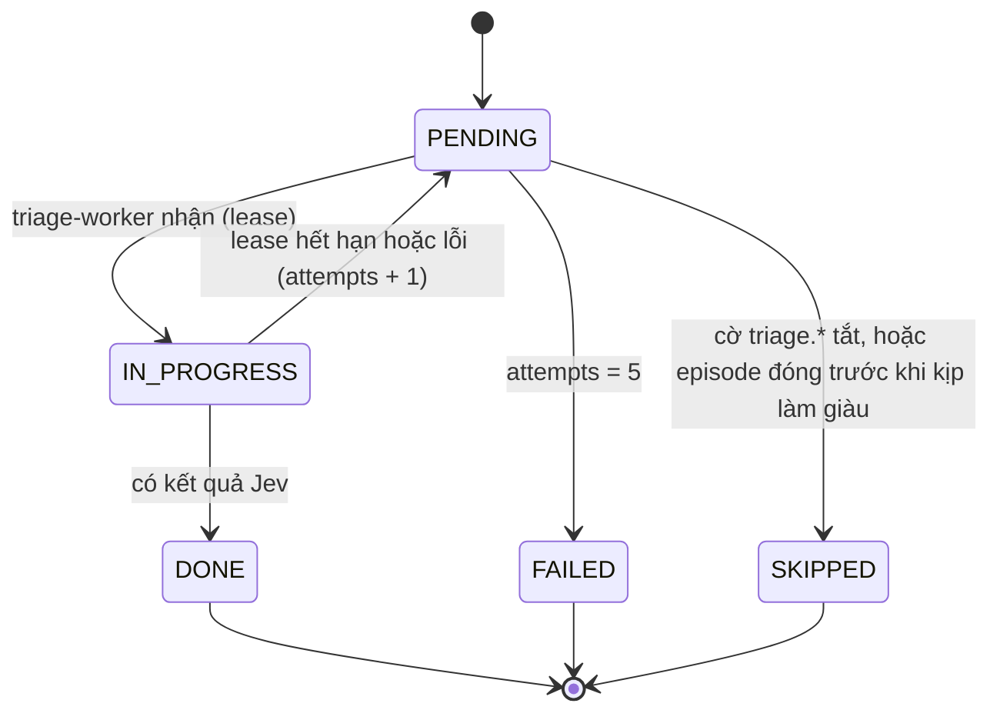

# Mô hình dữ liệu vận hành và insight

> Trạng thái: **Review** · Cập nhật: 2026-09-28 · DOC-15
> Phụ thuộc: [DR](../00-decision-register.md) (DR-16…19, 22, 25, 29…37, 62, 63), [ADR-0002](../04-adr/0002-spring-batch-and-spring-kafka.md), [DOC-14](warehouse-model.md), [DOC-17](db-roles-and-grants.md)
> Người dùng chính: `etl` (P2), `triage-worker` (P6), `api` (P4), `analytics` (P4)

Tài liệu này định nghĩa schema `batch` (metadata Spring Batch), `ops` (vận hành ETL, DLQ, replay, cờ, DQ, cảnh báo) và `insight` (kết quả và trạng thái analytics). Quy ước chung giống DOC-14 §2. Mọi DDL ở đây đã chạy sạch trên PostgreSQL 17 và đã qua ma trận quyền ở DOC-17 §7.

## 1. Danh sách migration

| File | Nội dung | Phase |
| --- | --- | --- |
| `V5_1__spring_batch_schema.sql` | Bảng `BATCH_*` của Spring Batch 6.0.5, nguyên văn | P1-05 |
| `V5_2__ops_tables.sql` | Index bổ sung cho `batch`, toàn bộ bảng `ops`, view `ops_job_run_v`, `ops_job_step_v`, `ops_job_execution_param_v` | P1-05 |
| `V7__insight.sql` | Bảng `insight_*`, `analytics_*`; index `fact_ticket_sales_created_idx` (DOC-23 §9.1), index danh sách insight (DOC-32 §4) | P4-01 |

## 2. Metadata Spring Batch (V5_1)

- Nội dung là file `org/springframework/batch/core/schema-postgresql.sql` trong `spring-batch-core-6.0.5.jar` (phiên bản Spring Boot 4.1.1 quản lý), **chép nguyên văn**. SHA-256 của file gốc: `f2ac75cae966e4eb1cd97ee6b11f130495b7109153754a7983befb87614d6e38`. Test của module `db` so checksum phần thân migration với file trong jar trên classpath, để phát hiện khi nâng phiên bản mà quên migration.
- Đầu file chỉ thêm comment và `SET LOCAL search_path TO batch;`, để các bảng rơi vào schema `batch` mà không sửa thân script. `SET LOCAL` chỉ có hiệu lực trong transaction của migration, và Flyway chạy mỗi migration trong một transaction.
- Spring Batch 6 đổi tên sequence thành `BATCH_JOB_INSTANCE_SEQ` (trước đây là `BATCH_JOB_SEQ`). Cấu hình app: `spring.batch.jdbc.table-prefix=batch.BATCH_`, `spring.batch.jdbc.initialize-schema=never` (DR-62).
- Cột thời gian của Spring Batch là `TIMESTAMP` **không có múi giờ**, ghi theo múi giờ JVM. Vì vậy **mọi JVM chạy với `TZ=UTC`** (DOC-29), và view `ops_job_run_v` đọc các cột này như UTC.
- Khi nâng Spring Batch: thêm một migration mới từ `migration/<version>/migration-postgresql.sql` trong jar. Không sửa V5_1.

Phần đầu của file:

```sql
-- Spring Batch metadata (DR-62). Body copied verbatim from
-- org/springframework/batch/core/schema-postgresql.sql in spring-batch-core 6.0.5
-- (the version managed by Spring Boot 4.1.1). Do not edit the body: on a Spring Batch upgrade,
-- add a new migration from the jar's migration/<version>/migration-postgresql.sql instead.
SET LOCAL search_path TO batch;

-- Autogenerated: do not edit this file
-- … (phần còn lại: nguyên văn script của jar)
```

Spring Batch không tạo index cho các khóa ngoại của nó. V5_2 thêm 4 index trên `batch.*` (xem đầu file V5_2 bên dưới), dùng cho lookup của `JobRepository`, cho lệnh xóa của `BatchMetadataCleanupJob` và cho view `ops_job_run_v`.

## 3. Bảng vận hành (V5_2)

File `backend/db/src/main/resources/db/migration/warehouse/V5_2__ops_tables.sql`:

```sql
-- ETL operations: audit, checkpoints, locks, DLQ, replay, dedup, flags, DQ, alerts (DOC-15).

-- Data sources, shared by every table that says "which pipeline".
CREATE DOMAIN ops.etl_source AS TEXT CHECK (VALUE IN (
  'GTFS_RT_VEHICLE_POSITION', 'GTFS_RT_TRIP_UPDATE', 'TICKETING_SALES', 'TICKETING_SALE_POINTS', 'GTFS_STATIC'));

-- One row per streaming micro-batch (DR-22, DR-63). Written inside the chunk transaction, so a
-- rolled-back chunk leaves no row; FAILED rows are written best-effort in a separate transaction.
CREATE TABLE ops.etl_stream_batch (
  batch_id          UUID            PRIMARY KEY,               -- UUIDv7, generated before the transaction
  source            ops.etl_source  NOT NULL,
  listener_id       TEXT            NOT NULL,                  -- e.g. gtfs-rt-vehicle-position
  consumer_group    TEXT            NOT NULL,
  instance_id       TEXT            NOT NULL,                  -- pod name / hostname
  offsets           JSONB           NOT NULL,                  -- {"<topic>-<partition>": [first, last], ...}
  status            TEXT            NOT NULL CHECK (status IN ('COMPLETED', 'COMPLETED_WITH_SKIPS', 'FAILED')),
  write_mode        TEXT            NOT NULL CHECK (write_mode IN ('BATCH', 'SCAN')),
  records_read      INT             NOT NULL CHECK (records_read >= 0),
  records_written   INT             NOT NULL CHECK (records_written >= 0),
  records_skipped   INT             NOT NULL CHECK (records_skipped >= 0),
  records_duplicate INT             NOT NULL CHECK (records_duplicate >= 0),
  min_event_ts      TIMESTAMPTZ     NULL,
  max_event_ts      TIMESTAMPTZ     NULL,
  min_record_ts     TIMESTAMPTZ     NULL,                      -- oldest Kafka record timestamp (latency, DR-57)
  started_at        TIMESTAMPTZ     NOT NULL,
  finished_at       TIMESTAMPTZ     NOT NULL,
  error_class       TEXT            NULL,
  error_message     TEXT            NULL,
  CHECK (finished_at >= started_at),
  CHECK ((status = 'FAILED') = (error_class IS NOT NULL)),
  CHECK (status <> 'COMPLETED' OR records_skipped = 0)
);
CREATE INDEX etl_stream_batch_started_idx ON ops.etl_stream_batch (started_at);
CREATE INDEX etl_stream_batch_listener_idx ON ops.etl_stream_batch (listener_id, started_at);
-- Serves ops.ops_job_run_v, which groups stream batches per minute (date_bin is IMMUTABLE, date_trunc on
-- TIMESTAMPTZ is not, so only date_bin can be indexed and pushed down through the GROUP BY).
CREATE INDEX etl_stream_batch_minute_idx
  ON ops.etl_stream_batch (date_bin('1 minute', started_at, TIMESTAMPTZ '2000-01-01 00:00:00Z'));

-- Spring Batch ships no indexes on its foreign keys. Needed by JobRepository lookups, by
-- BatchMetadataCleanupJob deletes and by ops.ops_job_run_v.
CREATE INDEX batch_job_execution_instance_idx ON batch.batch_job_execution (job_instance_id);
CREATE INDEX batch_job_execution_start_idx    ON batch.batch_job_execution ((start_time AT TIME ZONE 'UTC'));
CREATE INDEX batch_job_execution_params_idx   ON batch.batch_job_execution_params (job_execution_id);
CREATE INDEX batch_step_execution_job_idx     ON batch.batch_step_execution (job_execution_id);

-- One row per Spring Batch step execution (DR-63), written by BatchIdStepListener.beforeStep.
CREATE TABLE ops.etl_batch_step (
  batch_id          UUID        PRIMARY KEY,
  job_execution_id  BIGINT      NOT NULL,
  step_execution_id BIGINT      NOT NULL UNIQUE
                                REFERENCES batch.batch_step_execution (step_execution_id) ON DELETE CASCADE,
  job_name          TEXT        NOT NULL,
  step_name         TEXT        NOT NULL,
  created_at        TIMESTAMPTZ NOT NULL DEFAULT now()
);
CREATE INDEX etl_batch_step_job_idx ON ops.etl_batch_step (job_execution_id);

-- Business watermarks of batch jobs (e.g. last loaded feed hash).
CREATE TABLE ops.etl_checkpoint (
  checkpoint_key   TEXT        PRIMARY KEY CHECK (checkpoint_key ~ '^[a-z][a-z0-9.-]+$'),
  watermark        TEXT        NOT NULL,
  watermark_ts     TIMESTAMPTZ NULL,
  job_execution_id BIGINT      NULL,
  updated_at       TIMESTAMPTZ NOT NULL DEFAULT now()
);

-- ShedLock (DR-24). Layout required by JdbcTemplateLockProvider; used with usingDbTime().
CREATE TABLE ops.shedlock (
  name       VARCHAR(64)  NOT NULL PRIMARY KEY,
  lock_until TIMESTAMP    NOT NULL,
  locked_at  TIMESTAMP    NOT NULL,
  locked_by  VARCHAR(255) NOT NULL
);

-- Dead letter queue (DR-18). raw_payload is PII-scrubbed before insert (DR-60).
CREATE TABLE ops.dead_letter (
  id                  UUID           PRIMARY KEY,               -- UUIDv7
  source              ops.etl_source NOT NULL,
  stage               TEXT           NOT NULL CHECK (stage IN ('DESERIALIZE', 'SCHEMA', 'BUSINESS', 'DEDUP', 'LOAD', 'QUALITY')),
  error_class         TEXT           NOT NULL,
  error_message       TEXT           NOT NULL CHECK (length(error_message) <= 4000),
  rule_id             TEXT           NULL,                      -- DQ-xx for SCHEMA/QUALITY/BUSINESS/DEDUP (DR-69)
  raw_payload         TEXT           NOT NULL CHECK (octet_length(raw_payload) <= 1048576),
  edited_payload      JSONB          NULL,
  kafka_topic         TEXT           NULL,
  kafka_partition     INT            NULL,
  kafka_offset        BIGINT         NULL,
  kafka_timestamp     TIMESTAMPTZ    NULL,
  business_key        TEXT           NULL,
  batch_id            UUID           NOT NULL,
  status              TEXT           NOT NULL DEFAULT 'NEW' CHECK (status IN (
                        'NEW', 'TRIAGING', 'TRIAGED', 'AUTO_REPLAY_SCHEDULED', 'PENDING_CONFIRM', 'MANUAL',
                        'REPLAY_REQUESTED', 'REPLAYED', 'DISCARDED', 'RESOLVED')),
  category            TEXT           NULL CHECK (category IN (
                        'schema_violation', 'referential_integrity', 'upstream_api_error', 'transient_network', 'unknown')),
  category_confidence NUMERIC(4,3)   NULL CHECK (category_confidence BETWEEN 0 AND 1),
  severity            SMALLINT       NULL CHECK (severity BETWEEN 0 AND 2),
  severity_confidence NUMERIC(4,3)   NULL CHECK (severity_confidence BETWEEN 0 AND 1),
  model_version       TEXT           NULL,
  triaged_at          TIMESTAMPTZ    NULL,
  triage_attempts     SMALLINT       NOT NULL DEFAULT 0 CHECK (triage_attempts >= 0),
  triage_lease_until  TIMESTAMPTZ    NULL,                      -- DR-37
  auto_replay_count   SMALLINT       NOT NULL DEFAULT 0 CHECK (auto_replay_count BETWEEN 0 AND 2),  -- hard stop, SDD 9.6
  replay_count        SMALLINT       NOT NULL DEFAULT 0 CHECK (replay_count >= 0),
  last_replay_at      TIMESTAMPTZ    NULL,
  resolved_by         TEXT           NULL,
  resolved_at         TIMESTAMPTZ    NULL,
  created_at          TIMESTAMPTZ    NOT NULL DEFAULT now(),
  updated_at          TIMESTAMPTZ    NOT NULL DEFAULT now(),
  CHECK ((kafka_topic IS NULL) = (kafka_offset IS NULL)),
  CHECK (status <> 'TRIAGING' OR triage_lease_until IS NOT NULL),
  CHECK (status NOT IN ('DISCARDED', 'RESOLVED') OR (resolved_by IS NOT NULL AND resolved_at IS NOT NULL)),
  CHECK ((category IS NULL) = (category_confidence IS NULL)),
  CHECK ((severity IS NULL) = (severity_confidence IS NULL))
);
CREATE INDEX dead_letter_triage_queue_idx ON ops.dead_letter (created_at) WHERE status = 'NEW';
CREATE INDEX dead_letter_lease_idx        ON ops.dead_letter (triage_lease_until) WHERE status = 'TRIAGING';
CREATE INDEX dead_letter_list_idx         ON ops.dead_letter (status, created_at DESC);
CREATE INDEX dead_letter_source_idx       ON ops.dead_letter (source, created_at DESC);
CREATE INDEX dead_letter_batch_idx        ON ops.dead_letter (batch_id);
-- One dead letter per Kafka record: redelivery after a crash does not duplicate it; replay updates it (DOC-22 §1.3, DR-70).
CREATE UNIQUE INDEX dead_letter_kafka_pos_uk ON ops.dead_letter (kafka_topic, kafka_partition, kafka_offset)
  WHERE kafka_topic IS NOT NULL;

-- Append-only log of every automatic and manual DLQ action.
CREATE TABLE ops.dlq_action_log (
  id             BIGINT       GENERATED ALWAYS AS IDENTITY PRIMARY KEY,
  dead_letter_id UUID         NOT NULL REFERENCES ops.dead_letter (id) ON DELETE CASCADE,
  action         TEXT         NOT NULL CHECK (action IN (
                   'TRIAGED', 'TRIAGE_FAILED', 'AUTO_REPLAY_SCHEDULED', 'CONFIRM_REQUESTED', 'CONFIRMED',
                   'MANUAL_REQUIRED', 'EDITED', 'REPLAY_REQUESTED', 'REPLAYED', 'REPLAY_FAILED',
                   'DISCARDED', 'RESOLVED')),
  actor          TEXT         NOT NULL CHECK (actor ~ '^(auto|system:[a-z-]+|user:.+)$'),
  confidence     NUMERIC(4,3) NULL CHECK (confidence BETWEEN 0 AND 1),
  details        JSONB        NOT NULL DEFAULT '{}'::jsonb,
  at             TIMESTAMPTZ  NOT NULL DEFAULT now()
);
CREATE INDEX dlq_action_log_dead_letter_idx ON ops.dlq_action_log (dead_letter_id, at);
CREATE INDEX dlq_action_log_at_idx          ON ops.dlq_action_log (at);

-- Replay requests: written by api (or triage-worker for auto-replay), executed by etl-batch (ADR-0013).
CREATE TABLE ops.replay_request (
  id                  UUID           PRIMARY KEY,
  kind                TEXT           NOT NULL CHECK (kind IN ('RAW_RANGE', 'DLQ_RECORD')),
  source              ops.etl_source NOT NULL,
  from_ts             TIMESTAMPTZ    NULL,
  to_ts               TIMESTAMPTZ    NULL,
  dead_letter_id      UUID           NULL REFERENCES ops.dead_letter (id) ON DELETE SET NULL,
  recompute_analytics BOOLEAN        NOT NULL DEFAULT false,
  requested_by        TEXT           NOT NULL CHECK (requested_by ~ '^(auto|user:.+)$'),
  idempotency_key     TEXT           NULL,
  requested_at        TIMESTAMPTZ    NOT NULL DEFAULT now(),
  status              TEXT           NOT NULL DEFAULT 'PENDING' CHECK (status IN ('PENDING', 'RUNNING', 'DONE', 'FAILED')),
  job_execution_id    BIGINT         NULL,
  started_at          TIMESTAMPTZ    NULL,
  finished_at         TIMESTAMPTZ    NULL,
  stats               JSONB          NULL,
  message             TEXT           NULL,
  CHECK (kind <> 'RAW_RANGE'  OR (from_ts IS NOT NULL AND to_ts IS NOT NULL AND from_ts < to_ts
                                  AND to_ts - from_ts <= interval '7 days' AND dead_letter_id IS NULL)),
  CHECK (kind <> 'DLQ_RECORD' OR (from_ts IS NULL AND to_ts IS NULL AND NOT recompute_analytics)),
  CHECK (status NOT IN ('DONE', 'FAILED') OR finished_at IS NOT NULL),
  UNIQUE (requested_by, idempotency_key)
);
-- FR-12.3: one raw-zone replay in flight per source (second request -> unique violation -> 409).
CREATE UNIQUE INDEX replay_request_one_raw_per_source ON ops.replay_request (source)
  WHERE kind = 'RAW_RANGE' AND status IN ('PENDING', 'RUNNING');
-- A DLQ record cannot be queued twice.
CREATE UNIQUE INDEX replay_request_one_per_record ON ops.replay_request (dead_letter_id)
  WHERE kind = 'DLQ_RECORD' AND status IN ('PENDING', 'RUNNING');
CREATE INDEX replay_request_pending_idx ON ops.replay_request (requested_at) WHERE status = 'PENDING';

-- Manual job control: written by api, executed by etl-batch through JobOperator (DR-62).
CREATE TABLE ops.job_request (
  id                      UUID        PRIMARY KEY,
  kind                    TEXT        NOT NULL CHECK (kind IN ('RUN', 'RESTART', 'STOP')),
  job_name                TEXT        NOT NULL CHECK (job_name ~ '^[A-Z][A-Za-z]+Job$'),
  job_parameters          JSONB       NOT NULL DEFAULT '{}'::jsonb,
  target_job_execution_id BIGINT      NULL,
  requested_by            TEXT        NOT NULL CHECK (requested_by ~ '^user:.+$'),
  idempotency_key         TEXT        NULL,
  requested_at            TIMESTAMPTZ NOT NULL DEFAULT now(),
  status                  TEXT        NOT NULL DEFAULT 'PENDING'
                                      CHECK (status IN ('PENDING', 'RUNNING', 'DONE', 'FAILED', 'REJECTED')),
  job_execution_id        BIGINT      NULL,
  started_at              TIMESTAMPTZ NULL,
  finished_at             TIMESTAMPTZ NULL,
  message                 TEXT        NULL,
  CHECK ((kind = 'RUN') = (target_job_execution_id IS NULL)),
  CHECK (status NOT IN ('DONE', 'FAILED', 'REJECTED') OR finished_at IS NOT NULL),
  UNIQUE (requested_by, idempotency_key)
);
CREATE INDEX job_request_pending_idx ON ops.job_request (requested_at) WHERE status = 'PENDING';

-- Payload hashes seen recently (DR-16). UNLOGGED: an optimization only, correctness does not
-- depend on it, so losing it on crash or failover is acceptable and saves WAL.
CREATE UNLOGGED TABLE ops.dedup_registry (
  source        ops.etl_source NOT NULL,
  payload_hash  CHAR(64)       NOT NULL,
  first_seen_at TIMESTAMPTZ    NOT NULL DEFAULT now(),
  batch_id      UUID           NOT NULL,
  PRIMARY KEY (source, payload_hash)
);
CREATE INDEX dedup_registry_seen_idx ON ops.dedup_registry (first_seen_at);

-- Runtime on/off switches (DR-19). Thresholds stay in configuration files.
CREATE TABLE ops.runtime_flag (
  key         TEXT        PRIMARY KEY CHECK (key ~ '^[a-z][a-z0-9-]*(\.[a-z0-9-]+)+$'),
  value       JSONB       NOT NULL,
  description TEXT        NOT NULL,
  updated_by  TEXT        NOT NULL,
  updated_at  TIMESTAMPTZ NOT NULL DEFAULT now()
);
INSERT INTO ops.runtime_flag (key, value, description, updated_by) VALUES
  ('etl.consumer.gtfs-rt.paused',   'false', 'Pause the GTFS-realtime listeners (vehicle positions and trip updates).', 'migration'),
  ('etl.consumer.ticketing.paused', 'false', 'Pause the ticketing CDC listeners.', 'migration'),
  ('triage.dlq.enabled',            'true',  'Classify new dead letters with the decision model.', 'migration'),
  ('triage.auto-replay.enabled',    'true',  'Allow automatic replay of dead letters above the confidence threshold.', 'migration'),
  ('triage.ticketing.enabled',      'true',  'Classify ticketing anomalies with the decision model.', 'migration'),
  ('triage.disruption.enabled',     'true',  'Enrich service disruptions with the decision model.', 'migration'),
  ('triage.dispatch.enabled',       'true',  'Suggest dispatch actions for bunching episodes.', 'migration');

-- Post-write data quality results (DR-25).
CREATE TABLE ops.dq_check_result (
  id              BIGINT      GENERATED ALWAYS AS IDENTITY PRIMARY KEY,
  rule_id         TEXT        NOT NULL CHECK (rule_id ~ '^DQ-[0-9]{2}$'),
  scope           TEXT        NOT NULL CHECK (scope IN ('BATCH', 'TABLE')),
  table_name      TEXT        NOT NULL,
  batch_id        UUID        NULL,
  violation_count BIGINT      NOT NULL CHECK (violation_count >= 0),
  sample          JSONB       NULL,       -- at most 10 offending keys
  checked_at      TIMESTAMPTZ NOT NULL DEFAULT now(),
  CHECK ((scope = 'BATCH') = (batch_id IS NOT NULL))
);
CREATE INDEX dq_check_result_rule_idx  ON ops.dq_check_result (rule_id, checked_at DESC);
CREATE INDEX dq_check_result_batch_idx ON ops.dq_check_result (batch_id) WHERE batch_id IS NOT NULL;

-- Unified alert feed (DR-17, ADR-0023).
CREATE TABLE ops.alert_event (
  id              UUID        PRIMARY KEY,
  type            TEXT        NOT NULL CHECK (type IN ('DISRUPTION', 'BUNCHING', 'DLQ_SEVERE', 'FEED_STALE', 'TICKETING_ANOMALY', 'INFRA')),
  severity        SMALLINT    NOT NULL CHECK (severity BETWEEN 0 AND 2),
  audience        TEXT        NOT NULL CHECK (audience IN ('PUBLIC', 'OPERATIONS', 'ENGINEERING')),
  route_id        TEXT        NULL,
  ref_table       TEXT        NULL,       -- e.g. insight.insight_service_disruption
  ref_id          TEXT        NULL,
  title           TEXT        NOT NULL CHECK (length(title) <= 200),
  body            JSONB       NOT NULL DEFAULT '{}'::jsonb,
  dedup_key       TEXT        NOT NULL CONSTRAINT alert_event_dedup_uk UNIQUE,
  created_at      TIMESTAMPTZ NOT NULL DEFAULT now(),
  acknowledged_by TEXT        NULL,
  acknowledged_at TIMESTAMPTZ NULL,
  resolved_at     TIMESTAMPTZ NULL,
  CHECK ((acknowledged_by IS NULL) = (acknowledged_at IS NULL)),
  CHECK ((ref_table IS NULL) = (ref_id IS NULL))
);
CREATE INDEX alert_event_feed_idx  ON ops.alert_event (audience, created_at DESC);
CREATE INDEX alert_event_route_idx ON ops.alert_event (route_id, created_at DESC) WHERE route_id IS NOT NULL;
CREATE INDEX alert_event_open_idx  ON ops.alert_event (created_at DESC) WHERE resolved_at IS NULL;
-- Feed across several audiences with a keyset cursor (DOC-32 E-20).
CREATE INDEX alert_event_created_idx ON ops.alert_event (created_at DESC, id DESC);

-- Unified run list for the ops console (DR-63). Spring Batch writes TIMESTAMP without time zone
-- in the JVM zone; every JVM runs with TZ=UTC (DOC-29), so the view reads those values as UTC.
-- Streaming micro-batches are aggregated per listener and minute to keep the list readable.
CREATE VIEW ops.ops_job_run_v AS
  SELECT 'job:' || je.job_execution_id                 AS run_id,
         'BATCH_JOB'                                     AS kind,
         ji.job_name                                     AS name,
         je.status                                       AS status,
         je.exit_code                                    AS exit_code,
         left(je.exit_message, 500)                      AS exit_message,
         je.start_time AT TIME ZONE 'UTC'                AS started_at,
         je.end_time   AT TIME ZONE 'UTC'                AS ended_at,
         coalesce(s.read_count, 0)                       AS read_count,
         coalesce(s.write_count, 0)                      AS write_count,
         coalesce(s.skip_count, 0)                       AS skip_count,
         NULL::bigint                                    AS duplicate_count,
         je.job_execution_id                             AS job_execution_id,
         s.batch_ids                                     AS batch_ids
  FROM batch.batch_job_execution je
  JOIN batch.batch_job_instance ji ON ji.job_instance_id = je.job_instance_id
  LEFT JOIN LATERAL (
    SELECT sum(se.read_count)                                                   AS read_count,
           sum(se.write_count)                                                  AS write_count,
           sum(se.read_skip_count + se.process_skip_count + se.write_skip_count) AS skip_count,
           array_agg(bs.batch_id ORDER BY se.step_execution_id)
             FILTER (WHERE bs.batch_id IS NOT NULL)                             AS batch_ids
    FROM batch.batch_step_execution se
    LEFT JOIN ops.etl_batch_step bs ON bs.step_execution_id = se.step_execution_id
    WHERE se.job_execution_id = je.job_execution_id
  ) s ON true
  UNION ALL
  SELECT 'stream:' || sb.listener_id || ':'
           || to_char(date_bin('1 minute', sb.started_at, TIMESTAMPTZ '2000-01-01 00:00:00Z') AT TIME ZONE 'UTC',
                      'YYYY-MM-DD"T"HH24:MI"Z"'),
         'STREAM',
         sb.listener_id,
         CASE WHEN bool_or(sb.status = 'FAILED')              THEN 'FAILED'
              WHEN bool_or(sb.status = 'COMPLETED_WITH_SKIPS') THEN 'COMPLETED_WITH_SKIPS'
              ELSE 'COMPLETED' END,
         NULL,
         NULL,
         date_bin('1 minute', sb.started_at, TIMESTAMPTZ '2000-01-01 00:00:00Z'),
         max(sb.finished_at),
         sum(sb.records_read),
         sum(sb.records_written),
         sum(sb.records_skipped),
         sum(sb.records_duplicate),
         NULL,
         array_agg(sb.batch_id ORDER BY sb.started_at)
  FROM ops.etl_stream_batch sb
  GROUP BY sb.listener_id, date_bin('1 minute', sb.started_at, TIMESTAMPTZ '2000-01-01 00:00:00Z');

-- Step executions of a batch job for the run detail screen (DOC-32 E-32, E-37).
-- short_context is truncated: the full context can be large and is only needed for diagnosis.
CREATE VIEW ops.ops_job_step_v AS
  SELECT se.job_execution_id,
         se.step_execution_id,
         se.step_name,
         se.status,
         se.exit_code,
         left(se.exit_message, 2000)          AS exit_message,
         se.start_time AT TIME ZONE 'UTC'     AS started_at,
         se.end_time   AT TIME ZONE 'UTC'     AS ended_at,
         se.read_count,
         se.write_count,
         se.filter_count,
         se.commit_count,
         se.rollback_count,
         se.read_skip_count,
         se.process_skip_count,
         se.write_skip_count,
         bs.batch_id,
         left(sc.short_context, 2500)         AS short_context
  FROM batch.batch_step_execution se
  LEFT JOIN ops.etl_batch_step bs ON bs.step_execution_id = se.step_execution_id
  LEFT JOIN batch.batch_step_execution_context sc ON sc.step_execution_id = se.step_execution_id;

-- Job parameters of an execution (DOC-32 E-32).
CREATE VIEW ops.ops_job_execution_param_v AS
  SELECT job_execution_id,
         parameter_name  AS name,
         parameter_type  AS type,
         parameter_value AS value,
         identifying = 'Y' AS identifying
  FROM batch.batch_job_execution_params;
```

### 3.1 Ai ghi bảng nào

| Bảng | Ghi bởi (role) | Đọc bởi | Retention (DOC-18) |
| --- | --- | --- | --- |
| `etl_stream_batch` | etl-stream (`etl_writer`) | api, experiment runner | 7 ngày (DR-22) |
| `etl_batch_step` | etl-batch (`etl_writer`), trong `beforeStep` | view `ops_job_run_v` | Xóa dây chuyền theo `batch_step_execution` |
| `etl_checkpoint` | etl-batch | etl-batch | Không xóa |
| `shedlock` | etl-batch, triage-worker | — | Không xóa |
| `dead_letter` | etl (tạo, cập nhật sau replay); triage-worker (phân loại); api (`replay_operator`: xác nhận, sửa, đóng) | api, triage-worker | 30 ngày sau `resolved_at`; dòng chưa đóng thì giữ |
| `dlq_action_log` | cả ba | api | Xóa dây chuyền theo `dead_letter` |
| `replay_request` | api, triage-worker (tạo); etl-batch (thực thi) | api | 30 ngày |
| `job_request` | api (tạo); etl-batch (thực thi) | api | 30 ngày |
| `dedup_registry` | etl-stream | etl-stream | TTL 1 giờ (DR-16) |
| `runtime_flag` | api (`replay_operator`) | mọi service, mỗi 5 giây (DR-19) | Không xóa |
| `dq_check_result` | etl | api | 30 ngày |
| `alert_event` | etl (analytics), triage-worker, api (webhook Alertmanager) | api | 90 ngày |

Quyền đến từng cột ở DOC-17 §4.

### 3.2 Enum dùng chung

| Kiểu | Giá trị | Dùng ở |
| --- | --- | --- |
| `ops.etl_source` (domain) | `GTFS_RT_VEHICLE_POSITION`, `GTFS_RT_TRIP_UPDATE`, `TICKETING_SALES`, `TICKETING_SALE_POINTS`, `GTFS_STATIC` | `etl_stream_batch`, `dead_letter`, `replay_request`, `dedup_registry` |
| `dead_letter.stage` | `DESERIALIZE`, `SCHEMA`, `BUSINESS`, `DEDUP`, `LOAD`, `QUALITY` | DR-18, DR-23 |
| `dead_letter.category` | `schema_violation`, `referential_integrity`, `upstream_api_error`, `transient_network`, `unknown` | Label của `Choice` gửi Jev (DR-36), nên viết thường |
| `severity` | `0` Informational, `1` Needs attention, `2` Urgent | `dead_letter`, `alert_event`, `insight_ticketing_anomaly` |
| `dlq_action_log.actor` | `auto`, `system:<service>`, `user:<username>` | Cũng dùng cho `requested_by` của `replay_request` (`auto` hoặc `user:…`) và `job_request` (chỉ `user:…`) |
| `insight.enrichment_status` (domain) | `PENDING`, `IN_PROGRESS`, `DONE`, `FAILED`, `SKIPPED` | Ba bảng insight có làm giàu bằng AI |

Enum ở phía Java đặt trong `common` và có unit test so sánh với danh sách trong `CHECK` (đọc từ `information_schema.check_constraints` bằng Testcontainers), để hai phía không lệch nhau.

## 4. Máy trạng thái

### 4.1 Spring Batch

Trạng thái job và step dùng nguyên `BatchStatus` của Spring Batch (`STARTING`, `STARTED`, `STOPPING`, `STOPPED`, `FAILED`, `COMPLETED`, `ABANDONED`, `UNKNOWN`). Dự án không đặt lại ý nghĩa của chúng. Exit status tự định nghĩa (ví dụ `NOOP` khi feed không đổi, `COMPLETED_WITH_SKIPS`) nằm ở DOC-19.

### 4.2 `etl_stream_batch.status`

Không có chuyển trạng thái: mỗi dòng được ghi đúng một lần.

- `COMPLETED` và `COMPLETED_WITH_SKIPS` được ghi **trong transaction của chunk**. Chunk rollback thì không có dòng nào.
- `FAILED` được ghi **best-effort trong transaction riêng**, sau khi chunk rollback, để ops console thấy được lần thử thất bại. Lần thử lại của cùng poll có `batch_id` mới.

### 4.3 `dead_letter.status`



| Chuyển | Ai thực hiện | Cột được đổi | `dlq_action_log.action` |
| --- | --- | --- | --- |
| → `NEW` (tạo) | etl | cả dòng | — |
| `NEW → TRIAGING` | triage-worker, `SELECT … FOR UPDATE SKIP LOCKED` (DR-37) | `status`, `triage_lease_until` | — |
| `TRIAGING → TRIAGED` | triage-worker | `category*`, `severity*`, `model_version`, `triaged_at` | `TRIAGED` |
| `TRIAGING → NEW` | triage-worker (dọn lease) | `status`, `triage_attempts`, `triage_lease_until` | `TRIAGE_FAILED` khi do lỗi |
| `→ MANUAL` | triage-worker | `status` | `MANUAL_REQUIRED` |
| `TRIAGED → AUTO_REPLAY_SCHEDULED / PENDING_CONFIRM` | triage-worker | `status` | `AUTO_REPLAY_SCHEDULED` / `CONFIRM_REQUESTED` |
| `AUTO_REPLAY_SCHEDULED → PENDING_CONFIRM` | triage-worker (`AutoReplayScheduler`, DOC-24 §6.7) | `status` | `CONFIRM_REQUESTED`, `details.reason` = `auto_replay_disabled` \| `guard_blocked` \| `source_not_recovered` |
| `→ REPLAY_REQUESTED` (tự động) | triage-worker, cùng transaction với INSERT `replay_request` | `status`, `auto_replay_count + 1` | `REPLAY_REQUESTED`, actor `auto` |
| `→ REPLAY_REQUESTED` (tay) | api (`replay_operator`) | `status`, `edited_payload` | `CONFIRMED` hoặc `EDITED`, rồi `REPLAY_REQUESTED` |
| `→ REPLAYED` / `→ NEW` | etl-batch (`DlqReplayJob`) | `status`, `replay_count + 1`, `last_replay_at` | `REPLAYED` / `REPLAY_FAILED` |
| `→ DISCARDED / RESOLVED` | api | `status`, `resolved_by`, `resolved_at` | `DISCARDED` / `RESOLVED` |
| `→ RESOLVED` (tự động) | etl-batch (`RawZoneReplayJob`), khi record được ghi thành công; từ `NEW`, `TRIAGED`, `AUTO_REPLAY_SCHEDULED`, `PENDING_CONFIRM`, `MANUAL` | `status`, `resolved_by = 'system:etl-batch'`, `resolved_at` | `RESOLVED` |
| `→ NEW` (replay lỗi lại) | etl-batch (`DlqReplayJob`, `RawZoneReplayJob`), trừ dòng `DISCARDED`/`RESOLVED` | thông tin lỗi, `replay_count + 1`, `last_replay_at` | `REPLAY_FAILED` |

- `TRIAGING → TRIAGED → (AUTO_REPLAY_SCHEDULED | PENDING_CONFIRM | MANUAL)` nằm trong **một** transaction (DOC-24 §6.5): sau commit không có dòng nào đứng ở `TRIAGED`. Giá trị này được giữ trong `CHECK` và bộ lọc để tương thích. Tương tự, lần thử thứ 5 thất bại đi thẳng `TRIAGING → MANUAL` trong một câu lệnh (logic là `TRIAGING → NEW → MANUAL`).
- Khi dòng về `NEW` do lỗi, `triage_lease_until` được đặt thành mốc backoff ("không nhận trước thời điểm"); câu claim bỏ qua dòng có mốc ở tương lai (DOC-24 §5.4). Cột lease của ba bảng insight dùng cùng cách.
- Khi cờ `triage.dlq.enabled = false`, triage-worker không nhận việc mới nên dòng giữ trạng thái `NEW`. Người vận hành vẫn replay, bỏ qua hoặc đóng được trực tiếp từ `NEW`.
- Ngưỡng confidence cho auto-replay nằm trong cấu hình (DOC-24, DOC-29), không nằm trong DB.
- `auto_replay_count` có `CHECK 0..2`: DB chặn cứng lần auto-replay thứ ba, kể cả khi code có lỗi (SDD §9.6).
- Mọi câu UPDATE chuyển trạng thái đều có điều kiện trạng thái nguồn trong `WHERE` (ví dụ `WHERE id = :id AND status = 'TRIAGING'`). Cập nhật 0 dòng nghĩa là có tiến trình khác đã chuyển trước; API trả 409.

### 4.4 `replay_request.status` và `job_request.status`



- etl-batch quét bảng mỗi 5 giây (`FOR UPDATE SKIP LOCKED`, đồng thời có ShedLock), ghi `job_execution_id` và `started_at` khi chuyển sang `RUNNING` (ADR-0013).
- `replay_request_one_raw_per_source`: mỗi nguồn chỉ có một replay raw zone đang chờ hoặc đang chạy. Yêu cầu thứ hai vi phạm unique index, API bắt lỗi `23505` và trả **409** (FR-12.3).
- `UNIQUE (requested_by, idempotency_key)`: API nhận header `Idempotency-Key`. Gửi lại cùng key thì API trả bản ghi cũ, không tạo mới.
- Sau khi pod `etl-batch` chết, dòng `RUNNING` có `job_execution_id` trỏ tới execution đang `STARTED`. Khi khởi động, etl-batch đánh dấu các execution đó `FAILED` (quy trình restart chuẩn của Spring Batch) và chuyển request sang `FAILED` kèm `message`.

### 4.5 Episode và làm giàu bằng AI (insight)

- `insight_bus_bunching.status` và `insight_service_disruption.status`: `OPEN → CLOSED`, một chiều; `close_reason` ghi lý do đóng. Khi tính lại analytics trên một khoảng thời gian (DOC-23 §11), dòng được tái tạo được upsert theo id, còn dòng không được tái tạo bị xóa. Vì `id` là UUIDv5 của natural key, dòng tính lại có cùng id và giữ nguyên cột làm giàu (DR-29).
- `enrichment_status`:



## 5. View `ops_job_run_v`

View gộp hai loại "lần chạy" cho ops console và API `GET /etl/jobs` (DOC-32 E-30):

| `kind` | Một dòng là | `run_id` | Nguồn |
| --- | --- | --- | --- |
| `BATCH_JOB` | Một `JobExecution` | `job:<job_execution_id>` | `batch.*` cùng `ops.etl_batch_step` |
| `STREAM` | Tất cả micro-batch của một listener trong một phút | `stream:<listener_id>:<yyyy-MM-ddTHH:mmZ>` | `ops.etl_stream_batch` |

- `api_reader` chỉ đọc được view, không đọc trực tiếp `batch.*` (DR-62). View chạy với quyền của owner.
- Nhóm theo phút dùng `date_bin('1 minute', started_at, TIMESTAMPTZ '2000-01-01 00:00:00Z')`, **không dùng `date_trunc`**. `date_trunc('minute', timestamptz)` là `STABLE` (phụ thuộc múi giờ phiên) nên không đánh index được, và điều kiện lọc trên cột `started_at` của view không dùng được index nào. `date_bin` là `IMMUTABLE`, có index biểu thức `etl_stream_batch_minute_idx`, và PostgreSQL đẩy được điều kiện lọc qua `GROUP BY` xuống index này.
- Đo trên 3,6 triệu dòng `etl_stream_batch` (7 ngày ở tải nền, 1,2 GB), lấy 50 dòng mới nhất:

  | Cửa sổ lọc | Trước (`date_trunc`) | Sau (`date_bin` + index) |
  | --- | --- | --- |
  | 1 giờ | quét toàn bảng (≈ 560 ms trên 1,5 triệu dòng) | 25 ms |
  | 24 giờ | quét toàn bảng | 300 ms |
  | Không lọc | quét toàn bảng | ≈ 1 s trên 1,5 triệu dòng |

- **Quyết định cho API:** `GET /etl/jobs` bắt buộc có cửa sổ thời gian: mặc định 1 giờ gần nhất, tối đa 24 giờ. Vượt quá thì trả 400 (DOC-31 §4, DOC-32 E-30).
- Hai view phụ cho màn chi tiết lần chạy (DOC-32 E-32, E-37): `ops_job_step_v` (một dòng mỗi step execution, kèm `batch_id` và `short_context` đã cắt) và `ops_job_execution_param_v` (tham số của job execution). Cũng như `ops_job_run_v`, chúng chạy với quyền owner để `api_reader` không cần quyền trên `batch.*`.

## 6. Bảng insight (V7)

File `backend/db/src/main/resources/db/migration/warehouse/V7__insight.sql`:

```sql
-- Analytics output and state (DR-29..DR-34), AI enrichment columns (DR-36, DR-37). Phase 4.
-- Every id is UUIDv5(namespace, natural key) computed in code, so a recomputation yields the same id.

CREATE DOMAIN insight.enrichment_status AS TEXT
  CHECK (VALUE IN ('PENDING', 'IN_PROGRESS', 'DONE', 'FAILED', 'SKIPPED'));

-- Bunching episodes (DR-29, DR-30). One row per (leader, follower) episode.
CREATE TABLE insight.insight_bus_bunching (
  id                        UUID        PRIMARY KEY,
  route_id                  TEXT        NOT NULL,
  direction_id              SMALLINT    NOT NULL CHECK (direction_id IN (0, 1)),
  vehicle_leader            TEXT        NOT NULL,
  vehicle_follower          TEXT        NOT NULL,
  trip_leader               TEXT        NOT NULL,
  trip_follower             TEXT        NOT NULL,
  episode_start             TIMESTAMPTZ NOT NULL,            -- event time of the first qualifying evaluation
  episode_end               TIMESTAMPTZ NULL,
  status                    TEXT        NOT NULL CHECK (status IN ('OPEN', 'CLOSED')),
  close_reason              TEXT        NULL CHECK (close_reason IN ('GAP_RECOVERED', 'PAIR_CHANGED', 'SIGNAL_LOST', 'OUT_OF_ZONE')),
  scheduled_headway_seconds INT         NOT NULL CHECK (scheduled_headway_seconds > 0),
  threshold_seconds         INT         NOT NULL CHECK (threshold_seconds > 0),
  min_gap_seconds           INT         NOT NULL,            -- peak: smallest gap seen in the episode
  last_gap_seconds          INT         NOT NULL,
  open_stop_id              TEXT        NULL,                -- follower's next stop when the episode opened
  evaluation_count          INT         NOT NULL DEFAULT 1 CHECK (evaluation_count >= 1),
  last_evaluated_at         TIMESTAMPTZ NOT NULL,            -- event time
  enrichment_status         insight.enrichment_status NOT NULL DEFAULT 'PENDING',  -- dispatch suggestion
  enrichment_attempts       SMALLINT    NOT NULL DEFAULT 0,
  enrichment_lease_until    TIMESTAMPTZ NULL,
  batch_id                  UUID        NOT NULL,
  created_at                TIMESTAMPTZ NOT NULL DEFAULT now(),
  updated_at                TIMESTAMPTZ NOT NULL DEFAULT now(),
  CONSTRAINT insight_bus_bunching_uk UNIQUE (route_id, vehicle_leader, vehicle_follower, episode_start),
  CHECK (vehicle_leader <> vehicle_follower),
  CHECK ((status = 'CLOSED') = (episode_end IS NOT NULL)),
  CHECK ((status = 'CLOSED') = (close_reason IS NOT NULL)),
  CHECK (episode_end IS NULL OR episode_end >= episode_start)
);
CREATE INDEX insight_bus_bunching_route_idx ON insight.insight_bus_bunching (route_id, episode_start DESC);
CREATE INDEX insight_bus_bunching_open_idx  ON insight.insight_bus_bunching (route_id) WHERE status = 'OPEN';
CREATE INDEX insight_bus_bunching_enrich_idx ON insight.insight_bus_bunching (created_at)
  WHERE enrichment_status = 'PENDING';

-- Dispatch suggestions (SDD 9.5). No foreign key to the bunching row on purpose: an analytics
-- replay deletes and recomputes episodes, which get the same UUIDv5 id, and operator feedback
-- must survive that.
CREATE TABLE insight.insight_dispatch_suggestion (
  id                UUID         PRIMARY KEY,
  bunching_id       UUID         NOT NULL CONSTRAINT insight_dispatch_suggestion_bunching_uk UNIQUE,
  route_id          TEXT         NOT NULL,
  action            TEXT         NOT NULL CHECK (action IN ('hold_follower', 'skip_stops', 'no_action')),
  action_confidence NUMERIC(4,3) NOT NULL CHECK (action_confidence BETWEEN 0 AND 1),
  state_snapshot    JSONB        NOT NULL,   -- PII-free state sent to the model, for audit
  model_version     TEXT         NOT NULL,
  created_at        TIMESTAMPTZ  NOT NULL DEFAULT now(),
  operator_feedback TEXT         NULL CHECK (operator_feedback IN ('accepted', 'ignored')),
  feedback_by       TEXT         NULL,
  feedback_at       TIMESTAMPTZ  NULL,
  CHECK ((operator_feedback IS NULL) = (feedback_by IS NULL) AND (feedback_by IS NULL) = (feedback_at IS NULL))
);
CREATE INDEX insight_dispatch_suggestion_route_idx ON insight.insight_dispatch_suggestion (route_id, created_at DESC);

-- Historical ETA per (route, stop, local day of week, local hour), recomputed hourly (DR-32).
CREATE TABLE insight.insight_eta_prediction (
  route_id             TEXT         NOT NULL,
  stop_id              TEXT         NOT NULL,
  day_of_week          SMALLINT     NOT NULL CHECK (day_of_week BETWEEN 1 AND 7),
  hour_of_day          SMALLINT     NOT NULL CHECK (hour_of_day BETWEEN 0 AND 23),
  avg_delay_seconds    NUMERIC(8,1) NOT NULL,
  median_delay_seconds INT          NOT NULL,
  p90_delay_seconds    INT          NOT NULL,
  sample_count         INT          NOT NULL CHECK (sample_count > 0),
  window_start         DATE         NOT NULL,
  window_end           DATE         NOT NULL,
  computed_at          TIMESTAMPTZ  NOT NULL,
  batch_id             UUID         NOT NULL,
  PRIMARY KEY (route_id, stop_id, day_of_week, hour_of_day)
);
CREATE INDEX insight_eta_prediction_stop_idx ON insight.insight_eta_prediction (stop_id, day_of_week, hour_of_day);

-- Disruption episodes (DR-29, DR-31) with AI enrichment (SDD 9.4).
CREATE TABLE insight.insight_service_disruption (
  id                        UUID         PRIMARY KEY,
  route_id                  TEXT         NOT NULL,
  direction_id              SMALLINT     NOT NULL CHECK (direction_id IN (0, 1)),
  episode_start             TIMESTAMPTZ  NOT NULL,           -- start of the first qualifying bucket
  episode_end               TIMESTAMPTZ  NULL,
  status                    TEXT         NOT NULL CHECK (status IN ('OPEN', 'CLOSED')),
  close_reason              TEXT         NULL CHECK (close_reason IN ('RECOVERED', 'NO_DATA', 'MAX_DURATION')),
  baseline_mean_seconds     NUMERIC(8,1) NOT NULL,           -- baseline frozen while the episode is open
  baseline_stddev_seconds   NUMERIC(8,1) NOT NULL,
  current_avg_delay_seconds NUMERIC(8,1) NOT NULL,
  current_z_score           NUMERIC(6,2) NOT NULL,
  peak_avg_delay_seconds    NUMERIC(8,1) NOT NULL,
  peak_z_score              NUMERIC(6,2) NOT NULL,
  sample_count              INT          NOT NULL CHECK (sample_count >= 0),
  affected_stop_ids         TEXT[]       NOT NULL DEFAULT '{}',
  last_bucket               TIMESTAMPTZ  NOT NULL,
  data_issue_probability    NUMERIC(4,3) NULL CHECK (data_issue_probability BETWEEN 0 AND 1),
  likely_cause              TEXT         NULL CHECK (likely_cause IN (
                              'traffic', 'vehicle_breakdown', 'weather', 'event', 'data_issue', 'unknown')),
  cause_confidence          NUMERIC(4,3) NULL CHECK (cause_confidence BETWEEN 0 AND 1),
  model_version             TEXT         NULL,
  enriched_at               TIMESTAMPTZ  NULL,
  enrichment_status         insight.enrichment_status NOT NULL DEFAULT 'PENDING',
  enrichment_attempts       SMALLINT     NOT NULL DEFAULT 0,
  enrichment_lease_until    TIMESTAMPTZ  NULL,
  batch_id                  UUID         NOT NULL,
  created_at                TIMESTAMPTZ  NOT NULL DEFAULT now(),
  updated_at                TIMESTAMPTZ  NOT NULL DEFAULT now(),
  CONSTRAINT insight_service_disruption_uk UNIQUE (route_id, direction_id, episode_start),
  CHECK ((status = 'CLOSED') = (episode_end IS NOT NULL)),
  CHECK ((status = 'CLOSED') = (close_reason IS NOT NULL)),
  CHECK (episode_end IS NULL OR episode_end >= episode_start),
  CHECK ((likely_cause IS NULL) = (cause_confidence IS NULL)),
  CHECK (enrichment_status <> 'DONE' OR (enriched_at IS NOT NULL AND model_version IS NOT NULL))
);
CREATE INDEX insight_service_disruption_route_idx ON insight.insight_service_disruption (route_id, episode_start DESC);
CREATE INDEX insight_service_disruption_open_idx  ON insight.insight_service_disruption (route_id) WHERE status = 'OPEN';
CREATE INDEX insight_service_disruption_enrich_idx ON insight.insight_service_disruption (created_at)
  WHERE enrichment_status = 'PENDING';

-- Daily on-time performance per route (DR-33).
CREATE TABLE insight.insight_otp_scorecard (
  route_id                TEXT         NOT NULL,
  service_date            DATE         NOT NULL,
  otp_percentage          NUMERIC(5,2) NOT NULL CHECK (otp_percentage BETWEEN 0 AND 100),
  on_time_count           INT          NOT NULL CHECK (on_time_count >= 0),
  early_count             INT          NOT NULL CHECK (early_count >= 0),
  late_count              INT          NOT NULL CHECK (late_count >= 0),
  observation_count       INT          NOT NULL CHECK (observation_count > 0),
  trip_count              INT          NOT NULL CHECK (trip_count > 0),
  early_tolerance_seconds INT          NOT NULL,
  late_tolerance_seconds  INT          NOT NULL,
  computed_at             TIMESTAMPTZ  NOT NULL,
  batch_id                UUID         NOT NULL,
  PRIMARY KEY (route_id, service_date),
  CHECK (on_time_count + early_count + late_count = observation_count)
);
CREATE INDEX insight_otp_scorecard_date_idx ON insight.insight_otp_scorecard (service_date);

-- Ticketing anomalies per sale point and 15-minute window (DR-34) with AI classification (SDD 9.3).
CREATE TABLE insight.insight_ticketing_anomaly (
  id                     UUID          PRIMARY KEY,
  sale_point_id          TEXT          NOT NULL,
  window_start           TIMESTAMPTZ   NOT NULL,
  window_end             TIMESTAMPTZ   NOT NULL,
  trigger                TEXT          NOT NULL CHECK (trigger IN ('VOLUME', 'REFUND_RATIO', 'BOTH')),
  txn_count              INT           NOT NULL CHECK (txn_count >= 0),
  refund_count           INT           NOT NULL CHECK (refund_count >= 0),
  refund_ratio           NUMERIC(5,4)  NOT NULL CHECK (refund_ratio BETWEEN 0 AND 1),
  amount_sum             NUMERIC(12,2) NOT NULL,
  baseline_mean          NUMERIC(10,2) NULL,
  baseline_stddev        NUMERIC(10,2) NULL,
  z_score                NUMERIC(6,2)  NULL,
  summary                JSONB         NOT NULL,       -- PII-free window summary, also the model state
  category               TEXT          NULL CHECK (category IN ('fraud_suspect', 'system_error', 'promo_spike', 'normal')),
  category_confidence    NUMERIC(4,3)  NULL CHECK (category_confidence BETWEEN 0 AND 1),
  severity               SMALLINT      NULL CHECK (severity BETWEEN 0 AND 2),
  severity_confidence    NUMERIC(4,3)  NULL CHECK (severity_confidence BETWEEN 0 AND 1),
  model_version          TEXT          NULL,
  enriched_at            TIMESTAMPTZ   NULL,
  enrichment_status      insight.enrichment_status NOT NULL DEFAULT 'PENDING',
  enrichment_attempts    SMALLINT      NOT NULL DEFAULT 0,
  enrichment_lease_until TIMESTAMPTZ   NULL,
  detected_at            TIMESTAMPTZ   NOT NULL,       -- event time = window_end
  batch_id               UUID          NOT NULL,
  created_at             TIMESTAMPTZ   NOT NULL DEFAULT now(),
  CONSTRAINT insight_ticketing_anomaly_uk UNIQUE (sale_point_id, window_start),
  CHECK (window_end > window_start),
  CHECK ((category IS NULL) = (category_confidence IS NULL)),
  CHECK ((severity IS NULL) = (severity_confidence IS NULL))
);
CREATE INDEX insight_ticketing_anomaly_detected_idx ON insight.insight_ticketing_anomaly (detected_at DESC);
CREATE INDEX insight_ticketing_anomaly_enrich_idx ON insight.insight_ticketing_anomaly (created_at)
  WHERE enrichment_status = 'PENDING';

-- Disruption detector state per route and direction (DR-31).
CREATE TABLE insight.analytics_route_baseline (
  route_id          TEXT             NOT NULL,
  direction_id      SMALLINT         NOT NULL CHECK (direction_id IN (0, 1)),
  ewma_mean         DOUBLE PRECISION NOT NULL,
  ewma_var          DOUBLE PRECISION NOT NULL CHECK (ewma_var >= 0),
  bucket_count      INT              NOT NULL CHECK (bucket_count >= 0),  -- warm-up counter
  last_bucket       TIMESTAMPTZ      NOT NULL,
  consecutive_high  SMALLINT         NOT NULL DEFAULT 0,
  consecutive_low   SMALLINT         NOT NULL DEFAULT 0,
  open_episode_id   UUID             NULL,
  updated_at        TIMESTAMPTZ      NOT NULL DEFAULT now(),
  PRIMARY KEY (route_id, direction_id)
);

-- Hourly copies of the baseline, the starting point of an analytics replay (DR-31).
CREATE TABLE insight.analytics_baseline_snapshot (
  snapshot_hour    TIMESTAMPTZ      NOT NULL,   -- event-time hour boundary
  route_id         TEXT             NOT NULL,
  direction_id     SMALLINT         NOT NULL,
  ewma_mean        DOUBLE PRECISION NOT NULL,
  ewma_var         DOUBLE PRECISION NOT NULL,
  bucket_count     INT              NOT NULL,
  last_bucket      TIMESTAMPTZ      NOT NULL,
  consecutive_high SMALLINT         NOT NULL,
  consecutive_low  SMALLINT         NOT NULL,
  open_episode_id  UUID             NULL,
  PRIMARY KEY (snapshot_hour, route_id, direction_id),
  CHECK (date_trunc('hour', snapshot_hour AT TIME ZONE 'UTC') = snapshot_hour AT TIME ZONE 'UTC')
);

-- Bunching detector state per vehicle pair (DR-30: two consecutive evaluations to open,
-- hysteresis to close). Rows of pairs that are no longer adjacent are deleted by the 30 s tick.
CREATE TABLE insight.analytics_bunching_pair_state (
  route_id           TEXT        NOT NULL,
  direction_id       SMALLINT    NOT NULL,
  vehicle_leader     TEXT        NOT NULL,
  vehicle_follower   TEXT        NOT NULL,
  trip_leader        TEXT        NOT NULL,
  trip_follower      TEXT        NOT NULL,
  consecutive_below  SMALLINT    NOT NULL DEFAULT 0,
  first_below_at     TIMESTAMPTZ NULL,           -- becomes episode_start
  pending_min_gap_seconds INT    NULL,           -- smallest gap while counting, becomes min_gap_seconds
  pending_stop_id    TEXT        NULL,           -- follower's next stop at first_below_at, becomes open_stop_id
  open_episode_id    UUID        NULL,
  last_evaluated_at  TIMESTAMPTZ NOT NULL,
  PRIMARY KEY (route_id, direction_id, vehicle_leader, vehicle_follower)
);

-- Event-time cursor of the bunching detector: last 15-second grid point evaluated (DOC-23 §2.2).
CREATE TABLE insight.analytics_bunching_cursor (
  route_id   TEXT        PRIMARY KEY,
  last_tick  TIMESTAMPTZ NOT NULL CHECK (extract(epoch FROM last_tick)::bigint % 15 = 0),
  updated_at TIMESTAMPTZ NOT NULL DEFAULT now()
);

-- Ticketing windows and baselines read by created_at across all sale points (DOC-23 §9.1).
CREATE INDEX fact_ticket_sales_created_idx ON dw.fact_ticket_sales (created_at);

-- Insight lists ordered by time with a keyset cursor (DOC-32 §4).
CREATE INDEX insight_bus_bunching_start_idx          ON insight.insight_bus_bunching (episode_start DESC, id DESC);
CREATE INDEX insight_service_disruption_start_idx    ON insight.insight_service_disruption (episode_start DESC, id DESC);
CREATE INDEX insight_dispatch_suggestion_created_idx ON insight.insight_dispatch_suggestion (created_at DESC, id DESC);
```

Ghi chú:

- **Khóa theo event time** (DR-29): `episode_start` là event time của lần đánh giá đầu tiên thỏa điều kiện, không phải giờ đồng hồ, nên replay cho ra cùng khóa.
- UNIQUE của disruption là `(route_id, direction_id, episode_start)`, vì baseline tính theo `(route_id, direction_id)` (DR-31) nên hai chiều có thể mở episode cùng một bucket.
- `insight_dispatch_suggestion` **cố ý không có khóa ngoại** tới `insight_bus_bunching`: replay analytics xóa và tính lại episode (cùng id), còn phản hồi của người vận hành phải được giữ lại.
- `state_snapshot` và `summary` là JSON đã loại dữ liệu cá nhân, chính là state gửi cho Jev. Lưu lại để kiểm toán và để demo được khi không có mạng.
- `analytics_route_baseline` là trạng thái đang chạy của detector gián đoạn, và `last_bucket` là con trỏ event time của nó. `analytics_baseline_snapshot` giữ bản sao theo giờ, làm điểm bắt đầu khi tính lại (DR-31). `analytics_bunching_pair_state` giữ bộ đếm hysteresis cho từng cặp xe (DR-30), và `analytics_bunching_cursor` là con trỏ của detector bunching. Thuật toán dùng các bảng này ở DOC-23 §5–6.
- `fact_ticket_sales_created_idx` nằm ở V7 thay vì V4 vì chỉ analytics ticketing (P6-05) cần nó. Index chỉ trên cột bất biến `created_at`, nên không ảnh hưởng HOT update.
- `alert_event` nằm trong V5_2 chứ không nằm ở V7, vì cảnh báo hạ tầng (Alertmanager, `DLQ_SEVERE`, `FEED_STALE`) có từ trước Phase 4.

## 7. Checklist cho người triển khai

- [ ] Test checksum V5_1 so với `schema-postgresql.sql` trong jar trên classpath.
- [ ] `JobRepository` JDBC ghi được vào `batch.BATCH_*` với user `etl_writer` (P2-01).
- [ ] Enum Java khớp `CHECK` (§3.2).
- [ ] Mọi chuyển trạng thái ở §4 có điều kiện trạng thái nguồn trong `WHERE`, và có integration test cho trường hợp tranh chấp (hai worker, cập nhật 0 dòng).
- [ ] API `GET /etl/jobs` từ chối cửa sổ lớn hơn 24 giờ.
- [ ] Ma trận quyền ở DOC-17 §7 pass sau khi thêm V7 và khối `[P4]` của `R__grants.sql`.
