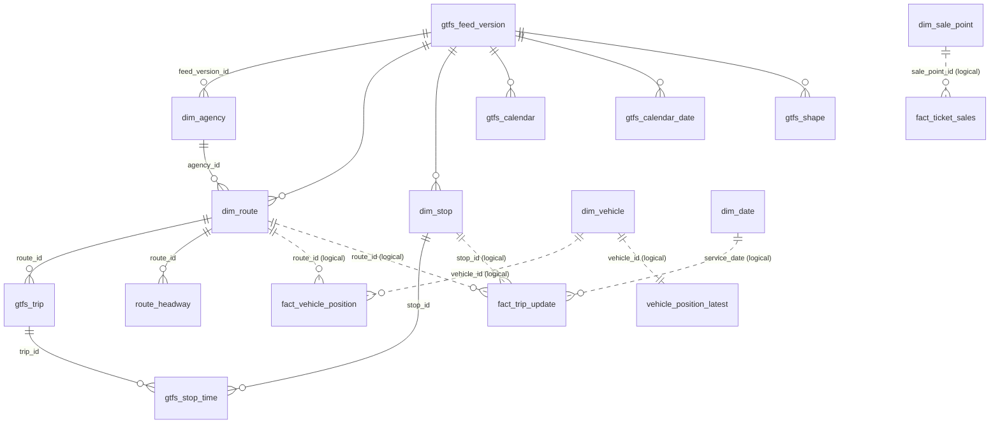
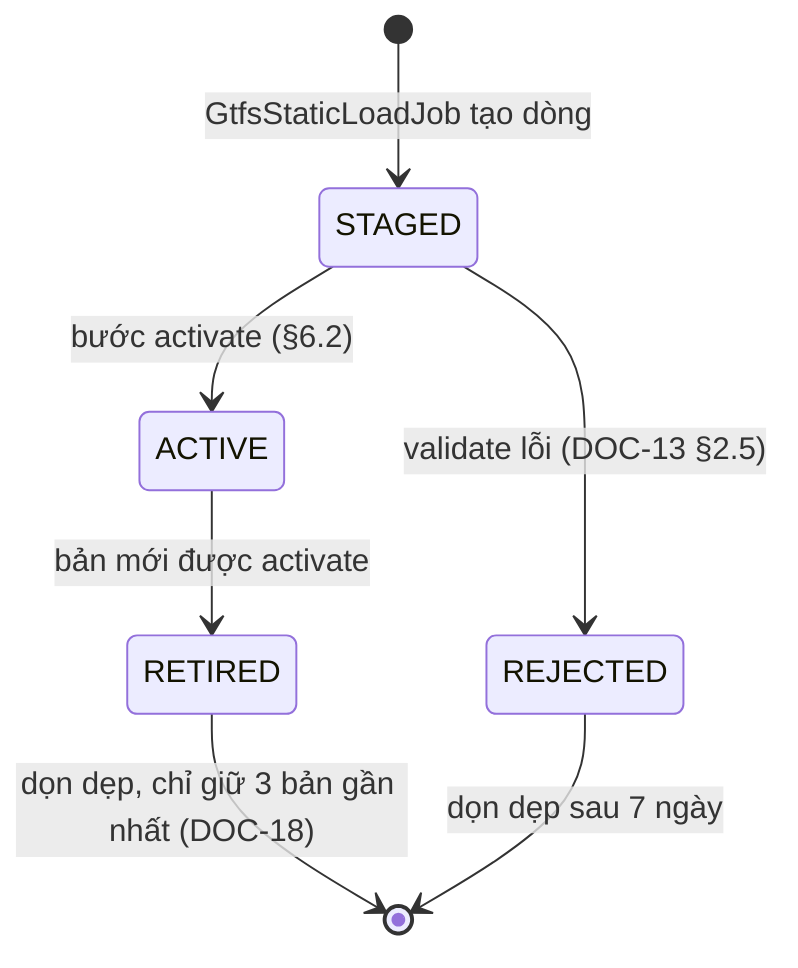

# Mô hình dữ liệu warehouse

> Trạng thái: **Review** · Cập nhật: 2026-09-28 · DOC-14
> Phụ thuộc: [DR](../00-decision-register.md) (DR-09…15, 21, 63, 64, 65), [ADR-0003](../04-adr/0003-effectively-once-upsert.md), [ADR-0009](../04-adr/0009-gtfs-feed-versioning.md), [ADR-0011](../04-adr/0011-fact-partitioning.md), [ADR-0024](../04-adr/0024-flyway-migration-job.md), [DOC-13](source-data.md), [DOC-17](db-roles-and-grants.md)
> Người dùng chính: module `db` (P1-05), `etl` (P2), `api` (P4)

Tài liệu này định nghĩa schema `dw` của `pti_warehouse`: phiên bản feed, dimension, bảng lịch GTFS, fact, bảng vị trí hiện tại, lịch ngày và bảng bóng `exp`. Schema `ops`, `insight`, `batch` nằm ở [DOC-15](ops-and-insight-model.md). Mọi migration ở đây **đã chạy sạch trên PostgreSQL 17** theo đúng thứ tự, mỗi file trong một transaction như Flyway (`psql -1`). Feed thật (DOC-13) đã nạp được đầy đủ dưới mọi ràng buộc.

## 1. Danh sách migration

| File | Nội dung | Phase |
| --- | --- | --- |
| `V1__schemas.sql` | Năm schema `dw`, `ops`, `insight`, `batch`, `exp` | P1-05 |
| `V2__feed_version_and_dimensions.sql` | `gtfs_feed_version`, `dim_agency`, `dim_route`, `dim_stop`, `dim_vehicle`, `dim_sale_point`, view `*_current` | P1-05 |
| `V3__gtfs_schedule.sql` | `gtfs_calendar`, `gtfs_calendar_date`, `gtfs_trip`, `gtfs_stop_time`, `gtfs_shape`, `route_headway`, hàm thời gian | P1-05 |
| `V4__facts.sql` | Ba bảng fact partitioned, `vehicle_position_latest`, hàm quản lý partition, bảng bóng `exp` | P1-05 |
| `V5_1__spring_batch_schema.sql`, `V5_2__ops_tables.sql` | DOC-15 | P1-05 |
| `V6__dim_date.sql` | `dim_date` 2024–2030 | P1-05 |
| `V7__insight.sql` | DOC-15 | P4-01 |
| `R__grants.sql` | DOC-17 | P1-06 |

Thư mục: `backend/db/src/main/resources/db/migration/warehouse/`. Flyway chạy với user `pti_owner`, `defaultSchema=public`, `createSchemas=false` (DOC-17 §5).

## 2. Quy ước

- **Luôn ghi rõ schema** trong SQL (`dw.fact_trip_update`), không dựa vào `search_path` (DR-64).
- Tên bảng và cột dùng `snake_case` tiếng Anh. Constraint quan trọng được đặt tên (`fact_trip_update_pk`) để code dùng được `ON CONFLICT ON CONSTRAINT`.
- Thời điểm là `TIMESTAMPTZ` (UTC). Ngày phục vụ là `DATE` theo giờ agency. Giờ GTFS là `INT` giây kể từ "noon minus 12h" (DOC-13 §3).
- Natural key của GTFS (`route_id`, `stop_id`, `trip_id`) là `TEXT`, giữ nguyên như trong feed. Fact **không** dùng surrogate key (DR-10).
- Enum là `TEXT` kèm `CHECK (… IN (…))`, không dùng kiểu `ENUM` của PostgreSQL, vì thêm giá trị vào `CHECK` là một migration expand/contract bình thường (ADR-0024).
- Mọi bảng do ETL ghi có `batch_id UUID` (DR-63). Fact có thêm `ingested_at` (lần ghi đầu) và `updated_at` (lần ghi cuối).
- Tiền: `NUMERIC(10,2)`. Tọa độ: `DOUBLE PRECISION`. Hướng và tốc độ: `REAL`.

## 3. Sơ đồ quan hệ



Nét liền là khóa ngoại thật, chỉ có giữa các bảng cùng một phiên bản feed. Nét đứt là **quan hệ logic, không có FK**, vì:

1. Fact được giữ qua nhiều phiên bản feed, còn dimension đổi theo phiên bản (ADR-0009). Fact nối với dimension của **phiên bản đang ACTIVE** qua view `*_current`, hoặc với phiên bản có `valid_from ≤ service_date ≤ valid_to` khi phân tích lịch sử.
2. FK trên bảng partitioned ghi 660 dòng/giây làm mỗi lần ghi phải tra thêm index của bảng khác. Thay vào đó, rule DQ post-write kiểm tra tính toàn vẹn tham chiếu (DOC-16).
3. Dữ liệu realtime có thể đến trước dimension (xe mới, điểm bán mới), nên ETL tạo dòng `REALTIME`/`INFERRED` giữ chỗ thay vì từ chối.

## 4. Phiên bản feed và dimension (V1, V2)

File `backend/db/src/main/resources/db/migration/warehouse/V1__schemas.sql`:

```sql
-- pti_warehouse, run by pti_owner. Login roles already exist (bootstrap, DOC-17 §3);
-- this migration only creates schemas. Grants live in R__grants.sql.
CREATE SCHEMA dw      AUTHORIZATION pti_owner;  -- GTFS static, dimensions, facts
CREATE SCHEMA ops     AUTHORIZATION pti_owner;  -- ETL operations, DLQ, replay, alerts
CREATE SCHEMA insight AUTHORIZATION pti_owner;  -- analytics output and state
CREATE SCHEMA batch   AUTHORIZATION pti_owner;  -- Spring Batch metadata (DR-62)
CREATE SCHEMA exp     AUTHORIZATION pti_owner;  -- baseline shadow tables (DR-27)

-- flyway_schema_history stays in public; nobody else may use that schema.
REVOKE ALL ON SCHEMA public FROM PUBLIC;
```

File `backend/db/src/main/resources/db/migration/warehouse/V2__feed_version_and_dimensions.sql`:

```sql
-- Feed versions and dimensions (DR-10, ADR-0009).

CREATE TABLE dw.gtfs_feed_version (
  feed_version_id        BIGINT      GENERATED ALWAYS AS IDENTITY PRIMARY KEY,
  feed_hash              CHAR(64)    NOT NULL CONSTRAINT gtfs_feed_version_hash_uk UNIQUE
                                     CHECK (feed_hash ~ '^[0-9a-f]{64}$'),
  source_uri             TEXT        NOT NULL,
  raw_object_key         TEXT        NOT NULL,              -- raw/gtfs-static/<feed_hash>.zip
  publisher_name         TEXT        NULL,                  -- feed_info.feed_publisher_name
  publisher_feed_version TEXT        NULL,                  -- feed_info.feed_version
  agency_timezone        TEXT        NOT NULL,              -- single timezone for the whole feed
  valid_from             DATE        NULL,                  -- min service date (calendar + calendar_dates)
  valid_to               DATE        NULL,                  -- max service date
  bbox_min_lon           DOUBLE PRECISION NULL,             -- stop bounding box, used by the bbox DQ rule
  bbox_min_lat           DOUBLE PRECISION NULL,
  bbox_max_lon           DOUBLE PRECISION NULL,
  bbox_max_lat           DOUBLE PRECISION NULL,
  status                 TEXT        NOT NULL DEFAULT 'STAGED'
                                     CHECK (status IN ('STAGED', 'ACTIVE', 'RETIRED', 'REJECTED')),
  loaded_at              TIMESTAMPTZ NOT NULL DEFAULT now(),
  activated_at           TIMESTAMPTZ NULL,
  retired_at             TIMESTAMPTZ NULL,
  validation_report      JSONB       NULL,
  job_execution_id       BIGINT      NULL,                  -- batch.batch_job_execution that loaded it
  CHECK (valid_from IS NULL OR valid_to IS NULL OR valid_from <= valid_to),
  CHECK (status NOT IN ('ACTIVE', 'RETIRED') OR (activated_at IS NOT NULL AND valid_from IS NOT NULL
                                                  AND bbox_min_lon IS NOT NULL)),
  CHECK (status <> 'RETIRED' OR retired_at IS NOT NULL)
);
-- At most one ACTIVE version. The swap retires the old version first, then activates the new one.
CREATE UNIQUE INDEX gtfs_feed_version_one_active ON dw.gtfs_feed_version ((true)) WHERE status = 'ACTIVE';

CREATE TABLE dw.dim_agency (
  feed_version_id BIGINT NOT NULL REFERENCES dw.gtfs_feed_version (feed_version_id),
  agency_id       TEXT   NOT NULL,
  agency_name     TEXT   NOT NULL,
  agency_url      TEXT   NULL,
  agency_timezone TEXT   NOT NULL,
  agency_lang     TEXT   NULL,
  agency_phone    TEXT   NULL,
  agency_fare_url TEXT   NULL,
  PRIMARY KEY (feed_version_id, agency_id)
);

CREATE TABLE dw.dim_route (
  feed_version_id         BIGINT   NOT NULL,
  route_id                TEXT     NOT NULL,
  agency_id               TEXT     NOT NULL,
  route_short_name        TEXT     NULL,
  route_long_name         TEXT     NULL,
  route_desc              TEXT     NULL,
  display_name            TEXT     NOT NULL,   -- short name, else long name, else route_id
  route_type              SMALLINT NOT NULL CHECK (route_type BETWEEN 0 AND 12 OR route_type BETWEEN 100 AND 1702),
  route_color             CHAR(6)  NULL CHECK (route_color ~ '^[0-9A-F]{6}$'),
  route_text_color        CHAR(6)  NULL CHECK (route_text_color ~ '^[0-9A-F]{6}$'),
  route_sort_order        INT      NULL,
  typical_headway_seconds INT      NULL,       -- display only (DR-12); weekday 07-19 median
  PRIMARY KEY (feed_version_id, route_id),
  FOREIGN KEY (feed_version_id, agency_id) REFERENCES dw.dim_agency (feed_version_id, agency_id)
);

CREATE TABLE dw.dim_stop (
  feed_version_id     BIGINT           NOT NULL REFERENCES dw.gtfs_feed_version (feed_version_id),
  stop_id             TEXT             NOT NULL,
  stop_code           TEXT             NULL,
  stop_name           TEXT             NOT NULL,
  stop_desc           TEXT             NULL,
  lat                 DOUBLE PRECISION NULL CHECK (lat BETWEEN -90 AND 90),
  lon                 DOUBLE PRECISION NULL CHECK (lon BETWEEN -180 AND 180),
  location_type       SMALLINT         NOT NULL DEFAULT 0 CHECK (location_type BETWEEN 0 AND 4),
  parent_station      TEXT             NULL,
  wheelchair_boarding SMALLINT         NOT NULL DEFAULT 0 CHECK (wheelchair_boarding BETWEEN 0 AND 2),
  platform_code       TEXT             NULL,
  PRIMARY KEY (feed_version_id, stop_id),
  -- GTFS: stops, stations and entrances need coordinates; generic nodes and boarding areas may omit them.
  CHECK (location_type IN (3, 4) OR (lat IS NOT NULL AND lon IS NOT NULL))
);

-- Not versioned: fed by vehicles.txt and by realtime data (FR-01.6).
CREATE TABLE dw.dim_vehicle (
  vehicle_id          TEXT        PRIMARY KEY,
  vehicle_label       TEXT        NULL,
  vehicle_model       TEXT        NULL,    -- vehicles.txt vehicle_description, e.g. 40LFBUS
  seated_capacity     INT         NULL CHECK (seated_capacity >= 0),
  standing_capacity   INT         NULL CHECK (standing_capacity >= 0),
  capacity            INT         GENERATED ALWAYS AS (seated_capacity + standing_capacity) STORED,
  low_floor           BOOLEAN     NULL,
  wheelchair_access   TEXT        NULL,
  fuel                TEXT        NULL,
  source              TEXT        NOT NULL CHECK (source IN ('FEED', 'REALTIME')),
  first_seen_at       TIMESTAMPTZ NOT NULL DEFAULT now(),
  updated_at          TIMESTAMPTZ NOT NULL DEFAULT now()
);

-- Not versioned: fed by CDC (ticketing.sale_points.cdc); INFERRED rows are placeholders
-- created when a sale arrives before its sale point (DOC-09 §5.3).
CREATE TABLE dw.dim_sale_point (
  sale_point_id TEXT        PRIMARY KEY,
  name          TEXT        NULL,
  kind          TEXT        NULL CHECK (kind IN ('KIOSK', 'ONBOARD', 'APP')),
  stop_id       TEXT        NULL,
  route_id      TEXT        NULL,
  source        TEXT        NOT NULL CHECK (source IN ('CDC', 'INFERRED')),
  is_deleted    BOOLEAN     NOT NULL DEFAULT false,
  source_lsn    BIGINT      NULL,
  batch_id      UUID        NOT NULL,
  created_at    TIMESTAMPTZ NOT NULL DEFAULT now(),
  updated_at    TIMESTAMPTZ NOT NULL DEFAULT now(),
  CHECK (source = 'INFERRED' OR (name IS NOT NULL AND kind IS NOT NULL AND source_lsn IS NOT NULL))
);

CREATE VIEW dw.dim_agency_current AS
  SELECT a.* FROM dw.dim_agency a
  JOIN dw.gtfs_feed_version f ON f.feed_version_id = a.feed_version_id AND f.status = 'ACTIVE';
CREATE VIEW dw.dim_route_current AS
  SELECT r.* FROM dw.dim_route r
  JOIN dw.gtfs_feed_version f ON f.feed_version_id = r.feed_version_id AND f.status = 'ACTIVE';
CREATE VIEW dw.dim_stop_current AS
  SELECT s.* FROM dw.dim_stop s
  JOIN dw.gtfs_feed_version f ON f.feed_version_id = s.feed_version_id AND f.status = 'ACTIVE';
```

Vòng đời `gtfs_feed_version.status` (ADR-0009):



- Partial unique index `gtfs_feed_version_one_active` bảo đảm **tối đa một** bản `ACTIVE`. Vì vậy bước activate phải retire bản cũ trước rồi mới activate bản mới, trong cùng một transaction. Người đọc không bao giờ thấy trạng thái "không có bản ACTIVE".
- Nạp lại đúng feed đã có (cùng `feed_hash`) vi phạm `gtfs_feed_version_hash_uk`. Job bắt lỗi này và kết thúc với exit status `NOOP` (DOC-21).
- `dim_vehicle` và `dim_sale_point` **không theo phiên bản**: nguồn của chúng là `vehicles.txt` hoặc realtime và CDC, không gắn với một bản feed.

## 5. Bảng lịch GTFS (V3)

File `backend/db/src/main/resources/db/migration/warehouse/V3__gtfs_schedule.sql`:

```sql
-- Versioned GTFS schedule tables, headway, and time helpers (DR-09, DR-10, DR-12).

CREATE TABLE dw.gtfs_calendar (
  feed_version_id BIGINT  NOT NULL REFERENCES dw.gtfs_feed_version (feed_version_id),
  service_id      TEXT    NOT NULL,
  monday          BOOLEAN NOT NULL,
  tuesday         BOOLEAN NOT NULL,
  wednesday       BOOLEAN NOT NULL,
  thursday        BOOLEAN NOT NULL,
  friday          BOOLEAN NOT NULL,
  saturday        BOOLEAN NOT NULL,
  sunday          BOOLEAN NOT NULL,
  start_date      DATE    NOT NULL,
  end_date        DATE    NOT NULL,
  PRIMARY KEY (feed_version_id, service_id),
  CHECK (start_date <= end_date)
);

CREATE TABLE dw.gtfs_calendar_date (
  feed_version_id BIGINT   NOT NULL REFERENCES dw.gtfs_feed_version (feed_version_id),
  service_id      TEXT     NOT NULL,
  date            DATE     NOT NULL,
  exception_type  SMALLINT NOT NULL CHECK (exception_type IN (1, 2)),  -- 1 added, 2 removed
  PRIMARY KEY (feed_version_id, service_id, date)
);

CREATE TABLE dw.gtfs_trip (
  feed_version_id       BIGINT   NOT NULL,
  trip_id               TEXT     NOT NULL,
  route_id              TEXT     NOT NULL,
  service_id            TEXT     NOT NULL,
  direction_id          SMALLINT NOT NULL CHECK (direction_id IN (0, 1)),
  direction_label       TEXT     NULL,       -- non-standard trips.direction (NB/SB/EB/WB)
  trip_headsign         TEXT     NULL,
  block_id              TEXT     NULL,
  shape_id              TEXT     NULL,
  wheelchair_accessible SMALLINT NOT NULL DEFAULT 0 CHECK (wheelchair_accessible BETWEEN 0 AND 2),
  PRIMARY KEY (feed_version_id, trip_id),
  FOREIGN KEY (feed_version_id, route_id) REFERENCES dw.dim_route (feed_version_id, route_id)
);
CREATE INDEX gtfs_trip_route_idx ON dw.gtfs_trip (feed_version_id, route_id, direction_id);
CREATE INDEX gtfs_trip_block_idx ON dw.gtfs_trip (feed_version_id, block_id);

-- Times are seconds after "noon minus 12h" of the service date, so 25:10:00 = 90600 (DR-09).
CREATE TABLE dw.gtfs_stop_time (
  feed_version_id     BIGINT           NOT NULL,
  trip_id             TEXT             NOT NULL,
  stop_sequence       INT              NOT NULL CHECK (stop_sequence >= 0),
  stop_id             TEXT             NOT NULL,
  arrival_seconds     INT              NOT NULL CHECK (arrival_seconds >= 0),
  departure_seconds   INT              NOT NULL CHECK (departure_seconds >= 0),
  pickup_type         SMALLINT         NOT NULL DEFAULT 0 CHECK (pickup_type BETWEEN 0 AND 3),
  drop_off_type       SMALLINT         NOT NULL DEFAULT 0 CHECK (drop_off_type BETWEEN 0 AND 3),
  timepoint           BOOLEAN          NOT NULL DEFAULT true,
  shape_dist_traveled DOUBLE PRECISION NULL CHECK (shape_dist_traveled >= 0),
  PRIMARY KEY (feed_version_id, trip_id, stop_sequence),
  FOREIGN KEY (feed_version_id, trip_id) REFERENCES dw.gtfs_trip (feed_version_id, trip_id),
  FOREIGN KEY (feed_version_id, stop_id) REFERENCES dw.dim_stop (feed_version_id, stop_id),
  CHECK (departure_seconds >= arrival_seconds)
);
-- Stop departures board (GET /stops/{id}/arrivals) and scheduled headway computation.
CREATE INDEX gtfs_stop_time_stop_idx ON dw.gtfs_stop_time (feed_version_id, stop_id, departure_seconds);

CREATE TABLE dw.gtfs_shape (
  feed_version_id     BIGINT           NOT NULL REFERENCES dw.gtfs_feed_version (feed_version_id),
  shape_id            TEXT             NOT NULL,
  shape_pt_sequence   INT              NOT NULL CHECK (shape_pt_sequence >= 0),
  lat                 DOUBLE PRECISION NOT NULL CHECK (lat BETWEEN -90 AND 90),
  lon                 DOUBLE PRECISION NOT NULL CHECK (lon BETWEEN -180 AND 180),
  shape_dist_traveled DOUBLE PRECISION NULL CHECK (shape_dist_traveled >= 0),
  PRIMARY KEY (feed_version_id, shape_id, shape_pt_sequence)
);

CREATE TABLE dw.route_headway (
  feed_version_id           BIGINT   NOT NULL,
  route_id                  TEXT     NOT NULL,
  direction_id              SMALLINT NOT NULL CHECK (direction_id IN (0, 1)),
  day_type                  TEXT     NOT NULL CHECK (day_type IN ('WEEKDAY', 'SATURDAY', 'SUNDAY_HOLIDAY')),
  hour_of_day               SMALLINT NOT NULL CHECK (hour_of_day BETWEEN 0 AND 23),
  scheduled_headway_seconds INT      NULL CHECK (scheduled_headway_seconds > 0),  -- NULL when trip_count < 2
  trip_count                INT      NOT NULL CHECK (trip_count >= 1),
  PRIMARY KEY (feed_version_id, route_id, direction_id, day_type, hour_of_day),
  FOREIGN KEY (feed_version_id, route_id) REFERENCES dw.dim_route (feed_version_id, route_id)
);

CREATE VIEW dw.gtfs_calendar_current AS
  SELECT c.* FROM dw.gtfs_calendar c
  JOIN dw.gtfs_feed_version f ON f.feed_version_id = c.feed_version_id AND f.status = 'ACTIVE';
CREATE VIEW dw.gtfs_calendar_date_current AS
  SELECT c.* FROM dw.gtfs_calendar_date c
  JOIN dw.gtfs_feed_version f ON f.feed_version_id = c.feed_version_id AND f.status = 'ACTIVE';
CREATE VIEW dw.gtfs_trip_current AS
  SELECT t.* FROM dw.gtfs_trip t
  JOIN dw.gtfs_feed_version f ON f.feed_version_id = t.feed_version_id AND f.status = 'ACTIVE';
CREATE VIEW dw.gtfs_stop_time_current AS
  SELECT st.* FROM dw.gtfs_stop_time st
  JOIN dw.gtfs_feed_version f ON f.feed_version_id = st.feed_version_id AND f.status = 'ACTIVE';
CREATE VIEW dw.gtfs_shape_current AS
  SELECT s.* FROM dw.gtfs_shape s
  JOIN dw.gtfs_feed_version f ON f.feed_version_id = s.feed_version_id AND f.status = 'ACTIVE';
CREATE VIEW dw.route_headway_current AS
  SELECT h.* FROM dw.route_headway h
  JOIN dw.gtfs_feed_version f ON f.feed_version_id = h.feed_version_id AND f.status = 'ACTIVE';

-- GTFS time -> instant. The reference point is noon minus 12h local time, which differs from
-- local midnight on DST change days (DR-09). Java counterpart: GtfsTime.toInstant (common).
CREATE FUNCTION dw.gtfs_time_to_ts(p_service_date DATE, p_seconds INT, p_timezone TEXT)
RETURNS TIMESTAMPTZ
LANGUAGE sql STABLE PARALLEL SAFE
SET search_path = pg_catalog
AS $$
  SELECT ((p_service_date + time '12:00') AT TIME ZONE p_timezone)
         - interval '12 hours'
         + make_interval(secs => p_seconds)
$$;

-- Service ids running on a service date in a given feed version (calendar + calendar_dates).
-- Takes the version explicitly so GtfsStaticLoadJob can use it while the version is STAGED.
CREATE FUNCTION dw.service_ids_on(p_feed_version_id BIGINT, p_service_date DATE)
RETURNS SETOF TEXT
LANGUAGE sql STABLE
SET search_path = pg_catalog
AS $$
  SELECT c.service_id
  FROM dw.gtfs_calendar c
  WHERE c.feed_version_id = p_feed_version_id
    AND p_service_date BETWEEN c.start_date AND c.end_date
    AND CASE extract(isodow FROM p_service_date)::int
          WHEN 1 THEN c.monday   WHEN 2 THEN c.tuesday WHEN 3 THEN c.wednesday
          WHEN 4 THEN c.thursday WHEN 5 THEN c.friday  WHEN 6 THEN c.saturday
          ELSE c.sunday END
    AND NOT EXISTS (SELECT 1 FROM dw.gtfs_calendar_date d
                    WHERE d.feed_version_id = p_feed_version_id AND d.service_id = c.service_id
                      AND d.date = p_service_date AND d.exception_type = 2)
  UNION
  SELECT d.service_id
  FROM dw.gtfs_calendar_date d
  WHERE d.feed_version_id = p_feed_version_id AND d.date = p_service_date AND d.exception_type = 1
$$;
```

Ghi chú:

- `gtfs_stop_time` là bảng lớn nhất trong nhóm (872.717 dòng mỗi phiên bản). Index `gtfs_stop_time_stop_idx (feed_version_id, stop_id, departure_seconds)` phục vụ bảng giờ tại trạm (`GET /stops/{id}/arrivals`) và bước tính headway.
- `dw.gtfs_time_to_ts` là `STABLE` (không phải `IMMUTABLE`) vì phụ thuộc cơ sở dữ liệu múi giờ. Hàm đã được kiểm tra với bảng ví dụ ở DOC-13 §3 và cho đúng cả 6 dòng.
- `dw.service_ids_on` nhận `feed_version_id` tường minh, nên job gọi được khi phiên bản còn đang `STAGED`. Để lấy service của bản đang chạy: `dw.service_ids_on((SELECT feed_version_id FROM dw.gtfs_feed_version WHERE status = 'ACTIVE'), d)`.

## 6. Headway và các bước cuối của `GtfsStaticLoadJob`

### 6.1 Bước finalize

Bước này chạy sau khi mọi file đã được nạp vào phiên bản `STAGED`. Ba câu lệnh chạy trong một transaction:

1. Tính `valid_from`, `valid_to` và bounding box của trạm (rule DQ kiểm tra tọa độ dùng bbox này).
2. Tính `route_headway` theo **trạm tham chiếu** (DR-12 đã điều chỉnh):
   - Chọn một ngày đại diện cho mỗi `day_type`: ngày thứ Ba, thứ Bảy và Chủ nhật đầu tiên trong 28 ngày đầu của khoảng hiệu lực mà không có ngoại lệ trong `calendar_dates`.
   - Với mỗi `(day_type, route_id, direction_id)`, trạm tham chiếu là trạm có nhiều chuyến phục vụ nhất. Hòa thì lấy trạm có `stop_sequence` trung bình nhỏ hơn, rồi `stop_id` nhỏ hơn.
   - Headway của một giờ là median của hiệu giờ khởi hành giữa hai chuyến liên tiếp tại trạm tham chiếu, gán cho giờ của chuyến sau. Giờ GTFS ≥ 24 được gán vào `hour % 24`.
   - **Tại sao không dùng trạm đầu:** tuyến có nhánh bắt đầu ở nhiều trạm khác nhau (tuyến 18 có 4 trạm đầu), nên hiệu giờ khởi hành giữa các "trạm đầu" không phải là headway.
3. `dim_route.typical_headway_seconds` = median của headway ngày thường từ 07:00 tới 19:00, gộp cả hai chiều. Chỉ để hiển thị.

File `backend/etl/src/main/resources/sql/gtfs_finalize.sql`:

```sql
-- GtfsStaticLoadJob, step "finalize" (DOC-21). Runs after all files are loaded as STAGED and
-- before the activation step. Three statements, one transaction; :feedVersionId is the STAGED version.

-- (1) feed metadata used by DQ rules
UPDATE dw.gtfs_feed_version f
SET valid_from   = s.valid_from,
    valid_to     = s.valid_to,
    bbox_min_lon = b.min_lon, bbox_min_lat = b.min_lat,
    bbox_max_lon = b.max_lon, bbox_max_lat = b.max_lat
FROM (SELECT least(min(c.start_date), (SELECT min(date) FROM dw.gtfs_calendar_date WHERE feed_version_id = :feedVersionId AND exception_type = 1)) AS valid_from,
             greatest(max(c.end_date), (SELECT max(date) FROM dw.gtfs_calendar_date WHERE feed_version_id = :feedVersionId AND exception_type = 1)) AS valid_to
      FROM dw.gtfs_calendar c WHERE c.feed_version_id = :feedVersionId) s,
     (SELECT min(lon) AS min_lon, min(lat) AS min_lat, max(lon) AS max_lon, max(lat) AS max_lat
      FROM dw.dim_stop WHERE feed_version_id = :feedVersionId AND location_type = 0) b
WHERE f.feed_version_id = :feedVersionId;

-- (2) route_headway (DR-12, adjusted): one representative date per day type; departures at the
--     reference stop = the stop served by the most trips of (route, direction) that day.
INSERT INTO dw.route_headway (feed_version_id, route_id, direction_id, day_type, hour_of_day,
                              scheduled_headway_seconds, trip_count)
WITH rep AS (
  SELECT DISTINCT ON (day_type) day_type, d
  FROM (SELECT d::date AS d,
               CASE extract(isodow FROM d) WHEN 6 THEN 'SATURDAY' WHEN 7 THEN 'SUNDAY_HOLIDAY' ELSE 'WEEKDAY' END AS day_type
        FROM dw.gtfs_feed_version f,
             generate_series(f.valid_from, least(f.valid_from + 27, f.valid_to), interval '1 day') AS d
        WHERE f.feed_version_id = :feedVersionId
          AND extract(isodow FROM d) IN (2, 6, 7)
          AND NOT EXISTS (SELECT 1 FROM dw.gtfs_calendar_date cd
                          WHERE cd.feed_version_id = :feedVersionId AND cd.date = d::date)) x
  ORDER BY day_type, d
),
day_trips AS (
  SELECT rep.day_type, t.trip_id, t.route_id, t.direction_id
  FROM rep
  JOIN dw.gtfs_trip t ON t.feed_version_id = :feedVersionId AND t.service_id IN (SELECT dw.service_ids_on(:feedVersionId, rep.d))
),
stop_use AS (
  SELECT dt.day_type, dt.route_id, dt.direction_id, st.stop_id,
         count(*) AS trips, avg(st.stop_sequence) AS avg_seq
  FROM day_trips dt
  JOIN dw.gtfs_stop_time st ON st.feed_version_id = :feedVersionId AND st.trip_id = dt.trip_id
  GROUP BY dt.day_type, dt.route_id, dt.direction_id, st.stop_id
),
ref_stop AS (
  SELECT DISTINCT ON (day_type, route_id, direction_id) day_type, route_id, direction_id, stop_id
  FROM stop_use
  ORDER BY day_type, route_id, direction_id, trips DESC, avg_seq, stop_id
),
departures AS (
  SELECT dt.day_type, dt.route_id, dt.direction_id, st.departure_seconds AS dep
  FROM day_trips dt
  JOIN ref_stop r USING (day_type, route_id, direction_id)
  JOIN dw.gtfs_stop_time st ON st.feed_version_id = :feedVersionId AND st.trip_id = dt.trip_id AND st.stop_id = r.stop_id
),
gaps AS (
  SELECT day_type, route_id, direction_id, ((dep / 3600) % 24)::smallint AS hour_of_day,
         dep - lag(dep) OVER (PARTITION BY day_type, route_id, direction_id ORDER BY dep) AS gap
  FROM departures
)
SELECT :feedVersionId, route_id, direction_id, day_type, hour_of_day,
       (percentile_disc(0.5) WITHIN GROUP (ORDER BY gap) FILTER (WHERE gap > 0))::int,
       count(*)
FROM gaps
GROUP BY route_id, direction_id, day_type, hour_of_day;

-- (3) display headway: weekday 07-19 median over both directions
UPDATE dw.dim_route r
SET typical_headway_seconds = h.median
FROM (SELECT route_id, percentile_disc(0.5) WITHIN GROUP (ORDER BY scheduled_headway_seconds) AS median
      FROM dw.route_headway
      WHERE feed_version_id = :feedVersionId AND day_type = 'WEEKDAY' AND hour_of_day BETWEEN 7 AND 18
        AND scheduled_headway_seconds IS NOT NULL
      GROUP BY route_id) h
WHERE r.feed_version_id = :feedVersionId AND r.route_id = h.route_id;
```

Kết quả trên feed thật (1,85 giây): 8.177 dòng `route_headway`, trong đó 380 dòng có headway NULL (giờ chỉ có một chuyến). 124 tuyến có `typical_headway_seconds`. Kiểm tra với lịch công bố:

| Tuyến | Headway tính được | Ghi chú |
| --- | --- | --- |
| 901 METRO Blue Line | 12 phút | khớp lịch |
| 902 METRO Green Line | 12 phút | khớp lịch |
| 921 METRO A Line | 10 phút | khớp lịch |
| 2, 18 | 10 phút | tuyến 18 có nhánh; cách tính theo trạm đầu cho kết quả sai |
| 5 | 60 phút | tuyến này chạy mỗi giờ |

### 6.2 Bước activate

File `backend/etl/src/main/resources/sql/gtfs_activate.sql`:

```sql
-- GtfsStaticLoadJob, step "activate": one transaction. Retire first, then activate, because the
-- partial unique index gtfs_feed_version_one_active allows a single ACTIVE row at any instant.
UPDATE dw.gtfs_feed_version SET status = 'RETIRED', retired_at = now()
WHERE status = 'ACTIVE' AND feed_version_id <> :feedVersionId;

UPDATE dw.gtfs_feed_version SET status = 'ACTIVE', activated_at = now(), retired_at = NULL
WHERE feed_version_id = :feedVersionId
  AND (status = 'STAGED' OR (:allowRetired AND status = 'RETIRED'));  -- 0 rows -> the job fails the step
```

`:allowRetired` chỉ là `true` ở nhánh `REACTIVATE` của `GtfsStaticLoadJob` (tham số `allowReactivate`, DOC-21 §1, §3.1).

Nếu câu lệnh thứ hai cập nhật 0 dòng (phiên bản không còn `STAGED`, ví dụ bị job khác xử lý) thì step thất bại và transaction rollback, nên câu lệnh thứ nhất cũng không có hiệu lực.

## 7. Fact và vị trí hiện tại (V4)

### 7.1 Grain và khóa

| Bảng | Grain | Khóa (PK) | Partition | Kiểu ghi |
| --- | --- | --- | --- | --- |
| `fact_vehicle_position` | Một vị trí của một xe tại một event time | `(service_date, vehicle_id, event_timestamp)` | ngày, theo `service_date` | Hầu hết là INSERT |
| `fact_trip_update` | Một trạm của một chuyến trong một ngày phục vụ; **trạng thái mới nhất** | `(service_date, trip_id, stop_sequence)` | ngày, theo `service_date` | Chủ yếu là UPDATE, khoảng 13 triệu lần ghi trên 345 nghìn dòng mỗi ngày |
| `fact_ticket_sales` | Một giao dịch (bán hoặc hoàn) | `(sale_date, transaction_id)` | tháng, theo `sale_date` | INSERT, thỉnh thoảng UPDATE (void, delete) |
| `vehicle_position_latest` | Một xe | `vehicle_id` | không | UPDATE liên tục, khoảng 1.100 dòng |

PK phải chứa cột partition (giới hạn của PostgreSQL), nên business key của DOC-09 §9 có thêm `service_date`/`sale_date`. Với VehiclePosition, `service_date` suy ra từ `start_date` trong message, nên một business key `(vehicle_id, event_timestamp)` luôn cho đúng một PK.

### 7.2 DDL

File `backend/db/src/main/resources/db/migration/warehouse/V4__facts.sql`:

```sql
-- Facts (partitioned, ADR-0011), latest positions (DR-14), partition maintenance, baseline shadow tables (DR-27).

-- Grain: one reported position of one vehicle at one event time.
CREATE TABLE dw.fact_vehicle_position (
  service_date          DATE             NOT NULL,   -- payload.start_date
  vehicle_id            TEXT             NOT NULL,
  event_timestamp       TIMESTAMPTZ      NOT NULL,
  trip_id               TEXT             NOT NULL,
  route_id              TEXT             NOT NULL,
  direction_id          SMALLINT         NOT NULL CHECK (direction_id IN (0, 1)),
  lat                   DOUBLE PRECISION NOT NULL CHECK (lat BETWEEN -90 AND 90),
  lon                   DOUBLE PRECISION NOT NULL CHECK (lon BETWEEN -180 AND 180),
  bearing               REAL             NULL CHECK (bearing >= 0 AND bearing <= 360),
  speed_mps             REAL             NULL CHECK (speed_mps >= 0),
  current_stop_sequence INT              NOT NULL CHECK (current_stop_sequence >= 0),
  stop_id               TEXT             NOT NULL,
  current_status        TEXT             NOT NULL CHECK (current_status IN ('INCOMING_AT', 'STOPPED_AT', 'IN_TRANSIT_TO')),
  occupancy_status      TEXT             NULL,       -- schema_version >= 2
  schema_version        SMALLINT         NOT NULL,
  payload_hash          CHAR(64)         NOT NULL,
  batch_id              UUID             NOT NULL,
  ingested_at           TIMESTAMPTZ      NOT NULL DEFAULT now(),
  updated_at            TIMESTAMPTZ      NOT NULL DEFAULT now(),
  CONSTRAINT fact_vehicle_position_pk PRIMARY KEY (service_date, vehicle_id, event_timestamp)
) PARTITION BY RANGE (service_date);
CREATE INDEX fact_vehicle_position_route_idx ON dw.fact_vehicle_position (service_date, route_id, event_timestamp);
CREATE INDEX fact_vehicle_position_batch_idx ON dw.fact_vehicle_position (batch_id);

-- Grain: one stop of one trip on one service date; the latest known state (DR-13).
CREATE TABLE dw.fact_trip_update (
  service_date            DATE        NOT NULL,   -- payload.start_date
  trip_id                 TEXT        NOT NULL,
  stop_sequence           INT         NOT NULL CHECK (stop_sequence >= 0),
  route_id                TEXT        NOT NULL,
  direction_id            SMALLINT    NOT NULL CHECK (direction_id IN (0, 1)),
  stop_id                 TEXT        NOT NULL,
  vehicle_id              TEXT        NOT NULL,
  schedule_relationship   TEXT        NOT NULL CHECK (schedule_relationship IN ('SCHEDULED', 'SKIPPED', 'NO_DATA')),
  scheduled_arrival       TIMESTAMPTZ NULL,       -- arrival.time - arrival.delay (else departure)
  arrival_time            TIMESTAMPTZ NULL,
  departure_time          TIMESTAMPTZ NULL,
  delay_seconds           INT         NULL CHECK (delay_seconds BETWEEN -86400 AND 86400),
  is_observed             BOOLEAN     NOT NULL,   -- coalesce(arrival, departure) <= event_timestamp
  event_timestamp         TIMESTAMPTZ NOT NULL,
  payload_hash            CHAR(64)    NOT NULL,
  batch_id                UUID        NOT NULL,
  ingested_at             TIMESTAMPTZ NOT NULL DEFAULT now(),
  updated_at              TIMESTAMPTZ NOT NULL DEFAULT now(),
  CONSTRAINT fact_trip_update_pk PRIMARY KEY (service_date, trip_id, stop_sequence),
  CHECK (schedule_relationship <> 'SCHEDULED' OR arrival_time IS NOT NULL OR departure_time IS NOT NULL)
) PARTITION BY RANGE (service_date);
-- Only immutable columns are indexed, so prediction updates stay HOT (DR-65). No index on batch_id
-- for the same reason: lineage queries on this table filter by service_date and route_id first.
CREATE INDEX fact_trip_update_route_idx ON dw.fact_trip_update (service_date, route_id);
CREATE INDEX fact_trip_update_stop_idx  ON dw.fact_trip_update (service_date, stop_id);

-- Grain: one ticketing transaction (sale or refund). Key includes sale_date because the table is
-- partitioned by it; sale_date = created_at in the agency timezone.
CREATE TABLE dw.fact_ticket_sales (
  sale_date         DATE          NOT NULL,
  transaction_id    UUID          NOT NULL,
  sale_point_id     TEXT          NOT NULL,
  route_id          TEXT          NULL,
  stop_id           TEXT          NULL,
  ticket_type       TEXT          NOT NULL CHECK (ticket_type IN ('SINGLE', 'DAY', 'MONTH')),
  txn_type          TEXT          NOT NULL CHECK (txn_type IN ('SALE', 'REFUND')),
  amount            NUMERIC(10,2) NOT NULL CHECK (amount >= 0),
  currency          CHAR(3)       NOT NULL,
  refund_of         UUID          NULL,
  status            TEXT          NOT NULL CHECK (status IN ('COMPLETED', 'VOIDED')),
  is_deleted        BOOLEAN       NOT NULL DEFAULT false,
  created_at        TIMESTAMPTZ   NOT NULL,       -- source created_at
  source_updated_at TIMESTAMPTZ   NOT NULL,       -- source updated_at
  source_lsn        BIGINT        NOT NULL,       -- __lsn, ordering guard (FR-03.2)
  event_timestamp   TIMESTAMPTZ   NOT NULL,       -- __source_ts_ms, commit time at the source
  payload_hash      CHAR(64)      NOT NULL,
  batch_id          UUID          NOT NULL,
  ingested_at       TIMESTAMPTZ   NOT NULL DEFAULT now(),
  updated_at        TIMESTAMPTZ   NOT NULL DEFAULT now(),
  CONSTRAINT fact_ticket_sales_pk PRIMARY KEY (sale_date, transaction_id),
  CHECK ((txn_type = 'REFUND') = (refund_of IS NOT NULL))
) PARTITION BY RANGE (sale_date);
CREATE INDEX fact_ticket_sales_sale_point_idx ON dw.fact_ticket_sales (sale_point_id, created_at);
CREATE INDEX fact_ticket_sales_txn_idx        ON dw.fact_ticket_sales (transaction_id);  -- refund lookups
CREATE INDEX fact_ticket_sales_batch_idx      ON dw.fact_ticket_sales (batch_id);

CREATE TABLE dw.fact_vehicle_position_default PARTITION OF dw.fact_vehicle_position DEFAULT;
CREATE TABLE dw.fact_trip_update_default      PARTITION OF dw.fact_trip_update DEFAULT WITH (fillfactor = 80, autovacuum_vacuum_scale_factor = 0.02);
CREATE TABLE dw.fact_ticket_sales_default     PARTITION OF dw.fact_ticket_sales DEFAULT;

-- One row per vehicle, the newest position (DR-14). Serves GET /vehicles/live.
CREATE TABLE dw.vehicle_position_latest (
  vehicle_id            TEXT             PRIMARY KEY,
  service_date          DATE             NOT NULL,
  route_id              TEXT             NOT NULL,
  trip_id               TEXT             NOT NULL,
  direction_id          SMALLINT         NOT NULL,
  lat                   DOUBLE PRECISION NOT NULL,
  lon                   DOUBLE PRECISION NOT NULL,
  bearing               REAL             NULL,
  speed_mps             REAL             NULL,
  current_stop_sequence INT              NOT NULL,
  stop_id               TEXT             NOT NULL,
  current_status        TEXT             NOT NULL,
  occupancy_status      TEXT             NULL,
  event_timestamp       TIMESTAMPTZ      NOT NULL,
  batch_id              UUID             NOT NULL,
  updated_at            TIMESTAMPTZ      NOT NULL DEFAULT now()
) WITH (fillfactor = 50, autovacuum_vacuum_scale_factor = 0.01);   -- ~1,100 rows, each rewritten every 5 s
CREATE INDEX vehicle_position_latest_route_idx ON dw.vehicle_position_latest (route_id);

-- Partition maintenance (ADR-0011). SECURITY DEFINER so that etl_writer needs EXECUTE only.
CREATE FUNCTION dw.partition_spec(p_table TEXT, OUT grain TEXT, OUT key_column TEXT, OUT storage TEXT)
LANGUAGE sql IMMUTABLE
SET search_path = pg_catalog
AS $$
  SELECT s.grain, s.key_column, s.storage
  FROM (VALUES ('fact_vehicle_position', 'day',   'service_date', ''),
               ('fact_trip_update',      'day',   'service_date', ' WITH (fillfactor = 80, autovacuum_vacuum_scale_factor = 0.02)'),
               ('fact_ticket_sales',     'month', 'sale_date',    '')) AS s(tbl, grain, key_column, storage)
  WHERE s.tbl = p_table
$$;

-- Creates the missing partitions covering [p_from, p_to]. Rows already sitting in the DEFAULT
-- partition for a new range are moved into it. Returns the number of partitions created.
CREATE FUNCTION dw.ensure_partitions(p_table TEXT, p_from DATE, p_to DATE) RETURNS INT
LANGUAGE plpgsql SECURITY DEFINER
SET search_path = pg_catalog, pg_temp
SET lock_timeout = '5s'
AS $$
DECLARE
  v_spec    RECORD;
  v_start   DATE;
  v_end     DATE;
  v_name    TEXT;
  v_moved   BIGINT;
  v_created INT := 0;
BEGIN
  SELECT * INTO v_spec FROM dw.partition_spec(p_table);
  IF v_spec.grain IS NULL THEN
    RAISE EXCEPTION 'table % is not partition-managed', p_table USING ERRCODE = '22023';
  END IF;
  IF p_to < p_from OR p_to - p_from > 400 THEN
    RAISE EXCEPTION 'invalid range % .. %', p_from, p_to USING ERRCODE = '22023';
  END IF;

  v_start := CASE v_spec.grain WHEN 'day' THEN p_from ELSE date_trunc('month', p_from)::date END;
  WHILE v_start <= p_to LOOP
    v_end  := CASE v_spec.grain WHEN 'day' THEN v_start + 1 ELSE (v_start + interval '1 month')::date END;
    v_name := p_table || '_p' || to_char(v_start, CASE v_spec.grain WHEN 'day' THEN 'YYYYMMDD' ELSE 'YYYYMM' END);

    IF to_regclass(format('dw.%I', v_name)) IS NULL THEN
      EXECUTE format('SELECT count(*) FROM dw.%I WHERE %I >= %L AND %I < %L',
                     p_table || '_default', v_spec.key_column, v_start, v_spec.key_column, v_end)
        INTO v_moved;
      IF v_moved = 0 THEN
        EXECUTE format('CREATE TABLE dw.%I PARTITION OF dw.%I FOR VALUES FROM (%L) TO (%L)%s',
                       v_name, p_table, v_start, v_end, v_spec.storage);
      ELSE
        -- A partition cannot be created while DEFAULT holds rows of its range: build it detached,
        -- move the rows, then attach.
        EXECUTE format('CREATE TABLE dw.%I (LIKE dw.%I INCLUDING DEFAULTS INCLUDING CONSTRAINTS)%s',
                       v_name, p_table, v_spec.storage);
        EXECUTE format('WITH moved AS (DELETE FROM dw.%I WHERE %I >= %L AND %I < %L RETURNING *) '
                       'INSERT INTO dw.%I SELECT * FROM moved',
                       p_table || '_default', v_spec.key_column, v_start, v_spec.key_column, v_end, v_name);
        EXECUTE format('ALTER TABLE dw.%I ATTACH PARTITION dw.%I FOR VALUES FROM (%L) TO (%L)',
                       p_table, v_name, v_start, v_end);
        RAISE NOTICE 'moved % rows from %_default into %', v_moved, p_table, v_name;
      END IF;
      v_created := v_created + 1;
    END IF;
    v_start := v_end;
  END LOOP;
  RETURN v_created;
END $$;

-- Detaches and drops partitions whose whole range is before p_cutoff, and deletes rows before
-- p_cutoff from DEFAULT. Returns the number of partitions dropped.
CREATE FUNCTION dw.drop_partitions_before(p_table TEXT, p_cutoff DATE) RETURNS INT
LANGUAGE plpgsql SECURITY DEFINER
SET search_path = pg_catalog, pg_temp
SET lock_timeout = '5s'
AS $$
DECLARE
  v_spec    RECORD;
  v_part    RECORD;
  v_end     DATE;
  v_dropped INT := 0;
BEGIN
  SELECT * INTO v_spec FROM dw.partition_spec(p_table);
  IF v_spec.grain IS NULL THEN
    RAISE EXCEPTION 'table % is not partition-managed', p_table USING ERRCODE = '22023';
  END IF;

  FOR v_part IN
    SELECT c.relname
    FROM pg_inherits i
    JOIN pg_class c ON c.oid = i.inhrelid
    WHERE i.inhparent = format('dw.%I', p_table)::regclass
      AND c.relname ~ ('^' || p_table || '_p[0-9]{6}([0-9]{2})?$')
    ORDER BY c.relname
  LOOP
    v_end := CASE v_spec.grain
               WHEN 'day'   THEN to_date(right(v_part.relname, 8), 'YYYYMMDD') + 1
               ELSE (to_date(right(v_part.relname, 6), 'YYYYMM') + interval '1 month')::date
             END;
    IF v_end <= p_cutoff THEN
      EXECUTE format('ALTER TABLE dw.%I DETACH PARTITION dw.%I', p_table, v_part.relname);
      EXECUTE format('DROP TABLE dw.%I', v_part.relname);
      v_dropped := v_dropped + 1;
    END IF;
  END LOOP;

  EXECUTE format('DELETE FROM dw.%I WHERE %I < %L', p_table || '_default', v_spec.key_column, p_cutoff);
  RETURN v_dropped;
END $$;

REVOKE ALL ON FUNCTION dw.ensure_partitions(TEXT, DATE, DATE) FROM PUBLIC;
REVOKE ALL ON FUNCTION dw.drop_partitions_before(TEXT, DATE)  FROM PUBLIC;

-- Initial partitions so the system works before PartitionMaintenanceJob has ever run.
SELECT dw.ensure_partitions('fact_vehicle_position', current_date - 3, current_date + 7);
SELECT dw.ensure_partitions('fact_trip_update',      current_date - 3, current_date + 7);
SELECT dw.ensure_partitions('fact_ticket_sales',     current_date - 3, current_date + 40);

-- Baseline shadow tables (DR-27): same columns, no keys, so duplicates can be counted.
-- Any column change to a dw.fact_* table must be applied here in the same migration.
CREATE TABLE exp.exp_fact_vehicle_position (LIKE dw.fact_vehicle_position INCLUDING DEFAULTS);
CREATE TABLE exp.exp_fact_trip_update      (LIKE dw.fact_trip_update      INCLUDING DEFAULTS);
CREATE TABLE exp.exp_fact_ticket_sales     (LIKE dw.fact_ticket_sales     INCLUDING DEFAULTS);
```

### 7.3 Lý do chọn index và tham số lưu trữ

| Đối tượng | Lý do |
| --- | --- |
| `fact_vehicle_position_route_idx (service_date, route_id, event_timestamp)` | Bunching và đường đi của xe trên một tuyến trong một khoảng thời gian |
| `fact_vehicle_position_batch_idx (batch_id)` | Truy vết lineage (`GET /etl/batches/{batchId}`, DOC-32 E-37), rule DQ theo batch. Chỉ khoảng 9 byte mỗi dòng nhờ B-tree deduplication, vì khoảng 600 dòng dùng chung một `batch_id` |
| `fact_trip_update`: chỉ index `(service_date, route_id)` và `(service_date, stop_id)` | Chỉ index các cột **không đổi** sau lần ghi đầu. Cột thay đổi (`arrival_time`, `delay_seconds`, `event_timestamp`, `batch_id`) không có index, nên update có thể là HOT (DR-65). Truy vết lineage trên bảng này lọc theo ngày và tuyến trước |
| `fact_trip_update`: `fillfactor = 80`, `autovacuum_vacuum_scale_factor = 0.02` | Chừa 20% trang cho HOT update. Autovacuum dọn tuple chết trong ngày để chỗ trống được dùng lại (DOC-10 §3.4). Tham số đặt **trên từng partition**, vì bảng cha partitioned không nhận tham số lưu trữ. `dw.partition_spec` giữ tham số này |
| `vehicle_position_latest`: `fillfactor = 50`, `autovacuum_vacuum_scale_factor = 0.01` | Bảng nhỏ, mỗi dòng bị ghi đè 5 giây một lần |
| `fact_ticket_sales_txn_idx (transaction_id)` | Tìm giao dịch gốc của một lần hoàn vé mà không biết `sale_date` |

### 7.4 Quản lý partition

- `PartitionMaintenanceJob` (DOC-19) chạy mỗi ngày với user `etl_writer`. Job gọi `dw.ensure_partitions(table, today, today + 7)` (vé: `+ 40`) và `dw.drop_partitions_before(table, today − retention)`.
- Hai hàm là `SECURITY DEFINER` do `pti_owner` sở hữu, `search_path` cố định `pg_catalog, pg_temp`, `lock_timeout = 5s`, và đã `REVOKE ALL FROM PUBLIC`. `etl_writer` chỉ có `EXECUTE` (DOC-17). Mọi tên bảng đều đi qua `format('%I')`, và hàm từ chối bảng không có trong `dw.partition_spec`.
- **Dòng rơi vào partition DEFAULT** (ví dụ message có `service_date` quá xa, hoặc job bảo trì không chạy): hàm tạo partition mới ở dạng bảng rời (`LIKE … INCLUDING DEFAULTS INCLUDING CONSTRAINTS`), chuyển các dòng của khoảng đó từ DEFAULT sang, rồi `ATTACH`. Lý do: PostgreSQL không cho tạo partition khi DEFAULT đang chứa dòng thuộc khoảng của nó. Một rule DQ post-write toàn bảng (DOC-16) cảnh báo khi DEFAULT có dòng.

Đã kiểm tra:

| Trường hợp | Kết quả |
| --- | --- |
| Tạo 8 partition ngày mới, trong đó 2 ngày đã có 3 dòng mỗi ngày trong DEFAULT | Trả về 8; 6 dòng được chuyển đúng partition; 3 dòng của ngày ngoài khoảng vẫn ở DEFAULT |
| Partition mới (kể cả partition tạo bằng đường chuyển dòng) | Có `fillfactor=80` và đủ 3 index |
| Gọi lại lần hai | Trả về 0 |
| `drop_partitions_before` | Xóa đúng các partition có toàn bộ khoảng trước mốc; xóa luôn dòng cũ trong DEFAULT |
| Partition tháng của `fact_ticket_sales` | Tạo đúng theo tháng |
| Tên bảng không được quản lý (`dim_route`) | Lỗi `22023` |

### 7.5 Kích thước đã đo

VehiclePosition khoảng 350 byte mỗi dòng (heap cộng index). TripUpdate 345 byte khi chỉ insert, tới 730 byte ở trường hợp xấu nhất khi bị ghi đè liên tục. Cách đo và các hệ quả dung lượng ở DOC-10 §3.3.

## 8. Upsert: ghi đúng một lần dù message tới nhiều lần

Tính đúng đắn (không mất, không trùng) dựa vào **upsert theo business key** cùng **guard** trong `WHERE` của `ON CONFLICT DO UPDATE` (ADR-0003, DR-16). Đây là các câu lệnh chuẩn mà writer của `etl` phải dùng. Tham số dạng `:name` dùng `NamedParameterJdbcTemplate`; chạy theo lô bằng `batchUpdate`. Tham số `:replay` là `true` khi job chạy với `replay=true` (DR-16).

Ý nghĩa của số dòng trả về: `1` là đã ghi (insert hoặc update), `0` là guard đã chặn. Writer cộng các số `0` vào `records_duplicate` của `etl_stream_batch` (DOC-15).

### 8.1 VehiclePosition

File `backend/etl/src/main/resources/sql/upsert_vehicle_position.sql`:

```sql
INSERT INTO dw.fact_vehicle_position AS t (
  service_date, vehicle_id, event_timestamp, trip_id, route_id, direction_id, lat, lon, bearing, speed_mps,
  current_stop_sequence, stop_id, current_status, occupancy_status, schema_version, payload_hash, batch_id)
VALUES (
  :service_date, :vehicle_id, :event_timestamp, :trip_id, :route_id, :direction_id, :lat, :lon, :bearing, :speed_mps,
  :current_stop_sequence, :stop_id, :current_status, :occupancy_status, :schema_version, :payload_hash, :batch_id)
ON CONFLICT ON CONSTRAINT fact_vehicle_position_pk DO UPDATE SET
  trip_id = excluded.trip_id, route_id = excluded.route_id, direction_id = excluded.direction_id,
  lat = excluded.lat, lon = excluded.lon, bearing = excluded.bearing, speed_mps = excluded.speed_mps,
  current_stop_sequence = excluded.current_stop_sequence, stop_id = excluded.stop_id,
  current_status = excluded.current_status, occupancy_status = excluded.occupancy_status,
  schema_version = excluded.schema_version, payload_hash = excluded.payload_hash,
  batch_id = excluded.batch_id, updated_at = now()
WHERE t.payload_hash <> excluded.payload_hash   -- same key, different content: a corrected replay
   OR :replay                                   -- replay rewrites even identical content (new logic)
```

### 8.2 TripUpdate

File `backend/etl/src/main/resources/sql/upsert_trip_update.sql`:

```sql
INSERT INTO dw.fact_trip_update AS t (
  service_date, trip_id, stop_sequence, route_id, direction_id, stop_id, vehicle_id, schedule_relationship,
  scheduled_arrival, arrival_time, departure_time, delay_seconds, is_observed, event_timestamp, payload_hash, batch_id)
VALUES (
  :service_date, :trip_id, :stop_sequence, :route_id, :direction_id, :stop_id, :vehicle_id, :schedule_relationship,
  :scheduled_arrival, :arrival_time, :departure_time, :delay_seconds, :is_observed, :event_timestamp, :payload_hash, :batch_id)
ON CONFLICT ON CONSTRAINT fact_trip_update_pk DO UPDATE SET
  vehicle_id            = excluded.vehicle_id,
  schedule_relationship = CASE WHEN t.is_observed AND NOT excluded.is_observed THEN t.schedule_relationship ELSE excluded.schedule_relationship END,
  scheduled_arrival     = coalesce(excluded.scheduled_arrival, t.scheduled_arrival),
  arrival_time          = CASE WHEN t.is_observed AND NOT excluded.is_observed THEN t.arrival_time   ELSE excluded.arrival_time   END,
  departure_time        = CASE WHEN t.is_observed AND NOT excluded.is_observed THEN t.departure_time ELSE excluded.departure_time END,
  delay_seconds         = CASE WHEN t.is_observed AND NOT excluded.is_observed THEN t.delay_seconds  ELSE excluded.delay_seconds  END,
  is_observed           = t.is_observed OR excluded.is_observed,   -- never true -> false (DR-13)
  event_timestamp       = excluded.event_timestamp,
  payload_hash          = excluded.payload_hash,
  batch_id              = excluded.batch_id,
  updated_at            = now()
WHERE excluded.event_timestamp > t.event_timestamp                  -- event-time guard (FR-03.2)
   OR (excluded.event_timestamp = t.event_timestamp
       AND (excluded.payload_hash <> t.payload_hash OR :replay))
```

Guard theo event time (FR-03.2): chỉ ghi khi dữ liệu mới hơn. Khi cùng event time thì chỉ ghi nếu nội dung khác, hoặc khi đang replay. Một dòng đã `is_observed = true` không bao giờ bị ghi đè bằng dự đoán (DR-13): các cột thời gian được giữ nguyên, chỉ `event_timestamp`, `payload_hash` và `batch_id` được cập nhật.

### 8.3 Giao dịch vé

File `backend/etl/src/main/resources/sql/upsert_ticket_sales.sql`:

```sql
INSERT INTO dw.fact_ticket_sales AS t (
  sale_date, transaction_id, sale_point_id, route_id, stop_id, ticket_type, txn_type, amount, currency, refund_of,
  status, is_deleted, created_at, source_updated_at, source_lsn, event_timestamp, payload_hash, batch_id)
VALUES (
  :sale_date, :transaction_id, :sale_point_id, :route_id, :stop_id, :ticket_type, :txn_type, :amount, :currency, :refund_of,
  :status, :is_deleted, :created_at, :source_updated_at, :source_lsn, :event_timestamp, :payload_hash, :batch_id)
ON CONFLICT ON CONSTRAINT fact_ticket_sales_pk DO UPDATE SET
  sale_point_id = excluded.sale_point_id, route_id = excluded.route_id, stop_id = excluded.stop_id,
  ticket_type = excluded.ticket_type, txn_type = excluded.txn_type, amount = excluded.amount,
  currency = excluded.currency, refund_of = excluded.refund_of, status = excluded.status,
  is_deleted = excluded.is_deleted, source_updated_at = excluded.source_updated_at,
  source_lsn = excluded.source_lsn, event_timestamp = excluded.event_timestamp,
  payload_hash = excluded.payload_hash, batch_id = excluded.batch_id, updated_at = now()
WHERE excluded.source_lsn > t.source_lsn                            -- LSN guard (FR-03.2)
   OR (excluded.source_lsn = t.source_lsn AND :replay)
```

### 8.4 Vị trí hiện tại

File `backend/etl/src/main/resources/sql/upsert_vehicle_position_latest.sql`:

```sql
INSERT INTO dw.vehicle_position_latest AS t (
  vehicle_id, service_date, route_id, trip_id, direction_id, lat, lon, bearing, speed_mps,
  current_stop_sequence, stop_id, current_status, occupancy_status, event_timestamp, batch_id)
VALUES (
  :vehicle_id, :service_date, :route_id, :trip_id, :direction_id, :lat, :lon, :bearing, :speed_mps,
  :current_stop_sequence, :stop_id, :current_status, :occupancy_status, :event_timestamp, :batch_id)
ON CONFLICT (vehicle_id) DO UPDATE SET
  service_date = excluded.service_date, route_id = excluded.route_id, trip_id = excluded.trip_id,
  direction_id = excluded.direction_id, lat = excluded.lat, lon = excluded.lon, bearing = excluded.bearing,
  speed_mps = excluded.speed_mps, current_stop_sequence = excluded.current_stop_sequence,
  stop_id = excluded.stop_id, current_status = excluded.current_status,
  occupancy_status = excluded.occupancy_status, event_timestamp = excluded.event_timestamp,
  batch_id = excluded.batch_id, updated_at = now()
WHERE excluded.event_timestamp > t.event_timestamp                  -- replay of old data never moves a bus back
```

Không có tham số `:replay`: replay dữ liệu cũ không được kéo xe "lùi" về vị trí cũ trên bản đồ.

### 8.5 Điểm bán

File `backend/etl/src/main/resources/sql/upsert_dim_sale_point.sql`:

```sql
INSERT INTO dw.dim_sale_point AS t (
  sale_point_id, name, kind, stop_id, route_id, source, is_deleted, source_lsn, batch_id)
VALUES (
  :sale_point_id, :name, :kind, :stop_id, :route_id, 'CDC', :is_deleted, :source_lsn, :batch_id)
ON CONFLICT (sale_point_id) DO UPDATE SET
  name = excluded.name, kind = excluded.kind, stop_id = excluded.stop_id, route_id = excluded.route_id,
  source = 'CDC', is_deleted = excluded.is_deleted, source_lsn = excluded.source_lsn,
  batch_id = excluded.batch_id, updated_at = now()
WHERE t.source_lsn IS NULL                                          -- INFERRED placeholder
   OR excluded.source_lsn > t.source_lsn
   OR (excluded.source_lsn = t.source_lsn AND :replay)
```

File `backend/etl/src/main/resources/sql/insert_dim_sale_point_inferred.sql`:

```sql
INSERT INTO dw.dim_sale_point (sale_point_id, source, batch_id)
VALUES (:sale_point_id, 'INFERRED', :batch_id)
ON CONFLICT (sale_point_id) DO NOTHING
```

Dòng `INFERRED` có `source_lsn` NULL. Event CDC đầu tiên luôn ghi đè được nó; ngược lại, dòng `INFERRED` không bao giờ ghi đè dòng `CDC`.

### 8.6 Kết quả kiểm thử

Các câu lệnh trên đã chạy với user `etl_writer` trên dữ liệu mẫu của tuyến 18 (DOC-09). Số dòng trả về đúng như kỳ vọng ở cả 24 trường hợp:

| # | Trường hợp | Kỳ vọng |
| --- | --- | --- |
| 1 | VP: dòng mới | 1 |
| 2 | VP: message gửi lại y hệt | 0 |
| 3 | VP: cùng khóa, nội dung khác | 1 |
| 4 | VP: replay, nội dung y hệt | 1 |
| 5 | TU: dòng mới, đã quan sát | 1 |
| 6 | TU: event mới hơn nhưng là dự đoán | 1, **giữ nguyên** `arrival_time` và `delay_seconds` đã quan sát |
| 7 | TU: event cũ hơn | 0 |
| 8 | TU: cùng event, cùng hash | 0 |
| 9 | TU: cùng event, replay | 1 |
| 10 | TU: dòng dự đoán mới | 1 |
| 11 | TU: dự đoán rồi quan sát ở event sau | 1, `is_observed` chuyển thành `true` |
| 12 | Vé: dòng mới | 1 |
| 13 | Vé: LSN cũ hơn | 0 |
| 14 | Vé: cùng LSN, không replay | 0 |
| 15 | Vé: LSN mới hơn, event xóa | 1, `is_deleted = true` |
| 16 | Vé: cùng LSN, replay | 1 |
| 17–19 | Latest: dòng mới / event cũ hơn / event mới hơn | 1 / 0 / 1 |
| 20–21 | Điểm bán INFERRED: lần đầu / lần hai | 1 / 0 |
| 22 | CDC thay thế INFERRED | 1 |
| 23 | CDC với LSN cũ hơn | 0 |
| 24 | INFERRED sau khi đã có CDC | 0 |

Module `etl` phải có integration test (Testcontainers) lặp lại đúng bảng này.

## 9. Lịch ngày (V6)

File `backend/db/src/main/resources/db/migration/warehouse/V6__dim_date.sql`:

```sql
-- Calendar dimension 2024-2030 (DR-11). Holidays are the days Metro Transit runs its Sunday
-- schedule. This file is the single place that defines them; changing the list needs a new
-- migration that updates the affected rows.

CREATE TABLE dw.dim_date (
  date_key     INT      PRIMARY KEY CHECK (date_key BETWEEN 19000101 AND 29991231),  -- yyyymmdd
  date         DATE     NOT NULL UNIQUE,
  day_of_week  SMALLINT NOT NULL CHECK (day_of_week BETWEEN 1 AND 7),                  -- ISO: 1 = Monday
  is_weekend   BOOLEAN  NOT NULL,
  is_holiday   BOOLEAN  NOT NULL,
  holiday_name TEXT     NULL,
  day_type     TEXT     NOT NULL CHECK (day_type IN ('WEEKDAY', 'SATURDAY', 'SUNDAY_HOLIDAY')),
  CHECK (is_holiday = (holiday_name IS NOT NULL))
);

WITH years AS (
  SELECT y FROM generate_series(2024, 2030) AS y
),
holidays (date, name) AS (
  SELECT make_date(y, 1, 1), 'New Year''s Day' FROM years
  UNION ALL  -- last Monday of May
  SELECT d, 'Memorial Day' FROM years,
         LATERAL (SELECT max(d)::date AS d FROM generate_series(make_date(y, 5, 25), make_date(y, 5, 31), interval '1 day') d
                  WHERE extract(isodow FROM d) = 1) m
  UNION ALL
  SELECT make_date(y, 7, 4), 'Independence Day' FROM years
  UNION ALL  -- first Monday of September
  SELECT d, 'Labor Day' FROM years,
         LATERAL (SELECT min(d)::date AS d FROM generate_series(make_date(y, 9, 1), make_date(y, 9, 7), interval '1 day') d
                  WHERE extract(isodow FROM d) = 1) m
  UNION ALL  -- fourth Thursday of November
  SELECT d, 'Thanksgiving Day' FROM years,
         LATERAL (SELECT min(d)::date AS d FROM generate_series(make_date(y, 11, 22), make_date(y, 11, 28), interval '1 day') d
                  WHERE extract(isodow FROM d) = 4) m
  UNION ALL
  SELECT make_date(y, 12, 25), 'Christmas Day' FROM years
),
days AS (
  SELECT d::date AS date FROM generate_series(date '2024-01-01', date '2030-12-31', interval '1 day') AS d
)
INSERT INTO dw.dim_date (date_key, date, day_of_week, is_weekend, is_holiday, holiday_name, day_type)
SELECT to_char(days.date, 'YYYYMMDD')::int,
       days.date,
       extract(isodow FROM days.date)::smallint,
       extract(isodow FROM days.date) IN (6, 7),
       h.name IS NOT NULL,
       h.name,
       CASE WHEN h.name IS NOT NULL OR extract(isodow FROM days.date) = 7 THEN 'SUNDAY_HOLIDAY'
            WHEN extract(isodow FROM days.date) = 6 THEN 'SATURDAY'
            ELSE 'WEEKDAY' END
FROM days
LEFT JOIN holidays h ON h.date = days.date;
```

`day_type` của `dim_date` là nguồn duy nhất cho phân loại ngày trong analytics (headway, ETA, baseline ticketing). Ngày lễ là những ngày Metro Transit chạy lịch Chủ nhật.

## 10. Bảng bóng thực nghiệm

`exp.exp_fact_vehicle_position`, `exp.exp_fact_trip_update` và `exp.exp_fact_ticket_sales` được tạo ở cuối V4 bằng `LIKE dw.fact_* INCLUDING DEFAULTS`: cùng cột nhưng **không có PK, UNIQUE hay partition**. Nhờ vậy chế độ baseline của DR-27 (`write-mode=insert`) ghi được bản trùng và đếm được chúng. Chỉ profile `experiment` ghi vào đây. `experiment_runner` được `TRUNCATE` các bảng này giữa hai lần chạy.

## 11. Checklist cho người triển khai

- [ ] Migration V1–V6 chạy sạch trên DB trống qua `db-migrate` và chạy lại không lỗi (Testcontainers, P1-05).
- [ ] `GtfsStaticLoadJob` nạp feed thật và cho đúng số liệu ở §6.1.
- [ ] Integration test cho 24 trường hợp ở §8.6.
- [ ] Integration test cho quản lý partition ở §7.4, gồm đường chuyển dòng từ DEFAULT.
- [ ] `GtfsTime` (Java) và `dw.gtfs_time_to_ts` (SQL) cho cùng kết quả trên bảng ví dụ ở DOC-13 §3.
