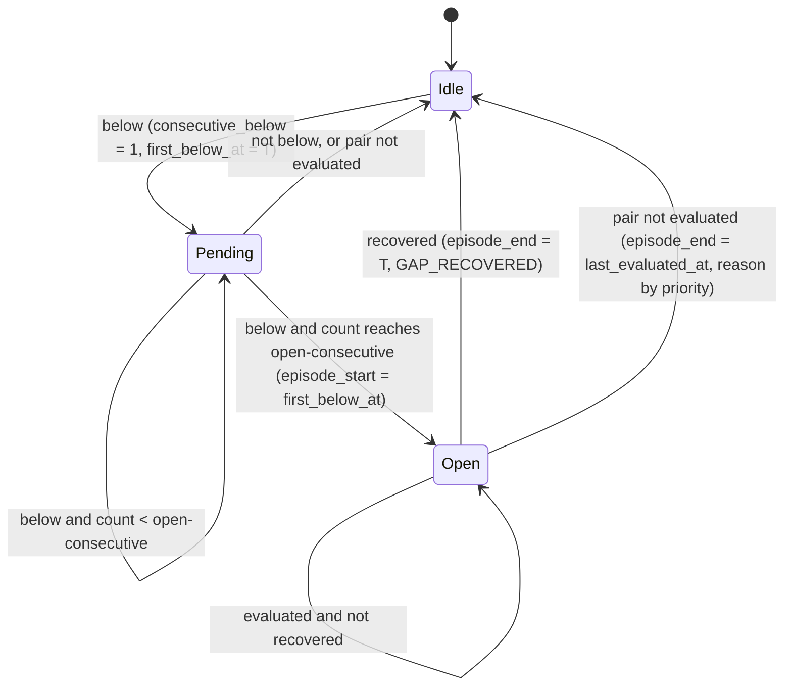

# Analytics

> Trạng thái: **Approved** · Cập nhật: 2026-09-28 · DOC-23
> Phụ thuộc: [DR](../00-decision-register.md) (DR-29…35, 41, 42, 57, 67, 68, 71), [DOC-09](../03-architecture/messaging-contracts.md) §6, [DOC-14](../05-data/warehouse-model.md) §5–9, [DOC-15](../05-data/ops-and-insight-model.md) §3, §6, [DOC-19](batch-and-chunk-processing.md) §2, §7, [DOC-20](etl-streaming.md) §8, [DOC-21](etl-gtfs-static.md) §6, [DOC-22](dlq-and-replay.md) §4, [DOC-25](source-simulator.md) §7
> Người dùng chính: module `analytics` và phần nối vào `etl` (P4-02…P4-07, P6-05), DOC-24 (triage đọc episode), DOC-32 (arrivals, insight API), DOC-33 (payload SSE), DOC-36 (màn hình), EXP-04 (C5)

Tài liệu này mô tả năm phân tích của hệ thống: phát hiện bunching, phát hiện gián đoạn, ETA lịch sử, OTP và bất thường ticketing. Với mỗi phân tích, tài liệu nêu dữ liệu vào, thuật toán (đủ để viết code và test mà không phải hỏi thêm), cách ghi kết quả, cách sinh cảnh báo và sự kiện UI, cách tính lại khi replay, cùng bộ test bắt buộc. Phần làm giàu bằng AI (category, `likely_cause`, gợi ý điều phối) nằm ở DOC-24.

Mọi quyết định mới trong tài liệu này được ghi là **Claude (Owner ủy quyền)** và tóm tắt ở §17.

## 1. Phạm vi

| Phân tích | Lớp chính | Chạy ở | Kích hoạt | Đọc | Ghi | Task |
| --- | --- | --- | --- | --- | --- | --- |
| Bunching | `BunchingDetector` | `etl-stream` | Sau micro-batch VehiclePosition; tick 30 giây | `fact_vehicle_position`, lịch GTFS, `route_headway_current` | `insight_bus_bunching`, `analytics_bunching_pair_state`, `analytics_bunching_cursor`, `alert_event` | P4-03 |
| Gián đoạn | `DisruptionDetector` | `etl-stream` | Sau micro-batch TripUpdate; tick 30 giây | `fact_trip_update` | `insight_service_disruption`, `analytics_route_baseline`, `analytics_baseline_snapshot`, `alert_event` | P4-04 |
| ETA lịch sử | `EtaAggregator` (job `EtaAggregationJob`) | `etl-batch` | Cron hằng giờ | `fact_trip_update` | `insight_eta_prediction`, `etl_checkpoint` | P4-05 |
| OTP | `OtpScorecardCalculator` (job `OtpScorecardJob`) | `etl-batch` | Cron 03:00 Chicago | `fact_trip_update` | `insight_otp_scorecard` | P4-06 |
| Bất thường ticketing | `TicketingAnomalyDetector` (job `TicketingAnomalyJob`) | `etl-batch` | Cron 5 phút | `fact_ticket_sales`, `dim_sale_point` | `insight_ticketing_anomaly`, `alert_event`, `etl_checkpoint` | P6-05 |
| Tính lại | `AnalyticsRecomputeService` (step `recomputeAnalytics`, job `AnalyticsRecomputeJob`) | `etl-batch` | Replay raw zone; `job_request` | Như trên | Như trên | P4-17 (ticketing: P6-05) |

Không thuộc tài liệu này:

- Làm giàu bằng AI và việc chuyển audience sang `ENGINEERING` (FR-09.5): DOC-24.
- Endpoint đọc insight: DOC-32. Riêng **công thức arrivals** (FR-06.2, FR-06.3) được định nghĩa ở §7.4 vì nó dùng trực tiếp kết quả ETA; DOC-32 tham chiếu tới đó.
- Fan-out SSE, ring buffer, lọc theo role: DOC-26. Payload chi tiết của từng loại sự kiện: DOC-33 (§10.3 ở đây chỉ nêu các trường bắt buộc).

### 1.1 Module và phụ thuộc (ADR-0014)

- Module Gradle `analytics` là **thư viện**. Nó chỉ phụ thuộc `common`, `spring-jdbc` (`JdbcClient`, `TransactionTemplate`), Caffeine và `uuid-creator`. Không phụ thuộc Spring Kafka hay Spring Batch.
- Module `etl` nối thư viện vào runtime:
  - Profile `stream`: `AnalyticsDispatcher`, `KafkaAnalyticsEventSink`, bean executor `analyticsExecutor` (DOC-20 §8).
  - Profile `batch`: định nghĩa `EtaAggregationJob`, `OtpScorecardJob`, `TicketingAnomalyJob`, `AnalyticsRecomputeJob` và step `recomputeAnalytics` của `RawZoneReplayJob`. Tasklet của các job này chỉ gọi service của `analytics`.
- Package gốc: `dev.pti.analytics`. Package con: `core`, `reference`, `bunching`, `disruption`, `eta`, `otp`, `ticketing`, `alert`, `event`, `recompute`.
- Mọi truy vấn chạy bằng DataSource chính của `etl` (user `etl_writer`, DOC-17). `etl_writer` có `SELECT, INSERT, UPDATE, DELETE` trên `insight.*` (trừ `insight_dispatch_suggestion`) và `U(title, body, severity, resolved_at)` trên `ops.alert_event`.
- `api` **không** phụ thuộc `analytics`. `api` chỉ đọc bảng `insight.*` và tự hiện thực câu SQL arrivals ở §7.4.

## 2. Quy ước chung

### 2.1 Thời gian

- **Event time ở mọi nơi** (DR-29). Khóa episode, bucket, cửa sổ và watermark đều theo event time. "Bây giờ" chỉ dùng ở ba chỗ: nhánh idle của watermark (§2.2), mốc `slot`/`hour`/`runDate` của job, và `resolved_at`/`created_at` của alert. "Bây giờ" luôn lấy từ bean `BusinessClock` (DR-67), không gọi `Instant.now()`.
- Múi giờ nghiệp vụ là `agency_timezone` của feed ACTIVE (`America/Chicago`). "Giờ địa phương", "thứ" (ISO, 1 = thứ Hai) và "ngày địa phương" đều tính trong múi này.
- **Giờ của ngày phục vụ** dùng khi tra headway, để khớp cách DOC-14 tính `route_headway.hour_of_day` (`(departure_seconds / 3600) % 24`):

  ```
  hourOfServiceDay(serviceDate, t) = floor((t − gtfs_time_to_ts(serviceDate, 0, tz)) / 3600) mod 24
  ```

  Java dùng `GtfsTime.toInstant` trong `common` (DOC-14 §11).
- **Arrival quan sát** là dòng `fact_trip_update` có `is_observed = true`, `schedule_relationship = 'SCHEDULED'` và `delay_seconds IS NOT NULL`. Thời điểm của nó là `observed_at = coalesce(arrival_time, departure_time)`.
- `fact_vehicle_position` và `fact_trip_update` phân vùng theo **ngày bắt đầu chuyến** (`service_date = payload.start_date`). Truy vấn theo khoảng thời gian `[a, b]` luôn lọc `service_date BETWEEN localDate(a) − 1 AND localDate(b)`, để có partition pruning mà không bỏ sót chuyến chạy qua nửa đêm.

### 2.2 Lưới đánh giá, con trỏ và watermark

Detector chạy liên tục (bunching, gián đoạn) chỉ đánh giá tại các **mốc lưới** cố định theo event time. Mỗi phạm vi có một **con trỏ** lưu trong DB là mốc cuối đã xử lý. Nhờ vậy kết quả không phụ thuộc vào cách dữ liệu được chia thành micro-batch, và chạy lại trên cùng dữ liệu cho cùng kết quả.

| Detector | Mốc lưới | Phạm vi con trỏ | Con trỏ lưu ở | Nguồn dẫn watermark |
| --- | --- | --- | --- | --- |
| Bunching | `T = k × 15s` tính từ epoch | `route_id` | `insight.analytics_bunching_cursor.last_tick` (bảng mới, §5.8) | VehiclePosition |
| Gián đoạn | Cuối bucket `e = k × 60s` | `(route_id, direction_id)` | `insight.analytics_route_baseline.last_bucket` | TripUpdate |
| Ticketing | Cuối cửa sổ `k × 15min` từ epoch | Toàn hệ thống | `ops.etl_checkpoint` khóa `analytics.ticketing-anomaly` | Lịch job (§9) |

Cửa sổ 15 phút tính từ epoch UTC cũng thẳng hàng với giờ Chicago, vì độ lệch của Chicago là số giờ tròn.

**Watermark** của một tuyến là mốc lớn nhất được phép đánh giá:

```
maxVp(r) = max(event_timestamp) FROM dw.fact_vehicle_position
           WHERE service_date IN (d − 1, d) AND route_id = r          -- index (service_date, route_id, event_timestamp)
maxTu(r) = max(event_timestamp) FROM dw.fact_trip_update
           WHERE service_date IN (d − 1, d) AND route_id = r          -- index (service_date, route_id)
           d = localDate(businessNow)

W_bunching(r)   = min(businessNow, max(maxVp(r) − bunching.allowed-lateness,   businessNow − bunching.idle-timeout))
W_disruption(r) = min(businessNow, max(maxTu(r) − disruption.allowed-lateness, businessNow − disruption.idle-timeout))
```

`maxVp` hoặc `maxTu` NULL (tuyến chưa có dữ liệu trong hai ngày) được coi là −∞, nên chỉ còn nhánh idle.

- **Nhánh idle** cho phép tuyến ngừng nhận dữ liệu vẫn đóng được episode (xe mất tín hiệu, hết chuyến). Nhánh này chỉ chạy cho tuyến còn trạng thái (§4.2).
- **Tiến con trỏ:** `advance(route)` xử lý lần lượt mọi mốc `g` với `cursor < g ≤ W`. Tuyến chưa có con trỏ bắt đầu ở `floorGrid(batch.minEventTs) − interval` của micro-batch đầu tiên.
- **Giới hạn đuổi theo:** nếu `W − cursor > max-catch-up`, con trỏ nhảy tới `floorGrid(W − max-catch-up)`. Nếu khoảng bị bỏ qua có dữ liệu nguồn (một câu `EXISTS`), tăng `pti_analytics_skipped_ticks_total{detector}` thêm số mốc bị bỏ và log `WARN`. Khoảng không có dữ liệu thì chỉ log `DEBUG`, vì bỏ qua nó không làm đổi trạng thái (§5.6, §6.3).
- **Dữ liệu trễ:** `AnalyticsDispatcher` so `batch.minEventTs` với con trỏ của mỗi tuyến trong micro-batch. Nếu `minEventTs ≤ cursor`, tăng `pti_analytics_late_batches_total{detector}` một lần cho micro-batch đó. Luồng trực tiếp **không** đánh giá lại mốc đã qua. Tính lại (§11) sửa kết quả.

**Điều kiện tái lập.** Kết quả tại mốc `g` chỉ phụ thuộc các dòng có event time ≤ `g` (cùng một khoảng nhìn lại cố định). Nếu mọi dòng như vậy đã được commit trước khi `g` được xử lý, thì kết quả trực tiếp trùng với kết quả tính lại. Hai metric trên bằng 0 nghĩa là điều kiện này được giữ. EXP-04 dùng chúng làm điều kiện hợp lệ của C5 (§11.6).

### 2.3 Định danh

Lớp `InsightIds` nằm trong `common` (vì `api` và `triage-worker` cũng cần tính id):

```java
package dev.pti.common.id;

/** Deterministic ids for analytics output (DR-29). Same natural key, same id, across replays. */
public final class InsightIds {
  /** UUIDv5(NAMESPACE_URL, "urn:pti:insight"). Never change: every stored id depends on it. */
  public static final UUID NAMESPACE = UUID.fromString("de46bd73-4eee-54a7-89f5-4aab7f289ad1");

  private static final DateTimeFormatter TS =
      DateTimeFormatter.ofPattern("yyyy-MM-dd'T'HH:mm:ss'Z'").withZone(ZoneOffset.UTC);

  public static UUID bunching(String routeId, String leader, String follower, Instant episodeStart) {
    return v5("bunching|" + routeId + "|" + leader + "|" + follower + "|" + TS.format(episodeStart));
  }
  public static UUID disruption(String routeId, int directionId, Instant episodeStart) {
    return v5("disruption|" + routeId + "|" + directionId + "|" + TS.format(episodeStart));
  }
  public static UUID ticketingAnomaly(String salePointId, Instant windowStart) {
    return v5("ticketing|" + salePointId + "|" + TS.format(windowStart));
  }
  public static UUID dispatchSuggestion(UUID bunchingId) {           // DOC-24
    return v5("dispatch|" + bunchingId);
  }
  public static UUID alert(String dedupKey) {
    return v5("alert|" + dedupKey);
  }

  private static UUID v5(String name) {
    return UuidCreator.getNameBasedSha1(NAMESPACE, name);            // UTF-8 bytes of name
  }
}
```

- Mọi mốc lưới là số giây tròn, nên định dạng tới giây là đủ và không mơ hồ.
- Unit test cố định hai giá trị: `bunching("18", "1234", "1250", 2026-09-29T21:19:30Z)` = `c69bcc55-ae25-5b9c-931c-e690e8e5220d`, và `alert("bunching:c69bcc55-ae25-5b9c-931c-e690e8e5220d")` = `fb899421-12d7-5369-ac3f-51d7b885dfcf`. Hai giá trị này được tính bằng `uuid.uuid5` của Python, nên test bắt được lỗi mã hóa.
- `batch_id` của kết quả:
  - Luồng trực tiếp: một UUIDv7 mới cho mỗi lần `advance` của một detector trên một tuyến. Giá trị này có trong log `analytics run finished` (§14.2), nên truy được lần chạy đã ghi dòng.
  - Job và tính lại: `batch_id` của step (`BatchIdStepListener`, DR-63).

### 2.4 Ghi kết quả

- Episode được **upsert theo `id`**. `ON CONFLICT (id) DO UPDATE` chỉ ghi các cột tính toán, cùng `batch_id` và `updated_at`. Cột làm giàu (`enrichment_*`, `data_issue_probability`, `likely_cause`, `cause_confidence`, `category*`, `severity*`, `model_version`, `enriched_at`) **không bao giờ** bị luồng analytics ghi đè, trừ quy tắc reset ở §9.6.
- Bảng tổng hợp (ETA, OTP) được **merge** theo khóa chính: upsert các khóa vừa tính, xóa các khóa trong phạm vi vừa tính mà không còn mẫu.
- Khi tính lại, dòng trong phạm vi tính lại mà không được tái tạo sẽ bị xóa, và alert tương ứng được đánh dấu đã xử lý (§11.2).

### 2.5 Khóa

Mỗi đơn vị việc giữ một advisory lock **mức transaction**:

```sql
SELECT pg_try_advisory_xact_lock(hashtextextended(:lockName, 0))   -- live
SELECT pg_advisory_xact_lock(hashtextextended(:lockName, 0))       -- jobs, recompute
```

| Đơn vị | `lockName` |
| --- | --- |
| Bunching một tuyến | `pti:analytics:bunching:<route_id>` |
| Gián đoạn một tuyến (cả hai chiều) | `pti:analytics:disruption:<route_id>` |
| ETA (toàn bảng) | `pti:analytics:eta` |
| OTP một ngày phục vụ | `pti:analytics:otp:<yyyy-MM-dd>` |
| Ticketing một cửa sổ | `pti:analytics:ticketing:<window_start ISO>` |

- Luồng trực tiếp dùng bản `try`. Không lấy được khóa thì bỏ qua lần chạy, ghi `outcome="skipped_locked"`. Lần kích hoạt sau (micro-batch kế tiếp hoặc tick 30 giây) sẽ làm tiếp từ con trỏ trong DB.
- Job và tính lại dùng bản chờ, với `SET LOCAL lock_timeout = '60s'`. Hết thời gian chờ thì ném lỗi, và Spring Batch xử lý như lỗi của step.
- Khóa và con trỏ nằm trong DB, nên nhiều pod `etl-stream` (P7) chạy cùng lúc vẫn an toàn mà không cần ShedLock. Pod thứ hai lấy được khóa sau pod đầu sẽ thấy con trỏ đã ở watermark và không làm gì.

### 2.6 Chế độ baseline

Container `etl-stream-baseline` (DOC-20 §9) đặt `pti.analytics.enabled=false`. Khi đó `AnalyticsDispatcher` không được tạo, vì bảng `exp_fact_*` không phải đầu vào của analytics.

## 3. Thành phần và interface

```java
package dev.pti.analytics.core;

public enum Detector { BUNCHING, DISRUPTION, ETA, OTP, TICKETING }

public enum Trigger { BATCH, TICK, RECOMPUTE, JOB }

public enum Outcome { OK, NOOP, SKIPPED_LOCKED, ERROR }

/** Result of one unit of analytics work. Events are published by the caller after commit. */
public record RunResult(
    Detector detector, String scope, Trigger trigger, Outcome outcome, UUID batchId,
    int gridPoints, int opened, int updated, int closed, int deleted,
    List<InsightEvent> events) {}

/** Detectors that advance per route along an event-time grid (bunching, disruption). */
public interface RouteDetector {
  Detector detector();

  /** False when the route's route_type is not in the detector's route-types. */
  boolean enabledFor(String routeId);

  /** Advances one route to its watermark in one transaction (REQUIRES_NEW). */
  RunResult advance(String routeId, Trigger trigger, @Nullable Instant sourceRecordTs,
                    @Nullable Instant committedAt);

  /** Routes that still hold state (open episodes, pending counters) and need the idle tick. */
  List<String> routesNeedingTick();

  /** Current cursor of a route, for the late-data check. */
  Optional<Instant> cursor(String routeId);
}
```

```java
package dev.pti.analytics.event;

/** A UI event produced by analytics; the envelope (ULID id, occurred_at) is added by the sink. */
public record InsightEvent(
    String type,                 // e.g. bunching.opened, alert.created
    String channel,              // alerts
    Audience audience,           // PUBLIC | OPERATIONS | ENGINEERING
    String key,                  // Kafka key: episode id or alert id
    @Nullable String routeId,
    @Nullable Instant sourceRecordTs,
    @Nullable Instant committedAt,
    Map<String, Object> data) {}

public interface AnalyticsEventSink {
  /** Best-effort; must never throw. */
  void publish(List<InsightEvent> events);
}
```

`KafkaAnalyticsEventSink` (module `etl`, cả hai profile) bọc sự kiện vào envelope DOC-09 §6 (`id` ULID, `occurred_at` giờ thật) và gửi lên `pti.events.ui` bằng producer UI đã có (DOC-20 §8). Gửi lỗi thì log `WARN` và tăng `pti_ui_events_publish_errors_total{type}`. Gửi được thì ghi `pti_ui_commit_to_publish_seconds{type}` = `publishTime − committedAt` khi `committedAt` khác null.

```java
package dev.pti.analytics.reference;

/** Schedule data analytics needs beyond ReferenceData (DOC-21 §6). One instance per feed version. */
public interface AnalyticsReferenceCache {
  long feedVersionId();
  ZoneId agencyZone();
  Optional<RouteInfo> route(String routeId);
  Optional<TripPattern> trip(String tripId);
  /** NULL headway (fewer than 2 trips that hour) is returned as empty. */
  OptionalInt scheduledHeadway(String routeId, int directionId, DayType dayType, int hourOfServiceDay);
  DayType dayType(LocalDate serviceDate);          // from dw.dim_date
}

public record RouteInfo(String routeId, int routeType, String label, Map<Integer, String> directionLabels) {}

/** Stop pattern of a trip. Times are GTFS seconds; absolute instants come from the fact row's service_date. */
public record TripPattern(String tripId, String routeId, int directionId, List<PatternStop> stops) {
  int indexOfSequence(int stopSequence);           // -1 when absent
}

public record PatternStop(int stopSequence, String stopId, int arrivalSeconds, int departureSeconds,
                          double dist, double lat, double lon) {}
```

Ghi chú cho `AnalyticsReferenceCache`:

- `TripPattern` không gắn với ngày. Giờ tuyệt đối của một stop được tính bằng `GtfsTime.toInstant(serviceDate, seconds, zone)` với `service_date` của dòng fact.
- `label` = `route_short_name`, nếu trống thì `route_id`. `directionLabels` = `direction_label` phổ biến nhất của các chuyến theo chiều đó (`gtfs_trip.direction_label`), nếu không có thì `"Direction 0"`/`"Direction 1"`.
- `dist` = `shape_dist_traveled` khi mọi stop của chuyến đều có giá trị (feed Metro Transit có đủ 100%). Nếu thiếu, dùng khoảng cách haversine cộng dồn giữa các stop, tính bằng mét. Vì `dist` chỉ dùng để nội suy theo tỉ lệ, đơn vị không quan trọng.
- Caffeine `LoadingCache<String routeId, RoutePatterns>`, nạp lười theo tuyến bằng một truy vấn `gtfs_trip_current` ⋈ `gtfs_stop_time_current` ⋈ `dim_stop_current`. Headway và `dim_date` (2024–2030) được nạp một lần. Khi `ReferenceData.feedVersionId()` đổi (DOC-21 §6), toàn bộ cache bị bỏ và nạp lại. Chuyến không có trong feed ACTIVE trả về empty.

## 4. Kích hoạt (DR-35)

### 4.1 Sau micro-batch

`MicroBatchCommitted` (DOC-20 §8) có thêm trường `committedAt` (giờ thật lúc commit), dùng cho `pti_analytics_dispatch_delay_seconds` và `pti_ui_commit_to_publish_seconds`.

```java
package dev.pti.etl.stream.analytics;

@Component
@Profile("stream")
@ConditionalOnProperty(name = "pti.analytics.enabled", havingValue = "true", matchIfMissing = true)
class AnalyticsDispatcher {

  @Async("analyticsExecutor")
  @EventListener
  void onBatch(MicroBatchCommitted e) {
    dispatchDelay.record(Duration.between(e.committedAt(), Instant.now()));    // real time
    for (RouteDetector d : detectorsFor(e.source())) {
      for (String routeId : e.routeIds()) {
        if (!d.enabledFor(routeId)) continue;                                   // route-types filter
        d.cursor(routeId).filter(c -> !e.minEventTs().isAfter(c))
            .ifPresent(c -> lateBatches.increment(d.detector()));               // once per batch, see below
        RunResult r = safeAdvance(d, routeId, Trigger.BATCH, e.minRecordTs(), e.committedAt());
        sink.publish(r.events());                                               // after commit
      }
    }
  }
}
```

| `source` của micro-batch | Detector được gọi |
| --- | --- |
| `GTFS_RT_VEHICLE_POSITION` | `BunchingDetector` |
| `GTFS_RT_TRIP_UPDATE` | `DisruptionDetector` |
| `TICKETING_SALES`, `TICKETING_SALE_POINTS` | Không (ticketing chạy theo job, §9) |

- `pti_analytics_late_batches_total` chỉ tăng một lần cho mỗi cặp (micro-batch, detector), dù nhiều tuyến trong micro-batch bị trễ.
- `safeAdvance` bắt mọi exception: log `ERROR` kèm `batch_id` của micro-batch, tăng `pti_analytics_runs_total{outcome="error"}`, rồi tiếp tục với tuyến sau. Lỗi analytics không bao giờ ảnh hưởng tới chunk hay offset (DR-35).
- Một micro-batch VehiclePosition thường chứa nhiều tuyến và tới mỗi giây. `advance` trả về ngay (`Outcome.NOOP`, không mở transaction ghi) khi `floorGrid(W) ≤ cursor`. Nhờ vậy mỗi tuyến chỉ thực sự được đánh giá khoảng 15 giây một lần.
- **Ngân sách thời gian (FR-05.1):** `pti_analytics_dispatch_delay_seconds` (từ commit tới lúc bắt đầu chạy) p95 < 2 giây. Một lần `advance` có việc: p95 < 100 ms (bunching) và < 50 ms (gián đoạn).

### 4.2 Tick

`AnalyticsDispatcher.tick()` chạy mỗi `pti.analytics.dispatcher.tick-interval` (30 giây) bằng `@Scheduled(fixedDelay)`. Nó chỉ đẩy việc vào `analyticsExecutor`, nên không chiếm thread của scheduler.

```
for d in [bunching, disruption]:
  for route in d.routesNeedingTick():            -- DB-driven
    r = safeAdvance(d, route, TICK, sourceRecordTs = null, committedAt = null)
    sink.publish(r.events)
```

| Detector | `routesNeedingTick()` |
| --- | --- |
| Bunching | `SELECT route_id FROM insight.analytics_bunching_pair_state UNION SELECT route_id FROM insight.insight_bus_bunching WHERE status = 'OPEN'` |
| Gián đoạn | `SELECT DISTINCT route_id FROM insight.analytics_route_baseline WHERE open_episode_id IS NOT NULL OR consecutive_high > 0 OR consecutive_low > 0` |

Mọi pod `etl-stream` đều chạy tick. Khóa ở §2.5 bảo đảm mỗi tuyến chỉ được xử lý bởi một pod tại một thời điểm.

### 4.3 Job

| Job | Tham số định danh | Tham số khác | Lịch | `@SchedulerLock` | Step |
| --- | --- | --- | --- | --- | --- |
| `EtaAggregationJob` | `runKey` (`scheduled:<hour ISO>` \| `manual:<requestId>`) | `hour` (mốc giờ, mặc định `floorHour(businessNow)`) | `0 5 * * * *` | `etaAggregation` (30 phút) | `aggregateEta` (tasklet CONTINUABLE, một tuyến mỗi lần gọi) |
| `OtpScorecardJob` | `runKey` (`scheduled:<runDate>` \| `manual:<requestId>`) | `serviceDates` (danh sách, mặc định `runDate − 1 … runDate − 3`) | `0 0 3 * * *` zone `America/Chicago` | `otpScorecard` (30 phút) | `computeOtp` (tasklet CONTINUABLE, một ngày mỗi lần gọi) |
| `TicketingAnomalyJob` | `slot` (mốc 5 phút theo giờ nghiệp vụ) | — | `0 */5 * * * *` | `ticketingAnomaly` (4 phút) | `detectTicketingAnomalies` (tasklet CONTINUABLE, một cửa sổ mỗi lần gọi) |
| `AnalyticsRecomputeJob` | `runKey` (`manual:<requestId>`) | `detectors`, `fromTs`, `toTs` | Chỉ qua `job_request` | Không | `recompute` (tasklet CONTINUABLE, §11.5) |

ETA và OTP chuyển từ tham số định danh `hour`/`serviceDate` sang `runKey`, theo mẫu của `GtfsStaticLoadJob`. Lý do: operator cần chạy lại cùng một giờ hoặc cùng một ngày (sau replay, sau khi đổi ngưỡng FR-08.2), mà `JobRequestPoller` từ chối instance đã `COMPLETE`. Lịch tự động vẫn dùng `scheduled:<…>`, nên cron bắn hai lần vẫn chỉ chạy một lần. DOC-19 §2 được cập nhật theo bảng này.

## 5. Phát hiện bunching (DR-30, FR-05)

### 5.1 Định nghĩa

- **Bunching** xảy ra khi hai xe cùng tuyến, cùng chiều chạy sát nhau hơn nhiều so với headway theo lịch. Episode được theo dõi cho từng **cặp** (leader L, follower F): L là xe đi trước, F là xe ngay sau.
- **Gap** của cặp tại mốc `T` là khoảng thời gian giữa lúc L đi qua **trạm kế tiếp của F** (`s_F`) và lúc F dự kiến tới trạm đó:

  ```
  gap(T) = (t_F + remaining_F) − pass_L(s_F)
  ```

  - `t_F`: event time của vị trí mới nhất của F (≤ `T`).
  - `remaining_F`: thời gian theo lịch F còn cần để tới `s_F` (§5.2). Bằng 0 khi F đang đỗ ở `s_F`.
  - `pass_L(s_F)`: thời điểm L đi qua `s_F`, lấy từ lịch sử vị trí của L (§5.3).
- Gap được làm tròn tới giây (`Math.round`) và so với `H` = headway theo lịch của `(route, direction, day_type, hourOfServiceDay)`.

**Điều chỉnh so với DR-30** (Claude, Owner ủy quyền): DR-30 lấy thời điểm L đi qua trạm từ TripUpdate quan sát, và dự phòng bằng khoảng cách chia tốc độ trung bình. Tài liệu này lấy thời điểm đó từ **lịch sử VehiclePosition của L** (quan sát trực tiếp, mỗi 5 giây), và dự phòng bằng nội suy theo lịch. Lý do:

1. Dòng `fact_trip_update` bị ghi đè liên tục (`event_timestamp` đổi mỗi 30 giây), nên không biết được một arrival đã có trong DB từ lúc nào. Kết quả trực tiếp và kết quả tính lại vì thế có thể khác nhau khi TripUpdate tới trễ. VehiclePosition là bất biến theo khóa `(vehicle_id, event_timestamp)`, nên watermark chỉ cần một nguồn và tái lập được (§2.2).
2. Watermark chỉ phụ thuộc VehiclePosition (5 giây mỗi xe), nên độ trễ phát hiện nhỏ và đều. TripUpdate của tuyến ít chuyến có thể cách nhau tới 30 giây.
3. Sai số của thời điểm đi qua là ±5 giây, rất nhỏ so với ngưỡng `0,5 × H` (ít nhất 2,5 phút với `H` ≥ 5 phút).

Công thức mở và đóng, số lần đánh giá liên tiếp, việc loại hai trạm đầu và hai trạm cuối, và phạm vi chỉ áp cho bus giữ nguyên như DR-30.

### 5.2 Vị trí trên tuyến

Với một vị trí `v` của xe trên chuyến có mẫu `P` (`AnalyticsReferenceCache.trip`):

- `idx(v) = P.indexOfSequence(v.current_stop_sequence)`. Trạm tại `idx(v)` là trạm xe đang đỗ (`STOPPED_AT`) hoặc đang tới (`INCOMING_AT`, `IN_TRANSIT_TO`). Không tìm thấy thì vị trí không dùng được (lý do `unknown_trip`).
- **Tiến độ** `d(v)`, cùng đơn vị với `PatternStop.dist`:

```
if v.current_status == STOPPED_AT or idx(v) == 0:
  d = P.stops[idx].dist
else:
  prev = P.stops[idx − 1]; next = P.stops[idx]
  a = haversine(prev, v); b = haversine(v, next)
  frac = (a + b == 0) ? 1 : a / (a + b)
  d = prev.dist + frac × (next.dist − prev.dist)
```

- **Giờ theo lịch tại tiến độ `x`** trên chuyến `P` (giây GTFS):

```
schedT(P, x):
  x = clamp(x, P.stops[0].dist, P.stops[n−1].dist)
  find i with P.stops[i].dist ≤ x ≤ P.stops[i+1].dist      (first such i)
  span = P.stops[i+1].dist − P.stops[i].dist
  if span == 0: return P.stops[i+1].arrivalSeconds
  return P.stops[i].departureSeconds
         + (x − P.stops[i].dist) / span × (P.stops[i+1].arrivalSeconds − P.stops[i].departureSeconds)
```

- `remaining_F = (F đỗ ở s_F) ? 0 : max(0, P_F.stops[idx(F)].arrivalSeconds − schedT(P_F, d(F)))`.

### 5.3 Thời điểm một xe đi qua một trạm

`hist(V)`: các vị trí của xe `V` **trên chuyến hiện tại của nó** (`trip_id` bằng `trip_id` của vị trí mới nhất), event time trong `[T − leader-lookback, T]`, sắp tăng dần. "V đã tới trạm `s`" tại vị trí `u` khi:

```
j(V, s) = largest index j ≤ idx(u) with P_V.stops[j].stopId == s        (none → not reached)
reached(u, s) = idx(u) > j(V, s)  or  (idx(u) == j(V, s) and u.current_status == STOPPED_AT)
```

Chọn `j` lớn nhất để tuyến vòng (một trạm xuất hiện hai lần) lấy lần đi qua gần nhất.

```
passTime(V, s):
  k = first u in hist(V) with reached(u, s)
  if k is None: return None
  if k.current_status == STOPPED_AT and idx(k) == j(V, s):
    return (k.event_timestamp, OBSERVED)
  p = element of hist(V) just before k
  if p exists and d(k) > d(p):
    target = P_V.stops[j(V, s)].dist
    ratio  = clamp((target − d(p)) / (d(k) − d(p)), 0, 1)
    return (p.event_timestamp + ratio × (k.event_timestamp − p.event_timestamp), OBSERVED)
  // no position before the passage inside the look-back: estimate from the schedule
  back = max(0, schedT(P_V, d(k)) − schedT(P_V, P_V.stops[j(V, s)].dist))
  return (k.event_timestamp − back, ESTIMATED)
```

Kết quả `pass < T − leader-lookback` được coi là không có. `source` (`OBSERVED`/`ESTIMATED`) chỉ dùng cho metric `pti_analytics_bunching_evaluations_total{result="evaluated", reason=<source>}`.

### 5.4 Đánh giá tại một mốc

```
evaluateTick(route, T):
  active = for each vehicle: its newest position with event_timestamp in (T − position-max-age, T]
           (vehicles of this route, both directions)
  evaluations = []
  for F in active (sorted by vehicle_id):
    P_F = trip(F); if P_F is None or idx(F) < 0: count(unknown_trip); continue
    n = |P_F.stops|; i = idx(F); s = P_F.stops[i].stopId
    if i < exclude-first-stops: count(first_stops); continue
    if i > n − 1 − exclude-last-stops: count(last_stops); continue
    H = scheduledHeadway(route, F.direction_id, dayType(F.service_date), hourOfServiceDay(F.service_date, T))
    if H is empty: count(no_headway); continue
    if H > max-headway: count(headway_too_long); continue
    candidates = []
    for V in active, V ≠ F, V.direction_id == F.direction_id:
      P_V = trip(V); if P_V is None or idx(V) < 0: continue
      if idx(V) > |P_V.stops| − 1 − exclude-last-stops: continue          // leader about to finish
      pv = passTime(V, s); if pv is None: continue
      candidates.add((V, pv))
    if candidates empty: count(no_leader); continue
    (L, pass) = candidate with the largest pass time; ties → smaller vehicle_id
    gap = round((F.event_timestamp + remaining_F) − pass.time)
    evaluations.add(Evaluation(L, F, L.trip_id, F.trip_id, F.direction_id, s, gap, H))
  return evaluations, active
```

- Chỉ tuyến có `route_type` thuộc `bunching.route-types` (mặc định `[3]`, bus) mới được đánh giá (FR-05.2). 124 tuyến bus của feed thuộc nhóm này. Ba tuyến rail (901, 902, 906) thì không.
- Mỗi follower có tối đa một leader, nên mỗi mốc có tối đa một đánh giá cho mỗi xe.
- Headway là giá trị tại **mốc hiện tại**. Episode lưu `scheduled_headway_seconds` và `threshold_seconds` của lúc mở, để hiển thị.

### 5.5 Máy trạng thái của một cặp

Trạng thái của cặp nằm ở `analytics_bunching_pair_state`, episode đang mở ở `insight_bus_bunching`. Với `H` là headway tại mốc đánh giá:

- `below` ⇔ `gap < open-ratio × H` (so sánh chặt, số thực).
- `recovered` ⇔ `gap > close-ratio × H` (so sánh chặt).



```
applyTick(T, evaluations, active):
  seen = {}
  for E in evaluations:
    key = (E.L, E.F); st = state[key]
    if st exists and (st.trip_leader, st.trip_follower) != (E.tripL, E.tripF):
      finish(st, PAIR_CHANGED)                          // same vehicles, new trips: a new pair
      st = None
    seen.add(key)
    if st is Open:
      ep = episode(st); ep.last_gap = E.gap; ep.min_gap = min(ep.min_gap, E.gap)
      ep.evaluation_count += 1; ep.last_evaluated_at = T; st.last_evaluated_at = T
      if E.gap > close-ratio × E.H: close(ep, end = T, GAP_RECOVERED); delete st
    else if E.gap < open-ratio × E.H:
      if st is None: st = new(consecutive_below = 0, first_below_at = T, pending_min_gap = E.gap,
                              pending_stop_id = E.s, trips = (E.tripL, E.tripF))
      st.consecutive_below += 1; st.pending_min_gap = min(st.pending_min_gap, E.gap)
      st.last_evaluated_at = T
      if st.consecutive_below >= open-consecutive:
        open(id = InsightIds.bunching(route, L, F, st.first_below_at), start = st.first_below_at,
             H = E.H, threshold = floor(open-ratio × E.H), min_gap = st.pending_min_gap, last_gap = E.gap,
             open_stop_id = st.pending_stop_id, evaluation_count = st.consecutive_below, last_evaluated_at = T)
    else:
      delete st                                          // pending counter resets
  for st in state where key not in seen:
    if st is Open: finish(st, reasonFor(st, T, evaluations, active))
    else delete st

reasonFor(st, T, evaluations, active):
  if st.L not in active or st.F not in active: return SIGNAL_LOST
  if trip changed for L or F, or F was evaluated with another leader, or F had no_leader: return PAIR_CHANGED
  return OUT_OF_ZONE                                     // zone, headway, unknown trip

finish(st, reason): close(episode(st), end = st.last_evaluated_at, reason); delete st
```

- Một xe có thể vừa là follower trong cặp này vừa là leader trong cặp khác. Ba xe dồn cục cho hai episode.
- Khi F vượt L, cặp `(L, F)` đóng với `PAIR_CHANGED` và cặp `(F, L)` bắt đầu đếm từ đầu.
- `episode_end` của một cặp không còn được đánh giá là `last_evaluated_at`, tức mốc cuối cùng mà hai xe còn được quan sát cạnh nhau. Nhờ vậy độ dài episode không phụ thuộc vào `position-max-age`.

### 5.6 `advance`

```
BunchingDetector.advance(route, trigger, sourceRecordTs, committedAt):
  if not enabledFor(route): return NOOP
  W = W_bunching(route); last = floor(W, 15s)                       // read-only, outside the write transaction
  c = cursor(route)
  if c is not None and last <= c: return NOOP
  tx REQUIRES_NEW, statement_timeout 20s:
    if not pg_try_advisory_xact_lock('pti:analytics:bunching:' + route): return SKIPPED_LOCKED
    c = SELECT last_tick FROM insight.analytics_bunching_cursor WHERE route_id = :route   // re-read under lock
    if c is None: c = floor(batchMinEventTs ?: last, 15s) − 15s
    if last <= c: return NOOP
    if last − c > max-catch-up: c = skip(c, last − max-catch-up)       // §2.2
    rows  = load positions: route, event_timestamp in (c + 15s − leader-lookback − position-max-age, last]
    state = load pair_state rows and their OPEN episodes
    for T = c + 15s; T <= last; T += 15s:
      (evaluations, active) = evaluateTick(route, T) over rows
      applyTick(T, evaluations, active)
    persist changed episodes (upsert §2.4), pair_state (upsert / delete), cursor = last
    write alerts for opened and closed episodes (§10)
  publish events after commit
```

Truy vấn vị trí:

```sql
SELECT vehicle_id, event_timestamp, service_date, trip_id, direction_id, lat, lon,
       current_stop_sequence, current_status
FROM dw.fact_vehicle_position
WHERE service_date BETWEEN :fromDate AND :toDate
  AND route_id = :routeId
  AND event_timestamp > :from AND event_timestamp <= :to
ORDER BY vehicle_id, event_timestamp
```

Khoảng nhìn lại 30 phút của một tuyến nhiều chuyến (khoảng 10 xe × 360 vị trí) là khoảng 3.600 dòng, đọc bằng index `(service_date, route_id, event_timestamp)`. Mỗi tuyến được đánh giá khoảng 15 giây một lần, tức khoảng 8 lần `advance` có việc mỗi giây cho toàn mạng lưới.

### 5.7 Ghi episode

```sql
INSERT INTO insight.insight_bus_bunching AS b (
  id, route_id, direction_id, vehicle_leader, vehicle_follower, trip_leader, trip_follower,
  episode_start, episode_end, status, close_reason, scheduled_headway_seconds, threshold_seconds,
  min_gap_seconds, last_gap_seconds, open_stop_id, evaluation_count, last_evaluated_at, batch_id)
VALUES (
  :id, :route_id, :direction_id, :vehicle_leader, :vehicle_follower, :trip_leader, :trip_follower,
  :episode_start, :episode_end, :status, :close_reason, :scheduled_headway_seconds, :threshold_seconds,
  :min_gap_seconds, :last_gap_seconds, :open_stop_id, :evaluation_count, :last_evaluated_at, :batch_id)
ON CONFLICT (id) DO UPDATE SET
  trip_leader = excluded.trip_leader, trip_follower = excluded.trip_follower,
  episode_end = excluded.episode_end, status = excluded.status, close_reason = excluded.close_reason,
  scheduled_headway_seconds = excluded.scheduled_headway_seconds, threshold_seconds = excluded.threshold_seconds,
  min_gap_seconds = excluded.min_gap_seconds, last_gap_seconds = excluded.last_gap_seconds,
  open_stop_id = excluded.open_stop_id, evaluation_count = excluded.evaluation_count,
  last_evaluated_at = excluded.last_evaluated_at, batch_id = excluded.batch_id, updated_at = now()
```

Cột `enrichment_*` không có trong câu lệnh. Chúng giữ giá trị mặc định khi insert và giá trị của triage-worker khi update.

### 5.8 Thay đổi schema (V7)

Các thay đổi sau được đưa vào `V7__insight.sql` ở DOC-15 §6. V7 chưa chạy ở môi trường nào, nên sửa thẳng file:

```sql
-- insight_bus_bunching: why an episode closed.
close_reason TEXT NULL CHECK (close_reason IN ('GAP_RECOVERED', 'PAIR_CHANGED', 'SIGNAL_LOST', 'OUT_OF_ZONE')),
CHECK ((status = 'CLOSED') = (close_reason IS NOT NULL)),

-- analytics_bunching_pair_state: trips of the pair and the pending episode's values.
trip_leader             TEXT NOT NULL,
trip_follower           TEXT NOT NULL,
pending_min_gap_seconds INT  NULL,
pending_stop_id         TEXT NULL,

-- Event-time cursor of the bunching detector (DOC-23 §2.2).
CREATE TABLE insight.analytics_bunching_cursor (
  route_id   TEXT        PRIMARY KEY,
  last_tick  TIMESTAMPTZ NOT NULL CHECK (extract(epoch FROM last_tick)::bigint % 15 = 0),
  updated_at TIMESTAMPTZ NOT NULL DEFAULT now()
);
```

## 6. Phát hiện gián đoạn (DR-31, FR-07)

### 6.1 Dữ liệu vào

Bucket `b` có cuối `e` (bội số của 1 phút) và đầu `e − 1m`. **Giá trị hiện tại** của bucket là trung bình `delay_seconds` của các arrival quan sát trong **cửa sổ trượt 10 phút** kết thúc ở `e`:

```
samples(r, dir, e) = arrival quan sát (§2.1) của (route r, direction dir) có observed_at ∈ [e − window, e)
n = |samples|;  x = mean(delay_seconds)          (số thực)
```

`advance` đọc một lần mọi arrival cần cho các bucket sắp xử lý, rồi trượt cửa sổ trong bộ nhớ:

```sql
SELECT direction_id, stop_id, coalesce(arrival_time, departure_time) AS observed_at, delay_seconds
FROM dw.fact_trip_update
WHERE service_date BETWEEN :fromDate AND :toDate
  AND route_id = :routeId
  AND is_observed AND schedule_relationship = 'SCHEDULED' AND delay_seconds IS NOT NULL
  AND coalesce(arrival_time, departure_time) >= :from          -- first bucket end − window
  AND coalesce(arrival_time, departure_time) <  :to            -- last bucket end
```

Chỉ tuyến có `route_type` thuộc `disruption.route-types` (mặc định `[0, 3]`: bus và light rail) được xử lý.

### 6.2 Trạng thái và công thức

Trạng thái của `(route, direction)` nằm ở `analytics_route_baseline`: `ewma_mean` (μ), `ewma_var` (var), `bucket_count`, `last_bucket`, `consecutive_high`, `consecutive_low`, `open_episode_id`.

```
σ     = sqrt(var)
σ_eff = max(σ, sigma-floor)                           // sigma-floor = 30 s
z     = (x − μ) / σ_eff                               // against the baseline BEFORE this bucket's update
update(x):  diff = x − μ;  μ = μ + α·diff;  var = (1 − α)·(var + α·diff²);  bucket_count += 1
```

`α = 0,1`. Công thức cập nhật variance là dạng EWMA chuẩn của DR-31 (FR-07.1).

### 6.3 Xử lý một bucket

```
processBucket(st, e, n, x, stopsInWindow):
  if n < min-samples:                                         // no-data bucket
    st.consecutive_high = 0
    if st.open: st.consecutive_low += 1; checkClose(st, e, NO_DATA)
    st.last_bucket = e; return
  if st.bucket_count == 0:                                    // first data bucket initialises the baseline
    st.μ = x; st.var = 0; st.bucket_count = 1; st.last_bucket = e; return
  z = (x − st.μ) / max(sqrt(st.var), sigma-floor)
  if st.open:
    ep.current_avg = x; ep.current_z = z; ep.sample_count = n; ep.last_bucket = e
    if z > ep.peak_z: ep.peak_z = z; ep.peak_avg = x
    ep.affected_stops ∪= stops in window with delay ≥ ep.baseline_mean + open-z × σ_eff(ep)   // cap 100
    if z < close-z: st.consecutive_low += 1 else: st.consecutive_low = 0
    checkClose(st, e, RECOVERED)
    if still open and e − ep.episode_start >= max-episode-duration:
      close(ep, end = e, MAX_DURATION); st.μ = x                // re-seed; var and bucket_count kept
    st.last_bucket = e; return                                  // baseline frozen while open
  if st.bucket_count >= warm-up-buckets and z > open-z:
    st.consecutive_high += 1                                    // outlier: baseline NOT updated
    if st.consecutive_high >= open-consecutive:
      start = e − open-consecutive × bucket                     // start of the first qualifying bucket
      open(id = InsightIds.disruption(route, dir, start), start, baseline_mean = st.μ,
           baseline_stddev = sqrt(st.var), current = peak = (x, z), sample_count = n,
           affected_stops = stops with delay ≥ st.μ + open-z × σ_eff, last_bucket = e)
      st.consecutive_high = 0; st.consecutive_low = 0
  else:
    st.consecutive_high = 0
    update(x)
  st.last_bucket = e

checkClose(st, e, reason):                                    // reason = kind of the closing bucket
  if st.consecutive_low >= close-consecutive:
    close(ep, end = e, reason)
    st.consecutive_low = 0; st.open_episode_id = null
```

Quy tắc chốt (Claude, Owner ủy quyền):

- **Bucket không đủ mẫu** (n < 5) không cập nhật baseline và làm `consecutive_high` về 0, vì hai bucket cao phải liên tiếp. Khi đang có episode, bucket này được tính là "thấp", để tuyến mất dữ liệu vẫn đóng được episode. Lý do đóng là `NO_DATA` khi chính bucket làm episode đóng không đủ mẫu, và `RECOVERED` trong trường hợp còn lại. Quy tắc chỉ nhìn bucket cuối nên không cần lưu thêm trạng thái, và cho cùng kết quả dù chuỗi bucket được xử lý trong một hay nhiều lần `advance`.
- **z luôn so với baseline trước khi cập nhật.** Bucket có z > 2,5 sau warm-up không cập nhật baseline, kể cả khi chưa đủ hai bucket để mở episode. Điều này tránh việc bucket bất thường đầu tiên kéo baseline lên và làm bucket thứ hai không còn vượt ngưỡng.
- **Trong warm-up** (`bucket_count < 60`), mọi bucket đủ mẫu đều cập nhật baseline và không bao giờ mở episode.
- **Khi đang có episode**, baseline đóng băng, kể cả ở bucket làm episode đóng. Bucket đủ mẫu đầu tiên sau khi đóng cập nhật baseline như bình thường.
- **Episode dài quá 3 giờ** được đóng với `MAX_DURATION`, và μ được đặt lại bằng giá trị hiện tại. Đây là cách xử lý khi mức trễ mới đã thành "bình thường" (ví dụ đổi lộ trình cả buổi). Nếu không làm vậy, baseline đóng băng sẽ giữ episode mở mãi.
- `bucket_count` chỉ tăng khi baseline được cập nhật.
- `affected_stop_ids` là hợp các trạm có ít nhất một mẫu vượt `baseline_mean + open-z × σ_eff` trong các bucket của episode. Mảng được sắp theo `stop_id` và giữ tối đa 100 phần tử đầu.
- Hai chiều của một tuyến độc lập. Hai chiều có thể mở episode trong cùng một bucket, tạo hai dòng khác id (UNIQUE `(route_id, direction_id, episode_start)`).

### 6.4 `advance` và snapshot

```
DisruptionDetector.advance(route, trigger, sourceRecordTs, committedAt):
  if not enabledFor(route): return NOOP
  W = W_disruption(route); last = floor(W, 1m)
  tx REQUIRES_NEW, statement_timeout 20s:
    if not pg_try_advisory_xact_lock('pti:analytics:disruption:' + route): return SKIPPED_LOCKED
    for dir in (0, 1):
      st = SELECT … FROM insight.analytics_route_baseline WHERE (route_id, direction_id) = (:route, :dir)
      if st is None: st = new(μ = 0, var = 0, bucket_count = 0, last_bucket = floor(batchMinEventTs ?: last, 1m) − 1m)
    c = min(st0.last_bucket, st1.last_bucket)
    if last <= c: return NOOP
    apply max-catch-up (§2.2)
    arrivals = query §6.1 for [c + 1m − window, last)
    for e = c + 1m; e <= last; e += 1m:
      for dir in (0, 1) where st[dir].last_bucket < e:
        processBucket(st[dir], e, …)
        if e is a whole hour (UTC): upsert snapshot(snapshot_hour = e, st[dir])
    persist baseline rows, episodes (upsert §2.4), alerts (§10)
  publish events after commit
```

- Snapshot là **trạng thái sau khi xử lý bucket kết thúc đúng mốc giờ**. Snapshot mốc 13:00 phản ánh mọi bucket có cuối ≤ 13:00. `INSERT … ON CONFLICT (snapshot_hour, route_id, direction_id) DO UPDATE`, nên tính lại ghi đè được snapshot cũ.
- Tuyến im lặng qua nhiều giờ không có snapshot cho những giờ đó. Snapshot trước khoảng im lặng vẫn là điểm xuất phát đúng, vì bucket không đủ mẫu không làm đổi μ và var (§11.4).

### 6.5 Ghi episode và thay đổi schema

- Câu upsert theo mẫu §5.7, ghi các cột: `baseline_mean_seconds`, `baseline_stddev_seconds`, `current_avg_delay_seconds`, `current_z_score`, `peak_avg_delay_seconds`, `peak_z_score`, `sample_count`, `affected_stop_ids`, `last_bucket`, `episode_end`, `status`, `close_reason`, `batch_id`, `updated_at`. Số được làm tròn theo kiểu cột (`NUMERIC(8,1)`, `NUMERIC(6,2)`), kiểu half-up của `BigDecimal`.
- Không ghi `data_issue_probability`, `likely_cause`, `cause_confidence`, `model_version`, `enriched_at`, `enrichment_*` (DOC-24).
- Thêm vào V7 (DOC-15 §6):

```sql
-- insight_service_disruption: why an episode closed.
close_reason TEXT NULL CHECK (close_reason IN ('RECOVERED', 'NO_DATA', 'MAX_DURATION')),
CHECK ((status = 'CLOSED') = (close_reason IS NOT NULL)),
```

## 7. ETA lịch sử (DR-32, FR-06)

### 7.1 Tổng hợp

Mỗi lần chạy có một mốc giờ `H` (tham số `hour`, mặc định `floorHour(businessNow)`). Cửa sổ là `[H − 28d, H)` theo `observed_at`. Nhóm theo **thứ và giờ địa phương của giờ theo lịch** (`scheduled_arrival`), vì khi đọc (§7.4) khóa tra cứu là giờ theo lịch của chuyến sắp tới.

Mỗi tuyến chạy một câu lệnh, trong transaction riêng:

```sql
-- eta_aggregate_route.sql
WITH obs AS (
  SELECT stop_id,
         extract(isodow FROM scheduled_arrival AT TIME ZONE :tz)::smallint AS day_of_week,
         extract(hour   FROM scheduled_arrival AT TIME ZONE :tz)::smallint AS hour_of_day,
         delay_seconds
  FROM dw.fact_trip_update
  WHERE service_date BETWEEN :fromDate AND :toDate              -- localDate(H − 28d) − 1 .. localDate(H)
    AND route_id = :routeId
    AND is_observed AND schedule_relationship = 'SCHEDULED'
    AND delay_seconds IS NOT NULL AND scheduled_arrival IS NOT NULL
    AND coalesce(arrival_time, departure_time) >= :windowFrom   -- H − 28d
    AND coalesce(arrival_time, departure_time) <  :windowTo     -- H
),
agg AS (
  SELECT stop_id, day_of_week, hour_of_day,
         round(avg(delay_seconds), 1)                                     AS avg_delay_seconds,
         percentile_disc(0.5) WITHIN GROUP (ORDER BY delay_seconds)       AS median_delay_seconds,
         percentile_disc(0.9) WITHIN GROUP (ORDER BY delay_seconds)       AS p90_delay_seconds,
         count(*)::int                                                    AS sample_count
  FROM obs
  GROUP BY stop_id, day_of_week, hour_of_day
),
upserted AS (
  INSERT INTO insight.insight_eta_prediction AS p (
    route_id, stop_id, day_of_week, hour_of_day, avg_delay_seconds, median_delay_seconds,
    p90_delay_seconds, sample_count, window_start, window_end, computed_at, batch_id)
  SELECT :routeId, stop_id, day_of_week, hour_of_day, avg_delay_seconds, median_delay_seconds,
         p90_delay_seconds, sample_count, :windowStart, :windowEnd, :computedAt, :batchId
  FROM agg
  ON CONFLICT (route_id, stop_id, day_of_week, hour_of_day) DO UPDATE SET
    avg_delay_seconds = excluded.avg_delay_seconds, median_delay_seconds = excluded.median_delay_seconds,
    p90_delay_seconds = excluded.p90_delay_seconds, sample_count = excluded.sample_count,
    window_start = excluded.window_start, window_end = excluded.window_end,
    computed_at = excluded.computed_at, batch_id = excluded.batch_id
  RETURNING 1
)
DELETE FROM insight.insight_eta_prediction p
WHERE p.route_id = :routeId
  AND NOT EXISTS (SELECT 1 FROM agg a
                  WHERE (a.stop_id, a.day_of_week, a.hour_of_day) = (p.stop_id, p.day_of_week, p.hour_of_day))
```

- `round(numeric, 1)` làm tròn half away from zero. `percentile_disc` trả về một giá trị có thật trong mẫu, nên median và p90 là số nguyên.
- `window_start` = `localDate(H − 28d)`, `window_end` = `localDate(H − 1s)`, `computed_at` = `H`.
- Danh sách tuyến: `SELECT route_id FROM dw.dim_route_current UNION SELECT DISTINCT route_id FROM insight.insight_eta_prediction`. Tuyến không còn trong feed vẫn được chạy, và câu `DELETE` xóa sạch các dòng của nó.
- Không lọc `route_type`: ETA áp cho mọi tuyến.

### 7.2 Job `EtaAggregationJob`

```
step aggregateEta (tasklet, RepeatStatus.CONTINUABLE):
  first call:
    wm = SELECT count(*) || '|' || coalesce(max(coalesce(arrival_time, departure_time))::text, '-')
         FROM dw.fact_trip_update
         WHERE service_date BETWEEN localDate(H) − 1 AND localDate(H) AND is_observed
    if not force and wm == etl_checkpoint['analytics.eta'].watermark: exit NOOP (ExitStatus "NOOP")
    ctx['pti.eta.routes'] = route list (sorted); ctx['pti.eta.index'] = 0; ctx['pti.eta.watermark'] = wm
  each call (one transaction):
    pg_advisory_xact_lock('pti:analytics:eta')
    run eta_aggregate_route.sql for routes[index]; index += 1
    if index == |routes|:
      upsert etl_checkpoint('analytics.eta', watermark = wm, watermark_ts = H, job_execution_id)
      return FINISHED
    return CONTINUABLE
```

- `force = true` khi job được gọi từ tính lại (§11) hoặc khi `job_request` có tham số `force=true`.
- Mỗi lần gọi xử lý một tuyến (dưới 1 giây với 28 ngày dữ liệu của một tuyến), nên an toàn với `stale-after` 2 phút (DOC-19 §7.2). Restart tiếp tục từ `pti.eta.index`.
- Watermark chỉ để bỏ qua lần chạy khi **không có dữ liệu mới**. Trong trường hợp đó, cửa sổ chỉ trượt mất một giờ dữ liệu cũ nhất, và sai khác này được bù ở lần chạy có dữ liệu kế tiếp.

### 7.3 Mức tin cậy

Mức tin cậy không lưu trong bảng. `api` suy ra khi đọc:

| `sample_count` | `confidence` |
| --- | --- |
| Không có dòng | `NONE` |
| `< eta.confidence.medium-min` (10) | `LOW` |
| `10 … < eta.confidence.high-min` (30) | `MEDIUM` |
| `≥ 30` | `HIGH` |

### 7.4 Công thức arrivals (`GET /stops/{id}/arrivals`, FR-06.2, FR-06.3)

`api` hiện thực công thức này (DOC-32). Đầu vào: `stopId`, `N = businessNow`, `limit` (mặc định `eta.arrivals.default-limit` = 10), `horizon` (mặc định `eta.arrivals.horizon` = 90 phút). Múi giờ và feed là của feed ACTIVE.

1. **Ứng viên:** mỗi `(service_date, trip)` với `service_date ∈ {localDate(N) − 1, localDate(N)}`, chuyến chạy ngày đó (`dw.service_ids_on`), có stop time tại `stopId` với `pickup_type <> 1`. `scheduled = gtfs_time_to_ts(service_date, arrival_seconds, tz)` phải thuộc `[N − 30 phút, N + horizon]`.
2. **Loại bỏ:** chuyến đã có dòng `fact_trip_update` cho `(service_date, trip_id, stop_sequence)` với `is_observed = true` (xe đã tới) hoặc `schedule_relationship = 'SKIPPED'`.
3. **ETA lịch sử:** tra `insight_eta_prediction` theo `(route_id, stopId, isodow(scheduled local), hour(scheduled local))`. Có dòng thì `predictedArrival = scheduled + round(avg_delay_seconds)` giây (half-up), `sampleCount = sample_count`, `confidence` theo §7.3. Không có dòng thì `predictedArrival = scheduled`, `sampleCount = 0`, `confidence = NONE`.
4. **Realtime (FR-06.3, F-ANL-06):** chỉ khi `pti.analytics.eta.realtime-enabled = true`. Nếu dòng `fact_trip_update` của stop đó tồn tại, chưa quan sát, và `event_timestamp ≥ N − eta.realtime-max-age` (2 phút), thì `realtimeArrival = coalesce(arrival_time, departure_time)`. Ngược lại trường này vắng mặt.
5. **Lọc và sắp:** `effective = realtimeArrival ?: predictedArrival`. Giữ các dòng có `effective ≥ N`. Sắp theo `effective`, rồi `scheduled`, rồi `trip_id`. Lấy `limit` dòng đầu.

```sql
-- arrivals.sql (api). :secFrom/:secTo are computed per service date so the stop_time index is used.
WITH cand AS (
  SELECT d.service_date, st.trip_id, st.stop_sequence, t.route_id, t.direction_id, t.trip_headsign,
         dw.gtfs_time_to_ts(d.service_date, st.arrival_seconds, :tz) AS scheduled
  FROM (VALUES (:today::date - 1, :secFromYesterday, :secToYesterday),
               (:today::date,     :secFromToday,     :secToToday)) AS d(service_date, sec_from, sec_to)
  JOIN dw.gtfs_stop_time st
    ON st.feed_version_id = :feedVersionId AND st.stop_id = :stopId
   AND st.departure_seconds BETWEEN d.sec_from AND d.sec_to + 3600      -- index (feed_version_id, stop_id, departure_seconds)
  JOIN dw.gtfs_trip t ON (t.feed_version_id, t.trip_id) = (st.feed_version_id, st.trip_id)
  WHERE st.pickup_type <> 1
    AND t.service_id IN (SELECT dw.service_ids_on(:feedVersionId, d.service_date))
    AND dw.gtfs_time_to_ts(d.service_date, st.arrival_seconds, :tz) BETWEEN :now - interval '30 minutes' AND :now + :horizon
)
SELECT c.*, e.avg_delay_seconds, e.sample_count,
       tu.is_observed, tu.schedule_relationship, coalesce(tu.arrival_time, tu.departure_time) AS rt_time,
       tu.event_timestamp AS rt_event_ts
FROM cand c
LEFT JOIN insight.insight_eta_prediction e
  ON e.route_id = c.route_id AND e.stop_id = :stopId
 AND e.day_of_week = extract(isodow FROM c.scheduled AT TIME ZONE :tz)
 AND e.hour_of_day = extract(hour FROM c.scheduled AT TIME ZONE :tz)
LEFT JOIN dw.fact_trip_update tu
  ON (tu.service_date, tu.trip_id, tu.stop_sequence) = (c.service_date, c.trip_id, c.stop_sequence)
```

Bước 2, 3 (phần làm tròn), 4 và 5 làm trong Java trên kết quả câu SQL. `sec_from`/`sec_to` là giây GTFS của `N − 30 phút` và `N + horizon` so với mốc "trưa trừ 12 giờ" của từng ngày phục vụ (`GtfsTime`). Khoảng cộng thêm 3.600 giây trên `departure_seconds` là để bắt các stop có thời gian đỗ dài. Điều kiện chính xác nằm ở mệnh đề `WHERE` theo `arrival_seconds`.

## 8. OTP (DR-33, FR-08)

### 8.1 Công thức

Đơn vị đo là **mỗi arrival quan sát** của ngày phục vụ (`service_date` = ngày bắt đầu chuyến). Với `early = otp.early-tolerance` và `late = otp.late-tolerance` (giây):

| Phân loại | Điều kiện |
| --- | --- |
| Đúng giờ | `−early ≤ delay_seconds ≤ late` |
| Sớm | `delay_seconds < −early` |
| Trễ | `delay_seconds > late` |

`otp_percentage = round(on_time_count × 100 / observation_count, 2)`. `trip_count` = số chuyến khác nhau có ít nhất một arrival quan sát. Mọi tuyến đều được tính (bus và rail).

```sql
-- otp_compute_date.sql
WITH agg AS (
  SELECT route_id,
         count(*) FILTER (WHERE delay_seconds BETWEEN -:early AND :late) ::int AS on_time_count,
         count(*) FILTER (WHERE delay_seconds < -:early)                 ::int AS early_count,
         count(*) FILTER (WHERE delay_seconds >  :late)                  ::int AS late_count,
         count(*)::int                                                         AS observation_count,
         count(DISTINCT trip_id)::int                                          AS trip_count
  FROM dw.fact_trip_update
  WHERE service_date = :serviceDate
    AND is_observed AND schedule_relationship = 'SCHEDULED' AND delay_seconds IS NOT NULL
  GROUP BY route_id
),
upserted AS (
  INSERT INTO insight.insight_otp_scorecard AS s (
    route_id, service_date, otp_percentage, on_time_count, early_count, late_count, observation_count,
    trip_count, early_tolerance_seconds, late_tolerance_seconds, computed_at, batch_id)
  SELECT route_id, :serviceDate, round(on_time_count * 100.0 / observation_count, 2), on_time_count,
         early_count, late_count, observation_count, trip_count, :early, :late, :computedAt, :batchId
  FROM agg
  ON CONFLICT (route_id, service_date) DO UPDATE SET
    otp_percentage = excluded.otp_percentage, on_time_count = excluded.on_time_count,
    early_count = excluded.early_count, late_count = excluded.late_count,
    observation_count = excluded.observation_count, trip_count = excluded.trip_count,
    early_tolerance_seconds = excluded.early_tolerance_seconds,
    late_tolerance_seconds = excluded.late_tolerance_seconds,
    computed_at = excluded.computed_at, batch_id = excluded.batch_id
  RETURNING 1
)
DELETE FROM insight.insight_otp_scorecard s
WHERE s.service_date = :serviceDate
  AND NOT EXISTS (SELECT 1 FROM agg a WHERE a.route_id = s.route_id)
```

### 8.2 Job `OtpScorecardJob`

- Lịch 03:00 `America/Chicago` theo giờ thật; `runDate = localDate(businessNow)` lúc job được tạo. Tham số `serviceDates` mặc định là `runDate − 1` (hôm qua) và `recompute-days` ngày trước đó (`runDate − 2`, `runDate − 3`).
- Ngày chạy lại là cần thiết vì chuyến của hôm qua có thể kéo dài qua 03:00 (giờ GTFS tới 27:00), và vì replay có thể bổ sung dữ liệu.
- Step `computeOtp`: mỗi lần gọi `execute` xử lý một ngày trong một transaction, giữ khóa `pti:analytics:otp:<date>`. `computed_at = businessNow`.
- `job_request` có thể truyền `serviceDates` bất kỳ, với điều kiện mỗi ngày nhỏ hơn `localDate(businessNow)` và còn trong thời hạn lưu `fact_trip_update`. Ngày không hợp lệ làm request bị `REJECTED` (DOC-19 §7.3).
- Đổi `early-tolerance`/`late-tolerance` rồi chạy lại bằng `job_request` sẽ cho kết quả mới, với ngưỡng được ghi ngay trên dòng (FR-08.2).

## 9. Bất thường ticketing (DR-34, FR-09.4)

### 9.1 Chỉ số của một cửa sổ

Cửa sổ `[ws, we)` dài 15 phút, theo `created_at` (giờ nghiệp vụ của giao dịch, DOC-14). Mỗi điểm bán có giao dịch trong cửa sổ được đánh giá:

| Chỉ số | Định nghĩa |
| --- | --- |
| `txn_count` | Số dòng `SALE` có `status = 'COMPLETED'` |
| `refund_count` | Số dòng `REFUND` có `status = 'COMPLETED'` |
| `void_count` (chỉ trong `summary`) | Số dòng `SALE` có `status = 'VOIDED'` |
| `refund_ratio` | `0` nếu `txn_count = refund_count = 0`; ngược lại `min(1, refund_count / max(txn_count, 1))`, làm tròn 4 chữ số |
| `amount_sum` | Doanh thu thuần: tổng `amount` của `SALE` hoàn tất trừ tổng `amount` của `REFUND` hoàn tất |

Dòng `is_deleted = true` bị loại khỏi mọi chỉ số. Hoàn vé được tính vào cửa sổ của **chính lần hoàn** (theo `created_at` của dòng `REFUND`), không phải cửa sổ của giao dịch gốc. Vì vậy `refund_ratio` có thể vượt 1 trước khi bị chặn.

```sql
-- ticketing_window_metrics.sql
SELECT f.sale_point_id,
       count(*) FILTER (WHERE f.txn_type = 'SALE'   AND f.status = 'COMPLETED')::int AS txn_count,
       count(*) FILTER (WHERE f.txn_type = 'REFUND' AND f.status = 'COMPLETED')::int AS refund_count,
       count(*) FILTER (WHERE f.txn_type = 'SALE'   AND f.status = 'VOIDED')::int    AS void_count,
       coalesce(sum(f.amount) FILTER (WHERE f.txn_type = 'SALE'   AND f.status = 'COMPLETED'), 0)
     - coalesce(sum(f.amount) FILTER (WHERE f.txn_type = 'REFUND' AND f.status = 'COMPLETED'), 0) AS amount_sum,
       count(*) FILTER (WHERE f.txn_type = 'SALE' AND f.status = 'COMPLETED' AND f.ticket_type = 'SINGLE')::int AS single_count,
       count(*) FILTER (WHERE f.txn_type = 'SALE' AND f.status = 'COMPLETED' AND f.ticket_type = 'DAY')::int    AS day_count,
       count(*) FILTER (WHERE f.txn_type = 'SALE' AND f.status = 'COMPLETED' AND f.ticket_type = 'MONTH')::int  AS month_count,
       min(f.amount) FILTER (WHERE f.txn_type = 'SALE' AND f.status = 'COMPLETED') AS amount_min,
       max(f.amount) FILTER (WHERE f.txn_type = 'SALE' AND f.status = 'COMPLETED') AS amount_max,
       min(f.currency) AS currency
FROM dw.fact_ticket_sales f
WHERE f.sale_date BETWEEN :fromDate AND :toDate          -- local dates of ws and we
  AND f.created_at >= :ws AND f.created_at < :we
  AND NOT f.is_deleted
GROUP BY f.sale_point_id
```

Truy vấn cần index theo `created_at`. V7 thêm vào `dw` (DOC-15 §6):

```sql
-- Ticketing windows and baselines read by created_at across all sale points (DOC-23 §9).
CREATE INDEX fact_ticket_sales_created_idx ON dw.fact_ticket_sales (created_at);
```

### 9.2 Baseline

Baseline của điểm bán `p` cho cửa sổ `W` được chọn theo thứ tự:

1. **`SEASONAL`**: các cửa sổ 15 phút thuộc **cùng giờ địa phương** với `ws` (4 cửa sổ mỗi ngày), trong các ngày địa phương `D − 28 … D − 1` có **cùng `day_type`** với `D = localDate(ws)` (theo `dim_date`), và chỉ những ngày mà hệ thống có ít nhất một giao dịch (ngày hệ thống không chạy không bị tính là 0). Cửa sổ không có giao dịch của `p` được tính là 0. Dùng khi số cửa sổ ≥ `min-baseline-windows` (8).
2. **`RECENT`**: 8 cửa sổ ngay trước `W` (`[ws − 8 × 15m, ws)`), tính 0 cho cửa sổ trống. Chỉ dùng khi hệ thống có giao dịch với `created_at` trong `[ws − 26h, ws − 2h)`, tức đã chạy đủ 2 giờ trước khoảng này.
3. **`NONE`**: không đánh giá quy tắc lưu lượng. Quy tắc hoàn vé vẫn được đánh giá.

```
μ     = mean(samples)
σ     = population stddev(samples)
σ_eff = max(σ, sqrt(max(μ, 1)))          // Poisson floor: low-volume points need a larger jump
z     = (txn_count − μ) / σ_eff          // rounded to 2 decimals
```

Truy vấn `SEASONAL` trả số giao dịch theo `(sale_point_id, ws)` của mọi điểm bán một lần; Java điền 0 và tính μ, σ:

```sql
-- ticketing_seasonal_baseline.sql
WITH days AS (
  SELECT dd.date
  FROM dw.dim_date dd
  WHERE dd.date BETWEEN :d::date - 28 AND :d::date - 1
    AND dd.day_type = :dayType
    AND EXISTS (SELECT 1 FROM dw.fact_ticket_sales f WHERE f.sale_date = dd.date)   -- PK prefix
),
slots AS (
  SELECT gs AS ws
  FROM days,
       generate_series(((days.date + make_interval(hours => :hour))::timestamp AT TIME ZONE :tz),
                       ((days.date + make_interval(hours => :hour))::timestamp AT TIME ZONE :tz) + interval '45 minutes',
                       interval '15 minutes') AS gs
)
SELECT s.ws, f.sale_point_id, count(f.*)::int AS txn_count
FROM slots s
LEFT JOIN dw.fact_ticket_sales f
  ON f.created_at >= s.ws AND f.created_at < s.ws + interval '15 minutes'
 AND f.txn_type = 'SALE' AND f.status = 'COMPLETED' AND NOT f.is_deleted
GROUP BY s.ws, f.sale_point_id
```

- Số cửa sổ baseline là số `ws` khác nhau trong kết quả (kể cả dòng có `sale_point_id` NULL do LEFT JOIN).
- Kết quả được cache bằng Caffeine theo `(D, hour)`, tối đa 48 mục, hết hạn sau 2 giờ. Mỗi giờ chỉ truy vấn một lần cho 4 cửa sổ. Tính lại bỏ qua cache.

### 9.3 Quy tắc

| Quy tắc | Điều kiện | `trigger` |
| --- | --- | --- |
| Lưu lượng | Baseline khác `NONE`, `z > volume-z` (3) **và** `txn_count ≥ volume-min-txn` (20) | `VOLUME` |
| Hoàn vé | `refund_ratio > refund-ratio` (0,3) **và** `refund_count ≥ refund-min-count` (5) | `REFUND_RATIO` |
| Cả hai | Cả hai điều kiện đúng | `BOTH` |

Không quy tắc nào đúng thì không ghi dòng. Điểm bán không có giao dịch trong cửa sổ thì không được đánh giá, nên hệ thống không phát hiện "điểm bán ngừng bán". Đây là giới hạn chấp nhận (Claude, Owner ủy quyền), vì trường hợp đó thuộc giám sát thiết bị, không thuộc bất thường giao dịch.

### 9.4 Job `TicketingAnomalyJob`

```
step detectTicketingAnomalies (tasklet, CONTINUABLE):
  first call:
    lastEnd = floor15(slot − allowed-lateness)              // slot: 5-minute mark, business time
    cursor  = etl_checkpoint['analytics.ticketing-anomaly'].watermark_ts ?: lastEnd − 15m
    if lastEnd − cursor > max-catch-up:
      skipped = (lastEnd − max-catch-up − cursor) / 15m; metric skipped_ticks += skipped; WARN
      cursor = lastEnd − max-catch-up
    ctx['pti.ticketing.windows'] = [cursor + 15m, …, lastEnd] (window ends); ctx['pti.ticketing.index'] = 0
    if empty: exit NOOP
  each call (one transaction):
    we = windows[index]; ws = we − 15m
    pg_advisory_xact_lock('pti:analytics:ticketing:' + ws)
    evaluateWindow(ws, mode = LIVE)                          // §9.6
    upsert etl_checkpoint('analytics.ticketing-anomaly', watermark = ISO(we), watermark_ts = we)
    index += 1; return index < |windows| ? CONTINUABLE : FINISHED
```

- Cửa sổ `[ws, we)` được xử lý khi `we ≤ slot − 2 phút`. Với lịch 5 phút, mỗi cửa sổ được xử lý 2–7 phút sau khi kết thúc.
- Giao dịch có `created_at` thuộc cửa sổ đã xử lý mà tới sau đó (CDC trễ quá 2 phút) không làm đổi kết quả trực tiếp. Tính lại (§11) sẽ sửa.
- Job "Restart được = Không cần" (DOC-19 §2): lần chạy sau tiếp tục từ checkpoint.
- Lần chạy đầu tiên (chưa có checkpoint) chỉ xử lý một cửa sổ, không quét lịch sử.

### 9.5 `summary`

`summary` là trạng thái gửi cho Jev (DOC-24) và không chứa dữ liệu cá nhân. Cấu trúc cố định, khóa sắp theo thứ tự dưới đây, số dạng `BigDecimal` với scale cố định:

```json
{
  "salePointId": "KIOSK-001",
  "salePointKind": "KIOSK",
  "stopId": "56043",
  "routeId": null,
  "windowStart": "2026-09-29T22:00:00Z",
  "windowEnd": "2026-09-29T22:15:00Z",
  "localHour": 17,
  "dayType": "WEEKDAY",
  "txnCount": 96,
  "refundCount": 1,
  "voidCount": 0,
  "refundRatio": 0.0104,
  "amountSum": 252.50,
  "currency": "USD",
  "ticketTypes": { "SINGLE": 90, "DAY": 6, "MONTH": 0 },
  "saleAmount": { "min": 2.50, "max": 5.00 },
  "baseline": { "kind": "SEASONAL", "windows": 80, "mean": 12.40, "stddev": 3.10, "zScore": 23.74 },
  "previousWindows": [
    { "windowStart": "2026-09-29T21:00:00Z", "txnCount": 13, "refundCount": 0 },
    { "windowStart": "2026-09-29T21:15:00Z", "txnCount": 11, "refundCount": 0 },
    { "windowStart": "2026-09-29T21:30:00Z", "txnCount": 14, "refundCount": 1 },
    { "windowStart": "2026-09-29T21:45:00Z", "txnCount": 12, "refundCount": 0 }
  ],
  "trigger": "VOLUME",
  "thresholds": { "volumeZ": 3.0, "volumeMinTxn": 20, "refundRatio": 0.3, "refundMinCount": 5 }
}
```

- `salePointKind`, `stopId`, `routeId` lấy từ `dim_sale_point`; điểm bán `INFERRED` có `salePointKind` null.
- `baseline` là `{ "kind": "NONE" }` khi không có baseline. `previousWindows` luôn có 4 phần tử (0 khi trống).
- Cột `baseline_mean`, `baseline_stddev`, `z_score` của bảng lấy từ `baseline`, NULL khi `NONE`.

### 9.6 Ghi kết quả

```
evaluateWindow(ws, mode):
  metrics = ticketing_window_metrics.sql
  found = {}
  for m in metrics:
    b = baseline(m.sale_point_id, ws)
    trigger = rules(m, b); if trigger is None: continue
    row = build(id = InsightIds.ticketingAnomaly(m.sale_point_id, ws), window, trigger, m, b, summary,
                detected_at = ws + 15m)
    inserted = upsert(row)                        // see below
    found.add(row.id)
    if mode == LIVE and inserted: alert (§10)
  if mode == RECOMPUTE:
    delete rows with window_start = ws and id not in found; resolve their alerts (§11.2)
```

```sql
INSERT INTO insight.insight_ticketing_anomaly AS a (
  id, sale_point_id, window_start, window_end, trigger, txn_count, refund_count, refund_ratio, amount_sum,
  baseline_mean, baseline_stddev, z_score, summary, detected_at, batch_id)
VALUES (…)
ON CONFLICT (id) DO UPDATE SET
  trigger = excluded.trigger, txn_count = excluded.txn_count, refund_count = excluded.refund_count,
  refund_ratio = excluded.refund_ratio, amount_sum = excluded.amount_sum,
  baseline_mean = excluded.baseline_mean, baseline_stddev = excluded.baseline_stddev,
  z_score = excluded.z_score, summary = excluded.summary, batch_id = excluded.batch_id,
  -- a changed summary invalidates the model's classification of the old one
  category            = CASE WHEN a.summary = excluded.summary THEN a.category            END,
  category_confidence = CASE WHEN a.summary = excluded.summary THEN a.category_confidence END,
  severity            = CASE WHEN a.summary = excluded.summary THEN a.severity            END,
  severity_confidence = CASE WHEN a.summary = excluded.summary THEN a.severity_confidence END,
  model_version       = CASE WHEN a.summary = excluded.summary THEN a.model_version       END,
  enriched_at         = CASE WHEN a.summary = excluded.summary THEN a.enriched_at         END,
  enrichment_status   = CASE WHEN a.summary = excluded.summary THEN a.enrichment_status ELSE 'PENDING' END,
  enrichment_attempts = CASE WHEN a.summary = excluded.summary THEN a.enrichment_attempts ELSE 0 END,
  enrichment_lease_until = CASE WHEN a.summary = excluded.summary THEN a.enrichment_lease_until END
RETURNING (xmax = 0) AS inserted
```

- `summary` so sánh bằng `jsonb =`, nên thứ tự khóa không ảnh hưởng. `detected_at` và `created_at` không đổi khi update.
- Nếu triage-worker đang giữ lease của dòng (`IN_PROGRESS`) mà `summary` đổi, dòng quay về `PENDING`. Kết quả của lease cũ bị từ chối vì triage-worker cập nhật với điều kiện `enrichment_status = 'IN_PROGRESS'` (DOC-24).

## 10. Alert và sự kiện UI

### 10.1 `ops.alert_event`

| Nguồn | `type` | `audience` | `severity` | `route_id` | `ref_table` / `ref_id` | `dedup_key` |
| --- | --- | --- | --- | --- | --- | --- |
| Episode bunching mở | `BUNCHING` | `OPERATIONS` | `1` | Tuyến | `insight.insight_bus_bunching` / id | `bunching:<id>` |
| Episode gián đoạn mở | `DISRUPTION` | `PUBLIC` | `1`, nâng lên `2` khi `peak_z_score ≥ 4` | Tuyến | `insight.insight_service_disruption` / id | `disruption:<id>` |
| Bất thường ticketing | `TICKETING_ANOMALY` | `OPERATIONS` | `1` | `dim_sale_point.route_id` (có thể NULL) | `insight.insight_ticketing_anomaly` / id | `ticketing:<id>` |

- `id` của alert = `InsightIds.alert(dedup_key)`.
- **`audience` là mức hiển thị tối thiểu** (ADR-0023): `PUBLIC` hiện cho mọi người, kể cả anonymous; `OPERATIONS` và `ENGINEERING` chỉ hiện cho người đã đăng nhập (`viewer`, `operator`). Vì vậy một dòng `PUBLIC` đáp ứng FR-07.3 ("OPERATIONS và PUBLIC"). FR-09.5 đổi dòng đó sang `ENGINEERING` để ẩn khỏi hành khách (DOC-24). Analytics không bao giờ ghi cột `audience` sau khi insert.
- Tiêu đề (tiếng Anh, tối đa 200 ký tự, cắt bằng `…` nếu dài hơn). `{route}` là `RouteInfo.label`, `{direction}` là nhãn chiều (§3):

| `type` | Tiêu đề |
| --- | --- |
| `BUNCHING` | `Bus bunching on route {route} {direction}: vehicles {leader} and {follower}` |
| `DISRUPTION` | `Delays on route {route} {direction}` |
| `TICKETING_ANOMALY`, `VOLUME` | `Unusual ticket sales at {salePoint}` |
| `TICKETING_ANOMALY`, `REFUND_RATIO` | `High refund rate at {salePoint}` |
| `TICKETING_ANOMALY`, `BOTH` | `Unusual sales and refund rate at {salePoint}` |

`{salePoint}` là `dim_sale_point.name`, nếu NULL thì `sale_point_id`.

- `body` (JSON, camelCase):
  - Bunching: `bunchingId`, `directionId`, `vehicleLeader`, `vehicleFollower`, `gapSeconds`, `headwaySeconds`, `stopId`, `episodeStart`. Khi đóng thêm `episodeEnd`, `closeReason`, `minGapSeconds`.
  - Gián đoạn: `disruptionId`, `directionId`, `episodeStart`, `currentAvgDelaySeconds`, `baselineMeanSeconds`, `zScore`, `affectedStopIds`. Khi nâng severity thêm `peakZScore`. Khi đóng thêm `episodeEnd`, `closeReason`, `peakZScore`.
  - Ticketing: `anomalyId`, `salePointId`, `windowStart`, `windowEnd`, `trigger`, `txnCount`, `refundCount`, `refundRatio`, `zScore`.

### 10.2 Vòng đời

Alert được ghi **trong cùng transaction** với episode hoặc anomaly, nên không có episode mà thiếu alert hay ngược lại.

```sql
-- open / new anomaly
INSERT INTO ops.alert_event (id, type, severity, audience, route_id, ref_table, ref_id, title, body, dedup_key)
VALUES (:id, :type, :severity, :audience, :routeId, :refTable, :refId, :title, :body::jsonb, :dedupKey)
ON CONFLICT ON CONSTRAINT alert_event_dedup_uk DO NOTHING
RETURNING id, audience, created_at

-- episode closed
UPDATE ops.alert_event
SET resolved_at = now(), body = body || :patch::jsonb
WHERE dedup_key = :dedupKey AND resolved_at IS NULL
RETURNING id, audience, severity, title

-- disruption severity raised
UPDATE ops.alert_event
SET severity = 2, body = body || :patch::jsonb
WHERE dedup_key = :dedupKey AND severity < 2 AND resolved_at IS NULL
RETURNING id, audience, severity, title
```

- `body || patch` giữ các khóa triage-worker đã thêm.
- `resolved_at` là cột audit, dùng giờ thật `now()` của DB như `created_at` (DR-67).
- Alert `TICKETING_ANOMALY` không tự đóng. Operator xác nhận (ack) nó. Tính lại xóa anomaly thì alert được đóng (§11.2).
- Sự kiện UI chỉ được phát khi câu lệnh trả về một dòng. Chạy lại cùng dữ liệu vì thế không phát trùng sự kiện.

### 10.3 Sự kiện UI (`pti.events.ui`)

Payload đầy đủ ở DOC-33. Bảng dưới là các trường tối thiểu mà analytics phải điền:

| Khi | `type` | `channel` | `audience` | Khóa Kafka | `data` |
| --- | --- | --- | --- | --- | --- |
| Bunching mở | `bunching.opened` | `alerts` | `OPERATIONS` | id episode | `id`, `routeId`, `directionId`, `vehicleLeader`, `vehicleFollower`, `gapSeconds`, `headwaySeconds`, `stopId`, `episodeStart` |
| Bunching đóng | `bunching.closed` | `alerts` | `OPERATIONS` | id episode | `id`, `routeId`, `episodeEnd`, `closeReason`, `minGapSeconds` |
| Gián đoạn mở | `disruption.opened` | `alerts` | audience hiện tại của alert | id episode | `id`, `routeId`, `directionId`, `episodeStart`, `currentAvgDelaySeconds`, `baselineMeanSeconds`, `zScore`, `affectedStopIds` |
| Gián đoạn đóng | `disruption.closed` | `alerts` | audience hiện tại của alert | id episode | `id`, `routeId`, `directionId`, `episodeEnd`, `closeReason`, `peakZScore` |
| Alert mới | `alert.created` | `alerts` | `audience` của dòng | id alert | Các cột của alert (`id`, `type`, `severity`, `audience`, `routeId`, `refTable`, `refId`, `title`, `body`, `createdAt`) |
| Alert đổi | `alert.updated` | `alerts` | `audience` của dòng | id alert | Như trên, cùng `resolvedAt` |

- "Audience hiện tại" lấy từ `RETURNING` của câu lệnh alert, vì triage-worker có thể đã chuyển alert gián đoạn sang `ENGINEERING`. Sự kiện đóng khi đó không lộ ra phía hành khách.
- `source_record_ts` = `minRecordTs` của micro-batch kích hoạt (DR-57). Sự kiện từ tick, job hoặc tính lại có `source_record_ts = null`, nên không đi vào `pti_end_to_end_latency_seconds`.
- Thứ tự trong một lần chạy: `*.opened` trước `alert.created`; `*.closed` trước `alert.updated`. Hai sự kiện có khóa Kafka khác nhau nên thứ tự giữa chúng ở phía client không được bảo đảm. UI phải chịu được việc nhận alert trước episode.
- Cập nhật từng tick của episode đang mở (gap mới, z mới) **không** phát sự kiện. UI đọc qua API khi cần (DOC-32).
- Tính lại không phát sự kiện UI.

## 11. Tính lại

### 11.1 Điểm vào

```java
package dev.pti.analytics.recompute;

public record WorkItem(Detector detector, String scope, Instant from, Instant to) {}

public record DetectorStats(int scopes, int upserted, int deleted) {}

public interface AnalyticsRecomputeService {
  /** Plan for RawZoneReplayJob: the range is the replayed records' range (see the table below). */
  List<WorkItem> plan(EtlSource source, ReplayRange range);

  /** Plan for AnalyticsRecomputeJob: [from, to) in event time. */
  List<WorkItem> plan(Set<Detector> detectors, Instant from, Instant to);

  /** Runs one item in one transaction with a blocking lock (§2.5). */
  DetectorStats execute(WorkItem item);
}

/** Min/max business timestamps of the replayed records, from the step ExecutionContext (DOC-22 §4.4). */
public record ReplayRange(Instant minEventTs, Instant maxEventTs,
                          @Nullable Instant minCreatedAt, @Nullable Instant maxCreatedAt) {}
```

| `source` của replay | Detector | Khoảng dùng để lập kế hoạch |
| --- | --- | --- |
| `GTFS_RT_VEHICLE_POSITION` | Bunching | `[minEventTs, maxEventTs]` |
| `GTFS_RT_TRIP_UPDATE` | Gián đoạn; ETA; OTP | Gián đoạn: `[minEventTs − disruption.window, maxEventTs]` (vì `observed_at ≤ event_timestamp`). ETA: một lần chạy `force` cho giờ hiện tại. OTP: các ngày `localDate(minEventTs) − 1 … min(localDate(maxEventTs), localDate(businessNow) − 1)` |
| `TICKETING_SALES` | Ticketing | `[minCreatedAt, maxCreatedAt]` theo `created_at`. `event_timestamp` của vé là giờ commit ở nguồn (giờ thật), không dùng được để chọn cửa sổ (DR-67) |
| `TICKETING_SALE_POINTS`, `GTFS_STATIC` | Không | — |

Kế hoạch:

- Bunching và gián đoạn: một `WorkItem` cho mỗi tuyến có dữ liệu nguồn trong khoảng, hoặc có episode giao với khoảng.
- Ticketing: một `WorkItem` cho mỗi cửa sổ 15 phút giao với khoảng và đã đóng (`we ≤ businessNow − allowed-lateness`).
- ETA: một `WorkItem`. OTP: một `WorkItem` cho mỗi ngày.

### 11.2 Merge và alert khi tính lại

- Dòng được tái tạo: upsert (§2.4). Id không đổi vì khóa tự nhiên không đổi. Cột làm giàu và `insight_dispatch_suggestion` (không có khóa ngoại) được giữ.
- Dòng trong phạm vi tính lại mà không được tái tạo: `DELETE`. Alert của nó: `UPDATE ops.alert_event SET resolved_at = coalesce(resolved_at, now()), body = body || '{"withdrawn": true}' WHERE dedup_key = …`.
- Episode được tái tạo ở trạng thái `CLOSED`: alert của nó được đóng nếu còn mở.
- Episode hay anomaly **mới** do tính lại tìm ra không sinh alert, trừ episode còn `OPEN` lúc bàn giao cho luồng trực tiếp (§11.3), để lúc đóng luồng trực tiếp có alert mà cập nhật.
- Tính lại không phát sự kiện UI.

### 11.3 Bunching

```
recomputeBunching(route, from, to):                          // one transaction, blocking lock
  S = floor15(from)
  repeat:                                                    // never cut a stored episode in half
    E = stored episodes of route with episode_start < S and (status = OPEN or episode_end >= S)
    if E empty: break
    S = floor15(min(E.episode_start))
  live = cursor(route)                                       // may be null (fresh warehouse)
  warm = position-max-age + open-consecutive × 15s           // 150 s
  state = empty
  for T = S − warm; ; T += 15s:                              // positions read in 1-hour slices
    applyTick(T, evaluateTick(route, T), …)                  // episodes with start < S are tracked, never written
    if live is not null and T == live: handover = true; break
    if T >= ceil15(to) + warm and quiescent(T): break
  produced = episodes with episode_start >= S
  scope    = stored episodes of route with episode_start in [S, T]
  merge(produced, scope)                                     // §11.2
  if handover: replace analytics_bunching_pair_state of route with state

quiescent(T) = recompute state is empty
           and no stored episode of route with episode_start <= T <= coalesce(episode_end, +inf)
           and no stored pair_state row of route with first_below_at <= T
```

- Bắt đầu với trạng thái rỗng tại `S − warm` cho cùng kết quả với luồng trực tiếp từ `S` trở đi: sau `warm`, mọi xe đang hoạt động đã có vị trí trong cửa sổ và bộ đếm của mọi cặp đã được xác lập lại. Riêng episode có `episode_start` trong `[S − warm, S)` thì không được ghi. Đây là giới hạn chấp nhận: bước lùi `S` ở trên bảo đảm không có episode đã lưu nào nằm trong vùng đó.
- Nếu không bao giờ gặp mốc yên tĩnh trước con trỏ trực tiếp, tính lại chạy tới đúng con trỏ và bàn giao trạng thái cặp. Luồng trực tiếp bị khóa trong lúc đó (bỏ qua với `skipped_locked`) rồi chạy tiếp từ con trỏ.

### 11.4 Gián đoạn

```
recomputeDisruption(route, dir, from, to):                   // one transaction per route, blocking lock
  snap = latest analytics_baseline_snapshot of (route, dir)
         with snapshot_hour <= floorHour(from) and open_episode_id IS NULL and consecutive_high = 0
  if snap: st = snap; S = snap.snapshot_hour
  else:    st = empty (bucket_count = 0); S = floor1m(from) − disruption.window
  live = analytics_route_baseline row of (route, dir)
  end  = live ? live.last_bucket : floor1m(businessNow − disruption.idle-timeout)
  for e = S + 1m … end: processBucket(st, e, …); write snapshot at whole hours (upsert)
  produced = episodes with episode_start >= S
  scope    = stored episodes of (route, dir) with episode_start >= S
  merge(produced, scope)
  upsert analytics_route_baseline(route, dir) = st           // replaces the live state
```

- Baseline là EWMA có trí nhớ dài: dữ liệu đổi ở một phút làm đổi mọi trạng thái sau đó. Vì vậy tính lại luôn chạy tới con trỏ trực tiếp và thay trạng thái đang chạy, thay vì dừng ở `to`.
- Không có snapshot phù hợp nghĩa là khoảng tính lại có từ trước khi detector chạy lần đầu cho tuyến này. Khi đó bắt đầu với trạng thái rỗng; bucket trước dữ liệu đầu tiên không đổi trạng thái, nên kết quả giống luồng trực tiếp.
- Hai chiều của một tuyến được tính trong cùng transaction.
- Chi phí: 7 ngày là khoảng 10.000 bucket mỗi chiều, xử lý trong bộ nhớ. Arrival đọc theo lát 6 giờ.

### 11.5 Job và step

- **`RawZoneReplayJob`, step `recomputeAnalytics`** (DOC-22 §4.4): tasklet CONTINUABLE. Lần gọi đầu gọi `plan(source, range)` và lưu danh sách vào `ExecutionContext` (`pti.recompute.items`, `pti.recompute.index`). Mỗi lần gọi sau chạy `execute` cho một item. `replay_request.stats.analytics` nhận thống kê (§11.7).
- **`AnalyticsRecomputeJob`**: tham số định danh `runKey = manual:<requestId>`; tham số khác `detectors` (danh sách con của `BUNCHING`, `DISRUPTION`, `ETA`, `OTP`, `TICKETING`, nối bằng `+`, ví dụ `BUNCHING+DISRUPTION`; mặc định tất cả), `fromTs`, `toTs` (`toTs − fromTs ≤ 7 ngày`, `toTs ≤ businessNow`). Step `recompute` giống hệt step ở trên, dùng `plan(detectors, from, to)`. Restart được. Chỉ chạy qua `job_request` (`POST /etl/jobs` hoặc `make job-run NAME=AnalyticsRecomputeJob PARAMS='fromTs=…,toTs=…'`).
- Một item bunching hay gián đoạn trên 7 ngày đọc khoảng 1,2 triệu vị trí hoặc 25 nghìn arrival của một tuyến, khoảng 10–20 giây. Như vậy vẫn dưới `stale-after` 2 phút.
- Khi replay nhiều khoảng liên tiếp (RB-11), nên đặt `recompute_analytics = false` cho từng replay và chạy **một** `AnalyticsRecomputeJob` trên toàn khoảng ở cuối. Cách này tránh tính lại cùng một tuyến nhiều lần.

### 11.6 Bảng tính lại được (EXP-04 C5)

| Bảng | Tính lại được | So sánh ở C5 | Cột loại khỏi checksum (ngoài DR-58) |
| --- | --- | --- | --- |
| `insight.insight_bus_bunching` | Có | Có | `enrichment_status`, `enrichment_attempts`, `enrichment_lease_until`, `created_at` |
| `insight.insight_service_disruption` | Có | Có | `data_issue_probability`, `likely_cause`, `cause_confidence`, `model_version`, `enriched_at`, `enrichment_*`, `created_at` |
| `insight.insight_ticketing_anomaly` | Có | Có | `category`, `category_confidence`, `severity`, `severity_confidence`, `model_version`, `enriched_at`, `enrichment_*`, `created_at` |
| `insight.insight_eta_prediction` | Có | Không | Kết quả phụ thuộc mốc giờ `H` của lần chạy, khác nhau giữa live và rebuild |
| `insight.insight_otp_scorecard` | Có | Không | Chỉ tính cho ngày đã qua; một lần chạy EXP-04 nằm trong một ngày |
| `insight.insight_dispatch_suggestion` | Không | Không | Kết quả của mô hình AI |
| `insight.analytics_*`, `ops.alert_event` | Không | Không | Trạng thái nội bộ; tính lại không tạo alert |

**Điều kiện hợp lệ của C5.** Trong pha live của lần chạy:

- `pti_analytics_late_batches_total` không tăng;
- `pti_analytics_skipped_ticks_total` không tăng;
- `pti_etl_kafka_to_commit_seconds{source="TICKETING_SALES"}` không có mẫu nào lớn hơn 60 giây (`_bucket{le="60"}` bằng `_count`), để giao dịch không tới sau khi cửa sổ của nó đã được xử lý.

Nếu một điều kiện không đạt, C5 của lần chạy đó được báo là `not_applicable` kèm lý do, và không tính là trượt.

Trong EXP-04 cả live và rebuild đều bắt đầu từ warehouse trống, nên bunching và gián đoạn đều khởi đầu từ trạng thái rỗng. Lần chạy chỉ dài khoảng 40 phút, dưới warm-up 60 bucket, nên bảng gián đoạn sẽ trống ở cả hai phía. Ticketing không có lịch sử nên baseline là `NONE` và chỉ quy tắc hoàn vé được đánh giá. Đây là hệ quả đúng của thiết kế, không phải lỗi.

### 11.7 Thống kê

`replay_request.stats.analytics` (DOC-22 §4.6):

```json
{
  "BUNCHING":   { "scopes": 37, "upserted": 12, "deleted": 1 },
  "DISRUPTION": { "scopes": 37, "upserted": 2,  "deleted": 0 },
  "ETA":        { "scopes": 1,  "upserted": 51234, "deleted": 17 },
  "OTP":        { "scopes": 3,  "upserted": 372, "deleted": 0 }
}
```

Khóa `analytics_recomputed` hiện có trong `stats` (DOC-22 §4.6) vẫn là boolean: `true` khi step `recomputeAnalytics` chạy xong. Khóa `analytics` chỉ có khi đó.

## 12. Transaction và đồng thời

### 12.1 Ranh giới transaction

| Đơn vị | Transaction | Khóa | Timeout |
| --- | --- | --- | --- |
| `advance` bunching một tuyến | `REQUIRES_NEW`, READ COMMITTED | try advisory tuyến | `statement_timeout = 20s` |
| `advance` gián đoạn một tuyến | Như trên | try advisory tuyến | `20s` |
| ETA một tuyến | Transaction của lần gọi tasklet | advisory `eta` | `statement_timeout = 60s` |
| OTP một ngày | Như trên | advisory ngày | `60s` |
| Ticketing một cửa sổ | Như trên | advisory cửa sổ | `30s` |
| Tính lại một item | Như trên | advisory chờ, `lock_timeout = 60s` | `statement_timeout = 90s` mỗi câu |

- Sự kiện UI được phát **sau khi transaction commit** (DR-42). Pod chết giữa commit và publish thì mất sự kiện; UI tự đồng bộ lại qua API và `resync` (DOC-26).
- Đọc watermark (§2.2) nằm ngoài transaction ghi, nên lần `advance` không có việc không giữ khóa nào.

### 12.2 Tương tác với tiến trình khác

| Tiến trình | Chạm vào | Cách tránh xung đột |
| --- | --- | --- |
| triage-worker (DOC-24) | Cột làm giàu của episode và anomaly; `audience`, `title`, `body` của alert | Analytics không ghi các cột đó (trừ reset ở §9.6). Cả hai cập nhật một dòng trong transaction ngắn; khóa dòng chỉ làm một bên chờ vài mili giây. Triage cập nhật có điều kiện `enrichment_status = 'IN_PROGRESS'` |
| `api` | Đọc `insight.*`, `alert_event`; ghi ack alert, feedback điều phối | `api` không ghi cột mà analytics ghi |
| ETL streaming | Ghi fact | Analytics chỉ đọc fact; READ COMMITTED |
| `OpsRetentionJob` | Xóa `insight.*` quá hạn | Chỉ xóa episode `CLOSED` và dòng quá hạn; không đụng con trỏ và baseline đang chạy |
| Tính lại ↔ trực tiếp | Cùng tuyến | Advisory lock; luồng trực tiếp bỏ qua khi bị khóa rồi làm tiếp từ con trỏ |

### 12.3 Thời hạn lưu

`OpsRetentionJob` (DOC-18) xóa theo lô 10.000 dòng. Mốc "bây giờ" là `businessNow` cho cột event time.

| Bảng | Điều kiện xóa | Khóa cấu hình |
| --- | --- | --- |
| `insight_bus_bunching`, `insight_service_disruption` | `status = 'CLOSED' AND episode_end < now − 365d` | `pti.retention.insight` (365d) |
| `insight_ticketing_anomaly` | `detected_at < now − 365d` | `pti.retention.insight` |
| `insight_otp_scorecard` | `service_date < localDate(now) − 365` | `pti.retention.insight` |
| `insight_dispatch_suggestion` | `created_at < now − 365d` | `pti.retention.insight` |
| `insight_eta_prediction` | Không xóa (luôn được tính lại toàn bộ) | — |
| `analytics_baseline_snapshot` | `snapshot_hour < now − 30d` | `pti.retention.baseline-snapshot` (30d) |
| `analytics_bunching_cursor` | `last_tick < now − 7d` và tuyến không có `pair_state` | — |
| `analytics_route_baseline`, `analytics_bunching_pair_state` | Không (trạng thái đang chạy; `pair_state` do tick dọn) | — |

Snapshot 30 ngày đủ cho tính lại trên khoảng tối đa 7 ngày trong phạm vi lưu `fact_trip_update` (30 ngày ở compose).

## 13. Cấu hình

Mọi khóa nằm dưới `pti.analytics` (DOC-29 §3.4 trỏ tới bảng này). Bind vào `@ConfigurationProperties` có `@Validated`. Giá trị sai (ví dụ `close-ratio ≤ open-ratio`, `close-z ≥ open-z`) làm app không khởi động được.

| Khóa | Kiểu | Mặc định | Ý nghĩa |
| --- | --- | --- | --- |
| `pti.analytics.enabled` | boolean | `true` | Tắt toàn bộ analytics trực tiếp (chế độ baseline) |
| `pti.analytics.dispatcher.tick-interval` | Duration | `30s` | Chu kỳ tick (§4.2) |
| `pti.analytics.bunching.enabled` | boolean | `true` | |
| `pti.analytics.bunching.route-types` | int list | `[3]` | `route_type` được đánh giá (FR-05.2) |
| `pti.analytics.bunching.evaluation-interval` | Duration | `15s` | Bước lưới; phải chia hết 60 giây |
| `pti.analytics.bunching.allowed-lateness` | Duration | `5s` | §2.2 |
| `pti.analytics.bunching.idle-timeout` | Duration | `60s` | §2.2 |
| `pti.analytics.bunching.position-max-age` | Duration | `120s` | Vị trí cũ hơn thì xe coi như không hoạt động |
| `pti.analytics.bunching.open-ratio` / `.close-ratio` | double | `0.5` / `0.7` | DR-30 |
| `pti.analytics.bunching.open-consecutive` | int | `2` | Số lần đánh giá liên tiếp để mở |
| `pti.analytics.bunching.exclude-first-stops` / `.exclude-last-stops` | int | `2` / `2` | |
| `pti.analytics.bunching.max-headway` | Duration | `30m` | Headway lớn hơn thì không đánh giá |
| `pti.analytics.bunching.leader-lookback` | Duration | `30m` | Khoảng tìm lần đi qua của leader |
| `pti.analytics.bunching.max-catch-up` | Duration | `15m` | |
| `pti.analytics.disruption.enabled` | boolean | `true` | |
| `pti.analytics.disruption.route-types` | int list | `[0, 3]` | |
| `pti.analytics.disruption.bucket` | Duration | `1m` | Cố định; đổi phải sửa `analytics_baseline_snapshot` |
| `pti.analytics.disruption.window` | Duration | `10m` | Cửa sổ giá trị hiện tại |
| `pti.analytics.disruption.min-samples` | int | `5` | |
| `pti.analytics.disruption.alpha` | double | `0.1` | |
| `pti.analytics.disruption.sigma-floor` | Duration | `30s` | |
| `pti.analytics.disruption.open-z` / `.open-consecutive` | double / int | `2.5` / `2` | |
| `pti.analytics.disruption.close-z` / `.close-consecutive` | double / int | `1.5` / `3` | |
| `pti.analytics.disruption.warm-up-buckets` | int | `60` | |
| `pti.analytics.disruption.max-episode-duration` | Duration | `3h` | |
| `pti.analytics.disruption.severity-high-z` | double | `4.0` | Ngưỡng nâng alert lên severity 2 |
| `pti.analytics.disruption.allowed-lateness` / `.idle-timeout` | Duration | `10s` / `60s` | |
| `pti.analytics.disruption.max-catch-up` | Duration | `60m` | |
| `pti.analytics.eta.window` | Duration | `28d` | DR-32 |
| `pti.analytics.eta.confidence.medium-min` / `.high-min` | int | `10` / `30` | §7.3 |
| `pti.analytics.eta.realtime-enabled` | boolean | `false` | FR-06.3 (F-ANL-06, api đọc) |
| `pti.analytics.eta.realtime-max-age` | Duration | `2m` | |
| `pti.analytics.eta.arrivals.default-limit` / `.horizon` | int / Duration | `10` / `90m` | api đọc |
| `pti.analytics.otp.early-tolerance` / `.late-tolerance` | Duration | `300s` / `300s` | FR-08.2 |
| `pti.analytics.otp.recompute-days` | int | `2` | |
| `pti.analytics.ticketing.window` | Duration | `15m` | Cố định (khóa của `insight_ticketing_anomaly`) |
| `pti.analytics.ticketing.allowed-lateness` | Duration | `2m` | |
| `pti.analytics.ticketing.baseline-weeks` | int | `4` | 28 ngày |
| `pti.analytics.ticketing.min-baseline-windows` / `.cold-start-windows` | int | `8` / `8` | §9.2 |
| `pti.analytics.ticketing.volume-z` / `.volume-min-txn` | double / int | `3.0` / `20` | |
| `pti.analytics.ticketing.refund-ratio` / `.refund-min-count` | double / int | `0.3` / `5` | |
| `pti.analytics.ticketing.max-catch-up` | Duration | `24h` | |
| `pti.retention.baseline-snapshot` | Duration | `30d` | §12.3 |

Executor (`pti.etl.analytics.executor.threads` / `.queue-capacity`, `2` / `1000`) giữ nguyên ở DOC-20 §8.

## 14. Metrics, log và trace

### 14.1 Metric

| Metric | Loại | Label | Ý nghĩa |
| --- | --- | --- | --- |
| `pti_analytics_runs_total` | counter | `detector`, `trigger` (`batch` \| `tick` \| `recompute` \| `job`), `outcome` (`ok` \| `noop` \| `skipped_locked` \| `error`) | Mỗi đơn vị việc |
| `pti_analytics_run_seconds` | histogram | `detector` | Thời gian của đơn vị có việc (bucket của chunk, DOC-28 §2) |
| `pti_analytics_dispatch_delay_seconds` | histogram | — | `start − committedAt` (FR-05.1; bucket độ trễ) |
| `pti_analytics_episodes_total` | counter | `detector` (`bunching` \| `disruption`), `event` (`opened` \| `closed`), `reason` (lý do đóng; `none` khi mở) | |
| `pti_analytics_open_episodes` | gauge | `detector` | Đếm từ DB mỗi 30 giây (ở tick) |
| `pti_analytics_late_batches_total` | counter | `detector` | §2.2 |
| `pti_analytics_skipped_ticks_total` | counter | `detector` | §2.2, §9.4 |
| `pti_analytics_bunching_evaluations_total` | counter | `result` (`evaluated` \| `skipped`), `reason` (`observed`, `estimated`, `unknown_trip`, `first_stops`, `last_stops`, `no_headway`, `headway_too_long`, `no_leader`) | |
| `pti_analytics_ticketing_anomalies_total` | counter | `trigger` | Chỉ luồng trực tiếp |
| `pti_analytics_recompute_rows_total` | counter | `detector`, `op` (`upserted` \| `deleted`) | |
| `pti_analytics_dropped_total` | counter | — | Đã có (DOC-20 §8) |

Rule cảnh báo (DOC-28 §6.3 #25, #26; runbook RB-01 và RB-07):

| Tên | Mức | Biểu thức | For |
| --- | --- | --- | --- |
| `AnalyticsRunErrors` | warning | `sum by (detector) (rate(pti_analytics_runs_total{outcome="error"}[10m])) > 0` | 10m |
| `AnalyticsDispatchSlow` | info | `histogram_quantile(0.95, sum by (le) (rate(pti_analytics_dispatch_delay_seconds_bucket[5m]))) > 2` | 10m |

### 14.2 Log

| Sự kiện | Mức | Trường |
| --- | --- | --- |
| `analytics run finished` | `DEBUG` khi không mở/đóng/xóa gì; `INFO` khi có | `detector`, `routeId`/`scope`, `trigger`, `batchId`, `gridFrom`, `gridTo`, `opened`, `closed`, `deleted`, `durationMs` |
| `bunching episode opened` / `closed` | `INFO` | `episodeId`, `routeId`, `directionId`, `vehicleLeader`, `vehicleFollower`, `gapSeconds`, `headwaySeconds`, `closeReason` |
| `disruption episode opened` / `closed` | `INFO` | `episodeId`, `routeId`, `directionId`, `zScore`, `currentAvgDelaySeconds`, `baselineMeanSeconds`, `closeReason` |
| `ticketing anomaly detected` | `INFO` | `anomalyId`, `salePointId`, `windowStart`, `trigger`, `txnCount`, `refundCount` |
| `analytics grid points skipped` | `WARN` | `detector`, `scope`, `from`, `to`, `count` |
| `analytics run failed` | `ERROR` | `detector`, `scope`, `trigger`, `sourceBatchId`, stack trace |

Log dùng MDC `batch_id` = `batchId` của lần chạy analytics, và `source_batch_id` = `batch_id` của micro-batch kích hoạt (nếu có). Nhờ vậy từ một micro-batch truy được lần chạy analytics mà nó kích hoạt (NFR-05).

### 14.3 Trace

Span `pti.analytics.run` với tag `detector`, `trigger`, `route.id` (hoặc `scope`), `outcome`. Span con cho mỗi truy vấn do JDBC observation tạo. Span của lần chạy do micro-batch kích hoạt nối với span của chunk bằng link (không phải parent), vì chạy bất đồng bộ.

## 15. Lỗi và cách xử lý

| Lỗi | Ở đâu | Xử lý |
| --- | --- | --- |
| DB không truy cập được, timeout, deadlock | `advance` | Rollback; log `ERROR`; `outcome="error"`. Lần kích hoạt sau làm lại từ con trỏ. Không retry ngay |
| Không lấy được advisory lock | `advance` | `outcome="skipped_locked"`, không log ở mức trên `DEBUG` |
| Chưa có feed ACTIVE | Mọi detector | `advance` và job trả `NOOP`; log `WARN` tối đa một lần mỗi phút |
| Chuyến không có trong feed ACTIVE | Bunching | Lý do `unknown_trip`; cặp đang mở đóng với `OUT_OF_ZONE` |
| Queue `analyticsExecutor` đầy | Dispatcher | `DiscardOldest`, `pti_analytics_dropped_total`; tick 30 giây và micro-batch sau bù lại |
| Gửi Kafka lỗi | Event sink | Log `WARN`, `pti_ui_events_publish_errors_total`; dòng trong DB vẫn đúng |
| Giá trị vượt kiểu cột | z-score (`NUMERIC(6,2)`) | Chặn trong khoảng `[−9999.99, 9999.99]` trước khi ghi. Ví dụ ticketing với μ = 0 cho `z = txn_count` |
| Step job lỗi | ETA, OTP, tính lại | Spring Batch `FAILED`; `StaleExecutionRecoverer` hoặc operator restart, chạy tiếp từ `ExecutionContext` |
| Step ticketing lỗi | Ticketing | `FAILED`; slot sau tiếp tục từ checkpoint |
| Hết `lock_timeout` khi tính lại | Tính lại | Step `FAILED`; `replay_request` `FAILED` với `message` (DOC-22); chạy lại request hoặc `AnalyticsRecomputeJob` |
| Tham số job sai (`toTs − fromTs > 7d`, detector lạ, ngày OTP tương lai) | `JobRequestPoller` | `REJECTED` kèm `message` tiếng Anh |

## 16. Hiệu chỉnh ở P4

Ngưỡng mặc định lấy từ DR-30, 31, 34. Chúng được kiểm tra trên simulator ở P4 và kết quả ghi vào bảng dưới (DOC-25 §5.4 yêu cầu số episode gián đoạn trong 4 giờ không có kịch bản).

**Cách đo:** chạy tải nền (`rateMultiplier` 1) trong 4 giờ nghiệp vụ 06:00–10:00 của một ngày thường, sau 70 phút chạy trước để qua warm-up. Không bật kịch bản nào. Đếm trong `insight.*`.

| Chỉ số | Mục tiêu | Kết quả P4 | Hành động nếu vượt |
| --- | --- | --- | --- |
| Episode gián đoạn toàn mạng lưới / 4 giờ | ≤ 2 | (điền ở P4) | Tăng `open-z` lên 3.0 hoặc `min-samples` lên 8 |
| Episode bunching / 4 giờ | Chỉ ghi nhận | (điền ở P4) | Xem phân bố `close_reason`; nếu > 50% là `PAIR_CHANGED` hoặc `SIGNAL_LOST` trong 1 phút đầu thì tăng `open-consecutive` lên 3 |
| Anomaly ticketing / 4 giờ | ≤ 1 | (điền ở P4) | Tăng `volume-z` lên 4 |
| `pti_analytics_dispatch_delay_seconds` p95 | < 2 s | (điền ở P4) | RB-07 |
| `pti_analytics_run_seconds{detector="bunching"}` p95 | < 100 ms | (điền ở P4) | Giảm `leader-lookback` xuống 20 phút |

**Nghiệm thu kịch bản** (DOC-25 §7):

| Kịch bản | Kỳ vọng |
| --- | --- |
| `bunching` (`targetGapRatio` 0,2) | Mỗi cặp được tạo ra có một episode mở trong vòng 1 phút kể từ khi gap < 0,5 × headway; alert hiện trong feed operator ≤ 10 giây sau mốc lưới thứ hai (FR-05.4) |
| `disruption` (`extraDelayPerStop` 60 s) | Đúng một episode cho `(route, direction)` mục tiêu; đóng `RECOVERED` sau khi kịch bản kết thúc (FR-07.2). Kịch bản phải bật sau khi tuyến đã qua warm-up, hoặc test tự tạo dòng baseline có `bucket_count = 60` |
| `ticket-spike` (`KIOSK-001`, +6/phút) | Một anomaly `VOLUME` (hoặc `BOTH`) cho mỗi cửa sổ đầy đủ trong thời gian kịch bản, khi baseline khác `NONE` |
| `refund-burst` (`refundRatio` 0,8) | Anomaly `REFUND_RATIO` hoặc `BOTH` |

Với `refundRatio` 0,5 như DOC-25 cũ, cửa sổ có khoảng 30 giao dịch của kịch bản cộng 13–25 giao dịch thường, tức tỉ lệ khoảng 15 / 50 = 0,3, không vượt ngưỡng `> 0,3`. Vì vậy DOC-25 §7.7 đổi mặc định thành 0,8.

## 17. Quyết định trong tài liệu này

Tất cả do Claude (Owner ủy quyền) chốt ngày 2026-09-27:

1. Lưới đánh giá theo event time, con trỏ trong DB, watermark với nhánh idle, giới hạn đuổi theo, và hai metric `late_batches`/`skipped_ticks` làm điều kiện tái lập (§2.2).
2. Bunching lấy thời điểm leader đi qua trạm từ lịch sử VehiclePosition thay vì TripUpdate; gap có cộng thời gian còn lại của follower tới trạm (§5.1). Lý do đóng `close_reason` và bảng `analytics_bunching_cursor` (§5.8).
3. Gián đoạn: z so với baseline trước cập nhật, bucket vượt ngưỡng không cập nhật baseline, bucket không đủ mẫu tính là thấp khi đang có episode, `MAX_DURATION` 3 giờ, `close_reason` (§6.3).
4. ETA nhóm theo giờ theo lịch; công thức arrivals cho API (§7.4).
5. ETA và OTP dùng `runKey`; thêm `AnalyticsRecomputeJob` (§4.3, §11.5).
6. Ticketing: định nghĩa chỉ số, baseline `SEASONAL`/`RECENT`/`NONE`, sàn Poisson cho σ, index `created_at`, reset làm giàu khi `summary` đổi (§9).
7. `audience` của alert là mức hiển thị tối thiểu; gián đoạn dùng một dòng `PUBLIC` (§10.1, ADR-0023).
8. Tính lại: merge theo id, không sinh alert hay sự kiện mới, bảng "tính lại được" cho EXP-04 (§11).
9. Thời hạn lưu của `insight.*` và snapshot (§12.3).
10. Mặc định `refundRatio` của kịch bản `refund-burst` là 0,8 (§16).

## 18. Test bắt buộc

Unit test dùng lớp thuần (`BunchingEvaluator`, `PairStateMachine`, `DisruptionStateMachine`, `TicketingRules`) với `Clock` cố định. Integration test dùng Testcontainers Postgres với migration thật, feed mini (DOC-21) và user `etl_writer`.

### 18.1 Bunching: tính gap (FR-05.2)

Fixture: chuyến có 10 trạm `S0 … S9`, `stop_sequence` 1…10, `dist` 0, 500, …, 4.500, giờ đến bằng giờ đi = 12:00 + k phút tại `S_k`. Headway `H = 600` cho giờ 12, trừ khi ghi khác. Mốc đánh giá `T = 12:03:00`. Follower F ở giữa `S3` và `S4` (`IN_TRANSIT_TO S4`, `d = 1.750`), trừ khi ghi khác.

| ID | Kịch bản | Kỳ vọng |
| --- | --- | --- |
| AN-BG-01 | L: vị trí `IN_TRANSIT_TO S4` lúc 11:59:55, `STOPPED_AT S4` lúc 12:00:00 | `pass = 12:00:00` (`observed`); `remaining_F = 30`; `gap = 210` |
| AN-BG-02 | L không đỗ: 11:59:55 `IN_TRANSIT_TO S4` `d = 1.900`; 12:00:05 `IN_TRANSIT_TO S5` `d = 2.100` | `pass = 12:00:00` (nội suy); `gap = 210` |
| AN-BG-03 | Vị trí đầu tiên của L trong khoảng nhìn lại là 12:02:00 `STOPPED_AT S5` | `pass = 12:01:00` (`estimated`); `gap = 150` |
| AN-BG-04 | F `STOPPED_AT S4` lúc 12:03:00, L như AN-BG-01 | `remaining_F = 0`; `gap = 180` |
| AN-BG-05 | F `IN_TRANSIT_TO S1` | Không đánh giá, `reason = first_stops` |
| AN-BG-06 | F `IN_TRANSIT_TO S8` | Không đánh giá, `reason = last_stops` |
| AN-BG-07 | Ứng viên duy nhất đang ở `S8` | `no_leader` |
| AN-BG-08 | Hai ứng viên qua `S4` lúc 11:50:00 và 12:00:00 | Leader là xe qua lúc 12:00:00 |
| AN-BG-09 | Vị trí mới nhất của ứng viên duy nhất là 12:00:55 | Xe không hoạt động (125 s > 120 s): `no_leader` |
| AN-BG-10 | `route_headway` giờ 12 là NULL | `no_headway`; trạng thái cặp không đổi |
| AN-BG-11 | `H = 2.400` | `headway_too_long` |
| AN-BG-12 | Tuyến có `route_type = 0` | `advance` trả `NOOP`, không có đánh giá |
| AN-BG-13 | Stop không có `shape_dist_traveled`; các stop thẳng hàng theo kinh tuyến, cách nhau 500 m | Kết quả như AN-BG-01, sai số ≤ 1 giây |
| AN-BG-14 | L qua `S4` lúc 11:32:00 | Quá `leader-lookback`: `no_leader` |
| AN-BG-15 | Ứng viên chạy chiều 1 | Không phải ứng viên |
| AN-BG-16 | Ứng viên chạy chuyến ngắn (mẫu khác) cũng phục vụ `S4` | Là ứng viên; `pass` tính trên mẫu của chuyến đó |
| AN-BG-17 | `trip_id` của F không có trong feed ACTIVE | `unknown_trip` |

### 18.2 Bunching: máy trạng thái (FR-05.2, FR-05.3)

`H = 600`: mở khi `gap < 300`, đóng khi `gap > 420`. `t1, t2, …` cách nhau 15 giây.

| ID | Chuỗi gap | Kỳ vọng |
| --- | --- | --- |
| AN-BS-01 | 310, 290, 280 | Mở ở `t3`; `episode_start = t2`; `evaluation_count = 2`; `min_gap = 280`; `threshold_seconds = 300` |
| AN-BS-02 | 290, 310, 290 | Không có episode; sau `t3`: `consecutive_below = 1`, `first_below_at = t3` |
| AN-BS-03 | 299, 299 | Mở ở `t2`, `episode_start = t1`, `min_gap = 299` |
| AN-BS-04 | 300, 290 | Không mở (300 không nhỏ hơn 300); sau `t2`: `consecutive_below = 1` |
| AN-BS-05 | 290, 280, 420, 421 | Mở ở `t2`; `t3` vẫn mở; đóng ở `t4`, `episode_end = t4`, `GAP_RECOVERED` |
| AN-BS-06 | 290, 280, 350, 250, 360 | Vẫn mở; `min_gap = 250`, `last_gap = 360`, `evaluation_count = 5` |
| AN-BS-07 | Mở ở `t2`; F không có vị trí nào sau `t2` | F còn được đánh giá tới `t9` (vị trí cũ chưa quá 120 s); đóng ở `t10`, `episode_end = t9`, `SIGNAL_LOST` |
| AN-BS-08 | Đang mở; F vượt L | `(L, F)` đóng `PAIR_CHANGED`, `episode_end` = mốc trước; `(F, L)` bắt đầu đếm |
| AN-BS-09 | Đang mở; trạm kế tiếp của F thành `S8` | Đóng `OUT_OF_ZONE` |
| AN-BS-10 | Đang mở; `trip_id` của L đổi (chuyến mới cùng chiều) | Đóng `PAIR_CHANGED`; cặp với chuyến mới đếm từ đầu |
| AN-BS-11 | 290 rồi F không có leader | Dòng `pair_state` bị xóa |
| AN-BS-12 | 290, 280 với `H = 600`; mốc sau ở giờ có `H = 1.200`, gap 450 | Vẫn mở (450 < 840); `threshold_seconds` giữ 300 |
| AN-BS-13 | Cùng dữ liệu nạp thành 1 micro-batch và thành 10 micro-batch | Dòng episode, `pair_state` và con trỏ giống hệt |
| AN-BS-14 | Chạy lại detector trên cùng dữ liệu (đặt lại con trỏ và trạng thái, giữ dòng) | Cùng id; số dòng `insight_bus_bunching` không đổi (FR-05.3) |
| AN-BS-15 | Micro-batch có `minEventTs ≤ cursor` | `pti_analytics_late_batches_total{detector="bunching"}` +1; kết quả trực tiếp không đổi |
| AN-BS-16 | Vị trí cuối của tuyến lúc 12:00:00, có episode mở; tick với `businessNow = 12:03:00` | `W = 12:02:00`; đóng `SIGNAL_LOST`, `episode_end = 12:01:45` |
| AN-BS-17 | Con trỏ chậm 20 phút so với `W`, khoảng đó có dữ liệu | Con trỏ nhảy tới `W − 15m`; `skipped_ticks` +20; log `WARN` |
| AN-BS-18 | Mở episode | Một dòng `alert_event` `BUNCHING`/`OPERATIONS`/severity 1 trong cùng transaction; sau commit có `bunching.opened` và `alert.created` |

### 18.3 Gián đoạn (FR-07.1, FR-07.2)

Mặc định: `bucket_count = 61`, μ = 63, var = 891 (σ = 29,85, σ_eff = 30), mỗi bucket ≥ 5 mẫu, trừ khi ghi khác.

| ID | Kịch bản | Kỳ vọng |
| --- | --- | --- |
| AN-D-01 | μ = 60, var = 900, x = 90 | z = 1,00; sau cập nhật μ = 63,0, var = 891,0, `bucket_count` +1 |
| AN-D-02 | Dòng mới; bucket đủ mẫu đầu tiên x = 45 | μ = 45, var = 0, `bucket_count = 1`; không tính z |
| AN-D-03 | Bucket 4 mẫu | μ, var, `bucket_count` không đổi; `consecutive_high = 0` |
| AN-D-04 | μ = 60, var = 100, x = 135 | σ_eff = 30 (sàn), z = 2,50: không cao (so sánh chặt); μ = 67,5, var = 596,25 |
| AN-D-05 | `bucket_count = 59`, μ = 60, var = 900, x = 300 | Warm-up: không mở; μ = 84, var = 5.994, `bucket_count = 60` |
| AN-D-06 | x = 150 rồi x = 160 | z = 2,90 (`consecutive_high = 1`, baseline giữ nguyên) rồi z = 3,23: mở; `episode_start` = đầu bucket 150; `baseline_mean = 63,0`, `baseline_stddev = 29,8`; `current = peak = 160,0 / 3,23` |
| AN-D-07 | x = 150 rồi x = 70 | `consecutive_high` về 0; cập nhật bằng 70: μ = 63,7, var = 806,31 |
| AN-D-08 | x = 150, bucket 3 mẫu, x = 160 | Không mở |
| AN-D-09 | Đang mở; x = 100 ba lần | z = 1,23 ×3: đóng ở bucket thứ ba, `RECOVERED`; μ vẫn 63 suốt episode |
| AN-D-10 | Đang mở; x = 100, 110, 100, 100, 100 | 110 cho z = 1,57 làm đếm lại; đóng ở bucket thứ năm |
| AN-D-11 | Đang mở; ba bucket không có mẫu | Đóng `NO_DATA` |
| AN-D-12 | Đang mở; x = 100, x = 100, rồi bucket không đủ mẫu | Đóng `NO_DATA` (bucket làm đóng không đủ mẫu) |
| AN-D-13 | Bucket đủ mẫu đầu tiên sau khi đóng, x = 100 | Baseline cập nhật: μ = 66,7, var = 925,11 |
| AN-D-14 | Mức cao kéo dài; bucket có `e − episode_start = 3h` | Đóng `MAX_DURATION` ở bucket đó; μ = x của bucket |
| AN-D-15 | Đang mở với z = 3,23; x = 190 rồi x = 200 | `peak_z = 4,23` rồi 4,57; alert lên severity 2 và `alert.updated` đúng một lần |
| AN-D-16 | Hai chiều cùng cao trong cùng các bucket | Hai dòng, id khác nhau |
| AN-D-17 | Xử lý bucket kết thúc lúc 13:00:00 | Snapshot `snapshot_hour = 13:00` bằng trạng thái sau bucket đó |
| AN-D-18 | Đang mở (μ = 63, σ_eff = 30, ngưỡng 138); mẫu A = 200, B = 100, C = 150, A = 90 | `affected_stop_ids = {A, C}` |
| AN-D-19 | Cùng dữ liệu nạp thành 1 và thành nhiều micro-batch | Kết quả giống hệt |
| AN-D-20 | Tuyến `route_type = 2` | `NOOP` |
| AN-D-21 | Mở episode | Alert `DISRUPTION`/`PUBLIC`; `disruption.opened` có audience `PUBLIC` |
| AN-D-22 | Triage đã đổi alert sang `ENGINEERING`; episode đóng | `disruption.closed` và `alert.updated` có audience `ENGINEERING` |

### 18.4 ETA và arrivals (FR-06)

| ID | Kịch bản | Kỳ vọng |
| --- | --- | --- |
| AN-E-01 | 5 arrival quan sát, delay [60, 120, 180, 240, 300], giờ theo lịch thứ Ba 17:xx | Dòng `(dow 2, hour 17)`: avg 180,0, median 180, p90 300, count 5 (`LOW`) |
| AN-E-02 | Thêm một dòng chưa quan sát (delay 900) và một dòng `SKIPPED` | Kết quả như AN-E-01 |
| AN-E-03 | `observed_at` = `H − 28d`; `H − 28d − 1s`; `H` | Chỉ mẫu thứ nhất được tính |
| AN-E-04 | `scheduled_arrival = 2026-09-29T05:30:00Z` | Nhóm `dow 2, hour 0` (00:30 CDT thứ Ba) |
| AN-E-05 | Khóa có mọi mẫu đã ra khỏi cửa sổ | Dòng bị xóa |
| AN-E-06 | Chạy lại cùng `H` | Dòng giống hệt, trừ `batch_id` |
| AN-E-07 | `sample_count` 9 / 10 / 29 / 30 | `LOW` / `MEDIUM` / `MEDIUM` / `HIGH` |
| AN-E-08 | Watermark không đổi, `force = false` | Exit status `NOOP`, không ghi |
| AN-E-09 | Delay [1, 2] / [1, 2, 2] / [−1, −2] | avg 1,5 / 1,7 / −1,5; median của [1, 2] là 1 |
| AN-E-10 | Tuyến đã rời feed nhưng còn dòng, không còn mẫu | Mọi dòng của tuyến bị xóa |
| AN-E-11 | Job dừng giữa chừng rồi restart | Tiếp tục từ `pti.eta.index`; kết quả như chạy một lần |
| AN-A-01 | Lịch 12:10:00; ETA avg 95,4, count 12 | `predictedArrival = 12:11:35`, `MEDIUM`, `sampleCount = 12` |
| AN-A-02 | Không có dòng ETA | `predictedArrival = scheduled`, `NONE`, `sampleCount = 0` |
| AN-A-03 | avg −30,5 | Làm tròn bằng `Math.round`: −30 giây |
| AN-A-04 | Chuyến đã có arrival quan sát tại trạm | Bị loại |
| AN-A-05 | Realtime bật; TU chưa quan sát, `event_timestamp = N − 60s`, arrival 12:12:10 | Có `realtimeArrival = 12:12:10`; sắp theo giá trị này |
| AN-A-06 | Như trên nhưng `event_timestamp = N − 3m` | Không có `realtimeArrival` |
| AN-A-07 | Stop time có `pickup_type = 1` | Bị loại |
| AN-A-08 | 12 ứng viên, 1 có `predictedArrival < N` | Trả 10 dòng đầu trong 11 dòng hợp lệ, đúng thứ tự |
| AN-A-09 | Chuyến của ngày phục vụ hôm qua, giờ GTFS 25:10:00 | Có mặt (tính từ `service_date − 1`) |

### 18.5 OTP (FR-08)

| ID | Kịch bản | Kỳ vọng |
| --- | --- | --- |
| AN-O-01 | Một tuyến, 2 chuyến, delay [−301, −300, 0, 300, 301] | early 1, on time 3, late 1, observation 5, trip 2, `otp_percentage = 60.00` |
| AN-O-02 | Như trên, `early-tolerance = 60s` | early 2, on time 2, late 1, `40.00`; `early_tolerance_seconds = 60` trên dòng |
| AN-O-03 | Dòng chưa quan sát, delay NULL, `SKIPPED` | Không được tính |
| AN-O-04 | Chạy lại một ngày sau replay: thêm tuyến mới, một tuyến mất hết dữ liệu | Dòng mới được thêm; dòng của tuyến mất dữ liệu bị xóa |
| AN-O-05 | Lịch chạy với `runDate = 2026-09-30` | Tính 09-29, 09-28, 09-27 |
| AN-O-06 | `job_request` với ngày trong tương lai | `REJECTED` |
| AN-O-07 | on time 2 / observation 3 | `66.67` |

### 18.6 Ticketing (FR-09.4)

| ID | Kịch bản | Kỳ vọng |
| --- | --- | --- |
| AN-T-01 | Baseline `SEASONAL` [10, 12, 8, 11, 9, 10, 13, 7]; `txn_count = 25` | μ = 10, σ = 1,87, σ_eff = 3,16, z = 4,74: `VOLUME` |
| AN-T-02 | Như trên; txn 12, refund 5 | `refund_ratio = 0.4167`: `REFUND_RATIO` |
| AN-T-03 | txn 25, refund 10 | `BOTH` |
| AN-T-04 | μ = 2; txn 19 | Không có `VOLUME` (dưới 20) |
| AN-T-05 | txn 5, refund 4 | Không ghi (refund < 5) |
| AN-T-06 | txn 10, refund 30 | `refund_ratio = 1.0000`: `REFUND_RATIO` |
| AN-T-07 | Chỉ có một `SALE` `VOIDED` | txn 0, refund 0, ratio 0; không ghi |
| AN-T-08 | 4 cửa sổ seasonal; hệ thống có dữ liệu từ 3 giờ trước | Baseline `RECENT` (8 cửa sổ trước) |
| AN-T-09 | Không có seasonal; hệ thống chạy được 1 giờ | `NONE`; chỉ xét hoàn vé; dòng (nếu có) có `baseline_*`, `z_score` NULL |
| AN-T-10 | Dòng `VOIDED` và `is_deleted` | Không vào `txn_count`/`refund_count` |
| AN-T-11 | 3 bán 2,50 và 1 hoàn 2,50 | `amount_sum = 5.00` |
| AN-T-12 | Chạy lại cùng cửa sổ ở chế độ LIVE | Cùng id; không có alert mới; làm giàu giữ nguyên |
| AN-T-13 | Tính lại với một giao dịch tới trễ làm đổi `summary` | Làm giàu reset về `PENDING`, `category` NULL |
| AN-T-14 | Tính lại; cửa sổ không còn bất thường | Dòng bị xóa; alert đóng với `withdrawn: true` |
| AN-T-15 | `slot` 12:05 / 12:00 | Xử lý tới cửa sổ kết thúc 12:00 / 11:45 |
| AN-T-16 | Checkpoint chậm 30 giờ | Nhảy tới `lastEnd − 24h`; `skipped_ticks` +24 |
| AN-T-17 | Điểm bán mới (baseline toàn 0), txn 12.000 | σ_eff = 1; z bị chặn ở 9999.99 |
| AN-T-18 | Điểm bán mới, txn 20 | z = 20: `VOLUME` |
| AN-T-19 | Anomaly mới ở LIVE | Alert `TICKETING_ANOMALY`/`OPERATIONS`; `alert.created`; tiêu đề theo `trigger` |

### 18.7 Tính lại

| ID | Kịch bản | Kỳ vọng |
| --- | --- | --- |
| AN-R-01 | Bunching: chạy trực tiếp trên fixture 2 giờ, rồi tính lại toàn khoảng trên DB mới | Hai bảng khớp theo checksum §11.6 |
| AN-R-02 | Khoảng tính lại cắt ngang một episode | `S` lùi về đầu episode; episode được ghi lại nguyên vẹn, cùng id |
| AN-R-03 | Xóa vị trí của một xe rồi tính lại | Episode của xe đó bị xóa; alert đóng với `withdrawn: true` |
| AN-R-04 | Khoảng tính lại chạm con trỏ trực tiếp | Bàn giao `pair_state`; luồng trực tiếp chạy tiếp không sinh episode trùng |
| AN-R-05 | `advance` trực tiếp trong lúc tính lại giữ khóa | `skipped_locked`; sau đó đuổi kịp |
| AN-R-06 | Gián đoạn: tính lại từ snapshot | Episode và dòng baseline giống luồng trực tiếp |
| AN-R-07 | Gián đoạn: không có snapshot | Bắt đầu rỗng, kết quả giống luồng trực tiếp |
| AN-R-08 | Episode đã làm giàu `DONE` và có gợi ý điều phối được tái tạo | Cột làm giàu và `insight_dispatch_suggestion` giữ nguyên |
| AN-R-09 | Replay `TICKETING_SALES` | Cửa sổ chọn theo `created_at`; cửa sổ chưa đóng không được xử lý |
| AN-R-10 | `plan` theo nguồn | Đúng bảng §11.1; `TICKETING_SALE_POINTS` cho kế hoạch rỗng |
| AN-R-11 | `AnalyticsRecomputeJob` với `toTs − fromTs = 8d` | `REJECTED` |
| AN-R-12 | Replay có `recompute_analytics = true` | `stats.analytics` đúng dạng §11.7; `analytics_recomputed = true` |
| AN-R-13 | Step `recomputeAnalytics` bị kill giữa chừng rồi restart | Tiếp tục từ `pti.recompute.index`; kết quả như chạy một lần |

### 18.8 Tích hợp

| ID | Kịch bản | Kỳ vọng |
| --- | --- | --- |
| AN-I-01 | Micro-batch VehiclePosition của tuyến R | `advance` của R bắt đầu ≤ 2 giây sau commit (FR-05.1) |
| AN-I-02 | Kịch bản `bunching` trên compose | `bunching.opened` có trên `pti.events.ui` ≤ 10 giây sau mốc lưới thứ hai (FR-05.4; E2E UI ở P5) |
| AN-I-03 | Hai instance `etl-stream` | Mỗi episode đúng một dòng, một alert |
| AN-I-04 | Detector ném exception | Micro-batch và offset vẫn commit; `outcome="error"` |
| AN-I-05 | Queue executor đầy | `pti_analytics_dropped_total` tăng; tick 30 giây xử lý bù |
| AN-I-06 | Profile `experiment` baseline | Không có bean `AnalyticsDispatcher` |
| AN-I-07 | `InsightIds` | Hai giá trị cố định ở §2.3 |
| AN-I-08 | `close-ratio = 0.4` (nhỏ hơn `open-ratio`) | App không khởi động |
| AN-I-09 | Quyền `etl_writer` | Ghi được `insight.*` (trừ dispatch) và `resolved_at`/`severity`/`body` của alert; `UPDATE audience` bị từ chối |
| AN-I-10 | `OpsRetentionJob` | Xóa đúng theo §12.3; không xóa episode `OPEN` |

## 19. Câu hỏi còn mở

Không có.
