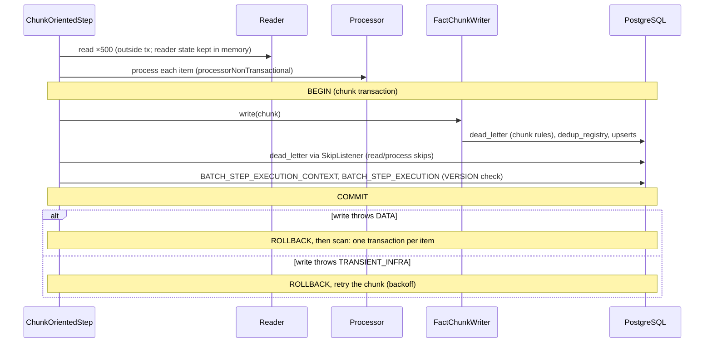
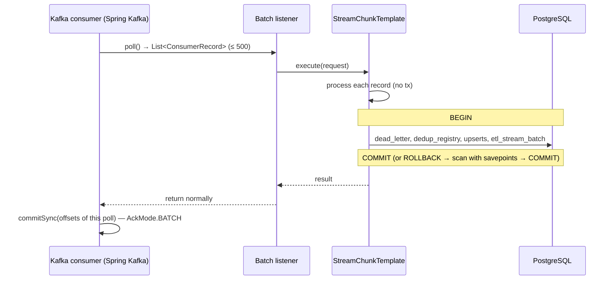

# Xử lý batch và chunk

> Trạng thái: **Approved** · Cập nhật: 2026-09-28 · DOC-19
> Phụ thuộc: [ADR-0002](../04-adr/0002-spring-batch-and-spring-kafka.md), [ADR-0003](../04-adr/0003-effectively-once-upsert.md), [ADR-0004](../04-adr/0004-offset-commit-after-transaction.md), [ADR-0005](../04-adr/0005-batch-first-scan-fallback.md), [ADR-0006](../04-adr/0006-error-classification.md), [ADR-0015](../04-adr/0015-job-exclusivity-and-recovery.md), [DOC-14](../05-data/warehouse-model.md) §8, [DOC-15](../05-data/ops-and-insight-model.md), [DOC-16](../05-data/data-quality-rules.md), [DOC-30](error-handling.md), [DR](../00-decision-register.md) (DR-16, 21, 22, 23, 24, 27, 62, 63, 67, 69, 80)
> Người dùng chính: `etl` (P2-01…07, P2-17, P2-18), `analytics` (P4), DOC-20, DOC-21, DOC-22

Tài liệu này mô tả **cách dự án dùng** Spring Batch 6 và Spring Kafka 4, không giải thích lại framework. Nó gồm: danh mục job, cấu hình fault-tolerant step, các thành phần dùng chung giữa job batch và streaming, `StreamChunkTemplate`, ranh giới transaction ở hai chế độ, restart và chống chạy trùng, điểm tiêm lỗi, và bộ test bắt buộc.

API của Spring Batch 6 (tên builder, lớp retry của Spring Framework 7, serializer JSON) được xác minh ở spike S-06. Chỗ nào tên lớp khác với đoạn code ở đây thì sửa code theo S-06 và giữ nguyên ngữ nghĩa.

## 1. Phạm vi

| Chế độ | Chạy ở | Dùng cho | Nền |
| --- | --- | --- | --- |
| **Job batch** | `etl` profile `batch` (pod `etl-batch`) | GTFS static, replay DLQ, replay raw zone, bảo trì, DQ post-write, analytics theo lịch (P4) | Spring Batch: `JobRepository` JDBC, `JobOperator`, fault-tolerant chunk step, tasklet |
| **Streaming** | `etl` profile `stream` (pod `etl-stream`) | GTFS-rt, CDC ticketing | Spring Kafka batch listener + `StreamChunkTemplate` |

Hai chế độ dùng chung **processor, writer, bộ phân loại lỗi và `DeadLetterWriter`** (§4). Nhờ vậy một record cho cùng kết quả dù được nạp từ Kafka hay từ raw zone.

## 2. Danh mục job

Tên job là tên bean `Job`, cũng là giá trị `job_name` trong `ops.job_request` và `BATCH_JOB_INSTANCE`. Lịch dùng giờ thật UTC (trừ khi ghi khác), vì cron chỉ cần chạy đều; dữ liệu bên trong job tính theo giờ nghiệp vụ (DR-67).

| Job | Tham số định danh | Tham số khác | Step | Kích hoạt | `@SchedulerLock` (`lockAtMostFor`) | Restart được |
| --- | --- | --- | --- | --- | --- | --- |
| `GtfsStaticLoadJob` | `runKey` (`startup:<date>` \| `scheduled:<date>` \| `manual:<requestId>`) | `sourceUri` | DOC-21 §2: `fetch` → decider → 8 step `load<File>` → `loadFeedInfo` → `validate` → decider → `finalize` → `activate` → `loadVehicles` → `retire` \| `reject` | Lúc khởi động nếu chưa có feed ACTIVE; cron `0 30 3 * * *` zone `America/Chicago` (chỉ khi `pti.gtfs.static.source` được đặt); `job_request` | `gtfsStaticLoad` (2 giờ) | Có |
| `DlqReplayJob` | `replayRequestId` | `replay=true` | `replayRecord` (chunk 1) → `markReplayed` | `ReplayRequestPoller` | Không (một request một instance) | Có |
| `RawZoneReplayJob` | `replayRequestId` | `replay=true`, `source`, `fromTs`, `toTs`, `recomputeAnalytics` | `listObjects` → `replayRecords` (chunk 500) → `recomputeAnalytics` (tùy chọn) | `ReplayRequestPoller` | Không | Có |
| `PartitionMaintenanceJob` | `runDate` | — | `maintainPartitions` (tasklet) | Lúc khởi động; cron `0 15 1 * * *` | `partitionMaintenance` (30 phút) | Có |
| `OpsRetentionJob` | `runDate` | — | `purgeOps` (tasklet) | Cron `0 0 2 * * *` | `opsRetention` (1 giờ) | Có |
| `BatchMetadataCleanupJob` | `runDate` | — | `purgeBatchMetadata` (tasklet) | Cron `0 30 2 * * *` | `batchMetadataCleanup` (1 giờ) | Có |
| `DedupRegistryCleanupJob` | `slot` (mốc 15 phút) | — | `purgeDedup` (tasklet) | Cron `0 */15 * * * *` | `dedupCleanup` (10 phút) | Không cần |
| `DataQualityJob` | `slot` (mốc 5 phút) | — | `runDueRules` (tasklet) | Cron `0 */5 * * * *` | `dataQuality` (4 phút) | Không cần |
| `EtaAggregationJob` (P4) | `runKey` (`scheduled:<hour>` \| `manual:<requestId>`) | `hour`, `force` | `aggregateEta` (tasklet CONTINUABLE, DOC-23 §7.2) | Cron `0 5 * * * *`; `job_request` | `etaAggregation` (30 phút) | Có |
| `OtpScorecardJob` (P4) | `runKey` (`scheduled:<runDate>` \| `manual:<requestId>`) | `serviceDates` | `computeOtp` (tasklet CONTINUABLE, DOC-23 §8.2) | Cron `0 0 3 * * *` zone `America/Chicago`; `job_request` | `otpScorecard` (30 phút) | Có |
| `TicketingAnomalyJob` (P6-05) | `slot` (mốc 5 phút) | — | `detectTicketingAnomalies` (tasklet CONTINUABLE, DOC-23 §9.4) | Cron `0 */5 * * * *` | `ticketingAnomaly` (4 phút) | Không cần |
| `AnalyticsRecomputeJob` (P4) | `runKey` (`manual:<requestId>`) | `detectors`, `fromTs`, `toTs` | `recompute` (tasklet CONTINUABLE, DOC-23 §11.5) | Chỉ `job_request` | Không (khóa theo đơn vị việc, DOC-23 §2.5) | Có |

Quy ước:

- **Tham số định danh** quyết định `JobInstance`. Mỗi lần chạy hợp lệ là một instance mới, nên Spring Batch tự chặn hai execution cùng lúc cho cùng một việc (DR-24 lớp 2). Ví dụ: `PartitionMaintenanceJob` kích hoạt hai lần với cùng `runDate` trong khi lần đầu còn chạy thì lần hai nhận `JobExecutionAlreadyRunningException`; lần đầu đã `COMPLETED` thì lần hai nhận `JobInstanceAlreadyCompleteException` và bị bỏ qua (log `DEBUG`). Ngoại lệ là các job dùng `runKey`. `GtfsStaticLoadJob` dùng nó vì hash của feed chỉ biết sau khi đọc file, và tính duy nhất theo feed do `gtfs_feed_version_hash_uk` bảo đảm (DOC-21 §1). `EtaAggregationJob`, `OtpScorecardJob` và `AnalyticsRecomputeJob` dùng nó để operator chạy lại được cùng một giờ, một ngày hay một khoảng (lịch tự động vẫn dùng `scheduled:<…>`, nên cron bắn hai lần chỉ chạy một lần); kết quả của chúng là merge idempotent (DOC-23 §4.3).
- `runDate`, `slot`, `hour`, `serviceDate` tính bằng `BusinessClock` khi dữ liệu là theo giờ nghiệp vụ (`PartitionMaintenanceJob`, analytics), bằng giờ thật trong trường hợp còn lại.
- Job có "Restart được = Không cần" là tasklet ngắn chạy lại hoàn toàn ở slot sau; không bị restart bởi `StaleExecutionRecoverer` (§7.2) mà chỉ bị đánh dấu `FAILED`.
- Tasklet job cũng có `BatchIdStepListener` (DR-63) để mọi dòng được ghi có `batch_id`.

### 2.1 Tác vụ lịch không phải job

| Tác vụ | Chu kỳ | Lock | Việc |
| --- | --- | --- | --- |
| `JobRequestPoller` | 5 giây | `jobRequestPoller` (1 phút) | Nhận `ops.job_request` `PENDING`, gọi `JobOperator` (§7.3) |
| `ReplayRequestPoller` | 5 giây | `replayRequestPoller` (1 phút) | Nhận `ops.replay_request` `PENDING`, khởi chạy `DlqReplayJob`/`RawZoneReplayJob` (DOC-22) |
| `StaleExecutionRecoverer` | Lúc khởi động và mỗi phút | `staleExecutionRecoverer` (5 phút) | §7.2 |
| `RuntimeFlagRefresher` | 5 giây | Không (mỗi pod tự đọc) | Đọc `ops.runtime_flag` (DR-19) |

Mọi tác vụ `@Scheduled` chạy trên một `ThreadPoolTaskScheduler` riêng (4 thread, tiền tố `pti-sched-`), còn job chạy trên `ThreadPoolTaskExecutor` của `JobOperator` (§3.3). Một job dài không chặn poller.

## 3. Hạ tầng Spring Batch

### 3.1 Cấu hình

| Thiết lập | Giá trị | Lý do |
| --- | --- | --- |
| `JobRepository` | JDBC, `DataSource` chính (`etl_writer`) | DR-62. Không dùng bản resourceless |
| `spring.batch.jdbc.table-prefix` | `batch.BATCH_` | Schema `batch` (DOC-15 §2) |
| `spring.batch.jdbc.initialize-schema` | `never` | Migration V5_1 |
| `spring.batch.job.enabled` | `false` | Không job nào chạy lúc khởi động ứng dụng (DR-26) |
| Isolation khi tạo execution | `READ_COMMITTED` | Mặc định `SERIALIZABLE` của Spring Batch gây lỗi `40001` khi hai pod cùng tạo execution; `JobExecutionAlreadyRunningException` và ShedLock đã chặn chạy trùng |
| Serializer `ExecutionContext` | Serializer Jackson (JSON) của Spring Batch 6 | DR-62. Chỉ lưu số, chuỗi, map |
| `JobOperator` | Bean mặc định của Boot, launcher bất đồng bộ (§3.3) | API duy nhất để start, restart, stop |
| Observation | Bật (`BatchObservabilityBeanPostProcessor`), metric `spring.batch.job`, `spring.batch.step`, `spring.batch.item.*` | DOC-28 |
| JVM | `TZ=UTC` | Cột thời gian của Spring Batch không có múi giờ (DOC-15 §2) |

### 3.2 Nội dung `ExecutionContext`

| Key | Ở đâu | Ý nghĩa |
| --- | --- | --- |
| `pti.batchId` | Step context | `batch_id` của step execution (DR-63), do `BatchIdStepListener` đặt |
| `pti.skip.data` | Step context | Số item bị skip vì `DATA`, để tính tỷ lệ skip sau restart |
| Key của reader (`FlatFileItemReader.read.count`, `MultiResourceItemReader.resourceIndex`…) | Step context | Do Spring Batch ghi, dùng cho restart |
| `pti.feedVersionId` | Job context | `GtfsStaticLoadJob`: phiên bản `STAGED` đang nạp |
| `pti.replay.objectKeys` | Job context | `RawZoneReplayJob`: danh sách object đã chọn ở step `listObjects` (lưu tối đa 10.000 key; nhiều hơn thì ghi ra bảng tạm, xem DOC-22) |

`ExecutionContext` được ghi **trong transaction của chunk**, nên vị trí restart luôn khớp với dữ liệu đã commit.

### 3.3 Thread và kết nối

| Tài nguyên | Giá trị | Ghi chú |
| --- | --- | --- |
| Executor của `JobOperator` | core 2, max 3, queue 20, tiền tố `pti-job-` | Tối đa 3 job đồng thời trên một pod. Queue đầy thì poller để request ở `PENDING`, lần quét sau thử lại |
| Hikari (`etl-batch`) | 6 kết nối (DOC-10 §4) | 3 job × 1 kết nối + JobRepository dùng chung transaction + poller + ShedLock |
| Chunk step đa luồng | Không dùng | Thứ tự trong một job đơn giản hơn; song song giữa các job là đủ |

## 4. Thành phần dùng chung

Các lớp dưới đây nằm trong `etl` (package `dev.pti.etl.core`), trừ khi ghi khác. Không lớp nào phụ thuộc Spring Kafka hay Spring Batch ngoài các interface `ItemProcessor`, `ItemWriter`, `Chunk`.

### 4.1 Mô hình item

```java
/** One inbound message, whatever the transport (Kafka record or raw-zone line). */
public record InboundMessage(
    EtlSource source,
    String key,
    String value,                  // verbatim, may be malformed
    String topic, Integer partition, Long offset,   // null for non-Kafka sources
    Instant recordTimestamp,       // Kafka CreateTime (real time)
    Map<String, String> headers) {}

/** Everything one message writes, grouped per target table. Unit of skip and scan. */
public record WriteSet(
    InboundMessage origin,
    String messageHash,            // DOC-09 §9; key of dedup_registry
    String businessKey,            // for DLQ and logs
    Instant eventTimestamp,
    List<VehiclePositionRow> vehiclePositions,     // 0..1
    List<TripUpdateRow> tripUpdates,               // 0..300, one per stop_time_update
    List<TicketSaleRow> ticketSales,               // 0..1
    List<SalePointRow> salePoints,                 // 0..1, or an INFERRED placeholder
    List<String> vehicleIds) {}                    // VP/TU vehicle_id, for REALTIME placeholders in dim_vehicle
```

Một message là một đơn vị skip: TripUpdate có 12 phần tử thì 12 dòng cùng được ghi hoặc cùng vào DLQ (DOC-16 §2). Scan của Spring Batch cũng ghi lại theo đơn vị này.

### 4.2 Processor

```java
/** Pure function: parse, validate, map, per-record DQ rules. No I/O, no side effects (DR-21). */
public interface MessageProcessor extends ItemProcessor<InboundMessage, WriteSet> {
  /** @throws DataException (stage + ruleId) for DESERIALIZE, SCHEMA, QUALITY violations. */
  @Override WriteSet process(InboundMessage message) throws DataException;
}
```

Hiện thực: `GtfsRtVehiclePositionProcessor`, `GtfsRtTripUpdateProcessor`, `TicketSaleCdcProcessor`, `SalePointCdcProcessor`. Mỗi processor nhận `RuleContext` (DOC-16 §5) qua `RuleContextProvider`; giá trị `replay` lấy từ job parameter (Spring Batch, `@StepScope`) hoặc từ `StreamChunkRequest` (streaming).

Processor phải thuần: scan của Spring Batch chạy lại processor cho từng item, và `processorNonTransactional()` được bật để kết quả lần đầu được dùng lại (DR-21).

### 4.3 Writer

```java
/** Shared by both modes. Runs inside the chunk transaction opened by the caller. */
public final class FactChunkWriter implements ItemWriter<WriteSet> {
  public FactChunkWriter(ChunkRules chunkRules,           // DQ-02, DQ-12, DQ-13 (DOC-16)
                         DedupRegistry dedupRegistry,     // skipped when replay (DR-16)
                         DeadLetterWriter deadLetters,
                         Map<Class<?>, UpsertStatement<?>> upserts,  // DOC-14 §8
                         WriteStatsCollector stats) { … }

  @Override public void write(Chunk<? extends WriteSet> chunk) throws Exception {
    // 1. chunk rules: collapse superseded duplicates, reject conflicts -> deadLetters (same tx)
    // 2. dedup registry (not on replay): INSERT ... ON CONFLICT DO NOTHING RETURNING payload_hash;
    //    hashes not returned were seen within the TTL -> drop, count as duplicate
    // 3. per target table, in fixed order: dim_vehicle (REALTIME placeholders), dim_sale_point
    //    (CDC rows, then INFERRED placeholders), facts, vehicle_position_latest (one row per vehicle, newest)
    //    NamedParameterJdbcTemplate.batchUpdate(upsert, params); rows returning 0 -> guard blocked -> duplicate
    // 4. stats: written / duplicate / skipped, per source
  }
}
```

- Writer tự gọi `NamedParameterJdbcTemplate.batchUpdate` thay vì ghép `JdbcBatchItemWriter`/`CompositeItemWriter`, vì cần mảng số dòng trả về: `0` nghĩa là guard đã chặn và được cộng vào `records_duplicate` (DOC-14 §8). Một `WriteSet` ghi vào nhiều bảng, nên writer tự điều phối thứ tự.
- Thứ tự bảng cố định trong mọi chunk để hai transaction song song khóa dòng theo cùng thứ tự, tránh deadlock.
- Trong mỗi bảng, các dòng được sắp theo PK trước khi ghi, cùng lý do.
- Rule theo chunk và dedup registry chạy trong writer chứ không trong processor, vì chúng cần cả chunk hoặc cần đọc DB. Khi Spring Batch scan (mỗi chunk một item), DQ-02 không còn gì để so; bản ghi sau vẫn được guard của upsert xử lý đúng (DOC-14 §8), chỉ mất việc phát hiện xung đột. Chấp nhận được, vì scan chỉ xảy ra khi đã có lỗi ghi.
- Chế độ baseline (DR-27, profile `experiment`): `BaselineFactWriter` thay `FactChunkWriter`, dùng `INSERT` thuần vào `exp.exp_fact_*`, không registry, không rule theo chunk.

### 4.4 Phân loại lỗi, skip, retry

`ErrorClassifier implements Classifier<Throwable, ErrorKind>` với `ErrorKind ∈ {DATA, TRANSIENT_INFRA, FATAL}`. Bảng ánh xạ exception và SQLState ở DOC-30 §2.

```java
/** Step-scoped: needs the step execution to compute the skip ratio (DR-23, FR-02.7). */
public final class RatioSkipPolicy implements SkipPolicy {
  private final ErrorClassifier classifier;
  private final double maxRatio;        // pti.etl.batch.max-skip-ratio, 0.2
  private final int minSample;          // pti.etl.batch.skip-min-sample, 100
  private final StepExecution step;

  @Override public boolean shouldSkip(Throwable t, long skipCount) {
    if (classifier.classify(t) != ErrorKind.DATA) return false;
    long seen = Math.max(step.getReadCount(), minSample);
    if ((double) (skipCount + 1) / seen > maxRatio) {
      throw new SkipLimitExceededException(skipCount, t);   // step FAILED
    }
    return true;
  }
}
```

`minSample` tránh việc step fail ngay khi mới đọc vài item mà có một item lỗi.

Retry (chỉ cho `TRANSIENT_INFRA`): tối đa 5 lần, backoff mũ bắt đầu 1 giây, hệ số 2, jitter ±20%, trần tổng 60 giây. Builder fault-tolerant của Spring Batch 6 mà dự án dùng (§5, DR-80) nhận kiểu của Spring Retry 2.0.x: `TransientRetryPolicy extends org.springframework.retry.policy.SimpleRetryPolicy` (phân loại bằng `ErrorClassifier`) và `ExponentialRandomBackOffPolicy` (initial 1 s, multiplier 2, max 16 s). Code ngoài chunk step dùng core retry của Spring Framework 7 (DOC-11 §6). Hết lượt thì step `FAILED`, `StaleExecutionRecoverer` không động tới (execution đã kết thúc); job được restart qua `job_request` hoặc tự động nếu job có lịch (lần chạy sau).

### 4.5 Ghi DLQ

```java
public interface DeadLetterWriter {
  /** Inserts into ops.dead_letter using the current transaction. raw_payload is PII-scrubbed. */
  void write(InboundMessage message, DlqStage stage, String ruleId, String errorClass,
             String errorMessage, String businessKey, UUID batchId);
}
```

- `DeadLetterSkipListener` (Spring Batch) gọi `DeadLetterWriter` trong `onSkipInRead`, `onSkipInProcess`, `onSkipInWrite`. Spring Batch gọi skip listener **trong transaction của chunk, trước khi commit**, nên chunk rollback thì không còn dòng DLQ nào. Test B-05 (§10) kiểm tra hành vi này trên Spring Batch 6.
- `StreamChunkTemplate` gọi trực tiếp trong transaction của nó.
- `raw_payload` = `PiiScrubber.scrub(message.value())` (DOC-18 §4.1). `error_message` tối đa 4.000 ký tự, tiếng Anh.
- Idempotent theo vị trí Kafka (`dead_letter_kafka_pos_uk`): luồng trực tiếp dùng `ON CONFLICT DO NOTHING` (poll giao lại không nhân đôi dòng DLQ), replay dùng `ON CONFLICT DO UPDATE` để cập nhật dòng cũ với lỗi mới. Câu lệnh ở DOC-22 §1.3.
- `stage` với lỗi ghi ở scan: `LOAD`; `error_class` = `DataIntegrityViolation`, `error_message` = thông báo của Postgres kèm SQLState.

### 4.6 `BatchIdStepListener`

`beforeStep`: sinh UUIDv7, INSERT `ops.etl_batch_step`, đặt `pti.batchId` vào step context. Restart tạo step execution mới nên có `batch_id` mới (DR-63). Processor và writer đọc qua `@Value("#{stepExecutionContext['pti.batchId']}")`.

## 5. Fault-tolerant chunk step (job batch)

```java
@SuppressWarnings("removal")   // SimpleStepBuilder/FaultTolerantStepBuilder, see below
@Bean @JobScope
Step replayRecordsStep(JobRepository jobRepository, PlatformTransactionManager tx,
                       MultiResourceItemReader<InboundMessage> reader,
                       MessageProcessorRouter processor, FactChunkWriter writer,
                       RatioSkipPolicy skipPolicy, TransientRetryPolicy retryPolicy,
                       ExponentialRandomBackOffPolicy backOffPolicy,
                       DeadLetterSkipListener skipListener, BatchIdStepListener batchIdListener,
                       EtlBatchProperties props) {
  return new StepBuilder("replayRecords", jobRepository)
      .<InboundMessage, WriteSet>chunk(props.chunkSize(), tx)  // 500; two-argument form = legacy builder (DR-80)
      .reader(reader)
      .processor(processor)
      .writer(writer)
      .faultTolerant()
      .processorNonTransactional()
      .skipPolicy(skipPolicy)
      .retryPolicy(retryPolicy)
      .backOffPolicy(backOffPolicy)                             // Spring Retry types, §4.4
      .noRollback(DataQualityRejection.class)   // chunk-rule rejections are already in the DLQ
      .listener(skipListener)
      .listener(batchIdListener)
      .build();
}
```

**Builder cũ, không dùng `ChunkOrientedStep` mới (DR-80).** Spring Batch 6.0 có hai cách dựng chunk step:

- `chunk(size, tx)` (hai tham số) cho `SimpleStepBuilder`/`FaultTolerantStepBuilder`, bị đánh dấu `@Deprecated(since = "6.0", forRemoval = true)`;
- `chunk(size).transactionManager(tx)` cho `ChunkOrientedStepBuilder` mới.

S-06 chạy cùng một job trên cả hai với Postgres thật (`spikes/s06-boot41-java25/`, Spring Batch 6.0.5). Step mới sai ở hai điểm mà thiết kế này dựa vào:

1. Khi scan gặp item lỗi, transaction của item đó bị rollback **sau** khi gọi `onSkipInWrite`, nên dòng DLQ do skip listener ghi mất theo, và `writeSkipCount` bằng 0.
2. Mỗi transaction của scan lưu vị trí reader của **cả chunk**. Process chết giữa lúc scan rồi restart thì các item chưa kịp scan bị bỏ qua mà không báo gì: ghi lỗi ở item 37, kill ở item 300 thì restart chỉ còn 298/499 dòng.

Builder cũ đạt cả hai (499 dòng, 1 DLQ trong transaction; restart sau khi kill giữa scan đủ 499). Dự án dùng builder cũ cho tới khi Spring Batch sửa step mới. Test B-05, B-18 và luật ArchUnit B-19 giữ lựa chọn này: đổi sang step mới thì test đỏ. Builder cũ sẽ bị xóa ở một bản major sau (dự kiến Spring Batch 7); khi nâng lên bản đó mà step mới vẫn sai thì chuyển scan vào writer bằng savepoint như `StreamChunkTemplate` (§6.2), không đổi hành vi bên ngoài.

Luồng của một chunk khi mọi thứ bình thường và khi có lỗi (DR-21):

1. Đọc 500 item. Lỗi đọc loại `DATA` (dòng raw zone hỏng) → skip → `onSkipInRead`.
2. Process từng item. `DataException` → skip → `onSkipInProcess` → DLQ.
3. `FactChunkWriter.write` với các item còn lại, trong transaction của chunk.
4. Writer ném lỗi `DATA` (SQLState 22/23): Spring Batch rollback, rồi scan: ghi lại từng item, mỗi item một transaction; item lỗi → `onSkipInWrite` → DLQ `LOAD`.
5. Writer ném lỗi `TRANSIENT_INFRA`: rollback, retry cả chunk theo §4.4.
6. Commit: dữ liệu, DLQ, `ExecutionContext`, `BATCH_STEP_EXECUTION` (có `VERSION`) trong cùng một transaction.

Chế độ baseline `error-mode=fail-batch` cho job batch: step dựng không có `.faultTolerant()`, nên lỗi đầu tiên làm step `FAILED` (DR-27).

### 5.1 Exit status

| Exit code | Khi nào | Job |
| --- | --- | --- |
| `COMPLETED` | Không có skip | mọi job |
| `COMPLETED_WITH_SKIPS` | Có ít nhất một item vào DLQ, dưới ngưỡng tỷ lệ | chunk job; đặt bởi `SkipAwareExitListener` |
| `NOOP` | Feed không đổi (hash đã ACTIVE) | `GtfsStaticLoadJob` |
| `REJECTED` | Feed không qua kiểm tra | `GtfsStaticLoadJob`; `BatchStatus` vẫn `COMPLETED` vì job đã làm đúng việc |
| `FAILED` | Lỗi `FATAL`, hết retry, vượt tỷ lệ skip | mọi job |

## 6. `StreamChunkTemplate` (streaming)

Lớp mỏng dựng từ `TransactionTemplate` và savepoint, hiện thực cùng thuật toán ở §5 cho một micro-batch (một poll).

### 6.1 Interface

```java
public final class StreamChunkTemplate {

  public StreamChunkTemplate(TransactionTemplate tx, JdbcClient jdbc, DeadLetterWriter deadLetters,
                             StreamBatchLog batchLog,          // ops.etl_stream_batch
                             ErrorClassifier classifier, FaultInjector faults,
                             ApplicationEventPublisher events, BaselineMode baseline) { … }

  /**
   * Processes one poll as one chunk. Returns when the transaction has committed.
   * Throws TransientInfraException or FatalException (never DataException): the caller
   * (a Spring Kafka batch listener) lets them reach the error handler, so the offset is not committed.
   */
  public StreamChunkResult execute(StreamChunkRequest request,
                                   ItemProcessor<InboundMessage, WriteSet> processor,
                                   ItemWriter<WriteSet> writer);
}

public record StreamChunkRequest(
    UUID batchId,                // UUIDv7, generated before the transaction (DR-63)
    EtlSource source, String listenerId, String consumerGroup, String instanceId,
    List<InboundMessage> messages,
    boolean replay) {}           // always false for live listeners

public record StreamChunkResult(
    UUID batchId, WriteMode writeMode, int read, int written, int skipped, int duplicate,
    Instant minEventTs, Instant maxEventTs, Instant minRecordTs, Set<String> routeIds) {}
```

### 6.2 Thuật toán

```
execute(request, processor, writer):
  faults.hit(BEFORE_PROCESS)
  valid = [], skipped = []
  for m in request.messages:                          # outside any transaction: pure work
    try: valid += processor.process(m)
    catch DataException e: skipped += (m, e)
    # any other exception: classify; TRANSIENT_INFRA/FATAL -> rethrow (whole poll retried)

  if baseline.errorMode == FAIL_BATCH and skipped not empty:
    throw DataBatchFailedException                    # baseline: whole poll fails (DR-27)

  try:
    result = tx.execute(status ->                     # attempt 1: batch write
      faults.hit(BEFORE_WRITE)
      writer.write(Chunk(valid))
      for (m, e) in skipped: deadLetters.write(m, e.stage, …, request.batchId)
      batchLog.insert(request, COMPLETED[_WITH_SKIPS], writeMode = BATCH, stats)
      faults.hit(AFTER_WRITE_BEFORE_COMMIT)
      return stats)
  catch e where classifier(e) == DATA:                # attempt 2: scan with savepoints
    result = tx.execute(status ->
      for ws in valid:
        sp = status.createSavepoint()
        try: writer.write(Chunk(ws)); status.releaseSavepoint(sp)
        catch e2 where classifier(e2) == DATA:
          status.rollbackToSavepoint(sp)
          deadLetters.write(ws.origin, LOAD, …)
      for (m, e) in skipped: deadLetters.write(…)
      batchLog.insert(request, …, writeMode = SCAN, stats)
      return stats)
  catch e:                                            # TRANSIENT_INFRA or FATAL
    batchLog.insertFailedBestEffort(request, e)       # separate transaction, errors ignored
    throw e

  faults.hit(AFTER_COMMIT_BEFORE_ACK)
  events.publishEvent(MicroBatchCommitted(result))    # after commit; handled async (DR-35)
  return result
```

Ghi chú:

- Processor chạy **ngoài transaction**: nó thuần nên không cần, và transaction ngắn hơn.
- Ở scan, `FactChunkWriter.write` với một phần tử vẫn chạy rule theo chunk và dedup registry (không có gì để so trong chunk một phần tử), như scan của Spring Batch.
- Một `batch_id` cho cả poll, kể cả khi phải scan. Lần thử lại sau lỗi hạ tầng dùng `batch_id` mới, vì poll được giao lại như một lần xử lý mới.
- `MicroBatchCommitted` được publish sau khi `tx.execute` trả về, tức là sau commit, nên không cần `@TransactionalEventListener`. Analytics nhận sự kiện trên executor riêng (DR-35, DOC-20 §7).
- Baseline `write-mode=insert`: `BaselineFactWriter` (§4.3). `dedup=off`: registry bị bỏ qua. `offset-commit=auto` nằm ở cấu hình consumer (DOC-20 §9).

### 6.3 Dùng trong listener

```java
@KafkaListener(id = "gtfs-rt-vehicle-position", topics = "gtfs.vehicle_positions",
               groupId = "pti-etl-gtfs-rt", batch = "true", concurrency = "${pti.etl.gtfs-rt.concurrency:3}")
void onVehiclePositions(List<ConsumerRecord<String, String>> records) {
  var request = requests.from(EtlSource.GTFS_RT_VEHICLE_POSITION, "gtfs-rt-vehicle-position", records);
  try (var mdc = MdcScope.batch(request.batchId(), request.source())) {
    template.execute(request, vehiclePositionProcessor, factChunkWriter);
  }
  // returns normally -> AckMode.BATCH commits the offsets of this poll (ADR-0004)
}
```

Cấu hình consumer, error handler và pause/resume nằm ở DOC-20.

## 7. Transaction, đồng thời và khôi phục

### 7.1 Sơ đồ transaction của một chunk

**Job batch (Spring Batch):**



**Streaming (`StreamChunkTemplate`):**



Điểm quan trọng: **offset chỉ commit sau khi transaction đã commit** (ADR-0004). Pod chết giữa hai bước thì poll được giao lại và upsert làm cho lần ghi thứ hai không đổi kết quả (ADR-0003).

### 7.2 Chống chạy trùng và khôi phục (DR-24)

Ba lớp:

1. **ShedLock** trên mọi `@Scheduled` kích hoạt job. `JdbcTemplateLockProvider` với bảng `ops.shedlock`, `usingDbTime()` (so thời gian bằng giờ của Postgres, tránh lệch giờ giữa các pod). Job chạy lâu (`GtfsStaticLoadJob`, `RawZoneReplayJob`) dùng `KeepAliveLockProvider` để gia hạn khóa trong lúc chạy.
2. **Một `JobInstance` chỉ có một execution đang chạy** (§2).
3. **Fencing bằng `VERSION`:** mỗi lần commit chunk, Spring Batch cập nhật `BATCH_STEP_EXECUTION` với điều kiện `VERSION` trong cùng transaction.

`StaleExecutionRecoverer` (mỗi phút, dưới ShedLock):

```
for exec in jobExplorer.findRunningJobExecutions(any job):
  lastUpdated = max(exec.lastUpdated, max(step.lastUpdated for step in exec.steps))
  if now − lastUpdated < pti.batch.stale-after (2 min): continue
  if shedlock row of exec's job is held (lock_until > db now) and not by a dead instance: continue
  jobOperator.recover(exec)       // Batch 6: running steps and the job -> FAILED, end_time = now, VERSION + 1
  set exit status "STALE" on the job and on the recovered steps, JobRepository.update (VERSION + 1 again)
  if job is restartable and not a replay job: jobOperator.restart(exec.id)
  if replay job: set replay_request.status = FAILED, message = "Execution became stale" (DOC-22 decides retry)
```

Nếu pod cũ vẫn còn sống (ví dụ bị treo GC lâu rồi chạy tiếp), lần commit chunk kế tiếp của nó cập nhật `BATCH_STEP_EXECUTION` với `VERSION` cũ, nhận `OptimisticLockingFailureException` và rollback. Dữ liệu của chunk đó không được commit, còn execution mới đọc tiếp từ `ExecutionContext` đã commit.

`stale-after` (2 phút) phải lớn hơn thời gian dài nhất của một chunk. Chunk dài nhất là `loadStopTimes` với 1.000 dòng, khoảng 1 giây. Tasklet dài (finalize, khoảng 2 giây; analytics, dưới 30 giây) cập nhật `LAST_UPDATED` khi kết thúc; tasklet có thể dài hơn 2 phút phải chia nhỏ thành nhiều lần gọi `execute` trả `RepeatStatus.CONTINUABLE`.

Khi khởi động, `etl-batch` chạy `StaleExecutionRecoverer` một lần trước khi bật poller, để các execution của lần chạy trước (pod bị kill) được dọn ngay thay vì đợi 2 phút.

### 7.3 `JobRequestPoller`

```sql
-- claim one request; SKIP LOCKED so two pods never claim the same row
SELECT * FROM ops.job_request
WHERE status = 'PENDING'
ORDER BY requested_at
LIMIT 1
FOR UPDATE SKIP LOCKED;
```

| `kind` | Gọi | Lỗi thì |
| --- | --- | --- |
| `RUN` | `jobOperator.start(jobName, params)`; params được kiểm tra theo danh sách cho phép của từng job | `REJECTED` + `message` (job không tồn tại, tham số sai, instance đã COMPLETE) |
| `RESTART` | `jobOperator.restart(targetJobExecutionId)` | `REJECTED` nếu execution không ở `FAILED`/`STOPPED` hoặc job không restart được |
| `STOP` | `jobOperator.stop(targetJobExecutionId)` | `REJECTED` nếu execution không chạy |

Trong cùng transaction với câu `SELECT … FOR UPDATE`: gọi `JobOperator` (chỉ tạo execution rồi đưa vào executor, trả về ngay), cập nhật `status = RUNNING`, `job_execution_id`, `started_at`. Một `JobExecutionListener` chung cập nhật `DONE`/`FAILED` khi job kết thúc.

## 8. Điểm tiêm lỗi (test và thực nghiệm)

```java
public enum FaultPoint {
  BEFORE_READ, BEFORE_PROCESS, AFTER_PROCESS, BEFORE_WRITE, AFTER_WRITE_BEFORE_COMMIT,
  AFTER_COMMIT_BEFORE_ACK
}

public interface FaultInjector {
  void hit(FaultPoint point);            // no-op in production
}
```

- Bean mặc định `NoopFaultInjector`. `ConfigurableFaultInjector` chỉ có trong profile `test` và `experiment`, đọc `pti.test.fault.<point>=<action>` với `action ∈ {throw-transient, throw-fatal, halt}` và `pti.test.fault.after-n=<số lần>`.
- `halt` gọi `Runtime.getRuntime().halt(137)`, mô phỏng `kill -9`: không chạy shutdown hook, không commit gì thêm.
- Job batch nối `FaultInjector` qua `ChunkListener` và `ItemWriteListener` (`beforeWrite`, `afterWrite` trước commit). Điểm `AFTER_COMMIT_BEFORE_ACK` chỉ có ở streaming.
- EXP-01 dùng `docker kill` từ bên ngoài (không cần hook). Hook dùng cho test tự động ở CI, nơi cần lỗi rơi đúng vào một điểm.

## 9. Cấu hình

| Key | Kiểu | Mặc định | Mô tả |
| --- | --- | --- | --- |
| `pti.etl.batch.chunk-size` | int | `500` | Chunk của `RawZoneReplayJob`, `DlqReplayJob` luôn là 1 |
| `pti.etl.batch.max-skip-ratio` | ratio | `0.2` | DR-23 |
| `pti.etl.batch.skip-min-sample` | int | `100` | §4.4 |
| `pti.etl.retry.max-attempts` | int | `5` | Retry `TRANSIENT_INFRA` trong job batch |
| `pti.etl.retry.initial-interval` / `.multiplier` / `.max-elapsed` | Duration / double / Duration | `1s` / `2.0` / `60s` | |
| `pti.batch.stale-after` | Duration | `2m` | §7.2 |
| `pti.batch.executor.core-size` / `.max-size` / `.queue-capacity` | int | `2` / `3` / `20` | §3.3 |
| `pti.batch.poller.interval` | Duration | `5s` | `JobRequestPoller`, `ReplayRequestPoller` |
| `pti.batch.schedule.<job>` | cron | bảng §2 | Đặt `-` để tắt lịch của một job |
| `pti.test.fault.*` | | — | Chỉ profile `test`, `experiment` |

## 10. Metrics và log

| Metric | Loại | Label | Nguồn |
| --- | --- | --- | --- |
| `spring.batch.job`, `spring.batch.step`, `spring.batch.item.read/process`, `spring.batch.chunk.write` | timer | `spring.batch.job.name`, `…status` | Spring Batch |
| `pti_etl_records_total` | counter | `source`, `mode` (`stream`\|`batch`), `outcome` (`written`\|`duplicate`\|`skipped`) | `WriteStatsCollector` |
| `pti_etl_duplicates_total` | counter | `source`, `mode`, `reason` (`in_chunk` \| `registry` \| `guard`) | `WriteStatsCollector`. Tách `outcome="duplicate"` theo nơi phát hiện: DQ-02 gộp trong chunk (bước 1), registry (bước 2), guard của upsert (bước 3). Tổng theo `reason` bằng `pti_etl_records_total{outcome="duplicate"}`. EXP-02 dùng để chứng minh DR-16 |
| `pti_etl_chunk_scan_total` | counter | `source`, `mode` | Mỗi lần phải chuyển sang scan |
| `pti_etl_chunk_duration_seconds` | histogram | `source`, `mode`, `write_mode` | `StreamChunkTemplate`, `ChunkListener` |
| `pti_batch_stale_recovered_total` | counter | `job` | `StaleExecutionRecoverer` |
| `pti_batch_job_requests_total` | counter | `kind`, `outcome` | `JobRequestPoller` |

Log: JSON, MDC có `trace_id`, `span_id`, `batch_id`, `source`, `job` (job batch) hoặc `listener` (streaming). Mỗi chunk ghi một dòng `DEBUG` (`Chunk committed`); chunk có skip hoặc scan ghi `INFO`; lỗi hạ tầng ghi `WARN` kèm số lần thử; `FATAL` ghi `ERROR`. Không bao giờ log `value` của message ở mức trên `DEBUG` (DOC-18 §4).

## 11. Lỗi và cách xử lý

| Tình huống | Job batch | Streaming |
| --- | --- | --- |
| Record lỗi dữ liệu (parse, schema, DQ) | Skip → DLQ; chunk commit | Skip → DLQ; chunk commit |
| Lỗi dữ liệu khi ghi | Rollback → scan mỗi item một transaction | Rollback → scan bằng savepoint trong một transaction |
| DB mất kết nối, deadlock, serialization failure | Retry chunk (5 lần, ≤ 60 s) → step `FAILED` → restart sau | Ném ra → `DefaultErrorHandler` seek, backoff vô hạn, pause container (DOC-20) |
| Lỗi lập trình (NPE, `IllegalStateException`) | Step `FAILED`, alert `BatchJobFailed` | Container dừng, alert `ConsumerStopped` |
| Vượt tỷ lệ skip | Step `FAILED` (FR-02.7) | Không áp dụng: streaming không có tỷ lệ skip, chỉ có alert `DlqRateHigh` (DOC-16 §4) |
| Pod chết giữa chunk | Execution kẹt `STARTED` → `StaleExecutionRecoverer` → restart từ chunk đã commit cuối | Poll được giao lại (offset chưa commit) |
| Pod "zombie" commit sau khi đã bị thay | `OptimisticLockingFailureException`, rollback | Không áp dụng (Kafka fencing qua rebalance; ghi trùng thì upsert xử lý) |

## 12. Test bắt buộc

Mọi test chạy với Testcontainers (Postgres 17, Kafka 4.3) và fixture tuyến 18 (DOC-44). Ký hiệu **[2]** = chạy ở **cả hai chế độ** với cùng dữ liệu và cùng kỳ vọng.

| ID | Kịch bản | Kỳ vọng |
| --- | --- | --- |
| B-01 [2] | Chunk 500 VP, 1 JSON hỏng | 499 dòng fact, 1 DLQ `DESERIALIZE`, `COMPLETED_WITH_SKIPS` |
| B-02 [2] | Chunk 500, record #37 vi phạm DQ-03 | 499 dòng, 1 DLQ `QUALITY` `DQ-03` |
| B-03 [2] | Writer lỗi `23514` (check constraint) ở 1 record (tiêm qua `FactChunkWriter` test double) | Scan: 499 dòng, 1 DLQ `LOAD`; streaming có `write_mode = SCAN`, đúng 1 commit |
| B-04 [2] | Writer lỗi `08006` hai lần rồi thành công | Không DLQ; dữ liệu đầy đủ; streaming: container pause rồi resume |
| B-05 | Spring Batch: chunk có skip trong process, sau đó writer ném lỗi hạ tầng hết retry | Không còn dòng DLQ nào của chunk đó (skip listener trong transaction đã rollback) |
| B-06 [2] | Restart sau lỗi ở từng `FaultPoint` (`throw-transient` và `halt`), 10.000 message | So với ledger: mất 0, trùng 0 (số dòng fact = số business key); `records_duplicate` > 0 cho phần giao lại |
| B-07 | `GtfsStaticLoadJob` `halt` ở chunk 40 của `loadStopTimes` → restart | Bắt đầu từ chunk 41 (đọc `read.count`); kết quả cuối giống lần chạy không lỗi (FR-03.6) |
| B-08 | Hai instance `etl-batch` cùng kích hoạt `PartitionMaintenanceJob` | Chỉ một execution |
| B-09 | Execution `STARTED`, `LAST_UPDATED` cũ 3 phút, không có khóa | `StaleExecutionRecoverer` đánh dấu `FAILED` và restart; execution mới đọc tiếp đúng vị trí |
| B-10 | "Zombie": pod A bị treo (debugger), pod B khôi phục và restart; A chạy tiếp và commit chunk | A nhận `OptimisticLockingFailureException`; không có dòng nào của chunk đó từ A |
| B-11 | Tỷ lệ skip 25% trên 1.000 item | Step `FAILED` sau khoảng item thứ 100–120; exit description nêu tỷ lệ |
| B-12 | `job_request` `RUN` hai pod cùng quét | Chỉ một execution; request `DONE` |
| B-13 | `job_request` `RESTART` cho execution `COMPLETED` | `REJECTED` |
| B-14 [2] | Baseline `fail-batch`: chunk có 1 record lỗi | Streaming: poll lỗi, không ghi gì; job batch: step `FAILED` |
| B-15 | `BatchIdStepListener`: restart tạo `batch_id` mới; dòng đã commit giữ `batch_id` cũ | Kiểm tra bằng query `etl_batch_step` |
| B-16 [2] | Processor gọi hai lần cho cùng message (scan) | Cùng `WriteSet` (so sánh `equals`) |
| B-17 [2] | Replay (`replay = true`) một message đã có trong `dedup_registry` | Ghi lại fact (guard `:replay`), registry không đổi (FR-03.4) |
| B-18 | Job batch 500 item, writer lỗi `23514` ở item 37; tiêm `halt` (Error) khi scan tới item 300; restart | Sau restart: 499 dòng fact, đúng 1 DLQ `LOAD`; không item nào bị bỏ qua (DR-80) |
| B-19 | ArchUnit: không lớp nào gọi `StepBuilder.chunk(int)` một tham số hay dùng `ChunkOrientedStepBuilder` | Pass; vi phạm liệt kê lớp gọi (DR-80) |

Coverage tối thiểu của `StreamChunkTemplate`, `ErrorClassifier`, `RatioSkipPolicy`, `FactChunkWriter` và các processor: 90% line (DOC-44).

## 13. Câu hỏi còn mở

Không có. S-06 đã chốt tên lớp của Spring Batch 6 (DOC-11 §6) và cách dựng chunk step (DR-80).
