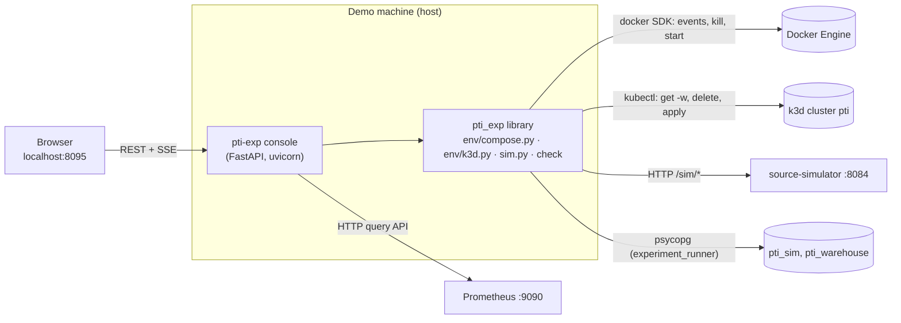

# Demo console

> Trạng thái: **Review** · Cập nhật: 2026-09-28 · DOC-48
> Phụ thuộc: [DR](../00-decision-register.md) (DR-77, DR-78, DR-85, DR-87, DR-88), [ADR-0020](../04-adr/0020-frontend-stack.md), [ADR-0025](../04-adr/0025-python-experiment-runner.md), [ADR-0030](../04-adr/0030-monorepo-layout.md), [DOC-25](source-simulator.md) §7–8, [DOC-27](security.md) §6, §12, [DOC-28](observability.md) §6–7, [DOC-35](../08-ux-ui/design-system.md), [DOC-38](../09-operations/local-dev.md) §4.6, §5, [DOC-40](../09-operations/deploy-k8s.md) §7.6, §13, [DOC-45](../10-testing/experiments/README.md) §2, [DOC-46](../10-testing/demo-script.md)
> Người dùng chính: người trình bày (PS-5), P8-08

## 1. Mục đích

Khi demo, người trình bày phải nhảy giữa terminal (`make demo-*`, `kubectl … -w`), Grafana và giao diện sản phẩm. Khán giả không thấy được "đang xảy ra gì" ở tầng hạ tầng: container bị kill, pod mới được tạo, primary Postgres đổi, message dồn lại rồi được xử lý hết. Những điều đó chỉ nằm trong lời thoại.

Demo console là **một trang web chạy trên máy demo** làm hai việc:

1. **Kích hoạt** các bước của kịch bản demo (DOC-46) bằng nút bấm: gieo kịch bản simulator, bơm dữ liệu lỗi, kill consumer, tăng tải, tắt broker, failover Postgres, đối chiếu ledger.
2. **Hiển thị** trạng thái hệ thống trên một màn hình: sơ đồ kiến trúc sống (mỗi thành phần đổi màu theo trạng thái, số pod, luồng message và lag), dòng thời gian sự kiện, vài chỉ số chính và kết quả đối chiếu.

Console là **công cụ trình diễn**, không phải tính năng của sản phẩm. Nó không có trong image, Helm chart hay `openapi.json`, và sản phẩm chạy đầy đủ khi không có nó.

## 2. Phạm vi

| Trong phạm vi | Ngoài phạm vi |
| --- | --- |
| Compose (`make up-demo`) và k3d `lite`, tự nhận biết qua `--env` | Chạy compose và k3d cùng lúc (DOC-10 §5) |
| Hành động cố định trong danh mục §7, tham số mặc định lấy từ DOC-46 | Chạy lệnh tùy ý, sửa tham số tự do của mọi kịch bản (việc này đã có ở Demo control) |
| Topology, timeline, chỉ số, kết quả `pti-exp check` | Thay Grafana khi cần phân tích sâu; thay các màn hình sản phẩm ở bước 2, 3, 6 |
| Một người dùng, một trình duyệt trên `localhost` | Nhiều người xem qua mạng, xác thực, phân quyền |
| Ghi nhật ký hành động để điền thời gian diễn tập (DOC-46 §8) | Lưu lịch sử lâu dài, thống kê |

### 2.1 Ranh giới với Demo control (`/ops/demo`)

| | Demo control (DOC-36) | Demo console (tài liệu này) |
| --- | --- | --- |
| Thuộc về | Sản phẩm (FR-11.7, UC-16), profile `demo` | Công cụ của `experiments/`, không thuộc sản phẩm |
| Người dùng | Operator đã đăng nhập | Người trình bày trên máy demo |
| Điều khiển | Mọi kịch bản simulator, form sinh từ catalog | Danh mục hành động cố định (§7), gồm cả hạ tầng: container, pod, broker, Postgres |
| Hiển thị | Trạng thái simulator, lần chạy kịch bản | Topology, timeline, chỉ số, đối chiếu |
| Đi qua | Proxy E-90 của `api` | Gọi thẳng `/sim/*`, docker, `kubectl`, Prometheus, giống runner |

Hai trang cùng gọi API `/sim/*` nên không lệch nhau. Console không lặp lại form kịch bản: cần kịch bản ngoài danh mục thì người trình bày bấm "Open Demo control".

Trong sản phẩm vẫn không có đường nào kill container hay xóa pod. Ranh giới của ADR-0025 giữ nguyên: mọi thao tác hạ tầng chỉ nằm trong `experiments/`.

## 3. Kiến trúc



- **Backend:** module `pti_exp/console/` trong dự án uv `experiments/`, chạy bằng `uv run pti-exp console --env compose|k3d`. Dùng lại mọi adapter đã có của runner (ADR-0025): `env/compose.py`, `env/k3d.py`, `sim.py`, logic của `check`. Không viết thêm đường điều khiển hạ tầng nào.
- **Frontend:** một entry Vite thứ hai trong `frontend/` (cùng `package.json`, cùng pnpm, nên không trái ADR-0030 "mỗi thư mục một công cụ build"), build ra `frontend/dist-console/` (gitignored). Backend phục vụ các file tĩnh này ở `/`.
- Tiến trình chạy **trên host**, không chạy trong container hay pod: nó cần docker socket và kubeconfig như runner, và không tốn RAM của VM Docker.

### 3.1 Bố cục code

```text
experiments/
  pti_exp/
    console/
      app.py              # FastAPI app: static files, /console-api/*, host/origin guard (§9)
      actions.py          # action catalog (§7): id → coroutine, params schema, confirm flag
      runner.py           # one action at a time per target; action log (§8, §11)
      snapshot.py         # builds the Snapshot every tick (§5)
      sources/
        containers.py     # compose: docker events + containers.list
        pods.py           # k3d: kubectl get pods -w --output-watch-events -o json
        cnpg.py           # k3d: kubectl get cluster pti-warehouse -o json
        prometheus.py     # instant queries (§5.1)
        simulator.py      # /sim/status, /sim/scenario-runs
      timeline.py         # event normalisation, ring buffer (§4.3)
      topology.py         # node catalog per env (§4.2)
  tests/console/          # pytest (§13)

frontend/
  vite.console.config.ts  # root: console/, outDir: ../dist-console, dev proxy /console-api → :8095
  console/
    index.html
    src/
      main.tsx
      i18n/en.ts          # every console string (DR-48); separate from src/i18n/en.ts
      api.ts              # zod schemas for §6, fetch + EventSource
      stage/              # Topology, NodeCard, Edge, Timeline, MetricStrip, Runbook, CheckResult
```

- Console import được `frontend/src/components/`, `src/lib/`, `src/styles/` (design system, DOC-35). Không import `src/features/`, `src/api/`, `src/realtime/`. Sản phẩm không import `console/`. Hai rule này thêm vào `import/no-restricted-paths` (DOC-34 §9.1).
- `frontend/Dockerfile` chỉ build entry chính, nên image `pti-frontend` không chứa console. `scripts/check-bundle.mjs` kiểm thêm điều này (DC-12).
- Thư viện mới: `fastapi`, `uvicorn` (Python). Frontend không thêm thư viện: topology vẽ bằng SVG và React, chỉ số dùng ECharts đã có.

### 3.2 Chạy

| Lệnh | Việc |
| --- | --- |
| `make demo-console [ENV=compose\|k3d]` | `pnpm -C frontend build:console` nếu `frontend/console/**` hoặc `frontend/src/components/**` đổi, rồi `uv run --project experiments pti-exp console --env $ENV` và mở `http://localhost:8095` |
| `pnpm -C frontend dev:console` | Khi phát triển: Vite ở cổng 5174, proxy `/console-api` sang `localhost:8095` |

`make demo-switch-k3d` và `make demo-switch-compose` **không** tự khởi động lại console. Sau khi chuyển môi trường, người trình bày bấm "Switch to k3d" hoặc "Switch to compose" trên console (§7). Nút này chỉ đổi adapter bên trong tiến trình, không chạy lại `make demo-switch-*`.

## 4. Màn hình

Một trang duy nhất, thiết kế cho màn hình chiếu 1920×1080 ở zoom 110% (DOC-46 §1.1). Chữ và số lớn hơn ops console: tối thiểu `text-base` (14 px), số liệu chính 34 px. Theme tối mặc định (token dark của DOC-35 §3), vì sơ đồ có màu dễ đọc hơn trên máy chiếu; nút đổi theme như sản phẩm (DOC-35 §9).

### 4.1 Bố cục

Hình ảnh tham chiếu là artboard "Demo — Console (1920 × 1080)" của prototype (DR-88), theme tối của DOC-35. Prototype: [Demo — Console](assets/demo-console.html).

```text
┌──────────────────────────────────────────────────────────────────────────────────────────────┐
│ [◆] Demo console  ● compose · 14 containers   Business time 4:32:08 PM CDT   Simulator ×1.0 · 598 vehicles │
│                                        [Open app ↗] [Open Demo control ↗] [Grafana ↗] [Stop all] │
├──────────────────┬─────────────────────────────────────────────────────────┬─────────────────┤
│ Runbook          │ Topology                      Edges animate while data flows │ Throughput      │
│ 4 of 10 done     │  ·  ·  ·  ·  ·  ·  ·  ·  ·  ·  ·  ·  ·  ·  ·  ·  ·  ·    │ 142/s  ▁▂▃▄▅▅▆ │
│ ✓ Live map  Open │  ┌Simulator ●┐ ══▶ ┌Kafka    ●┐ ══▶ ┌etl-stream●┐ ══▶ ┌Warehouse●┐ ══▶ ┌API ●┐ │ msg/s in      │
│ ✓ Bunching Replay│  │GTFS-rt 141/s│    │3 brokers  │    │4 replicas │    │38 ms     │    │2 pods│ ├───────────────┤
│ ③ Disruption Run │  └────────────┘    │lag 1.2k   │    │p95 3.1 s  │    └──────────┘    └─────┘ │ Kafka lag      │
│ ④ Bad data   Run │  ┌pg-source ●┐ ─▶ ┌Kafka     ●┐ ─▶ ┌Raw zone  ●┐    ┌etl-batch○┐    ┌Web app●┐│ 1,204 steady   │
│ ⑤ Kill ETL   Run │  │ticketing DB│    │Connect    │    │12.4 GB    │    │idle      │    │SSE    ││├───────────────┤
│ ⑥ Fix+replay Open│  └────────────┘    └───────────┘    └───────────┘    └──────────┘    └───────┘│ p95 end-to-end │
│ 7a Load ×10  Run │                                   ┌Triage    ●┐                        │ 3.1 s < 10 s   │
│ 7b Broker    Run │                                   │backlog 0  │                        ├───────────────┤
│ 7c PG fail   Run │                                   └───────────┘                        │ Dead letters   │
│ ✓ Reconcile View ├─────────────────────────────────────────────────────────┤ open 214 +37/h │
│                  │ Timeline                                      Newest first │├───────────────┤
│                  │ 16:32:31 ● etl-stream-2 healthy · 1,806 messages waited  │ etl-stream     │
│                  │ 16:32:10 ● etl-stream-2 restarting (exit 137)            │ replicas 4 / 4 │
│                  │ 16:32:05 ● etl-stream-2 killed (SIGKILL)                 │ ┌ Last reconcile┐│
│                  │ 16:29:12 ● Reconcile PASS · lost 0 · duplicates 0         │ │ PASS · 0 lost │││
│                  │                                                           │ │ view details  │││
└──────────────────┴─────────────────────────────────────────────────────────┴─────────────────┘
```

| Vùng | Nội dung |
| --- | --- |
| Thanh trên (64 px) | Logo và "Demo console"; môi trường kèm số container/pod ("compose · 14 containers", "k3d · 23 pods"); giờ nghiệp vụ có giây (từ `/sim/status`); "Simulator ×{rate} · {n} vehicles". Bấm chip môi trường mở menu "Switch to k3d" / "Switch to compose" (`switch-env`, §7). Bên phải: "Open app" (`http://localhost:8080`), "Open Demo control", "Grafana", "Stop all" (`stop-scenarios`, có xác nhận). Chấm đỏ kèm "Prometheus unreachable" hoặc "Simulator unreachable" khi nguồn lỗi (§12) |
| Runbook (trái, 360 px, nền `--surface`) | Tiêu đề "Runbook" + "{n} of {total} done". Dòng đầu là "Seed scenarios" (`prewarm`, dùng ở T−12). Sau đó mỗi bước của DOC-46 theo thứ tự: vòng số (✓ khi xong, spinner khi đang chạy), tên bước, một dòng mô tả ("SIGKILL one replica"), nút bên phải: hành động (nhãn ngắn "Run"; `aria-label` và tooltip là nhãn đầy đủ ở §7; đang chạy thì hiện thời gian đã chạy; lỗi thì "Retry" kèm thông báo) hoặc liên kết sang sản phẩm ("Open", bước 1, 2, 3, 6); bước 7a khi đang chạy đổi nút thành "Back to ×1" (`load-stop`); bước đối chiếu là "View" khi đã có kết quả. Bước đang chạy có viền `--primary`. Bước chỉ có ở một môi trường thì ẩn ở môi trường kia |
| Topology (giữa) | §4.2. Nền lưới chấm 24 px; tiêu đề "Topology" + "Edges animate while data flows" |
| Timeline (giữa, dưới, 250 px) | §4.3, mới nhất ở trên, cuộn được; mỗi dòng: giờ mono, chấm tông, nội dung |
| Chỉ số (phải, 380 px) | 5 ô dọc: số lớn (34 px), nhãn, ghi chú ("msg/s in", "steady"/"rising", "target < 10 s", "+{n} / h", "{n} restarting") và sparkline 10 phút có vùng tô (§5.1). Ô chuyển tông `warning`/`danger` theo ngưỡng giống cạnh lag |
| Kết quả đối chiếu | Thẻ "Last reconcile" ở chân cột chỉ số: nhãn lớn "PASS"/"FAIL" (tông `success`/`danger`), "{lost} lost · {duplicates} duplicates", "{n} records checked · view details". Bấm mở dialog không chặn thao tác, rộng 600 px: câu giải thích ("Compares what the simulator sent with what reached the warehouse…"), bảng theo bảng đích (`expected`, `written`, `lost`, `duplicates`, `wrong_value`, `unexpected`, `replayed`) |

### 4.2 Topology

Bố cục cố định, vẽ bằng SVG (`viewBox` 1600×640, co giãn theo khung). Không dùng thư viện xếp đồ thị: số node ít và biết trước, còn vị trí cố định giúp khán giả nhận ra sơ đồ trong slide.

**Node theo môi trường**

| Node | Compose: nguồn trạng thái | k3d: nguồn trạng thái | Hiển thị trong node |
| --- | --- | --- | --- |
| Simulator | container `source-simulator` | pod `source-simulator` | msg/s đang phát, hệ số tải |
| pg-source | container `pg-source` | CNPG `pti-source` | — |
| Kafka Connect | container `kafka-connect` | pod `KafkaConnect` | connector đang chạy / tổng (`pti_connect_connector_running`) |
| Kafka | container `kafka` (1 chấm) | pod `pti-dual-0…2` (3 chấm, mỗi chấm một broker) | Under-replicated partition (chỉ k3d) |
| Raw zone | container `seaweedfs` | pod `seaweedfs` | — |
| etl-stream | container `etl-stream` (1 ô) | Deployment `etl-stream`: 4 ô, ô sáng là pod `Ready`, ô viền đứt là pod đang tạo, ô trống là chưa có | Chunk p95, trạng thái listener (running / paused kèm lý do) |
| etl-batch | container `etl-batch` | pod `etl-batch` | — |
| Warehouse | container `pg-warehouse` | CNPG `pti-warehouse`: 2 ô, nhãn "primary" / "replica" | Replication lag (chỉ k3d) |
| Triage | container `triage-worker` | Deployment `triage-worker` (1–3 ô) | Backlog (`pti_triage_backlog`) |
| API | container `api` | Deployment `api` (2–4 ô) | Kết nối SSE |
| Frontend | container `frontend` | pod `frontend` | — |

Keycloak và stack observability không được vẽ: chúng không tham gia luồng dữ liệu, và vẽ thêm làm rối sơ đồ.

**Trạng thái → tông (DOC-35 §3.2)**

| Trạng thái | Compose | k3d | Tông |
| --- | --- | --- | --- |
| `healthy` | `running` và health `healthy` (hoặc không có healthcheck) | Pod `Running`, mọi container `ready` | `success` |
| `starting` | `created`, `restarting`, health `starting` | `Pending`, `ContainerCreating`, `Running` nhưng chưa `ready` | `warning` |
| `down` | `exited`, `dead`, health `unhealthy` | `Terminating`, `Failed`, `CrashLoopBackOff`, `Error` | `danger` |
| `degraded` | — | Nhóm có ít nhất một ô `down` hoặc `starting` nhưng vẫn còn ô `healthy` (ví dụ 2/3 broker) | `warning` |
| `unknown` | Chưa nhận được trạng thái | Như compose | `neutral` |

Mỗi node là thẻ 180 × 78 px bo 14 px nền `--card`: tên node, một dòng chỉ số (cột "Hiển thị trong node"), chấm trạng thái ở góc phải trên. Node `down` có viền `danger` 2 px và quầng sáng; node vừa hồi phục có viền `success` và dòng chỉ số tông `success` (ví dụ "recovered · +1,806 caught up"). Khi trạng thái đổi, node nhấp nháy viền 2 giây (như highlight dòng mới, DOC-35 §4.4).

**Cạnh (luồng dữ liệu)**

| Cạnh | Nhãn | Nguồn |
| --- | --- | --- |
| Simulator → Kafka | msg/s | `sum(rate(pti_sim_messages_sent_total[1m]))` |
| Kafka → etl-stream | lag (số message) | Compose: `sum(kafka_consumer_fetch_manager_records_lag{application="etl-stream"})`. k3d: `sum(kafka_consumergroup_lag{consumergroup=~"pti-etl-.*"})` |
| etl-stream → Warehouse | record/s đã ghi | `sum(rate(pti_etl_records_total{mode="stream", outcome="written"}[1m]))` |
| pg-source → Connect → Kafka | sự kiện CDC/s | `sum(rate(pti_etl_records_total{mode="stream", source=~"TICKETING_.*"}[1m]))` |
| API → Frontend | sự kiện SSE/s | `sum(rate(pti_api_sse_events_emitted_total[1m]))` |

- Cạnh vẽ nét đứt màu `--primary` chạy theo chiều dữ liệu; cạnh không có dữ liệu là nét liền `--border-strong`. Tốc độ chạy tỷ lệ với `log10(1 + rate)` và bị chặn trong khoảng 0,5–4 giây mỗi chu kỳ. Rate bằng 0 thì cạnh đứng yên và mờ đi.
- Cạnh lag có màu theo ngưỡng của `ConsumerLagHigh` (DOC-28 §6.3): dưới 1.000 là `neutral`, 1.000–3.000 là `warning`, trên 3.000 là `danger`.
- `prefers-reduced-motion: reduce` thì cạnh không chạy, chỉ hiện số.

### 4.3 Timeline

Sự kiện được chuẩn hóa thành `{ts, source, severity, text, target}` rồi giữ trong ring buffer 500 dòng ở backend. Trình duyệt mới kết nối nhận lại toàn bộ buffer.

| Nguồn | Sinh sự kiện khi | Ví dụ chuỗi |
| --- | --- | --- |
| Hành động (§7) | Bắt đầu, xong, lỗi | "Started: Kill etl-stream", "Kill etl-stream finished in 26 s", "Failed: Kill a Kafka broker · {error}" |
| Container (compose) | Docker event `kill`, `die`, `start`, `health_status`, `oom` của project compose | "etl-stream killed (SIGKILL, exit 137)", "etl-stream healthy" |
| Pod (k3d) | Watch event `ADDED`, `DELETED`, và `MODIFIED` khi phase hoặc ready đổi | "Pod etl-stream-7c9d…-x2k4 created", "Pod pti-dual-1 deleted", "Pod pti-dual-1 ready" |
| CNPG | `status.currentPrimary` đổi | "Postgres primary → pti-warehouse-2" |
| Scale | Số pod `Ready` của Deployment đổi | "etl-stream scaled 2 → 3 (lag 8,410)" |
| Simulator | Lần chạy kịch bản mới hoặc kết thúc (`/sim/scenario-runs`) | "Scenario bunching · route 18 started", "Scenario bad-data completed" |
| Chỉ số (ngưỡng) | `pti_dlq_open_records` tăng ≥ 10 trong một tick; `pti_triage_auto_replay_total` tăng; lag vượt hoặc về dưới 3.000 | "DLQ +42 (open 79)", "Auto-replay: 12 records", "Lag back to normal" |
| Đối chiếu | `check` xong | "Reconcile PASS · lost 0 · duplicates 0" |

Khi `etl-stream` hết `down` (compose), sự kiện "healthy" được ghi kèm số message đã phát trong lúc consumer không chạy (§5.2), ví dụ "etl-stream healthy · 1,806 messages waited".

## 5. Nguồn dữ liệu và chu kỳ

Backend dựng một `Snapshot` mỗi **tick**: 1 giây trên compose, 2 giây trên k3d (tránh thêm tải cho Prometheus trong cluster). Snapshot được đẩy qua SSE khi khác snapshot trước.

| Dữ liệu | Compose | k3d | Cách lấy |
| --- | --- | --- | --- |
| Trạng thái container, pod | docker SDK `events(filters={"label": "com.docker.compose.project=<project>"})` trong một thread, cộng `containers.list` lúc khởi động và khi mất kết nối event | `kubectl -n pti get pods --watch --output-watch-events -o json` (subprocess asyncio), cộng một lần `get pods -o json` lúc khởi động | Stream, không đợi tick |
| Vai trò Postgres | Không có | `kubectl -n pti get cluster pti-warehouse -o json` mỗi tick: `status.currentPrimary`, `status.readyInstances` | Poll |
| Chỉ số, cạnh | Prometheus `localhost:9090` | Prometheus `localhost:9090` (NodePort, DOC-40 §3.1) | Poll, §5.1 |
| Simulator | `GET /sim/status`, `GET /sim/scenario-runs?limit=20` ở `localhost:8084` | Như compose | Poll |
| Đối chiếu | Hàm `check` của `pti_exp` | Như compose (`--env k3d`) | Theo hành động |

Trạng thái container và pod lấy từ event, không lấy từ `up{…}` của Prometheus. Nhờ vậy, container chết 5 giây ở bước 5 vẫn hiện ngay, dù scrape interval dài hơn thế.

### 5.1 Query Prometheus

Mỗi tick gửi các instant query sau. Cửa sổ `rate` là `[1m]` thay vì các recording rule `…:rate5m`: recording rule chỉ đánh giá mỗi 30 giây và làm mượt 5 phút, quá chậm để khán giả thấy thay đổi.

| Ô chỉ số | Query | Định dạng |
| --- | --- | --- |
| "Throughput" | `sum(rate(pti_etl_records_total{mode="stream"}[1m]))` | `{n}/s` |
| "Lag" | như cạnh Kafka → etl-stream (§4.2) | số nguyên có dấu phân cách |
| "p95 end-to-end" | `histogram_quantile(0.95, sum by (le) (rate(pti_end_to_end_latency_seconds_bucket[1m])))` | `{n} s`, tông `danger` khi > 10 s (NFR-03) |
| "DLQ open" | `sum(pti_dlq_open_records)` | số nguyên |
| "Replicas" (chỉ k3d) | `kube_deployment_status_replicas_available{namespace="pti", deployment="etl-stream"}` và `kube_horizontalpodautoscaler_status_desired_replicas{namespace="pti", horizontalpodautoscaler="keda-hpa-etl-stream"}` | `{available}/{desired}` |
| Node Kafka (k3d) | `sum(kafka_topic_partition_under_replicated_partition)` | "{n} under-replicated" khi > 0 |
| Node Warehouse (k3d) | `max(cnpg_pg_replication_lag{namespace="pti", pod=~"pti-warehouse-.*"})` | `{n} s` |
| Node etl-stream | `pti:chunk_duration:p95_5m`, `max by (reason) (pti_etl_listener_paused)` | "chunk p95 {n} s", "paused: {reason}" |
| Node Triage | `sum(pti_triage_backlog)` | "backlog {n}" |
| Node API | `sum(pti_api_sse_connections)` | "SSE {n}" |

Tên metric lấy từ DOC-28 §3 và từ exporter của Strimzi, CNPG, kube-state-metrics (DOC-40 §7.6). Sparkline 10 phút giữ ở phía trình duyệt từ các snapshot đã nhận, không gọi range query.

### 5.2 Lag khi consumer chết (compose)

Trên compose, lag lấy từ metric của chính consumer, nên khi `etl-stream` chết thì metric biến mất. Console xử lý như sau:

- Cạnh Kafka → etl-stream hiện "consumer down" (tông `danger`), không hiện số lag cũ.
- Backend ghi lại giá trị `pti_sim_messages_sent_total` lúc container `die`. Khi container chạy lại, số message phát trong khoảng đó được ghi vào sự kiện "healthy" (§4.3). Đây là số message đã chờ xử lý, không phải lag đo được.
- Khi consumer chạy lại, lag xuất hiện lại với giá trị cao rồi giảm dần. Đây chính là hình ảnh demo bước 5 cần.

Trên k3d, `kafka_consumergroup_lag` do exporter của Strimzi đo từ phía broker, nên vẫn có số khi pod consumer chết.

## 6. API của console

Mọi endpoint nằm dưới `/console-api/`, JSON, không phân trang. Không thuộc `openapi.json` của sản phẩm. Schema zod viết tay trong `frontend/console/src/api.ts`; model Pydantic ở backend là nguồn gốc, và test DC-11 so hai bên bằng ví dụ JSON dùng chung.

| Method, path | Việc | Trả về |
| --- | --- | --- |
| `GET /console-api/state` | Snapshot hiện tại, catalog hành động, 500 sự kiện gần nhất | `200` `{env, snapshot, actions[], timeline[]}` |
| `GET /console-api/stream` | SSE: `snapshot` (khi đổi), `event` (mỗi dòng timeline), `action` (trạng thái hành động). Heartbeat comment mỗi 15 giây | `text/event-stream` |
| `POST /console-api/actions/{id}` | Chạy hành động, body là tham số (§7). Hành động có `confirm: true` thì body phải có `"confirmed": true` | `202` `{runId}`; `409` `action-busy` khi hành động cùng target đang chạy; `400` `invalid-param`; `412` `confirmation-required` |
| `DELETE /console-api/actions/{runId}` | Hủy hành động đang chạy (chỉ những hành động có bước chờ, ví dụ `check`, `pg-failover` đang theo dõi) | `204` |
| `POST /console-api/env` | Đổi adapter `{"env": "compose" \| "k3d"}` | `200` state mới; `409` `env-unavailable` nếu môi trường kia không chạy |

Lỗi dùng cùng dạng Problem Details với sản phẩm (`type`, `title`, `detail`), để frontend console dùng lại được `ErrorState` và toast của design system.

Snapshot:

```json
{
  "env": "k3d",
  "at": "2026-10-02T21:32:05.412Z",
  "businessTime": "2026-10-02T16:32:05-05:00",
  "sim": { "rate": { "gtfsRt": 10.0, "ticketing": 1.0 }, "activeVehicles": 598, "runs": [ { "runId": "…", "name": "load-ramp", "endsAt": "…" } ] },
  "nodes": [
    { "id": "etl-stream", "status": "degraded", "units": [
        { "name": "etl-stream-7c9d-x2k4", "status": "healthy" },
        { "name": "etl-stream-7c9d-p81m", "status": "starting" } ],
      "labels": { "chunkP95": 0.42, "paused": null } },
    { "id": "warehouse", "status": "healthy", "units": [
        { "name": "pti-warehouse-1", "status": "healthy", "role": "replica" },
        { "name": "pti-warehouse-2", "status": "healthy", "role": "primary" } ],
      "labels": { "replicationLagSeconds": 0.1 } }
  ],
  "edges": [ { "id": "kafka-etl", "rate": null, "lag": 8410, "state": "ok" } ],
  "metrics": { "throughput": 1402.5, "lag": 8410, "e2eP95": 6.8, "dlqOpen": 0, "replicas": { "available": 2, "desired": 3 } },
  "sources": { "prometheus": "ok", "simulator": "ok", "containers": "ok" }
}
```

Giá trị không đọc được là `null`, và UI hiện "—". Không bao giờ giữ giá trị cũ mà không đánh dấu.

## 7. Danh mục hành động

Hành động là **danh sách cố định trong code** (`actions.py`). Không có hành động nào nhận lệnh shell, tên container hay manifest từ request. Tham số chỉ gồm những ô ghi trong cột "Tham số", và mỗi ô có giá trị mặc định lấy từ DOC-46. Mọi request tới `/sim/*` gửi `X-Requested-By: cli`, giống `make demo-prewarm`, nên Demo control hiển thị lần chạy đó là "Command line" (DOC-25 §7.1).

| ID | Nhãn nút | Env | Việc | Tham số | Xác nhận | Tương đương |
| --- | --- | --- | --- | --- | --- | --- |
| `prewarm` | "Seed scenarios" | cả hai | `bunching` tuyến 18 (thử lần lượt 5, 21, 6 khi 409 `no-eligible-vehicles`) và `disruption` tuyến 21, tham số như DOC-46 §1.4 | — | — | `make demo-prewarm` |
| `bunching` | "Start bunching" | cả hai | `POST /sim/scenarios/bunching` | `routeId` (mặc định `5`) | — | Demo control |
| `late-delivery` | "Start late delivery" | compose | `POST /sim/scenarios/late-delivery` `{ratio: 0.005, delay: PT6M, duration: PT1M}` | — | — | Demo control |
| `bad-data` | "Inject bad data" | cả hai | `POST /sim/scenarios/bad-data` `{ratio: 0.01, kinds: [out_of_bbox, schema_violation, unknown_route], duration: PT3M}` | — | — | Demo control |
| `kill-etl-stream` | "Kill etl-stream" | compose | `kill -s KILL` container `etl-stream`, chờ 5 giây, `start`, theo dõi tới `healthy` (tối đa 60 giây) | — | ✓ | `make demo-kill-consumer` |
| `load-x10` | "Load ×10" | k3d | `POST /sim/scenarios/load-ramp` `{steps: [1, 10], stepDuration: PT8M}` | — | — | `make k8s-load STEPS='1,10' STEP=PT8M` |
| `load-stop` | "Back to ×1" | k3d | `DELETE /sim/scenarios/load-ramp` (simulator trả hệ số về giá trị trước đó, DOC-25 §7.8) | — | — | `make k8s-load STEPS='1' STEP=PT1M` |
| `kill-broker` | "Kill a Kafka broker" | k3d | `kubectl apply -f deploy/chaos/kafka-broker-kill.yaml`, theo dõi tới khi broker `Ready` và under-replicated = 0 (tối đa 3 phút), rồi xóa CR | — | ✓ | DOC-46 bước 7b |
| `pg-failover` | "Fail over Postgres" | k3d | Xóa pod primary `pti-warehouse` (`--grace-period=0 --force`), theo dõi tới khi có primary mới và `readyInstances = 2` (tối đa 3 phút) | — | ✓ | `make demo-pg-failover` |
| `check` | "Reconcile" | cả hai | Hàm `check` của `pti_exp` (DOC-45 §2) | `since` (mặc định `10m` trên compose, `15m` trên k3d) | — | `make demo-check` |
| `stop-scenarios` | "Stop all scenarios" | cả hai | `DELETE /sim/scenarios/{name}` cho mọi kịch bản đang chạy | — | ✓ | Demo control "Stop all" |
| `switch-env` | "Switch to k3d" / "Switch to compose" | cả hai | Đổi adapter (§6 `POST /console-api/env`), không động tới hạ tầng | — | — | — |

Liên kết sang sản phẩm (không phải hành động): bước 1 → `/map?route=18`, bước 2 → `/map?route=<routeId>`, bước 3 → `/alerts` và `/scorecard/21?tab=disruptions`, bước 4 → `/ops/dlq`, bước 6 → `/ops/dlq?status=MANUAL`; cùng "Open app", "Open Demo control" và "Grafana" trên thanh trên (`pti-overview` trên compose, `pti-k8s` trên k3d). Mọi liên kết mở tab mới trên `http://localhost:8080` hoặc `:3000`.

**Xác nhận:** hành động có ✓ không mở dialog, vì dialog che topology đúng lúc khán giả cần nhìn. Thay vào đó, bấm lần đầu thì nút đổi thành "Confirm: Kill etl-stream" (tông `danger`) trong 5 giây; bấm lần hai mới gửi request với `"confirmed": true`.

## 8. Đồng thời và vòng đời

- Backend là một tiến trình asyncio. Docker SDK là thư viện đồng bộ nên chạy qua `asyncio.to_thread`; stream docker events chạy trong một thread riêng và đẩy vào `asyncio.Queue`.
- Mỗi hành động có một **target** (`sim`, `etl-stream`, `kafka`, `warehouse`, `check`). Mỗi target chỉ có một hành động chạy tại một thời điểm; request thứ hai trả `409 action-busy`. Các target khác nhau chạy song song được, ví dụ `late-delivery` và `bunching` ở bước 2.
- Hành động có bước theo dõi (`kill-etl-stream`, `kill-broker`, `pg-failover`, `check`) có timeout riêng như §7. Hết giờ thì hành động kết thúc ở trạng thái lỗi kèm lý do, và **không** tự hoàn tác.
- Không có trạng thái bền vững: restart console thì mất timeline và trạng thái nút. Trạng thái hệ thống đọc lại từ nguồn ở tick đầu tiên. Kịch bản simulator đang chạy vẫn hiện, vì lấy từ `/sim/scenario-runs`.
- Nhiều tab trình duyệt cùng mở thì đều nhận cùng snapshot; hành động gửi từ tab nào cũng khóa target như nhau.

## 9. Bảo mật

Console điều khiển được docker và cluster mà không có xác thực, nên các lớp bảo vệ dưới đây là bắt buộc:

| Mối đe dọa | Kiểm soát |
| --- | --- |
| Máy khác trong LAN gọi vào | Uvicorn chỉ bind `127.0.0.1:8095`. Không có tùy chọn bind địa chỉ khác |
| Trang web độc hại trên cùng trình duyệt gửi request (CSRF) | Mọi request không phải `GET` phải có header `X-PTI-Console: 1`, nên trình duyệt buộc phải gửi preflight CORS. Server không trả header CORS nào, nên preflight thất bại. Server cũng kiểm `Origin` (nếu có) ∈ {`http://localhost:8095`, `http://127.0.0.1:8095`, `http://localhost:5174`} |
| DNS rebinding | Kiểm `Host` ∈ {`localhost:8095`, `127.0.0.1:8095`}; sai thì trả `421` |
| Chạy lệnh tùy ý | Danh mục hành động cố định (§7); tham số được kiểm bằng Pydantic, giá trị `routeId` phải có trong `GET /api/v1/routes`; không ghép chuỗi vào lệnh shell (`subprocess` nhận list) |
| Nhầm môi trường | Console chỉ đọc `.env` và kubeconfig context `k3d-pti`; từ chối chạy nếu context hiện tại khác `k3d-pti` (giống runner, DOC-45) |
| Lộ secret | Không có endpoint nào trả nội dung `.env`, Secret hay kubeconfig; log không in biến môi trường |

Rủi ro chấp nhận có chủ ý (AR-13, DOC-27 §12): console không xác thực người dùng. Lý do: chỉ bind localhost trên máy demo, không đóng gói vào image, và người có quyền mở `localhost` trên máy đó vốn đã có quyền docker và `kubectl`.

## 10. Cấu hình

Tham số dòng lệnh của `pti-exp console`. Mặc định đủ cho máy demo, không cần sửa.

| Tham số | Mặc định | Ý nghĩa |
| --- | --- | --- |
| `--env` | `compose` | `compose` \| `k3d` |
| `--port` | `8095` | Cổng trên `127.0.0.1` (DOC-38 §5) |
| `--tick` | `1s` (compose), `2s` (k3d) | Chu kỳ dựng snapshot |
| `--prometheus-url` | `http://localhost:9090` | |
| `--sim-url` | `http://localhost:8084` | |
| `--product-url` | `http://localhost:8080` | Gốc của liên kết sang sản phẩm |
| `--grafana-url` | `http://localhost:3000` | |
| `--action-log` | `~/pti-demo/console-log/` | Thư mục nhật ký hành động (§11); rỗng thì tắt |
| `--no-open` | tắt | Không tự mở trình duyệt |

Tên project compose lấy từ `COMPOSE_PROJECT_NAME` trong `.env` (như `make`).

## 11. Log và nhật ký hành động

- Log ra stdout theo định dạng một dòng mỗi sự kiện, tiếng Anh: thời điểm, mức, `action`, `runId`, kết quả. Lỗi của nguồn dữ liệu chỉ log khi trạng thái nguồn đổi (ok → lỗi, lỗi → ok), không log mỗi tick.
- Nhật ký hành động: mỗi lần khởi động tạo `<action-log>/<yyyy-mm-ddThhmm>.jsonl`, mỗi dòng là một hành động (`id`, `params`, `startedAt`, `endedAt`, `outcome`, `error`) hoặc một sự kiện timeline. Dùng để điền cột "Thời gian từng bước" của nhật ký diễn tập (DOC-46 §8) thay vì bấm giờ tay. Thư mục nằm ngoài repo.
- Console không phát metric Prometheus.

## 12. Lỗi và cách xử lý

| Tình huống | Hiển thị | Hành vi |
| --- | --- | --- |
| Prometheus không phản hồi | Chấm đỏ "Prometheus unreachable" trên thanh trên; ô chỉ số và nhãn cạnh "—" | Topology vẫn đúng trạng thái (lấy từ event). Thử lại mỗi tick |
| Simulator không phản hồi | "Simulator unreachable"; nút hành động dùng `/sim/*` bị disable kèm tooltip | Thử lại mỗi tick |
| Mất docker events (Docker Desktop restart) | "Container events lost, reconnecting…" | Kết nối lại với backoff 1–10 giây, đọc lại `containers.list` |
| `kubectl` watch thoát | "Pod watch lost, reconnecting…" | Chạy lại watch, đọc lại danh sách pod |
| Môi trường không chạy (`--env k3d` khi cluster đang dừng) | Trang báo "k3d cluster is not running. Start it with make k8s-start." | Không dựng snapshot; kiểm lại mỗi 5 giây |
| Hành động lỗi | Nút ✕, toast "{label} failed: {detail}", dòng timeline `danger` | Không tự thử lại. Người trình bày làm theo phương án dự phòng DOC-46 §5 |
| SSE của trình duyệt đứt | Banner "Reconnecting…" | `EventSource` tự nối lại; khi nối lại gọi `GET /console-api/state` để lấy đủ timeline |

## 13. Test bắt buộc

Test Python chạy bằng `uv run pytest -q` trong `pr.yml` (DOC-44 §14); test frontend chạy bằng Vitest cùng bộ test của `frontend/`.

| ID | Kiểm tra | Tầng |
| --- | --- | --- |
| DC-01 | Chuẩn hóa docker event: chuỗi `kill` → `die` (exit 137) → `start` → `health_status: healthy` cho ra đúng trạng thái node và đúng 3 dòng timeline | pytest, event giả |
| DC-02 | Chuẩn hóa pod watch: `ADDED` → `MODIFIED` (ready) → `DELETED` cho ra trạng thái đơn vị và trạng thái nhóm (`degraded` khi 2/3 broker) đúng bảng §4.2 | pytest, JSON giả |
| DC-03 | Đổi `status.currentPrimary` của CNPG sinh đúng một sự kiện "Postgres primary → …" | pytest |
| DC-04 | Snapshot khi Prometheus lỗi: mọi chỉ số `null`, `sources.prometheus = "error"`, trạng thái node vẫn lấy từ event | pytest, `respx` |
| DC-05 | Lag khi consumer chết (§5.2): cạnh `consumer down`, sự kiện "healthy" có đúng số message đã chờ tính từ `pti_sim_messages_sent_total` | pytest |
| DC-06 | Hai request cùng target → request sau `409 action-busy`; khác target → cả hai `202` | pytest, adapter giả |
| DC-07 | Hành động có xác nhận mà thiếu `"confirmed": true` → `412`; `routeId` không có trong danh sách tuyến → `400 invalid-param` | pytest |
| DC-08 | Guard: thiếu `X-PTI-Console` → `403`; `Origin` lạ → `403`; `Host` lạ → `421`; server không trả header `Access-Control-Allow-*` nào | pytest, `TestClient` |
| DC-09 | Adapter k3d từ chối chạy khi kubeconfig context khác `k3d-pti` | pytest |
| DC-10 | Topology render đúng số ô theo `units`, đúng tông theo `status`, nhãn "—" khi giá trị `null`; `prefers-reduced-motion` tắt animation cạnh | Vitest + RTL |
| DC-11 | Ví dụ JSON trong `experiments/tests/console/fixtures/` hợp lệ với model Pydantic và schema zod | pytest + Vitest |
| DC-12 | `pnpm build` (entry chính) không chứa module nào từ `frontend/console/`; `frontend/Dockerfile` không copy `dist-console/` | `check-bundle.mjs` |
| DC-13 | Chạy thật trên compose: bấm "Kill etl-stream" → node `etl-stream` chuyển `down` trong ≤ 2 giây rồi `healthy`; "Reconcile" → `PASS` | Thủ công, trong diễn tập P8-05 |
| DC-14 | Chạy thật trên k3d: "Load ×10" → số ô `etl-stream` tăng; "Fail over Postgres" → nhãn primary đổi, "RESTARTS" của pod app không đổi | Thủ công, trong diễn tập P8-05 |

DC-13 và DC-14 ghi trong `docs/10-testing/test-id-exemptions.txt` với lý do "Manual, rehearsal (DOC-46 §8)".

## 14. Câu hỏi còn mở

Không có.
