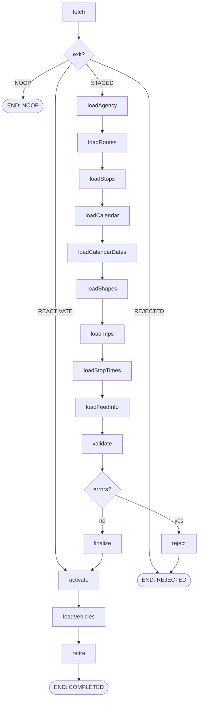

# ETL GTFS static

> Trạng thái: **Review** · Cập nhật: 2026-09-28 · DOC-21
> Phụ thuộc: [DOC-13](../05-data/source-data.md) §2–3, [DOC-14](../05-data/warehouse-model.md) §4–6, [DOC-18](../05-data/data-lifecycle.md), [DOC-19](batch-and-chunk-processing.md), [ADR-0009](../04-adr/0009-gtfs-feed-versioning.md), [ADR-0012](../04-adr/0012-raw-zone-s3-sink.md), [DR](../00-decision-register.md) (DR-02, 09, 10, 12, 24, 67)
> Người dùng chính: `etl` profile `batch` (P2-11), `etl` profile `stream` (§6), DOC-16 (rule DQ dùng `ReferenceData`)

Tài liệu này mô tả `GtfsStaticLoadJob`: lấy feed, lưu raw zone, nạp vào phiên bản `STAGED`, kiểm tra, tính headway, activate, dọn phiên bản cũ; và `ReferenceData`, bản chụp trong bộ nhớ của feed ACTIVE mà ETL streaming và replay dùng để kiểm tra dữ liệu.

## 1. Kích hoạt và tham số

| Kích hoạt | Điều kiện | `runKey` | `sourceUri` |
| --- | --- | --- | --- |
| Khởi động `etl-batch` (`GtfsBootstrapRunner`, sau `ApplicationReadyEvent` và sau `StaleExecutionRecoverer`) | Chưa có feed `ACTIVE` và không có execution `GtfsStaticLoadJob` nào đang chạy | `startup:<ngày nghiệp vụ>` | `pti.gtfs.bootstrap-location` |
| Cron `pti.gtfs.static.cron` (`0 30 3 * * *`, zone `America/Chicago`), `@SchedulerLock("gtfsStaticLoad")` | `pti.gtfs.static.source` khác rỗng | `scheduled:<ngày nghiệp vụ>` | `pti.gtfs.static.source` |
| `ops.job_request` `RUN` (API `POST /etl/jobs`, DOC-32) | — | `manual:<job_request.id>` | tham số `sourceUri` của request, mặc định `pti.gtfs.static.source`, rồi `pti.gtfs.bootstrap-location` |

- **Tham số định danh là `runKey`, không phải `feedHash`.** Hash chỉ biết được sau khi đọc file, và FR-01.1 yêu cầu chạy lại cùng file phải **kết thúc** với `NOOP` chứ không bị từ chối ngay khi khởi chạy. Mỗi lần kích hoạt là một `JobInstance` mới; tính duy nhất theo feed do ràng buộc `gtfs_feed_version_hash_uk` bảo đảm (§3.1).
- `sourceUri` là tham số **không định danh**.
- `allowReactivate` (không định danh, mặc định `false`, chỉ nhận qua `job_request` `RUN`): cho phép kích hoạt lại một phiên bản `RETIRED` có cùng hash (§3.1). Dùng khi cần quay về feed cũ, ví dụ feed mới sai hoặc cần replay dữ liệu cũ theo feed của thời điểm đó (DOC-22 §4.4, RB-05, RB-11).
- Compose để trống `pti.gtfs.static.source`, vì feed được ghim (DOC-13 §2.1). Lịch hằng ngày khi đó không được đăng ký (log `INFO` lúc khởi động). Muốn thử luồng hằng ngày thì đặt biến này.
- `GtfsExclusiveListener` (`JobExecutionListener.beforeJob`): nếu có execution `GtfsStaticLoadJob` khác đang `STARTED` thì execution này dừng ngay với `FAILED`, exit description `Another GtfsStaticLoadJob is running`. Hai feed khác nhau không bao giờ được nạp song song.

### 1.1 Nguồn cho phép

| Scheme | Ví dụ | Điều kiện |
| --- | --- | --- |
| `file:` | `file:/feed/metrotransit-mn-20260926.zip` | Đường dẫn chuẩn hóa phải nằm dưới `pti.gtfs.static.allowed-dirs` (mặc định `/feed`) |
| `s3:` | `s3://raw/gtfs-static/2cfc…23b.zip` | Chỉ bucket `raw`, prefix `gtfs-static/` (nạp lại một feed đã lưu, dùng cho EXP-04 và RB-11) |
| `https:` | URL của agency | Chỉ khi `pti.gtfs.static.allow-http=true` (mặc định `false`); timeout 60 giây; tối đa 200 MB |

URI khác → `job_request` `REJECTED` (đã kiểm ở `JobRequestPoller`) hoặc step `fetch` `FAILED` với lỗi `FATAL`.

## 2. Luồng



| Step | Loại | Chunk | Việc | Restart |
| --- | --- | --- | --- | --- |
| `fetch` | tasklet | — | §3.1 | Chạy lại từ đầu (idempotent) |
| `load<File>` | chunk | 1.000 (`loadStopTimes`, `loadShapes`), 500 (còn lại) | §3.2 | Tiếp từ dòng sau chunk đã commit (`FlatFileItemReader.read.count`) |
| `loadFeedInfo` | tasklet | — | Cập nhật `publisher_name`, `publisher_feed_version` | Idempotent |
| `validate` | tasklet | — | §4 | Idempotent (chỉ đọc, ghi `validation_report`) |
| `reject` | tasklet | — | `status = 'REJECTED'`, ghi report | Idempotent |
| `finalize` | tasklet | — | `gtfs_finalize.sql` (DOC-14 §6.1), một transaction. Trước khi chạy xóa `route_headway` của phiên bản này để chạy lại được | Idempotent |
| `activate` | tasklet | — | `gtfs_activate.sql` (DOC-14 §6.2); `:allowRetired = true` khi đi từ nhánh `REACTIVATE` | Nếu phiên bản đã `ACTIVE` thì coi là xong |
| `loadVehicles` | chunk | 500 | Upsert `dim_vehicle` từ `vehicles.txt` (§3.3) | Upsert nên chạy lại an toàn |
| `retire` | tasklet (`CONTINUABLE`) | — | §5 | Idempotent |

`JobExecutionDecider` đọc exit status của `fetch` và `validate`. Exit status của job: `COMPLETED`, `NOOP` hoặc `REJECTED` (DOC-19 §5.1); nhánh `REACTIVATE` kết thúc `COMPLETED`. Job `REJECTED` vẫn có `BatchStatus.COMPLETED`, nhưng phát alert `GtfsFeedRejected` (DOC-28).

## 3. Các bước

### 3.1 `fetch`

1. Mở `sourceUri` (§1.1), chép vào `<pti.gtfs.static.work-dir>/<jobExecutionId>/feed.zip` và tính SHA-256 trong lúc chép.
2. Nếu đặt `pti.gtfs.static.expected-sha256` mà hash khác → `FATAL` (dùng khi muốn bảo đảm đúng file đã ghim).
3. Tra `dw.gtfs_feed_version` theo `feed_hash`:

| Đã có với trạng thái | Xử lý |
| --- | --- |
| `ACTIVE`, `REJECTED`; hoặc `RETIRED` khi `allowReactivate = false` | Exit `NOOP`. Log `INFO` `Feed <hash> already loaded as <status>` |
| `RETIRED` và `allowReactivate = true` | Exit `REACTIVATE`: decider đi thẳng tới `activate` (bỏ nạp, kiểm tra, finalize vì dữ liệu của phiên bản còn nguyên), rồi `loadVehicles` và `retire` như thường. Log `INFO` `Reactivating feed <hash>` |
| `STAGED`, execution nạp nó (`job_execution_id`) đang chạy | Không thể xảy ra nhờ `GtfsExclusiveListener`; nếu gặp thì `FATAL` |
| `STAGED`, execution nạp nó đã kết thúc (`FAILED`, `STOPPED`, `ABANDONED`) | Phiên bản mồ côi: xóa dữ liệu của nó (thứ tự như §5) rồi nạp lại |
| chưa có | Tiếp tục |

4. Lưu vào raw zone: `HEAD raw/gtfs-static/<hash>.zip`; chưa có thì `PUT` (ADR-0012, DOC-18 §2). Nguồn là `s3:` thì bỏ qua bước này.
5. Giải nén vào `<work-dir>/<jobExecutionId>/feed/`:
   - Chặn zip slip: đường dẫn chuẩn hóa của mỗi entry phải nằm trong thư mục đích.
   - Chỉ giải nén file ở gốc zip có tên trong DOC-13 §2.3; file khác ghi vào `ignored_files`.
   - Giới hạn: tổng dung lượng giải nén 1 GB, tối đa 100 entry, tỷ lệ nén mỗi entry ≤ 100 (chống zip bomb). Vượt → `REJECTED` với lỗi `GV-01`.
6. Kiểm tra cấu trúc (GV-01…GV-03, §4) chỉ bằng header và `agency.txt`. Lỗi → chèn dòng `gtfs_feed_version` với `status = 'REJECTED'`, `validation_report`, rồi exit `REJECTED`.
7. Chèn dòng `gtfs_feed_version` (`feed_hash`, `source_uri`, `raw_object_key`, `agency_timezone`, `status = 'STAGED'`, `job_execution_id`). Nếu vi phạm `gtfs_feed_version_hash_uk` (một execution khác vừa chèn cùng hash) → exit `NOOP`.
8. Ghi vào job `ExecutionContext`: `pti.feedVersionId`, `pti.feedHash`, `pti.agencyZone`.

Bước 1–7 chạy lại được nguyên vẹn nếu `fetch` bị lỗi giữa chừng: chưa có dòng `STAGED` nào được commit trước bước 7, và bước 7 là một transaction.

**Workspace khi restart:** restart có thể chạy trên pod khác (K8s) hoặc sau khi `/tmp` bị xóa. `FeedWorkspaceListener.beforeStep` của mọi step `load*` kiểm tra thư mục giải nén; thiếu thì tải lại `raw/gtfs-static/<hash>.zip` và giải nén lại. Hash được kiểm tra lại sau khi tải.

### 3.2 `load<File>`

- **Reader:** `FlatFileItemReader<Map<String, String>>`, UTF-8, bỏ BOM, `DelimitedLineTokenizer` (dấu phẩy, dấu nháy kép theo RFC 4180). Tên cột lấy từ dòng header (`linesToSkip = 1`, `SkippedLinesCallback` gán tên cột cho tokenizer), nên thứ tự cột trong file không quan trọng. `saveState = true`.
- **Processor:** `Gtfs<File>RowMapper` theo DOC-13 §2.4. Mỗi item có `feed_version_id` từ job context. Lỗi parse (giờ sai, số sai, màu sai, enum ngoài miền) → `GtfsRowException` (loại `DATA`).
- **Writer:** `JdbcBatchItemWriter` với `INSERT` **thuần** (không `ON CONFLICT`): khóa trùng trong feed là lỗi của feed (DOC-13 §2.5) và phải lộ ra. `assertUpdates = true`.
- **Fault tolerance:**
  - `DATA` (lỗi parse ở process; `23505` trùng khóa, `23503` sai khóa ngoại, `23514` check ở write) → skip.
  - `GtfsSkipCollector` (skip listener) ghi lỗi vào `GtfsValidationCollector` **không** vào `dead_letter`: feed được chấp nhận hoặc từ chối nguyên khối, lỗi từng dòng là một phần của `validation_report`. Mỗi `(file, check)` giữ số lượng và tối đa `pti.gtfs.static.report-samples` (20) mẫu `{line, message}`. Collector được lưu vào step `ExecutionContext` sau mỗi chunk (dạng map nhỏ), nên restart không mất số đếm.
  - Không có tỷ lệ skip tối đa: mọi lỗi dòng dẫn tới `REJECTED` ở `validate`. Để feed hỏng hàng loạt không chạy scan quá lâu, `GtfsSkipPolicy` ném `SkipLimitExceededException` khi một step có quá `pti.gtfs.static.max-row-errors` (mặc định 10.000) lỗi; job `FAILED` và alert `BatchJobFailed`, kèm exit description gợi ý feed hỏng.
  - `TRANSIENT_INFRA`: retry theo DOC-19 §4.4.
- **Thứ tự step** theo khóa ngoại: agency → routes → stops → calendar → calendar_dates → shapes → trips → stop_times. `routes` phải trước `trips`, `stops` và `trips` phải trước `stop_times`.
- **Hiệu năng:** `stop_times` (872.717 dòng) khoảng 873 chunk; mục tiêu cả job ≤ 3 phút trên compose (DOC-10). Index của các bảng lịch giữ nguyên khi nạp; không dùng `COPY` vì cần restart theo chunk và skip theo dòng.

### 3.3 `loadVehicles`

Chạy **sau** `activate`, để feed bị từ chối không động tới `dim_vehicle` (bảng không theo phiên bản).

```sql
-- backend/etl/src/main/resources/sql/upsert_dim_vehicle_feed.sql
INSERT INTO dw.dim_vehicle AS t (vehicle_id, vehicle_label, vehicle_model, seated_capacity, standing_capacity,
                                 low_floor, wheelchair_access, fuel, source)
VALUES (:vehicle_id, :vehicle_label, :vehicle_model, :seated_capacity, :standing_capacity,
        :low_floor, :wheelchair_access, :fuel, 'FEED')
ON CONFLICT (vehicle_id) DO UPDATE SET
  vehicle_label = excluded.vehicle_label, vehicle_model = excluded.vehicle_model,
  seated_capacity = excluded.seated_capacity, standing_capacity = excluded.standing_capacity,
  low_floor = excluded.low_floor, wheelchair_access = excluded.wheelchair_access, fuel = excluded.fuel,
  source = 'FEED', updated_at = now()
```

Dòng `REALTIME` có cùng `vehicle_id` được nâng thành `FEED`. Xe không còn trong `vehicles.txt` mới không bị xóa. Lỗi dòng ở step này (hiếm, vì `vehicles.txt` đã được parse ở `fetch` để kiểm header) được skip và ghi vào `validation_report.warnings`; không làm feed bị từ chối vì feed đã ACTIVE.

## 4. Kiểm tra feed (`validate`)

Mỗi kiểm tra có mã `GV-xx`. **Lỗi** làm feed `REJECTED`; **cảnh báo** chỉ ghi vào report. Các kiểm tra SQL chạy trên phiên bản `STAGED` với `statement_timeout = 60s`, file `backend/etl/src/main/resources/sql/gtfs-validate/GV-xx.sql`, trả về số vi phạm và tối đa 20 mẫu.

| Mã | Mức | Kiểm tra | Ở đâu |
| --- | --- | --- | --- |
| GV-01 | Lỗi | Đủ file bắt buộc: `agency`, `routes`, `stops`, `trips`, `stop_times`, và ít nhất một trong `calendar`, `calendar_dates`; `shapes` bắt buộc vì simulator cần (DR-02). Zip hợp lệ và trong giới hạn §3.1 | `fetch` |
| GV-02 | Lỗi | Đủ cột bắt buộc theo đặc tả GTFS cho từng file dùng | `fetch` |
| GV-03 | Lỗi | Đúng một `agency_timezone`, là tên múi giờ IANA hợp lệ | `fetch` |
| GV-04 | Lỗi | Không có lỗi dòng nào ở các step `load*` (parse, trùng khóa, khóa ngoại, check) | collector |
| GV-05 | Lỗi | `routes`, `stops` (loại 0), `trips`, `stop_times` đều có ít nhất 1 dòng | SQL |
| GV-06 | Lỗi | Mỗi trip có ít nhất 2 `stop_times` | SQL |
| GV-07 | Lỗi | Trong một trip, theo `stop_sequence` tăng dần: `departure_seconds[i] ≤ arrival_seconds[i+1]` | SQL (window `lead`) |
| GV-08 | Lỗi | `trips.service_id` có trong `calendar` hoặc `calendar_dates` | SQL |
| GV-09 | Lỗi | `trips.shape_id` khác NULL có trong `shapes`; tỷ lệ trip không có `shape_id` ≤ 1% | SQL |
| GV-10 | Lỗi | Tính được `valid_from`/`valid_to`, và mỗi thứ trong tuần có ít nhất một ngày trong khoảng hiệu lực có chuyến (DOC-13 §2.5) | SQL |
| GV-11 | Cảnh báo | `valid_to` ở quá khứ theo giờ nghiệp vụ (`feed_expired`) | SQL |
| GV-12 | Cảnh báo | `route_type` ngoài {0, 3} (dự án chỉ mô phỏng bus và light rail) | SQL |
| GV-13 | Cảnh báo | Trạm `location_type = 0` có tọa độ (0, 0) hoặc cách tâm bbox > 200 km | SQL |
| GV-14 | Cảnh báo | File bị bỏ qua (`ignored_files`), cột thừa (`extra_columns`) | `fetch` |
| GV-15 | Cảnh báo | Số tuyến, trạm, chuyến lệch > 50% so với phiên bản ACTIVE hiện tại (nếu có) | SQL |

GV-15 là cảnh báo chứ không phải lỗi, vì agency có thể đổi lịch theo mùa. Người vận hành xem report trong Ops console (DOC-36, màn hình Jobs).

`validation_report` (JSONB):

```json
{
  "report_version": 1,
  "result": "ACCEPTED",
  "row_counts": {"agency": 8, "routes": 127, "stops": 8183, "trips": 20220, "stop_times": 872717,
                 "shapes": 320611, "calendar": 19, "calendar_dates": 25, "vehicles": 1233},
  "errors": [],
  "warnings": [
    {"check": "GV-14", "count": 3, "samples": [{"file": "levels.txt"}, {"file": "pathways.txt"}, {"file": "linked_datasets.txt"}]}
  ],
  "extra_columns": {"trips.txt": ["branch_letter", "boarding_type"], "routes.txt": ["route_url"]},
  "duration_ms": {"fetch": 1840, "load": 95210, "validate": 4120, "finalize": 1850}
}
```

Mỗi phần tử `errors` có dạng `{"check": "GV-07", "count": 3, "samples": [{"trip_id": "…", "stop_sequence": 12, "message": "…"}]}`. Message tiếng Anh.

## 5. `retire`: dọn phiên bản cũ

- Giữ `pti.gtfs.static.keep-versions` (mặc định 3) phiên bản `ACTIVE`/`RETIRED` mới nhất theo `activated_at`; bản `RETIRED` cũ hơn bị xóa.
- `REJECTED` và `STAGED` mồ côi có `loaded_at` cũ hơn `pti.gtfs.static.rejected-retention` (mặc định `7d`) bị xóa (DOC-14 §4).
- Xóa theo thứ tự khóa ngoại, mỗi bảng một lần gọi tasklet (`RepeatStatus.CONTINUABLE`), mỗi lần tối đa 50.000 dòng (`DELETE … WHERE ctid IN (SELECT ctid … LIMIT 50000)`), để không có transaction dài và `LAST_UPDATED` được cập nhật đều (DOC-19 §7.2):
  `gtfs_stop_time` → `gtfs_trip` → `route_headway` → `gtfs_shape` → `gtfs_calendar_date` → `gtfs_calendar` → `dim_stop` → `dim_route` → `dim_agency` → `gtfs_feed_version`.
- Object `raw/gtfs-static/<hash>.zip` **không** bị xóa (DOC-18 §1).
- Fact tham chiếu `trip_id`, `route_id` chỉ về mặt logic (không có FK), nên xóa phiên bản cũ không ảnh hưởng fact. Analytics tra lịch theo phiên bản ACTIVE (DOC-23).
- Metric `pti_retention_deleted_total{table}` (DOC-18 §5).

Cuối job, `GtfsWorkspaceCleanupListener.afterJob` xóa `<work-dir>/<jobExecutionId>` khi job không `FAILED`. Thư mục của job `FAILED` được giữ để restart; `GtfsBootstrapRunner` xóa thư mục cũ hơn 2 ngày lúc khởi động.

## 6. `ReferenceData`

Bản chụp bất biến của feed ACTIVE, dùng bởi rule DQ-03…09 (DOC-16) và bởi mapping TripUpdate (`scheduled_arrival`, DOC-20 §4.3). Có ở cả `etl-stream` (luồng trực tiếp) và `etl-batch` (DLQ replay, raw zone replay).

### 6.1 Nội dung

```java
public final class ReferenceData {
  long feedVersionId();
  ZoneId agencyZone();                                  // America/Chicago
  BoundingBox bbox();                                   // stops with location_type = 0 (margin applied by DQ-06)
  boolean hasRoute(String routeId);                     // 127 ids
  boolean hasStop(String stopId);                       // 8,183 ids
  Optional<TripRef> trip(String tripId);                // 20,220 trips: routeId, directionId, serviceId
  boolean runsOn(String serviceId, LocalDate serviceDate);
  /** Scheduled arrival at (trip, stop_sequence) on a service date, or null when unknown. */
  @Nullable Instant scheduledArrival(String tripId, int stopSequence, LocalDate serviceDate);
}

public record TripRef(String routeId, short directionId, String serviceId) {}
```

| Thành phần | Nạp bằng | Cấu trúc | Bộ nhớ ước tính |
| --- | --- | --- | --- |
| Route, stop | `SELECT route_id FROM dw.dim_route_current`, tương tự `dim_stop_current` | `Set<String>` bất biến (`Set.copyOf`) | < 1 MB |
| Trip | `SELECT trip_id, route_id, direction_id, service_id FROM dw.gtfs_trip_current` | `Map<String, TripRef>`, chuỗi `route_id`/`service_id` được intern | khoảng 4 MB |
| Lịch chạy theo ngày | `dw.service_ids_on(:v, :d)` | `Map<LocalDate, Set<String>>` cho các ngày đã nạp | nhỏ |
| Giờ theo trạm | Xem dưới | `Map<String, int[][]>` (`[0]` = stop_sequence tăng dần, `[1]` = arrival_seconds) | khoảng 3 MB mỗi ngày phục vụ |

Giờ theo trạm chỉ nạp cho các chuyến chạy trong ngày phục vụ cần dùng:

```sql
SELECT st.trip_id,
       array_agg(st.stop_sequence   ORDER BY st.stop_sequence) AS seqs,
       array_agg(st.arrival_seconds ORDER BY st.stop_sequence) AS arrs
FROM dw.gtfs_stop_time st
JOIN dw.gtfs_trip t ON t.feed_version_id = st.feed_version_id AND t.trip_id = st.trip_id
WHERE st.feed_version_id = :feedVersionId
  AND t.service_id IN (SELECT dw.service_ids_on(:feedVersionId, :serviceDate))
GROUP BY st.trip_id
```

- Luôn nạp sẵn ngày phục vụ **hôm nay và hôm qua** theo đồng hồ nghiệp vụ (DR-67) và giờ agency; chuyến sau nửa đêm thuộc ngày hôm trước (DQ-09).
- Ngày khác (replay dữ liệu cũ) được nạp khi cần vào Caffeine cache tối đa `pti.etl.reference.extra-days` (3) ngày. Lần nạp đầu một ngày mất khoảng 1 giây, chỉ ảnh hưởng chunk đầu của replay.
- `scheduledArrival` tìm `stopSequence` bằng `Arrays.binarySearch` trên `[0]`, rồi `GtfsTime.toInstant(serviceDate, arr, zone)` (DOC-13 §3).
- Tổng heap khoảng 15 MB (DOC-16 §5), trong ngân sách 640 MB của `etl-batch` và `etl-stream` (DOC-10).

### 6.2 Làm mới

`ReferenceDataHolder` (một bean mỗi JVM) giữ `AtomicReference<ReferenceData>`:

| Sự kiện | Hành động |
| --- | --- |
| Khởi động | Nạp nếu có feed ACTIVE; không có thì `null` (readiness `DOWN`, DOC-20 §6) |
| Mỗi `pti.etl.reference.refresh-interval` (30 giây) | `SELECT feed_version_id … WHERE status = 'ACTIVE'`; khác bản đang giữ thì nạp bản mới trên thread nền rồi thay tham chiếu |
| Qua nửa đêm giờ agency (theo đồng hồ nghiệp vụ) | Nạp giờ theo trạm của ngày mới, bỏ ngày cũ hơn hôm qua, tạo `ReferenceData` mới (các phần khác dùng lại) |
| `etl-batch`, ngay sau step `activate` của chính nó | Làm mới ngay, không chờ chu kỳ |

- Nạp bản mới thất bại thì giữ bản cũ và thử lại ở chu kỳ sau (metric `pti_etl_reference_refresh_errors_total`).
- Chunk đang chạy giữ tham chiếu mà nó lấy lúc bắt đầu (`RuleContext.reference`), nên không bao giờ thấy nửa cũ nửa mới (DOC-16 §7).
- Độ trễ tối đa từ lúc activate tới lúc `etl-stream` dùng feed mới là 30 giây cộng thời gian nạp (khoảng 3 giây). Trong khoảng đó dữ liệu realtime vẫn được kiểm theo feed cũ, chấp nhận được.
- Simulator **không** theo feed ACTIVE của warehouse: nó đóng vai agency và đọc file ở `pti.sim.feed.location` lúc khởi động (DOC-25 §4.1). Đổi feed thì phải đổi `PTI_SIM_FEED_LOCATION`/`PTI_SIM_FEED_SHA256` và restart simulator cùng lúc với việc nạp feed vào warehouse (RB-05). Lệch nhau thì record realtime trỏ `trip_id`/`stop_id` không có trong feed ACTIVE rơi vào DLQ `DQ-03`…`DQ-05`, đúng như khi agency đổi feed ngoài đời.
- Replay luôn kiểm theo feed **ACTIVE hiện tại**, không theo feed có hiệu lực vào thời điểm của dữ liệu. Hạn chế này ghi ở DOC-22.

## 7. Cấu hình

| Key | Kiểu | Mặc định | Mô tả |
| --- | --- | --- | --- |
| `pti.gtfs.bootstrap-location` | URI | — (compose: `file:/feed/metrotransit-mn-20260926.zip`) | Nguồn cho lần nạp đầu (§1) |
| `pti.gtfs.static.source` | URI | rỗng | Nguồn cho lịch hằng ngày; rỗng thì không đăng ký lịch |
| `pti.gtfs.static.cron` / `.zone` | cron / ZoneId | `0 30 3 * * *` / `America/Chicago` | FR-01.1 |
| `pti.gtfs.static.allowed-dirs` | list | `/feed` | §1.1 |
| `pti.gtfs.static.allow-http` | bool | `false` | §1.1 |
| `pti.gtfs.static.expected-sha256` | string | rỗng | §3.1 |
| `pti.gtfs.static.work-dir` | path | `/tmp/pti-gtfs` | |
| `pti.gtfs.static.max-uncompressed-size` / `.max-entries` | DataSize / int | `1GB` / `100` | §3.1 |
| `pti.gtfs.static.max-row-errors` | int | `10000` | §3.2 |
| `pti.gtfs.static.report-samples` | int | `20` | §4 |
| `pti.gtfs.static.keep-versions` | int | `3` | §5, DOC-18 |
| `pti.gtfs.static.rejected-retention` | Duration | `7d` | §5 |
| `pti.etl.reference.refresh-interval` | Duration | `30s` | §6.2 |
| `pti.etl.reference.extra-days` | int | `3` | §6.1 |

## 8. Metrics và log

| Metric | Loại | Label |
| --- | --- | --- |
| `spring.batch.job` / `spring.batch.step` | timer | `name=GtfsStaticLoadJob`, `status` |
| `pti_gtfs_load_total` | counter | `outcome` (`activated` \| `reactivated` \| `noop` \| `rejected` \| `failed`) |
| `pti_gtfs_validation_issues` | gauge (lần chạy gần nhất) | `check`, `level` |
| `pti_gtfs_active_feed_info` | gauge = 1 | `feed_version_id`, `feed_hash` (8 ký tự đầu), `valid_to` |
| `pti_gtfs_active_feed_days_to_expiry` | gauge | — (alert cảnh báo khi < 7, DOC-28) |
| `pti_etl_reference_feed_version` | gauge | — (DOC-20 §12) |

Log `INFO` ở đầu và cuối mỗi step, kèm số dòng. `WARN` cho mỗi cảnh báo GV. Feed bị từ chối: `ERROR` một dòng tóm tắt kèm các mã GV lỗi.

## 9. Lỗi và cách xử lý

| Tình huống | Kết quả |
| --- | --- |
| Cùng file đã nạp | `NOOP` (FR-01.1) |
| Feed có dòng lỗi, thiếu file, lịch trống | `REJECTED`; bản ACTIVE cũ giữ nguyên; alert `GtfsFeedRejected` |
| Pod chết giữa `loadStopTimes` | `StaleExecutionRecoverer` restart; step tiếp từ chunk sau chunk đã commit (FR-03.6, test B-07) |
| Pod chết giữa `activate` | Transaction rollback; restart chạy lại `activate` |
| Pod chết giữa `retire` | Restart tiếp tục xóa; các lệnh xóa idempotent |
| S3 không truy cập được ở `fetch` | `TRANSIENT_INFRA`: step `FAILED` sau retry; lần kích hoạt sau (hoặc restart) chạy lại |
| Không có feed ACTIVE và bootstrap thất bại | `etl-stream` không nhận GTFS-rt (readiness `DOWN`); alert `BatchJobFailed`; RB-05 |
| Hai `job_request` cùng lúc cho hai feed khác nhau | Execution thứ hai `FAILED` bởi `GtfsExclusiveListener`; chạy lại sau |

## 10. Test bắt buộc

Fixture: feed thu nhỏ `backend/common/src/testFixtures/resources/gtfs/mini/` (tuyến 18 và 901, 2 ngày lịch, khoảng 2.000 `stop_times`) và các biến thể hỏng sinh từ nó (DOC-44).

| ID | Kịch bản | Kỳ vọng |
| --- | --- | --- |
| G-01 | Nạp feed mini lần đầu | `ACTIVE`; số dòng mỗi bảng khớp file; `route_headway` có dữ liệu; `dim_vehicle` `FEED` |
| G-02 | Nạp lại cùng file (job_request) | Exit `NOOP`, không thêm dòng nào (FR-01.1) |
| G-03 | Feed thật Minneapolis (test chậm, chạy nightly) | 127 route, 8.183 stop (8.155 loại 0), 872.717 stop_time; job ≤ 3 phút; headway tuyến 18 = 600 giây |
| G-04 | Mỗi biến thể hỏng: thiếu `stop_times.txt`; thiếu cột `trip_id`; hai timezone; trip trỏ route không có; `stop_id` trùng; giờ `25:61:00`; trip 1 trạm; giờ đi lùi; `service_id` không có lịch; thứ Hai không có chuyến | `REJECTED` đúng mã GV; bản ACTIVE trước đó vẫn ACTIVE |
| G-05 | Zip có entry `../../etc/passwd`; zip bomb | `REJECTED` `GV-01`, không file nào ghi ra ngoài work dir |
| G-06 | Kill (`halt`) giữa `loadStopTimes`, restart | Tiếp từ chunk kế tiếp; checksum các bảng lịch khớp lần chạy không lỗi (FR-03.6) |
| G-07 | Xóa work dir trước khi restart | `FeedWorkspaceListener` tải lại từ raw zone; job hoàn tất |
| G-08 | Nạp feed B sau feed A | A `RETIRED`, B `ACTIVE`, tại mọi thời điểm có đúng một ACTIVE (truy vấn song song trong lúc activate) |
| G-09 | Nạp 4 feed liên tiếp | Chỉ còn 3 phiên bản; dữ liệu phiên bản cũ nhất bị xóa hết; zip vẫn còn trong raw zone |
| G-10 | Hai job_request RUN cùng lúc | Một cái chạy, cái kia `FAILED` với lý do rõ ràng |
| G-11 | `ReferenceData`: `scheduledArrival` cho chuyến 25:10 và ngày đổi giờ | Khớp bảng DOC-13 §3 |
| G-12 | `etl-stream` đang chạy, activate feed mới | Trong ≤ 35 giây `pti_etl_reference_feed_version` đổi |
| G-13 | `sourceUri = file:/etc/hosts` | `job_request` `REJECTED` |

## 11. Câu hỏi còn mở

Không có.
