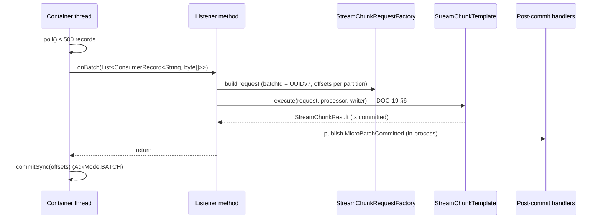

# ETL streaming

> Trạng thái: **Approved** · Cập nhật: 2026-09-28 · DOC-20
> Phụ thuộc: [DOC-19](batch-and-chunk-processing.md), [DOC-09](../03-architecture/messaging-contracts.md), [DOC-14](../05-data/warehouse-model.md) §7–8, [DOC-16](../05-data/data-quality-rules.md), [DOC-18](../05-data/data-lifecycle.md) §4, [ADR-0003](../04-adr/0003-effectively-once-upsert.md), [ADR-0004](../04-adr/0004-offset-commit-after-transaction.md), [ADR-0006](../04-adr/0006-error-classification.md), [DR](../00-decision-register.md) (DR-07, 13, 19, 22, 23, 27, 35, 41, 42, 57, 59, 67)
> Người dùng chính: `etl` profile `stream` (P2-08, P2-09, P2-12…14, P2-18), DOC-23 (analytics), DOC-28 (metric)

Tài liệu này mô tả pod `etl-stream`: bốn listener Kafka, cấu hình consumer, cách mỗi nguồn được parse và ghi, xử lý lỗi hạ tầng, pause/resume, shutdown, sự kiện sau commit và chế độ baseline. Thuật toán chunk dùng chung (`StreamChunkTemplate`, `FactChunkWriter`, DLQ) nằm ở DOC-19 và không nhắc lại ở đây.

## 1. Listener

| Listener id | Topic (partition) | Group | Concurrency | Processor | Ghi vào | Cờ tạm dừng (DR-19) | Khởi động khi |
| --- | --- | --- | --- | --- | --- | --- | --- |
| `gtfs-rt-vehicle-position` | `gtfs.vehicle_positions` (12) | `pti-etl-gtfs-rt` | 3 | `GtfsRtVehiclePositionProcessor` | `dim_vehicle` (placeholder), `fact_vehicle_position`, `vehicle_position_latest` | `etl.consumer.gtfs-rt.paused` | Có feed ACTIVE (§6) |
| `gtfs-rt-trip-update` | `gtfs.trip_updates` (12) | `pti-etl-gtfs-rt` | 3 | `GtfsRtTripUpdateProcessor` | `dim_vehicle` (placeholder), `fact_trip_update` | `etl.consumer.gtfs-rt.paused` | Có feed ACTIVE |
| `ticketing-sales` | `ticketing.sales.cdc` (6) | `pti-etl-ticketing` | 2 | `TicketSaleCdcProcessor` | `dim_sale_point` (placeholder), `fact_ticket_sales` | `etl.consumer.ticketing.paused` | Ngay |
| `ticketing-sale-points` | `ticketing.sale_points.cdc` (1) | `pti-etl-ticketing` | 1 | `SalePointCdcProcessor` | `dim_sale_point` | `etl.consumer.ticketing.paused` | Ngay |

- Mỗi listener là một `ConcurrentMessageListenerContainer` riêng. Hai listener chung group vẫn độc lập về assignment vì mỗi container chỉ subscribe topic của nó.
- Tổng cộng 9 consumer thread trên một pod. Mỗi thread xử lý các poll của nó tuần tự; thứ tự trong một partition (một nhóm tuyến, ADR-0008) được giữ.
- Pod thứ hai (P7, KEDA) chia partition với pod đầu. Giới hạn trên có ích là 4 pod (12 partition / 3 thread).
- `ticketing.sale_points.cdc` chỉ có một partition và ít thay đổi. Việc nó "đi trước" sales không được bảo đảm; placeholder `INFERRED` xử lý trường hợp ngược (DOC-09 §5.3).

## 2. Cấu hình consumer

Áp cho mọi listener, đặt trong `ConsumerFactory` chung (`EtlKafkaConfig`):

| Property | Giá trị | Lý do |
| --- | --- | --- |
| `bootstrap.servers` | `${KAFKA_BOOTSTRAP_SERVERS}` (compose: `kafka:9092`) | |
| `group.protocol` | `classic` | Cần `CooperativeStickyAssignor`; giao thức mới (KIP-848) xem lại ở P7 |
| `partition.assignment.strategy` | `org.apache.kafka.clients.consumer.CooperativeStickyAssignor` | Rebalance tăng dần: thêm hoặc bớt pod chỉ thu hồi partition cần chuyển, thread khác không dừng |
| `enable.auto.commit` | `false` | ADR-0004. Baseline là ngoại lệ (§9) |
| `auto.offset.reset` | `earliest` | Group mới đọc từ đầu retention (DOC-09 §1.1) |
| `max.poll.records` | `500` | Một poll là một chunk (DR-22) |
| `fetch.min.bytes` | `65536` | Gom micro-batch |
| `fetch.max.wait.ms` | `1000` | Chờ tối đa 1 giây nếu chưa đủ `fetch.min.bytes`, giữ độ trễ trong ngân sách NFR-03 |
| `max.partition.fetch.bytes` | `1048576` | Mặc định |
| `max.poll.interval.ms` | `300000` | Một chunk bình thường dưới 1 giây; 5 phút để chịu được scan và retry |
| `session.timeout.ms` / `heartbeat.interval.ms` | `45000` / `3000` | Mặc định của Kafka 4 |
| `key.deserializer` | `StringDeserializer` | |
| `value.deserializer` | `ByteArrayDeserializer` | Không bao giờ ném lỗi ở tầng Kafka; giải mã UTF-8 trong processor để byte hỏng thành lỗi `DESERIALIZE` có lưu payload (§4.1) |
| `client.id` | `${HOSTNAME}-<listener id>` | Nhận diện trong metric của broker |
| `isolation.level` | `read_uncommitted` | Không producer nào dùng transaction |

Container (`ConcurrentKafkaListenerContainerFactory` tên `etlBatchListenerFactory`):

| Thiết lập | Giá trị |
| --- | --- |
| `batchListener` | `true` |
| `ackMode` | `BATCH` |
| `syncCommits` / `syncCommitTimeout` | `true` / `10s` |
| `pollTimeout` | `1s` |
| `shutdownTimeout` | `30s` |
| `missingTopicsFatal` | `true`: topic do `kafka-init` tạo trước (DOC-39); thiếu topic là lỗi cấu hình |
| `observationEnabled` | `true` |
| `commonErrorHandler` | §5 |
| `autoStartup` | `false` cho listener GTFS-rt (do `ListenerLifecycleManager` bật, §6); `true` cho ticketing |

## 3. Vòng xử lý một poll



```java
@Component
@Profile("stream")
class GtfsRtVehiclePositionListener {

  @KafkaListener(id = "gtfs-rt-vehicle-position", topics = "gtfs.vehicle_positions",
                 groupId = "pti-etl-gtfs-rt", containerFactory = "etlBatchListenerFactory",
                 concurrency = "${pti.etl.listener.gtfs-rt-vehicle-position.concurrency:3}",
                 autoStartup = "false")
  void onBatch(List<ConsumerRecord<String, byte[]>> records) {
    StreamChunkRequest request = requestFactory.create(EtlSource.GTFS_RT_VEHICLE_POSITION,
        "gtfs-rt-vehicle-position", "pti-etl-gtfs-rt", records);
    try (var ignored = EtlMdc.open(request)) {
      template.execute(request, processor, writer);
    }
  }
}
```

Quy ước:

- `StreamChunkRequestFactory` đổi mỗi `ConsumerRecord` thành `InboundMessage` (DOC-19 §4.1), ghi `offsets` dạng `{"gtfs.vehicle_positions-7": [918273, 918512]}` và `min_record_ts`.
- `EtlMdc` đặt `batch_id`, `source`, `listener` vào MDC, và gỡ ra khi đóng.
- **Trace:** observation của Spring Kafka cho batch listener không nối được trace của từng record. `StreamChunkTemplate` mở span `etl.chunk` và thêm **span link** tới `traceparent` của tối đa `pti.etl.trace.max-links` (mặc định 20) record đầu tiên. Tempo hiện link, nên từ trace của simulator vẫn lần tới chunk (NFR-05).
- Poll rỗng không gọi listener (Spring Kafka mặc định), nên không sinh dòng `etl_stream_batch` rỗng.

## 4. Theo từng nguồn

### 4.1 Giải mã và envelope (GTFS-rt)

1. Giải mã `byte[]` bằng `CharsetDecoder` UTF-8 với `CodingErrorAction.REPORT`. Lỗi → `DataException(DESERIALIZE, "Invalid UTF-8")`; payload lưu vào DLQ được giải mã lại với `REPLACE`.
2. Ký tự `U+0000` được thay bằng `U+FFFD` trước khi lưu DLQ (Postgres `TEXT` không nhận NUL).
3. Jackson đọc envelope thành `JsonNode` (`DESERIALIZE` nếu hỏng).
4. `(entity_type, schema_version)` chọn JSON Schema và DTO:

| `entity_type` | `schema_version` | DTO | Ghi chú |
| --- | --- | --- | --- |
| `VEHICLE_POSITION` | 1 | `VehiclePositionV1` | `occupancy_status = NULL` |
| `VEHICLE_POSITION` | 2 | `VehiclePositionV2` | DR-59 |
| `TRIP_UPDATE` | 1 | `TripUpdateV1` | |
| khác | khác | — | DLQ `SCHEMA`, `rule_id = DQ-01`, `error_message = "Unsupported schema_version 3 for VEHICLE_POSITION"` (FR-01.5) |

Listener VP nhận message `TRIP_UPDATE` (producer gửi nhầm topic) thì cũng vào DLQ `SCHEMA`.

5. Validate `JsonNode` theo JSON Schema (thư viện `com.networknt:json-schema-validator`, schema nạp một lần lúc khởi động), rồi map sang DTO với `FAIL_ON_UNKNOWN_PROPERTIES`, rồi Bean Validation. Vi phạm đầu tiên thành `error_message` (tên trường và lý do, tiếng Anh).
6. Rule theo record DQ-03…09 (DOC-16 §2.4).

### 4.2 VehiclePosition → dòng ghi

| Cột | Từ |
| --- | --- |
| `service_date` | `start_date` (`YYYYMMDD` → `LocalDate`) |
| `vehicle_id`, `trip_id`, `route_id`, `direction_id`, `lat`, `lon`, `bearing`, `speed_mps`, `current_stop_sequence`, `stop_id`, `current_status` | cùng tên trong payload |
| `occupancy_status` | v2; v1 là `NULL` |
| `event_timestamp` | envelope |
| `schema_version`, `payload_hash` | envelope; hash theo DOC-09 §9 |
| `batch_id` | request |

Cùng dữ liệu tạo một dòng `vehicle_position_latest`. Trong một chunk, writer chỉ giữ dòng latest có `event_timestamp` lớn nhất cho mỗi `vehicle_id`; guard ở DOC-14 §8.4 lo phần còn lại. `vehicle_id` được đưa vào `WriteSet.vehicleIds` cho placeholder `dim_vehicle` (§4.5).

### 4.3 TripUpdate → nhiều dòng (DR-13)

Mỗi phần tử `stop_time_updates[i]` thành một dòng `fact_trip_update`:

| Cột | Từ |
| --- | --- |
| `service_date` | `start_date` |
| `trip_id`, `route_id`, `direction_id`, `vehicle_id` | payload |
| `stop_sequence`, `stop_id`, `schedule_relationship` | phần tử |
| `arrival_time`, `departure_time` | `arrival.time`, `departure.time` (có thể NULL) |
| `delay_seconds` | `arrival.delay`, nếu không có thì `departure.delay`, nếu không có thì NULL |
| `scheduled_arrival` | Tra `ReferenceData.scheduledArrival(trip_id, stop_sequence, service_date)`; không có thì NULL (DQ-23 kiểm sau) |
| `is_observed` | `coalesce(arrival.time, departure.time) ≤ event_timestamp`; phần tử `SKIPPED`/`NO_DATA` là `false` |
| `event_timestamp`, `payload_hash`, `batch_id` | envelope và request; mọi dòng của một message chung một hash |

`scheduled_arrival` cần giờ lịch theo trạm. Để `ReferenceData` không phình, nó chỉ giữ `stop_times` của **ngày phục vụ hiện tại và hôm trước** theo giờ nghiệp vụ, dạng mảng nén (DOC-21 §6).

### 4.4 CDC ticketing (DR-07)

1. `value == null` (tombstone): bỏ qua, đếm `read` nhưng không ghi và không vào DLQ. Với `delete.tombstone.handling.mode=rewrite` thì không có tombstone; nhánh này chỉ để phòng cấu hình connector bị đổi.
2. Map sang `TicketTransactionCdc` / `SalePointCdc` (DOC-16 §2.2); `customer_ref` bị bỏ ngay khi đọc JSON.
3. `__op = d` hoặc `__deleted = "true"` → `is_deleted = true`. Message delete sau unwrap mang trạng thái **trước khi xóa** (REPLICA IDENTITY FULL, DOC-13), nên đủ trường để qua validation.
4. `sale_date` = ngày của `created_at` theo giờ `America/Chicago`; `event_timestamp` = `__source_ts_ms`; `source_lsn` = `__lsn`.
5. Hash theo DOC-09 §9 (bỏ `__lsn`, `__source_ts_ms`, `customer_ref`).
6. Rule DQ-10, 11 theo record; DQ-02, 12, 13 theo chunk (trong writer, DOC-19 §4.3).
7. `sale_point_id` của giao dịch được đưa vào placeholder `INFERRED` (§4.5).

Snapshot (`__op = r`) đi cùng đường với `c`. Snapshot ban đầu của Debezium có thể tạo vài trăm nghìn message; consumer đuổi kịp ở tốc độ tối đa và DQ-12 được bỏ qua với `r` (DOC-16 §2.3).

### 4.5 Placeholder dimension

Writer ghi placeholder **trước** fact, trong cùng transaction:

```sql
-- backend/etl/src/main/resources/sql/insert_dim_vehicle_realtime.sql
INSERT INTO dw.dim_vehicle (vehicle_id, source)
VALUES (:vehicle_id, 'REALTIME')
ON CONFLICT (vehicle_id) DO NOTHING
```

`insert_dim_sale_point_inferred.sql` ở DOC-14 §8.5.

Để tránh một câu `INSERT` cho mỗi chunk, `KnownKeyCache` (Caffeine, tối đa 20.000 key mỗi loại, không hết hạn) nhớ các `vehicle_id` và `sale_point_id` **đã commit**. Cache chỉ được thêm key sau khi transaction commit; rollback không làm cache sai. Cache mất khi restart thì chỉ tốn thêm vài câu `DO NOTHING`.

## 5. Xử lý lỗi hạ tầng

### 5.1 Error handler

```java
@Bean
CommonErrorHandler etlErrorHandler(ErrorClassifier classifier, ListenerContainerPauseService pauseService,
                                   EtlStreamProperties props) {
  var backOff = new ExponentialBackOff(props.retry().initialInterval().toMillis(), props.retry().multiplier());
  backOff.setMaxInterval(props.retry().maxInterval().toMillis());   // 30 s
  backOff.setMaxElapsedTime(Long.MAX_VALUE);                         // retry forever (FR-02.8)

  var transientHandler = new DefaultErrorHandler(NEVER_RECOVER, backOff,
      new ContainerPausingBackOffHandler(pauseService));
  transientHandler.setClassifications(Map.of(), true);               // every exception reaching it is retried

  var delegating = new CommonDelegatingErrorHandler(transientHandler);
  delegating.setErrorHandlers(new LinkedHashMap<>(Map.of(
      FatalException.class, new CommonContainerStoppingErrorHandler())));
  delegating.setCauseChainTraversing(true);
  return delegating;
}
```

- Listener không bao giờ ném lỗi `DATA` (DOC-19 §6.2). Mọi exception thoát ra là `TransientInfraException` hoặc `FatalException`: `StreamChunkTemplate` gói exception gốc theo kết quả của `ErrorClassifier`.
- `NEVER_RECOVER` là recoverer ném `IllegalStateException` ("recoverer must never be reached"), vì backoff vô hạn nên không bao giờ tới; nếu tới thì container dừng thay vì âm thầm bỏ record.
- Với batch listener, `DefaultErrorHandler` gặp exception không phải `BatchListenerFailedException` thì thử lại **cả batch** theo backoff, không commit offset. `ContainerPausingBackOffHandler` pause container trong lúc chờ để consumer vẫn poll (rỗng) và giữ membership.
- Tên lớp và hành vi chính xác được xác minh ở S-06. Hành vi bắt buộc, kiểm bằng test S-07 (§12): (1) offset không commit; (2) consumer không rời group; (3) backoff 1 → 30 giây, không giới hạn số lần; (4) không có gì vào DLQ.

### 5.2 Circuit breaker tới warehouse

Bốn listener cùng ghi một Postgres. Khi Postgres chết, không nên để 9 thread cùng thử kết nối liên tục.

- Resilience4j `CircuitBreaker` tên `warehouse`, bọc lời gọi `StreamChunkTemplate.execute`:
  - `slidingWindowType=COUNT_BASED`, `slidingWindowSize=10`, `minimumNumberOfCalls=5`, `failureRateThreshold=50`;
  - `waitDurationInOpenState=10s`, `permittedNumberOfCallsInHalfOpenState=2`;
  - chỉ `TransientInfraException` được tính là lỗi (`recordExceptions`); `DATA` không bao giờ tới đây, `FATAL` không tính.
- Khi mạch mở, `execute` ném `CallNotPermittedException`; `ErrorClassifier` xếp nó vào `TRANSIENT_INFRA`, nên error handler backoff như lỗi DB thật mà không chạm Postgres.
- `CircuitBreakerPauseListener` nghe sự kiện chuyển trạng thái: `OPEN` → pause mọi container của `etl-stream`; `HALF_OPEN` → resume để một vài poll thử lại; `CLOSED` → giữ resume. Pause do mạch và pause do cờ (§7) được theo dõi riêng; container chỉ resume khi **không còn lý do pause nào**.
- Readiness **không** chuyển `DOWN` khi mạch mở (pod vẫn sống và đang chờ, restart không giúp gì). Liveness cũng vậy.

### 5.3 Lỗi `FATAL`

Container của listener đó dừng; các listener khác chạy tiếp. Alert `ConsumerStopped` (DOC-28). Người vận hành xem log, sửa lỗi, rồi restart pod (RB-03). Offset chưa commit nên không mất gì.

## 6. `ReferenceData` và khởi động

- `ReferenceDataHolder` giữ `AtomicReference<ReferenceData>` của feed ACTIVE (DOC-21 §6).
- Lúc khởi động và mỗi `pti.etl.reference.refresh-interval` (mặc định 30 giây), `ReferenceDataRefresher` đọc `SELECT feed_version_id FROM dw.gtfs_feed_version WHERE status = 'ACTIVE'`. Khác bản đang giữ thì nạp bản mới (khoảng 3 giây với feed Minneapolis) rồi thay nguyên khối. Chunk đang chạy giữ tham chiếu cũ tới hết (DOC-16 §7). Qua nửa đêm theo giờ nghiệp vụ thì cũng nạp lại phần `stop_times` theo ngày (§4.3).
- `ListenerLifecycleManager`: khi có `ReferenceData` lần đầu, bật (`start()`) hai listener GTFS-rt, trừ khi cờ tạm dừng đang bật (khi đó bật rồi pause ngay).
- `ReferenceDataHealthIndicator` thuộc nhóm readiness: `DOWN` với `reason = "no active feed"` khi chưa có `ReferenceData`. Ticketing vẫn chạy trong lúc này.
- Nạp lại lỗi (DB lỗi tạm thời): giữ bản cũ, log `WARN`, thử lại ở chu kỳ sau; metric `pti_etl_reference_refresh_errors_total`.

### 6.1 Health indicator theo nguồn (DR-38)

Ba health contributor, đăng ký bằng `HealthContributorRegistry` với đúng tên của DR-38, nằm trong health group `sources` (`/actuator/health/sources`, cổng management). Group này **không** thuộc `readiness` hay `liveness`, vì nguồn lỗi không phải lý do để K8s restart hay bỏ pod khỏi service.

| Contributor | `UP` khi | Chi tiết trả về |
| --- | --- | --- |
| `warehouse-db` | Circuit breaker `warehouse` `CLOSED` và `SELECT 1` (timeout 1 giây, cache 5 giây) thành công | `circuitState`, `lastErrorAt` |
| `source-gtfs-rt` | `warehouse-db` `UP`; hai listener GTFS-rt đang chạy và không bị pause vì `backoff`/`circuit`; chunk commit gần nhất của nguồn GTFS-rt trên pod này cách đây < `pti.etl.health.freshness` (30 giây) | `lastCommitAt`, `maxRecordTs`, `pausedReasons` |
| `source-ticketing` | `warehouse-db` `UP`; hai listener ticketing đang chạy; connector `debezium-ticketing` `RUNNING` với mọi task `RUNNING` (Kafka Connect REST `GET /connectors/debezium-ticketing/status`, cache 15 giây); và (lag của group `pti-etl-ticketing` bằng 0 **hoặc** chunk gần nhất < 30 giây) | `connectorState`, `lastCommitAt`, `lag` |

- Pause vì cờ (§7) làm nguồn tương ứng `OUT_OF_SERVICE`, không phải `DOWN`: người vận hành chủ động dừng thì auto-replay cũng không nên chạy.
- Ticketing dùng điều kiện "lag = 0 hoặc có chunk gần đây", vì ban đêm có thể không có giao dịch nào trong 30 giây mà nguồn vẫn khỏe.
- triage-worker đọc group này qua HTTP tới service `etl-stream` (DOC-24 §6.6). Group bật `management.endpoint.health.group.sources.show-components=always` và `show-details=never` (DOC-29) để response có trạng thái từng component mà không lộ chi tiết. Nhiều pod thì mỗi lần gọi trúng một pod; với 12 partition chia đều, pod nào cũng có dữ liệu nên kết quả đại diện được.
- Gauge `pti_source_health{source}`: 1 = `UP`, 0 = khác. Alert `GtfsRtFeedStale` không dựa vào indicator này mà dựa vào dữ liệu trong DB (DOC-28), để vẫn báo được khi mọi pod `etl-stream` đã chết.

## 7. Pause/resume theo cờ

`RuntimeFlagRefresher` (DOC-19 §2.1) đọc `ops.runtime_flag` mỗi 5 giây và phát `RuntimeFlagChanged`. `ListenerPauseCoordinator`:

| Cờ | Listener |
| --- | --- |
| `etl.consumer.gtfs-rt.paused = true` | pause `gtfs-rt-vehicle-position`, `gtfs-rt-trip-update` |
| `etl.consumer.ticketing.paused = true` | pause `ticketing-sales`, `ticketing-sale-points` |

- Dùng `KafkaListenerEndpointRegistry.getListenerContainer(id).pause()`. Container hoàn tất poll đang xử lý, commit, rồi mới pause. Partition vẫn được giữ, lag tăng.
- Metric `pti_etl_listener_paused{listener, reason}` với `reason ∈ {flag, circuit, backoff}` bằng 1 khi đang pause vì lý do đó. Alert `ConsumerLagHigh` bỏ qua listener có `reason="flag"` (DOC-28).

## 8. Sau commit: analytics, sự kiện UI, latency

Mọi việc ở đây là **best-effort** và không bao giờ làm chunk hay offset lỗi (DR-35, DR-42).

1. **`MicroBatchCommitted(source, batchId, routeIds, minEventTs, maxEventTs, minRecordTs, committedAt)`** được publish (in-process) sau khi `execute` trả về. `committedAt` là giờ thật lúc commit, dùng cho `pti_analytics_dispatch_delay_seconds` và `pti_ui_commit_to_publish_seconds`. `AnalyticsDispatcher` (DOC-23 §4) nhận bằng `@EventListener` + `@Async("analyticsExecutor")`: micro-batch VehiclePosition kích hoạt bunching, micro-batch TripUpdate kích hoạt phát hiện gián đoạn, ticketing không kích hoạt gì (chạy theo job). Executor: 2 thread, queue 1.000, policy `DiscardOldest` kèm metric `pti_analytics_dropped_total`. Mất một sự kiện chỉ làm insight trễ tới tick 30 giây kế tiếp.
2. **`vehicles.batch`**: `VehiclesBatchPublisher` nhận `MicroBatchCommitted` của VP, gom vị trí mới nhất theo `vehicle_id` vào map trong bộ nhớ (lấy từ `StreamChunkResult`, không đọc lại DB). Mỗi giây (`@Scheduled(fixedRate = 1000)`, không cần ShedLock vì mỗi pod phát phần của nó), với mỗi `route_id` có thay đổi thì publish một sự kiện lên `pti.events.ui`, key `route_id`, `source_record_ts` = timestamp record cũ nhất góp vào sự kiện (DOC-09 §6, DR-57). Payload ở DOC-33.
3. Producer sự kiện UI theo DOC-09 §1.2; gửi lỗi thì log `WARN` và tăng `pti_ui_events_publish_errors_total`.
4. **Metric `pti_etl_kafka_to_commit_seconds`** (histogram, label `source`): với mỗi record trong chunk, `commitTime − recordTimestamp`. Chặng đầu của NFR-03 (DR-57).

## 9. Chế độ baseline (DR-27)

Chạy như một container riêng `etl-stream-baseline` (compose profile `experiment`, DOC-39): cùng image, profile Spring `stream,experiment`.

| Khác biệt | Giá trị |
| --- | --- |
| Listener | Chỉ hai listener GTFS-rt, `groupId = pti-exp-baseline`, id có hậu tố `-baseline`. Listener ticketing không được tạo |
| Writer | `BaselineFactWriter`: `INSERT` thuần vào `exp.exp_fact_vehicle_position`, `exp.exp_fact_trip_update` (không UNIQUE), không placeholder, không `vehicle_position_latest` |
| `pti.etl.baseline.offset-commit=auto` | `enable.auto.commit=true`, `auto.commit.interval.ms=1000`, `AckMode` không dùng. Offset có thể được commit **trước** khi dữ liệu ghi xong |
| `pti.etl.baseline.error-mode=fail-batch` | Một record lỗi làm cả poll ném `DataBatchFailedException` (DOC-19 §6.2). Profile `experiment` thêm vào `CommonDelegatingErrorHandler` (§5.1) một `DefaultErrorHandler` riêng cho exception này với `FixedBackOff(0, 0)` và recoverer chỉ log: poll bị bỏ qua, cả poll mất, đúng như baseline cần đo |
| `pti.etl.baseline.dedup=off` | Không dùng `dedup_registry` |
| Sau commit | Không phát `MicroBatchCommitted`, không phát sự kiện UI |

`BaselineModeGuard` (`@PostConstruct`) ném `IllegalStateException` nếu có key `pti.etl.baseline.*` khác mặc định mà profile `experiment` không bật (P2-18).

## 10. Shutdown

`SIGTERM` (compose `stop_grace_period: 45s`, K8s `terminationGracePeriodSeconds: 45`):

1. Readiness chuyển `OUT_OF_SERVICE` (Spring Boot tự làm khi bắt đầu shutdown).
2. `SmartLifecycle` của các container dừng trước các bean khác (phase cao nhất). Mỗi container ngừng poll, **chờ listener đang chạy trả về** (tối đa `shutdownTimeout` 30 giây), commit offset của poll đó, rời group (`LeaveGroup`, rebalance nhanh cho pod còn lại).
3. `VehiclesBatchPublisher` flush lần cuối; producer `close(5s)`.
4. Executor analytics: `awaitTermination(5s)`; việc chưa làm bị bỏ (tick 30 giây ở pod khác hoặc lần khởi động sau bù lại).
5. Hikari đóng pool.

Quá 45 giây thì runtime kill. Poll đang dở chưa commit offset nên được giao lại; upsert làm kết quả không đổi.

## 11. Cấu hình

| Key | Kiểu | Mặc định | Mô tả |
| --- | --- | --- | --- |
| `pti.etl.listener.<id>.concurrency` | int | bảng §1 | Số thread của một listener |
| `pti.etl.consumer.max-poll-records` | int | `500` | |
| `pti.etl.consumer.fetch-max-wait` | Duration | `1s` | |
| `pti.etl.consumer.fetch-min-bytes` | int | `65536` | |
| `pti.etl.retry.initial-interval` / `.multiplier` / `.max-interval` | Duration / double / Duration | `1s` / `2.0` / `30s` | Backoff lỗi hạ tầng ở streaming (vô hạn số lần) |
| `resilience4j.circuitbreaker.instances.warehouse.*` | | §5.2 | |
| `pti.etl.reference.refresh-interval` | Duration | `30s` | §6 |
| `pti.etl.health.freshness` | Duration | `30s` | §6.1 (DR-38) |
| `pti.etl.health.connect-url` | URI | `http://kafka-connect:8083` | §6.1 |
| `pti.etl.trace.max-links` | int | `20` | §3 |
| `pti.etl.known-key-cache.max-size` | int | `20000` | §4.5 |
| `pti.etl.ui-events.enabled` | bool | `true` | Tắt phát `vehicles.batch` (test hiệu năng) |
| `pti.etl.ui-events.flush-interval` | Duration | `1s` | |
| `pti.etl.analytics.executor.threads` / `.queue-capacity` | int | `2` / `1000` | §8 |
| `pti.kafka.topic-prefix` | string | rỗng | Ghép trước tên topic ở DOC-09 cho mọi listener và producer; chỉ đổi trong integration test (DOC-44 §6.2) |
| `pti.etl.baseline.offset-commit` / `.error-mode` / `.write-mode` / `.dedup` | enum | `manual` / `skip` / `upsert` / `on` | Chỉ đổi được trong profile `experiment` |

## 12. Metrics và log

| Metric | Loại | Label | Ghi chú |
| --- | --- | --- | --- |
| `kafka_consumer_*` (Micrometer, gồm `records_lag_max`) | gauge | `client_id`, `topic`, `partition` | Lag cho alert `ConsumerLagHigh` |
| `spring_kafka_listener_seconds` | timer | `name` (listener id), `result` | Observation của Spring Kafka |
| `pti_etl_records_total` | counter | `source`, `mode="stream"`, `outcome` | DOC-19 §10 |
| `pti_etl_chunk_duration_seconds` | histogram | `source`, `write_mode` | |
| `pti_etl_kafka_to_commit_seconds` | histogram | `source` | §8 |
| `pti_etl_listener_paused` | gauge | `listener`, `topic`, `reason` | §7 |
| `pti_etl_listener_running` | gauge | `listener`, `topic` | 0 khi container dừng (alert `ConsumerStopped`) |
| `pti_etl_stream_batches_total` | counter | `source`, `status` | Khớp dòng `ops.etl_stream_batch`; chỉ cho dashboard (DOC-28 §3.3) |
| `pti_ui_commit_to_publish_seconds` | histogram | `type` | Chặng 3 của NFR-03 (DR-71) |
| `pti_connect_connector_running` | gauge | `connector` | Từ Kafka Connect REST mỗi 15 giây (DR-71), alert `ConnectorDown` |
| `resilience4j_circuitbreaker_state` | gauge | `name="warehouse"`, `state` | |
| `pti_etl_reference_feed_version` | gauge | — | `feed_version_id` đang dùng |
| `pti_etl_reference_refresh_errors_total` | counter | — | |
| `pti_ui_events_published_total` / `pti_ui_events_publish_errors_total` | counter | `type` | |
| `pti_dq_violations_total` | counter | `source`, `stage`, `rule` | DOC-16 §4 |

Log: như DOC-19 §10. Thêm `INFO` khi listener start/pause/resume/stop (kèm lý do), khi `ReferenceData` đổi phiên bản, khi mạch đổi trạng thái.

## 13. Lỗi và cách xử lý

| Tình huống | Hành vi | Mất dữ liệu? |
| --- | --- | --- |
| Message hỏng, sai schema, vi phạm DQ | DLQ, chunk commit | Không (nằm trong DLQ) |
| Postgres dừng 30 giây | Chunk lỗi → retry có backoff, mạch mở, container pause; Postgres lên → mạch half-open → chạy tiếp từ offset chưa commit | Không (FR-02.8) |
| Kafka broker restart | Client tự kết nối lại; poll trả rỗng trong lúc chờ; commit offset lỗi `RetriableCommitFailedException` → poll đó được giao lại | Không |
| Rebalance giữa lúc xử lý | Cooperative: partition bị thu hồi chỉ sau khi poll hiện tại xong (`onPartitionsRevoked` chờ listener) | Không |
| Pod bị `kill -9` | Poll dở được giao lại cho pod khác hoặc cho pod mới | Không; trùng được upsert xử lý (NFR-04: phục hồi < 60 giây) |
| Chưa có feed ACTIVE | Listener GTFS-rt không chạy, readiness `DOWN`; ticketing chạy | Không (lag tăng rồi đuổi kịp) |
| Lỗi lập trình trong writer | `FATAL`, container dừng, alert | Không (offset không commit) |
| `vehicles.batch` gửi lỗi | Log, metric; bản đồ cập nhật ở giây sau hoặc qua refetch | Không (dữ liệu nằm ở DB) |

## 14. Test bắt buộc

Testcontainers (Kafka 4.3, Postgres 17), fixture tuyến 18 (DOC-44). Test chung với job batch nằm ở DOC-19 §12 (ký hiệu [2]).

| ID | Kịch bản | Kỳ vọng |
| --- | --- | --- |
| S-01 | Publish 1 VP v1, 1 VP v2 | 2 dòng fact; v2 có `occupancy_status`; `vehicle_position_latest` có bản mới nhất; dòng `etl_stream_batch` `COMPLETED` |
| S-02 | VP có `schema_version = 3` | DLQ `SCHEMA` `DQ-01`, `error_message` nêu version (FR-01.5) |
| S-03 | TU 12 phần tử (5 quan sát, 7 dự đoán) | 12 dòng; `is_observed` đúng 5 dòng; `scheduled_arrival` khớp lịch |
| S-04 | TU mới hơn cho cùng chuyến, phần tử đã quan sát nay là dự đoán | Giữ giá trị quan sát (DOC-14 §8.6 ca 6) |
| S-05 | CDC: INSERT, UPDATE `VOIDED`, DELETE trên DB nguồn thật (Debezium Testcontainers) | Dòng fact tạo, cập nhật, `is_deleted = true` (FR-01.3) |
| S-06 | Sale trước sale point | Dòng `INFERRED`, sau đó được thay bằng `CDC` |
| S-07 | Dừng Postgres 30 giây giữa luồng 2.000 message | DLQ không tăng; `pti_etl_listener_paused{reason="circuit"}` = 1 trong lúc dừng; sau khi chạy lại, số dòng = số business key trong ledger (FR-02.8) |
| S-08 | Byte không phải UTF-8, và payload chứa `\u0000` | DLQ `DESERIALIZE`, `raw_payload` lưu được |
| S-09 | Bật cờ `etl.consumer.gtfs-rt.paused` | Trong ≤ 10 giây listener GTFS-rt pause, ticketing vẫn chạy; tắt cờ thì chạy tiếp |
| S-10 | Khởi động khi chưa có feed ACTIVE, rồi activate feed | Readiness `DOWN` → `UP`; listener GTFS-rt tự bật; không record nào vào DLQ vì thiếu feed |
| S-11 | Activate feed mới giữa luồng | `pti_etl_reference_feed_version` đổi; không lỗi, không DLQ ngoài dự kiến |
| S-12 | Hai pod, dừng một pod bằng `SIGTERM` | Pod còn lại nhận partition; không mất, không trùng so với ledger; pod dừng trong < 45 giây |
| S-13 | Writer ném `NullPointerException` | Container đó dừng, `pti_etl_listener_running` = 0, listener khác chạy; offset không commit |
| S-14 | Profile `experiment` với `offset-commit=auto`, kill giữa chunk | Mất > 0 trong `exp_fact_*` (baseline hoạt động đúng thiết kế) |
| S-15 | Khởi động không có profile `experiment` nhưng đặt `PTI_ETL_BASELINE_DEDUP=off` | App không khởi động |
| S-16 | `vehicles.batch` | Mỗi giây tối đa một sự kiện cho mỗi route; `source_record_ts` = timestamp cũ nhất |
| S-17 | Tombstone (`value = null`) | Không ghi, không DLQ, `records_read` tính 1 |

## 15. Câu hỏi còn mở

Không có. S-06 (2026-09-28) đã xác minh trên Spring Kafka 4.1.1 với broker 4.3.1: `DefaultErrorHandler(null, backOff, new ContainerPausingBackOffHandler(new ListenerContainerPauseService(registry, scheduler)))` giao lại cả batch sau khi container tạm dừng; consumer mặc định dùng `group.protocol = classic` (DOC-11 §1).
