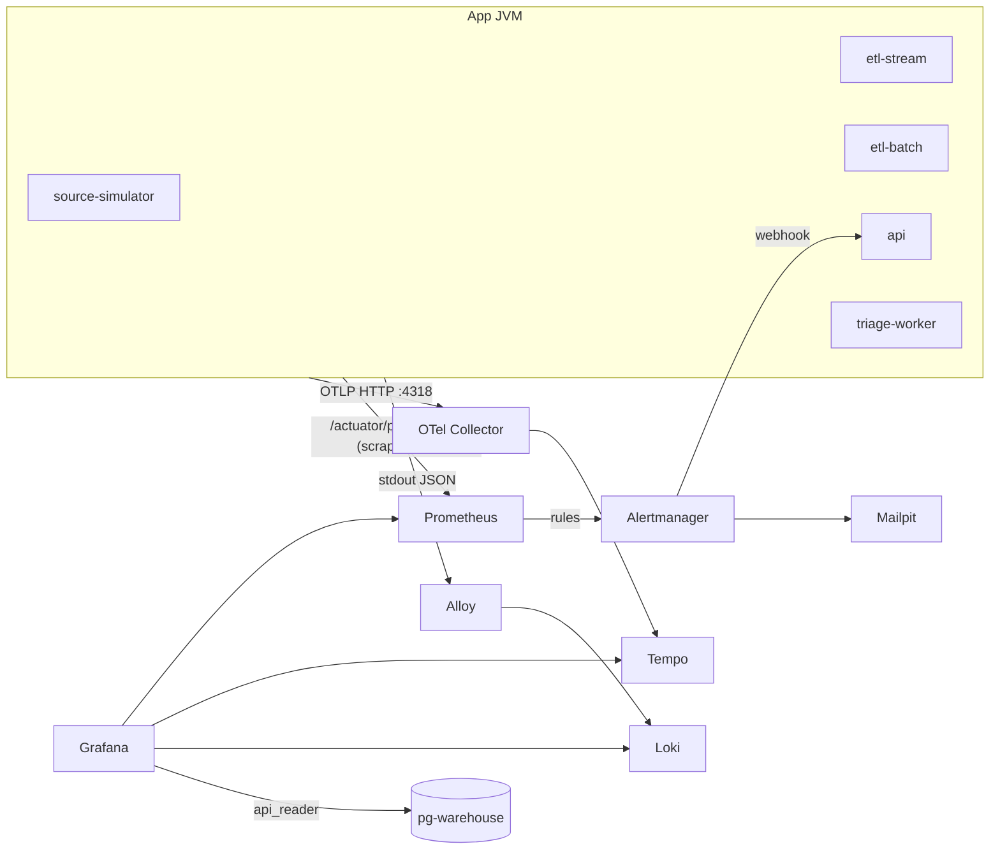

# Observability: metric, log, trace, dashboard, alert

> Trạng thái: **Approved** · Cập nhật: 2026-09-30 (P3-05: alert đếm sự kiện, `CircuitBreakerOpen`, DR-99) · DOC-28
>
> Phụ thuộc: DR-50, DR-51, DR-57, DR-71, ADR-0022, DOC-10 §2, DOC-16 §4, DOC-19 §10, DOC-20 §12, DOC-21 §8, DOC-22 §9, DOC-23 §14, DOC-25 §12, DOC-30 §4–5, DOC-39 §3.7
>
> Người dùng chính: mọi app (P3-03), người dựng stack observability (P3-02, P3-04, P3-05), DOC-42 (runbook), DOC-45 (thực nghiệm)

## 1. Tổng quan



| Tín hiệu | Đường đi | Lưu (compose) | Lưu (k3d, P7) |
| --- | --- | --- | --- |
| Metric | Micrometer → `/actuator/prometheus` (cổng management 9080) → Prometheus scrape | 7 ngày | kube-prometheus-stack, 7 ngày |
| Trace | Micrometer Observation → Micrometer Tracing (bridge OTel) → OTLP → OTel Collector → Tempo | 3 ngày | Tempo, 3 ngày |
| Log | Structured logging của Spring Boot (ECS) ra stdout → Alloy (`loki.source.docker`) → Loki | 7 ngày | Alloy DaemonSet → Loki |
| Alert | Rule Prometheus → Alertmanager → Mailpit và webhook API (DR-51) | — | Như compose |

Nguyên tắc:

1. **Không dùng exporter riêng trên compose** (DOC-39 §3.7). Số liệu Kafka lấy từ metric Kafka client mà Micrometer xuất; số liệu Postgres lấy qua datasource Postgres của Grafana và metric app. Số liệu mà hai nguồn này không có thì app phát (DR-71).
2. **Một bộ rule cho mọi môi trường.** Trên k3d có thêm exporter của Strimzi và CNPG để xem dashboard, nhưng alert chỉ dùng metric của app.
3. **Không dùng OTel Java agent** (DR-50). Mọi span đến từ Micrometer Observation.
4. **Cardinality thấp.** Không có label theo `vehicle_id`, `trip_id`, `stop_id`, `transaction_id`, `batch_id`, `trace_id`, `user`, hay URI chưa chuẩn hóa. Các id này nằm trong log và trace.

## 2. Quy ước metric

- Tên Prometheus có tiền tố `pti_` với metric của dự án, đơn vị ở hậu tố (`_seconds`, `_bytes`), counter kết thúc bằng `_total`. Trong code dùng tên dạng chấm của Micrometer (`pti.etl.records` → `pti_etl_records_total`).
- Mọi metric có tag chung `application` = `spring.application.name`: `source-simulator`, `etl-stream`, `etl-batch`, `api`, `triage-worker` (`etl` đặt tên theo profile trong `application-stream.yml` và `application-batch.yml`). Prometheus thêm `instance` và `job` (`pti-<application>`).
- Label `source` luôn dùng đúng giá trị của domain `ops.etl_source` (DOC-15): `GTFS_RT_VEHICLE_POSITION`, `GTFS_RT_TRIP_UPDATE`, `TICKETING_SALES`, `TICKETING_SALE_POINTS`, `GTFS_STATIC`.
- Histogram thời gian có bucket cố định (`management.metrics.distribution.slo.<name>`), không dùng percentile tính ở client:
  - Độ trễ dữ liệu (`pti_end_to_end_latency_seconds`, các chặng DR-57): `0.25, 0.5, 1, 2, 3, 4, 5, 7.5, 10, 15, 20, 30, 60`.
  - Chunk và câu lệnh DB (`pti_etl_chunk_duration_seconds`): `0.01, 0.025, 0.05, 0.1, 0.25, 0.5, 1, 2, 5, 10`.
  - HTTP (`http_server_requests_seconds`): `0.025, 0.05, 0.1, 0.2, 0.3, 0.5, 1, 2, 5`.
- Gauge tính từ DB (`pti_dlq_open_records`, `pti_dq_check_*`, `pti_source_last_event_age_seconds`) được làm mới theo lịch và đọc từ DB, nên đúng cả sau khi pod restart. Khi nhiều pod cùng phát, dashboard và alert dùng `max by (...)` hoặc `min by (...)` (ghi rõ ở từng rule).

## 3. Danh mục metric

Cột **Có từ** là phase phát metric. Metric của P4 và P6 được liệt kê để đặt tên sẵn; DOC-26, DOC-31 và DOC-24 có thể thêm label nhưng không đổi tên.

### 3.1 Chung cho mọi app JVM (Micrometer, Spring Boot)

| Metric | Loại | Label chính | Dùng cho |
| --- | --- | --- | --- |
| `jvm_memory_used_bytes`, `jvm_gc_pause_seconds`, `jvm_threads_live_threads`, `process_cpu_usage`, `system_cpu_usage` | gauge/timer | `area`, `id`, `action` | Dashboard JVM |
| `hikaricp_connections_active`, `hikaricp_connections_pending`, `hikaricp_connections_acquire_seconds` | gauge/timer | `pool` | DB bottleneck |
| `http_server_requests_seconds` | timer (histogram) | `method`, `uri`, `status`, `outcome` | API, API simulator, actuator |
| `executor_*` | gauge/counter | `name` | Executor analytics, batch |
| `pti_errors_total` | counter | `application`, `kind` (`data`, `transient_infra`, `fatal`), `type` | DOC-30 §5 |
| `up` | gauge (Prometheus) | `job`, `instance` | `TargetDown` |

### 3.2 `source-simulator` (DOC-25 §12)

| Metric | Loại | Label | Ý nghĩa |
| --- | --- | --- | --- |
| `pti_sim_messages_sent_total` | counter | `topic`, `entity_type`, `kind` (`valid`, `invalid`, `resend`) | Message đã được Kafka ack |
| `pti_sim_send_errors_total` | counter | `topic` | |
| `pti_sim_emissions_skipped_total` | counter | `reason` | |
| `pti_sim_active_vehicles`, `pti_sim_active_trips`, `pti_sim_synthetic_vehicles` | gauge | — | |
| `pti_sim_ledger_queue_depth`, `pti_sim_ledger_rows_total` | gauge / counter | — | |
| `pti_sim_resend_queue_depth` | gauge | — | Bản gửi lại đang chờ (kịch bản `duplicates`); EXP-02 |
| `pti_sim_tick_lag_seconds` | gauge | — | > 2 s: simulator không theo kịp, số đo tải không còn hợp lệ |
| `pti_sim_rate_multiplier` | gauge | `stream` | Tải hiện tại (EXP-05, EXP-07) |
| `pti_sim_ticket_transactions_total`, `pti_sim_ticketing_errors_total` | counter | `txn_type`, `action` | |
| `pti_sim_scenario_active` | gauge | `scenario` | Annotation trên dashboard |
| **`pti_source_replication_slot_retained_bytes`** | gauge | `slot` | **Mới (DR-71).** `pg_wal_lsn_diff(pg_current_wal_lsn(), restart_lsn)` từ `pg_replication_slots` trên `pg-source`, mỗi 30 giây. Truy vấn lỗi thì gauge giữ giá trị cũ và tăng `pti_sim_slot_probe_errors_total` |

### 3.3 `etl-stream` (DOC-20 §12)

| Metric | Loại | Label | Ý nghĩa |
| --- | --- | --- | --- |
| `kafka_consumer_fetch_manager_records_lag`, `…_records_lag_max` | gauge | `client_id`, `topic`, `partition` | Lag theo partition, do Kafka client tính lúc fetch. **Chỉ đúng khi consumer đang fetch**: partition bị pause hoặc consumer chết thì không có số mới; các trường hợp đó do `ConsumerPaused`, `ConsumerStopped`, `TargetDown`, `GtfsRtFeedStale` bắt |
| `kafka_consumer_coordinator_rebalance_total` | counter | `client_id` | Rebalance |
| `spring_kafka_listener_seconds` | timer | `name`, `result` | Observation của Spring Kafka |
| `pti_etl_records_total` | counter | `source`, `mode` (`stream` \| `batch`), `outcome` (`written` \| `duplicate` \| `skipped`) | Throughput; `skipped` = vào DLQ |
| `pti_etl_stream_batches_total` | counter | `source`, `status` (`COMPLETED`, `COMPLETED_WITH_SKIPS`, `FAILED`) | **Mới.** Khớp với dòng `ops.etl_stream_batch`. `FAILED` là một lần thử bị rollback (thường do lỗi hạ tầng và sẽ được thử lại), nên chỉ dùng cho dashboard, không dùng để alert |
| `pti_etl_chunk_duration_seconds` | histogram | `source`, `mode`, `write_mode` (`batch` \| `scan`) | Thời gian từ đầu transaction tới commit |
| `pti_etl_duplicates_total` | counter | `source`, `mode`, `reason` (`in_chunk` \| `registry` \| `guard`) | Tách `outcome="duplicate"` theo nơi phát hiện (DOC-19 §10); EXP-02 |
| `pti_etl_chunk_scan_total` | counter | `source`, `mode` | |
| `pti_etl_kafka_to_commit_seconds` | histogram | `source` | Chặng 1–2 của NFR-03 (DR-57, DR-71) |
| `pti_ui_commit_to_publish_seconds` | histogram | `type` | **Mới (DR-71).** Chặng 3: `publishTime − commitTime` của micro-batch mới nhất góp vào sự kiện UI |
| `pti_etl_listener_running` | gauge | `listener`, `topic` | 0 khi container dừng |
| `pti_etl_listener_paused` | gauge | `listener`, `topic`, `reason` (`flag`, `circuit`, `backoff`) | Thêm label `topic` (một listener đọc đúng một topic) để rule lag loại được listener đang pause theo cờ |
| `resilience4j_circuitbreaker_state` | gauge | `name` (`warehouse`), `state` | |
| `pti_source_health` | gauge | `source` | 1 = `UP` (DOC-20 §6.1) |
| **`pti_connect_connector_running`** | gauge | `connector` | **Mới (DR-71).** 1 khi connector và mọi task `RUNNING` theo `GET /connectors/<name>/status`, mỗi 15 giây; không gọi được Connect thì 0 |
| `pti_etl_reference_feed_version`, `pti_etl_reference_refresh_errors_total` | gauge / counter | — | |
| `pti_ui_events_published_total`, `pti_ui_events_publish_errors_total` | counter | `type` | |
| `pti_analytics_dropped_total` | counter | — | Sự kiện `MicroBatchCommitted` bị bỏ vì queue đầy |
| `pti_analytics_runs_total` | counter | `detector`, `trigger`, `outcome` (`ok`, `noop`, `skipped_locked`, `error`) | DOC-23 §14. Ở `etl-stream` `trigger` là `batch` hoặc `tick` |
| `pti_analytics_run_seconds` | histogram | `detector` | Bucket của chunk (§2) |
| `pti_analytics_dispatch_delay_seconds` | histogram | — | Từ commit micro-batch tới lúc analytics bắt đầu chạy (FR-05.1); bucket độ trễ |
| `pti_analytics_episodes_total` | counter | `detector`, `event`, `reason` | Mở/đóng episode bunching, disruption |
| `pti_analytics_open_episodes` | gauge | `detector` | Đếm từ DB mỗi 30 giây |
| `pti_analytics_late_batches_total`, `pti_analytics_skipped_ticks_total` | counter | `detector` | Điều kiện hợp lệ của EXP-04 C5 (DOC-23 §2.2, §11.6) |
| `pti_analytics_bunching_evaluations_total` | counter | `result`, `reason` | DOC-23 §5 |
| `pti_dq_violations_total` | counter | `source`, `stage`, `rule` | DOC-16 §4 |
| `pti_dlq_records_total` | counter | `source`, `stage`, `mode`, `result` | DOC-22 §9 |

### 3.4 `etl-batch` (DOC-19 §10, DOC-21 §8, DOC-22 §9, DOC-16 §4)

| Metric | Loại | Label | Ý nghĩa |
| --- | --- | --- | --- |
| `spring_batch_job_seconds` | timer | `spring_batch_job_name`, `spring_batch_job_status` | Có sẵn của Spring Batch; `_count` tăng khi job kết thúc |
| `spring_batch_step_seconds`, `spring_batch_item_read_seconds`, `spring_batch_item_process_seconds`, `spring_batch_chunk_write_seconds` | timer | `spring_batch_job_name`, `spring_batch_step_name`, `…_status` | |
| `pti_batch_stale_recovered_total` | counter | `job` | |
| `pti_batch_job_requests_total` | counter | `kind`, `outcome` | |
| `pti_gtfs_load_total` | counter | `outcome` (`activated`, `reactivated`, `noop`, `rejected`, `failed`) | |
| `pti_gtfs_validation_issues` | gauge | `check`, `level` | |
| `pti_gtfs_active_feed_info` | gauge = 1 | `feed_version_id`, `feed_hash`, `valid_to` | |
| `pti_gtfs_active_feed_days_to_expiry` | gauge | — | |
| `pti_replay_requests_total` | counter | `kind`, `outcome` | |
| `pti_replay_records_total` | counter | `source`, `outcome` | |
| `pti_replay_duration_seconds` | histogram | `kind` | |
| `pti_dlq_open_records` | gauge | `source`, `status` | Từ DB mỗi 60 giây |
| `pti_dlq_resolved_by_replay_total` | counter | `source` | |
| `pti_dq_check_violations` | gauge | `rule` | Từ `ops.dq_check_result` (lần chạy gần nhất) mỗi 60 giây |
| `pti_dq_check_breached` | gauge | `rule` | **Mới.** 1 khi lần chạy gần nhất vượt ngưỡng alert của rule (DOC-16 §3; ngưỡng tương đối như "> 0,1% số dòng" được job tính sẵn). DQ-26 (severity 0) luôn 0 |
| `pti_dq_check_last_run_timestamp_seconds` | gauge | `rule` | Từ DB |
| `pti_dq_check_interval_seconds` | gauge | `rule` | **Mới.** Chu kỳ khai báo của rule, để rule `DataQualityCheckStale` không phải chép lịch |
| `pti_dq_check_errors_total` | counter | `rule` | Rule quá `statement_timeout` |
| `pti_analytics_runs_total`, `pti_analytics_run_seconds`, `pti_analytics_skipped_ticks_total` | như §3.3 | như §3.3 | Job ETA, OTP, ticketing anomaly và `AnalyticsRecomputeJob` (`trigger` = `job` hoặc `recompute`) |
| `pti_analytics_ticketing_anomalies_total` | counter | `trigger` | Chỉ luồng trực tiếp (không đếm khi recompute) |
| `pti_analytics_recompute_rows_total` | counter | `detector`, `op` (`upserted`, `deleted`) | DOC-23 §11 |

### 3.5 `api` (DOC-26 §12, DOC-31 §15, DOC-33 §7)

| Metric | Loại | Label | Ý nghĩa |
| --- | --- | --- | --- |
| `pti_end_to_end_latency_seconds` | histogram | `channel` (`vehicles`, `alerts`) | NFR-03: `emitTime − source_record_ts`. Đo **một lần cho mỗi sự kiện ở mỗi pod**, lúc sự kiện rời ring buffer để ghi ra các kết nối, không nhân theo số kết nối. Sự kiện có `source_record_ts = null` không được đo |
| `pti_api_publish_to_emit_seconds` | histogram | `channel` | **Mới (DR-71).** Chặng 4–5: `emitTime − occurred_at` |
| `pti_source_last_event_age_seconds` | gauge | `source` (`GTFS_RT_VEHICLE_POSITION`, `GTFS_RT_TRIP_UPDATE`, `TICKETING_SALES`) | **Mới (DR-71).** `businessNow − max(event_timestamp)` (vé: `max(created_at)`), truy vấn mỗi 15 giây bằng cùng câu SQL với `GET /system/freshness` (FR-15.2). DB không đọc được thì gauge vắng mặt và `ApiErrorRateHigh` hoặc `TargetDown` báo thay |
| `pti_api_problems_total` | counter | `type`, `status` | DOC-30 §5 |
| `pti_api_sse_connections` | gauge | `channel`, `audience` (`public` \| `authenticated`) | DOC-26 §12 |
| `pti_api_sse_connections_opened_total` | counter | `replay` (`none`, `exact`, `time`, `resync`) | Cách xử lý `Last-Event-ID` (DOC-26 §5) |
| `pti_api_sse_connections_closed_total` | counter | `reason` (`CloseReason`, DOC-26 §3) | |
| `pti_api_sse_events_emitted_total` | counter | `channel`, `type` | |
| `pti_api_sse_dropped_total` | counter | `reason` (`slow_client`, `buffer_overflow`) | |
| `pti_api_sse_buffer_events` | gauge | — | Kích thước ring buffer |
| `pti_api_sse_consumer_lag_seconds` | gauge | — | `now − occurredAt` của sự kiện cuối cùng consumer SSE nhận |
| `pti_api_sse_invalid_events_total` | counter | — | Envelope không đọc được (DOC-33 §6) |
| `pti_api_rate_limited_total` | counter | `bucket` | Bucket4j (DR-45) |
| `pti_alert_webhook_total` | counter | `outcome` (`created`, `duplicate`, `resolved`, `unknown_resolved`, `rejected`) | Webhook Alertmanager → `alert_event` (DOC-32 E-80) |
| `pti_api_write_requests_total` | counter | `operation`, `outcome` (`created`, `idempotent`, `rejected`) | Thao tác ghi của người vận hành; giá trị `operation` ở DOC-31 §15 |
| `pti_api_db_query_seconds` | timer | `datasource`, `query` (tên file SQL) | DOC-31 §15 |
| `cache_gets_total`, `cache_size` | counter/gauge | `cache`, `result` | Caffeine |

### 3.6 `triage-worker` (P6, DOC-24 §18)

| Metric | Loại | Label |
| --- | --- | --- |
| `pti_triage_calls_total` | counter | `use_case` (`dlq`, `ticketing`, `disruption`, `dispatch`), `outcome` (`ok`, `timeout`, `error`, `invalid`, `rejected`, `quota`) |
| `pti_triage_call_seconds` | histogram | `use_case` |
| `pti_triage_decisions_total` | counter | `use_case`, `source` (`none` với insight), `category`, `severity` (`0`, `1`, `2`, `none`) |
| `pti_triage_auto_replay_total` | counter | `decision` (`scheduled`, `pending_confirm`, `manual`, `requested`), `reason` |
| `pti_triage_backlog` | gauge | `use_case` |
| `pti_triage_lease_lost_total`, `pti_triage_lease_expired_total` | counter | `use_case` |
| `pti_triage_paused` | gauge | `reason` (`circuit_open`, `quota`, `fatal`, `provider_disabled`) |
| `pti_triage_source_up` | gauge | `source` |
| `resilience4j_circuitbreaker_state`, `resilience4j_bulkhead_available_concurrent_calls` | gauge | `name="decision-model"` |

`etl` phát thêm `pti_dlq_rule_category_total{source, category}` (DOC-22 §9) cho luật chặn cuối FR-09.8.

### 3.7 Ánh xạ tên trong SDD gốc

| SDD 12.1 | Metric trong dự án |
| --- | --- |
| `records_processed_total` | `pti_etl_records_total{outcome="written"}` |
| `records_failed_total` | `pti_etl_records_total{outcome="skipped"}` (chi tiết theo stage: `pti_dlq_records_total`) |
| `records_duplicate_total` (FR-03.3) | `pti_etl_records_total{outcome="duplicate"}` |
| `dlq_size` | `pti_dlq_open_records` |
| `batch_duration_seconds` | `pti_etl_chunk_duration_seconds` (stream), `spring_batch_job_seconds` (batch) |
| `consumer_lag` | `kafka_consumer_fetch_manager_records_lag` |
| `end_to_end_latency_seconds` | `pti_end_to_end_latency_seconds` |
| `kafka_to_commit_seconds`, `commit_to_emit_seconds` (DR-57) | `pti_etl_kafka_to_commit_seconds`; `pti_ui_commit_to_publish_seconds` + `pti_api_publish_to_emit_seconds` |

## 4. Log

### 4.1 Định dạng

- `logging.structured.format.console=ecs` cho mọi app; không có log dạng text ở compose và k3d (profile `local` trên máy dev có thể dùng text).
- Trường bắt buộc: `@timestamp`, `log.level`, `log.logger`, `message`, `service.name` (= `application`), `service.version` (git SHA), `trace.id`, `span.id` (khi có span), `process.thread.name`. Trường riêng `pti.*` theo DOC-30 §4: `pti.batch_id`, `pti.source`, `pti.job`, `pti.listener`, `pti.error_kind`, `pti.stage`, `pti.rule_id`, `pti.replay_request_id`, `pti.problem_type`.
- `batch_id` vào MDC ngay khi sinh (trước transaction, DOC-19 §4) và bị xóa khi chunk kết thúc; `trace.id`/`span.id` do Micrometer Tracing đặt.
- Không log payload ở mức trên `DEBUG`, không log secret hay trường trong `pti.pii.blocklist` (DOC-30 §4, DOC-18 §4).

### 4.2 Loki

- Alloy parse JSON, gắn **label** chỉ gồm `service` (tên service compose hoặc label `app.kubernetes.io/name`), `level`, `env` (`compose` \| `k3d`). `trace_id`, `batch_id`, `source`, `job` đưa vào **structured metadata** (Loki 3), không làm label.
- Grafana datasource Loki có derived field `trace_id` → Tempo. Datasource Tempo có `tracesToLogsV2` → Loki theo `trace_id`.
- Truy vấn mẫu (dùng trong runbook):

```logql
# Every log line of one micro-batch (NFR-05: fact row → batch_id → logs → trace)
{service="etl-stream"} | batch_id="0192f3c4-7b1e-7c3a-9d2e-5f6a7b8c9d0e"

# Chunks that fell back to scan in the last hour
{service=~"etl-.*", level="INFO"} |= "scan fallback" | json | line_format "{{.pti_source}} {{.pti_batch_id}}"

# Fatal errors
{service=~"etl-.*|api|triage-worker"} | json | pti_error_kind="FATAL"
```

- **Kiểm NFR-05:** truy vấn `sum(count_over_time({service="etl-stream", level=~"INFO|WARN|ERROR"} | json | logger=~"dev.pti.etl.core.*" | batch_id="" [1h]))` phải bằng 0 (mọi log trong phạm vi chunk có `batch_id`). Chạy trong EXP-05 và ghi kết quả vào DOC-45.

## 5. Trace

### 5.1 Lấy mẫu

| App | `management.tracing.sampling.probability` (compose) | k3d | Lý do |
| --- | --- | --- | --- |
| `source-simulator` | `0.05` | `0.01` | Mỗi message một span producer; 143 msg/s ở cao điểm sẽ vượt dung lượng Tempo |
| `etl-stream`, `etl-batch` | `1.0` | `0.2` | Một span gốc cho mỗi poll (khoảng 6/s), không phải mỗi record |
| `api` | `1.0` | `0.2` | Loại `/actuator/**` và kết nối SSE dài bằng `ObservationPredicate` |
| `triage-worker` | `1.0` | `1.0` | Ít lời gọi; cần trace cho mọi lần gọi Jev |

Trong EXP-05 và EXP-07, runner đặt `etl-*` và `api` về `0.1` để đo tải không bị ảnh hưởng bởi tracing (DOC-45).

### 5.2 Danh sách span

| Span (tên observation) | App | Cha / link | Tag (low cardinality) | Ghi chú |
| --- | --- | --- | --- | --- |
| `<topic> send` | simulator, etl (UI), api | cha: span hiện tại | `messaging.destination.name` | Observation của `KafkaTemplate` (`spring.kafka.template.observation-enabled=true`); ghi `traceparent` vào header |
| `pti.etl.poll` | etl-stream | **gốc**, link tới tối đa `pti.etl.trace.max-links` (20) span producer lấy từ header | `source`, `listener`, `outcome` | Batch listener không có observation theo record; span này do `StreamChunkTemplate` tạo (DOC-20 §3). Event: `records=<n>` |
| `pti.etl.process` | etl-stream | cha `pti.etl.poll` | `source` | Decode, schema, DQ pre-write, gộp trùng trong chunk |
| `pti.etl.dedup` | etl-stream, etl-batch | cha chunk | `source` | Tra `dedup_registry`. *Không làm (DR-98):* câu tra đã hiện thành span JDBC `query` dưới `pti.etl.write` |
| `pti.etl.write` | etl-stream, etl-batch | cha chunk | `source`, `write_mode` | `FactChunkWriter`; con là span JDBC nếu bật (§5.3) |
| `pti.etl.dlq.write` | etl-* | cha chunk | `source`, `stage` | |
| `pti.etl.commit` | etl-stream | cha `pti.etl.poll` | | Commit transaction; offset ack nằm ngoài span này |
| `pti.analytics.run` | etl-stream | **gốc mới**, link tới `pti.etl.poll` | `detector` | Chạy trên executor riêng sau commit (DR-22) |
| `pti.ui.publish` | etl-stream | cha `pti.analytics.run` hoặc `pti.ui.flush` | `type` | Con là span `pti.events.ui send` |
| `spring.batch.job`, `spring.batch.step`, `spring.batch.chunk.write` | etl-batch | Observation có sẵn của Spring Batch | `spring.batch.job.name`, `…step.name`, `…status` | Bật bằng `ObservationRegistry` trong `JobRepository`/`JobOperator` config (DOC-19 §3) |
| `pti.events.ui receive` | api | cha: `traceparent` trong header | `type` | Observation của listener (`spring.kafka.listener.observation-enabled=true`, listener theo record) |
| `pti.api.sse.emit` | api | cha: `pti.events.ui receive` | `channel` | Kết thúc khi đã ghi cho mọi kết nối |
| `http.server.requests` | api, simulator | gốc hoặc theo `traceparent` của request | `uri`, `method`, `status` | Frontend không gửi `traceparent` (không có OTel ở trình duyệt) |
| `pti.triage.call` | triage-worker | cha: span poll việc | `use_case`, `outcome` | Bao quanh lời gọi Jev; con là span HTTP client |

Chuỗi nhìn thấy trên Tempo cho một vị trí xe: `gtfs.vehicle_positions send` (simulator, nếu được lấy mẫu) ⇠ link ⇠ `pti.etl.poll` → `process` → `write` → `commit`; `pti.ui.flush` → `pti.ui.publish` → `pti.events.ui send` → (api) `pti.events.ui receive` → `pti.api.sse.emit`.

### 5.3 JDBC

Span JDBC dùng `net.ttddyy.observation:datasource-micrometer-spring-boot` (DOC-11), chỉ bật loại `QUERY` (không bật `CONNECTION`, `FETCH`) và chỉ ở `etl-*` và `api`. Tên câu lệnh lấy từ comment đầu file SQL (`-- name: upsert_fact_vehicle_position`) nên span không chứa tham số.

### 5.4 Từ dữ liệu tới trace

1. Dòng fact có `batch_id` → `ops.etl_stream_batch` (nguồn, listener, offset, pod) hoặc `ops.etl_batch_step` (job, step).
2. `batch_id` → Loki (§4.2) → dòng log có `trace_id` → Tempo.
3. Với dead letter: `dead_letter.batch_id` và vị trí Kafka → cùng đường như trên (truy vết đầy đủ ở DOC-22 §7).

## 6. Alert

### 6.1 Quy ước

- Rule nằm trong `deploy/compose/observability/prometheus/rules/pti-*.yml` (k3d: `PrometheusRule` sinh từ cùng file bằng Helm, DOC-40).
- Label: `severity` ∈ {`critical`, `warning`, `info`} (tương ứng "Khẩn", "Cảnh báo" của SDD 12.2), `area` ∈ {`pipeline`, `data`, `source`, `platform`, `api`}, cộng các label nhóm (`source`, `topic`, `listener`, `job`…).
- Annotation: `summary` (một dòng tiếng Anh, có giá trị hiện tại), `description`, `runbook_url` (`https://github.com/<owner>/<repo>/blob/main/docs/09-operations/runbooks/RB-xx.md`), `dashboard_url`.
- **Đếm sự kiện rời rạc.** Counter có label phụ thuộc dữ liệu chỉ xuất hiện ở sự kiện đầu tiên, đã mang giá trị 1 (DR-98); `increase()` cần hai mẫu nên đọc sự kiện đầu tiên là 0 và alert không bắn. Bảng §6.3 viết `events(X, w)` thay cho `(X unless X offset w) or increase(X[w])`: series mới xuất hiện trong cửa sổ được tính bằng chính giá trị của nó, series đã có từ trước tính bằng `increase` (DR-99).
- **Không tính baseline.** `etl-stream-baseline` của thực nghiệm (DR-27, job `pti-etl-stream-baseline`) cùng `application="etl-stream"` nhưng chỉ chạy listener GTFS-rt và có consumer group riêng. Recording rule và alert trạng thái listener loại job này (`job!="pti-etl-stream-baseline"`), nếu không `ConsumerStopped` bắn cho listener vé vốn không chạy ở baseline, còn lag và tốc độ bị cộng gấp đôi (DR-99).
- **Gauge không được chặn scrape.** Gauge đọc trạng thái phụ thuộc (DB, Connect REST) chỉ đọc giá trị đã cache; việc kiểm tra thật chạy nền có timeout. Nếu không, `/actuator/prometheus` treo khi phụ thuộc chết và alert thành `TargetDown` thay vì alert đúng nguyên nhân (DR-99).
- Mỗi rule có unit test `promtool test rules` trong `deploy/compose/observability/prometheus/tests/` (mỗi alert tối thiểu một ca bắn và một ca không bắn). Job `compose-config` của CI chạy `promtool check rules` và `promtool test rules` (DOC-41 §2).

### 6.2 Recording rule

```yaml
groups:
  - name: pti-recording
    interval: 30s
    rules:
      - record: pti:etl_input:rate5m
        expr: sum by (source) (rate(pti_etl_records_total{mode="stream", job!="pti-etl-stream-baseline"}[5m]))
      - record: pti:etl_skipped:rate5m
        expr: sum by (source) (rate(pti_etl_records_total{mode="stream", outcome="skipped", job!="pti-etl-stream-baseline"}[5m]))
      - record: pti:kafka_lag:sum
        expr: sum by (topic) (kafka_consumer_fetch_manager_records_lag{application="etl-stream", job!="pti-etl-stream-baseline"})
      - record: pti:e2e_latency:p95_5m
        expr: histogram_quantile(0.95, sum by (le, channel) (rate(pti_end_to_end_latency_seconds_bucket[5m])))
      - record: pti:kafka_to_commit:p95_5m
        expr: histogram_quantile(0.95, sum by (le, source) (rate(pti_etl_kafka_to_commit_seconds_bucket{job!="pti-etl-stream-baseline"}[5m])))
      - record: pti:commit_to_publish:p95_5m
        expr: histogram_quantile(0.95, sum by (le) (rate(pti_ui_commit_to_publish_seconds_bucket[5m])))
      - record: pti:publish_to_emit:p95_5m
        expr: histogram_quantile(0.95, sum by (le) (rate(pti_api_publish_to_emit_seconds_bucket[5m])))
      - record: pti:chunk_duration:p95_5m
        expr: histogram_quantile(0.95, sum by (le) (rate(pti_etl_chunk_duration_seconds_bucket{mode="stream", job!="pti-etl-stream-baseline"}[5m])))
```

### 6.3 Danh mục alert

Chín alert đầu là SDD 12.2; phần còn lại được thêm ở các tài liệu thiết kế (DOC-16, 19, 20, 21, 22, 23, 24, 30) và DR-71.

| # | Alert | Mức | Điều kiện (PromQL) | `for` | Runbook |
| --- | --- | --- | --- | --- | --- |
| 1 | `BatchJobFailed` | critical | `sum by (spring_batch_job_name) (events(spring_batch_job_seconds_count{spring_batch_job_status="FAILED", spring_batch_job_name!~"DlqReplayJob\|RawZoneReplayJob"}, 10m)) > 0` | 0m | RB-01 |
| 2 | `ConsumerLagHigh` | warning | `(pti:kafka_lag:sum{topic="gtfs.vehicle_positions"} > 3000 or pti:kafka_lag:sum{topic="gtfs.trip_updates"} > 1000 or pti:kafka_lag:sum{topic=~"ticketing\\..*"} > 300) unless on (topic) (max by (topic) (pti_etl_listener_paused{reason="flag"}) == 1)` | 5m | RB-02 |
| 3 | `DlqRateHigh` | critical | `(pti:etl_skipped:rate5m / pti:etl_input:rate5m > 0.01) and on (source) (pti:etl_input:rate5m > 0.2)` | 5m | RB-04 |
| 4 | `EndToEndLatencyHigh` | warning | `pti:e2e_latency:p95_5m > 10` | 5m | RB-07 |
| 5 | `ThroughputDrop` | warning | `((pti:etl_input:rate5m{source=~"GTFS_RT_.*"} < 0.5 * avg_over_time(pti:etl_input:rate5m{source=~"GTFS_RT_.*"}[1h] offset 10m)) and on (source) (avg_over_time(pti:etl_input:rate5m[1h] offset 10m) > 5)) unless on () (max(pti_sim_rate_multiplier{stream="gtfs-rt"}) == 0)` | 10m | RB-07 |
| 6 | `GtfsRtFeedStale` | critical | `(min by (source) (pti_source_last_event_age_seconds{source=~"GTFS_RT_.*"}) > 120) unless on () (max(pti_sim_rate_multiplier{stream="gtfs-rt"}) == 0)` | 0m | RB-06 |
| 7 | `DatabaseBottleneck` | warning | `pti:chunk_duration:p95_5m > 2 and on () (sum(deriv(pti:kafka_lag:sum[5m])) > 0)` | 5m | RB-08 |
| 8 | `CircuitBreakerOpen` | warning | `max by (application, name) (resilience4j_circuitbreaker_state{state=~"open\|half_open"}) == 1` | 1m | RB-08 |
| 9 | `DebeziumWalRetained` | warning / critical | warning: `max by (slot) (pti_source_replication_slot_retained_bytes) > 2e9`; critical: `> 3.2e9` (80% của `max_slot_wal_keep_size=4GB`) | 5m | RB-09 |
| 10 | `ConnectorDown` | critical | `min by (connector) (pti_connect_connector_running) == 0` | 2m | RB-09 |
| 11 | `ConsumerStopped` | critical | `min by (listener) (pti_etl_listener_running{job!="pti-etl-stream-baseline"}) == 0` | 1m | RB-03 |
| 12 | `ConsumerPaused` | warning | `max by (listener, reason) (pti_etl_listener_paused{reason=~"backoff\|circuit", job!="pti-etl-stream-baseline"}) == 1` | 5m | RB-03 |
| 13 | `FatalErrors` | critical | `sum by (application, type) (events(pti_errors_total{kind="fatal"}, 5m)) > 0` | 0m | RB-03 |
| 14 | `DlqBacklogHigh` | warning | `sum by (source) (max by (source, status) (pti_dlq_open_records{status=~"NEW\|MANUAL\|PENDING_CONFIRM"})) > 500` | 30m | RB-04 |
| 15 | `ReplayFailed` | warning | `sum by (kind) (events(pti_replay_requests_total{outcome="failed"}, 10m)) > 0` | 0m | RB-01 |
| 16 | `BatchExecutionRecovered` | info | `sum by (job) (events(pti_batch_stale_recovered_total, 15m)) > 0` | 0m | RB-01 |
| 17 | `GtfsFeedRejected` | warning | `sum(events(pti_gtfs_load_total{outcome="rejected"}, 1h)) > 0` | 0m | RB-05 |
| 18 | `GtfsFeedExpiring` | warning | `min(pti_gtfs_active_feed_days_to_expiry) < 7` | 1h | RB-05 |
| 19 | `DataQualityCheckFailed` | warning | `max by (rule) (pti_dq_check_breached) == 1` | 0m | RB-13 |
| 20 | `DataQualityCheckStale` | warning | `time() - max by (rule) (pti_dq_check_last_run_timestamp_seconds) > 3 * max by (rule) (pti_dq_check_interval_seconds)` | 5m | RB-13 |
| 21 | `ApiErrorRateHigh` | warning | `(sum(rate(http_server_requests_seconds_count{application="api", status=~"5.."}[5m])) / sum(rate(http_server_requests_seconds_count{application="api"}[5m])) > 0.01) and on () (sum(rate(http_server_requests_seconds_count{application="api"}[5m])) > 0.2)` | 5m | RB-14 |
| 22 | `TargetDown` | critical | `up{job=~"pti-.*"} == 0` | 2m | RB-14 |
| 23 | `LatencyStageSlow` | info | `pti:kafka_to_commit:p95_5m > 3 or pti:commit_to_publish:p95_5m > 2.5 or pti:publish_to_emit:p95_5m > 1.5` (ngân sách DOC-10 §2) | 5m | RB-07 |
| 24 | `SimulatorLagging` | warning | `max(pti_sim_tick_lag_seconds) > 2` | 2m | RB-07 |
| 25 | `AnalyticsRunErrors` | warning | `sum by (detector) (rate(pti_analytics_runs_total{outcome="error"}[10m])) > 0` | 10m | RB-01 |
| 26 | `AnalyticsDispatchSlow` | info | `histogram_quantile(0.95, sum by (le) (rate(pti_analytics_dispatch_delay_seconds_bucket[5m]))) > 2` | 10m | RB-07 |
| 27 | `DlqSevereRecords` | critical | `sum by (source) (events(pti_triage_decisions_total{use_case="dlq", severity="2"}, 10m)) > 0` | 0m | RB-04 |
| 28 | `DlqNeedsAttention` | warning | `sum by (source) (events(pti_triage_decisions_total{use_case="dlq", severity="1"}, 30m)) >= 10` | 0m | RB-04 |
| 29 | `DlqUpstreamErrorBurst` | critical | `sum by (source) (events(pti_dlq_rule_category_total{category="upstream_api_error"}, 1h)) > 50` | 0m | RB-04 |
| 30 | `TriageBacklogHigh` | warning | `max by (use_case) (pti_triage_backlog) > 500` | 15m | RB-04 |

Ghi chú:

- **1 (`BatchJobFailed`):** chỉ job batch. Streaming không có trạng thái "fail" cuối cùng (lỗi hạ tầng được thử lại vô hạn, DOC-20 §5); các sự cố tương đương được báo bằng 11, 12, 13. Job replay có alert riêng (15) vì người yêu cầu đã thấy kết quả trên UI.
- **2 (`ConsumerLagHigh`):** ngưỡng ≈ 25 giây dữ liệu ở cao điểm (DOC-10 §3.1). Trong EXP-05 và EXP-07 alert này được phép bắn: đó là dữ liệu của thực nghiệm.
- **3 (`DlqRateHigh`):** chỉ xét tỷ lệ. Vế "hoặc có record severity 2" của SDD là alert riêng #27 `DlqSevereRecords` (DOC-24 §10), để một sự kiện rời rạc không trộn với điều kiện tỷ lệ kéo dài 5 phút và có `for` riêng.
- **27–29:** triage-worker không tự ghi `alert_event`; API ánh xạ #27 và #29 thành `DLQ_SEVERE`, các alert khác thành `INFRA` (DOC-32 E-80). #29 là luật chặn cuối FR-09.8: dựa trên category tất định do etl gán (`DlqRuleClassifier`), nên vẫn bắn khi Jev sai hoặc triage-worker tắt. N = 50 nằm trong file rule, không phải property.
- **5 (`ThroughputDrop`):** so với trung bình 1 giờ trước đó. Lúc hết giờ phục vụ ban đêm, lượng xe giảm dần trong khoảng 2 giờ nên hiếm khi giảm quá 50% so với trung bình giờ trước; nếu vẫn báo nhầm thì runbook RB-07 hướng dẫn silence theo khung giờ.
- **6 (`GtfsRtFeedStale`):** dựa trên DB qua `api` (DR-71), nên báo được cả khi mọi pod `etl-stream` đã chết. Tuổi được tính theo đồng hồ nghiệp vụ (DR-67).
- **5, 6 và simulator tạm dừng:** trên compose simulator mặc định ở hệ số 0 (DR-86), nên cả hai rule bỏ qua lúc `pti_sim_rate_multiplier{stream="gtfs-rt"}` bằng 0: dừng có chủ đích không phải sự cố. Simulator chết thì gauge vắng mặt và vế `unless` không có tác dụng, nên alert vẫn bắn.
- **8 (`CircuitBreakerOpen`):** khi warehouse chết, breaker đi vòng `open` → `half_open` (thử lại) → `open`, mỗi lần `open` chỉ kéo dài `wait-duration-in-open-state`; rule tính cả `half_open` để `for: 1m` không bị reset (đo ở P3-05, DR-99).
- **7 (`DatabaseBottleneck`):** "độ trễ ghi vượt ngưỡng trong khi lag tăng" của SDD, với độ trễ ghi là p95 thời gian chunk.
- **25 (`AnalyticsRunErrors`):** một lần chạy analytics lỗi không làm hỏng micro-batch (đã commit, DR-22), nên cần alert riêng. Lỗi lặp lại được sửa rồi chạy `AnalyticsRecomputeJob` cho khoảng bị ảnh hưởng (DOC-23 §15).
- **22 (`TargetDown`):** trong EXP-01 và EXP-08, runner tạo silence trước khi kill (§6.5), vì alert này là kết quả mong đợi.
- **Alert phụ thuộc `api`** (4 `EndToEndLatencyHigh`, 6 `GtfsRtFeedStale`, 21 `ApiErrorRateHigh`, và vế `publish_to_emit` của 23): metric chỉ có từ P4-16 khi `api` vào compose. Ở P3 các rule này vẫn được nạp nhưng không có series nên không bắn; nguồn realtime ngừng ở P3 được `ThroughputDrop` (sau khoảng 10 phút) và `ConsumerLagHigh` bắt thay. Webhook `alert_event` cũng có từ P4-12/P4-16: trước đó Alertmanager ghi lỗi gửi webhook (`alertmanager_notifications_failed_total{integration="webhook"}`), đây là điều mong đợi, và P3-05 chỉ kiểm tra Mailpit.

### 6.4 Định tuyến (Alertmanager, DR-51)

```yaml
route:
  receiver: default
  group_by: [alertname, source, listener, job]
  group_wait: 30s
  group_interval: 5m
  repeat_interval: 4h
  routes:
    - matchers: [severity="critical"]
      repeat_interval: 1h
      receiver: default
    - matchers: [severity="info"]
      receiver: webhook-only
receivers:
  - name: default
    email_configs:
      - to: oncall@pti.local
        from: alertmanager@pti.local
        smarthost: mailpit:1025
        require_tls: false
        send_resolved: true
    webhook_configs:
      - url: http://api:8080/internal/alerts/alertmanager
        send_resolved: true
        http_config:
          authorization: { credentials_file: /etc/alertmanager/webhook-token }
  - name: webhook-only
    webhook_configs:
      - url: http://api:8080/internal/alerts/alertmanager
        send_resolved: true
        http_config:
          authorization: { credentials_file: /etc/alertmanager/webhook-token }
inhibit_rules:
  - source_matchers: [alertname="TargetDown"]
    target_matchers: [severity=~"warning|info"]
    equal: [job]
  - source_matchers: [alertname="ConsumerStopped"]
    target_matchers: [alertname="ConsumerLagHigh"]
  - source_matchers: [alertname="CircuitBreakerOpen", name="warehouse"]
    target_matchers: [alertname=~"DatabaseBottleneck|ConsumerPaused|ConsumerLagHigh|EndToEndLatencyHigh|LatencyStageSlow"]
  - source_matchers: [alertname="GtfsRtFeedStale"]
    target_matchers: [alertname=~"ThroughputDrop|EndToEndLatencyHigh"]
  - source_matchers: [alertname="ConnectorDown"]
    target_matchers: [alertname="DebeziumWalRetained", severity="warning"]
```

- Token webhook (`ALERTMANAGER_WEBHOOK_TOKEN`) sinh bởi `make secrets`, mount thành file; API kiểm bằng so sánh hằng thời gian (DOC-27).
- API ghi `ops.alert_event` với `type = 'INFRA'`, `audience = 'ENGINEERING'`, `severity` = 2/1/0 cho `critical`/`warning`/`info`, `title` = annotation `summary`, `body` = label và annotation, `dedup_key = 'am:' || fingerprint || ':' || startsAt`. Bản `resolved` đặt `resolved_at` của dòng có cùng `dedup_key` (DOC-15, DOC-32).
- Slack là tùy chọn: thêm `slack_configs` vào receiver `default` khi có biến `SLACK_WEBHOOK_URL`.

### 6.5 Silence trong thực nghiệm

Runner (DOC-45) gọi `POST /api/v2/silences` của Alertmanager trước mỗi lần tiêm lỗi, với matcher theo alert được dự kiến (`TargetDown`, `ConsumerStopped`, `ConsumerLagHigh`…), `comment = "<EXP>/<run_id>"`, thời hạn bằng thời lượng lần chạy + 10 phút, và xóa khi kết thúc. Alert **không** được dự kiến mà vẫn bắn thì runner ghi vào `summary.json` (`alerts.unexpected_fired`, DOC-45 §7), vì đó là tín hiệu có lỗi thật (EXP-08 dùng chỉ số này: "cảnh báo phát ra đúng").

## 7. Dashboard Grafana

JSON lưu ở `deploy/compose/observability/grafana/dashboards/`, provision chỉ đọc (sửa trên UI thì export lại vào repo). Bảng lần chạy job đọc view `ops.ops_job_run_v`, vì `api_reader` không có quyền trên `batch.*` (DOC-17). Panel độ trễ đầu-cuối có sẵn từ P3 nhưng chỉ có dữ liệu khi `api` phát metric ở P4. Mọi dashboard có biến `$application`, `$instance` và annotation từ `pti_sim_scenario_active` và annotation của runner thực nghiệm (Grafana API, tag `experiment`).

| UID | Dashboard | Panel chính |
| --- | --- | --- |
| `pti-overview` | Pipeline overview | Throughput theo `source` và `outcome`; tỷ lệ DLQ (%) với ngưỡng 1%; lag theo topic; p50/p95 `pti_end_to_end_latency_seconds` theo kênh, đường NFR 10 s; bốn chặng DR-57 xếp chồng; trạng thái listener (running/paused/lý do); circuit breaker; tuổi dữ liệu mỗi nguồn; connector; feed ACTIVE và số ngày còn hiệu lực; bảng alert đang bắn |
| `pti-kafka` | Kafka | Lag theo topic × partition; fetch rate, records/poll; rebalance; producer rate và lỗi (simulator, `pti.events.ui`); trạng thái connector; WAL giữ bởi slot |
| `pti-postgres` | Postgres | Hikari (active, pending, thời gian lấy kết nối) theo app; p95 chunk; từ datasource Postgres: kết nối theo trạng thái (`pg_stat_activity`), commit/rollback (`pg_stat_database`), dead tuple và lần autovacuum gần nhất của partition fact (`pg_stat_user_tables`), kích thước partition, lock chờ |
| `pti-batch` | Batch và chất lượng dữ liệu | Job theo trạng thái và thời lượng; bảng lần chạy gần nhất (`ops_job_run_v`); step read/write/skip; `job_request` và `replay_request`; GTFS load và validation issues; bảng DQ check gần nhất (`ops.dq_check_result`), vi phạm theo rule; DLQ mở theo nguồn và trạng thái |
| `pti-api` | API và real-time | Request rate và p95 theo `uri`; 4xx/5xx theo Problem slug; kết nối SSE theo kênh; sự kiện phát và bị bỏ; `publish_to_emit`; rate limit; cache hit ratio; webhook alert |
| `pti-jvm` | JVM | Heap, non-heap, GC pause, thread, CPU, bộ nhớ tiến trình so với giới hạn container |
| `pti-simulator` | Simulator | Message/s theo loại (valid/invalid/resend); tick lag; ledger queue; xe và chuyến đang chạy; hệ số tải; kịch bản đang chạy |
| `pti-experiments` | Thực nghiệm | Annotation lần chạy; tải; throughput; lag; p95 end-to-end; restart (`changes(process_start_time_seconds[5m])`); CPU/RAM; alert bắn trong lần chạy |
| `pti-triage` (P6) | AI triage | Lời gọi Jev theo kết quả; p95; circuit breaker, bulkhead; tạm dừng theo lý do; auto-replay theo quyết định và lý do; quyết định theo category/severity; backlog; nguồn UP (DOC-24 §18) |
| `pti-k8s` (P7, chỉ k3d) | Kubernetes scaling | Pod available/desired theo app; giá trị trigger KEDA; lag; p95 chunk với ngưỡng 2 s; broker sẵn sàng, under-replicated partition; vai trò và replication lag của CNPG; probe API; restart pod app (DOC-40 §7.6) |

Datasource Postgres dùng user `api_reader` (DOC-39 §3.7): đọc được bộ đếm trong `pg_stat_*`, nhưng không thấy nội dung câu lệnh của session khác. Như vậy là đủ cho dashboard.

## 8. Cấu hình

| Key | Giá trị | Ghi chú |
| --- | --- | --- |
| `management.server.port` | `9080` | Tách cổng actuator khỏi cổng app |
| `management.endpoints.web.exposure.include` | `health,info,prometheus` | DOC-29 §2 |
| `management.metrics.tags.application` | `${spring.application.name}` | |
| `management.metrics.distribution.slo.*` | bucket ở §2 | |
| `management.tracing.enabled` | `${PTI_TRACING_ENABLED:false}` | DOC-39: `make up-obs` bật |
| `management.tracing.sampling.probability` | §5.1 | |
| `management.opentelemetry.tracing.export.otlp.endpoint` | `http://otel-collector:4318/v1/traces` | Tên key của Spring Boot 4.1; `management.otlp.tracing.endpoint` đã deprecated (DR-98) |
| `management.logging.export.otlp.enabled` | `false` | Log đi qua stdout và Alloy, không qua OTLP (DR-50) |
| `management.observations.annotations.enabled` | `true` | Cho `@Observed` |
| `spring.kafka.template.observation-enabled`, `spring.kafka.listener.observation-enabled` | `true` | DR-50 |
| `logging.structured.format.console` | `ecs` | |
| `pti.observability.freshness-probe.interval` | `15s` | `api`, gauge `pti_source_last_event_age_seconds` |
| `pti.observability.slot-probe.interval` | `30s` | `source-simulator` |
| `pti.observability.connector-probe.interval` | `15s` | `etl-stream`, dùng chung `pti.etl.health.connect-url` |

## 9. Test bắt buộc

| ID | Kiểm tra | Cách |
| --- | --- | --- |
| O-01 | Mọi metric ở §3 có mặt ở `/actuator/prometheus` của app tương ứng sau khởi động (gauge đã đăng ký dù chưa có giá trị) | Integration test mỗi app (`SimulatorMetricsIT`, `StreamObservabilityIT`, `BatchMetricsIT`), danh sách lấy từ `metric-catalog*.txt` trong `src/integrationTest/resources` của module, chép từ bảng §3. Metric có label phụ thuộc dữ liệu (counter theo `source`, `outcome`…) đánh dấu `lazy`: chỉ cần có sau sự kiện đầu tiên (DR-98) |
| O-02 | Không metric nào có label ngoài danh sách cho phép (chặn cardinality) | Cùng test O-01: so tập label với catalog |
| O-03 | `promtool check rules` và `promtool test rules` pass; mỗi alert §6.3 có ít nhất một ca bắn và một ca không bắn | CI `compose-config` |
| O-04 | `pti.etl.poll` có link tới span producer; `pti.api.sse.emit` cùng trace với `pti.events.ui send` | Integration test với `TestObservationRegistry` / in-memory span exporter |
| O-05 | Log trong chunk có `batch_id`, `trace.id`, `span.id` | Integration test đọc output log JSON (`OutputCaptureExtension`) |
| O-06 | `pti_source_last_event_age_seconds` tăng khi dừng publish và về < 10 s khi publish lại | Integration test `api` |
| O-07 | `pti_source_replication_slot_retained_bytes` đọc được bằng role `source_simulator` (không cần superuser) và tăng khi Connect dừng | Integration test simulator (Postgres `wal_level=logical`, tạo slot bằng owner) |
| O-08 | Mỗi alert được kích hoạt thật bằng kịch bản và tới Mailpit và `alert_event` | Thủ công ở P3-05, ghi kết quả vào DOC-42 §4; alert chưa gây ra được trên compose ở P3 chỉ dựa vào O-03 và được thử lại ở phase có nguồn metric |
| O-09 | Dashboard JSON hợp lệ và mọi truy vấn trả về dữ liệu trên compose đang chạy | Script `deploy/compose/observability/check-dashboards.py` (`make check-dashboards`) chạy mọi truy vấn qua Grafana API, in `OK`/`EMPTY`/`ERROR`; thoát 1 khi có `ERROR`, và khi có `EMPTY` nếu thêm `--strict`. Chạy trong job `e2e-compose` của `full-stack.yml` (DOC-41 §10.3) với `--strict` từ P8, khi mọi panel đều có nguồn dữ liệu |

## 10. Câu hỏi còn mở

Không có. Các quyết định phát sinh đã ghi ở DR-71.
