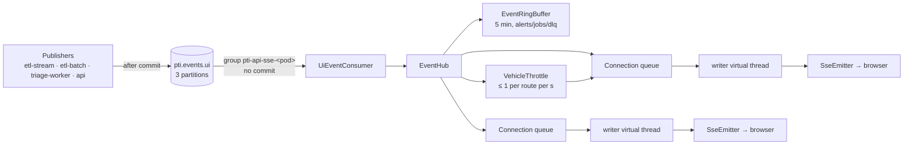

# Phân phối sự kiện real-time (SSE)

> Trạng thái: **Approved** · Cập nhật: 2026-09-28 · DOC-26
>
> Phụ thuộc: [DOC-33](../07-api/sse-events.md), [DOC-32](../07-api/api-endpoints.md) E-70, [DOC-31](../07-api/api-guidelines.md) §11, [DOC-27](security.md), [DOC-09](../03-architecture/messaging-contracts.md) §1, §6, [DOC-10](../03-architecture/quality-attributes.md) §2, [DOC-28](observability.md) §3.5, DR-41, DR-42, DR-45, DR-57, [ADR-0016](../04-adr/0016-sse-per-pod-consumer-ring-buffer.md), [ADR-0026](../04-adr/0026-no-outbox-for-ui-events.md)
>
> Người dùng chính: người viết app `api` phần stream (P4-11), frontend (hook `useRealtime`, P5-03), EXP-05 (đo độ trễ tới trình duyệt)

## 1. Mục đích và phạm vi

Đưa sự kiện từ topic `pti.events.ui` tới trình duyệt qua SSE với độ trễ chặng 4 + 5 ≤ 0,7 giây (DOC-10 §2), không mất sự kiện khi client mất kết nối dưới 5 phút, và không để một client chậm ảnh hưởng client khác.

Trong phạm vi: consumer Kafka của app `api`, ring buffer, quản lý kết nối, `Last-Event-ID`, backpressure, heartbeat, giới hạn, tắt pod, cấu hình proxy, và hook phía client. Ngoài phạm vi: payload từng kiểu sự kiện (DOC-33), publisher (DOC-20 §8, DOC-23 §10.3, DOC-24).

## 2. Kiến trúc



Mỗi pod `api` đọc **toàn bộ** topic bằng consumer group riêng, nên client nối vào pod nào cũng nhận đủ sự kiện, và không cần sticky session (ADR-0016). Topic nhỏ (vài chục sự kiện mỗi giây, retention 1 ngày), nên mọi pod đọc hết vẫn rẻ.

## 3. Thành phần

```java
package dev.pti.api.stream;

/** Parsed envelope (DOC-33 §2.1) plus pod-local arrival order. */
public record HubEvent(long seq,                     // pod-local, monotonic, assigned by EventHub
                       String id,                    // ULID from the publisher
                       String type,
                       UiChannel channel,
                       Audience audience,
                       Instant occurredAt,
                       @Nullable Instant sourceRecordTs,
                       @Nullable String routeId,
                       Map<String, Object> data) {}

/** Kafka listener; see §4. Implements ConsumerSeekAware. */
public class UiEventConsumer { }

public interface EventHub {
  void accept(HubEvent event);                        // called by the consumer thread
  Connection open(Subscription subscription, @Nullable String lastEventId);
  void close(Connection connection, CloseReason reason);
  int connectionCount();
}

/** What a connection asked for and is allowed to see. */
public record Subscription(Set<UiChannel> channels,
                           Set<String> routeIds,       // empty = all
                           Viewer viewer,              // ANONYMOUS or AUTHENTICATED(username, roles)
                           @Nullable Instant tokenExpiresAt,
                           String clientKey) {}        // "ip:<addr>" or "user:<sub>", for DOC-31 §11 limits

public interface EventRingBuffer {
  void append(HubEvent event);
  /** Events after the given id, or empty if the id is unknown. */
  Optional<List<HubEvent>> after(String id);
  /** Events whose ULID time is >= from; empty if from is older than the buffer. */
  Optional<List<HubEvent>> since(Instant from);
  boolean ready();                                    // prefill finished (§4.2)
}

public enum CloseReason { CLIENT_GONE, TIMEOUT, TOKEN_EXPIRED, WRITE_STALLED, SHUTDOWN }
```

- `StreamController` (`GET /api/v1/stream`): kiểm tra quyền và giới hạn (§7), tạo `Subscription`, gọi `EventHub.open`, trả `SseEmitter`.
- `SseFrameWriter`: dựng khung SSE (DOC-33 §2.2). Chuỗi JSON của một sự kiện được serialize **tối đa hai lần** (bản đầy đủ và bản projection công khai, DOC-33 §4), cache trên `HubEvent`, rồi dùng chung cho mọi kết nối.

## 4. Consumer Kafka và ring buffer

### 4.1 Consumer

| Thuộc tính | Giá trị | Lý do |
| --- | --- | --- |
| `group.id` | `pti-api-sse-${HOSTNAME}` | Mỗi pod một group (DOC-09 §1) |
| `enable.auto.commit` | `false`, và listener **không bao giờ** commit | Không cần offset: vị trí bắt đầu luôn là "5 phút trước" (§4.2). Group không có offset đã commit sẽ bị broker xóa khi không còn member, nên không có group rác |
| `auto.offset.reset` | `latest` | Chỉ dùng khi seek theo thời gian không tìm được offset |
| `fetch.max.wait.ms` | `100` | Ngân sách chặng 4 là 0,5 s (DOC-10 §2) |
| `max.poll.records` | `500` | |
| Listener | Batch listener, `concurrency = 1` (một thread đọc cả 3 partition) | Tải thấp; một thread giữ đơn giản thứ tự `seq` |
| Deserializer | `StringDeserializer`, parse JSON trong listener | Envelope lỗi: log `WARN` (có `id` nếu đọc được), tăng `pti_api_sse_invalid_events_total`, bỏ qua |
| Observation | Bật (`spring.kafka.listener.observation-enabled=true`) | Span `pti.events.ui receive` nối trace từ publisher (DOC-28 §4) |

### 4.2 Nạp trước buffer

`UiEventConsumer.onPartitionsAssigned` (ConsumerSeekAware):

1. Ghi nhớ end offset hiện tại của mỗi partition được gán.
2. `seekToTimestamp(partitions, now − pti.api.sse.buffer-window)` (5 phút).
3. Các record có offset < end offset đã ghi nhớ là **dữ liệu nạp trước**: được đưa vào ring buffer nhưng không gửi tới kết nối nào (kết nối chỉ nhận sự kiện mới hoặc replay qua `Last-Event-ID`).
4. Khi mọi partition đạt end offset đã ghi nhớ → `ready = true`.

Lần gán lại partition sau này (rebalance, lỗi Kafka) mà khoảng trống giữa offset cũ và mới không xác định được: đặt lại buffer, nạp trước lại như trên, và gửi `resync` với `reason = CONSUMER_RESET` cho mọi kết nối (DOC-33 §5.9). Với group một member và một consumer, việc này chỉ xảy ra khi consumer bị khởi tạo lại.

### 4.3 Ring buffer

- Chỉ giữ sự kiện kênh `alerts`, `jobs`, `dlq`. `vehicles.batch` **không** được giữ: bản đồ lấy lại trạng thái bằng `GET /vehicles/live` khi nối lại, nên replay vị trí cũ vừa tốn vừa vô ích.
- Cấu trúc: `ArrayDeque<HubEvent>` theo `seq` cộng `HashMap<id, seq>`, bảo vệ bằng `ReentrantReadWriteLock`. Ghi: thread consumer. Đọc: thread mở kết nối.
- Bỏ sự kiện khi `occurredAt < now − 5 phút` (quét lúc append) hoặc khi vượt `pti.api.sse.buffer-max-events` (10.000; bỏ cũ nhất, tăng `pti_api_sse_dropped_total{reason="buffer_overflow"}`). Ở tải bình thường buffer chứa vài trăm sự kiện.
- Thứ tự trong buffer là **thứ tự đến pod** (`seq`), không phải thứ tự ULID. Hai publisher khác nhau có thể tạo ULID không theo thứ tự đến; replay theo `seq` giữ đúng những gì client "đã có thể thấy".

## 5. Mở kết nối và `Last-Event-ID`

```
open(subscription, lastEventId):
  conn = new Connection(subscription)                       # queue 1,000 (§6.2)
  register conn in hub                                      # live events start queuing now
  if lastEventId is null:
      conn.enqueueFirst(retry: 1000)
      return conn
  if not buffer.ready(): wait up to 2 s for ready
  replay = buffer.after(lastEventId)                        # 1. exact id
        ?: (ulidTime(lastEventId) ?.let { buffer.since(it − 5 s) })   # 2. ULID time fallback
  if replay is empty-optional:
      conn.enqueueFirst(resync{reason: BUFFER_EXPIRED, channels: subscription.channels ∩ {alerts, jobs, dlq}})
  else:
      conn.enqueueFirst(filter(replay, subscription), dedupe against events already queued by seq)
  return conn
```

- **Cách 1 (id chính xác):** trường hợp thường gặp nhất (mất mạng ngắn, nối lại cùng pod, hoặc pod khác nhưng cũng đã nạp trước sự kiện đó).
- **Cách 2 (theo thời gian ULID):** khi id không có trong buffer (nối sang pod khởi động sau sự kiện, hoặc id cuối là của `vehicles.batch`). Lùi 5 giây để bù chênh lệch đồng hồ giữa các publisher; client dedupe theo `id` (DOC-33 §2.2). `ulidTime` phải nằm trong khoảng buffer, nếu không thì coi như hết hạn.
- **Hết hạn:** `Last-Event-ID` cũ hơn buffer, không phải ULID, hoặc buffer chưa `ready` sau 2 giây → `resync` (FR-10.4: ngắt quá 5 phút thì nhận `resync`).
- Đăng ký vào hub **trước** khi đọc buffer, rồi bỏ trùng theo `seq`, để sự kiện đến đúng lúc mở kết nối không bị lọt giữa hai bước.
- Kênh `vehicles` không có replay. Nối lại luôn phải refetch snapshot (§8.3).

## 6. Gửi sự kiện

### 6.1 Lọc

Với mỗi `HubEvent` và mỗi kết nối: kênh thuộc `subscription.channels`; audience được phép (DOC-33 §4); `routeId` khớp bộ lọc (nếu sự kiện có `routeId` và kết nối có lọc); chọn khung đầy đủ hay khung công khai. Với 2.000 kết nối và 50 sự kiện/giây, vòng lặp lọc tốn < 1 ms mỗi sự kiện.

### 6.2 Hàng đợi và writer

- Mỗi kết nối có một `ArrayBlockingQueue<Frame>` dung lượng `pti.api.sse.connection-queue` (1.000) và một **virtual thread** writer: lấy khung, `emitter.send(...)`, lặp lại. Thread của hub chỉ `offer` (không chặn).
- **Queue đầy** (client đọc chậm hơn tốc độ sự kiện): xóa queue, đưa vào `resync{reason: SLOW_CLIENT, channels: tất cả kênh của kết nối}`, tăng `pti_api_sse_dropped_total{reason="slow_client"}` theo số khung bị bỏ. Client đồng bộ lại bằng REST.
- **Ghi bị treo:** watchdog mỗi 5 giây; writer đang ở trong `send` quá `pti.api.sse.write-stall-timeout` (10 s) → đóng kết nối (`WRITE_STALLED`). TCP buffer đầy do client không đọc là nguyên nhân thường gặp.
- Lỗi `IOException` khi `send` (client đã đóng) → `CLIENT_GONE`, gỡ kết nối khỏi hub.

### 6.3 Kênh `vehicles`

`VehicleThrottle` ở mức hub (dùng chung cho mọi kết nối), theo từng `routeId`:

- Sự kiện đến khi tuyến chưa được gửi trong 1 giây qua → gửi ngay (leading edge). Nhờ vậy trường hợp thường gặp (etl-stream phát mỗi tuyến một lần mỗi giây, DOC-20 §8) không bị thêm độ trễ.
- Sự kiện đến sớm hơn → gộp vào bản chờ của tuyến theo `vehicleId` (giữ `eventTimestamp` mới hơn), gửi khi đủ 1 giây kể từ lần gửi trước (trailing edge).
- Tối đa `pti.api.sse.vehicles-per-second` (1) sự kiện mỗi tuyến mỗi giây tới mỗi kết nối.

### 6.4 Heartbeat

`@Scheduled(fixedRate = 15 s)` đưa `heartbeat` (DOC-33 §5.10) vào mọi queue. Ngoài việc báo sống cho client, heartbeat giữ kết nối qua proxy có timeout đọc.

### 6.5 Đo độ trễ

Khi writer ghi xong một khung: `pti_api_publish_to_emit_seconds` = `now − occurredAt`; nếu `sourceRecordTs` khác null thì `pti_end_to_end_latency_seconds{channel}` = `now − sourceRecordTs` (DR-57). Chỉ đo cho sự kiện live, không đo cho sự kiện replay.

## 7. Giới hạn và vòng đời kết nối

| Giới hạn | Giá trị | Vượt thì |
| --- | --- | --- |
| Kết nối đồng thời mỗi pod | `pti.api.sse.max-connections` = 2.000 | 503 `service-unavailable`, `Retry-After: 5` |
| Kết nối mỗi IP (anonymous) / mỗi user | 5 / 10 (DOC-31 §11) | 429 `rate-limited` |
| `channels` | ≥ 1, chỉ 4 giá trị hợp lệ | 400 |
| `routeId` | ≤ 20 | 400 |
| Kênh `jobs`, `dlq` | cần viewer | 401 / 403 trước khi stream mở |
| Thời gian sống | `pti.api.sse.max-lifetime` = 30 phút (`SseEmitter` timeout) | Server đóng; client nối lại với `Last-Event-ID` |
| Token hết hạn | Kết nối có token bị đóng đúng lúc `exp` (`TOKEN_EXPIRED`) | Client nối lại bằng token mới (§8.2) |

- Mọi lỗi trước khi stream mở là Problem Details bình thường (`application/problem+json`). Sau khi đã gửi header `200 text/event-stream` thì không còn gửi được mã lỗi; server chỉ đóng kết nối.
- Response header: `Content-Type: text/event-stream`, `Cache-Control: no-cache, no-transform`, `X-Accel-Buffering: no`, `X-Trace-Id`.
- `spring.mvc.async.request-timeout` = `max-lifetime` + 1 phút, để `SseEmitter` tự quản thời gian sống.
- Thread: `spring.threads.virtual.enabled=true`; request SSE trả thread của Tomcat ngay sau khi tạo emitter. 2.000 writer là 2.000 virtual thread, không tốn platform thread.

### 7.1 Tắt pod

`SseShutdown` là `SmartLifecycle` với `phase = Integer.MAX_VALUE - 1` (dừng **trước** web server graceful shutdown của Boot):

1. Ngừng nhận kết nối mới (controller trả 503 `Retry-After: 1`).
2. `complete()` mọi emitter (không gửi `resync`: client nối lại với `Last-Event-ID` sang pod khác và nhận bù từ buffer của pod đó).
3. Dừng consumer.

Client nối lại sau `retry` 1 giây cộng jitter 0–2 giây (§8.2), nên 2.000 kết nối không dồn vào pod còn lại cùng một lúc. Trên k3d, `preStop: sleep 5` để Service gỡ endpoint trước khi bước 1 chạy (DOC-40).

## 8. Phía client: `useRealtime`

### 8.1 Giao diện

```ts
// frontend/src/realtime/useRealtime.ts
type Channel = 'vehicles' | 'alerts' | 'jobs' | 'dlq';

interface RealtimeOptions {
  channels: Channel[];
  routeIds?: string[];                 // ≤ 20
}

type RealtimeStatus = 'connecting' | 'open' | 'reconnecting' | 'polling';

interface RealtimeState {
  status: RealtimeStatus;
  lastEventAt?: Date;                  // wall clock of the last frame (any type)
  businessNow?: string;                // from the last heartbeat
}

export function useRealtime(options: RealtimeOptions): RealtimeState;
```

Một kết nối duy nhất cho cả ứng dụng (`RealtimeProvider` ở gốc cây component). Các màn hình khai báo kênh chúng cần; provider hợp nhất tập kênh và `routeId`, và mở lại kết nối khi tập này đổi (debounce 500 ms).

### 8.2 Kết nối và kết nối lại

- Thư viện: `@microsoft/fetch-event-source` (DR-41), gửi `Authorization: Bearer <token>` khi đã đăng nhập, `Last-Event-ID` = id cuối cùng đã nhận (lưu trong bộ nhớ, không lưu localStorage).
- Mất kết nối, lỗi mạng, hay server đóng: nối lại với backoff lũy thừa **1 s → 2 s → 4 s … tối đa 30 s**, cộng jitter ngẫu nhiên 0–1 s (UC-01 E1). Thành công thì đặt lại backoff.
- 4xx (trừ 429) khi mở: không thử lại tự động với cùng tham số. 401 → gọi `signinSilent`; thành công thì nối lại, thất bại thì bỏ các kênh cần quyền và nối lại với kênh công khai. 429 → đợi `Retry-After`.
- Không nhận được khung nào (kể cả heartbeat) trong **45 giây** → coi như chết, đóng và nối lại.
- Token được làm mới (`react-oidc-context` sự kiện `userLoaded`) → nối lại chủ động với token mới, trước khi server đóng vì `exp`.
- Tab ẩn quá 5 phút (`document.visibilityState`) → đóng kết nối; tab hiện lại → nối lại (thường nhận `resync`) và refetch các query đang hiển thị.

### 8.3 Polling dự phòng

Khi `status` không phải `open` quá **5 giây**, provider chuyển sang `polling` cho tới khi kết nối mở lại:

| Kênh | Poll | Chu kỳ |
| --- | --- | --- |
| `vehicles` | `GET /vehicles/live` (cùng `routeId`) | 5 s (UC-01 E1) |
| `alerts` | `GET /alerts?since=<createdAt mới nhất đã có>` | 30 s |
| `jobs` | `GET /etl/jobs` trang đầu | 15 s |
| `dlq` | `GET /etl/dlq/summary` | 30 s |

Khi kết nối mở lại: dừng poll, refetch `GET /vehicles/live` một lần (vì kênh `vehicles` không có replay).

### 8.4 Tích hợp với TanStack Query

Mọi dữ liệu REST nằm trong cache của TanStack Query (DR-46). Sự kiện SSE chỉ cập nhật hoặc invalidate cache; component không đọc trực tiếp từ luồng sự kiện.

## 9. Sự kiện → cache frontend

| Sự kiện | Query key bị ảnh hưởng | Cách xử lý |
| --- | --- | --- |
| `vehicles.batch` | `['vehicles', 'live', routeIds]` | `setQueryData`: ghi đè vị trí theo `vehicleId`, giữ `delaySeconds`/`headsign`/`label` cũ; thêm xe mới |
| `heartbeat` | — | Cập nhật `businessNow`; ẩn xe có `eventTimestamp < businessNow − 5 phút` |
| `bunching.opened`, `bunching.closed` | `['vehicles', 'live', *]` (overlay), `['insights', 'bunching', *]` | Overlay: `setQueryData` trên hai xe. Danh sách: `invalidateQueries` |
| `dispatch.suggested` | `['insights', 'bunching', *]`, `['insights', 'dispatch', *]` | `invalidateQueries` |
| `disruption.opened`, `disruption.closed` | `['insights', 'disruption', *]`, `['stops', *, 'detail']` của trạm thuộc `routeId` | `invalidateQueries` |
| `alert.created`, `alert.updated` | `['alerts', *]` | `setQueryData`: chèn đầu hoặc thay thế theo `id` trong trang đầu; nếu bộ lọc của query không khớp alert thì bỏ qua |
| `alert.retracted` | `['alerts', *]`, `['stops', *, 'detail']` | Gỡ theo `id`; invalidate trạm thuộc `routeId` |
| `job.run` | `['etl', 'jobs', *]`, `['etl', 'job', runId]` | Danh sách: thay thế theo `runId` trong trang đầu, chèn nếu mới. Chi tiết: `invalidateQueries` (tối đa mỗi 2 giây) |
| `dlq.changed` `CREATED`, `BULK_UPDATED` | `['etl', 'dlq', 'list', *]`, `['etl', 'dlq', 'summary']` | `invalidateQueries`, debounce 2 s |
| `dlq.changed` `UPDATED` | `['etl', 'dlq', 'list', *]`, `['etl', 'dlq', 'detail', id]`, `['etl', 'dlq', 'summary']` | Cập nhật `status` của dòng; invalidate chi tiết và summary |
| `resync` | Mọi key thuộc `channels` theo bảng trên | `invalidateQueries` |

Ngoài ra mọi query có `refetchInterval` 60 giây khi màn hình đang hiển thị (DR-42): lưới an toàn cho sự kiện bị mất.

## 10. Proxy và hạ tầng

Nginx của frontend (compose, và image frontend trên k3d):

```nginx
location = /api/v1/stream {
  proxy_pass http://api:8080;
  proxy_http_version 1.1;
  proxy_set_header Connection "";
  proxy_set_header Host $host;
  proxy_set_header X-Forwarded-For $proxy_add_x_forwarded_for;
  proxy_set_header X-Forwarded-Proto $scheme;
  proxy_buffering off;
  proxy_cache off;
  proxy_read_timeout 1h;              # longer than max-lifetime; heartbeat keeps it busy anyway
  gzip off;
}

location /api/ {
  proxy_pass http://api:8080;
  proxy_http_version 1.1;
  proxy_set_header Connection "";
  proxy_set_header Host $host;
  proxy_set_header X-Forwarded-For $proxy_add_x_forwarded_for;
  proxy_set_header X-Forwarded-Proto $scheme;
  proxy_read_timeout 30s;
}

location /internal/ { return 404; }   # never expose the Alertmanager webhook (DOC-27)
```

- Không nén SSE: gzip đệm dữ liệu và làm trễ từng khung.
- Trên k3d: Ingress (Traefik của k3d) có `traefik.ingress.kubernetes.io/router.middlewares` không có compress cho path `/api/v1/stream`; Service `api` không cần session affinity (§2).
- Trình duyệt giới hạn 6 kết nối HTTP/1.1 mỗi origin; ứng dụng chỉ mở một kết nối SSE (§8.1) nên không bị ảnh hưởng.

## 11. Cấu hình

| Khóa | Kiểu | Mặc định | Ý nghĩa |
| --- | --- | --- | --- |
| `pti.api.sse.enabled` | bool | `true` | Tắt thì `/stream` trả 503 và consumer không chạy (test REST thuần) |
| `pti.api.sse.buffer-window` | Duration | `5m` | §4 (DR-41) |
| `pti.api.sse.buffer-max-events` | int | `10000` | §4.3 |
| `pti.api.sse.connection-queue` | int | `1000` | §6.2 |
| `pti.api.sse.write-stall-timeout` | Duration | `10s` | §6.2 |
| `pti.api.sse.heartbeat-interval` | Duration | `15s` | §6.4 |
| `pti.api.sse.vehicles-per-second` | int | `1` | §6.3 |
| `pti.api.sse.max-connections` | int | `2000` | §7 |
| `pti.api.sse.max-lifetime` | Duration | `30m` | §7 |
| `pti.api.sse.replay-clock-skew` | Duration | `5s` | §5 cách 2 |
| `pti.api.sse.ready-wait` | Duration | `2s` | §5 |
| `pti.api.sse.max-route-filter` | int | `20` | §7 |

Phía client (hằng số trong `frontend/src/realtime/config.ts`): backoff 1 s → 30 s, jitter 1 s, dead timeout 45 s, polling sau 5 s, đóng khi tab ẩn 5 phút.

## 12. Metrics và log

Bổ sung vào DOC-28 §3.5:

| Metric | Loại | Label | Ý nghĩa |
| --- | --- | --- | --- |
| `pti_api_sse_connections` | gauge | `channel`, `audience` (`public` \| `authenticated`) | Có sẵn |
| `pti_api_sse_connections_opened_total` | counter | `replay` (`none`, `exact`, `time`, `resync`) | Cách xử lý `Last-Event-ID` |
| `pti_api_sse_connections_closed_total` | counter | `reason` (`CloseReason`) | |
| `pti_api_sse_events_emitted_total` | counter | `channel`, `type` | Có sẵn |
| `pti_api_sse_dropped_total` | counter | `reason` (`slow_client`, `buffer_overflow`) | Có sẵn |
| `pti_api_sse_buffer_events` | gauge | — | Kích thước ring buffer |
| `pti_api_sse_consumer_lag_seconds` | gauge | — | `now − occurredAt` của sự kiện cuối consumer nhận |
| `pti_api_sse_invalid_events_total` | counter | — | Envelope không đọc được |
| `pti_api_publish_to_emit_seconds`, `pti_end_to_end_latency_seconds{channel}` | histogram | | §6.5 |

Log: mở và đóng kết nối ở `DEBUG` (quá nhiều cho `INFO`); `resync` vì `SLOW_CLIENT`, `WRITE_STALLED` và `CONSUMER_RESET` ở `INFO` với `clientKey`, `channels`, `dropped`.

## 13. Lỗi và cách xử lý

| Tình huống | Hành vi | Client thấy |
| --- | --- | --- |
| Kafka không đọc được | Consumer retry theo mặc định của Spring Kafka; kết nối vẫn mở, chỉ có heartbeat | Dữ liệu ngừng cập nhật; refetch 60 s; `/system/freshness` không bị ảnh hưởng |
| Consumer bị gán lại partition | §4.2, `resync CONSUMER_RESET` | Refetch |
| Client chậm | §6.2 | `resync SLOW_CLIENT` |
| Pod tắt | §7.1 | Nối lại sang pod khác, không mất sự kiện trong 5 phút |
| Pod mới khởi động | Nạp trước 5 phút; kết nối có `Last-Event-ID` chờ tối đa 2 s | Replay bình thường |
| Mất sự kiện ở publisher (best-effort) | Không phát hiện được | Refetch 60 s (DR-42) |

## 14. Test bắt buộc

| ID | Kịch bản | Kỳ vọng |
| --- | --- | --- |
| RT-01 | Integration (Testcontainers Kafka): publish 100 sự kiện `alerts`, một client | Nhận đủ 100, đúng thứ tự `seq` |
| RT-02 | Client ngắt 30 giây rồi nối lại với `Last-Event-ID` | Nhận bù đủ sự kiện trong 30 giây (FR-10.4) |
| RT-03 | Client ngắt 6 phút rồi nối lại | Nhận `resync BUFFER_EXPIRED` (FR-10.4) |
| RT-04 | `Last-Event-ID` là id của `vehicles.batch` | Replay theo thời gian ULID; không trùng sau khi client dedupe |
| RT-05 | Hai pod API; client nối pod A, ngắt, nối pod B | Nhận bù từ buffer của B |
| RT-06 | Pod khởi động sau khi sự kiện X được publish 2 phút; client nối với `Last-Event-ID` trước X | Nhận X (nạp trước) |
| RT-07 | Client không đọc (TCP buffer đầy), 2.000 sự kiện | `resync SLOW_CLIENT` hoặc đóng `WRITE_STALLED`; client khác không bị trễ (p95 publish→emit không đổi) |
| RT-08 | 5 sự kiện `vehicles.batch` cùng tuyến trong 1 giây | Client nhận ≤ 2 khung (leading + trailing), vị trí cuối đúng |
| RT-09 | Anonymous mở `channels=jobs` | 401 trước khi stream mở |
| RT-10 | Kết nối thứ 6 từ cùng IP anonymous | 429 |
| RT-11 | Token hết hạn khi đang kết nối | Server đóng đúng lúc `exp` |
| RT-12 | Tắt pod (SIGTERM) với 100 kết nối | Mọi emitter đóng trước khi Tomcat dừng; không có lỗi `AsyncRequestNotUsableException` trong log |
| RT-13 | Không có sự kiện trong 60 giây | Client nhận 4 heartbeat, kết nối không bị nginx đóng |
| RT-14 | Frontend (Vitest + MSW): mất kết nối 6 giây | `status = polling`, gọi `GET /vehicles/live` mỗi 5 s; nối lại thì dừng poll và refetch |
| RT-15 | Frontend: nhận `resync` với `channels = ["alerts"]` | Invalidate đúng các key của `alerts` |
| RT-16 | Tải: 2.000 kết nối, 50 sự kiện/s (k6 hoặc Gatling SSE) | p95 `pti_api_publish_to_emit_seconds` < 0,2 s; heap ổn định |
| RT-17 | E2E (EXP-05): simulator → trình duyệt | p95 `pti_end_to_end_latency_seconds{channel="vehicles"}` < 10 s (NFR-03) |

## 15. Câu hỏi còn mở

Không có.
