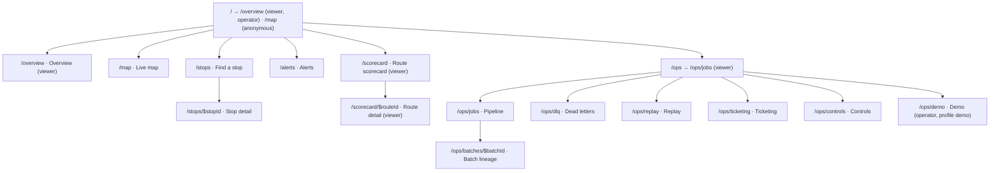

# Nguyên tắc UX và kiến trúc thông tin

> Trạng thái: **Approved** · Cập nhật: 2026-09-28 · DOC-34
> Phụ thuộc: DOC-02, DOC-03 (FR-11, NFR-11, NFR-12), DOC-04, DOC-26 §8–9, DOC-27 §3, DOC-31, DOC-32, DOC-33, ADR-0020, ADR-0021, DR-88
> Người dùng chính: P5-01…P5-15; người viết DOC-35, DOC-36, DOC-37

## 1. Mục đích và phạm vi

Tài liệu này chốt những gì mọi màn hình dùng chung:

- nguyên tắc UX;
- sitemap và điều hướng theo role;
- sơ đồ URL, gồm search params cho bộ lọc;
- hành vi responsive và ngân sách hiệu năng;
- kiến trúc mã frontend: thư mục, provider, đăng nhập, client API, cấu hình lúc chạy.

Màu sắc, component và style bản đồ ở DOC-35. Từng màn hình ở `screens/*` (DOC-36). Mẫu trạng thái và toàn bộ microcopy ở DOC-37. Chuỗi UI trong tài liệu này được trích nguyên văn tiếng Anh (DR-48, DR-61).

## 2. Nguyên tắc UX

| ID | Nguyên tắc | Hệ quả cụ thể |
| --- | --- | --- |
| P-1 | **Dữ liệu luôn ghi rõ "tính đến lúc nào".** | Mọi panel dữ liệu có `FreshnessIndicator` (DOC-35 §5) lấy từ header `X-Data-As-Of` (DOC-31 §7.3) hoặc trường thời điểm trong payload. Dữ liệu realtime hiện thời gian tương đối ("Updated 5 s ago"), dữ liệu tổng hợp hiện thời điểm tuyệt đối ("As of Sep 29, 4:05 PM CDT"). |
| P-2 | **Độ tin cậy luôn hiển thị.** | Mọi giá trị dự đoán hoặc do AI sinh ra (ETA, `likelyCause`, `category`, gợi ý điều phối) đi kèm `ConfidenceChip`. Dưới ngưỡng thì ghi rõ "Low confidence" (FR-09.6), không bao giờ ẩn giá trị hay ẩn mức tin cậy. Chưa phân loại thì ghi "Unclassified" (FR-09.7). |
| P-3 | **Không màn hình trắng.** | Mọi query giữ dữ liệu cũ khi refetch lỗi và hiện `ErrorState` dạng dải phía trên dữ liệu. Chỉ khi chưa từng có dữ liệu mới hiện `ErrorState` dạng khối. Tắt API → mọi màn hình vẫn có nội dung giải thích (FR-11.6, DOC-37 §2). |
| P-4 | **URL là nguồn sự thật của bộ lọc và lựa chọn.** | Bộ lọc, tab, khoảng thời gian và bản ghi đang mở (khung chi tiết hoặc drawer) nằm trong search params (§5). Copy URL gửi người khác thì họ thấy đúng màn hình đó (J-3 bước 2). State cục bộ (Zustand) chỉ dùng cho thứ không cần chia sẻ. |
| P-5 | **Realtime không làm người dùng mất chỗ.** | Dòng mới chèn vào đầu danh sách có hiệu ứng highlight 2 giây, không đổi vị trí cuộn. Khi người dùng đã cuộn xuống hoặc đang mở chi tiết, dòng mới gom thành pill "{n} new · show" thay vì chèn ngay. Bản đồ không tự di chuyển camera trừ khi người dùng bấm "Follow". |
| P-6 | **Hành động có phản hồi trong 300 ms.** | Thao tác ghi an toàn (feedback, ack, replay DLQ) cập nhật lạc quan; lỗi thì hoàn tác và hiện toast có `traceId`. Thao tác chờ lâu hiện tiến độ (replay raw zone, job request). |
| P-7 | **Thao tác khó đảo ngược phải xác nhận.** | Discard DLQ, stop job, bật cờ pause, replay khoảng thời gian, dừng mọi kịch bản demo đều qua `ConfirmDialog` nêu rõ hậu quả. Thao tác đảo ngược được (ack, feedback) không hỏi lại. |
| P-8 | **Không dùng màu làm tín hiệu duy nhất.** | Severity, trạng thái và mức tin cậy luôn có chữ hoặc icon cùng màu (DOC-35 §8, WCAG 1.4.1). |
| P-9 | **Hai trục thời gian không lẫn nhau.** | Thời điểm sự kiện (vị trí xe, episode, ETA) tính tương đối theo `businessNow` của server (DR-67). Thời điểm audit (ack, replay, job) tính theo đồng hồ máy người dùng. Xem §8. |
| P-10 | **Ops console ưu tiên mật độ thông tin, nhưng không chật.** | Bảng dòng ≈ 40 px, id hiển thị monospace rút gọn kèm nút copy, số canh phải với `tabular-nums`; mỗi trang mở đầu bằng một dải tóm tắt (KPI hoặc sơ đồ) rồi mới tới bảng. Màn hành khách ưu tiên số lớn kiểu bảng giờ tàu và vùng chạm 44 px. |
| P-11 | **Duyệt nhiều bản ghi thì không rời danh sách.** | Màn mà người dùng xử lý bản ghi liên tiếp (Alerts, Dead letters, Ticketing) dùng bố cục danh sách + khung chi tiết cạnh nhau (`SplitView`, DOC-35 §5.5); màn chỉ thỉnh thoảng mở chi tiết (Pipeline, Replay, Scorecard) dùng drawer. |

## 3. Người dùng và quyền trên UI

| Role | Persona (DOC-02) | Thấy | Làm được |
| --- | --- | --- | --- |
| anonymous | PS-1 | Map, Stops, Alerts (chỉ `PUBLIC`) | Xem |
| `viewer` | PS-3 | Thêm Overview, Scorecard, nhóm Operations (Pipeline, Dead letters, Replay, Ticketing, Controls), overlay bunching và gợi ý trên map, alert mọi audience | Xem |
| `operator` | PS-2, PS-4, PS-5 | Như viewer; thêm Demo khi server bật profile `demo` | Mọi thao tác ghi của DOC-32 |

Quy tắc:

- Role lấy từ `GET /me` (E-61), không tự đọc claim trong token. `/me` là query `['me']`, refetch khi người dùng đổi (đăng nhập, đăng xuất, token mới).
- Viewer **không thấy** nút ghi (ẩn, không phải disable). Tiêu đề nhóm "Operations" trong sidebar và header mỗi trang ops của viewer có badge "Read-only" giải thích "You can view everything here. Actions require the operator role."
- Ẩn nút chỉ là tiện dụng; server luôn kiểm quyền (DOC-27 §4). Server trả 403 thì UI hiện trạng thái "không có quyền" của DOC-37 §2.6.
- Dữ liệu thay đổi theo role: anonymous nhận projection công khai (E-12, E-20, sự kiện SSE). Component không được giả định trường nào đó luôn có; type sinh từ OpenAPI đánh dấu các trường này là optional.

## 4. Sitemap và điều hướng



### 4.1 Điều hướng chính

Mọi trang desktop dùng chung một **sidebar** (§4.2). Mục menu xếp theo ba nhóm có tiêu đề:

| Nhóm | Mục (nhãn UI) | Đích | anonymous | viewer | operator | Số đếm cạnh nhãn |
| --- | --- | --- | --- | --- | --- | --- |
| "Network" | "Overview" | `/overview` | — | ✓ | ✓ | — |
| "Network" | "Live map" | `/map` | ✓ | ✓ | ✓ | — |
| "Network" | "Stops" | `/stops` | ✓ | ✓ | ✓ | — |
| "Network" | "Alerts" | `/alerts` | ✓ | ✓ | ✓ | Số alert chưa ack (chỉ khi đăng nhập), pill tông `danger` |
| "Analytics" | "Scorecard" | `/scorecard` | — | ✓ | ✓ | — |
| "Operations" | "Pipeline" | `/ops/jobs` | — | ✓ | ✓ | Chấm `danger` khi có lần chạy `FAILED` trong 24 giờ |
| "Operations" | "Dead letters" | `/ops/dlq` | — | ✓ | ✓ | Số bản ghi mở (E-41) |
| "Operations" | "Replay" | `/ops/replay` | — | ✓ | ✓ | Số replay đang chạy |
| "Operations" | "Ticketing" | `/ops/ticketing` | — | ✓ | ✓ | Số bất thường trong 24 giờ |
| "Operations" | "Controls" | `/ops/controls` | — | ✓ | ✓ | Chấm `warning` và chip "Paused" khi có cờ pause đang bật |
| "Operations" | "Demo" | `/ops/demo` | — | — | ✓ (khi `demoControl`, §10) | — |

- Anonymous chỉ thấy nhóm "Network" (không có "Overview") và nút "Sign in" ở chân sidebar.
- URL của Pipeline giữ là `/ops/jobs` (DR-88): `link` của alert `FEED_STALE`/`INFRA` do API dựng (§5.3) và runbook đang trỏ tới đó.
- Ô "Search" (phím tắt `⌘K` / `Ctrl K`) ở đầu sidebar mở hộp tìm kiếm chung: trang, tuyến (E-01, đã cache) và trạm (E-06 `q`). Chọn tuyến → `/map?route=<id>`; chọn trạm → `/stops/<id>`.

Anonymous mở trực tiếp URL cần quyền (ví dụ `/ops/dlq` từ email alert) → trang hiện trạng thái "Sign in to view this page" với nút "Sign in"; sau khi đăng nhập quay lại đúng URL cũ (kể cả search params). Không tự chuyển sang Keycloak mà không hỏi.

### 4.2 Bố cục khung

- **≥ 1280 px:** sidebar trái rộng 232 px, nền `--surface`, viền phải `--border`. Từ trên xuống: logo + "Transit Intelligence" + tên agency (hằng `app.agency` trong `en.ts`: "Metro Transit · Twin Cities"); ô "Search" ⌘K; ba nhóm menu (§4.1); thẻ **"Live feed"** (`RealtimeStatusDot`, "Updated {relative}" theo nguồn vị trí xe của E-60; viewer có thêm msg/s của GTFS-rt và sparkline 24 cột từ E-31); chân là avatar, tên, vai trò ("Operator · on duty", "Viewer") và nút menu tài khoản. Mục đang chọn là thẻ trắng có viền và `--shadow-xs`, icon màu `--primary`, `aria-current="page"`.
- **1024–1279 px:** sidebar thu thành thanh icon 64 px (nhãn ở tooltip), nút mở rộng tạm thời dạng overlay. Lựa chọn thu gọn lưu `localStorage` `pti.sidebar.collapsed` (bọc try/catch).
- **< 1024 px:** không có sidebar. Thanh trên cao 48 px (logo, `RealtimeStatusDot`, nút tìm kiếm, menu tài khoản) và **thanh tab dưới** (< 768 px) với "Map", "Stops", "Alerts" (kèm số), "More"; "More" mở sheet chứa Overview, Scorecard, nhóm Operations, theme, Sign in/out. 768–1023 px dùng thanh trên có nút menu mở sidebar dạng sheet.
- **Vùng nội dung:** lề 28 px; mở đầu bằng `PageHeader` (breadcrumb "Operations / Dead letters", `h1`, một dòng phụ, nút thao tác bên phải). `StaleBanner` và banner offline nằm ngay trên `PageHeader`, trong vùng nội dung (không che sidebar).
- **Live map** là ngoại lệ: bản đồ tràn hết vùng nội dung (không lề, không `PageHeader`), mọi điều khiển là panel nổi (DOC-35 §5.8).
- **Chi tiết một bản ghi** theo P-11: khung chi tiết cạnh danh sách (Alerts, Dead letters, Ticketing) hoặc **drawer bên phải** (rộng 520 px, 680 px khi có bảng bước hoặc JSON) cho Pipeline, Replay, Scorecard, Demo. Cả hai ghi id vào URL. Trang có nhiều nội dung hoặc cần link riêng cho người ngoài ops vẫn là trang đầy đủ: stop detail, route detail, batch lineage.

### 4.3 Phím tắt (ops console)

| Phím | Hành động |
| --- | --- |
| `⌘K` / `Ctrl K` | Mở hộp tìm kiếm chung (§4.1) |
| `/` | Đặt focus vào ô tìm kiếm hoặc bộ lọc đầu tiên của trang |
| `j` / `k` | Chọn dòng kế tiếp / trước trong bảng đang focus |
| `Enter` | Mở chi tiết (khung hoặc drawer) của dòng đang chọn |
| `Esc` | Đóng drawer, dialog hoặc khung chi tiết đang mở |

Phím tắt (trừ `⌘K`) không hoạt động khi focus đang ở ô nhập liệu hoặc trình sửa JSON. Có danh sách phím tắt trong menu tài khoản ("Keyboard shortcuts").

## 5. Sơ đồ URL

### 5.1 Quy ước search params

- Mỗi route khai báo schema search bằng zod (`validateSearch`). Giá trị sai kiểu hoặc ngoài miền bị **bỏ qua và thay bằng mặc định**, không báo lỗi (link cũ vẫn mở được); URL được viết lại bằng `replace`.
- Tham số bằng giá trị mặc định **không** ghi lên URL.
- Danh sách: phân tách bằng dấu phẩy (`status=NEW,MANUAL`). Router dùng `parseSearch`/`stringifySearch` tự viết trong `src/lib/url.ts` thay cho JSON mặc định của TanStack Router, để URL đọc được và khớp ví dụ trong DOC-04.
- Thời điểm: ISO-8601 UTC rút gọn tới phút (`2026-09-29T20:00Z`). Khoảng tương đối dùng `window` (`15m`, `1h`, `6h`, `24h`, `7d`, `31d` tùy trang). Có `from`/`to` thì bỏ qua `window`.
- Đổi bộ lọc dùng `navigate({ search, replace: true })` để nút Back không phải đi qua từng lần gõ; đổi tab và mở chi tiết (khung hoặc drawer) dùng `push`.

### 5.2 Bảng route

| Route | Màn hình (DOC-36) | Quyền | Search params (kiểu · mặc định) |
| --- | --- | --- | --- |
| `/` | — | mọi người | Chuyển (`replace`) tới `/overview` nếu đã đăng nhập với role viewer trở lên, ngược lại `/map` |
| `/overview` | `overview.md` | viewer | `period` (`1d` \| `7d` \| `30d` · `1d`; chỉ áp cho khối OTP) |
| `/map` | `live-map.md` | mọi người | `route` (list routeId, ≤ 20 · tất cả) · `vehicle` (vehicleId đang chọn) · `bunching` (episode id, viewer) · `disruption` (episode id) · `c` (`lon,lat,zoom`, 4 chữ số thập phân · vùng của feed) · `view` (`map` \| `list` · `map`) · `colour` (`delay` \| `route` \| `crowding` · `delay`) |
| `/stops` | `stop-detail.md` §Tìm trạm | mọi người | `q` (2–100 ký tự) |
| `/stops/$stopId` | `stop-detail.md` | mọi người | — |
| `/alerts` | `alert-feed.md` | mọi người | `state` (`open` \| `unacknowledged` \| `all` · `open`) · `audience` (list) · `type` (list) · `severity` (list 0–2) · `route` (list) · `window` (`24h` \| `7d` · `24h`) · `alert` (id, mở khung chi tiết) |
| `/scorecard` | `route-scorecard.md` | viewer | `from`, `to` (date · 7 ngày tới hôm qua) · `routeType` (list) · `sort` (`otp` \| `route` · `otp`) · `route` (routeId, mở drawer tóm tắt tuyến) |
| `/scorecard/$routeId` | `route-scorecard.md` §Chi tiết tuyến | viewer | `tab` (`delays` \| `profile` \| `disruptions` · `delays`) · `from`, `to` (date · 7 ngày tới hôm qua) · `dir` (`0` \| `1` · cả hai; tab `profile` mặc định `0`) · `bucket` (`hour-of-week` \| `hour` \| `day` · `hour-of-week`) · `dow`, `hour` (tab `profile` · thứ và giờ hiện tại theo `businessNow`) · `disruption` (id, mở drawer ở tab `disruptions`) |
| `/ops` | — | viewer | Chuyển tới `/ops/jobs` |
| `/ops/jobs` | `ops-console-jobs.md` (Pipeline) | viewer | `window` (`15m` \| `1h` \| `6h` \| `24h` · `1h`) · `from`, `to` · `kind` (`BATCH_JOB` \| `STREAM`) · `status` (list) · `name` (list) · `bucket` (`1m` \| `5m` \| `15m` \| `1h` · theo `window`) · `run` (runId, mở drawer) |
| `/ops/batches/$batchId` | `ops-console-jobs.md` §Batch lineage | viewer | — |
| `/ops/dlq` | `ops-console-dlq.md` | viewer | `tab` (`review` \| `confirm` \| `closed` \| `actions` · `review`) · `status`, `source`, `stage`, `category`, `severity`, `rule` (list) · `from`, `to` · `id` (dead letter, mở khung chi tiết) · tab `actions`: `action` (list), `actor` (`auto` \| `system` \| `user`), `window` (`24h` \| `7d` · `24h`) |
| `/ops/replay` | `ops-console-replay.md` | viewer | `tab` (`new` \| `history` · `new` với operator, `history` với viewer) · `kind`, `status` (lọc lịch sử) · `replay` (id, mở drawer) · form tab `new` có thể điền sẵn: `source`, `from`, `to`, `recompute` |
| `/ops/controls` | `ops-console-controls.md` | viewer | — |
| `/ops/ticketing` | `ops-console-ticketing.md` | viewer | `window` (`6h` \| `24h` \| `7d` · `24h`) · `from`, `to` · `category` (list, gồm `unclassified`) · `severity` (list) · `trigger` · `salePoint` · `anomaly` (id, mở khung chi tiết) |
| `/ops/demo` | `demo-control.md` | operator, `demoControl` | `run` (runId, mở drawer) |
| `/auth/callback` | `shell-and-navigation.md` | — | Tham số OIDC (`code`, `state`) |
| `/_ui` | Danh mục component (DOC-35 §10) | chỉ bản build dev | — |
| mọi URL khác | Trang 404 ("Page not found") | mọi người | — |

`/auth/silent.html` là file tĩnh trong `public/` (không phải route của SPA), dùng cho `signinSilent` trong iframe (§9.3).

### 5.3 Liên kết sâu từ alert (`link` của E-20)

API dựng `link` theo `type` (quy tắc chính thức ở DOC-32 E-20); UI chỉ mở link này, không tự dựng lại:

| `type` | `link` |
| --- | --- |
| `DISRUPTION` | `/map?route=<routeId>&disruption=<refId>` |
| `BUNCHING` | `/map?route=<routeId>&bunching=<refId>` |
| `TICKETING_ANOMALY` | `/ops/ticketing?anomaly=<refId>` |
| `DLQ_SEVERE` | `/ops/dlq?severity=2&status=NEW,MANUAL,PENDING_CONFIRM` |
| `FEED_STALE` | `/ops/jobs?kind=STREAM` |
| `INFRA` | `body.annotations.runbook_url` nếu có (link ngoài, mở tab mới), ngược lại `/ops/jobs` |

## 6. Responsive

| Nhóm | Màn hình | Thiết kế cho | Hành vi |
| --- | --- | --- | --- |
| Hành khách | Map, Stops, Stop detail, Alerts | 360–1440 px, ưu tiên mobile | Một cột dưới 768 px. Map: panel thông tin xe và danh sách "Nearby stops" là bottom sheet kéo được (3 nấc: 96 px, 50%, 90%). Vùng chạm ≥ 44 × 44 px. Không có hover-only interaction. Alerts dưới 1024 px: khung chi tiết thành trang chồng lên danh sách (nút Back quay về danh sách). |
| Quản lý | Overview | ≥ 1024 px | Dưới 1280 px lưới KPI 4 cột thành 2 cột; hàng "Network pulse" + "Needs attention" xếp dọc. |
| Quản lý | Scorecard, Route detail | ≥ 1024 px | Dưới 1024 px bảng chuyển sang dạng thẻ, heatmap cuộn ngang trong khung của nó. |
| Vận hành | Mọi trang `/ops/*` | ≥ 1280 px | Dưới 1280 px hiện dải thông báo "The ops console is designed for screens at least 1280 px wide." (đóng được, nhớ trong `sessionStorage`); layout vẫn chạy, bảng cuộn ngang trong khung, `SplitView` chỉ hiện danh sách và mở chi tiết thành drawer toàn màn hình. |

Breakpoint dùng mặc định của Tailwind (`sm` 640, `md` 768, `lg` 1024, `xl` 1280, `2xl` 1536). Không dùng media query riêng ngoài các mốc này.

## 7. Ngân sách hiệu năng

| Chỉ số | Ngưỡng | Đo bằng |
| --- | --- | --- |
| LCP của `/stops/$stopId`, Moto G Power, 4G mô phỏng | < 2,5 s (NFR-12) | Lighthouse CI nightly (DOC-44 §10) |
| JS tải ban đầu (gzip) của `/stops/$stopId` | ≤ 200 KB | `scripts/check-bundle.mjs` đọc `dist/.vite/manifest.json`, chạy trong CI frontend |
| Chunk `/map` (gồm MapLibre, `pmtiles`) | ≤ 360 KB gzip (DR-107) | như trên |
| Chunk ECharts (dùng chung cho overview, scorecard, jobs, ticketing) | ≤ 200 KB gzip (DR-106) | như trên |
| Chunk CodeMirror (chỉ tải khi mở trình sửa payload DLQ) | ≤ 130 KB gzip | như trên |
| Cuộn bảng DLQ 10.000 dòng | Không có long task > 100 ms | Playwright trace (DOC-44 §10) |
| Cập nhật bản đồ 1.200 xe mỗi giây | ≥ 50 fps trên laptop demo | Performance panel, kiểm tay ở P5-06 |
| Phản hồi thao tác ghi (UI đổi trạng thái) | < 300 ms (J-2 bước 4) | Optimistic update |

Kỹ thuật bắt buộc:

- Code-split theo route (`lazy` route của TanStack Router). Màn hành khách không import ECharts, CodeMirror, TanStack Table.
- Thứ lần vẽ đầu không cần thì tải bằng `import()`: client OIDC, controller SSE, Toaster, menu tài khoản, sheet mobile, hộp tìm kiếm (DR-105). Image nén sẵn asset bằng `gzip -9` và nginx dùng `gzip_static`; `scripts/check-bundle.mjs` đo cùng mức nén đó.
- Font tự host (`@fontsource-variable/geist`, `@fontsource-variable/geist-mono`), subset `latin`, `font-display: swap`, preload Geist (DOC-35 §4.1). Không gọi Google Fonts.
- Stop detail render được ngay từ E-07 + E-08 mà không đợi `/me` hay SSE.
- Cập nhật vị trí xe gom theo `requestAnimationFrame` và ghi thẳng vào GeoJSON source của MapLibre (`setData`), không re-render React cho từng xe (DOC-35 §6).

## 8. Thời gian, số và múi giờ

Quy tắc chi tiết và bảng định dạng ở DOC-37 §4. Tóm tắt:

- Hiển thị theo **múi giờ của agency** (`activeFeed.timezone` từ E-60, hiện là `America/Chicago`), kèm viết tắt (`CDT`/`CST`). Chưa có feed ACTIVE thì dùng múi giờ trình duyệt và ghi viết tắt của nó.
- **Thời điểm sự kiện** (vị trí xe, bắt đầu/kết thúc episode, ETA, cửa sổ ticketing): thời gian tương đối tính theo `businessNow` (lấy từ `heartbeat` SSE hoặc E-60; giữa hai lần nhận thì cộng thêm thời gian đã trôi theo `performance.now()`). Lý do: đồng hồ nghiệp vụ có thể lệch giờ thật nhiều giờ (DR-67).
- **Thời điểm audit** (`createdAt` của alert, ack, feedback, job, replay, hành động DLQ): thời gian tương đối tính theo đồng hồ máy người dùng; thời điểm tuyệt đối vẫn theo múi giờ agency.
- Khi `clockOffset` của E-60 khác `PT0S`, footer của mọi trang hiện "Simulated clock: <thời điểm businessNow>" để người xem demo không nhầm.
- Locale `en-US` cho mọi định dạng số, ngày và tiền (DR-48). Dùng `Intl.*` với cache formatter, không thêm thư viện ngày tháng; khoảng thời gian dạng ISO (`PT20M`) chuyển đổi bằng hàm tự viết trong `src/lib/time.ts`.

## 9. Kiến trúc frontend

### 9.1 Thư mục

```text
frontend/
  index.html
  vite.config.ts  playwright.config.ts  tsconfig.json  eslint.config.js
  scripts/check-bundle.mjs
  public/
    env.js                      # dev defaults; replaced by the nginx entrypoint at startup (§10)
    auth/silent.html  auth/silent.js
  src/
    main.tsx                    # mounts providers and the router
    env.ts                      # reads and validates window.__PTI_ENV__ (zod)
    app/
      providers.tsx             # Theme → Query → Session → Freshness → Realtime → Router
      shell/                    # AppShell, AppSidebar, LiveFeedCard, CommandSearch, MobileTopBar, BottomTabs, AccountMenu, GlobalBanners
      guards.tsx                # RequireRole, RequireDemo
    routes/                     # TanStack Router file routes (§5.2)
    features/
      map/  stops/  scorecard/  alerts/
      ops-jobs/  ops-dlq/  ops-replay/  ops-controls/  ops-ticketing/  demo/
        # each: components/, hooks/, search.ts (zod schema), queries.ts, *.test.tsx
    api/
      generated/schema.d.ts     # openapi-typescript output (committed)
      generated/examples.ts     # response examples of openapi.json, typed with satisfies (committed)
      types.ts                  # ResponseBody<path, method, status> and friends
      client.ts                 # openapi-fetch instance + middleware (auth, idempotency), read()/write()
      problem.ts                # ProblemDetails type, ApiError class
      keys.ts                   # query key factories (DOC-26 §9)
      sim.ts                    # zod schemas for /sim/** (not in the public OpenAPI)
    realtime/
      RealtimeProvider.tsx  useRealtime.ts  config.ts  handlers.ts
      schemas/                  # zod generated from schemas/ui-events (json-schema-to-zod)
    components/
      ui/                       # shadcn/ui primitives
      ...                       # design-system components (DOC-35 §5)
    lib/  time.ts  format.ts  url.ts  roles.ts
    i18n/en.ts                  # every user-visible string (DOC-37)
    styles/tokens.css  styles/globals.css
    test/                       # MSW handlers, fixtures, render helpers
  e2e/                          # Playwright specs, one file per screen (DOC-44 §4.3)
```

Quy tắc phụ thuộc (ESLint `import/no-restricted-paths`): `features/*` không import lẫn nhau; dùng chung thì đưa lên `components/` hoặc `lib/`. `components/` không import `features/` hay `api/`.

`frontend/console/` và `vite.console.config.ts` là entry thứ hai cho demo console (DOC-48 §3.1), build ra `dist-console/` và không nằm trong image `pti-frontend`. Console chỉ import `src/components/`, `src/lib/`, `src/styles/`; không import `src/features/`, `src/api/`, `src/realtime/`. Code trong `src/` không import `console/`.

### 9.2 Provider

Thứ tự lồng nhau trong `app/providers.tsx`:

1. `ThemeProvider`: `light` \| `dark` \| `system`, lưu `localStorage` `pti.theme` (bọc try/catch; không đọc được thì theo `system`). Gắn class `dark` lên `<html>`.
2. `QueryClientProvider`: mặc định `staleTime` 10 s, `gcTime` 5 phút, `refetchInterval` 60 s khi trang hiển thị (DR-42), `refetchOnWindowFocus: true`, `retry`: tối đa 2 lần với lỗi mạng và 5xx, không retry 4xx; `placeholderData: keepPreviousData` cho mọi query danh sách.
3. `SessionProvider` (`src/app/auth.tsx`), cấu hình ở §9.3. Nằm trong `QueryClientProvider` vì đăng xuất xóa cache và token mới làm `/me` tải lại. Không có `keycloakUrl` trong `env.js` thì mọi người là anonymous.
4. `FreshnessProvider`: query E-60 mỗi 15 s, cung cấp `businessNow`, `timezone`, `stale`, `sources[]` cho `StaleBanner` và bộ định dạng thời gian.
5. `RealtimeProvider`: một kết nối SSE cho cả ứng dụng (DOC-26 §8). Controller tải bằng `import()` sau lần vẽ đầu (DR-105).
6. `RouterProvider` với `context = { queryClient }`. Quyền kiểm trong component route bằng `RequireRole` (`app/guards.tsx`): role đến từ `/me`, có sau lần render đầu, và query của trang nằm trong phần được bảo vệ nên không chạy khi không đủ quyền (UX-03).

### 9.3 Đăng nhập

Cấu hình `oidc-client-ts`, dùng trực tiếp và tải bằng `import()` khi khởi động để không nằm trong JS ban đầu (DR-105):

| Khóa | Giá trị |
| --- | --- |
| `authority` | `${keycloakUrl}/realms/${keycloakRealm}` |
| `client_id` | `keycloakClientId` (`pti-web`) |
| `redirect_uri` | `${origin}/auth/callback` |
| `silent_redirect_uri` | `${origin}/auth/silent.html` |
| `post_logout_redirect_uri` | `${origin}/` |
| `response_type`, `scope` | `code`, `openid profile` |
| `userStore` | `new WebStorageStateStore({ store: new InMemoryWebStorage() })` (token chỉ ở bộ nhớ, DOC-27 §3.2) |
| `automaticSilentRenew` | `true` |
| `monitorSession` | `false` |

Luồng:

- **Khởi động:** gọi `signinSilent()` một lần (iframe tới Keycloak với `prompt=none`). Có phiên Keycloak thì người dùng đăng nhập lại mà không thấy gì; không có thì tiếp tục là anonymous. Trong lúc chờ (tối đa 1,5 s) chân sidebar hiện skeleton ở vị trí tài khoản; nội dung trang công khai vẫn render ngay.
- **Sign in:** `signinRedirect({ state: { returnTo: location.href } })`. `/auth/callback` gọi `signinRedirectCallback`, rồi `navigate` về `returnTo` (chỉ chấp nhận đường dẫn cùng origin).
- **Sign out:** `signoutRedirect()`; xóa cache TanStack Query (`queryClient.clear()`) trước khi chuyển trang để dữ liệu có quyền không còn trong bộ nhớ.
- **Token hết hạn khi đang dùng:** middleware của client API gặp 401 trên request có token → gọi `signinSilent()` một lần rồi gửi lại request. Vẫn 401 → đưa người dùng về anonymous, toast "Your session has expired. Sign in again." (có nút "Sign in"), trang đang mở chuyển sang trạng thái cần đăng nhập nếu cần quyền.
- `silent.html` chỉ tải `silent.js` (CSP `script-src 'self'`, DOC-27 §5.3), trong đó gọi `new UserManager({...}).signinSilentCallback()` từ bản build riêng nhỏ (entry thứ hai của Vite).

### 9.4 Client API

- `openapi-fetch` với `baseUrl` là origin của trang (path trong `openapi.json` đã có tiền tố `/api/v1`), type từ `src/api/generated/schema.d.ts` (`pnpm gen:api` đọc `../backend/api/openapi.json`, DR-44). `pnpm gen:api` cũng ghi `src/api/generated/examples.ts`: ví dụ response của mọi operation trong `openapi.json` (chính là ví dụ của DOC-32), mỗi ví dụ được `satisfies` kiểm theo type sinh ra, nên ví dụ lệch schema làm `tsc` fail. Handler MSW (`src/test/handlers.ts`) trả các ví dụ này cho test component và `pnpm dev:mock`.
- Middleware: gắn `Authorization` khi có token (lấy qua `AuthAdapter` mà provider OIDC cài bằng `setAuth`, P5-04); gặp 401 trên request có token thì gọi `renew()` (`signinSilent`) một lần rồi gửi lại, vẫn 401 thì `expired()` (UX-06); gắn `Idempotency-Key` cho các POST trong danh sách của DOC-31 §8 nếu caller chưa truyền. Khóa nên được sinh bằng `newIdempotencyKey()` một lần cho mỗi lần người dùng bấm và truyền lại khi retry cùng thao tác; middleware chỉ là lưới an toàn.
- `read(api.GET(...))` trả `{ data, asOf }` (`asOf` từ `X-Data-As-Of`) để `FreshnessIndicator` dùng (P-1); `write(api.POST(...))` trả body. Cả hai đổi response lỗi thành `ApiError` chứa Problem Details (DOC-30), `slug` và `traceId` (từ body, nếu không có thì từ `X-Trace-Id`); lỗi mạng vẫn là `TypeError` của `fetch` để retry phân biệt được.
- Query key lấy từ `src/api/keys.ts`, khớp bảng DOC-26 §9 (ví dụ `keys.dlq.list(filters)` → `['etl', 'dlq', 'list', filters]`).
- Endpoint `/sim/**` (E-90) không có trong `openapi.json` công khai; `src/api/sim.ts` khai báo schema zod theo DOC-25 §8 và validate response lúc chạy.

### 9.5 Error boundary

- Mỗi route có `errorComponent` hiển thị `ErrorState` (DOC-35) thay vì làm sập cả ứng dụng. Lỗi render (bug) hiện "Something went wrong on this page." với nút "Reload page" và mã lỗi (tên lỗi + 8 ký tự đầu của stack hash) để báo lại.
- Lỗi trong một panel (ví dụ biểu đồ) được bắt bởi `PanelErrorBoundary`, các panel khác vẫn chạy.

## 10. Cấu hình lúc chạy (`env.js`)

Image frontend là file tĩnh dùng chung mọi môi trường. Entrypoint của nginx render `/usr/share/nginx/html/env.js` từ biến môi trường container lúc khởi động (cùng lúc với header CSP, DOC-27 §5.3):

```js
window.__PTI_ENV__ = {
  keycloakUrl: "http://localhost:8180",   // PTI_KEYCLOAK_URL; empty → anonymous-only UI (k3d lite, DOC-27 §3.3)
  keycloakRealm: "pti",                   // PTI_KEYCLOAK_REALM
  keycloakClientId: "pti-web",            // PTI_KEYCLOAK_CLIENT_ID
  mapStyle: "offline",                    // PTI_MAP_STYLE: offline | online (ADR-0021)
  demoControl: false                      // true when PTI_EXTRA_PROFILES contains "demo"
};
```

- `src/env.ts` validate bằng zod; thiếu hoặc sai → dùng mặc định an toàn (anonymous, `offline`, `demoControl: false`) và log `console.warn`.
- `index.html` nạp `<script src="/env.js"></script>` trước bundle chính. nginx trả `env.js` với `Cache-Control: no-store`.
- Dev: `frontend/public/env.js` (commit vào repo) có `mapStyle: "online"` và `demoControl: true`; sửa tay khi cần.
- `demoControl` chỉ quyết định **hiện** mục "Demo". Nếu server không bật profile `demo` thì E-90 trả 404 và màn Demo hiện trạng thái "Demo control is not enabled on this server." (screens/demo-control).

Bảng biến và giá trị mặc định ở DOC-29 §3.5 và DOC-39.

## 11. Test bắt buộc

| ID | Kịch bản | Kỳ vọng |
| --- | --- | --- |
| UX-01 | Unit: `parseSearch`/`stringifySearch` với list, thời điểm, giá trị mặc định | Round-trip giữ nguyên; giá trị mặc định không xuất hiện trên URL |
| UX-02 | Component: route `/ops/dlq` với `severity=9&status=FOO` | Trang mở với bộ lọc mặc định; URL được viết lại bỏ hai tham số sai |
| UX-03 | Component: anonymous mở `/ops/jobs` | Trạng thái "Sign in to view this page"; không gọi E-30 |
| UX-04 | Component: viewer mở `/ops/dlq?id=<id>` | Khung chi tiết mở, không có nút ghi, có badge "Read-only" |
| UX-05 | Unit: `formatRelative` theo `businessNow` lệch 13 giờ so với đồng hồ máy | "5 s ago" cho vị trí xe 5 s trước `businessNow` |
| UX-06 | Unit: middleware 401 → `signinSilent` thành công → gửi lại một lần | Request thứ hai có token mới; không lặp vô hạn khi vẫn 401 |
| UX-07 | Unit: `env.ts` với `window.__PTI_ENV__` thiếu | Mặc định an toàn, không ném lỗi |
| UX-08 | CI: `scripts/check-bundle.mjs` trên bản build | Mọi chunk trong ngân sách §7; vượt thì fail |
| UX-09 | Component: `link` của từng `type` alert (§5.3) | Mở đúng route và search params; `INFRA` với runbook mở tab mới (`rel="noopener"`) |
| UX-10 | Component: sign out | `queryClient` rỗng sau khi sign out |
| UX-11 | Component: `/` với anonymous, viewer, operator | Anonymous → `/map`; viewer, operator → `/overview` |

Ca E2E của khung (đăng nhập, điều hướng theo role) ở `screens/shell-and-navigation.md`.

## 12. Câu hỏi còn mở

Không có.
