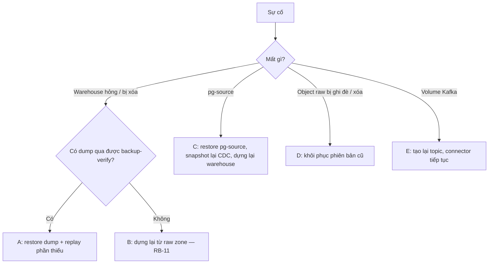

# Backup và khôi phục

> Trạng thái: **Review** · Cập nhật: 2026-09-27 · DOC-43
>
> Phụ thuộc: SDD §12.6, DOC-14 §7.4, §8, DOC-17 §3, DOC-18 §1, §6, DOC-21 §1, DOC-22 §4–6, DOC-38 §4, DOC-39 §6, DR-16, DR-64, DR-66, DR-70, EXP-04
>
> Người dùng chính: người vận hành (P3-09, RB-11), người viết DOC-40 (backup trên k3d)

Nguyên tắc (SDD §12.6): **raw zone là nguồn sự thật** để dựng lại warehouse. `pg_dump` chỉ là đường khôi phục nhanh, và là nơi duy nhất giữ những dữ liệu không suy ra được từ raw zone (§1).

## 1. Dữ liệu nào dựng lại được, dữ liệu nào không

| Dữ liệu | Dựng lại từ raw zone? | Được bảo vệ bởi | Mất gì nếu chỉ còn raw zone |
| --- | --- | --- | --- |
| `dw.fact_vehicle_position`, `dw.fact_trip_update`, `dw.fact_ticket_sales`, `dw.vehicle_position_latest` | Có, trong 30 ngày của raw zone (DOC-18 §1.4) | Raw zone; dump (trừ VP) | Dữ liệu cũ hơn 30 ngày (vé giữ 365 ngày trong warehouse nhưng raw chỉ 30 ngày; phần cũ hơn chỉ còn trong dump) |
| `dw.dim_sale_point`, `dw.dim_vehicle` | Có (CDC, placeholder, `vehicles.txt`) | Raw zone; dump | — |
| Dimension và lịch GTFS | Có, từ `s3://raw/gtfs-static/` (không hết hạn) | Raw zone; dump | Lịch sử phiên bản feed đã retire (chỉ giữ 3 bản, DOC-18) |
| `ops.dead_letter` | Một phần: replay sinh lại dòng cho record lỗi | Dump | Trạng thái xử lý (`TRIAGED`, `DISCARDED`, …), payload đã sửa, kết quả triage AI |
| `ops.dlq_action_log`, `ops.replay_request`, `ops.job_request`, `ops.alert_event` (kể cả ack), `ops.runtime_flag` | Không | Dump | Toàn bộ lịch sử thao tác của người vận hành và cảnh báo |
| `insight.*` (từ P4) | Có, bằng `recompute_analytics` (DOC-23), trừ phản hồi của người dùng | Dump | Phản hồi của điều phối viên cho gợi ý điều phối (P6) |
| Metadata `batch.BATCH_*`, `ops.etl_stream_batch` | Không, và không cần | Dump | Lịch sử chạy job (chỉ phục vụ tra cứu) |
| `ops.dedup_registry`, `exp.*` | Không cần (tạm thời) | Không | — |
| `ticketing_source` (`pg-source`) | Không (là nguồn) | Dump | Toàn bộ giao dịch (đây là hệ thống nguồn mô phỏng) |
| `pti_sim` (ledger) | Không | Dump | Ground truth của thực nghiệm; runner đã chép phần cần vào `experiments/results/` |
| Kafka | Không | Raw zone giữ bản sao của bốn topic nguồn | Offset consumer; `pti.events.ui` (không cần) |
| Raw zone | — | Versioning (bản cũ giữ 7 ngày) | Không có bản sao ngoài SeaweedFS (§3.2) |
| Cấu hình | — | Git | `.env` (secret) không nằm trong git; mất thì sinh lại (§4.6) |

## 2. RPO và RTO mục tiêu

Mục tiêu cho compose (máy dev, retention compose ở DOC-18). Con số RTO sẽ được thay bằng số đo của EXP-04 (§H3) và P3-09.

| Sự cố | Đường khôi phục | RPO | RTO (dữ liệu trực tiếp chạy lại) | RTO (lịch sử đầy đủ) |
| --- | --- | --- | --- | --- |
| Warehouse hỏng hoặc bị xóa, có dump | A (§4.2) | Fact: 0 (raw zone). Trạng thái vận hành: tới lần dump gần nhất (24 giờ trên k3d; compose theo lần `make backup` gần nhất) | ≤ 15 phút | Thêm thời gian replay VP của cửa sổ retention (compose 3 ngày ≈ 17 triệu message; ≈ 2,5 giờ ở 2.000 msg/s) |
| Warehouse hỏng, không có dump dùng được | B (§4.3, RB-11) | Fact: 0 trong 30 ngày. Trạng thái vận hành: mất hết (§1) | ≤ 30 phút (GTFS + replay 1 ngày gần nhất trước) | Replay 30 ngày TU và vé (≈ 33 triệu message, ≈ 4,5 giờ) cộng VP của cửa sổ retention |
| Mất `pg-source` | C (§4.4) | Tới lần dump gần nhất | ≤ 30 phút | Như B |
| Object raw bị ghi đè hoặc xóa nhầm | D (§4.5) | 0 nếu phát hiện trong 7 ngày | ≤ 15 phút | — |
| Mất volume Kafka | E (§4.6) | ≤ 5 phút (S3 sink rotate) cho dữ liệu chưa vào raw zone | ≤ 15 phút | — |

"Dữ liệu trực tiếp chạy lại" nghĩa là `etl-stream` ghi được dữ liệu mới, dimension và feed có mặt, API trả dữ liệu hiện tại. Lịch sử được bù ở nền, song song với luồng trực tiếp (an toàn nhờ guard, DOC-22 §4.5).

## 3. Backup

### 3.1 `pg_dump`

Script `deploy/compose/scripts/backup.sh` (gọi bằng `make backup`) và CronJob trên k3d (DOC-40) dùng cùng lệnh:

```bash
# warehouse: custom format, fact_vehicle_position data excluded (largest table, fully replayable)
pg_dump -h pg-warehouse -U pti_owner -d pti_warehouse -Fc -Z zstd:3 \
  --exclude-table-data='dw.fact_vehicle_position*' \
  --exclude-table-data='ops.dedup_registry' \
  --exclude-table-data='exp.*' \
  -f "backups/${TS}/pti_warehouse.dump"

pg_dump -h pg-source -U ticketing_owner -d ticketing_source -Fc -Z zstd:3 -f "backups/${TS}/ticketing_source.dump"
pg_dump -h pg-source -U sim_owner       -d pti_sim          -Fc -Z zstd:3 -f "backups/${TS}/pti_sim.dump"
```

- `TS` = giờ UTC dạng `20261012T040000Z`. Script chạy trong container `postgres` cùng phiên bản với server (`docker compose run --rm --no-deps` trên image `pg-warehouse`), để `pg_dump` luôn khớp phiên bản. Mật khẩu lấy từ `.env` qua `PGPASSWORD`.
- Dump giữ schema của **mọi** bảng (kể cả partition của VP, không dữ liệu), quyền (`GRANT`), default privileges và bảng lịch sử Flyway. Role là đối tượng cấp cluster nên không có trong dump; bootstrap (DOC-17 §3.1) tạo lại chúng.
- Sau khi dump, script ghi `backups/${TS}/manifest.json`: kích thước, SHA-256 của từng file, `feed_version` ACTIVE, số dòng của các bảng fact (trừ VP) và `max(event_timestamp)` mỗi bảng. Manifest giúp chọn dump và kiểm tra sau khi khôi phục.
- Giữ 7 bản mới nhất; script xóa thư mục cũ hơn. Thư mục `backups/` nằm trong `.gitignore`.
- Lịch: compose chạy `make backup` khi cần (trước khi nâng cấp Postgres, trước demo, trước EXP-04 nếu muốn giữ dữ liệu). k3d chạy CronJob 04:00 UTC hằng ngày và đẩy lên bucket `backup` của SeaweedFS (lifecycle 7 ngày, DOC-40).
- Kích thước dự kiến: phần lớn là `fact_trip_update` (30 ngày trên compose) và `fact_ticket_sales`. Con số thật được đo ở P3-09 và ghi vào bảng ở §6.

### 3.2 Raw zone

- Bucket `raw` bật versioning (DR-66). Bản không còn là hiện hành (noncurrent) được giữ 7 ngày; object của GTFS-rt và vé hết hạn sau 30 ngày; `gtfs-static/` không hết hạn (DOC-18 §1.4).
- Không có bản sao ra ngoài SeaweedFS. Chấp nhận cho môi trường dev và demo: mất volume `seaweedfs-data` thì chỉ còn dump (fact trừ VP) và dữ liệu Kafka 7 ngày (RB-10). Đây là rủi ro đã chấp nhận, ghi vào DOC-27 §rủi ro.

### 3.3 Kiểm tra backup

`make backup-verify [TS=<thư mục>]` (mặc định bản mới nhất):

1. Kiểm SHA-256 theo manifest.
2. `pg_restore --list` từng file (phát hiện file hỏng).
3. Khôi phục `pti_warehouse.dump` vào database tạm `pti_warehouse_verify` trên cùng instance, so số dòng với manifest, rồi `DROP DATABASE pti_warehouse_verify`.

Chạy sau mỗi `make backup` trên compose; trên k3d là Job chạy sau CronJob backup, lỗi thì alert `BatchJobFailed` không áp dụng (không phải Spring Batch) nên Job gửi kết quả qua metric của `kube-state-metrics` (`kube_job_status_failed`), DOC-40 định nghĩa alert.

## 4. Khôi phục



### 4.1 Lệnh dùng chung

| Lệnh (DOC-38 §4) | Việc |
| --- | --- |
| `make stop-apps` | Dừng `etl-stream`, `etl-batch`, `api`, `triage-worker` (giữ hạ tầng) |
| `make start-apps` | Khởi động lại các app trên |
| `make reset-warehouse` | DOC-39 §6 |
| `make restore-warehouse TS=<thư mục>` | §4.2 bước 2–4 |
| `make ensure-partitions FROM=<YYYY-MM-DD>` | Gọi `dw.ensure_partitions(<bảng>, FROM, today + 7)` cho mọi bảng trong `dw.partition_spec` bằng `pti_owner` (DOC-14 §7.4). Cần trước khi replay dữ liệu của ngày quá khứ, vì `PartitionMaintenanceJob` chỉ tạo partition từ hôm nay; dòng của ngày không có partition sẽ rơi vào DEFAULT |
| `make replay SOURCE=… FROM=… TO=…` | DOC-38 §4.3; từ P4 có thể dùng API `POST /etl/replays` hoặc Ops console |

### 4.2 A: Khôi phục từ dump rồi bù phần thiếu

1. `make stop-apps`. Ghi lại `t_stop` (giờ thật UTC) và committed offset của các consumer group (`make topics`).
2. `DROP DATABASE pti_warehouse WITH (FORCE)`, `CREATE DATABASE` theo bootstrap (DOC-17 §3.1).
3. `pg_restore -U pti_owner -d pti_warehouse --exit-on-error -j 4 backups/<TS>/pti_warehouse.dump`.
4. Chạy `db-migrate`: Flyway chỉ áp migration mới hơn dump (khi khôi phục sau nâng cấp).
5. `make ensure-partitions FROM=<today − retention VP>` (compose: 3 ngày).
6. `make start-apps`. `etl-stream` tiếp tục từ offset đã commit; `StaleExecutionRecoverer` đánh dấu `FAILED` các execution đang `STARTED` trong dump; `PartitionMaintenanceJob` chạy lúc khởi động.
7. **Bù khoảng giữa dump và sự cố** cho cả bốn nguồn: `make replay SOURCE=<s> FROM=<thời điểm dump − 1 giờ> TO=<t_stop + 1 phút>`, bắt đầu bằng `TICKETING_SALE_POINTS` (như EXP-04 §5). Khoảng > 7 ngày thì chia nhỏ (DB CHECK, DOC-15). Nếu `t_stop` còn chưa quá 10 phút thì chờ (DR-70).
8. **Bù VP** (không có trong dump): `make replay SOURCE=GTFS_RT_VEHICLE_POSITION FROM=<now − retention VP> TO=<thời điểm dump>`, chạy ở nền.
9. Từ P4: replay với `recompute_analytics = true` cho khoảng ở bước 7 (analytics của khoảng sau dump).
10. Xác nhận (§5).

Replay ở bước 7 chồng lên phần dữ liệu đã có trong dump: không sao, upsert với `:replay` chỉ ghi đè bản cùng event time bằng chính nội dung đó (DOC-14 §8).

### 4.3 B: Dựng lại từ raw zone (RB-11)

Tóm tắt; các bước đầy đủ và lệnh ở RB-11 (DOC-42). Tính đúng đắn của đường này là EXP-04.

1. `make reset-warehouse` với `PTI_GTFS_BOOTSTRAP_LOCATION=s3://raw/gtfs-static/<sha256>.zip` của feed đang ACTIVE trước sự cố (tên file có trong `make s3-ls P=gtfs-static/`; chọn theo manifest hoặc bản mới nhất). Offset Kafka giữ nguyên.
2. `make ensure-partitions FROM=<ngày cũ nhất cần dựng lại>`.
3. Replay theo thứ tự: `TICKETING_SALE_POINTS` → (`TICKETING_SALES`, `GTFS_RT_TRIP_UPDATE`) → `GTFS_RT_VEHICLE_POSITION`, **từ mới về cũ** theo từng khoảng 1 ngày: khoảng gần nhất trước để dữ liệu hiện tại có ngay. VP chỉ trong cửa sổ retention.
4. Từ P4: `recompute_analytics = true` trên các khoảng.
5. Xác nhận (§5). Trạng thái vận hành ở §1 bị mất; ghi lại vào sổ sự cố.

Nếu feed ACTIVE trước sự cố khác feed hiện tại trong `gtfs-static/` (đã đổi feed trong 30 ngày), replay dữ liệu cũ với feed mới làm một phần record rơi vào DLQ `DQ-03`/`DQ-04` (DOC-22 §4.4). Khi đó nạp và activate feed cũ trước, replay khoảng thời gian của nó, rồi nạp feed mới.

### 4.4 C: Mất `pg-source`

`ticketing_source` là hệ thống nguồn (mô phỏng). Sau khi khôi phục nó vào một instance mới, LSN của WAL bắt đầu lại từ giá trị nhỏ hơn LSN mà warehouse đã lưu trong `fact_ticket_sales.source_lsn`, nên guard LSN (DOC-14 §8.3) sẽ **chặn mọi thay đổi** của các giao dịch đã có. Vì vậy đường C luôn dựng lại warehouse:

1. `make stop-apps`; dừng connector `debezium-ticketing` (`make connectors`).
2. Tạo lại `pg-source` (volume mới), bootstrap tạo role; `pg_restore` `ticketing_source.dump` và `pti_sim.dump`. Publication `pti_ticketing` có trong dump (migration `ticketing` tạo, DR-64).
3. `PUT /connectors/debezium-ticketing/stop`, xóa offset của connector (`DELETE /connectors/debezium-ticketing/offsets`, KIP-875), rồi `PUT /connectors/debezium-ticketing/resume`. Connector không thấy offset nên tạo slot mới và snapshot toàn bộ bảng (`snapshot.mode = initial`, `__op = r`).
4. Đường B cho warehouse, **trừ** replay `TICKETING_SALES` và `TICKETING_SALE_POINTS` từ raw zone: dữ liệu vé đến từ snapshot mới. Replay vé cũ (LSN cũ, lớn hơn) sau snapshot sẽ bị guard hiểu là "mới hơn" và ghi đè trạng thái hiện tại bằng trạng thái cũ.
5. Giao dịch giữa lần dump và sự cố bị mất ở nguồn, nên cũng mất ở warehouse. Đây là RPO của `pg-source`.

Trên compose, `make reset` (bắt đầu lại từ đầu) thường đơn giản hơn đường C. Đường C được giữ để tài liệu hóa ràng buộc LSN.

### 4.5 D: Object raw bị ghi đè hoặc xóa

1. Liệt kê phiên bản: `aws s3api list-object-versions --bucket raw --prefix <topic>/dt=<d>/hh=<h>/` (credential `admin`, trong `make s3-shell`: container `amazon/aws-cli` nối mạng `pti_default`).
2. Xóa delete marker (object bị xóa) hoặc chép phiên bản cũ lên thành bản hiện hành (object bị ghi đè): `aws s3api copy-object --copy-source raw/<key>?versionId=<id> --bucket raw --key <key>`.
3. Nếu warehouse đã bị ảnh hưởng (ví dụ replay đã chạy trên object sai), replay lại khoảng giờ đó.

Chỉ làm được trong 7 ngày (lifecycle noncurrent).

### 4.6 E: Mất volume Kafka và các trường hợp khác

- **Kafka:** `make up` chạy lại `kafka-init` (tạo topic theo `topics.yaml`) và `kafka-connect-init` (đăng ký connector). Consumer group mất offset nên bắt đầu theo `auto.offset.reset = earliest` (DOC-20 §2), tức từ đầu topic mới, vốn trống: không đọc lại gì. Debezium mất offset thì snapshot lại (`__op = r`, LSN hiện tại, guard xử lý đúng). Dữ liệu GTFS-rt đã ack nhưng chưa vào raw zone (≤ 5 phút) và chưa được ETL ghi thì mất; so với ledger để biết số lượng.
- **SeaweedFS:** không khôi phục được raw zone (§3.2). Warehouse vẫn còn; từ lúc này raw zone chỉ có dữ liệu mới. Ghi vào sổ sự cố rằng EXP-04 và đường B không còn áp dụng cho khoảng trước đó.
- **`.env` mất:** `make secrets` sinh mật khẩu mới, nhưng volume Postgres vẫn giữ mật khẩu cũ. Đổi mật khẩu theo RB-12 (DOC-42), hoặc `make reset` trên compose.
- **Keycloak** (dev-file): realm import lại từ `realm-pti.json` lúc khởi động; tài khoản tạo thêm bằng tay bị mất (chỉ có user demo).

## 5. Xác nhận sau khi khôi phục

| Kiểm tra | Cách | Đạt khi |
| --- | --- | --- |
| Ứng dụng khỏe | `make ps`, `make smoke` (DOC-39 §8) | Pass |
| Dữ liệu mới vào | `GET /system/freshness` (P4) hoặc `max(event_timestamp)` của fact | Tuổi dữ liệu < 60 giây |
| Replay xong | `ops.replay_request` | Mọi yêu cầu `DONE`, `stats.skipped` không tăng bất thường so với tỷ lệ DLQ thường |
| Không dòng nào ở DEFAULT | DQ-21 (DOC-16 §3) hoặc `SELECT count(*)` trên từng `dw.fact_*_default` | 0 |
| Khớp manifest (đường A) | Số dòng fact (trừ VP) ≥ số trong manifest | Đúng |
| Checksum (đường B, khi còn bản so sánh) | `experiments/sql/checksum/*.sql` (DR-58) trên khoảng đã dựng lại | Khớp |
| Alert | Grafana `pti-overview`, Alertmanager | Không còn alert critical |

## 6. Số đo (điền ở P3-09)

| Chỉ số | Giá trị |
| --- | --- |
| Kích thước dump `pti_warehouse` (compose, dữ liệu 7 ngày) | … |
| Thời gian `make backup` / `make backup-verify` | … / … |
| Thời gian `pg_restore` | … |
| Thông lượng replay theo nguồn (từ EXP-04) | … |
| RTO đo được của đường A và B (diễn tập một lần mỗi đường) | … |

## 7. Test bắt buộc

| ID | Kiểm tra | Khi nào |
| --- | --- | --- |
| BR-01 | `make backup` rồi `make backup-verify`: SHA khớp, `pg_restore --list` pass, số dòng khớp manifest | P3-09, rồi nightly trên compose ở P8 |
| BR-02 | Diễn tập đường A trên compose: dữ liệu 1 giờ, dump, thêm 20 phút dữ liệu, `make stop-apps`, xóa warehouse, khôi phục; so với ledger: `lost = 0` cho GTFS-rt, số giao dịch khớp `ticketing_source` | P3-09 |
| BR-03 | Đường B = EXP-04 | P3-08 |
| BR-04 | Đường D: ghi đè một object raw bằng nội dung rác, khôi phục phiên bản cũ, replay giờ đó → checksum khớp trước khi ghi đè | P3-09 |
| BR-05 | `make ensure-partitions FROM=<3 ngày trước>` rồi replay dữ liệu 3 ngày trước: không dòng nào ở DEFAULT | P3-09 |
| BR-06 | Script backup giữ đúng 7 bản mới nhất | Unit test của script (bats) hoặc kiểm tay |

## 8. Câu hỏi còn mở

Không có. Quyết định đã chốt khi viết (ủy quyền Owner): không dùng WAL archiving/PITR của CNPG trên k3d (RPO 24 giờ cho trạng thái vận hành là chấp nhận được với môi trường demo; fact có RPO 0 nhờ raw zone); không sao lưu raw zone ra ngoài SeaweedFS.
