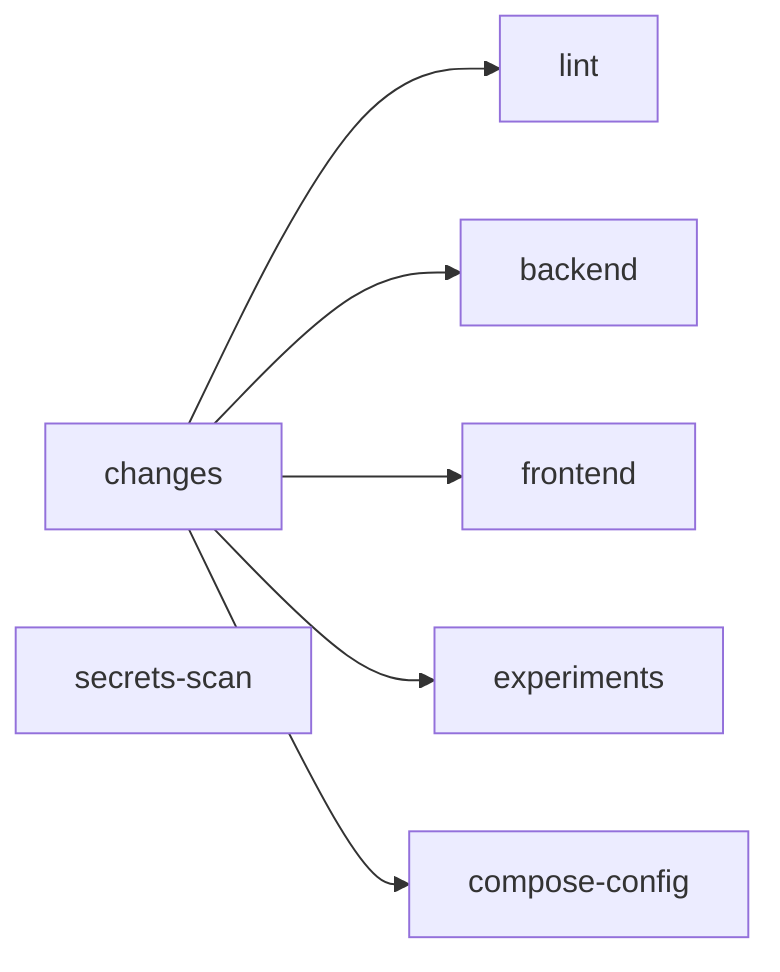

# CI/CD

> Trạng thái: **Review** · Cập nhật: 2026-09-27 · DOC-41
> Phụ thuộc: [DOC-11](../03-architecture/tech-stack-and-versions.md), [DOC-38](local-dev.md), [DOC-39](deploy-compose.md), [DOC-40](deploy-k8s.md), [DOC-44](../10-testing/test-strategy.md), [ADR-0028](../04-adr/0028-kubernetes-tooling.md), [DR](../00-decision-register.md) (DR-44, 53, 56, 61)
> Người dùng chính: P1-03, P2-19, P4-15, P5-01, P7-01, P8-01, P8-02, P8-07

Pipeline chạy trên GitHub Actions của một repo **public** (DR-56). Runner chuẩn của GitHub cho repo public không giới hạn số phút và đủ lớn để chạy cả stack, nên mọi job đều chạy trên runner của GitHub; dự án không dùng self-hosted runner. Nguyên tắc: **PR chỉ chạy những gì cần để quyết định merge, để có phản hồi nhanh; việc chậm chạy sau khi merge hoặc theo lịch.**

Các mục §1–§9 có từ gate P1 (cấu trúc workflow, điều kiện chặn merge, cache, tag image). §10 mô tả phần hoàn thiện ở P8: E2E, deploy k3d, release và báo cáo. Runner `ubuntu-24.04` của repo public có 4 vCPU và 16 GB RAM (số liệu lúc viết; kiểm lại ở P8-02, §7), đủ cho compose đủ profile (≈ 10 GB, DOC-10 §5) hoặc k3d `lite` (13 GB, DOC-40 §2). Mỗi môi trường chạy trên một runner riêng (§10.3).

## 1. Workflow

| File | Trigger | Job | Thời gian mục tiêu | Có từ |
| --- | --- | --- | --- | --- |
| `.github/workflows/pr.yml` | `pull_request` vào `main` | `changes`, `lint`, `backend`, `frontend`, `experiments`, `compose-config`, `secrets-scan` | ≤ 12 phút | P1-03 (frontend từ P5-01) |
| `.github/workflows/main.yml` | `push` lên `main` | Mọi job của PR (chạy lại toàn bộ, không lọc theo path) + `contract`, `security`, `images` | ≤ 25 phút | P1 (images), P2 (contract), P3 (security) |
| `.github/workflows/nightly.yml` | `schedule: '0 19 * * *'` (02:00 giờ Việt Nam) và `workflow_dispatch` | `slow-tests`, `dependency-report`, `ghcr-cleanup` | ≤ 35 phút | P2 |
| `.github/workflows/full-stack.yml` | `schedule: '0 20 * * *'` (03:00 giờ Việt Nam), `workflow_dispatch` (input `sha`, `run_k3d`) | `e2e-compose`, `k3d-lite` chạy song song, mỗi job một runner (§10.3) | ≤ 60 phút | P5 (e2e), P7 (k3d) |
| `.github/workflows/release.yml` | Tag `v*.*.*` | Gắn tag phiên bản cho image đã build ở `main` (không build lại), tạo GitHub Release với changelog | ≤ 5 phút | P8 |

`concurrency`: `group: ${{ github.workflow }}-${{ github.ref }}`, `cancel-in-progress: true` cho PR (commit mới hủy lần chạy cũ); `false` cho `main` và nightly.

Mọi job chạy trên `ubuntu-24.04`, `timeout-minutes` đặt rõ cho từng job, `permissions` tối thiểu (`contents: read`; riêng `images` có thêm `packages: write`).

## 2. Workflow PR

| Job | Chạy khi (path filter, `dorny/paths-filter`) | Bước |
| --- | --- | --- |
| `changes` | Luôn chạy | Xuất các cờ `backend`, `frontend`, `experiments`, `deploy`, `docs` |
| `lint` | `backend` hoặc `frontend` | `./gradlew spotlessCheck checkstyleMain checkstyleTest`; `pnpm -C frontend lint && pnpm -C frontend typecheck` |
| `backend` | `backend` = `**/*.gradle.kts`, `gradle/**`, `build-logic/**`, `common/**`, `analytics/**`, `etl/**`, `api/**`, `triage-worker/**`, `source-simulator/**`, `db/**` | `./gradlew build -x integrationTest` (compile, unit test, JaCoCo); rồi `./gradlew integrationTest` **chỉ cho module bị ảnh hưởng** (task `affectedIntegrationTest` trong `build-logic`: module đổi và các module phụ thuộc vào nó). Testcontainers dùng Docker có sẵn trên runner |
| `frontend` | `frontend/**`, `api/openapi.json` | `pnpm install --frozen-lockfile`, `pnpm gen:api` rồi `git diff --exit-code` (type sinh ra phải khớp với file đã commit), `pnpm test --run`, `pnpm build` |
| `experiments` | `experiments/**` | `uv sync --frozen`, `uv run ruff check`, `uv run pytest -q` |
| `k8s-render` | `deploy/k3d/**`, `deploy/helm/**`, `deploy/helmfile.yaml.gotmpl`, `deploy/topics.yaml`, `connect/connectors/**`, `chaos/**`, `deploy/compose/observability/prometheus/rules/**` | §10.2 (KD-01, KD-02, KD-07 của DOC-40) |
| `compose-config` | `deploy/**`, `connect/**` | `docker compose config -q` với mọi tổ hợp profile (C-01, DOC-39 §9); `shellcheck` cho `deploy/**/*.sh`; kiểm tra `deploy/topics.yaml` theo schema; `promtool check rules` và `promtool test rules` cho `deploy/compose/observability/prometheus/` (DOC-28 §6.1); `amtool check-config` cho Alertmanager |
| `secrets-scan` | Luôn chạy | `gitleaks detect --redact` trên diff của PR. `.env.example` không được có giá trị. `.gitleaks.toml` bỏ qua `deploy/k3d/sealed/**` (đã mã hóa, DOC-40 §8.2) và **không** bỏ qua `deploy/k3d/.generated/**` |

PR chỉ sửa `docs/**` thì chỉ `changes` và `secrets-scan` chạy (thêm một job `markdown-links` kiểm tra link nội bộ bằng `lychee --offline`).

## 3. Workflow `main`

Chạy lại mọi job ở §2 trên toàn repo, rồi thêm:

| Job | Bước | Có từ |
| --- | --- | --- |
| `contract` | `./gradlew contractTest`: JSON Schema ↔ producer (simulator) và consumer (etl); Debezium thật trong Testcontainers (DR-44); `openapi-diff` giữa `api/openapi.json` của commit này và của tag phát hành gần nhất. Có breaking change mà PR không có nhãn `breaking-api` thì job fail | P2-19, P4-15 |
| `security` | SpotBugs (`./gradlew spotbugsMain`); OWASP Dependency-Check (`./gradlew dependencyCheckAggregate`, cache NVD, fail khi CVSS ≥ 9); `pnpm audit --prod --audit-level=critical`; Trivy quét image vừa build (fail khi có CVE CRITICAL đã có bản sửa) | P3 |
| `images` | Build và đẩy image (§5) | P1-14 |

Nếu `contract` hoặc `security` fail trên `main`, PR tiếp theo bị chặn (§4) cho tới khi có PR sửa. Cách này đẩy các job đắt ra khỏi PR mà vẫn không để lỗi tồn tại lâu.

`openapi-diff` cũng chạy ở PR khi `api/**` đổi (chỉ tốn khoảng 1 phút), để breaking change bị phát hiện trước khi merge.

## 4. Điều kiện chặn merge (branch protection cho `main`)

- Bắt buộc PR; không push thẳng; không force push.
- Status check bắt buộc: `changes`, `lint`, `backend`, `frontend`, `experiments`, `k8s-render`, `compose-config`, `secrets-scan`. Job bị bỏ qua do path filter được tính là pass (GitHub coi job `skipped` là thành công).
- Check `main-healthy`: một job nhỏ trong `pr.yml` gọi API lấy kết quả `main.yml` gần nhất; nếu fail thì PR fail, trừ khi PR có nhãn `fix-main`.
- Squash merge; tiêu đề PR theo Conventional Commits bằng tiếng Anh (DR-61), được kiểm tra bằng `amannn/action-semantic-pull-request`.
- Không bắt buộc review (dự án một người), nhưng mọi thay đổi vẫn đi qua PR để CI chạy.

## 5. Image và tag

| Image | Build bằng | Nguồn |
| --- | --- | --- |
| `pti-etl`, `pti-api`, `pti-triage-worker`, `pti-source-simulator`, `pti-db-migrate` | Jib (`./gradlew jib`), base `eclipse-temurin:25-jre` pin digest, `linux/amd64` + `linux/arm64` | Module Gradle |
| `pti-connect` | `docker buildx build --platform linux/amd64,linux/arm64` | `connect/Dockerfile` |
| `pti-frontend` | `docker buildx build`, multi-stage (`node:24` build → `nginx` alpine) | `frontend/Dockerfile` |
| `pti-connect-strimzi` (P7) | `docker buildx build`, plugin tải theo `deploy/versions.env` và kiểm SHA-256 | `connect/Dockerfile.strimzi` (DOC-40 §6.3) |

Tag, registry `ghcr.io/<owner>/`:

| Tag | Khi nào | Thay đổi được? |
| --- | --- | --- |
| `<git-sha>` (40 ký tự) | Mỗi lần push lên `main` | Không. Compose demo và k3d trong CI dùng tag này |
| `main` | Mỗi lần push lên `main` | Có (trỏ tới bản mới nhất) |
| `vX.Y.Z` | `release.yml`, gắn cho image của đúng commit được tag | Không |

- Mọi image build cho `linux/amd64` và `linux/arm64`: runner GitHub là amd64, máy dev là arm64.
- Package trên GHCR để **public** (DR-56), nên compose và k3d kéo được mà không cần đăng nhập. Lần đầu mỗi package xuất hiện (P1-03, P7 cho `pti-connect-strimzi`), đặt visibility Public ở Package settings; bước cuối của job `images` kiểm bằng `docker logout ghcr.io && docker pull ghcr.io/<owner>/pti-api:<sha>` và fail nếu bị từ chối.
- Label OCI: `org.opencontainers.image.source`, `revision` (SHA), `created`.
- Jib dùng `jib.from.image` có digest, và `jib.container.creationTime = USE_CURRENT_TIMESTAMP` chỉ bật khi build trong CI (build cục bộ giữ reproducible).
- Chỉ `main.yml` có quyền đẩy image. PR build image bằng `jibBuildTar` khi cần kiểm tra, không đẩy.
- GHCR dọn image `<sha>` cũ hơn 30 ngày không có tag phiên bản (`actions/delete-package-versions`, chạy trong nightly).

## 6. Cache

| Thứ | Cách |
| --- | --- |
| Gradle | `gradle/actions/setup-gradle` (cache dependency, wrapper, build cache cục bộ). Chỉ `main` ghi cache (`cache-read-only: ${{ github.ref != 'refs/heads/main' }}`), PR chỉ đọc |
| Configuration cache | Bật (`org.gradle.configuration-cache=true`), cache cùng Gradle |
| pnpm | `actions/setup-node` với `cache: pnpm` |
| uv | `astral-sh/setup-uv` với `enable-cache: true` |
| Image Testcontainers | Không cache (kéo mỗi lần, vài trăm MB; mạng của runner GitHub đủ nhanh) |
| NVD (Dependency-Check) | `actions/cache` theo tuần, key `nvd-<năm>-<tuần>` |
| Công cụ | `jdx/mise-action` cài đúng phiên bản trong `mise.toml` (Java, Node, pnpm, Python, uv), giống máy dev |

## 7. Số phút và tài nguyên runner (DR-56)

Repo public dùng runner chuẩn của GitHub miễn phí, không giới hạn số phút. Các giới hạn còn lại:

| Giới hạn | Giá trị lúc viết | Ảnh hưởng |
| --- | --- | --- |
| RAM, CPU của `ubuntu-24.04` | 16 GB, 4 vCPU | Vừa compose đủ profile hoặc k3d `lite`, không vừa cả hai trên một runner (§10.3) |
| Đĩa trống | Khoảng 14 GB được bảo đảm ở `/`; phần còn lại bị các bộ công cụ cài sẵn chiếm | Job của `full-stack.yml` dọn đĩa trước khi kéo image (§10.3, bước 0) |
| Thời gian một job | 6 giờ | Không ảnh hưởng (`timeout-minutes` của mọi job ≤ 60) |
| Số job song song | 20 | Không ảnh hưởng |

Thông số runner có thể thay đổi. P8-02 kiểm lại bằng bước 0 của §10.3 (in `nproc`, `free -g`, `df -h /`); nếu RAM thấp hơn 15 GB thì job fail với thông báo rõ ràng, và phương án là chạy tay trên máy dev (`make up-demo && make e2e`, `make k8s-up && make k8s-smoke`) rồi ghi kết quả vào release.

Nightly vẫn thoát sớm khi không có commit mới trên `main`, để lịch sử Actions không đầy các lần chạy trùng.

## 8. Dependabot và cập nhật phiên bản

`.github/dependabot.yml`:

| Ecosystem | Thư mục | Lịch | Gom nhóm |
| --- | --- | --- | --- |
| `gradle` | `/` | Hằng tuần | `spring-boot`, `testcontainers`, `others` |
| `npm` | `/frontend` | Hằng tuần | `react`, `tanstack`, `dev-dependencies` |
| `uv` | `/experiments` | Hằng tháng | Một nhóm |
| `github-actions` | `/` | Hằng tháng | Một nhóm |
| `docker` | `/connect`, `/frontend` | Hằng tháng | — |

Image hạ tầng trong `deploy/versions.env` không do Dependabot quản lý. Việc cập nhật làm tay theo quy trình ở DOC-39 §7.

## 9. Secret của CI

| Secret | Dùng ở | Ghi chú |
| --- | --- | --- |
| `GITHUB_TOKEN` | Đẩy image lên GHCR, gọi API | Có sẵn; cấp `packages: write` cho job `images` |
| `NVD_API_KEY` | Dependency-Check | Không bắt buộc, giúp tải dữ liệu NVD nhanh hơn |
| `TYPESAFE_API_KEY` | **Không dùng trong CI** | CI chạy `PTI_TRIAGE_PROVIDER=fake` (DR-56). k3d `lite` dùng `jev-stub` |
| `SEALED_SECRETS_CRT`, `SEALED_SECRETS_KEY` | `k3d-lite` (§10.3) | Cặp khóa niêm phong (DOC-40 §8.1), dạng PEM. Workflow ghi vào `$RUNNER_TEMP/sealing/` (quyền 600) và đặt `PTI_SEALING_KEY_DIR`; xóa ở bước `always()` cuối job. Environment `k3d` của GitHub giới hạn secret này cho workflow `full-stack.yml` trên `main` |

Test không bao giờ gọi dịch vụ ngoài thật. Log CI không in giá trị secret.

### 9.1 An toàn khi repo public

- Workflow chạy cho PR chỉ dùng trigger `pull_request`, **không** dùng `pull_request_target`. PR từ fork chạy với `GITHUB_TOKEN` chỉ đọc và không nhận secret nào. Settings → Actions đặt "Require approval for all external contributors".
- Secret dùng cho deploy (`SEALED_SECRETS_*`) nằm trong environment `k3d`, chỉ cấp cho `full-stack.yml` chạy trên `main` (deployment branch rule).
- Bật secret scanning và push protection của GitHub (miễn phí cho repo public), bổ sung cho `gitleaks` (§2).
- Log Actions và artifact ai cũng xem được. `.env` của CI sinh mới mỗi lần và không bao giờ được upload; artifact chỉ gồm log container, video, trace Playwright và báo cáo. Token trong trace Playwright là token của realm thử nghiệm (`viewer`, `operator`), hết hạn sau 5 phút và chỉ dùng được với Keycloak trong runner đã bị hủy.
- File trong `deploy/k3d/sealed/` được công khai ở dạng đã mã hóa; chỉ khóa bí mật (GitHub Secrets và máy người dùng, DOC-40 §8.1) giải mã được.
- Mật khẩu mặc định của realm (`viewer`/`viewer`, `operator`/`operator`) là dữ liệu demo, công khai có chủ đích; mọi cổng của compose chỉ bind `127.0.0.1` (DOC-38 §5).

## 10. Phần hoàn thiện ở P8

### 10.1 Nightly (runner của GitHub)

| Job | Bước | Có từ |
| --- | --- | --- |
| `slow-tests` | `./gradlew slowTest`, rồi test `quarantine` (`continue-on-error: true`), rồi `./gradlew testIdReport`; upload báo cáo JUnit và số đo throughput (DOC-44 §14) | P2 |
| `dependency-report` | `./gradlew dependencyUpdates` và `pnpm -C frontend outdated --format json`, gắn vào job summary; không fail | P2 |
| `ghcr-cleanup` | `actions/delete-package-versions` xóa image `<sha>` cũ hơn 30 ngày không có tag phiên bản (§5) | P1 |

Nightly thoát sớm nếu không có commit mới trên `main` từ lần chạy thành công trước (§7 điểm 1).

### 10.2 `k8s-render` (PR và `main`, runner của GitHub)

Không cần cluster; khoảng 2 phút.

1. Cài `helm`, `helmfile`, `kubeconform` theo `mise.toml`.
2. `helm lint deploy/helm/pti-infra deploy/helm/pti` với từng file `values-{dev,staging,lite}.yaml`.
3. `helmfile -e <env> template --skip-deps > $RUNNER_TEMP/<env>.yaml` cho ba môi trường (chart bên thứ ba lấy từ cache `~/.cache/helm`, key theo hash của `deploy/versions.env`).
4. `kubeconform -strict -summary -schema-location default -schema-location 'https://raw.githubusercontent.com/datreeio/CRDs-catalog/main/{{.Group}}/{{.ResourceKind}}_{{.ResourceAPIVersion}}.json'` trên ba file (KD-01). CR không có schema trong catalog thì bị bỏ qua có ghi log, không fail.
5. `deploy/k3d/scripts/check-render.py` (KD-02): số `KafkaTopic` bằng số topic trong `deploy/topics.yaml`; số `KafkaConnector` bằng số file trong `connect/connectors/`; mọi `alert:` và `record:` trong `deploy/compose/observability/prometheus/rules/pti-*.yml` có trong `PrometheusRule` `pti-rules`; không còn chuỗi `${env:` trong `KafkaConnector`.
6. `deploy/k3d/scripts/check-roles.py` (KD-07): `connectionLimit` trong `managed.roles` bằng `CONNECTION LIMIT` trong `deploy/compose/postgres/10-bootstrap.sh`.
7. `kubeseal --validate` trên mọi file `deploy/k3d/sealed/**` bằng `deploy/k3d/sealed/pub-cert.pem` (không cần khóa bí mật).

### 10.3 `full-stack.yml` (runner của GitHub)

**Runner.** `ubuntu-24.04` (amd64), mỗi job một runner. `e2e-compose` và `k3d-lite` chạy **song song** vì hai môi trường không vừa RAM của một runner nhưng mỗi runner là một máy riêng. Image được build cho cả `linux/amd64` và `linux/arm64` (§5), nên cùng image chạy trên runner và trên máy dev. Workflow không chạy trên `pull_request`, chỉ trên lịch và `workflow_dispatch`.

**Bước 0 của cả hai job (dọn đĩa và kiểm tài nguyên).** Xóa bộ công cụ cài sẵn không dùng (`sudo rm -rf /usr/share/dotnet /usr/local/lib/android /opt/ghc /opt/hostedtoolcache/CodeQL`, `docker image prune -af`), rồi in `nproc`, `free -g`, `df -h /`. Fail sớm nếu RAM tổng < 15 GB hoặc đĩa trống < 30 GB, kèm thông báo "runner specs changed, see DOC-41 §7". Sau đó `jdx/mise-action` cài công cụ theo `mise.toml` (gồm k3d, helm, helmfile, kubectl, kubeseal, kubectl-cnpg cho `k3d-lite`).

**`e2e-compose`** (khoảng 35 phút):

1. Checkout đúng `sha` (mặc định HEAD của `main`), đặt `PTI_IMAGE_TAG=<sha>`, kéo image từ GHCR (không build lại, để test đúng image đã qua `security`).
2. `COMPOSE_PROJECT_NAME=pti-ci make secrets up-demo` (`.env` sinh mới trong runner, không upload).
3. `make smoke` (DOC-39 §8).
4. `pnpm -C frontend e2e` với `E2E_BASE_URL=http://localhost:8080`: hai project `main` và `late` của DOC-44 §10, gồm E2E-DEMO-01…04 (DOC-36 Demo control). Ca `@p6` chạy vì `up-demo` có triage-worker (`provider=fake`).
5. Từ P8: `make demo-kill-consumer` rồi `make demo-check SINCE=10m` (E2E-DEMO-12, DOC-46 §9.2). Chạy sau Playwright để lần kill không làm nhiễu các ca E2E khác.
6. `observability/check-dashboards.sh` (O-09, DOC-28 §9) và Lighthouse CI (`pnpm -C frontend lhci`, NFR-12). Từ P8, chạy thêm Playwright với WebKit (`--project=webkit-main`), không chặn job.
7. `always()`: upload video, trace Playwright, báo cáo Lighthouse, `docker compose logs` (nén) làm artifact giữ 14 ngày. Runner bị hủy sau job nên không cần dọn.

**`k3d-lite`** (khoảng 45 phút; bỏ qua khi `run_k3d = false`):

1. Ghi khóa niêm phong từ Secrets (§9), `PTI_SEALING_KEY_DIR=$RUNNER_TEMP/sealing`.
2. `make k8s-up ENV=lite K8S_IMAGE_SOURCE=ghcr PTI_IMAGE_TAG=<sha>`: `k8s-up.sh` bỏ bước build và push, đặt `image.registry=ghcr.io/<owner>`. Image trên GHCR là public (§5) nên không cần pull secret.
3. `make k8s-smoke` (DOC-40 §15).
4. `helmfile -e lite diff --detailed-exitcode` phải trả 0 (KD-04: apply lần hai không đổi gì).
5. Từ P8: `make demo-pg-failover` rồi `make demo-check ENV=k3d SINCE=10m`, và số restart của pod app không đổi (E2E-DEMO-13, DOC-46 §9.2).
6. Chạy thử một lần mỗi manifest trong `chaos/` với `duration` 30 giây, chờ mọi pod `Ready` lại, rồi `make k8s-smoke` lần nữa. Đây là kiểm tra manifest còn áp được (P7-08), không phải EXP-08.
7. `always()`: `kubectl get events -A --sort-by=.lastTimestamp` và log mọi pod trong `pti` làm artifact (không gồm Secret); xóa `$RUNNER_TEMP/sealing`.

### 10.4 Release (`release.yml`, P8-07)

1. Chỉ chạy với tag `vX.Y.Z` trỏ tới một commit trên `main` mà `main.yml` đã xanh **và** có một lần chạy `full-stack.yml` thành công trên đúng SHA đó (kiểm bằng API). Không đủ thì fail với thông báo cần chạy `full-stack.yml` bằng tay trước.
2. `crane tag ghcr.io/<owner>/pti-<image>:<sha> vX.Y.Z` cho mọi image ở §5 (không build lại).
3. Changelog sinh từ tiêu đề PR theo Conventional Commits kể từ tag trước (`git-cliff`, cấu hình `cliff.toml` nhóm theo `feat`, `fix`, `perf`, `docs`, `chore`); tạo GitHub Release với changelog và bảng digest image.

### 10.5 Coverage

- `backend`: gate JaCoCo theo DOC-44 §7 (dữ liệu gộp `test` + `integrationTest` ở `main.yml`; ngưỡng thấp hơn 10 điểm ở PR). Bảng coverage theo module gắn vào job summary.
- `frontend`: `vitest --coverage` với ngưỡng của DOC-44 §7.
- Không dùng dịch vụ coverage bên ngoài.

### 10.6 Thông báo lỗi

- `nightly.yml` và `full-stack.yml` fail: bước `if: failure()` tạo issue (hoặc thêm comment vào issue đang mở) có nhãn `ci-nightly` hoặc `ci-full-stack`, kèm link lần chạy và tên job fail. Lần chạy thành công sau đó đóng issue.
- `main.yml` fail đã chặn PR qua `main-healthy` (§4), không cần thêm issue.

## 11. Câu hỏi còn mở

Không có.
