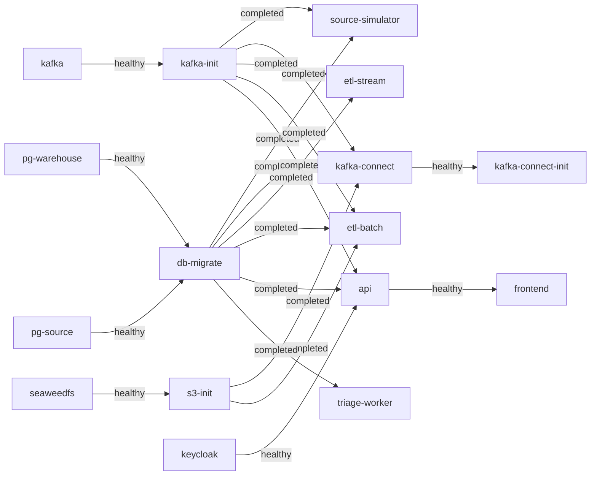

# Triển khai bằng Docker Compose

> Trạng thái: **Approved** · Cập nhật: 2026-09-28 · DOC-39
> Phụ thuộc: [DOC-07](../03-architecture/system-context-and-containers.md), [DOC-09](../03-architecture/messaging-contracts.md), [DOC-10](../03-architecture/quality-attributes.md) §3.3 và §5, [DOC-11](../03-architecture/tech-stack-and-versions.md), [DOC-17](../05-data/db-roles-and-grants.md), [DOC-29](../06-design/configuration-reference.md), [ADR-0012](../04-adr/0012-raw-zone-s3-sink.md), [ADR-0014](../04-adr/0014-deployment-units.md), [ADR-0024](../04-adr/0024-flyway-migration-job.md), [DR](../00-decision-register.md) (DR-05, 26, 27, 49, 50, 51, 64, 66, 67)
> Người dùng chính: P1-04, P1-06, P1-12…14, P2-20, P4-16, P5-15, P6-09; môi trường dev, demo và thực nghiệm P3

Compose là môi trường chính của dự án: dev, demo và mọi thực nghiệm EXP-01…06 đều chạy trên đó. DOC-38 hướng dẫn người dùng; tài liệu này là **đặc tả để viết `deploy/compose/`**: service nào, cấu hình ra sao, khởi động theo thứ tự nào, dùng bao nhiêu tài nguyên, lấy secret ở đâu.

## 1. Bố cục file

```
deploy/
  versions.env                      # tag + digest của image hạ tầng (DOC-11 §1)
  topics.yaml                       # nguồn duy nhất của danh sách topic (DOC-09 §1)
  compose/
    compose.yaml                    # mọi service, chia bằng profiles
    .env.example                    # tên biến, không có giá trị (copy sang ../../.env)
    postgres/warehouse/10-bootstrap.sh    # DOC-17 §3.1
    postgres/source/10-bootstrap.sh       # DOC-17 §3.1
    kafka/create-topics.sh          # đọc topics.yaml, tạo hoặc sửa config topic (idempotent)
    seaweedfs/s3.json.tmpl          # mẫu identity; make secrets render ra .generated/s3.json
    seaweedfs/s3-init.sh            # tạo bucket raw, versioning, lifecycle (DR-66)
    seaweedfs/lifecycle.json        # lifecycle rule của DOC-18 §1.4
    connect/register.sh             # PUT /connectors/<name>/config cho mọi file trong deploy/connect/connectors/
    keycloak/realm-pti.json         # realm, client, role, user demo (DOC-27)
    observability/                  # prometheus.yml, rules/, alertmanager.yml, loki, tempo, alloy, otel, grafana/provisioning
    toxiproxy/toxiproxy.json        # proxy cho profile experiment
    scripts/secrets.sh              # make secrets (§5)
    scripts/wait-stack.sh           # make up: chờ service healthy và job một lần thoát 0 (§4)
    scripts/backup.sh, restore-warehouse.sh, ensure-partitions.sh, replay.sh   # DOC-43, DOC-38 §4
    .generated/                     # (gitignored) s3.json, webhook-token
  connect/
    Dockerfile                      # FROM quay.io/debezium/connect:3.6.3.Final + Aiven S3 sink (S-04)
    connectors/debezium-ticketing.json
    connectors/pti-raw-sink.json    # tên connector pti-raw-sink, consumer group connect-pti-raw-sink (DOC-09 §7)
  tiles/
    fetch.sh                        # make tiles (ADR-0021); PMTiles, fonts/, sprites/ đều gitignored
Makefile                            # DOC-38 §4
.env                                # (gitignored) sinh bởi make secrets
```

`compose.yaml` đặt `name: pti` để tên container, network và volume có tiền tố `pti-` bất kể thư mục clone. Makefile luôn gọi `docker compose -f deploy/compose/compose.yaml --env-file deploy/versions.env --env-file .env` (compose chỉ nội suy biến từ `--env-file`, nên `versions.env` được nạp theo cách này) và đặt `BUILDX_NO_DEFAULT_ATTESTATIONS=1`: attestation mặc định chứa thời điểm build, làm image id đổi sau mỗi lần build và compose tạo lại container dù code không đổi (C-03).

## 2. Profile

| Profile | Service | Khi nào dùng |
| --- | --- | --- |
| `core` | `pg-warehouse`, `pg-source`, `kafka`, `kafka-init`, `seaweedfs`, `s3-init`, `db-migrate`, `kafka-connect`, `kafka-connect-init`, `keycloak`, `source-simulator`, `etl-stream`, `etl-batch`, `api`, `frontend` | Luôn bật. Đủ để chạy mọi luồng dữ liệu, UI và EXP-01…05 |
| `observability` | `prometheus`, `alertmanager`, `grafana`, `loki`, `tempo`, `otel-collector`, `alloy`, `mailpit` | Khi cần dashboard, trace, alert (demo, thực nghiệm, P3 trở đi) |
| `triage` | `triage-worker` | P6. Không bật thì DLQ vẫn chạy, chỉ không có category (NFR-09) |
| `experiment` | `toxiproxy`, `etl-stream-baseline` | EXP-01…05. Runner Python (DOC-45) bật và tắt profile này |
| `tools` | `kafka-ui` | Tùy chọn khi dev |

**`demo` không phải compose profile**, mà là Spring profile bật thêm cho `api` và `source-simulator` (DR-49: mở endpoint điều khiển kịch bản từ UI). `make up-demo` đặt `PTI_EXTRA_PROFILES=demo` trước khi gọi compose; hai service này có `SPRING_PROFILES_INCLUDE: ${PTI_EXTRA_PROFILES:-}`. `make up-demo` cũng đặt `PTI_DQ_MAX_CLOCK_SKEW=5m` cho `etl-stream`, để kịch bản `late-delivery` (trễ 6 phút) tạo được dead letter DQ-07 cho nhánh auto-replay của demo bước 4 (DOC-24 §6.4, DOC-46).

Các service một lần (`kafka-init`, `s3-init`, `db-migrate`, `kafka-connect-init`) có `restart: "no"`. Mọi service chạy lâu có `restart: unless-stopped`.

## 3. Danh mục service

Image hạ tầng lấy tag và digest từ `deploy/versions.env` (DOC-11). Image app là `ghcr.io/<owner>/pti-<app>:${PTI_IMAGE_TAG:-local}`. `make images` build tag `local` bằng `jibDockerBuild`; khi demo có thể đặt `PTI_IMAGE_TAG=<sha>` để kéo bản CI (DOC-41).

### 3.1 Hạ tầng (profile `core`)

| Service | Image | Lệnh / cấu hình chính | Volume | `mem_limit` / CPU |
| --- | --- | --- | --- | --- |
| `pg-warehouse` | `postgres:17.11` | `command: postgres -c shared_buffers=512MB -c max_connections=100 -c work_mem=16MB -c maintenance_work_mem=128MB -c wal_level=replica -c max_wal_size=2GB -c log_min_duration_statement=500 -c timezone=UTC`. Env `POSTGRES_PASSWORD=${PG_WAREHOUSE_SUPERUSER_PASSWORD}` và 6 biến mật khẩu role của DOC-17 | `pg-warehouse-data:/var/lib/postgresql/data`; `./postgres/warehouse:/docker-entrypoint-initdb.d:ro` | 1.536 MB / 2,0 |
| `pg-source` | `postgres:17.11` | `-c wal_level=logical -c max_replication_slots=4 -c max_wal_senders=4 -c max_slot_wal_keep_size=4GB -c shared_buffers=64MB -c max_connections=50 -c timezone=UTC`. Env superuser và 5 biến mật khẩu role | `pg-source-data`; `./postgres/source:/docker-entrypoint-initdb.d:ro` | 384 MB / 0,5 |
| `kafka` | `apache/kafka:4.3.1` | KRaft một node (§3.3) | `kafka-data:/var/lib/kafka/data` | 1.024 MB / 1,0; `KAFKA_HEAP_OPTS=-Xms512m -Xmx512m` |
| `kafka-init` | cùng image `kafka` | `create-topics.sh /topics.yaml` | `../topics.yaml:/topics.yaml:ro` | 256 MB |
| `seaweedfs` | `chrislusf/seaweedfs:4.47` | `server -dir=/data -s3 -s3.config=/etc/seaweedfs/s3.json -s3.port=8333 -master.volumeSizeLimitMB=1024 -volume.max=0` | `seaweedfs-data:/data`; `./.generated/s3.json:/etc/seaweedfs/s3.json:ro` | 384 MB / 0,5 |
| `s3-init` | `amazon/aws-cli` (pin digest) | `s3-init.sh`, credential `admin` | `./seaweedfs/s3-init.sh:/s3-init.sh:ro` | 128 MB |
| `db-migrate` | `ghcr.io/<owner>/pti-db-migrate` | Chạy ba bộ Flyway rồi thoát (DOC-17 §5). Env: ba mật khẩu owner; URL mặc định trỏ `pg-warehouse`, `pg-source` | — | 384 MB / 1,0 |
| `kafka-connect` | `ghcr.io/<owner>/pti-connect` (build từ `deploy/connect/Dockerfile`) | §3.4 | — (state nằm trong topic `connect-*`) | 1.280 MB / 1,0; `-Xmx512m`. S-04 đo đỉnh 1.009 MiB khi S3 sink chạy bù 1 triệu record (DR-81) |
| `kafka-connect-init` | `curlimages/curl` (pin digest) | `register.sh` | `../connect/connectors:/connectors:ro` | 64 MB |
| `keycloak` | `quay.io/keycloak/keycloak:26.7.4` | `start-dev --import-realm --http-port=8080`. Env `KC_BOOTSTRAP_ADMIN_USERNAME=admin`, `KC_BOOTSTRAP_ADMIN_PASSWORD=${KEYCLOAK_ADMIN_PASSWORD}`, `KC_HOSTNAME=http://localhost:${HOST_PORT_KEYCLOAK:-8180}`, `KC_HOSTNAME_BACKCHANNEL_DYNAMIC=true`, `KC_HEALTH_ENABLED=true` | `./keycloak/realm-pti.json:/opt/keycloak/data/import/realm-pti.json:ro` | 768 MB / 1,0 |

Keycloak chạy `start-dev` với H2 trong container và không có volume: mỗi lần tạo lại container, realm được import lại từ file. Như vậy cấu hình realm luôn khớp với file đã commit; đổi realm thì sửa file, không sửa qua console.

### 3.2 App (profile `core`, `triage`, `experiment`)

Mọi app Spring Boot dùng chung một khối `x-spring-app` (YAML anchor):

```yaml
x-spring-app: &spring-app
  restart: unless-stopped
  stop_grace_period: 45s              # > spring.lifecycle.timeout-per-shutdown-phase (30s), DOC-20
  environment: &spring-env
    TZ: UTC
    JAVA_TOOL_OPTIONS: >-
      -XX:MaxRAMPercentage=75 -XX:+UseCompactObjectHeaders -XX:+ExitOnOutOfMemoryError
      -Duser.timezone=UTC
    SERVER_PORT: "8080"
    MANAGEMENT_SERVER_PORT: "9080"
    PTI_CLOCK_OFFSET: ${PTI_CLOCK_OFFSET:-0s}
    SPRING_KAFKA_BOOTSTRAP_SERVERS: kafka:9092
    MANAGEMENT_OTLP_TRACING_ENDPOINT: http://otel-collector:4318/v1/traces
    MANAGEMENT_TRACING_ENABLED: ${PTI_TRACING_ENABLED:-false}
  healthcheck:
    test: ["CMD", "bash", "-c",
      "exec 3<>/dev/tcp/127.0.0.1/9080 && printf 'GET /actuator/health/readiness HTTP/1.0\\r\\n\\r\\n' >&3 && grep -q '\"status\":\"UP\"' <&3"]
    interval: 10s
    timeout: 3s
    retries: 12
    start_period: 30s
  logging: &default-logging
    driver: json-file
    options: { max-size: "20m", max-file: "3" }
```

- Image từ Jib dựa trên `eclipse-temurin:25-jre` (Ubuntu), có `bash` nhưng không có `curl`, nên healthcheck dùng `/dev/tcp` của bash.
- `MANAGEMENT_TRACING_ENABLED` mặc định `false`; `make up-obs` và `make up-all` đặt `PTI_TRACING_ENABLED=true`. Khi không có `otel-collector`, exporter không spam log lỗi.
- `-XX:+ExitOnOutOfMemoryError`: JVM hết heap thì thoát và compose khởi động lại, thay vì chạy tiếp ở trạng thái hỏng.

| Service | Image | Env riêng | Cổng host | `mem_limit` / CPU |
| --- | --- | --- | --- | --- |
| `source-simulator` | `pti-source-simulator` | `SPRING_PROFILES_INCLUDE: ${PTI_EXTRA_PROFILES:-}`; `PTI_DATASOURCE_TICKETING_URL=jdbc:postgresql://pg-source:5432/ticketing_source`, `PTI_DATASOURCE_SIM_URL=…/pti_sim`, user `source_simulator`, `SOURCE_SIMULATOR_PASSWORD`; `PTI_SIM_FEED_LOCATION=file:/feed/metrotransit-mn-20260926.zip`, `PTI_SIM_FEED_SHA256`; `PTI_SIM_RATE_MULTIPLIER_GTFS_RT` và `PTI_SIM_RATE_MULTIPLIER_TICKETING` = `${PTI_SIM_START_RATE:-0}`, nên mặc định không phát (DR-86; `make up-demo`, `make up-exp` đặt `1`) | 8084, 9084 | 512 MB / 1,0 |
| `etl-stream` | `pti-etl` | `SPRING_PROFILES_ACTIVE: stream${PTI_ETL_EXTRA_PROFILES:-}`; `SPRING_DATASOURCE_URL=jdbc:postgresql://${PTI_WAREHOUSE_HOST:-pg-warehouse}:5432/pti_warehouse`, `etl_writer`; `PTI_DQ_MAX_CLOCK_SKEW=${PTI_DQ_MAX_CLOCK_SKEW:-1h}` (`make up-demo` đặt `5m` để demo auto-replay bằng `late-delivery`, DOC-24, DOC-46) | 9082 | 768 MB / 2,0 |
| `etl-batch` | `pti-etl` | `SPRING_PROFILES_ACTIVE: batch`; datasource như trên; `PTI_S3_ENDPOINT=http://seaweedfs:8333`, `PTI_S3_ACCESS_KEY=${S3_ETL_ACCESS_KEY}`, `PTI_S3_SECRET_KEY=${S3_ETL_SECRET_KEY}`, `SPRING_CLOUD_AWS_S3_PATH_STYLE_ACCESS_ENABLED=true`, `SPRING_CLOUD_AWS_REGION_STATIC=us-east-1`; `PTI_GTFS_BOOTSTRAP_LOCATION=file:/feed/metrotransit-mn-20260926.zip` | 9083 | 640 MB / 1,0 |
| `api` | `pti-api` | `SPRING_PROFILES_INCLUDE: ${PTI_EXTRA_PROFILES:-}`; hai datasource `api_reader`, `replay_operator` (DOC-29 §3.1); `SPRING_SECURITY_OAUTH2_RESOURCESERVER_JWT_JWK_SET_URI=http://keycloak:8080/realms/pti/protocol/openid-connect/certs`, `PTI_API_SECURITY_ISSUER=http://localhost:${HOST_PORT_KEYCLOAK:-8180}/realms/pti` | 8081, 9081 | 640 MB / 1,0 |
| `frontend` | `pti-frontend` (nginx) | `PTI_KEYCLOAK_URL=http://localhost:${HOST_PORT_KEYCLOAK:-8180}`, `PTI_KEYCLOAK_REALM=pti`, `PTI_KEYCLOAK_CLIENT_ID=pti-web`, `PTI_MAP_TILE_ORIGINS=` (rỗng khi dùng PMTiles cục bộ), `PTI_MAP_STYLE=${PTI_MAP_STYLE:-offline}`, `PTI_EXTRA_PROFILES=${PTI_EXTRA_PROFILES:-}` (chứa `demo` thì bật Demo control); volume `../tiles:/usr/share/nginx/html/tiles:ro` (ADR-0021); entrypoint render `env.js` và header CSP (DOC-27 §5.3) từ các biến này (P5-15; bảng đầy đủ ở DOC-29 §3.5) | 8080 | 32 MB / 0,25 |
| `triage-worker` | `pti-triage-worker` | `SPRING_DATASOURCE_*` với `triage_writer`; `PTI_TRIAGE_PROVIDER=${PTI_TRIAGE_PROVIDER:-fake}`, `TYPESAFE_API_KEY`; health etl-stream dùng mặc định `http://etl-stream:9080` (DOC-24 §6.6) | 9085 | 384 MB / 0,5 |
| `etl-stream-baseline` | `pti-etl` | `SPRING_PROFILES_ACTIVE: stream,experiment`; `PTI_ETL_BASELINE_*` (DR-27), group id `pti-exp-baseline`; chỉ ghi `exp.*` | 9086 | 768 MB / 2,0 |

- Feed GTFS được mount chỉ đọc vào `source-simulator` và `etl-batch`: `../../sample-data/gtfs:/feed:ro`. `etl-batch` chỉ đọc file này ở lần nạp đầu tiên (không có feed `ACTIVE`, DOC-21), rồi lưu một bản vào raw zone (`raw/gtfs-static/`).
- `api` xác minh JWT bằng JWKS lấy qua mạng nội bộ (`keycloak:8080`), nhưng so issuer với URL mà trình duyệt thấy (`localhost:8180`). Keycloak phát token với issuer theo `KC_HOSTNAME`, và `KC_HOSTNAME_BACKCHANNEL_DYNAMIC=true` cho phép gọi backchannel bằng hostname nội bộ. Vì vậy người dùng phải mở UI bằng `localhost`, không dùng `127.0.0.1` (DOC-38 §8).
- `etl-stream-baseline` chạy song song với `etl-stream` trên cùng input nhưng dùng consumer group khác và chỉ ghi bảng bóng, nên một lần chạy EXP thu được số liệu của cả hai chế độ. Runner có thể dừng riêng từng container (DOC-45).
- Profile `experiment` đặt `PTI_WAREHOUSE_HOST=toxiproxy` cho `etl-stream` và `etl-stream-baseline` qua `make up-exp`, để runner tiêm lỗi mạng giữa ETL và Postgres (§3.6).

### 3.3 Kafka KRaft

```yaml
kafka:
  image: apache/kafka:4.3.1@sha256:…
  environment:
    KAFKA_NODE_ID: 1
    KAFKA_PROCESS_ROLES: broker,controller
    KAFKA_CONTROLLER_QUORUM_VOTERS: 1@kafka:9093
    KAFKA_LISTENERS: INTERNAL://:9092,CONTROLLER://:9093,EXTERNAL://:19092
    KAFKA_ADVERTISED_LISTENERS: INTERNAL://kafka:9092,EXTERNAL://localhost:${HOST_PORT_KAFKA:-19092}
    KAFKA_LISTENER_SECURITY_PROTOCOL_MAP: INTERNAL:PLAINTEXT,CONTROLLER:PLAINTEXT,EXTERNAL:PLAINTEXT
    KAFKA_INTER_BROKER_LISTENER_NAME: INTERNAL
    KAFKA_CONTROLLER_LISTENER_NAMES: CONTROLLER
    CLUSTER_ID: ${KAFKA_CLUSTER_ID}                     # make secrets sinh một lần (kafka-storage random-uuid)
    KAFKA_AUTO_CREATE_TOPICS_ENABLE: "false"
    KAFKA_OFFSETS_TOPIC_REPLICATION_FACTOR: 1
    KAFKA_TRANSACTION_STATE_LOG_REPLICATION_FACTOR: 1
    KAFKA_TRANSACTION_STATE_LOG_MIN_ISR: 1
    KAFKA_GROUP_INITIAL_REBALANCE_DELAY_MS: 0
    KAFKA_LOG_RETENTION_HOURS: 168
    KAFKA_LOG_SEGMENT_BYTES: 268435456
    KAFKA_HEAP_OPTS: -Xms512m -Xmx512m
  healthcheck:
    test: ["CMD", "/opt/kafka/bin/kafka-broker-api-versions.sh", "--bootstrap-server", "localhost:9092"]
    interval: 10s
    timeout: 10s
    retries: 12
```

`create-topics.sh` đọc `deploy/topics.yaml` (tên, số partition, config như `retention.ms`, `cleanup.policy`), gọi `kafka-topics.sh --create --if-not-exists`, rồi `kafka-configs.sh --alter` để áp config. Chạy lại không lỗi. Script không giảm số partition; nếu `topics.yaml` ít partition hơn thực tế thì in cảnh báo và thoát 0. Các topic `connect-*` cũng được tạo tại đây (compact, RF 1) để Connect không phải tự tạo.

### 3.4 Kafka Connect

Image `deploy/connect/Dockerfile`:

```dockerfile
FROM quay.io/debezium/connect:3.6.3.Final
# Aiven S3 sink (Apache-2.0), verified in spike S-04. Checksum verified at build time.
ARG AIVEN_S3_VERSION=3.4.3
ARG AIVEN_S3_SHA256=85661c4d3d49b85f4a65170a5c27464e4359760aa7140a24628e45323b6d7329
RUN curl -fsSL -o /tmp/s3.tar \
      "https://github.com/Aiven-Open/cloud-storage-connectors-for-apache-kafka/releases/download/v${AIVEN_S3_VERSION}/s3-sink-connector-for-apache-kafka-${AIVEN_S3_VERSION}.tar" \
 && echo "${AIVEN_S3_SHA256}  /tmp/s3.tar" | sha256sum -c - \
 && mkdir -p /kafka/connect/aiven-s3 && tar -xf /tmp/s3.tar -C /kafka/connect/aiven-s3 --strip-components=1 \
 && rm /tmp/s3.tar
```

Phiên bản, URL và checksum đã chốt ở S-04 (DOC-11). Image gốc chứa sẵn Debezium PostgreSQL connector 3.6.3; Dockerfile chỉ thêm Aiven vào `/kafka/connect/aiven-s3`. `GET /connector-plugins` phải có `io.aiven.kafka.connect.s3.AivenKafkaConnectS3SinkConnector` `3.4.3`.

Env của worker:

| Biến | Giá trị |
| --- | --- |
| `BOOTSTRAP_SERVERS` | `kafka:9092` |
| `GROUP_ID` | `pti-connect` |
| `CONFIG_STORAGE_TOPIC` / `OFFSET_STORAGE_TOPIC` / `STATUS_STORAGE_TOPIC` | `connect-configs` / `connect-offsets` / `connect-status` |
| `CONFIG_STORAGE_REPLICATION_FACTOR` (và hai biến tương tự) | `1` |
| `KEY_CONVERTER`, `VALUE_CONVERTER` | `org.apache.kafka.connect.json.JsonConverter` (connector ghi đè khi cần, DOC-09 §5) |
| `CONNECT_CONFIG_PROVIDERS` | `env` |
| `CONNECT_CONFIG_PROVIDERS_ENV_CLASS` | `org.apache.kafka.common.config.provider.EnvVarConfigProvider` |
| `CONNECT_CONFIG_PROVIDERS_ENV_PARAM_ALLOWLIST_PATTERN` | `^(DEBEZIUM_PASSWORD|S3_CONNECT_.*)$` |
| `CONNECT_OFFSET_FLUSH_INTERVAL_MS` | `30000`. Chu kỳ commit của mọi connector. S3 sink giữ buffer part (1 MiB) của mỗi file mới (mỗi 10 giây, mỗi partition) tới lần commit, nên chu kỳ này chặn RAM của sink (DR-89). Với Debezium, offset nguồn được lưu mỗi 30 giây: nếu Connect chết đột ngột thì tối đa 30 giây thay đổi được phát lại, và guard `__lsn` của ETL bỏ qua chúng (DOC-09 §5.2) |
| `DEBEZIUM_PASSWORD`, `S3_CONNECT_ACCESS_KEY`, `S3_CONNECT_SECRET_KEY` | từ `.env` |
| `HEAP_OPTS` | `-Xms256m -Xmx512m` (không tăng; S3 sink được giới hạn bằng `file.max.records`, part 1 MiB và commit 30 giây, DR-81, DR-89) |

File connector tham chiếu secret bằng `${env:DEBEZIUM_PASSWORD}`, `${env:S3_CONNECT_ACCESS_KEY}`. Kafka Connect thay giá trị lúc chạy; GET `/connectors/<name>/config` trả lại nguyên chuỗi `${env:…}`, không lộ mật khẩu. Trên k3d dùng `DirectoryConfigProvider` đọc key của Secret mount (`${dir:/mnt/secrets/debezium:password}`, DOC-40 §6.3).

Healthcheck: `curl -fs http://localhost:8083/connectors` (image Debezium có `curl`), `start_period: 60s`.

`register.sh` duyệt `connectors/*.json`. Mỗi file có dạng `{"name": "...", "config": {...}}`. Script gọi `PUT /connectors/<name>/config` với phần `config` (tạo mới hoặc cập nhật, idempotent), rồi chờ tới khi `GET /connectors/<name>/status` báo connector và mọi task `RUNNING` (tối đa 120 giây). Task nào `FAILED` thì in trace và thoát 1. Image curl không có `jq`, nên script tách `name` và `config` bằng một bộ quét JSON nhỏ viết bằng awk; file connector phải là JSON hợp lệ với `name` và `config` ở cấp cao nhất.

### 3.5 SeaweedFS và raw zone

`s3.json.tmpl`:

```json
{
  "identities": [
    { "name": "admin",   "credentials": [{ "accessKey": "${S3_ADMIN_ACCESS_KEY}",   "secretKey": "${S3_ADMIN_SECRET_KEY}" }],   "actions": ["Admin", "Read", "Write", "List", "Tagging"] },
    { "name": "connect", "credentials": [{ "accessKey": "${S3_CONNECT_ACCESS_KEY}", "secretKey": "${S3_CONNECT_SECRET_KEY}" }], "actions": ["Read:raw", "Write:raw", "List:raw"] },
    { "name": "etl",     "credentials": [{ "accessKey": "${S3_ETL_ACCESS_KEY}",     "secretKey": "${S3_ETL_SECRET_KEY}" }],     "actions": ["Read:raw", "List:raw", "Write:raw/gtfs-static/*"] }
  ]
}
```

`make secrets` render file này bằng `jq` (có trong `mise.toml`) vào `deploy/compose/.generated/s3.json`. Quyền ghi của `etl` chỉ giới hạn trong prefix `gtfs-static/`; cú pháp `Write:raw/gtfs-static/*` phải có `/*` (S-04). DOC-18 §3 chốt cách kiểm tra quyền này.

`s3-init.sh` (credential `admin`, endpoint `http://seaweedfs:8333`):

1. `aws s3api create-bucket --bucket raw` (bỏ qua lỗi `BucketAlreadyOwnedByYou`).
2. `aws s3api put-bucket-versioning --bucket raw --versioning-configuration Status=Enabled`.
3. `aws s3api put-bucket-lifecycle-configuration` theo DOC-18 §1.4: object phiên bản cũ (noncurrent) hết hạn sau 7 ngày; prefix `gtfs.` và `ticketing.` hết hạn sau 30 ngày trên compose; `gtfs-static/` giữ vô hạn.
4. Kiểm tra quyền bằng credential `etl`: `ListObjectsV2` thành công, `PutObject` vào `raw/gtfs.vehicle_positions/_probe` phải bị từ chối. Sai kỳ vọng thì thoát 1.

Healthcheck của `seaweedfs`: `wget -qO- http://127.0.0.1:9333/cluster/status && wget -qO /dev/null http://127.0.0.1:8333/` (8333 trả 403 khi chưa ký, nhưng `wget` coi 403 là lỗi, nên câu lệnh thực tế là `wget -S --spider … 2>&1 | grep -q 'HTTP/'`).

### 3.6 Profile `experiment`: Toxiproxy

`toxiproxy.json`:

```json
[{ "name": "pg-warehouse", "listen": "0.0.0.0:5432", "upstream": "pg-warehouse:5432", "enabled": true }]
```

Runner điều khiển qua API `http://localhost:8474` (thêm latency, cắt kết nối, giới hạn băng thông). Kafka không đi qua Toxiproxy: broker quảng bá địa chỉ của chính nó, nên proxy phải biết giao thức Kafka mới làm được. Lỗi phía Kafka được mô phỏng bằng `docker pause kafka` hoặc `docker restart kafka` (DOC-45).

### 3.7 Observability (profile `observability`)

| Service | Image (DOC-11) | Cấu hình | Volume | `mem_limit` |
| --- | --- | --- | --- | --- |
| `prometheus` | Prometheus 3.x | `--storage.tsdb.retention.time=7d`, `--web.enable-lifecycle`; scrape mọi app ở `:9080/actuator/prometheus` (kể cả consumer lag, lấy từ metric Kafka client mà Micrometer xuất). Không chạy exporter riêng cho Kafka và Postgres, để giữ ngân sách RAM; panel Postgres đọc `pg_stat_*` qua datasource Postgres của Grafana (DOC-28) | `prometheus-data` | 512 MB |
| `alertmanager` | 0.2x | Route mọi alert tới email `mailpit:1025` (DR-51) | — | 64 MB |
| `grafana` | 12.x | `GF_SECURITY_ADMIN_PASSWORD=${GRAFANA_ADMIN_PASSWORD}`; provisioning datasource (Prometheus, Loki, Tempo, Postgres warehouse với user `api_reader`) và dashboard từ `observability/grafana/` | `grafana-data` | 192 MB |
| `loki` | 3.x | Single binary, filesystem, retention 7 ngày | `loki-data` | 384 MB |
| `tempo` | 2.x | Local storage, retention 3 ngày | `tempo-data` | 384 MB |
| `otel-collector` | contrib | Nhận OTLP HTTP 4318, xuất sang `tempo:4317` | — | 192 MB |
| `alloy` | 1.x | `discovery.docker` + `loki.source.docker` đọc log container qua `/var/run/docker.sock:ro`, parse JSON, gắn label `service`, đẩy lên Loki | — | 192 MB |
| `mailpit` | `axllent/mailpit:1.x` | UI 8025, SMTP 1025 | — | 64 MB |

Danh sách metric, panel và alert rule nằm ở DOC-28. Tại sao log đi qua Alloy chứ không qua OTLP: DR-50.

## 4. Thứ tự khởi động và healthcheck



Quy ước `depends_on`:

- Tới service chạy lâu: `condition: service_healthy`.
- Tới job một lần: `condition: service_completed_successfully`. Job thoát khác 0 thì các service phụ thuộc không khởi động, và `make up` (`wait-stack.sh`) báo lỗi. `make up` không dùng `docker compose up --wait`, vì lệnh này báo lỗi khi một job lá như `kafka-connect-init` thoát, kể cả với mã 0.
- `kafka-connect-init` phụ thuộc `pg-source` healthy và `db-migrate` completed, vì Debezium cần publication `pti_ticketing` và bảng `debezium_heartbeat` (DOC-13 §5) có sẵn trước khi đăng ký.
- Service `etl-stream` **không** phụ thuộc `kafka-connect`: topic CDC đã do `kafka-init` tạo, nên consumer chỉ chờ tới khi có event.

| Service | Healthcheck | `interval` / `retries` / `start_period` |
| --- | --- | --- |
| `pg-warehouse`, `pg-source` | `pg_isready -h 127.0.0.1 -U postgres -d postgres` (qua TCP: trong lúc initdb, server tạm của entrypoint chỉ nghe socket, nên probe qua socket báo healthy trước khi bootstrap tạo xong role và database) | 5s / 20 / 10s |
| `kafka` | `kafka-broker-api-versions.sh` (§3.3) | 10s / 12 / 20s |
| `seaweedfs` | §3.5 | 5s / 20 / 10s |
| `kafka-connect` | `curl -fs localhost:8083/connectors` | 10s / 18 / 60s |
| `keycloak` | `bash -c` gọi `/dev/tcp/127.0.0.1/9000` (`GET /health/ready`, cổng quản trị của Keycloak 26) | 10s / 18 / 30s |
| app Spring | `/actuator/health/readiness` trên 9080 (§3.2) | 10s / 12 / 30s |
| `frontend` | `wget -qO- http://127.0.0.1/healthz` (nginx trả `ok`) | 10s / 6 / 5s |
| observability | endpoint `/-/ready` hoặc `/ready` của từng công cụ | 10s / 12 / 10s |

Readiness của app Spring gồm: datasource, Kafka (qua `KafkaAdmin` describe cluster), và riêng `etl-stream` thêm trạng thái listener container đã được gán partition (DOC-20). Liveness chỉ phản ánh JVM còn sống, không phụ thuộc hệ thống ngoài, để compose (và k8s sau này) không restart app chỉ vì Postgres chết.

Thời gian từ `make up` (image có sẵn) tới lúc mọi service healthy: mục tiêu **≤ 3 phút** cho profile core (P1-04), NFR-07 đặt giới hạn 5 phút.

## 5. Biến môi trường và secret

`.env.example` (commit) liệt kê mọi biến. `make secrets` copy thành `.env` (và thêm vào `.env` đã có những biến mới xuất hiện trong `.env.example`) rồi điền giá trị cho những biến có dòng chú thích `# generate: <loại>` ngay phía trên (`password`, `s3-access-key`, `s3-secret-key`, `kafka-cluster-id`), bằng `openssl rand -base64 24 | tr -d '/+=' | cut -c1-24` (bỏ ký tự đặc biệt để khỏi phải escape trong JDBC URL và YAML).

| Nhóm | Biến | Sinh tự động | Ghi chú |
| --- | --- | --- | --- |
| Compose | `COMPOSE_PROJECT_NAME=pti`, `PTI_IMAGE_TAG=local`, `GHCR_OWNER` | Không | |
| Postgres superuser | `PG_WAREHOUSE_SUPERUSER_PASSWORD`, `PG_SOURCE_SUPERUSER_PASSWORD` | Có | Chỉ dùng cho bootstrap và `make psql-*` với `SU=1` |
| Role DB | 10 biến ở DOC-17 §6 | Có | |
| Kafka | `KAFKA_CLUSTER_ID` | Có (`docker run --rm apache/kafka kafka-storage.sh random-uuid`) | Đổi giá trị sau khi đã có volume làm Kafka không khởi động được; `make reset` khi cần |
| S3 | `S3_ADMIN_ACCESS_KEY`/`SECRET_KEY`, `S3_CONNECT_*`, `S3_ETL_*` | Có | Access key 20 ký tự chữ hoa và số, secret 40 ký tự |
| Keycloak | `KEYCLOAK_ADMIN_PASSWORD`, `KEYCLOAK_EXPERIMENTS_CLIENT_SECRET` | Có | Secret của client `pti-experiments` (DOC-45 §1, từ P4) được đưa vào `realm-pti.json` bằng placeholder `${KEYCLOAK_EXPERIMENTS_CLIENT_SECRET}` lúc import |
| Alert | `ALERTMANAGER_WEBHOOK_TOKEN` | Có | `make secrets` ghi thêm ra `.generated/webhook-token` (Alertmanager đọc bằng `credentials_file`); `api` nhận qua env (DOC-28 §6.4, DOC-27) |
| Grafana | `GRAFANA_ADMIN_PASSWORD` | Có | |
| Jev | `TYPESAFE_API_KEY`, `PTI_TRIAGE_PROVIDER` (`fake` \| `jev` \| `disabled`) | Không | Người dùng tự điền; để trống thì dùng `fake` |
| Hành vi | `PTI_CLOCK_OFFSET` (DR-67), `PTI_EXTRA_PROFILES`, `PTI_ETL_EXTRA_PROFILES`, `PTI_TRACING_ENABLED`, `PTI_WAREHOUSE_HOST`, `PTI_DQ_MAX_CLOCK_SKEW`, `PTI_SIM_START_RATE` | Không | Makefile đặt theo lệnh (`make clock-offset`, `make up-demo`…) |
| Cổng host | `HOST_PORT_FRONTEND=8080`, `HOST_PORT_API=8081`, `HOST_PORT_SIM=8084`, `HOST_PORT_KEYCLOAK=8180`, `HOST_PORT_KAFKA=19092`, `HOST_PORT_CONNECT=18083`, `HOST_PORT_PG_WAREHOUSE=15432`, `HOST_PORT_PG_SOURCE=15433`, `HOST_PORT_S3=18333`, `HOST_PORT_GRAFANA=3000` | Không | Mọi cổng bind `127.0.0.1:${HOST_PORT_…}` |

Quy tắc:

- `make secrets` không bao giờ ghi đè biến đã có giá trị, nhưng luôn render lại các file trong `.generated/` từ `.env`. Muốn xoay vòng thì xóa giá trị của biến trong `.env`, chạy `make secrets` để sinh giá trị mới, rồi làm theo RB-12 (DOC-42) cho từng loại secret.
- Không truyền secret qua `command:` (lộ trong `docker inspect` và `ps`). Chỉ qua `environment:`.
- Script bootstrap Postgres nhận mật khẩu qua `psql -v` (DOC-17 §3.1), không nối chuỗi vào SQL.
- Gitleaks trong CI quét cả `.env.example` để chắc rằng file này không chứa giá trị (DOC-41).

## 6. Volume, mạng và log

| Volume | Service | Ước lượng tối đa (retention compose, DOC-10 §3.3) | `make reset-warehouse` xóa? |
| --- | --- | --- | --- |
| `pg-warehouse-data` | pg-warehouse | ≈ 22 GB (VP 3 ngày, TU 30 ngày, vé 365 ngày, ops, WAL) | Không xóa volume; drop và tạo lại database `pti_warehouse` |
| `pg-source-data` | pg-source | ≈ 8 GB (ledger 7,5 GB, WAL giữ bởi slot tối đa 4 GB khi Connect dừng) | Không |
| `kafka-data` | kafka | ≈ 9 GB | Không |
| `seaweedfs-data` | seaweedfs | ≈ 30 GB (30 ngày, gzip) | Không |
| `prometheus-data`, `loki-data`, `tempo-data`, `grafana-data` | observability | ≈ 2 GB | Không |

- Một mạng bridge mặc định `pti_default`. Không dùng `network_mode: host`.
- Log của mọi container: driver `json-file`, `max-size 20m`, `max-file 3` (tối đa 60 MB mỗi container). App ghi log JSON ra stdout (DOC-28 §2).
- `make reset-warehouse`: dừng `etl-stream`, `etl-batch`, `api`, `triage-worker`; chạy `DROP DATABASE pti_warehouse WITH (FORCE)` rồi `CREATE DATABASE` theo đúng câu lệnh trong bootstrap (DOC-17 §3.1); chạy `db-migrate`; khởi động lại các app. Consumer group của ETL được reset về `earliest` (`kafka-consumer-groups.sh --reset-offsets --to-earliest --execute`) chỉ khi truyền `OFFSETS=earliest`. Mặc định giữ offset để kiểm thử replay từ raw zone (EXP-04).

## 7. Nâng cấp và migration

| Loại thay đổi | Cách làm trên compose |
| --- | --- |
| Code app | `make images && make up`. Compose chỉ tạo lại container có image đổi. `db-migrate` luôn chạy lại (idempotent) trước các app |
| Migration mới | Theo expand/contract (ADR-0024): migration mở rộng tương thích với code cũ, merge trước; code mới dùng cột mới; migration thu hẹp ở PR sau. Nhờ vậy thứ tự `db-migrate` → app không gây lỗi giữa chừng |
| Đổi topic (thêm partition, đổi config) | Sửa `deploy/topics.yaml` rồi `make up` (`kafka-init` áp lại config). Giảm partition không được hỗ trợ; phải `make reset` |
| Đổi connector | Sửa file trong `deploy/connect/connectors/` rồi `make up`; `kafka-connect-init` PUT lại config. Đổi `slot.name` hay `topic.prefix` là thay đổi phá vỡ: xóa connector, xóa replication slot, snapshot lại |
| Nâng phiên bản image hạ tầng | Sửa `deploy/versions.env` (tag và digest) trong một PR riêng, chạy smoke test (§8). Postgres major version: `pg_dump` → `make reset` → restore (DOC-43); không hỗ trợ `pg_upgrade` trên compose |
| Đổi realm Keycloak | Sửa `realm-pti.json`, `make restart S=keycloak` (import lại vì không có volume) |

Không có rolling update trên compose: mỗi app một container, nên cập nhật app sẽ có vài giây gián đoạn. Dữ liệu không mất vì offset chỉ commit sau khi transaction commit (ADR-0004).

## 8. Smoke test (`make smoke`)

Script `deploy/compose/smoke.sh` chạy sau `make up` và trong CI nightly (DOC-41). Mỗi bước có timeout; bước nào lỗi thì in tên bước và thoát 1.

| # | Kiểm tra | Timeout |
| --- | --- | --- |
| 1 | `docker compose ps --format json`: mọi service chạy lâu ở trạng thái `healthy`, mọi job một lần có `ExitCode = 0` | 10 s |
| 2 | `GET :9081/actuator/health` → `UP` cho api; tương tự 9082, 9083, 9084 | 10 s |
| 3 | `dw.gtfs_feed_version` có đúng một dòng `ACTIVE` | 180 s |
| 4 | `GET :8084/sim/status` → `activeVehicles > 0`. Nếu bằng 0 vì giờ Chicago, script tự đặt `PTI_CLOCK_OFFSET` về 16:30 và báo. Nếu `rate.gtfsRt` hoặc `rate.ticketing` bằng 0 (mặc định sau `make up`, DR-86), script gọi `make sim-start` và in `simulator was paused; started it` | 30 s |
| 5 | `dw.fact_vehicle_position` có dòng mới trong 60 giây gần nhất (theo `ingested_at`) | 120 s |
| 6 | Hai connector `RUNNING`; `dw.fact_ticket_sales` có dòng mới | 120 s |
| 7 | Lấy token `viewer` bằng password grant (client `pti-smoke`, chỉ có trong realm dev), `GET :8081/api/v1/vehicles/live` → 200, danh sách không rỗng | 30 s |
| 8 | `GET :8080/` → 200, HTML có `<div id="root">` | 10 s |
| 9 | Có ít nhất một object trong `raw/gtfs.vehicle_positions/` (bước này chỉ chạy khi truyền `FULL=1`, vì sink chỉ upload file ở lần commit, mỗi 30 giây, DR-89) | 360 s |

NFR-07 được kiểm chứng bằng: máy sạch, `make secrets && make up && make smoke` pass trong ≤ 5 phút tính từ khi image có sẵn.

## 9. Test bắt buộc

| ID | Kiểm tra | Cách |
| --- | --- | --- |
| C-01 | `docker compose config` hợp lệ với mọi tổ hợp profile | CI (DOC-41, stage PR) |
| C-02 | `make up` trên máy sạch → healthy ≤ 3 phút; `make smoke` pass | Thủ công ở P1-04, nightly ở P8 |
| C-03 | Chạy `make up` lần hai không đổi gì: job một lần thoát 0, không tạo lại container | Thủ công |
| C-04 | `create-topics.sh` chạy hai lần liên tiếp không lỗi; đổi `retention.ms` trong `topics.yaml` → config topic đổi theo | Thủ công |
| C-05 | `register.sh` chạy lại không lỗi; `GET /connectors/<name>/config` không chứa mật khẩu dạng rõ | Thủ công |
| C-06 | `s3-init.sh` bước 4 (quyền của `etl`) pass | Tự động trong job |
| C-07 | Dừng `pg-warehouse` 30 giây → các app không bị compose restart (liveness không phụ thuộc DB); readiness chuyển `DOWN` rồi `UP` | Thủ công, lặp lại trong EXP-01 |
| C-08 | `docker stats` khi chạy `make up-all` và `load-ramp` ×5: không container nào bị OOM-kill trên VM 12 GB | P3 |
| C-09 | `make reset-warehouse` → warehouse trống, Kafka và raw zone còn nguyên, ETL chạy tiếp | Thủ công, dùng trong EXP-04 |
| C-10 | Pause `pti-raw-sink`, dồn khoảng 1 triệu record vào `gtfs.*`, resume: connector không `FAILED`, lag về 0, `kafka-connect` không bị OOM-kill (lặp lại bài đo S-04 trên stack thật) | P1-13, thủ công |

## 10. Câu hỏi còn mở

Không có. Các điểm phụ thuộc spike đã được xác minh: phiên bản, URL và checksum của Aiven S3 sink, lượng RAM của Connect (S-04, DR-81); tên key virtual thread (S-06: vẫn là `spring.threads.virtual.enabled`).
