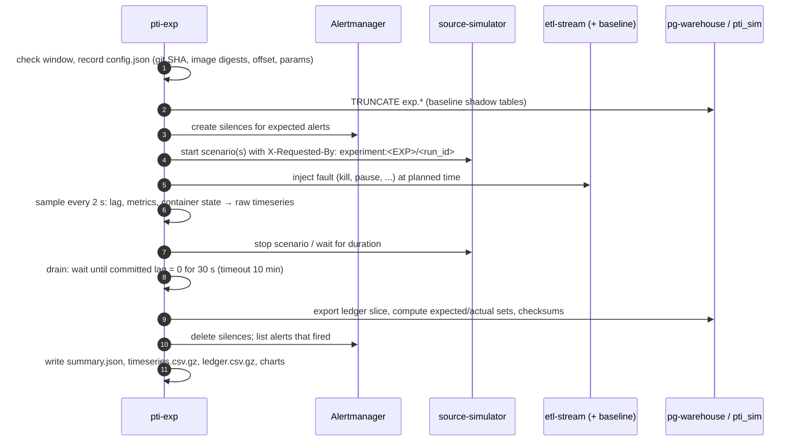

# Thực nghiệm: protocol chung

> Trạng thái: **Approved** · Cập nhật: 2026-09-29 (DR-94: máy thực nghiệm, lưu kết quả; DR-95: chuỗi smoke, đợt chạy đầy đủ dời sang P3-10) · DOC-45 (phần chung, EXP-01…08)
>
> Phụ thuộc: DOC-03 (NFR-01…04), DOC-10, DOC-13 §6 (ledger, business key), DOC-14, DOC-20 §9 (baseline), DOC-22, DOC-25 §7–8, DOC-28, DR-27, DR-28, DR-52, DR-57, DR-58, DR-67, DR-68, DR-94, DR-95, ADR-0025
>
> Người dùng chính: người chạy thực nghiệm (P3-06…08, P3-10, P6, P7), người viết báo cáo

Tài liệu này là phần dùng chung cho mọi thực nghiệm: môi trường, runner, cách tính chỉ số, thống kê, định dạng kết quả, các mối đe dọa chung. Mỗi thực nghiệm có một file riêng theo template phụ lục A.6 của master plan.

EXP-01…05 chạy hai bước (DR-95): ở P3 là **chuỗi smoke** khoảng 30 phút trên máy dev (§1.3), để kiểm runner và tính đúng đắn của pipeline; **đợt chạy đầy đủ** (P3-10) theo mọi quy định còn lại của tài liệu này làm sau M6, trước P7. Số liệu trong báo cáo chỉ lấy từ đợt chạy đầy đủ.

| EXP | File | Câu hỏi | NFR | Phase |
| --- | --- | --- | --- | --- |
| EXP-01 | [EXP-01-crash-recovery.md](EXP-01-crash-recovery.md) | Kill consumer giữa chunk có làm mất hoặc trùng dữ liệu không, phục hồi mất bao lâu? | NFR-01, NFR-04 | P3 (smoke), P3-10 |
| EXP-02 | [EXP-02-redelivery.md](EXP-02-redelivery.md) | Gửi lại message có tạo bản ghi trùng không? | NFR-01 | P3 (smoke), P3-10 |
| EXP-03 | [EXP-03-fault-isolation.md](EXP-03-fault-isolation.md) | Record lỗi có làm mất record hợp lệ không? | NFR-02 | P3 (smoke), P3-10 |
| EXP-04 | [EXP-04-full-replay.md](EXP-04-full-replay.md) | Dựng lại warehouse từ raw zone có khớp hoàn toàn không? | NFR-01, FR-12.2 | P3 (smoke), P3-10 |
| EXP-05 | [EXP-05-load.md](EXP-05-load.md) | Tới mức tải nào thì vẫn đạt NFR-03? | NFR-03 | P3 (smoke), P3-10 |
| EXP-06 | [EXP-06-ai-decision-quality.md](EXP-06-ai-decision-quality.md) | Chất lượng quyết định của Jev so với bộ luật; tự động hóa có an toàn không? | G8, FR-09.1 | P6 (tùy chọn) |
| EXP-07 | [EXP-07-autoscaling.md](EXP-07-autoscaling.md) | Trên k3d, KEDA có giữ NFR-03 tới 10× tải không; scale có đúng và có dừng khi DB là nút thắt không? | NFR-08 | P7 |
| EXP-08 | [EXP-08-chaos.md](EXP-08-chaos.md) | Mỗi sự cố đơn lẻ (pod, broker, Postgres primary, mạng, Connect, Jev, batch) có làm mất hoặc trùng dữ liệu không, tự phục hồi mất bao lâu? | NFR-09, NFR-04 | P7 |

## 1. Môi trường chuẩn

| Mục | Giá trị |
| --- | --- |
| Máy | Chuỗi smoke: máy dev (§1.3). Đợt chạy đầy đủ: **máy thực nghiệm** (DR-94, §1.2): một máy cố định, 16 GB RAM, CPU không chia sẻ với khách thuê khác, SSD. Mọi lần chạy chính thức của EXP-01…05 chạy trên cùng một máy. Runner ghi lại CPU, RAM, hệ điều hành, phiên bản Docker vào `config.json` |
| Triển khai | Docker Compose, profile `core` + `experiment` + `observability` (`make up-exp`, DOC-38 §4). Riêng EXP-05 chạy `core` + `observability`, không có `experiment` (EXP-05 §4). EXP-07 và EXP-08 chạy trên k3d `lite` (DOC-40), mô tả ở §4 của từng file |
| Phiên bản | Image build từ một commit sạch (`git status` rỗng); runner từ chối chạy nếu cây làm việc bẩn, trừ khi có `--allow-dirty` (khi đó kết quả bị gắn cờ `dirty` và không được dùng trong báo cáo) |
| Dữ liệu | Feed `metrotransit-mn-20260926.zip` (SHA-256 ở DOC-13 §2.1); `pti.sim.seed = 42` trừ khi thực nghiệm đổi seed theo lần chạy |
| Đồng hồ nghiệp vụ | Runner đặt `PTI_CLOCK_OFFSET` sao cho giờ nghiệp vụ lúc bắt đầu chuỗi nằm trong khung của thực nghiệm (§1.1) |
| Khởi động | `make down`, bật các profile như trên, chờ `make smoke` pass, chờ thêm 5 phút ấm máy (JIT, cache, pool) trước lần chạy đầu tiên. Docker có ≥ 12 GB RAM (DOC-10 §5.1; nếu Docker chạy trong VM thì là RAM cấp cho VM) |

### 1.1 Đồng hồ nghiệp vụ trong chuỗi thực nghiệm

- Tải phụ thuộc giờ trong ngày (DOC-10 §3.1). Mỗi thực nghiệm quy định khung giờ nghiệp vụ hợp lệ (ví dụ 13:00–19:00 CDT). Runner kiểm `businessNow` trước mỗi lần chạy.
- **Không bao giờ lùi đồng hồ** trong một chuỗi: simulator tất định, nên lùi giờ sẽ sinh lại đúng những business key đã có trong warehouse và che mất dữ liệu bị mất. Khi giờ nghiệp vụ ra khỏi khung, runner **tăng** offset để nhảy tới đầu khung của ngày thường (thứ Ba–thứ Sáu) kế tiếp, restart `source-simulator`, `etl-*` và `api` (từ P4) với offset mới (khoảng 1 phút), rồi chạy tiếp. Runner tự tính và ghi `PTI_CLOCK_OFFSET`, không dùng `make clock-offset` (lệnh đó đặt theo giờ trong ngày nên có thể lùi đồng hồ).
- Ngày nghiệp vụ phải nằm trong khoảng lịch của feed (tới 2026-11-13, DOC-13 §2.1) và tránh 2026-11-01 (đổi giờ DST). Hết khoảng thì chuỗi kết thúc; chuỗi mới bắt đầu bằng `make reset` (xóa mọi volume, kể cả ledger) nên lại được dùng ngày sớm nhất. EXP-04 luôn bắt đầu bằng `make reset` nên không chịu ràng buộc này.
- Số xe đang chạy (`pti_sim_active_vehicles`) được ghi vào mỗi dòng `raw.csv` làm biến kiểm soát.

### 1.2 Máy thực nghiệm

Thực nghiệm chính thức không chạy trên máy đang dùng để dev và không chạy trên runner CI (ADR-0025). Chúng chạy trên một **máy thực nghiệm** dành riêng trong suốt đợt chạy. Tài liệu không gắn với một máy cụ thể: máy có thể là máy cá nhân hay máy thuê, miễn đạt yêu cầu dưới đây và giữ nguyên trong cả đợt.

| Yêu cầu | Giá trị | Lý do |
| --- | --- | --- |
| RAM | 16 GB | Ngân sách compose khi bật đủ profile khoảng 10,4 GB (DOC-10 §5), cộng `etl-stream-baseline` và Toxiproxy của profile `experiment`. Cùng cỡ với máy mà k3d `lite` nhắm tới (DOC-40), nên EXP-07/08 ở P7 dùng lại được máy này |
| CPU | Tối thiểu 4 nhân, khuyến nghị 8; **không chia sẻ** (không dùng vCPU "shared") | CPU bị máy khác chiếm làm thời gian phục hồi và ngưỡng tải của EXP-05 dao động, và không kiểm soát được |
| Đĩa | SSD, còn trống ≥ 100 GB | Kafka, raw zone, warehouse qua nhiều chuỗi (DOC-10 §3.3 yêu cầu 80 GB cho compose), cộng kết quả thô trước khi lưu trữ (§7) |
| Kiến trúc | `linux/amd64` hoặc `linux/arm64` | Image build cho cả hai (DOC-41 §5). `config.json` ghi kiến trúc |
| Việc khác trên máy | Không có | Không IDE, trình duyệt hay job khác trong lúc một chuỗi chạy (§8) |
| Mạng | Chỉ mở SSH vào máy | Stack compose dùng credential bootstrap trong `.env` và mở port Kafka, Postgres, Grafana. Nếu máy nằm trên Internet thì chặn mọi port vào trừ SSH; xem Grafana, Mailpit qua SSH tunnel |

Chuẩn bị một lần: cài Docker Engine (hoặc Docker trong VM ≥ 12 GB), `mise` (DOC-38 §2); clone repo, checkout commit sạch sẽ dùng cho đợt chạy, tạo `.env` từ `.env.example`, `make up-exp`, `uv run pti-exp env check`. Nếu máy mới dựng (không có cache image) thì build image trên máy hoặc kéo image của commit đó; `config.json` ghi digest nên hai cách cho kết quả truy vết như nhau.

Chạy dài ngày không cần người trông:

- Runner chạy trong `tmux` (hoặc `nohup`) để mất kết nối SSH không dừng chuỗi.
- Mỗi lần chạy ghi đủ thư mục kết quả ngay khi xong. Chuỗi bị ngắt giữa chừng (máy restart, runner lỗi) thì chạy lại cùng lệnh với `--resume`: runner bỏ qua các `run_id` đã có `summary.json` và tiếp tục từ lần chạy kế tiếp. Lần chạy dang dở (có thư mục nhưng thiếu `summary.json`) bị đánh dấu `invalid` với lý do `interrupted`, theo §6.
- Đồng hồ nghiệp vụ vẫn theo §1.1: `--resume` không bao giờ lùi `PTI_CLOCK_OFFSET`.

### 1.3 Chuỗi smoke (DR-95)

`uv run pti-exp smoke` chạy nối tiếp năm lần chạy rút gọn trên cùng một stack, không nghỉ giữa các lần. Mục tiêu tổng thời gian ≤ 30 phút, không tính `make up-exp` và `make smoke`. Mỗi runner dùng đúng code của đợt chạy đầy đủ, chỉ khác bộ tham số (`--profile smoke`).

| Thứ tự | EXP | Tham số smoke (khác với bản đầy đủ) | Thời gian |
| --- | --- | --- | --- |
| 1 | EXP-03 | Chỉ mức `ratio` 0,05, không có lần đối chứng; kịch bản `bad-data` `PT3M` thay `PT15M` | ≈ 4,5 phút |
| 2 | EXP-02 | Chỉ biến thể `short`, `ratio` 0,10; kịch bản `PT3M` thay 10 phút | ≈ 5 phút |
| 3 | EXP-01 | Chỉ biến thể `kill-external`; cửa sổ 240 giây thay 600 giây, thời điểm kill `U(60, 180)` giây | ≈ 6 phút |
| 4 | EXP-05 | Loạt `etl-only`; trước khi bắt đầu `docker stop` `etl-stream-baseline`; bậc `[1, 3, 5, 10]`, mỗi bậc `PT90S`; drain tối đa 3 phút | ≈ 8,5 phút |
| 5 | EXP-04 | Không `make reset` và không pha tải 30 phút riêng; xem dưới bảng. Không có rebuild-2 | ≈ 5 phút |

- Mọi lần chạy chờ ổn định 30 giây thay cho 60 giây (hoặc 3 phút ở EXP-05), và không có 5 phút ấm máy ở đầu chuỗi.
- **Đồng hồ nghiệp vụ:** lúc bắt đầu chuỗi, giờ nghiệp vụ phải nằm trong 15:15–17:00 CDT ngày thường, để EXP-05 bắt đầu quanh 15:30 với ≥ 500 xe. Nếu không, runner tăng `PTI_CLOCK_OFFSET` tới 15:15 của ngày thường kế tiếp (§1.1, không lùi).
- **EXP-04 trong chuỗi** dựng lại cửa sổ dữ liệu của EXP-03 và EXP-02 vừa chạy. Cửa sổ này có sẵn dữ liệu lỗi và bản gửi lại, thay cho nhiễu có chủ đích của EXP-04 §2. Cửa sổ là `[t0 của EXP-03 − 1 phút, t1 của EXP-02 + 1 phút]` theo giờ record Kafka. Khi EXP-04 bắt đầu, cửa sổ đã cũ hơn 10 phút nhờ EXP-01 và EXP-05 chạy xen giữa, nên thỏa `raw-settle` (DR-70) mà không phải đổi cấu hình. Các bước:
  1. `docker stop` source-simulator và drain.
  2. Chụp trạng thái của cửa sổ: tập key kỳ vọng theo §3, kèm toàn bộ giá trị cột như checksum ở §4.5, cùng tập dead letter theo vị trí Kafka.
  3. `make reset-warehouse`, nạp feed từ raw zone như bước 6 của EXP-04.
  4. Replay bốn nguồn trên cửa sổ, theo thứ tự ở bước 7 của EXP-04.
  5. So sánh với trạng thái đã chụp.

  Chỉ so sánh bảng fact và dead letter giới hạn trong cửa sổ. `vehicle_position_latest` và các dimension không được so sánh, vì trước khi xóa chúng đã chứa dữ liệu của EXP-01 và EXP-05.
- **Tiêu chí đạt của chuỗi** (mọi tiêu chí đều bắt buộc):

  | EXP | Tiêu chí |
  | --- | --- |
  | EXP-03 | C1–C5 |
  | EXP-02 | C1, C2, C4, C5 |
  | EXP-01 | C1, C2 |
  | EXP-05 | C3 |
  | EXP-04 | C1 (giới hạn như trên), C2, C4 |

  Các số đo khác đều được ghi vào `summary.json` nhưng không dùng để kết luận, vì mỗi số đo chỉ có một lần chạy: `recovery_seconds`, `commit_p95` theo bậc, `drain_seconds`, H3 của baseline, `replay_throughput`. Nếu một lần chạy `invalid` theo tiêu chí của EXP đó thì cả chuỗi phải chạy lại.
- **Môi trường:** máy dev với profile `core` + `experiment`. Profile `observability` bật nếu Docker còn đủ RAM. Nếu không có Alertmanager, runner bỏ qua bước silence và không có danh sách alert đã phát. Trong EXP-05, `etl-stream` vẫn đi qua Toxiproxy của profile `experiment`; đây là khác biệt so với EXP-05 §4, chấp nhận được vì ngưỡng tải của smoke không dùng để kết luận.
- **Kết quả** ghi vào `experiments/results/smoke/<series>/<EXP>/`, cùng cấu trúc với §7. Thư mục này bị git-ignore, không archive và không đi vào `pti-exp report`. Kết quả của lần chạy dùng để chốt milestone được tóm tắt thành bảng trong master plan (M3, và chạy lại ở M4, M6).

## 2. Runner (`experiments/`, ADR-0025)

```text
experiments/
  pyproject.toml, uv.lock
  pti_exp/
    cli.py                # typer: run, analyze, report, archive, fetch, env, label (EXP-06), check (demo), sensitivity (DOC-47), console (DOC-48)
    env/compose.py        # docker SDK: kill/start/pause container, make targets
    env/k3d.py            # kubectl, port-forward, KEDA pause annotation, Chaos Mesh CR, cnpg promote, Toxiproxy (P7)
    sim.py                # /sim/status, /sim/rate, /sim/scenarios
    api.py                # public API + operator API (client credentials)
    kafka.py              # committed offsets and lag via kafka-consumer-groups.sh (docker exec | kubectl exec)
    ledger.py             # ledger export and expected-key sets
    warehouse.py          # actual-key sets, checksums (sql/checksum/*.sql)
    metrics.py            # direct scrape of /actuator/prometheus (compose) or Prometheus query API (k3d), histogram deltas
    alerts.py             # Alertmanager silences, fired-alert log
    grafana.py            # run annotations
    stats.py              # CI, bootstrap, paired tests
    labeling.py           # blind labelling CLI and Cohen's kappa (EXP-06)
    experiments/exp01.py … exp08.py
    console/              # demo console backend (FastAPI), reuses env/, sim.py and check (DOC-48 §3.1)
  sql/
    checksum/<table>.sql  # DR-58, shared with WarehouseAssert (DOC-44 §5.3)
    expected/*.sql, actual/*.sql
  results/<EXP>/<run_id>/ # light files committed; heavy files packed per series (§7)
  results/<EXP>/archives/ # one manifest per archived series (committed)
  results/report/         # generated tables and charts (committed)
  archive/                # series tarballs before upload (git-ignored)
  tests/                  # pytest
```

Lệnh:

```bash
uv run pti-exp env check                      # clean tree, stack healthy, clock window, disk space
uv run pti-exp smoke                          # 30-minute smoke chain of EXP-01…05 (§1.3)
uv run pti-exp run EXP-01 --runs 30 --seed 1000 --variant kill-external [--resume]
uv run pti-exp analyze EXP-01 --series 2026-10-12T0930
uv run pti-exp report                         # regenerates tables and charts for DOC-45
uv run pti-exp archive EXP-01 --series 2026-10-12T0930 [--upload]  # pack heavy files, upload to the release (§7)
uv run pti-exp fetch EXP-01 [--series 2026-10-12T0930]              # download, verify SHA-256, unpack into run folders
uv run pti-exp check --since 10m [--env k3d]   # live reconciliation for the demo (DOC-46)
uv run pti-exp sensitivity --hours 6            # analytics threshold sweep for the report (DOC-47 §6)
uv run pti-exp console --env compose            # demo console on 127.0.0.1:8095 (DOC-48)
```

`check` là phép đối chiếu §4.1 trên stack đang chạy, không tạo lần chạy và không ghi `results/`. Nó dùng cho demo bước 5 và 7 (`make demo-check`, DOC-46 §9.1) và cho E2E-DEMO-12, E2E-DEMO-13:

1. Cửa sổ là `[now − since, now − 60 s]` theo thời điểm ack của ledger (60 giây cuối bị bỏ vì message có thể còn đang xử lý).
2. Lấy vị trí Kafka lớn nhất của ledger trong cửa sổ theo từng partition. Chờ tới khi offset đã commit của group `pti-etl-gtfs-rt` và `pti-etl-ticketing` vượt các vị trí đó; quá 60 giây thì in `LAG_NOT_DRAINED` và thoát mã 2.
3. Tính `expected`, `lost`, `duplicates`, `wrong_value`, `unexpected` như §4.1 trên các bảng fact và `vehicle_position_latest`. Khác với lần chạy thực nghiệm: dead letter có `intended_invalid = false` nhưng đã `REPLAYED` được tính vào cột thông tin `replayed`, không vào `unexpected`, vì demo cố ý chạy `late-delivery` (DOC-25 §7.9). Dead letter chưa replay ứng với message hợp lệ vẫn là `unexpected`.
4. In bảng theo bảng đích và `PASS` khi `lost = 0`, `wrong_value = 0`, `unexpected = 0` ở mọi bảng; ngược lại `FAIL`, liệt kê tối đa 20 key lỗi, thoát mã 1.

`--env k3d` đọc ledger và warehouse qua `kubectl port-forward` tới Pooler `pti-warehouse-pooler-ro` và Service `pti-source-rw` (database `pti_sim`), đọc offset bằng `kubectl exec` vào `pti-dual-0` (như EXP-07).

- `--seed` là seed gốc của chuỗi; lần chạy thứ `i` dùng `seed + i` cho mọi lựa chọn ngẫu nhiên của runner (thời điểm kill, thứ tự biến thể). Seed của simulator giữ nguyên 42 để dữ liệu giống nhau giữa các chuỗi.
- Runner kết nối:
  - `pti_sim` và `ticketing_source` bằng role `experiment_runner` (chỉ đọc, DOC-17 §4.2);
  - `pti_warehouse` bằng `experiment_runner` (đọc, `TRUNCATE exp.*`);
  - thao tác ghi vào warehouse chỉ qua lệnh `make` dùng credential của `.env`: `make reset-warehouse` (superuser bootstrap), `make replay` (`pti_owner`, DOC-38 §4.3). Runner không tự giữ quyền ghi warehouse;
  - từ P4: API bằng client `pti-experiments` (confidential, client credentials, service account có role `operator`) để mở kênh SSE `alerts` và, tùy chọn, tạo replay qua `POST /etl/replays` thay cho `make replay`. Client này có trong realm import (DOC-27), secret `KEYCLOAK_EXPERIMENTS_CLIENT_SECRET` do `make secrets` sinh.
- Runner mở 10 kết nối SSE (5 kênh `vehicles` công khai, 5 kênh `alerts` với token operator) suốt lần chạy, để API luôn có client nhận sự kiện và `pti_end_to_end_latency_seconds` được đo (DOC-28 §3.5). Có từ P4; ở P3 chưa có API real-time thì EXP-05 dùng `pti_etl_kafka_to_commit_seconds` (§4.4).

### 2.1 Vòng đời một lần chạy



- **Cửa sổ của lần chạy** `[t0, t1]` là khoảng `produced_at` của ledger từ lúc bắt đầu kịch bản tới lúc dừng. Mọi phép so sánh chỉ xét message trong cửa sổ.
- **Drain:** sau `t1`, runner dừng phát (`DELETE /sim/scenarios/...` và, với thực nghiệm cần cửa sổ kín, `docker pause` simulator) rồi chờ lag bằng 0. Không drain được trong 10 phút thì lần chạy bị đánh dấu `invalid` với lý do.
- Mỗi lần chạy độc lập: không có dữ liệu nào của lần trước ảnh hưởng tới phép đo lần sau, vì business key gắn với thời gian nghiệp vụ tăng đơn điệu (§1.1).

## 3. Ground truth (DR-28)

- **GTFS-rt:** ledger `sim.sim_ledger`. Chỉ message được Kafka xác nhận mới có trong ledger (DOC-13 §6).
  - Tập kỳ vọng `K_exp` = mọi phần tử `business_keys` của dòng ledger trong cửa sổ, với `intended_invalid = false`.
  - Giá trị kỳ vọng của một key = `payload_hash` của message **mới nhất theo `event_timestamp`** chứa key đó (message gửi lại có cùng hash nên không đổi kết quả).
- **Ticketing:** DB nguồn `ticketing_source` (bảng `ticket_transaction`, `sale_point`), vì ticketing không ghi ledger. Tập kỳ vọng = giao dịch có `created_at` trong cửa sổ, kể cả dòng bị xóa (fact phải có `is_deleted = true`).
- Business key theo đúng định dạng của `BusinessKey` (DOC-13 §6.2). Warehouse sinh key cùng định dạng bằng SQL trong `sql/actual/`.

```sql
-- sql/expected/gtfs_rt_keys.sql : expected keys and their expected payload hash (window [:t0, :t1))
WITH msgs AS (
  SELECT unnest(business_keys) AS bkey, entity_type, event_timestamp, payload_hash, produced_at
  FROM sim.sim_ledger
  WHERE produced_at >= :t0 AND produced_at < :t1 AND NOT intended_invalid
)
SELECT DISTINCT ON (bkey) bkey, entity_type, payload_hash AS expected_hash
FROM msgs
ORDER BY bkey, event_timestamp DESC, produced_at DESC;
```

```sql
-- sql/actual/fact_vehicle_position.sql : one row per key present in the warehouse (normal mode)
SELECT vehicle_id || '|' || to_char(event_timestamp AT TIME ZONE 'UTC', 'YYYY-MM-DD"T"HH24:MI:SS.MS"Z"') AS bkey,
       payload_hash
FROM dw.fact_vehicle_position
WHERE event_timestamp >= :t0 - interval '2 hours' AND event_timestamp < :t1 + interval '2 hours';
-- The baseline variant reads exp.exp_fact_vehicle_position and keeps every row (duplicates allowed).
```

Cửa sổ `event_timestamp` rộng hơn cửa sổ `produced_at` ±2 giờ vì một message được phát trong cửa sổ có thể mang event time lệch (DQ-07 cho phép lệch tới 1 giờ). Phép so sánh luôn là phép nối theo `bkey` với `K_exp`, nên dòng thừa ngoài cửa sổ không bị tính.

## 4. Chỉ số và công thức

### 4.1 Đúng đắn (NFR-01)

Với mỗi bảng đích `T` và mỗi chế độ `m ∈ {normal, baseline}`:

| Chỉ số | Công thức | Ghi chú |
| --- | --- | --- |
| `expected` | `|K_exp|` | |
| `lost` | `|K_exp \ K_act|` | Key kỳ vọng không có dòng nào |
| `loss_rate` | `lost / expected` | |
| `duplicates` | `Σ_k (rows(k) − 1)` với `k ∈ K_exp ∩ K_act` | Ở chế độ normal luôn bằng 0 do PK; đo ở baseline (bảng `exp.*` không UNIQUE) |
| `dup_rate` | `duplicates / expected` | |
| `wrong_value` | số key có `payload_hash` khác `expected_hash` | Bắt lỗi ghi đè bằng dữ liệu cũ hơn |
| `unexpected` | số dòng DLQ (`ops.dead_letter`, cửa sổ theo vị trí Kafka của ledger) ứng với message `intended_invalid = false` | Record hợp lệ bị đưa nhầm vào DLQ |
| `latest_regressions` | số xe có `vehicle_position_latest.event_timestamp < max(fact_vehicle_position.event_timestamp)` | Chỉ normal |

"Mất = 0, trùng = 0" nghĩa là `lost = 0`, `wrong_value = 0`, `unexpected = 0`, `latest_regressions = 0` ở chế độ normal cho **mọi** lần chạy.

### 4.2 Phục hồi (NFR-04)

- `t_kill`: lúc runner gửi lệnh kill (hoặc lúc tiến trình thoát với mã 137 khi dùng `halt`).
- `t_start`: lúc container ở trạng thái `running` trở lại (Docker event `start`).
- `t_ready`: lúc `/actuator/health/readiness` trả `UP`.
- `lag_ref`: lag đã commit trung bình trong 30 giây trước `t_kill`.
- `t_caught_up`: thời điểm đầu tiên sau `t_start` mà lag đã commit ≤ `max(1,1 × lag_ref, 500)` và giữ như vậy trong 10 giây.
- **`recovery_seconds = t_caught_up − t_start`** (định nghĩa của NFR-04: tính từ lúc process chạy lại). Báo cáo thêm `kill_to_caught_up = t_caught_up − t_kill` và `start_to_ready = t_ready − t_start`.

Lag đã commit = `Σ (log-end-offset − committed offset)` của consumer group trên các topic nguồn, đọc bằng `kafka-consumer-groups.sh --describe` mỗi 2 giây. Không dùng metric lag của client, vì consumer đã chết thì không phát metric (DOC-28 §3.3).

### 4.3 Cô lập lỗi (NFR-02)

| Chỉ số | Công thức |
| --- | --- |
| `valid_loaded_ratio` | `|K_exp ∩ K_act| / |K_exp|` (chỉ key của message hợp lệ) |
| `dlq_recall` | số message `intended_invalid` có dòng DLQ đúng vị trí Kafka / số message `intended_invalid` |
| `stage_accuracy` | số dòng DLQ có `stage` đúng như bảng `invalid_kind → stage` (DOC-25 §7.4) / số message `intended_invalid` có dòng DLQ |
| `false_dlq` | = `unexpected` ở §4.1 |

### 4.4 Độ trễ và thông lượng (NFR-03)

- Runner scrape trực tiếp `/actuator/prometheus` của `api` và `etl-stream` mỗi 5 giây (không phụ thuộc Prometheus), lưu bộ đếm histogram, rồi tính phân vị trên **hiệu** bucket giữa đầu và cuối mỗi đoạn đo, bằng nội suy tuyến tính trong bucket như `histogram_quantile`.
- `e2e_p95` = p95 của `pti_end_to_end_latency_seconds` (kênh `vehicles`); `e2e_p95_alerts` cho kênh `alerts` (từ P4).
- Trước P4 (chưa có API và SSE): `commit_p95` = p95 của `pti_etl_kafka_to_commit_seconds`, ngưỡng 3 giây (ngưỡng alert `LatencyStageSlow` của chặng 1–2, DOC-10 §2). EXP-05 chạy loạt `etl-only` ở P3 và loạt `end-to-end` sau P4-14 (EXP-05 §5).
- `throughput_in` = tốc độ message được ack (từ `pti_sim_messages_sent_total`); `throughput_out` = `rate(pti_etl_records_total)` cộng mọi `outcome`.
- `lag_end` = lag đã commit cuối đoạn đo; `lag_slope` = hệ số góc hồi quy tuyến tính của lag theo thời gian trong nửa sau đoạn đo (message/giây). Lag "ổn định" khi `lag_slope ≤ 0,02 × throughput_in`.

### 4.5 Checksum (DR-58)

Mỗi bảng có một file `sql/checksum/<table>.sql` dạng:

```sql
-- sql/checksum/fact_vehicle_position.sql (DR-58). Excludes batch_id, ingested_at, updated_at.
SELECT count(*) AS row_count,
       md5(string_agg(concat_ws('|', service_date, vehicle_id, event_timestamp, trip_id, route_id, direction_id,
                                lat, lon, bearing, speed_mps, current_stop_sequence, stop_id, current_status,
                                occupancy_status, schema_version, payload_hash),
                      E'\n' ORDER BY vehicle_id, event_timestamp)) AS checksum
FROM dw.fact_vehicle_position
WHERE event_timestamp >= :from AND event_timestamp < :to;
```

| Bảng | Cột bị loại | Thứ tự |
| --- | --- | --- |
| `dw.fact_vehicle_position` | `batch_id`, `ingested_at`, `updated_at` | `vehicle_id, event_timestamp` |
| `dw.fact_trip_update` | như trên | `service_date, trip_id, stop_sequence` |
| `dw.fact_ticket_sales` | như trên | `sale_date, transaction_id` |
| `dw.vehicle_position_latest` | `batch_id`, `updated_at` | `vehicle_id` |
| `dw.dim_sale_point` | `batch_id`, `created_at`, `updated_at` | `sale_point_id` |
| `dw.dim_vehicle` | `first_seen_at`, `updated_at` | `vehicle_id` |
| `ops.dead_letter` (tập vị trí) | mọi cột trừ `kafka_topic, kafka_partition, kafka_offset, source, stage, rule_id` | vị trí Kafka |
| `insight.*` (từ P4) | `computed_at`, `updated_at`, cột làm giàu AI | id (UUIDv5) |

`concat_ws` bỏ qua NULL, nên hai hàng khác nhau chỉ ở chỗ NULL/chuỗi rỗng có thể trùng checksum. Để tránh, mỗi cột nullable được bọc `coalesce(col::text, '∅')`. File SQL thật viết đầy đủ như vậy; ví dụ ở trên rút gọn.

## 5. Baseline (DR-27)

- Container `etl-stream-baseline` chạy **song song** với `etl-stream` thật, consumer group riêng (`pti-exp-baseline`, DOC-09 §1.1), đọc cùng topic, ghi vào `exp.exp_fact_*` (DOC-20 §9). Vì vậy mỗi lần chạy cho **một cặp số đo trên cùng dữ liệu** (thiết kế ghép cặp), và so sánh dùng kiểm định ghép cặp (§6).
- Cấu hình baseline: `offset-commit=auto`, `write-mode=insert`, `error-mode=fail-batch`, `dedup=off`. Mỗi thực nghiệm ghi rõ cơ chế nào được so sánh.
- Baseline chỉ có GTFS-rt (không có ticketing).
- Tải lên DB tăng khoảng gấp đôi khi baseline chạy. EXP-04 và EXP-05 không chạy baseline; lý do ở §3 của từng file.

## 6. Thống kê

| Tình huống | Cách báo cáo |
| --- | --- |
| Chỉ số kỳ vọng bằng 0 ở mọi lần chạy (mất, trùng ở normal) | Tổng số key đã kiểm trên mọi lần chạy, số lần chạy có vi phạm, và cận trên 95% của xác suất một lần chạy có vi phạm theo quy tắc "rule of three" (`3/n`; n = 30 → 10%). Không dùng khoảng tin cậy chuẩn cho tỷ lệ bằng 0 |
| Chỉ số liên tục (thời gian phục hồi, độ trễ) | Trung bình, trung vị, p95, max; khoảng tin cậy 95% của trung vị và p95 bằng bootstrap 10.000 lần lấy mẫu lại theo lần chạy |
| Normal so với baseline trên cùng lần chạy | Hiệu ghép cặp; kiểm định Wilcoxon signed-rank (một phía, α = 0,05); báo cáo cả hiệu trung vị và CI bootstrap của hiệu |
| Nhiều mức (EXP-03: 1/5/20%, EXP-05: các bậc tải) | Bảng theo mức; biểu đồ hộp; không gộp các mức |

- Không loại lần chạy ra khỏi phân tích, trừ lần chạy `invalid` theo tiêu chí viết trước trong từng EXP (drain thất bại, simulator tụt hậu `pti_sim_tick_lag_seconds > 2`, hạ tầng ngoài phạm vi lỗi, cây làm việc bẩn). Lần chạy `invalid` vẫn được liệt kê kèm lý do và được thay bằng lần chạy mới.
- Số lần lặp tối thiểu: EXP-01 30 lần mỗi biến thể; EXP-02…05 10 lần mỗi mức (đợt chạy đầy đủ P3-10; chuỗi smoke ở §1.3 không theo mục này). EXP-06, EXP-07, EXP-08 ghi số lần chạy riêng trong file của từng thực nghiệm (mỗi lần chạy dài hơn hoặc là một tập mẫu, không phải lần lặp).

## 7. Kết quả

```text
experiments/results/EXP-01/2026-10-12T0930-r07/
  config.json      # [git]     git_sha, dirty, image_digests, machine, compose_profiles, clock_offset, params, seed, series
  summary.json     # [git]     every metric of §4 for normal and baseline, validity flag, fired alerts
  keys_diff.csv.gz # [git]     only keys that are lost / wrong / duplicated (normally empty)
  timeseries.csv.gz# [archive] t, lag_committed, lag_client, throughput_in/out, container_state, sim_tick_lag, active_vehicles
  ledger.csv.gz    # [archive] ledger slice for the window (ledger retention is 2 days, DOC-13 §6.3)
  charts/*.png     # [archive] per-run charts
```

`summary.json` (rút gọn):

```json
{
  "exp": "EXP-01", "run_id": "2026-10-12T0930-r07", "valid": true, "invalid_reason": null,
  "window": {"t0": "2026-10-12T02:31:10Z", "t1": "2026-10-12T02:41:10Z", "business_t0": "2026-10-11T14:31:10-05:00"},
  "fault": {"kind": "docker-kill", "target": "etl-stream", "at_offset_s": 312.4},
  "normal":   {"GTFS_RT_VEHICLE_POSITION": {"expected": 72514, "lost": 0, "duplicates": 0, "wrong_value": 0},
               "GTFS_RT_TRIP_UPDATE": {"expected": 18833, "lost": 0, "duplicates": 0, "wrong_value": 0},
               "unexpected_dlq": 0, "latest_regressions": 0},
  "baseline": {"GTFS_RT_VEHICLE_POSITION": {"expected": 72514, "lost": 612, "duplicates": 0, "wrong_value": 0}},
  "recovery": {"recovery_seconds": 21.7, "kill_to_caught_up": 24.9, "start_to_ready": 9.8},
  "alerts": {"expected_fired": ["TargetDown", "ConsumerStopped"], "unexpected_fired": []}
}
```

### 7.1 Lưu kết quả (DR-94)

Kết quả của một lần chạy chia làm hai nhóm theo kích thước. Máy thực nghiệm có thể bị xóa sau đợt chạy, nên không nhóm nào được chỉ nằm trên máy đó.

| Nhóm | File | Nơi lưu | Lý do |
| --- | --- | --- | --- |
| Nhẹ | `config.json`, `summary.json`, `keys_diff.csv.gz` của mọi lần chạy (kể cả `invalid`); `results/<EXP>/archives/*.json`; `results/report/` | Git, trong `experiments/results/` | Vài KB mỗi lần chạy. Đủ để sinh lại mọi bảng và biểu đồ tổng hợp của báo cáo mà không cần tải gì thêm |
| Nặng | `timeseries.csv.gz`, `ledger.csv.gz`, `charts/` | Một file nén cho mỗi chuỗi, đính vào GitHub Release `exp-results` của repo | Vài MB mỗi lần chạy, hàng trăm MB cho cả đợt; commit vào git làm repo phình mãi mãi. Chỉ cần khi phân tích lại hoặc kiểm tra một lần chạy cụ thể |

`.gitignore` của `experiments/` loại các file nhóm nặng và thư mục `archive/`. Kiểm tra cây làm việc sạch của runner (§1) bỏ qua `experiments/results/` và `experiments/archive/`.

**Quy trình sau mỗi chuỗi** (chuỗi = một lệnh `run`, cùng `series` trong `config.json`):

1. `pti-exp archive <EXP> --series <series> --upload` gói file nặng của mọi lần chạy trong chuỗi thành `experiments/archive/<EXP>-<series>.tar.gz`, tính SHA-256, tải lên release `exp-results` bằng `gh release upload` (tạo release nếu chưa có), và ghi manifest `results/<EXP>/archives/<series>.json` gồm tên file, SHA-256, kích thước, URL, danh sách `run_id`, `git_sha`.
2. Kiểm tra: `pti-exp fetch <EXP> --series <series>` trên một thư mục trống tải lại được và khớp SHA-256. Sau đó mới được xóa file nặng trên máy.
3. Commit các file nhóm nhẹ của chuỗi cùng manifest trong **một commit chỉ chạm `experiments/results/`**, message dạng `chore(experiments): add EXP-01 kill-external results (series 2026-10-12T0930)`. Commit sau khi chuỗi kết thúc, không commit giữa chuỗi, để mọi lần chạy của một chuỗi có cùng `git_sha`. Commit từ máy thực nghiệm (khóa SSH chỉ dùng để push) hoặc chép `experiments/results/` về máy dev rồi commit ở đó; hai cách như nhau.

**Báo cáo:** `pti-exp report` chỉ đọc file nhóm nhẹ, sinh bảng Markdown và biểu đồ tổng hợp vào `experiments/results/report/` (được commit), rồi người chạy chép bảng tổng hợp vào mục "Kết quả" của từng file EXP. Biểu đồ theo thời gian của một lần chạy tiêu biểu (ví dụ đường lag quanh lúc kill ở EXP-01) được `report` chép vào `report/`, tự gọi `fetch` nếu file nặng chưa có trên máy.

Dữ liệu trong release là dữ liệu mô phỏng (DOC-25), không có dữ liệu cá nhân thật, nên để công khai cùng repo được. Release `exp-results` không bị xóa hay ghi đè: chạy lại một chuỗi thì tạo `series` mới.

## 8. Mối đe dọa chung tới tính hợp lệ

| Mối đe dọa | Ảnh hưởng | Giảm thiểu |
| --- | --- | --- |
| Máy đơn, mọi thứ chạy chung | Tranh chấp CPU/IO làm độ trễ và thời gian phục hồi dao động; kết quả không đại diện cho cụm nhiều máy | Máy thực nghiệm dành riêng, CPU không chia sẻ (§1.2); ghi cấu hình máy; EXP-07/08 lặp lại trên k3d |
| Simulator không theo kịp | Tải thực tế thấp hơn tải danh nghĩa | Chỉ số `pti_sim_tick_lag_seconds`; lần chạy có giá trị > 2 s là `invalid` |
| Dữ liệu tổng hợp | Mô hình trễ và chuyển động là mô phỏng, không phải dữ liệu thật | Tham số hiệu chỉnh theo phân phối thực tế (DOC-25 §5); kết luận chỉ về cơ chế pipeline, không về hành vi giao thông |
| Ledger sai | Ground truth sai thì mọi chỉ số sai | Ledger chỉ ghi message đã ack; test T-11, T-12 (DOC-25); lần chạy "đối chứng" không tiêm lỗi phải có `lost = 0` ở cả hai chế độ |
| Observability ảnh hưởng hiệu năng | Tracing và scrape làm chậm | Giảm lấy mẫu trace về 0,1 khi đo tải (DOC-28 §5.1); giữ cùng cấu hình cho mọi lần chạy của một EXP |
| Baseline chạy song song | Chia tài nguyên DB với luồng thật | Không dùng baseline khi đo hiệu năng; với EXP-01…03 chỉ so sánh đúng đắn, không so thời gian |
| Người chạy chọn lọc kết quả | Thiên lệch báo cáo | Tiêu chí `invalid` viết trước; mọi lần chạy (kể cả `invalid`) được lưu và liệt kê |
| Khác biệt compose và k3d | Kết luận trên compose không tự động đúng trên k3d | EXP-01 được lặp lại (rút gọn) trong EXP-08 trên k3d |
