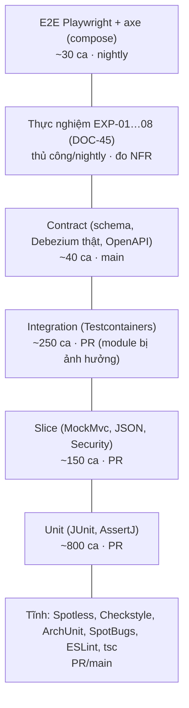

# Chiến lược kiểm thử

> Trạng thái: **Approved** · Cập nhật: 2026-09-30 (DR-104: bố cục Clean Architecture) · DOC-44
>
> Phụ thuộc: DOC-03 (NFR-01…13), DOC-11, DOC-19, DOC-20, DOC-21, DOC-22, DOC-30, DOC-41, ADR-0027, DR-44, DR-46
>
> Người dùng chính: người triển khai mọi phase; người review PR

Tài liệu này quy định **test gì, ở tầng nào, bằng công cụ gì, chạy ở đâu**. Danh sách ca test cụ thể nằm ở mục "Test bắt buộc" của từng tài liệu thiết kế (chỉ mục ở §13). Ở đây chỉ có ca test không thuộc tài liệu nào khác: tiêm lỗi (§8) và contract (§9).

## 1. Nguyên tắc

1. **Đúng đắn khi lỗi là thứ phải chứng minh, không phải thứ được giả định.** Mọi khẳng định "mất = 0, trùng = 0" (NFR-01) phải có test tự động ở CI (§8) và thực nghiệm đo được (DOC-45). Test đơn vị với mock không đủ để chứng minh tính chất này.
2. **Database và Kafka thật, không mock.** Upsert, guard, partial unique index, `ON CONFLICT`, isolation và offset commit chỉ kiểm được trên Postgres 17 và Kafka 4.3 thật (Testcontainers). Không dùng H2, không dùng embedded Kafka (`@EmbeddedKafka`).
3. **Mock chỉ ở ranh giới hệ thống ngoài:** Jev (mock server), Keycloak (JWT tự ký trong test), Alertmanager (webhook giả). Không mock repository hay `JdbcTemplate` của chính mình.
4. **Tất định.** Mọi test dùng `BusinessClock` cố định (DR-67), seed cố định cho dữ liệu ngẫu nhiên, và không dùng `Thread.sleep` (chờ bằng Awaitility). Test chạy lại 100 lần phải cho cùng kết quả.
5. **Test không gọi dịch vụ ngoài thật** (DOC-41 §7). Không có mạng ra ngoài trong test, trừ lúc Testcontainers kéo image.
6. **Mỗi ca test bắt buộc trong tài liệu thiết kế có đúng một test tự động mang ID của nó** (§4.3), trừ ca được ghi rõ là "Thủ công".

## 2. Tháp kiểm thử



Con số là ước lượng để định cỡ, không phải chỉ tiêu.

| Tầng | Phạm vi | Thời gian mỗi ca | Được phép dùng | Không được dùng |
| --- | --- | --- | --- | --- |
| Unit | Một lớp hoặc một nhóm lớp thuần Java | < 50 ms | JUnit Jupiter, AssertJ, Mockito (chỉ cho interface ranh giới) | Spring context, Docker, file ngoài `src/test/resources` và `testFixtures` |
| Slice | Một lát Spring: `@WebMvcTest`, `@JsonTest`, test Security, test binding `@ConfigurationProperties` | < 1 s (context được cache) | `@MockitoBean` cho service phía dưới controller | Docker |
| Integration | Một app hoặc một luồng qua Postgres/Kafka/S3 thật | < 30 s | Testcontainers, `@SpringBootTest`, Awaitility, `FaultInjector` | Dịch vụ ngoài thật, `Thread.sleep` |
| Contract | Ranh giới giữa hai thành phần (producer ↔ consumer, API ↔ frontend) | < 60 s | Như integration, thêm Kafka Connect + Debezium | |
| E2E | Toàn hệ thống trên compose, qua trình duyệt | < 2 phút | Playwright, `@axe-core/playwright`, API simulator | Gọi thẳng DB để dựng trạng thái (chỉ qua API/simulator) |
| Thực nghiệm | Đo NFR trên compose hoặc k3d | 10–60 phút | Runner Python (DOC-45) | |

## 3. Bố cục trong Gradle và công cụ

### 3.1 Source set và task

Convention plugin `pti.java-conventions` trong `build-logic` tạo cho mọi module Java:

| Source set | Thư mục | Task | Nội dung | Docker |
| --- | --- | --- | --- | --- |
| `test` | `src/test/java` | `test` | Unit + slice | Không |
| `testFixtures` | `src/testFixtures/{java,resources}` | (plugin `java-test-fixtures`) | Builder, fixture, tiện ích dùng chung (§5) | — |
| `integrationTest` | `src/integrationTest/{java,resources}` | `integrationTest` | Integration; ca có `@Tag("slow")` bị loại trừ | Có |
| `integrationTest` | như trên | `slowTest` | Chỉ ca `@Tag("slow")` (ví dụ G-03 feed thật, T-07, EXP-lite) | Có |
| `contractTest` | `src/contractTest/{java,resources}` | `contractTest` | Chỉ có ở `etl`, `source-simulator`, `api`, `triage-worker` | Có |

- `check` phụ thuộc `test` và `jacocoTestCoverageVerification`, **không** phụ thuộc `integrationTest` (để `./gradlew build -x integrationTest` ở PR chạy nhanh; DOC-41 §2).
- `affectedIntegrationTest` (DOC-41 §2) = `integrationTest` của module đổi và mọi module phụ thuộc vào nó (tính từ project dependency graph).
- Task gốc `contractTest` gom `contractTest` của các module trên. Task gốc `slowTest` tương tự.
- `integrationTest`, `slowTest` và `contractTest` đặt `maxParallelForks = 1` và `shouldRunAfter(test)`; container dùng chung trong một JVM (§6). Các module khác nhau vẫn chạy song song nhờ Gradle `--parallel`.
- Unit test bật JUnit parallel theo lớp (`junit.jupiter.execution.parallel.enabled=true`, `mode.classes.default=concurrent`, `mode.default=same_thread`).
- `test` và `integrationTest` đặt `systemProperty("user.timezone", "UTC")` và `Locale.ROOT`. Test nào cần giờ Minneapolis thì truyền `ZoneId` rõ ràng.
- Test module `etl` có `integrationTest` phụ thuộc `bootJar` (test tiêm lỗi `halt` chạy app ở tiến trình con, §8.2).

### 3.2 Công cụ

| Mục đích | Công cụ | Ghi chú |
| --- | --- | --- |
| Framework | JUnit Jupiter (theo BOM của Spring Boot 4.1) | `@ParameterizedTest` + `@MethodSource` cho bảng ca (DQ, SQLState, upsert) |
| Assertion | AssertJ | Có `WarehouseAssert` riêng (§5.3) |
| Mock | Mockito; `@MockitoBean`/`@MockitoSpyBean` (Boot 4, DOC-11 §6) | Chỉ ở ranh giới (§1) |
| Chờ bất đồng bộ | Awaitility | `atMost` ≤ 30 s, `pollInterval` 100 ms |
| Container | Testcontainers 2.x: `postgresql`, `kafka` (`KafkaContainer` từ `org.testcontainers.kafka`, image `apache/kafka`), `toxiproxy`; SeaweedFS và Kafka Connect qua `GenericContainer` | Image cùng tag với compose (§6.1) |
| Mock HTTP | MockWebServer (OkHttp) cho Jev và Alertmanager | Không dùng WireMock (không cần DSL stub phức tạp) |
| JSON Schema | `com.networknt:json-schema-validator` | Cùng thư viện ETL dùng lúc chạy cho DQ-01 |
| Kiến trúc | ArchUnit 1.x | §3.3 |
| Coverage | JaCoCo | §7 |
| Frontend | Vitest, React Testing Library, MSW 2, Playwright, `@axe-core/playwright` | §10 |
| Python | pytest, ruff | `experiments/` |

Không dùng: Spring Cloud Contract (DR-44), H2, `@EmbeddedKafka`, PowerMock, Lombok trong test.

### 3.3 Luật ArchUnit (module `common`, chạy trong `test` của từng app)

Lớp `PtiArchitectureRules` trong `backend/common/src/testFixtures`, mỗi app có một test gọi lại:

| # | Luật |
| --- | --- |
| A-01 | `dev.pti.common..` không phụ thuộc `org.springframework.kafka..`, `org.springframework.batch..`, `org.springframework.web..` |
| A-02 | `dev.pti.analytics..` không phụ thuộc `dev.pti.etl..`, `dev.pti.api..` và không dùng `KafkaTemplate` |
| A-03 | `dev.pti.api..` không ghi vào schema `dw` (không lớp nào trong `api` gọi `JdbcTemplate.update` qua datasource `reader`; kiểm bằng luật: chỉ lớp có annotation `@OperatorRepository` được inject `operatorJdbcTemplate`) |
| A-04 | Không lớp nào phụ thuộc `dev.pti.<app khác>..` (etl, api, triage, simulator độc lập nhau; chỉ chung `common` và `analytics`) |
| A-05 | Package theo feature: không có package tên `controller`, `service`, `repository`, `dto` ở cấp một dưới `dev.pti.<app>` |
| A-06 | Không dùng `System.out`, `System.err`, `printStackTrace`, `java.util.logging` |
| A-07 | Không dùng `LocalDateTime.now()`, `Instant.now()`, `Clock.systemUTC()` ngoài `BusinessClock` và `SystemClockConfig` (DR-67) |
| A-08 | Exception do code dự án ném ra kế thừa `PtiException` (DOC-30 §1), trừ `IllegalArgumentException`/`IllegalStateException` ném từ constructor và guard |
| A-09 | Test code không dùng `Thread.sleep` |
| A-10 | Không lớp production nào phụ thuộc `ConfigurableFaultInjector` (chỉ bean trong profile `test`, `experiment`) |
| A-11 | Clean Architecture, phân tầng theo feature (DOC-49 §2): `domain` không phụ thuộc `application`, `adapter`, `config`; `application` không phụ thuộc `adapter`, `config`; `adapter` không phụ thuộc `config`, trừ lớp `@ConfigurationProperties` (adapter được đọc cấu hình của nó) |
| A-12 | `..domain..` và `..application..` không phụ thuộc framework và hạ tầng (`org.springframework..`, `jakarta..`, Jackson, Micrometer, OpenTelemetry, Kafka client, JDBC, AWS SDK, Resilience4j, Caffeine, ShedLock, SDK Jev, Bucket4j; danh sách đủ ở DOC-49 §4.1), trừ ngoại lệ DOC-49 §10 |
| A-13 | `..domain..` và `..application..` chỉ phụ thuộc `dev.pti.common..` qua shared kernel (DOC-49 §4.2) |
| A-14 | Feature không phụ thuộc `..adapter..` hay `..config..` của feature khác; các feature trong một app không tạo vòng phụ thuộc |
| A-15 | `..adapter.in..` không phụ thuộc `..adapter.out..` |
| A-16 | Lớp có `@Configuration`, `@Bean`, `@ConfigurationProperties` chỉ nằm trong `..config..` |
| A-17 | Hiện thực production của interface trong `..application.port..` chỉ nằm trong `..adapter..` |
| A-18 | Mọi lớp dưới `dev.pti.<app>.<feature>` thuộc một trong các tầng `domain`, `application`, `adapter`, `config`; package gốc của app chỉ có lớp `*Application` |

A-11…A-18 được thêm ở P4-18 (DR-104, ADR-0032):

- `analytics`, `api`, `triage-worker` gọi các luật trực tiếp: vi phạm là test đỏ. `analytics` là thư viện nên có test ArchUnit riêng trong module.
- `etl`, `source-simulator`, `common`, `db` gọi A-11…A-18 qua `FreezingArchRule`. Store vi phạm nằm ở `backend/<module>/src/test/resources/archunit_store/` và được commit; `archunit.properties` đặt `freeze.store.default.allowStoreCreation=false`. Store chỉ được giảm. Package mới trong các module này (ví dụ `dev.pti.etl.analytics`) không được có mặt trong store.
- Phase R (RF-07) xóa freeze; từ đó mọi module chạy A-11…A-18 trực tiếp.

## 4. Test theo module

### 4.1 Ma trận

| Module | Unit | Slice | Integration | Contract | Ca bắt buộc (§13) |
| --- | --- | --- | --- | --- | --- |
| `common` | Rule DQ (DOC-16 §8, 30 ca), `ErrorClassifier` (bảng SQLState), `PayloadHasher`, `ProblemDetails` builder, JSON Schema load | Binding cấu hình chung | — | Bản thân schema: mỗi schema tự hợp lệ theo draft 2020-12; mỗi file trong `contract-examples/valid` pass và `invalid` fail (§9.1) | DQ 1–30, E-01…E-10 |
| `analytics` | Detector bunching, disruption; ETA, OTP, anomaly: thuần Java trên input dựng sẵn | — | Repository ghi `insight_*` (Postgres thật): idempotent khi chạy lại | — | Theo DOC-23 (P4) |
| `etl` | Mapper (VP, TU, TX, CDC), `StreamChunkTemplate` với `WriteSet` giả, `RatioSkipPolicy`, `ReferenceData`, validator GTFS | `@JsonTest` cho envelope | Listener + Kafka + Postgres; job batch + Postgres + SeaweedFS; upsert 24 ca; tiêm lỗi (§8) | Consumer schema, Debezium thật (§9) | B, S, G, R, L, upsert 1–24, F |
| `db` | — | — | Migration chạy trên DB trống và chạy lại; quyền (DOC-17 §7: 46 + 19 ca và 2 test catalog) | — | DOC-17 §7 |
| `source-simulator` | `ServiceDateMapper`, mô hình chuyển động, tất định | API kịch bản (MockMvc) | Ledger, backpressure, kịch bản | Producer schema (T-09) | T-01…T-16 |
| `triage-worker` | Bảng quyết định auto-replay, prompt builder, parser kết quả | — | Jev qua MockWebServer + Toxiproxy (timeout 2 s, FR-09.7) | Schema request/response Jev | Theo DOC-24 (P6) |
| `api` | Mapper, validator query | `@WebMvcTest` cho mọi endpoint: mã lỗi và Problem slug (DOC-30 §3), phân quyền theo role | Repository đọc (Postgres thật, dữ liệu seed); SSE; Bucket4j | OpenAPI snapshot + diff (§9.3) | Theo DOC-32 (P4) |
| `frontend` | Hàm thuần (format, map trạng thái) | Component + MSW | — | Type sinh từ `openapi.json`, `tsc --noEmit` | Theo DOC-36 (P5) |
| `experiments` | Tính `summary.json` từ dữ liệu giả | — | — | — | DOC-45 |

### 4.2 Test gì ở tầng nào (quy tắc chọn)

- Logic có nhánh nhưng không chạm IO (rule DQ, phân loại lỗi, map CDC, quyết định auto-replay, `ServiceDateMapper`) → **unit**, dạng bảng.
- SQL do mình viết (upsert, guard, truy vấn API, retention, grant) → **integration** trên Postgres thật. Không unit test SQL bằng mock.
- Mọi đường đi qua ranh giới transaction ↔ offset/`JobExecution` → **integration + tiêm lỗi** (§8).
- Mã HTTP, Problem slug, phân quyền → **slice** (`@WebMvcTest` + `spring-security-test`); mỗi endpoint thêm một ca integration "happy path" chạm DB thật.
- Hành vi mà người dùng thấy trên màn hình → **component test** (Vitest + RTL + MSW); luồng nhiều màn hình và a11y → **E2E**.

### 4.3 Quy ước đặt tên

| Loại | Quy ước | Ví dụ |
| --- | --- | --- |
| Lớp unit/slice | `<Lớp>Test` | `RatioSkipPolicyTest` |
| Lớp integration | `<Tính năng>IT` | `VehiclePositionListenerIT` |
| Lớp contract | `<Ranh giới>ContractTest` | `DebeziumTicketingContractTest` |
| Method | Câu tiếng Anh dạng camelCase mô tả hành vi, không có tiền tố `test` | `skipsRecordAndWritesDeadLetterWhenVehicleIdMissing` |
| Ca bắt buộc | `@DisplayName("<ID> <mô tả tiếng Anh>")` | `@DisplayName("B-03 scan fallback isolates the failing record")` |
| Ca dạng bảng | `@ParameterizedTest(name = "DQ {0}: {1}")` | |
| Tag | `slow`, `fault`, `quarantine` | §3.1, §8, §12 |
| File E2E | `frontend/e2e/<màn hình>.spec.ts`, `test('<ID> ...')` | `test('E2E-DLQ-03 replays an edited payload', ...)` |

Mọi tên test, `@DisplayName`, message assertion và comment trong test viết bằng tiếng Anh.

Task `testIdReport` trong `build-logic` quét các bảng "Test bắt buộc" trong `docs/**/*.md` (dòng bảng bắt đầu bằng `| <ID> |` với ID dạng `[A-Z]{1,3}(-[A-Z]{1,3})?-\d{2}` (ví dụ `TG-05`, `AN-BG-01`) hoặc `E2E-…`; bảng không nằm dưới tiêu đề "Test bắt buộc" bị bỏ qua, nên mã endpoint `E-xx` hay mã tài liệu không bị nhầm là test) và các `@DisplayName`/`test('…')` trong code, rồi in ra ID chưa có test. Từ P2 đến P7 task chỉ báo cáo (chạy trong nightly, §11); từ P8-00 nó chặn ở `pr.yml` với danh sách miễn trừ `docs/10-testing/test-id-exemptions.txt` (mỗi dòng một ID và lý do, ví dụ ca "Thủ công").

## 5. Dữ liệu test

### 5.1 Feed GTFS thu nhỏ

`backend/common/src/testFixtures/resources/gtfs/mini/` (dạng thư mục các file `.txt`, không zip; helper zip lúc chạy test):

- Cắt từ feed thật `sample-data/gtfs/metrotransit-mn-20260926.zip` bằng script `sample-data/gtfs/make_mini_feed.py` (tất định; chạy lại cho cùng output). Script ghi SHA-256 của feed gốc vào `mini/SOURCE.txt`.
- Nội dung: `agency`, `feed_info`, `routes` (18 và 901), `trips` của hai route đó cho `service_id` có hiệu lực ngày **2026-09-29** (thứ Ba) và **2026-10-03** (thứ Bảy) **có giờ xuất phát đầu tiên trong [16:00:00, 17:00:00)**, cộng với chuyến tuyến 18 kết thúc muộn nhất sau nửa đêm của mỗi `service_id`. Lấy toàn bộ chuyến của hai ngày sẽ ra 646 chuyến và khoảng 28.000 `stop_times`, quá lớn cho fixture; cửa sổ này cho 42 chuyến và 1.813 `stop_times`, và bao trùm mốc `TestClock` mặc định (16:20 CDT). Kèm theo: `stop_times` tương ứng, `stops` được tham chiếu và các `parent_station` của chúng, `calendar` của các service giữ lại, `calendar_dates` trong khoảng hai ngày đó, `shapes` của các trip giữ lại, và 60 xe đầu tiên của `vehicles.txt` (theo `vehicle_id`). Dòng được chép nguyên văn từ feed gốc.
- Có ít nhất một chuyến qua nửa đêm (giờ ≥ 24:00:00) của tuyến 18 để test DQ-09 và `scheduledArrival` (G-11).
- Không sửa tay file trong `mini/`. Cần ca đặc biệt thì dựng biến thể lúc chạy test (§5.2).

### 5.2 Biến thể hỏng

`GtfsFeedMutator` (testFixtures) nhận thư mục mini, áp một phép biến đổi, trả về zip tạm: `dropFile`, `dropColumn`, `setValue(file, row, column, value)`, `duplicateRow`, `appendRow`, `addEntry(name, bytes)` (dùng cho zip-slip), `zipBomb(ratio)`. Mỗi ca G-04/G-05 là một lời gọi mutator.

### 5.3 Builder và tiện ích (`backend/common/src/testFixtures/java/dev/pti/testing/`)

| Lớp | Việc |
| --- | --- |
| `GtfsFixtures` | `open(name)` đọc một file của feed mini, `miniFeedZip(path)` ghi feed mini thành zip GTFS (§5.1) |
| `TestClock` | `BusinessClock` cố định; mặc định `2026-09-29T21:20:00Z` (16:20 CDT, giờ cao điểm chiều), `advance(Duration)` |
| `Messages` | Builder envelope: `Messages.vehiclePosition().route("18").vehicle("1234").at("21:19:00").build()`; `tripUpdate()`, `saleCdc(op)`, `salePointCdc(op)`. Giá trị mặc định hợp lệ theo feed mini; `.invalid(InvalidKind)` sinh đúng các loại lỗi của simulator (DOC-25) |
| `KafkaRecords` | Tạo `ConsumerRecord` có partition, offset, timestamp, headers cho unit test mapper |
| `PtiContainers` | Container singleton (§6) |
| `WarehouseFixture` | Nạp feed mini vào DB test một lần mỗi JVM (qua `GtfsStaticLoadJob` thật trong test `etl`; qua dump SQL `mini-feed.sql` sinh từ job đó cho module khác), `truncateFactsAndOps()` |
| `WarehouseAssert` | `assertThat(warehouse).table("dw.fact_vehicle_position").hasRowCount(n)`, `.deadLetters().hasOne(stage, ruleId)`, `.checksumOf(table)` (cùng công thức DR-58 với DOC-45) |
| `LedgerFixture` | Ghi và đọc ledger `pti_sim` cho test so khớp mất/trùng |
| `JwtFixture` | JWT tự ký với role `viewer`, `operator`, `admin` cho test `api` |

Dump `mini-feed.sql` sinh bằng task `:etl:generateMiniFeedDump` và commit vào `backend/common/src/testFixtures/resources/db/`. Test `MiniFeedDumpUpToDateIT` trong `etl` fail nếu dump không khớp kết quả job hiện tại (tránh dump cũ âm thầm lệch).

### 5.4 Dữ liệu lớn

- Feed thật chỉ dùng trong ca `@Tag("slow")` (G-03, T-03, T-04, T-07) và E2E. Test đọc từ `sample-data/gtfs/` theo gốc repo (system property `pti.repo-root` do `build-logic` đặt bằng thư mục cha của `backend/`, ADR-0030), kiểm SHA-256 với `SHA256SUMS` trước khi chạy.
- Không commit dữ liệu sinh ra lớn hơn 1 MB vào `src/*/resources`. Dữ liệu lớn hơn thì sinh lúc chạy từ seed.

## 6. Hạ tầng Testcontainers

### 6.1 Container dùng chung

`PtiContainers` khởi động container một lần mỗi JVM (static, lazy), đăng ký qua `@DynamicPropertySource` trong meta-annotation:

```java
@Target(TYPE)
@Retention(RUNTIME)
@SpringBootTest
@ActiveProfiles({"test"})
@ExtendWith(PtiContainersExtension.class)
@Tag("integration")
public @interface PtiIntegrationTest {
  Infra[] value() default {Infra.POSTGRES};   // POSTGRES, KAFKA, S3, TOXIPROXY, CONNECT
}
```

| Container | Image (cùng tag và digest với compose, đọc từ `deploy/versions.env`) | Chuẩn bị |
| --- | --- | --- |
| Postgres warehouse | `postgres:17` | Chạy bootstrap role (DOC-17) rồi Flyway của module `db` một lần; app test kết nối bằng đúng role runtime (`etl_writer`, `api_reader`…), không bằng owner |
| Postgres source | `postgres:17`, `-c wal_level=logical` | Chỉ cho contract Debezium và test simulator |
| Kafka | `apache/kafka:4.3.x` | Topic tạo theo `deploy/topics.yaml` với tiền tố riêng mỗi lớp test (§6.2) |
| SeaweedFS | `chrislusf/seaweedfs:4.47`, `server -s3` | Bucket `raw` có versioning, user `etl` như `s3-init` |
| Toxiproxy | `ghcr.io/shopify/toxiproxy:2.x` | Proxy trước Postgres, Kafka hoặc MockWebServer |
| Kafka Connect | Build từ `deploy/connect/Dockerfile` (`ImageFromDockerfile`, cache theo hash Dockerfile) | Chỉ trong `contractTest` |

- CI: không bật reuse. Máy dev có thể bật `testcontainers.reuse.enable=true` trong `~/.testcontainers.properties`; code gọi `.withReuse(true)` nên khi bật thì container được giữ giữa các lần chạy.
- Ryuk bật (mặc định) để dọn container khi JVM chết.

### 6.2 Cô lập giữa các lớp test

- **Postgres:** `WarehouseFixture.truncateFactsAndOps()` trong `@BeforeEach` (chạy bằng owner, truncate `dw.fact_*`, `dw.*_latest`, `ops.*` trừ `ops.shedlock`, `batch.*`). Dữ liệu feed mini giữ nguyên giữa các test. Test nào sửa dữ liệu lịch thì dùng `@DirtiesFeed` để nạp lại.
- **Kafka:** mỗi lớp test có tiền tố topic ngẫu nhiên (`it-<8 ký tự>.`), đặt qua `pti.kafka.topic-prefix` (mặc định rỗng; mọi app ghép tiền tố này trước tên topic ở DOC-09, cả producer lẫn `@KafkaListener`) bằng `@DynamicPropertySource`, và consumer group riêng. Không xóa topic sau test (rẻ hơn tạo lại).
- **S3:** mỗi lớp test dùng prefix `it-<8 ký tự>/` trong bucket `raw` qua `pti.s3.raw-prefix` (mặc định rỗng, chỉ đổi trong test). Test cần S3 sink thật chỉ có ở contract và E2E.
- Spring context được cache giữa các lớp có cùng cấu hình; `@DynamicPropertySource` theo lớp làm context khác nhau, nên giữ số tổ hợp cấu hình nhỏ (mỗi module ≤ 5 context).

## 7. Coverage (NFR-13)

JaCoCo gộp dữ liệu của `test` và `integrationTest` (task `jacocoMergedReport`). Gate kiểm trên dữ liệu gộp, chạy ở job `backend` của `main.yml` (PR chỉ có dữ liệu `integrationTest` của module bị ảnh hưởng nên gate ở PR chỉ dùng dữ liệu `test`, với ngưỡng thấp hơn 10 điểm).

| Phạm vi | Chỉ số | Ngưỡng (main) | Ngưỡng (PR, chỉ unit) |
| --- | --- | --- | --- |
| Lớp `StreamChunkTemplate`, `ErrorClassifier`, `RatioSkipPolicy`, `MessageProcessor` và các lớp hiện thực, `FactChunkWriter`, `DeadLetterWriter` | LINE ≥ | 90% | 80% |
| Package `dev.pti.etl..` (trừ `..config..`, lớp `*Application`) | LINE ≥ | 80% | 70% |
| Module `analytics` | LINE ≥ | 85% | 75% |
| Module `common` | LINE ≥ | 85% | 75% |
| `api`, `triage-worker`, `source-simulator` | LINE ≥ | 70% | 60% |
| Mọi phạm vi trên | BRANCH ≥ | 70% | — |
| `frontend/src` (trừ `src/api/generated`) | lines ≥ (Vitest v8) | 70% | 70% |

- Loại khỏi coverage: lớp sinh tự động, `record` chỉ có dữ liệu, `*Properties`, `*Application`.
- Không hạ ngưỡng trong PR. Muốn hạ phải sửa tài liệu này trong cùng PR và nói lý do.
- Coverage là điều kiện cần, không đủ: review xem có assert kết quả (dòng trong DB, DLQ, offset) hay không.

## 8. Test tiêm lỗi

### 8.1 Cơ chế

- `ConfigurableFaultInjector` (DOC-19 §8) với `pti.test.fault.<point>=<action>` và `pti.test.fault.after-n`. Các lớp test gắn `@Tag("fault")` (vẫn nằm trong `integrationTest`).
- `throw-transient` và `throw-fatal` chạy trong JVM test.
- `halt` gọi `Runtime.halt(137)`, nên **không chạy được trong JVM test**. Harness `EtlProcess` (testFixtures của `etl`) chạy `java -jar backend/etl/build/libs/etl.jar` ở tiến trình con với profile `stream,test` hoặc `batch,test`, cấu hình trỏ vào container của test, chờ tiến trình thoát với mã 137, rồi khởi động tiến trình mới không có cấu hình lỗi.
- Hỏng hạ tầng dùng Toxiproxy (cắt kết nối, thêm độ trễ) hoặc `container.getDockerClient().pauseContainerCmd` (dừng Postgres).
- Mỗi ca so sánh với **ledger** (`LedgerFixture`) hoặc với tập message đã publish: mất = 0, trùng = 0, DLQ chỉ có record hỏng cố ý.

### 8.2 Ca bắt buộc

| ID | Chế độ | Điểm lỗi / sự cố | Kỳ vọng | Chứng minh |
| --- | --- | --- | --- | --- |
| F-01 | stream | `BEFORE_WRITE` × `halt`, sau 3 chunk | Restart → toàn bộ 5.000 VP có trong fact đúng 1 lần; offset commit đến cuối | FR-03.5 |
| F-02 | stream | `AFTER_WRITE_BEFORE_COMMIT` × `halt` | Như F-01; chunk bị cắt được xử lý lại, không có dòng thừa | FR-03.5 |
| F-03 | stream | `AFTER_COMMIT_BEFORE_ACK` × `halt` | Chunk được giao lại; upsert/dedup làm số dòng không đổi; `records_duplicate_total` tăng đúng số record của chunk đó | FR-03.2, FR-03.5 |
| F-04 | stream | `BEFORE_PROCESS` × `throw-transient` × 3 lần | Seek và thử lại; không DLQ; dữ liệu đầy đủ | FR-02.8 |
| F-05 | stream | `BEFORE_WRITE` × `throw-fatal` | Container dừng; offset không commit; `ConsumerStopped` (metric `pti_etl_listener_running = 0`); không DLQ | DOC-20 §5 |
| F-06 | stream | Toxiproxy cắt Postgres 30 giây | DLQ không tăng; container pause; nối lại → đủ dữ liệu; circuit breaker `warehouse` OPEN rồi CLOSED | FR-02.8 |
| F-07 | batch | `RawZoneReplayJob`, `BEFORE_WRITE` × `halt` ở chunk 4 | `StaleExecutionRecoverer` đánh dấu `FAILED`; restart thủ công (job replay không tự restart) tiếp từ chunk 4; checksum khớp lần chạy không lỗi | FR-03.6 |
| F-08 | batch | `GtfsStaticLoadJob`, `halt` giữa `loadStopTimes` | = G-06 | FR-03.6 |
| F-09 | batch | Hai tiến trình `batch` cùng lịch | Chỉ một `JobExecution` chạy (ShedLock); tiến trình zombie (dừng bằng `SIGSTOP` 3 phút rồi `SIGCONT`) gặp `OptimisticLockingFailureException`, không ghi thêm dòng | ADR-0015 |
| F-10 | stream + batch | Replay raw cùng khoảng thời gian với luồng live đang chạy | Không dòng nào bị ghi đè bằng dữ liệu cũ hơn (guard upsert); số dòng = số business key | DR-70, DOC-22 §4.5 |
| F-11 | stream | Kafka broker dừng 20 giây | Consumer tự nối lại; không mất, không trùng | NFR-09 |
| F-12 | stream | Rebalance giữa chừng (thêm consumer thứ hai cùng group) | Partition bị thu hồi không commit offset chưa ghi; không mất, không trùng | FR-03.5 |

F-01…F-03 chạy với dữ liệu có 5% record hỏng (`Messages.invalid`) để kiểm cả việc DLQ không bị ghi hai lần (partial unique index, DR-70).

## 9. Contract test (DR-44, ADR-0027)

### 9.1 Message Kafka ↔ JSON Schema

- Schema ở `backend/common/src/main/resources/schemas/` (bất biến theo phiên bản, DOC-09), ví dụ ở `backend/common/src/test/resources/contract-examples/{valid,invalid}/<schema>/*.json`.
- **Producer** (`source-simulator`, T-09): sinh 1.000 message mỗi loại với seed cố định trên feed mini, validate từng message; mỗi `invalid_kind` fail đúng như DOC-25 quy định.
- **Consumer** (`etl`): mỗi file trong `contract-examples/valid` đi qua mapper → ra đúng `WriteSet` kỳ vọng (file `<name>.expected.json` bên cạnh); mỗi file trong `invalid` → DLQ đúng `stage` và `rule_id`.
- **Sự kiện UI** (`schemas/ui-events/`): `etl` validate mọi sự kiện nó phát trong test integration; frontend dùng cùng schema qua `json-schema-to-zod` lúc build (DOC-33).
- Thêm trường vào schema cũ → test `SchemaImmutabilityTest` fail (so hash file với `schemas/SHA256SUMS`); phải tạo phiên bản mới.

### 9.2 Debezium thật

`DebeziumTicketingContractTest` (`backend/etl/src/contractTest`): Postgres source + Kafka + Kafka Connect (image từ `deploy/connect/Dockerfile`), đăng ký connector bằng đúng file `deploy/connect/connectors/debezium-ticketing.json` (Connect thay `${env:…}` như khi chạy thật), rồi:

| ID | Thao tác trên `ticketing_source` | Kỳ vọng ở ETL |
| --- | --- | --- |
| K-01 | Snapshot lúc đăng ký connector (bảng có sẵn 100 giao dịch) | 100 dòng `op = r`; mapper chấp nhận; DQ-12 không áp cho `r` |
| K-02 | `INSERT` giao dịch `SALE` | `op = c`, 1 dòng fact |
| K-03 | `UPDATE` điểm bán (đổi tên) | `op = u`, `dim_sale_point` cập nhật |
| K-04 | `DELETE` điểm bán | `op = d` (chế độ `rewrite`, không có tombstone); ETL xử lý theo DOC-20 §4, không vào DLQ |
| K-05 | `INSERT` `REFUND` trỏ tới giao dịch có thật | 1 dòng refund, liên kết đúng |
| K-06 | Kiểu `numeric(10,2)` và `timestamptz` | Giá trị giữ nguyên độ chính xác (`decimal.handling.mode` như cấu hình thật) |
| K-07 | Cột `customer_ref` (PII) | Không có trong fact và không có trong `raw_payload` của DLQ (DOC-18) |
| K-08 | Đổi schema nguồn thêm cột nullable | Message có trường lạ → `SCHEMA` DLQ nếu schema là `additionalProperties: false`; test ghi nhận hành vi này để đổi schema có chủ đích |

### 9.3 API ↔ frontend

- `OpenApiSnapshotTest` (`backend/api/src/contractTest`): khởi động app, lấy `/v3/api-docs`, so với `backend/api/openapi.json` đã commit (bỏ qua thứ tự key). Khác nhau → fail kèm hướng dẫn chạy `./gradlew :api:updateOpenApi`.
- `openapi-diff` so `backend/api/openapi.json` với bản ở tag phát hành gần nhất; breaking change cần nhãn `breaking-api` (DOC-41 §3).
- Frontend: `pnpm gen:api` + `git diff --exit-code` + `tsc --noEmit` (DOC-41 §2). Handler MSW khai báo kiểu từ type sinh ra, nên đổi API làm vỡ test frontend lúc typecheck.
- Mọi Problem slug trong `ConstraintProblemMap` và bảng DOC-30 §3 phải có trong `openapi.json` (`components.schemas.Problem.type` enum) — test `ProblemSlugCatalogTest`.

### 9.4 Jev

`JevContractTest` (`backend/triage-worker/src/contractTest`): request mà worker gửi validate theo `schemas/jev/request-*.json`; các response mẫu (gồm response lỗi, thiếu trường, sai kiểu) đi qua parser → kết quả hoặc `Unclassified`. Không gọi Jev thật.

## 10. Frontend

| Tầng | Công cụ | Nội dung |
| --- | --- | --- |
| Unit | Vitest | Hàm thuần: định dạng thời gian theo `America/Chicago`, map trạng thái → nhãn/màu, tính "stale" |
| Component | Vitest + RTL + MSW | Mỗi màn hình: đủ trạng thái loading/empty/error/stale/không có quyền (DOC-37); tương tác chính; Problem slug → microcopy (DOC-35). Truy vấn bằng role/label (`getByRole`), không bằng class |
| E2E | Playwright (Chromium; thêm WebKit trong `full-stack.yml` từ P8) + `@axe-core/playwright` | Ca E2E của từng màn hình (DOC-36), đăng nhập Keycloak thật trên compose; mỗi trang hành khách chạy axe, không cho vi phạm `serious`/`critical` (NFR-11) |
| Hiệu năng | Lighthouse CI (`@lhci/cli`) trong job `e2e-compose` của `full-stack.yml` (DOC-41 §10.3), preset mobile 4G | LCP < 2,5 s cho Stop detail (NFR-12); Playwright trace đo cuộn bảng DLQ 10.000 dòng (không có long task > 100 ms khi cuộn) |

- MSW handler dùng chung giữa test component và chế độ `pnpm dev:mock`.
- Playwright: `retries: 1` trên CI, `trace: 'on-first-retry'`, `video: 'retain-on-failure'`. Ca pass ở lần retry được tính là flaky (§12).
- E2E dựng trạng thái qua API simulator (`POST /sim/scenarios/...`) và API công khai, không ghi thẳng vào DB.
- Playwright có hai project: `main` (mọi ca) và `late` (`dependencies: ['main']`), cho các ca cần dữ liệu cũ hơn 10 phút hoặc làm dữ liệu live stale: E2E-REPLAY-01/02, E2E-TIX-01, rồi E2E-CTRL-01 chạy cuối. `globalSetup` ghi `stackStart` (lúc `make smoke` pass) vào `e2e/.state.json`. Ca trong `late` dùng `test.slow()` và chờ điều kiện dữ liệu tối đa 22 phút. Ca cần triage-worker (ví dụ E2E-DLQ-04) có tag `@p6` và bị bỏ qua trước P6.

## 11. Test hiệu năng

| Loại | Công cụ | Ở đâu | Chỉ tiêu |
| --- | --- | --- | --- |
| Throughput ETL (micro-benchmark) | Test `slow` `StreamThroughputIT`: publish 50.000 VP vào Kafka, đo thời gian tới khi fact đủ | nightly `slow-tests` | Chỉ ghi số liệu vào artifact và so với 7 lần chạy trước; giảm > 30% thì tạo issue, không fail job |
| Độ trễ đầu-cuối ở tải nền | EXP-05 (DOC-45) | Thủ công trên compose, lặp lại trước mỗi release | NFR-03 |
| Mở rộng | EXP-07 | k3d (P7) | NFR-08 |
| API đọc | `experiments/api_load.py` (httpx async, trộn các endpoint đọc theo tỷ lệ ở DOC-45) chạy song song với EXP-05 | Thủ công | NFR-10, đọc p95 từ `http_server_requests_seconds` |
| GTFS static | G-03 | nightly `slow-tests` | Job ≤ 3 phút |
| UI | Lighthouse CI, Playwright trace | `full-stack.yml` → `e2e-compose` | NFR-12 |

Không chạy test hiệu năng trên runner PR: runner dùng chung cho kết quả dao động lớn, nên chỉ dùng xu hướng trong nightly và số đo thủ công.

## 12. Test không ổn định (flaky)

- Không có retry tự động cho test JVM. Test flaky che lỗi đồng bộ thật, đúng loại lỗi dự án này cần bắt.
- Phát hiện flaky → gắn `@Tag("quarantine")` (bị loại khỏi `test`, `integrationTest`, `contractTest`; chạy riêng trong nightly), mở issue nhãn `flaky-test` ghi ID test; trong 14 ngày phải sửa hoặc xóa kèm lý do. Nightly báo số test đang quarantine.
- Nguyên nhân thường gặp và cách tránh: chờ bằng thời gian cố định (dùng Awaitility với điều kiện); phụ thuộc thứ tự (cô lập theo §6.2); đồng hồ thật (`TestClock`); cổng cố định (dùng cổng ngẫu nhiên của Testcontainers).

## 13. Chỉ mục ca test bắt buộc

| Tiền tố | Nội dung | Tài liệu | Tầng chính |
| --- | --- | --- | --- |
| A-01…A-10 | Luật ArchUnit | DOC-44 §3.3 | Unit |
| A-11…A-18 | Luật ArchUnit Clean Architecture; `FreezingArchRule` cho module cũ tới Phase R | DOC-44 §3.3, DOC-49 §9 | Unit |
| B-01…B-17 | Chunk, skip, retry, job control | DOC-19 §12 | Unit, integration |
| S-01…S-17 | ETL streaming | DOC-20 §14 | Integration |
| G-01…G-13 | GTFS static | DOC-21 §10 | Integration (G-03 slow) |
| R-01…R-17 | DLQ và replay | DOC-22 §11 | Integration |
| E-01…E-10 | Xử lý lỗi, Problem Details | DOC-30 §6 | Unit, slice |
| L-01…L-08 | Vòng đời dữ liệu, retention, PII | DOC-18 §7 | Integration |
| DQ 1–30 | Rule chất lượng dữ liệu | DOC-16 §8 | Unit (bảng) |
| Upsert 1–24 | Upsert và guard | DOC-14 §8.6 | Integration |
| Quyền 46 + 19 + 2 | Grant theo role | DOC-17 §7 | Integration (`db`) |
| T-01…T-17 | Source simulator | DOC-25 §14 | Unit, integration, contract |
| O-01…O-09 | Metric, log, trace, alert | DOC-28 §9 | Integration, CI (`promtool`), thủ công |
| C-01…C-09 | Compose | DOC-39 §9 | CI/thủ công |
| F-01…F-12 | Tiêm lỗi | DOC-44 §8.2 | Integration (`fault`) |
| K-01…K-08 | Debezium thật | DOC-44 §9.2 | Contract |
| KD-01…KD-15 | Triển khai k3d (chart, secret, scale, failover) | DOC-40 §17 | CI (`k8s-render`, `full-stack`), thủ công, trong EXP-07/08 |
| AN-A, AN-BG, AN-BS, AN-D, AN-E, AN-I, AN-O, AN-R, AN-T | Analytics (bunching, disruption, ETA, OTP, ticketing, tính lại, tích hợp) | DOC-23 §18 | Unit, integration |
| TG-01…TG-39 | AI triage | DOC-24 §20 | Unit, integration (TG-35 `fault`, TG-36 `promtool`) |
| RT-01…RT-17 | Giao sự kiện SSE | DOC-26 §14 | Unit, integration |
| SEC-01…SEC-15 | Bảo mật | DOC-27 §14 | Slice, integration |
| AG-01…AG-20 | Quy ước API | DOC-31 §16 | Slice |
| EP-01…EP-39 | Endpoint | DOC-32 §13 | Slice, integration, contract |
| SE-01…SE-11 | Sự kiện SSE (payload) | DOC-33 §8 | Unit, contract |
| UX-01…UX-10 | Kiến trúc thông tin, điều hướng | DOC-34 §11 | Frontend unit, component |
| DS-01…DS-10 | Design system | DOC-35 §11 | Component |
| CP-01…CP-10 | Trạng thái UI, microcopy | DOC-37 §7 | Component |
| E2E-… | Luồng màn hình | DOC-36 (P5), DOC-24 §20 (`E2E-TRIAGE-*`, P6), DOC-36 Demo control (`E2E-DEMO-01…04`), DOC-46 (`E2E-DEMO-11…13`, script shell trong `full-stack.yml`) | E2E |
| DC-01…DC-14 | Demo console | DOC-48 §13 | pytest, Vitest, thủ công (DC-13, DC-14) |
| EXP-01…08 | Thực nghiệm | DOC-45 | Thực nghiệm |

Mọi tài liệu thiết kế đã có tiền tố trong bảng. Tài liệu mới phải thêm tiền tố vào đây trong cùng PR; `testIdReport` báo lỗi khi gặp tiền tố không có trong bảng.

## 14. Test nào chạy ở đâu

| Nhóm | Lệnh | `pr.yml` | `main.yml` | `nightly.yml` | Máy dev |
| --- | --- | --- | --- | --- | --- |
| Tĩnh (Spotless, Checkstyle, ESLint, tsc) | `lint` | ✅ | ✅ | | `make lint` |
| Unit + slice + ArchUnit + JaCoCo (ngưỡng PR) | `./gradlew build -x integrationTest` | ✅ | ✅ | | `make test` |
| Integration (trừ `slow`, `quarantine`) | `affectedIntegrationTest` / `integrationTest` | module bị ảnh hưởng | toàn bộ | | `make it` |
| JaCoCo gộp (ngưỡng main) | `jacocoMergedCoverageVerification` | | ✅ | | |
| Contract | `./gradlew contractTest` | chỉ `openapi-diff` khi `backend/api/**` đổi | ✅ | | `./gradlew contractTest` |
| Slow | `./gradlew slowTest` | | | ✅ `slow-tests` | tùy chọn |
| Quarantine | `./gradlew integrationTest -PincludeTags=quarantine` | | | ✅ `slow-tests` (không chặn) | |
| Frontend unit + component | `pnpm test --run --coverage` | ✅ | ✅ | | `pnpm test` |
| E2E + axe + Lighthouse | `pnpm -C frontend e2e` | | | `full-stack.yml` → `e2e-compose` (runner GitHub, từ P5; DOC-41 §10.3) | `make e2e` |
| Chart k3d (KD-01, KD-02, KD-07) | `k8s-render` (DOC-41 §10.2) | khi `deploy/**` đổi | ✅ | | `helmfile template` |
| Deploy k3d (KD-03, KD-04) | `make k8s-up ENV=lite`, `make k8s-smoke` | | | `full-stack.yml` → `k3d-lite` (từ P7) | `make k8s-up` |
| Python | `uv run pytest -q` | ✅ | ✅ | | |
| Báo cáo ID test | `./gradlew testIdReport` | chặn từ P8-00 | | ✅ báo cáo | |
| Thực nghiệm | `experiments/` runner | | | EXP-lite (từ P8, tùy chọn) | thủ công |

Job `slow-tests` được thêm vào `nightly.yml` (DOC-41 §1): `./gradlew slowTest`, rồi `integrationTest -PincludeTags=quarantine` với `continue-on-error: true`, rồi `testIdReport`; upload báo cáo JUnit và số đo `StreamThroughputIT` làm artifact. Thời gian mục tiêu ≤ 20 phút.

## 15. Definition of Done về test cho mỗi công việc

- [ ] Mọi ca bắt buộc liên quan trong tài liệu thiết kế có test mang đúng ID (§4.3), hoặc có trong danh sách miễn trừ kèm lý do.
- [ ] Đường đi có ghi DB được test trên Postgres thật; đường đi qua ranh giới transaction ↔ offset/`JobExecution` có ca tiêm lỗi.
- [ ] Coverage đạt ngưỡng §7 (gate xanh).
- [ ] Không có `Thread.sleep`, đồng hồ thật, cổng cố định hay phụ thuộc thứ tự.
- [ ] Đổi message Kafka, API hay sự kiện UI thì contract test tương ứng được cập nhật trong cùng PR.
- [ ] Test viết bằng tiếng Anh (tên, `@DisplayName`, message assertion).

## 16. Câu hỏi còn mở

Không có. Các lựa chọn công cụ mới trong tài liệu này (MockWebServer, `json-schema-validator`, Lighthouse CI, `json-schema-to-zod`) nằm trong phạm vi DR-44 và DR-46 và được thêm vào DOC-11.
